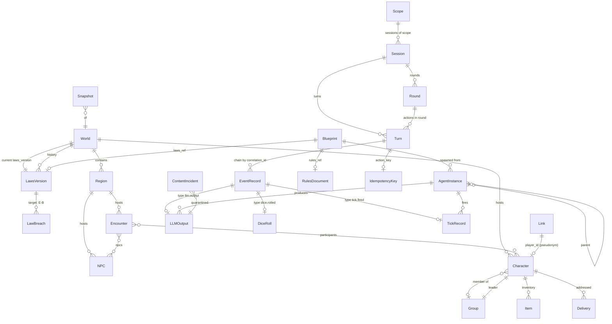
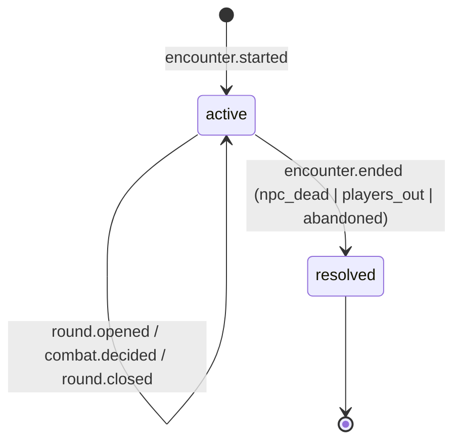
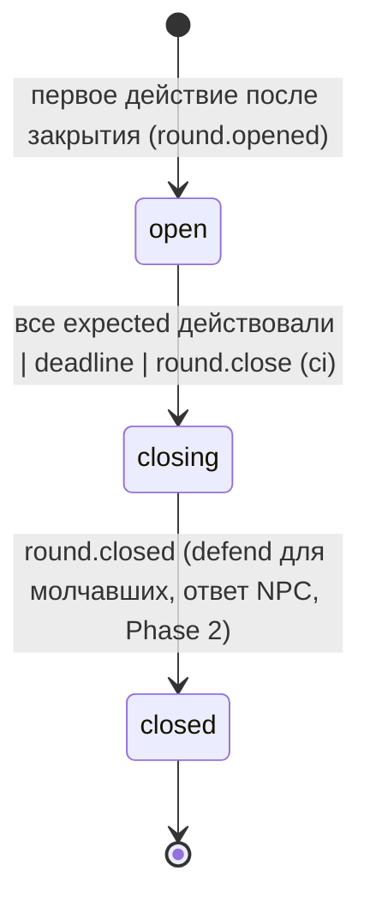
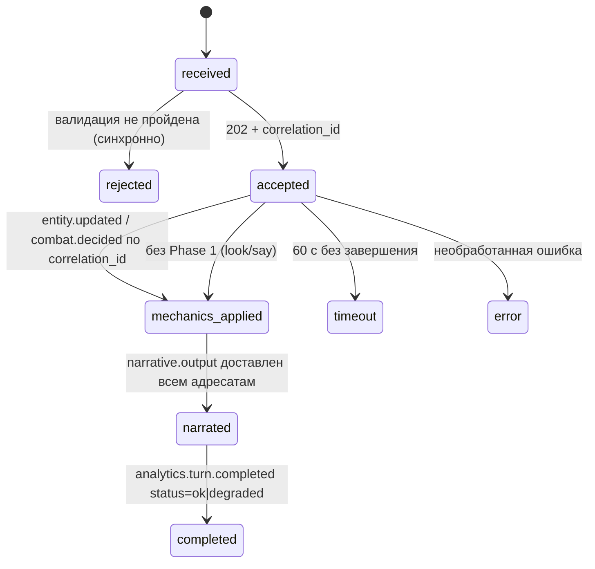
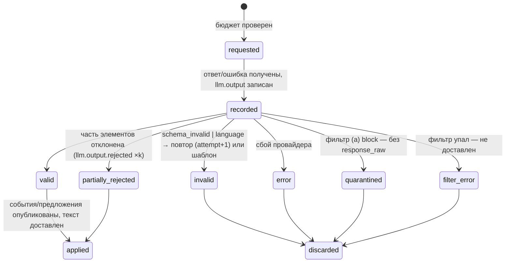
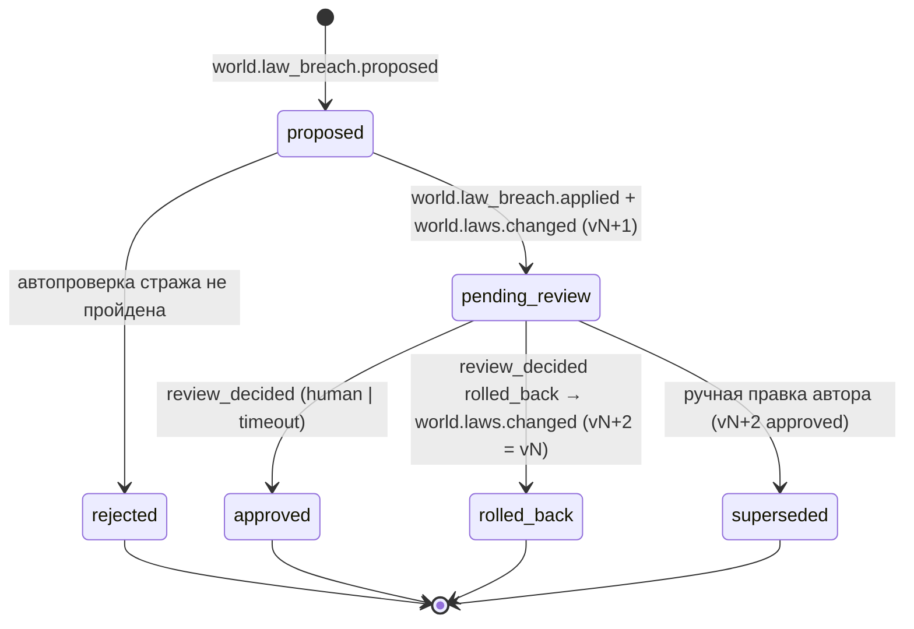

# Модель данных

**Инициатива:** PROJECT · **Этап:** A4 (планирование) · **Версия:** 0.2.1 · 2026-09-09 · системный аналитик (dev-team); точечные правки v0.2.1 — system-architect (сведение 3, `architecture/consolidation.md` §14; system-analyst не запущен)
**Основание:** `requirements/prd.md` v0.2 §7 «Данные», FR-030…FR-036, FR-045, FR-060, FR-085, приложение A; `domain-review.md` §3; `glossary.md` v0.2; `metrics.md` §4; аудит as-is (`architecture/audit-facts.md` §4–5: `entities-{world}`, `shared/entity`, структура `eventbus.Event`); решения G1; **v0.2** — `contracts.md` v0.2 (C-01, C-02, C-07, C-08, C-14), ADR-007 (конверт `meta`), ADR-009 дополнение п. 2 (`link_id`), ADR-019 (`links.db`/`gateway.db`), ADR-020 (раунды), решения G2.

Модель концептуально-логическая: типы — логические (`string`, `int`, `timestamp`, `enum`, `ref`, `list`, `map`), без привязки к хранилищу. Выбор хранилищ — `integrations.md` §3 и архитектор (ADR-004, ADR-019, ADR-021). Имена компонентов v0.1 → v0.2: `entity-manager` = **State** (`internal/state`), `game-service` = **gateway** (`internal/gateway`), `рантайм роя` = **Swarm**, `semantic-memory` = **memory** (005-memory, отрезаема).

### Изменения v0.2 (changelog)

| Раздел | Изменение | Основание |
|---|---|---|
| §5.1, §5.1a, §9.10 | `Link.link_id` (ULID) — суррогат связки и ключ идемпотентности создания персонажа; новая запись `CharacterRequest` в `links.db`; `previous_player_ids` не хранится | ADR-009 дополнение п. 2, C-08 v1.1 |
| §5 (интро), §5.5, §5.6 | Разделение хранилищ: `links.db` (только связки, `character_requests`) и `gateway.db` (всё остальное) — в `gateway.db` **нет ни одного поля с внешним ID**; `Delivery.route` без внешнего ID вне `links.db` | ADR-019 п. 4, SEC-03 |
| §5.4 | `Round` по ADR-020: durable-таблица, `missed_rounds` в `group_participation`, `expected` формула | ADR-020 |
| §7.0 (новый), §7.1 | Конверт с `meta` (сквозные поля вне `payload`); таблица «тип → топик → retention» синхронизирована с `api-contracts.md` §2.2 | ADR-007 п. 1, 4 |
| §7.2–§7.4 | `LLMOutput`: `correlation_id/agent/actor_kind/replay/gm_path` → `meta`, + `parse{}`, `error.code=yielded`; `DiceRoll`: seed-функция, топик `game_events`; `tick.fired.lod_allowed` обязателен | C-03, C-06, C-07 v1.1 |
| §8 | Компоненты снапшотов `state\|swarm\|gateway`; `latest.json` — указатель; `cursor{topic: next_offset}`; протокол старта через `Journal` | C-14 v1.1 |
| §11 | Retention 30/90/180 дней; промпты по флагу ≤ 30 дн. | решение пользователя U-3 |
| **v0.2.1 (сведение 3, system-architect)** §3.3, §4, §9.1 | Статус `abandoned` персонажа (FR-061): терминальный, переход только `alive → abandoned` по предложению gateway `cause=forget`; строка gateway в таблице владения дополнена `Character.status → abandoned`, `Group.leader_id` | C-02 v1.2, C-04 v1.1 (З-2) |
| v0.2.1 §3.6, §9.4 | `Group.leader_id` nullable (живых участников нет) | C-04 v1.1, BR-13 v0.4 (З-4) |
| v0.2.1 §5.2, §9.5 | `Session.end_reason` + `forget` | C-10 v1.1, FR-061 (З-1) |
| v0.2.1 §7.2, §9.7 | `LLMOutput.validation_status` — единый enum из 6 значений; `rejected_*`/`budget_exceeded` как статусы удалены; опц. `reasons[]` | C-07 v1.2, ADR-017 доп. 1 (TL2-1) |

---

## 1. Принципы модели

1. **Три класса данных.** (а) *Состояние сущностей* — единственный писатель entity-manager, истина в снапшоте; (б) *журнал событий* — append-only, источник догона после снапшота, аудита и replay; (в) *приватные и служебные данные* — связки ПДн (отдельное удаляемое хранилище game-service), сессии/раунды/идемпотентность/outbox (game-service), рантайм роя (агенты, расписание, бюджет).
2. **Всё, что меняет состояние, — событие.** Предложение (`*.proposed`) → факт (`entity.updated`/`entity.created`/`entity.update.rejected`). Сущности версионируются монотонно (`version`); конфликт — по версии.
3. **Псевдоним внутри.** `player_id` — единственный идентификатор игрока в состоянии, журнале, индексах, промптах. Внешние идентификаторы — только в `Link`.
4. **Record-replay.** `LLMOutput`, `DiceRoll`, `Tick`, `RoundClose` — записи журнала, не сущности состояния; при replay читаются.
5. **Слои консистентности** — атрибут факта: `authored` (блупринт) / `validated` (канон) / `generated` (LLM); законы — версионированный документ `laws@vN`.
6. **Ссылка на сущность** везде в формате `{"entity":{"id","type"}}` (как в `shared/eventbus.EntityRef`).

---

## 2. Обзор: ER-диаграмма

Владение (кто пишет): **State** (`entity-manager` v0.1) — `World`, `Region`, `Character`, `NPC`, `Item` (внутри `Character`), `Group`, `Encounter`; **gateway** (`game-service` v0.1) — `Link` и `CharacterRequest` (отдельное хранилище `links.db`), `Session`, `Turn`, `Round`, `GroupParticipation`, `IdempotencyKey`, `Delivery` (`gateway.db`); **Swarm** — `AgentInstance`, расписание тиков, счётчики бюджета; **Git/автор** — `Blueprint`, `RulesDocument`, `LawsVersion v1`; **фикстуры** (`testdata/fixtures/*.json`, решение G2) — начальное состояние `World`, `Region`, `NPC`, фикстурных `Character` через `mvctl world init --fixtures`; **журнал** — `EventRecord`, `LLMOutput`, `DiceRoll`, `TickRecord`, `RoundClose`, `AnalyticsRecord`, `ContentIncident`; **каждый stateful-компонент** (`state`, `swarm`, `gateway`) — свой `Snapshot`.

---

## 3. Сущности состояния мира (writer: entity-manager)

Общие атрибуты всех сущностей состояния (`EntityBase`):

| Атрибут | Тип | Обяз. | Описание | Ограничения |
|---|---|---|---|---|
| `id` | string | да | Идентификатор; уникален в мире | `[a-z0-9-:]`; формат по типу (`player-…`, `wolf-…`, `group-…`, `enc-…`) |
| `type` | enum | да | `world, region, player, npc, group, encounter` (целевое: `city, item, actor…`) | из реестра типов |
| `world_id` | ref World | да (кроме `world`) | Принадлежность миру | существует |
| `name` | string | да | Отображаемое имя (для `player` — имя персонажа, введённое игроком) | 2–32 символа для `player` |
| `version` | int | да | Монотонная версия; +1 на каждое применённое изменение | optimistic lock |
| `created_at`, `updated_at` | timestamp | да | | UTC |
| `last_event_id` | ref EventRecord | да | Событие, применившее последнюю версию | для сверки снапшота с журналом |
| `history[]` | list {version, event_id, changed[], at} | нет | История изменений (как в `shared/entity` сейчас) | объём — см. §8 |

### 3.1. World

| Атрибут | Тип | Обяз. | Описание | Ограничения |
|---|---|---|---|---|
| `laws_version` | string | да | Действующая версия законов, `v1` | меняется только `world.laws.changed` |
| `weather` | enum | да | `clear, cloudy, rain, storm, fog…` (словарь блупринта) | владелец: глобальный GM |
| `time_of_day` | enum | да | `dawn, day, dusk, night` | владелец: глобальный GM |
| `day` | int | да | Игровой день от создания мира | ≥ 1, монотонно |
| `season`, `epoch` | string | нет | Целевое | |
| `blueprint_ref` | string | да | Имя+версия блупринта мира/глобального GM | |
| `locale` | string | да | `ru` | |

### 3.2. Region

| Атрибут | Тип | Обяз. | Описание | Ограничения |
|---|---|---|---|---|
| `description` | text | да | Авторское описание (слой `authored`) | из блупринта |
| `canon[]` | list {fact, source, version} | нет | Факты канона региона; MVP-1 — только `authored` | |
| `npc_ids[]` | list ref NPC | да | NPC региона | |
| `respawn_ttl` | duration | да | Кулдаун возрождения убитого NPC (24 ч по умолчанию) | |
| `perception_radius` | number | нет | Радиус обнаружения (абстрактные единицы; MVP-1 — «весь регион») | |
| `players_present[]` | list ref Character | да | Игроки в регионе (проекция позиций) | производное; проверяется инвариантом |
| `last_background_event_at` | timestamp | нет | Для сводки/метрик | |
| `blueprint_ref` | string | да | `domain-dark-forest@1.0` | |

### 3.3. Character (тип `player`)

| Атрибут | Тип | Обяз. | Описание | Ограничения |
|---|---|---|---|---|
| `id` = `player_id` | string | да | Псевдоним; новый при новом персонаже | не выводится из внешнего ID |
| `hp`, `hp_max` | int | да | 10/10 на старте | `0 ≤ hp ≤ hp_max` (инвариант 2) |
| `atk`, `def`, `dmg`, `flee` | int / формула | да | Из правил боя (`+2`, `12`, `d6`, `+2`) | копия из `RulesDocument` при создании; меняются только правилами |
| `status` | enum | да | `alive, dead, abandoned, ascended_final` (`abandoned` — покинутый после `/forget`, FR-061; сведение 3) | терминальные: `dead`, `abandoned`, `ascended_final`; `abandoned` только из `alive`, предлагает gateway (`cause=forget`), для inv-01/целей NPC/scope = `dead` |
| `position` | string | да | `outside:{world_id}` или `region_id` | ровно одна (инвариант 10) |
| `scope` | ScopeRef | да | `solo:{player_id}` или `group:{group_id}` | ровно один (инвариант 6) |
| `group_id` | ref Group | нет | Если в группе | согласовано с `Group.members` |
| `encounter_id` | ref Encounter | нет | Активная встреча | |
| `inventory[]` | list Item | да | Пусто на старте | |
| `actor_kind` | enum | да | `human, ci, sim` — задаётся при создании | не меняется |
| `created_by_link` | — | — | **Не хранится**: связь только со стороны `Link` | приватность |
| `last_session_ended_at` | timestamp | нет | Для сводки «пока тебя не было» (проекция `analytics.session.ended`) | может жить в game-service |

Значения `atk/def/dmg` дублируются в сущности намеренно: правила боя — данные, а версия правил на момент создания фиксируется (целевое: `rules_version`).

### 3.4. NPC (тип `npc`)

| Атрибут | Тип | Обяз. | Описание | Ограничения |
|---|---|---|---|---|
| `kind` | string | да | `wolf` | из таблицы NPC блупринта региона |
| `region_id` | ref Region | да | Домашний регион | владелец: GM региона |
| `hp`, `hp_max`, `atk`, `def`, `dmg` | как у Character | да | 10/10, +3, 11, d4 | |
| `status` | enum | да | `alive, dead` | |
| `position` | string | да | `region_id` (MVP-1 без координат) | |
| `died_at` | timestamp | нет | Для кулдауна возрождения | |
| `killed_by` | ref Character | нет | Для трофея и памяти | |
| `loot[]` | list {item_kind, name} | да | `wolf-pelt «волчья шкура»` | выдаётся ≤ 1 раза (инвариант 3) |
| `spawned_by` | {agent, tick_event_id} | нет | Кто породил | |

### 3.5. Item (значение внутри `Character.inventory`; целевое — сущность)

| Атрибут | Тип | Обяз. | Описание |
|---|---|---|---|
| `item_id` | string | да | Уникален в мире |
| `kind` | string | да | `wolf-pelt` |
| `name` | string | да | «волчья шкура» |
| `source{entity, event_id}` | ref | да | NPC-источник и `combat.decided` последнего удара — доказательство единственности трофея |
| `acquired_at` | timestamp | да | |

### 3.6. Group (тип `group`)

| Атрибут | Тип | Обяз. | Описание | Ограничения |
|---|---|---|---|---|
| `leader_id` | ref Character \| null | да (nullable) | Создатель; переходит к старейшему `alive` при выходе/смерти/отвязке (`cause: leave\|death\|forget`); **`null`, если живых участников нет** (BR-13 v0.4; сведение 3, З-4) — группа без лидера до `disbanded`, перемещение недоступно (`409 no_leader`) | ∈ `members` со статусом `alive` либо `null` |
| `members[]` | list {player_id, joined_at, participation: active\|idle, missed_rounds: int} | да | | `1 ≤ count ≤ 6` (инвариант 5) |
| `position` | string | да | Позиция группы | = позиции каждого участника (инвариант 4) |
| `scope` | ScopeRef | да | `group:{id}` | |
| `encounter_id` | ref Encounter | нет | | |
| `state` | enum | да | `forming, active, disbanded` | |

### 3.7. Encounter (тип `encounter`)

| Атрибут | Тип | Обяз. | Описание | Ограничения |
|---|---|---|---|---|
| `region_id` | ref Region | да | | |
| `scope` | ScopeRef | да | Scope игрока/группы, для которого открыта встреча | один NPC — одна активная встреча |
| `participants[]` | list {player_id, state: in_combat\|out_of_combat\|idle\|dead, damage_dealt: int, last_hit_at} | да | | |
| `npcs[]` | list {npc_id, last_damager: ref Character} | да | | |
| `state` | enum | да | `active, resolved` | |
| `resolution` | enum | нет | `npc_dead, players_out, abandoned` | |
| `round_seq` | int | да | Номер текущего раунда (координатор — game-service, проекция) | |
| `task_agent_id` | ref AgentInstance | нет | | |
| `opened_by_event_id`, `closed_by_event_id` | ref EventRecord | | | |

---

## 4. Таблица владения по уровням роя (кто что может предлагать)

| Инициатор предложения | Может менять | Не может | Отказ |
|---|---|---|---|
| game-service / gateway (действие игрока, `actor_kind` сессии, без `meta.agent`) | `Character.position` (enter/leave), `scope`, `group_id`; **`Character.status: alive → abandoned` (только `cause=forget`, `/forget`; сведение 3)**; `Group.*` (включая `leader_id = null`); создание `player`, `group` | HP (кроме `rest` через механику), NPC, мир; `status` иных переходов | `dead_entity` при `abandoned` над `dead`/`ascended_final` |
| Механика (Rule Engine) по действию игрока или ответу NPC | `Character.hp/status/position(flee)/inventory(loot)`, `NPC.hp/status/died_at/killed_by`, `Encounter.participants/npcs` | атрибуты мира/региона | `level_violation` |
| Глобальный GM (`global`) | `World.weather/time_of_day/day/season/epoch`; `laws_version` — только через пробой (E-B) | регион, NPC, игроки | `level_violation` |
| GM региона (`domain`) | `Region.*` (кроме `description` — авторское), `NPC` региона (создание, позиция, статус при фоновой жизни — но не убитых игроком до `respawn_ttl`), создание `Encounter` | мир, игроки (HP/позиция/инвентарь/статус) | `level_violation` |
| Task-агент встречи (`task`) | только через механику: `Encounter`, HP/статус участников и NPC встречи | вне встречи | `level_violation` |
| Персональный GM (`task`/`monitor`) | ничего | всё | `level_violation` / `player_agency` |
| entity-manager (сам) | `version`, `history`, `updated_at`, `last_event_id` | — | — |
| Автор (блупринт/CLI) | всё (при загрузке блупринта, `laws@vN+1 approved`) | — | — |

---

## 5. Приватные и служебные данные gateway

Два физически раздельных хранилища (ADR-019, ADR-009 дополнение п. 2): **`links.db`** — только `Link` и `CharacterRequest` (единственное место с внешним ID; `secure_delete`, checkpoint+vacuum сразу после `/forget`, именованный том, бэкап ≤ 30 дн. по политике оператора); **`gateway.db`** — `Session`, `Turn`, `Round`, `GroupParticipation`, `IdempotencyKey`, `Delivery`, `PendingCharacter` — **ни одного поля с внешним ID** (только `player_id` и `link_id`); тест NFR-041 сканирует оба файла и WAL. Ни одно из них не попадает в шину, снапшоты мира и индексы.

### 5.1. Link (связка ПДн; **отдельное удаляемое хранилище** `links.db`, никогда не в шине/снапшотах мира)

| Атрибут | Тип | Обяз. | Описание | Ограничения |
|---|---|---|---|---|
| `link_id` | string (ULID) | да | Суррогат связки; присваивается при первом `POST /v1/links/resolve`; **ключ идемпотентности создания персонажа** (`CharacterRequest`) и единственный идентификатор связки вне `links.db` | случаен, необратим; хранится только здесь и в `gateway.db` (как ссылка без внешнего ID); клиенту не выдаётся |
| `external_platform` | enum | да | `telegram` (целевое `discord`) | |
| `external_id` | string | да | ID аккаунта в платформе (для `ci`/`sim` — имя фикстуры) | уникален вместе с `platform`; хранится **только здесь** |
| `player_id` | ref Character | нет | Текущий живой персонаж; пусто до создания | один живой на связку |
| `previous_player_ids[]` | — | — | **Не хранится в MVP-1** (ADR-009 п. 2); «продолжить историю» — целевое | |
| `world_id` | ref World | нет | Мир текущего персонажа | |
| `status` | enum | да | `pending_consent, consented` (удалённая запись физически отсутствует) | |
| `notice_shown_at` | timestamp | да при `consented` | Показ уведомления об ИИ | |
| `consent_at` | timestamp | да при `consented` | Согласие на обработку | |
| `age_confirmed_at` | timestamp | да при `consented` | Подтверждение 18+ | |
| `last_seen_at` | timestamp | да | Для повторного показа через 30 дней | |
| `created_at` | timestamp | да | | |

Username, имя профиля, фото — **не хранятся**. Allowlist Telegram user id (`MV_TELEGRAM_ALLOWED_USER_IDS`) живёт в конфигурации бота, не в `links.db`. Удаление (`/forget`, оператор) — физическое, каскадно удаляет `CharacterRequest`; обратный поиск `player_id → external_id` после удаления невозможен по построению (нет другой копии).

### 5.1a. CharacterRequest (идемпотентность `POST /v1/characters`; хранится в `links.db`)

| Атрибут | Тип | Описание |
|---|---|---|
| `link_id`, `action_key` | string | ключ (вместо `external_id + action_key` v0.1) |
| `player_id` | ref Character | назначенный псевдоним |
| `correlation_id`, `response` | | что вернуть при повторе (`201`/`200`/`202 creating`) |
| `created_at`, `expires_at` | timestamp | TTL 24 ч |

HMAC внешнего ID не нужен: `link_id` случаен (ADR-009 дополнение п. 2).

### 5.2. Session

| Атрибут | Тип | Описание |
|---|---|---|
| `id` | string | `"{scope.id}:{started_at_unix}"` |
| `scope` | ScopeRef | `solo:…` / `group:…` |
| `kind` | enum | `solo, group` |
| `actor_kind` | enum | `human, ci, sim` — от первого действия |
| `participants[]` | list ref Character | |
| `started_at`, `ended_at`, `last_action_at` | timestamp | |
| `end_reason` | enum | `leave, idle, death, error, forget` (`forget` — закрытие каскадом `/forget`, FR-061; C-10 v1.1, сведение 3) |
| `turns_count`, `turns_degraded`, `turns_failed` | int | |
| `state` | enum | `active, ended` |

### 5.3. Turn (ход)

| Атрибут | Тип | Описание |
|---|---|---|
| `correlation_id` | string | = `event_id` события действия |
| `session_id`, `seq` | | порядковый номер в сессии с 1 |
| `player_id`, `scope` | | |
| `action{type, target, text_len}` | | текст `say` в `Turn` не хранится (только в событии) |
| `status` | enum | `received, accepted, mechanics_applied, narrated, completed, rejected, timeout, error, degraded` |
| `timings{received_at, acked_at, mechanics_at, narrative_at}` | timestamps | |
| `gm_path`, `phase1_mode`, `lod` | | |
| `narrative{generated_by, agent_level, fallback_reason, filter_applied}` | | |
| `delivery{recipients_count, delivered_count, result_event_id, narrative_event_id}` | | |
| `absence{since_at, background_events_count, surfaced_event_ids[]}` | | только для `enter` |
| `round_seq` | int | для group |

### 5.4. Round (раунд scope `group`; координатор — gateway, ADR-020: память + durable-таблица `rounds` в `gateway.db`, запись при каждом переходе)

| Атрибут | Тип | Описание |
|---|---|---|
| `scope`, `encounter_id`, `seq` | | один открытый раунд на scope (уникальность) |
| `state` | enum | `open, closing, closed` |
| `expected[]`, `acted[]{player_id, event_id, at}`, `auto_defended[]`, `idle[]` | | `expected = members ∩ alive ∩ participation=active ∩ ¬out_of_combat`, пересчёт при `entity.updated` группы/встречи/игрока |
| `timeout`, `idle_after_missed` | duration, int | из `encounter.started.round{}`; иначе значения по умолчанию env gateway |
| `opened_at`, `deadline_at`, `closed_at` | timestamp | при replay — из `round.opened/closed` |
| `close_reason` | enum | `all_acted, timeout, explicit`; `NULL` при `state=closed` — раунд прерван `encounter.ended` |
| `opened_event_id`, `closed_event_id` | ref | идемпотентность публикации `round.closed` для `(scope, seq)` |
| `narrative_event_id` | ref | один на раунд |

**GroupParticipation** (`gateway.db`): `group_id, player_id, missed_rounds: int` — счётчик пропусков; при `missed_rounds ≥ idle_after_missed` gateway предлагает `Group.members[p].participation=idle` (`cause=group`, с `expected_version`); первое действие → `active`, `missed_rounds=0`.

### 5.5. IdempotencyKey (действия; `gateway.db`)

| Атрибут | Тип | Описание |
|---|---|---|
| `player_id`, `action_key` | string | ключ (клиентский UUID или производная от `update_id` мессенджера); внешний ID в ключе не участвует |
| `correlation_id`, `response` | | что вернуть при повторе (включая `4xx`, если был); при `503 bus_unavailable` ключ не записывается |
| `expires_at` | timestamp | 24 ч |

Идемпотентность создания персонажа — отдельная запись `CharacterRequest` в `links.db` (§5.1a) с ключом `(link_id, action_key)`.

### 5.6. Delivery (outbox; `gateway.db`)

| Атрибут | Тип | Описание |
|---|---|---|
| `id`, `player_id`, `platform` | | платформа — из `Link` в момент постановки (для маршрутизации клиенту нужной платформы); **внешний ID не хранится** — `route.external_id` подставляется из `links.db` только в момент выдачи и только клиенту той же платформы (C-08 v1.1) |
| `kind` | enum | `ack, mechanics, narrative, world_event, group, system` |
| `payload{text, generated_by, fallback_reason?, correlation_id, event_id, round_seq, narrative_event_id?, data?}` | | |
| `state` | enum | `pending, leased, delivered, dropped` — одна доставка в лизинге на `player_id`, повтор без ack через 30 с |
| `created_at`, `delivered_at`, `expires_at` | | недоставленное истекает (конфигурация; ≥ 24 ч); после `/forget` → `dropped` |

---

## 6. Рантайм роя (writer: рантайм Agent GM Core)

### 6.1. Blueprint (файл в Git; см. `api-contracts.md` §3)

| Атрибут | Тип | Описание |
|---|---|---|
| `name`, `version` | string | `domain-dark-forest@1.0` |
| `level` | enum | `global, domain, task, monitor` (+ `object` целевое) |
| `role` | enum | `global-gm, region-gm, city-gm (целевое), personal-gm, encounter` |
| `scope_binding` | {type, id\|pattern} | к чему привязан экземпляр |
| `parent` | ref Blueprint | |
| `trigger` | {type: timer\|event, intervals{idle, active}, event_name, conditions[]} | |
| `ttl`, `max_instances` | | |
| `llm{phase1, phase2, tick}` | {model, temperature, max_tokens, thinking, schema_ref} | модель на фазу |
| `allowed_event_types[]`, `owned_entity_types[]`, `tools[]` | list | белые списки |
| `rules_ref`, `laws_ref`, `canon[]`, `description`, `npc_table[]`, `background_events[]`, `invariants[]`, `respawn_ttl` | | для `domain`/`global` |
| `prompts{system, phase1, phase2, tick}` | text | |
| `locale` | string | |
| `content_hash` | string | для `agent.blueprint_version` в событиях |

### 6.2. AgentInstance

| Атрибут | Тип | Описание |
|---|---|---|
| `id` | string | `{blueprint}:{scope.id}` (детерминированный — гарантирует `max_instances=1`) |
| `blueprint`, `blueprint_version` | | |
| `level`, `role` | enum | |
| `scope` | ScopeRef | `world:…`, `region:…`, `solo:…`/`group:…` (персональный GM — `solo:{player_id}` даже в группе, плюс `group_id` в контексте) |
| `parent_id` | ref | |
| `state` | enum | `initializing, running, paused, finishing, finished` (как `AgentLifecycleState` в коде) |
| `lod` | enum | `disabled, rule-only, basic, full` |
| `expires_at` | timestamp | TTL (не для `global`/`domain`) |
| `tick_seq`, `last_tick_at`, `next_tick_at`, `tick_mode` | | `background`/`active` |
| `laws_version` | string | загруженная версия законов |
| `context{entities[], memory_ref, observed_players[]}` | | |
| `budget{window_start, llm_calls}` | | счётчик на **мир** (общий для фоновых агентов) — хранится у планировщика |

### 6.3. RulesDocument (файл `rules/dark-forest.yaml`)

`rules_version`, `entities{player{hp_max, atk, def, dmg, flee}, wolf{…}}`, `attack{hit: "d20 + atk >= def", crit_natural: 20, crit_multiplier: 2, fumble_natural: 1, damage_formula: dmg}`, `flee{formula: "d20 + flee >= 10 + living_enemies"}`, `rest{restore: hp_max, allowed_in_encounter: false}`, `npc_target{order: [last_damager, min_hp, player_id_asc], exclude: [idle, out_of_combat, dead]}`, `loot{wolf: [{kind: wolf-pelt, name: "волчья шкура"}]}`, `invariants[]` (NFR-020).

### 6.4. LawsVersion (`laws@vN`)

| Атрибут | Тип | Описание |
|---|---|---|
| `version` | string | `v1`, `v2`… |
| `world_id` | ref | |
| `laws[]` | list {id, text, kind: invariant\|declarative, source: author\|breach, strain: int (целевое)} | MVP-1: инварианты NFR-020 (1–10) как первые законы + декларативные из блупринта |
| `status` | enum | `approved, pending_review, rolled_back, superseded` |
| `based_on` | ref LawsVersion | |
| `created_by` | enum | `author, breach` |
| `created_at`, `review_deadline_at`, `decided_at` | timestamp | целевое |

### 6.5. LawBreach (целевое, E-B; контракт зарезервирован)

`id, world_id, initiator{kind: agent|author|player_indirect, agent}, cause_event_ids[], strain, laws_removed[], laws_added[], canon_invalidated[], narrative_hook, laws_version_base, laws_version_applied, state (proposed, rejected, applied/pending_review, approved, rolled_back, superseded), review{reviewer_kind: human|timeout, decided_at, decision}`.

---

## 7. Журнал событий (append-only)

### 7.0. Топики, типы, retention (синхронизировано с `api-contracts.md` §2.2; ADR-007 п. 4, решение U-3)

| Топик | Типы записей | Retention | Читается в replay |
|---|---|---|---|
| `player_events` | `player.*`, `group.entered_region`, `group.left_region` | 30 дн. | да |
| `game_events` | `group.*` (кроме перемещений), `round.*`, `combat.decided`, `dice.rolled` | 30 дн. | да |
| `world_events` | `world.*`, `region.*`, `npc.*`, `encounter.*`, `world.laws.*`, `world.law_breach.*` | 30 дн. | да |
| `system_events` | `entity.*`, `tick.*`, `agent.*`, `snapshot.created`, `content.incident.recorded`, `config.*` | 30 дн. | да |
| `narrative_output` | `narrative.output` | 30 дн. | да (доставка) |
| `llm_records` | `llm.output`, `llm.output.rejected` | 90 дн. | да (record-replay) |
| `analytics_events` | `analytics.*` | 180 дн. | нет |
| `dead_letters` | `{original, error, consumer}` | 30 дн. | нет |

Одна партиция на топик (строгий порядок внутри топика, ключ `world.entity.id`); между топиками порядок не гарантируется — причинность по `meta.correlation_id`/версии сущности. Журнал читается двумя способами (C-01): «живые» подписки (consumer group) и `Journal.ReadRange/Tail/End` по офсетам (догон с курсора снапшота).

### 7.1. EventRecord (структура события — `shared/eventbus.Event` с конвертом `meta`, ADR-007 п. 1)

| Атрибут | Тип | Обяз. | Описание |
|---|---|---|---|
| `id` | string (UUID; в e2e — последовательность) | да | |
| `type` | string | да | из реестра `shared/contracts` (`api-contracts.md` §2.2) |
| `timestamp` | timestamp | да | у производных событий — наследуется от причины при replay; у фактов State = `timestamp` предложения |
| `source` | string | да | издатель (`core/state`, `core/swarm`, `gateway` …) |
| `world{entity{id,type:world}}` | ref | да (кроме служебных) | ключ сообщения |
| `scope{id,type}` | ScopeRef | по типу | `solo, group, region, world` (`city, quest` зарезервированы) |
| `meta{schema_version, correlation_id, causation_id?, causation_type?, actor_kind, agent?{id,level,blueprint,blueprint_version}, replay, locale, gm_path}` | map | да | **сквозные поля** (в v0.1 были в `payload`); `agent` обязателен у событий Swarm, запрещён в `player_events` |
| `payload` | map | да | **только доменные поля** по схеме типа: `entity{entity{id,type},name}`, `target{…}`, `laws_version`, `round`, `encounter` и т. д.; `trigger{event}` v0.1 не используется (→ `meta.causation_*`) |
| `relations[]` | list | нет | рёбра для графа памяти |

Схемы: `schemas/events/<type>.v<n>.json` (JSON Schema 2020-12), общие определения `schemas/events/_common.json`; валидация при публикации и при чтении.

### 7.2. LLMOutput (`llm.output`, топик `llm_records`)

Сквозные поля `correlation_id`, `caused_by` (= `meta.causation_*`), `agent`, `actor_kind`, `replay`, `gm_path` — в `meta` (из payload убраны, v0.2). Ключ записи для replay: `(meta.correlation_id, meta.agent.id, phase, attempt)`.

| Атрибут | Тип | Обяз. | Описание | Ограничения |
|---|---|---|---|---|
| `phase` | enum | да | `decision, narrative, tick, other` (целевое: `evaluation, intent, breach`) | |
| `attempt` | int | да | 1..N | |
| `provider`, `model`, `params{temperature, max_tokens, thinking, format}` | | да | | |
| `prompt_hash` | string | да | полный промпт — по флагу в локальном хранилище | |
| `response_raw` | text | условно | **отсутствует** при `validation_status=quarantined` | |
| `response_hash`, `response_len` | | да | | |
| `validation_status` | enum | да | **`valid, partially_rejected, invalid, error, quarantined, filter_error`** (единый enum, C-07 v1.2 / ADR-017 доп. 1; сведение 3). Причины отклонения — только в `llm.output.rejected.reason` (`unknown_entity, player_agency, level_violation, schema_invalid, language, filter_blocked, filter_error, budget_exceeded, law_violation, other`); `budget_exceeded` — `rejected` без `llm.output`; значения `rejected_*`, `budget_exceeded` как статусы удалены | `invalid` — схема/язык/устаревшая `laws_version`/все элементы отброшены; `error` — ответа нет |
| `reasons[]` | list enum | нет | множество `reason` связанных `llm.output.rejected` (денормализация для отчётов; C-07 v1.2) | |
| `filter{applied, status: pass\|block\|error, filter_version}` | | при тексте | | |
| `laws_version` | string | да | | = `World.laws_version` в момент вызова |
| `latency_ms`, `tokens{prompt, completion}`, `cost_usd` | | да | `cost_usd = 0` для Ollama | |
| `lod` | enum | нет | | |
| `tools_used[]` | list | нет | | |
| `parse{strategy, recovered: bool}` | | нет | стратегия парсера при восстановлении JSON и признак «ответ починен» (ADR-016 п. 1, C-07 v1.1) | |
| `error{code, message}` | | при `error` | без текста ответа; `code=yielded` — фоновый вызов уступил очередь ходу (ADR-014 п. 2) | |

### 7.3. DiceRoll (`dice.rolled`, топик `game_events`; тип EPIC-002, публикует агент встречи до `combat.decided`)

`roll{index (0..), formula (d20, d6, d4), seed (десятичная строка uint64 — число JSON не переживает разбор в `map[string]any`), result, natural (для d20)}`, `purpose` (`hit, damage, flee, npc_hit, npc_damage, encounter_chance, background`), `roller{entity}`; причина — `meta.causation_id` (действие игрока или `round.closed`); `seed = SHA-256(causeEventID + ":" + index)[:8]` BigEndian, RNG `math/rand/v2` PCG(seed, 0) (C-03). `correlation_id`, `actor_kind`, `agent`, `replay` — в `meta`.

### 7.4. TickRecord (`tick.fired`) и RoundClose (`round.closed`)

`tick.fired`: `agent{…}`, `scope`, `tick{seq, mode: background|active, scheduled_at, fired_at, lod_allowed (обязателен, C-06)}`, `budget{window_calls, cap}`; корневое (`meta.correlation_id = id`, `meta.actor_kind = system`, по admin-запросу — `ci`).
`round.closed`: `scope`, `encounter{entity}`, `round{seq, close_reason}`, `acted[]{entity{player}, event{id}}`, `auto_defended[]`, `idle[]`, `closed_at`; корневое; самодостаточно для агента встречи (ADR-020).

### 7.5. AnalyticsRecord (`analytics.*`)

По `metrics.md` §4.2: `session.started/ended`, `turn.completed`, `consistency.violated`, `replay.completed`. Не участвуют в replay состояния; без текста и внешних ID.

### 7.6. ContentIncident (`content.incident.recorded`)

`correlation_id`, `agent`, `category: a`, `filter_version`, `llm_output_event_id`, `at`. Текста нет.

---

## 8. Снапшоты и восстановление

Формат (C-14 v1.1): объект `snapshots-{world}/{component}/{ts}-{seq}.json` — полный снапшот; **`snapshots-{world}/{component}/latest.json` — указатель** (`snapshot{id, seq, taken_at, cursor, laws_version, state_hash, size_bytes, key}`), пишется после успешного PUT объекта; `cursor{<topic>: <next_offset>}` по всем читаемым топикам; ротация K=5 в коде (не зависит от bucket versioning, ADR-021); событие `snapshot.created component ∈ state|swarm|gateway`.

| Компонент | Что в снапшоте | Что восстанавливается replay (после `cursor`) | Что не восстанавливается (и не нужно) |
|---|---|---|---|
| `state` (State, EPIC-002) | Все сущности мира (§3) с `version`, `laws_version`, `cursor`, `state_hash` (хэш по HP/инвентарю/позиции/статусу всех сущностей); при первом запуске — снапшот `seq 0` с `reason=bootstrap` после `mvctl world init --fixtures` | `entity.updated`/`entity.created` факты через `Journal.ReadRange(cursor → End)` (идемпотентно по `event_id`, версия строго `+1`); затем `analytics.replay.completed mode=recovery` | предложения (`*.proposed`) — не переигрываются |
| `swarm` (Swarm, EPIC-003) | `AgentInstance` (§6.2) всех живых агентов, `tick_seq`, `next_tick_at`, бюджет, `laws_version`, версии блупринтов (`content_hash`), `Dedup`, `cursor` | Проекция от `state/latest.json` + догон `entity.updated`; события scope после `cursor`; на точках недетерминизма — `llm.output` (ключ `meta.correlation_id + meta.agent.id + phase + attempt`), `dice.rolled` (`meta.causation_id + roll.index`), `tick.fired` (`agent + tick.seq`), `round.closed` (`scope + round.seq`) | LLM-вызовы, таймеры |
| `gateway` (EPIC-004) | Курсоры и проекции (`snapshots-{world}/gateway/`); `gateway.db` остаётся истиной для `Session`, `Round`, `IdempotencyKey`, `Delivery` | Проекция от `state/latest.json` + догон `entity.updated`; открытые раунды из `rounds` (таймер от `deadline_at`); `analytics.session.started` без `ended` → активные сессии | `Link` — не в снапшоте мира; `links.db` с собственным резервированием |
| memory (проекция; 005-memory, отрезаема) | не обязателен | полная перестройка индекса из журнала | — |

Инварианты снапшота: `state_hash_after == state_hash(снапшот) + применённые события`; `laws_version` снапшота = `World.laws_version`; «конец журнала» = `Journal.End` по всем читаемым топикам; разрыв журнала (retention) → восстановление из объектов сущностей + `/health degraded {log_gap}`.

---

## 9. Машины состояний

### 9.1. Character

```mermaid
stateDiagram-v2
    [*] --> creating : entity.create.proposed
    creating --> alive : entity.created
    alive --> alive : enter/leave/rest/look/say/attack/flee
    alive --> dead : entity.updated status=dead (hp=0)
    alive --> ascended_final : целевое (E-C)
    alive --> abandoned : entity.updated status=abandoned (cause=forget, /forget — предлагает gateway; сведение 3)
    dead --> [*]
    abandoned --> [*]
    ascended_final --> [*]
```

Под-состояния `alive`: `position ∈ {outside, region}`; `encounter ∈ {none, in_combat, out_of_combat}`; `participation ∈ {active, idle}` (только в группе); `scope ∈ {solo, group}`. Переходы `idle`: `active → idle` после двух подряд `player.defended cause=round_timeout`; `idle → active` первым действием.

### 9.2. Encounter

`abandoned` — все участники вышли из региона/сессии по TTL (Task-агент завершён по TTL).

### 9.3. Round (group)

### 9.4. Group

`forming` (создана, 1 участник) → `active` (≥ 2) ↔ `forming` (снова 1) → `disbanded` (0). Лидер: `leader_changed {cause: leave|death|forget}` при выходе/смерти/отвязке лидера — старейший `alive` по `joined_at`; если живых нет — `leader_id = null` и `leader_changed {leader: null}`, группа без лидера до `disbanded` (сведение 3, З-4). `dead`/`abandoned` участники остаются в `members[]` формально, вне `active`/`expected[]`/целей NPC.

### 9.5. Session

`active` → `ended{leave|idle|death|error|forget}` (`forget` — сведение 3, З-1). Открывается первым игровым действием; `idle` — по простою ≥ 30 мин (таймер game-service; при replay — из `analytics.session.ended`, не влияет на состояние мира).

### 9.6. Turn (действие)

### 9.7. LLMOutput

`budget_exceeded` — `llm.output.rejected` без `llm.output` (вызова не было). Шесть состояний диаграммы после `recorded` = enum `validation_status` §7.2 (сведение 3): `rejected_language` → `invalid` + `rejected reason=language`; `rejected_unknown_entity` и т. п. → `partially_rejected|invalid` + `rejected reason=…`.

### 9.8. LawsVersion / LawBreach (контракт MVP-1, механика E-B)

Ручная правка автора: `[*] → approved` напрямую (`world.laws.changed created_by=author`).

### 9.9. AgentInstance

`initializing → running ↔ paused → finishing → finished`; `global`/`domain` не переходят в `finished` по TTL; `task` (персональный GM, встреча) — по TTL/`agent.child_resolved`.

### 9.10. Link

`pending_consent → consented → (удалена)`; `link_id` присваивается при создании записи (первый `links/resolve`) и не меняется; `consented` с `player_id=null` → `consented` с `player_id` (создание персонажа; на время между `entity.create.proposed` и `entity.created` — `character_status=creating` в `PendingCharacter` `gateway.db`); смерть персонажа не меняет `Link.status`, только `player_id` при новом персонаже. Удаление каскадно уносит `CharacterRequest`.

### 9.11. Delivery

`pending → delivered | dropped (forget, expired)`.

---

## 10. Инварианты (проверяемые после каждого хода/тика; = `laws@v1` инварианты)

| # | Инвариант | Где проверяется |
|---|---|---|
| 1 | `dead`/`ascended_final` не действует и не выбирается целью | game-service (валидация), механика (выбор цели), entity-manager (предложение от/на мёртвого — `law_violation`) |
| 2 | `0 ≤ hp ≤ hp_max` | entity-manager (clamp + отказ при явном нарушении) |
| 3 | Трофей за NPC ≤ 1 (по `Item.source.entity`) | entity-manager |
| 4 | Позиция участника группы = позиция группы | entity-manager (пакетное применение), тест |
| 5 | `1 ≤ members ≤ 6` | game-service, entity-manager |
| 6 | Игрок ровно в одном scope | entity-manager |
| 7 | HP после `entity.updated` = `hp_after` из `combat.decided` | тест/`--audit` |
| 8 | Нет `combat.decided` против игрока без его действия в сессии (`trigger` цепочки ∈ `player.*`/`round.closed`) | страж конвейера, тест |
| 9 | NPC, убитый игроком, не возрождается ранее `respawn_ttl` (новый NPC — новый `id`) | GM региона, entity-manager (`npc.status dead → alive` запрещён) |
| 10 | Одна сущность — одна позиция | entity-manager |
| 11 | `laws_version` в `llm.output` = `World.laws_version` на момент вызова | страж |
| 12 | В журнале/снапшотах/индексах нет внешних ID | тест NFR-041 |

---

## 11. Объёмы и рост (MVP-1)

| Данные | Оценка | Рост | Retention / удаление |
|---|---|---|---|
| Сущности мира | ≤ 50 на scope; 1 мир, 1–3 региона, ≤ 10 NPC, ≤ 20 персонажей (с мёртвыми) | + новые персонажи/NPC | не удаляются; `dead` остаются в графе |
| События за ход | 6–12 (действие, 1–4 броска, 1–2 `combat.decided`, 1–3 `entity.*`, `llm.output`, `narrative.output`, `turn.completed`) | 30 ходов × 3 игрока ≈ 1 000 событий/сессия ≈ 2 МБ | доменные топики — **30 дней** (решение U-3; ≥ окна FR-127 и ≥ 3 интервалов снапшота); `analytics_events` — **180 дней**; `segment.ms=1d`, чтобы retention срабатывал при малом трафике |
| `llm.output` | ≤ 2/ход, ≤ 4/час фон; `response_raw` ≤ 4 КБ | ~100–200/сессия ≈ 1 МБ | `llm_records` — **90 дней**; полный промпт — в объектном хранилище `prompts-*` по флагу `MV_LLM_STORE_PROMPTS` (по умолчанию выкл.), ILM 30 дней, вне бэкапа |
| Снапшоты | мир ≤ 1 МБ | периодически (конфигурация) + по сессии | последние K=5 на компонент (ротация в коде) |
| Link, CharacterRequest | ≤ 10 записей | | удаление по `/forget` (физическое, `secure_delete`), бэкап `links.db` ≤ 30 дн. |
| Delivery | десятки в очереди | | истечение ≥ 24 ч |
| Семантический индекс | ≈ число событий | | перестраивается из журнала |

Право на забвение (целевое): события игрока помечены `player_id`; полное удаление требует шреддинга — решение архитектора (E-H).
