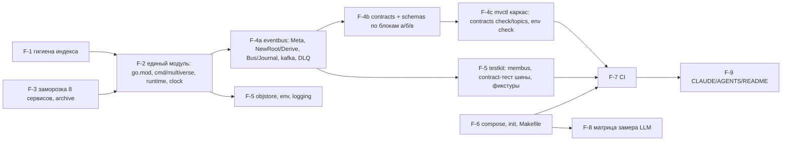

# Каркас фундамента (EPIC-001) — раскладка единого модуля и общие библиотеки

Версия 0.1 · 2026-09-09 · architect#1 (TEAM-1, волна 0) · статус: к ревью system-architect, затем tech-lead#1 нарезает F-1…F-9 в `epics/EPIC-001/tasks.md`.
Границы: `overview.md` §13–§16, §19; ADR-001 (модуль, `--contexts`), ADR-004 (хранилища), ADR-007 (конверт `meta`, реестр, топики), ADR-010 (тесты, CI); контракт C-01 (шина/реестр), C-14 (формат снапшотов — реализуется владельцами). Задача документа — чтобы разработчик волны 0 знал, **где что живёт** и **что делать с существующим кодом**, без вопросов «а куда это положить». Детали блока EPIC-002 — `state-and-mechanics.md`.

---

## 1. Раскладка единого модуля `multiverse-core.io`

```
go.mod                         module multiverse-core.io; go 1.25; toolchain go1.25.x (пин на текущий патч)
cmd/
  multiverse/main.go           один бинарник: --contexts, --mode, --bus, --recording, --id-source, --admin-addr
  telegram-bot/                EPIC-004
  mvctl/                       каркас CLI (cobra не нужен — стандартный flag + подкоманды); наполнение EPIC-005/003
internal/
  state/ mechanics/ replay/    EPIC-002 (state-and-mechanics.md)
  swarm/ llm/ laws/            EPIC-003
  gateway/                     EPIC-004
  memory/                      EPIC-005
shared/
  eventbus/                    C-01: конверт, Meta, NewRoot/Derive, Bus, Journal, kafka-адаптер, Dedup, middleware
  jsonpath/                    как есть
  contracts/                   реестр типов, Lookup/Validate/Topics/OwnershipRules, загрузка схем из schemas/
  entity/                      EPIC-002 (переписывается в волне 1; в волне 0 — только перенос в модуль)
  agent/                       EPIC-003 (типы; перенос в волне 0, переписывание в волне 1)
  objstore/                    единственный клиент MinIO (minio-go v7), buckets.go, ключи, versioning
  env/                         типизированное чтение env + манифест для сверки с .env.example (NFR-074)
  logging/                     slog JSON, обязательные поля, With(ctx), middleware шины
  clock/                       Clock, Timers, Real, Manual (интерфейсы времени; EventClock — internal/replay)
  runtime/                     Context, Deps, Mode, Status, Registry контекстов
  testkit/                     membus, Dedup-псевдоним, harness-каркас, фикстуры; фейки — в подпакетах владельцев
schemas/
  embed.go                     package schemas; //go:embed events/**/*.json agent/**/*.json → FS
  events/_common.json, _envelope.json, <type>.v<n>.json
  agent/                       EPIC-003
rules/ laws/ blueprints/ config/ api/ ops/ testdata/
build/Dockerfile               один multi-stage Dockerfile: ARG CMD=multiverse|telegram-bot|mvctl
docker-compose.yml, Makefile, .github/workflows/go.yml, .env.example, .mcp.env.example, .gitignore
services/<frozen>/FROZEN.md    8 замороженных сервисов (свой go.mod, вне сборки)
services/narrative-orchestrator/   профиль legacy (EPIC-003; свой go.mod, отдельная сборка в compose до S5)
Docs/archive/                  исторические документы
```

Правила: `internal/<a>` не импортирует `internal/<b>` кроме `swarm → mechanics|laws|llm`, `state → mechanics`; `internal/replay` импортирует только `cmd/multiverse`; `shared/*` не импортирует `internal/*`; `cmd/*` импортирует всё. Проверка — `depguard` в `golangci-lint` (конфиг `.golangci.yml`, правила по префиксам путей) в job `unit`.

---

## 2. `cmd/multiverse` — процесс из набора контекстов

```go
// флаги
--contexts=state,mechanics,swarm,llm,laws | gateway | memory | all        (обязателен)
--mode=live|replay                                                      (по умолчанию live)
--bus=kafka|memory                                                      (memory — только с --contexts=all; e2e)
--recording=<path.jsonl>                                                (replay: запись llm.output/действий)
--id-source=uuid|sequence                                               (sequence — детерминированные id в тестах)
--admin-addr=127.0.0.1:8090                                             (admin/health процесса core)
```

Порядок в `main`: `env.Load()` → `logging.Init(service=<из contexts>)` → сборка `runtime.Deps` (шина по `--bus`, `objstore`, `clock`/`timers` по `--mode`, `journal`, `contracts` реестр, `id` генератор) → `runtime.Registry` создаёт запрошенные контексты (фабрики регистрируются пакетами `internal/*` через `runtime.Register("state", state.New)`; `cmd/multiverse` импортирует все `internal/*` для регистрации) → `Start` в порядке зависимостей (`state` → `laws` → `mechanics` → `llm` → `swarm` → `gateway` → `memory`; контекст без зависимостей стартует сразу) → HTTP `/health` (агрегат `Status` всех контекстов; `agents_by_level` — секция swarm) → ожидание `SIGTERM` → `Stop` в обратном порядке с общим таймаутом 15 с.

`--contexts=all --bus=memory` — единственный процесс без Docker для e2e (ADR-010): те же фабрики, `membus` вместо Redpanda, `objstore` над `memstore`-адаптером (`objstore.Memory`), `--mode=replay`.

---

## 3. `shared/runtime`

```go
package runtime

type Mode string // "live" | "replay"
type Status struct { Status string /* ok|degraded|fail */; Details map[string]any }
type Deps struct {
    Bus       eventbus.Bus
    Journal   eventbus.Journal
    Store     objstore.Client
    Clock     clock.Clock
    Timers    clock.Timers
    Mode      Mode
    IDs       func() string            // генератор id событий (uuid | sequence)
    Log       *slog.Logger
    Env       env.Env
    Contracts *contracts.Registry
}
type Context interface {
    Name() string
    DependsOn() []string                 // имена контекстов, чьё Start должно завершиться раньше
    Start(ctx context.Context, deps Deps) error
    Stop(ctx context.Context) error
    Health() Status
}
func Register(name string, factory func() Context)
func New(names []string) ([]Context, error)   // упорядочивает по DependsOn, проверяет неизвестные имена
```

Один тип `Deps` для всех контекстов — контекст берёт нужное и игнорирует остальное; отсутствующая зависимость (например, `Store` в `memory`) — `nil` и ошибка `Start`, если контекст её требует.

---

## 4. `shared/clock`

```go
type Clock interface { Now() time.Time }
type Timer interface { C() <-chan time.Time; Stop() bool }
type Timers interface { After(d time.Duration) Timer; Every(d time.Duration) Timer }
type Real struct{}; type RealTimers struct{}
type Manual struct{ … }        // тесты: Set/Advance; ManualTimers срабатывают по Advance
```

Все контексты используют только эти интерфейсы; `time.Now()` в `internal/*` запрещён линтером (`forbidigo` правило `time\.Now` вне `shared/clock`). `EventClock` и `NullTimers` для replay — `internal/replay` (EPIC-002), внедряются `cmd/multiverse`.

---

## 5. `shared/eventbus` — библиотека шины с конвертом `meta` (C-01)

### 5.1. Файлы: что переиспользуется, что переписывается

| Файл as-is | Решение |
|---|---|
| `types.go` (`Event`, `EntityRef`, `WorldRef`, `ScopeRef`, `NewEvent`, `GetWorldIDFromEvent`, `GetScopeFromEvent`, `Path`) | **расширить**: поле `Meta Meta`; `NewRoot`/`Derive` рядом с `NewEvent` (`NewEvent` помечается `Deprecated`, остаётся для профиля `legacy`); `Publish*`-хелперы (`PublishEntityCreated` и т. п.) — **удалить** |
| `payload_types.go` (`EventPayload` билдер), `nested_payload.go` (`SetNested`, `Extract*`), `relations.go`, `relation_types.go` | **как есть** (тесты есть) |
| `eventbus.go` (`EventBus` над kafka-go: writer на топик, `Subscribe` с `MinBytes=10e3`, `MaxWait` из env, at-most-once) | **переписать** → `bus.go` (интерфейсы) + `kafka.go` (адаптер) |
| `topics.go` (константы 6 топиков, префиксы типов) | **переписать**: топики — из `contracts.Topics()`; константы имён топиков остаются для читаемости, `scope_management` удаляется, добавляются `llm_records`, `analytics_events`, `dead_letters` |
| `docs/`, `examples/`, `MIGRATION.md`, `README.md` | README переписать по факту; остальное — в `Docs/archive/` |

### 5.2. Конверт и конструкторы

```go
type Meta struct {
    SchemaVersion int       `json:"schema_version"`
    CorrelationID string    `json:"correlation_id"`
    CausationID   string    `json:"causation_id,omitempty"`
    CausationType string    `json:"causation_type,omitempty"`
    ActorKind     string    `json:"actor_kind"`                 // human|ci|sim|system
    Agent         *AgentRef `json:"agent,omitempty"`            // {id, level, blueprint, blueprint_version}
    Replay        bool      `json:"replay"`
    Locale        string    `json:"locale"`                     // ru
    GMPath        string    `json:"gm_path,omitempty"`          // agent|legacy (до S5)
}
type Event struct { ID, Type string; Timestamp time.Time; Source string; World *WorldRef; Scope *ScopeRef; Meta Meta; Payload map[string]any; Relations []Relation }

func NewRoot(typ, source, worldID string, scope *ScopeRef, actorKind string, payload map[string]any, opts ...Option) Event
    // ID = ids(); Timestamp = clock.Now(); Meta{CorrelationID: ID, ActorKind, Locale: "ru", SchemaVersion: из реестра}
func Derive(parent Event, typ, source string, payload map[string]any, opts ...Option) Event
    // копирует World/Scope (переопределяются WithScope), Meta.{CorrelationID, ActorKind, Locale, GMPath, Replay}; CausationID = parent.ID; CausationType = parent.Type; Timestamp = parent.Timestamp
type Option func(*Event)   // WithAgent(AgentRef), WithScope(*ScopeRef), WithWorld(id), WithRelations(...), WithTimestamp (только legacy)
```

Генератор `ID` и часы — пакетные переменные, устанавливаемые `cmd/multiverse` (`eventbus.SetIDSource`, `eventbus.SetClock`): в тестах — `sequence` и `Manual`. `Derive` наследует `Timestamp` причины **всегда** (не только в replay) — иначе две прогонки одной записи дают разные байты (NFR-061).

### 5.3. Интерфейсы шины и журнала

```go
type Handler func(ctx context.Context, ev Event) error
type Middleware func(Handler) Handler
type Bus interface {
    Publish(ctx context.Context, ev Event) error                           // топик — из реестра по ev.Type; Validate до отправки
    Subscribe(ctx context.Context, topic, group string, h Handler) error   // consumer group; at-least-once; retry×3 → dead_letters
    Close() error
}
type Journal interface {                                                   // чтение по офсетам без группы (State/Swarm/Gateway догон)
    ReadRange(ctx context.Context, topic string, from, to int64, h Handler) (next int64, err error)
    Tail(ctx context.Context, topic string, from int64, h Handler) error   // до ctx.Done()
    End(ctx context.Context, topic string) (int64, error)                  // офсет следующего сообщения (high watermark)
}
type Position struct { Topic string; Offset int64 }
func PositionFromContext(ctx context.Context) (Position, bool)            // адаптер кладёт позицию в ctx перед вызовом handler
type Dedup struct{ … }                                                     // LRU по event.id (по умолчанию 10 000); Seen(id) bool
```

Kafka-адаптер (`kafka.go`, `segmentio/kafka-go` v0.4.49 — уже в `go.mod`; franz-go не берём: смена клиента без функционального выигрыша для 1 брокера/1 партиции): writer на топик создаётся лениво из `contracts.Topics()`; `RequiredAcks=all`, ключ `world.entity.id|global`; reader `MinBytes=1, MaxBytes=10 МБ, MaxWait=100ms`, `CommitInterval=0` (коммит после успешного handler), `StartOffset=FirstOffset` для новых групп; `Journal` через reader без `GroupID` + `SetOffset`/`ReadLastOffset`. Обработка: handler → ошибка → повтор ×3 (backoff 100/500/2000 мс) → `Publish(dead_letters, {original, error, consumer, attempts})` → коммит (сообщение не блокирует топик; NFR-012 «паника = дефект» — паника не ловится в middleware, а падает процесс с логом). Логирующая middleware (`logging.BusMiddleware`) ставит в ctx `correlation_id`, `event_id`, `topic`, `offset`, пишет `handled`.

Wire-формат — JSON конверта (as-is совместим: новые поля добавляются; `meta` отсутствует у legacy-типов — принимаются с `SchemaVersion=0` только для типов с пометкой `deprecated`).

---

## 6. `shared/contracts` и `schemas/events` (ADR-007)

```go
package contracts
type Spec struct { Type string; Topic string; SchemaVersion int; Schema *jsonschema.Schema; Publishers, Consumers []string; Since string; Deprecated bool }
func Lookup(typ string) (Spec, bool)
func Validate(ev eventbus.Event) error         // конверт по _envelope.json + payload по schemas/events/<type>.v<n>.json
func Topics() []TopicSpec                      // {Name, RetentionMS, ReplayRead bool} — единый источник для redpanda-init (mvctl contracts topics --format=rpk)
func OwnershipRules() []OwnershipRule          // таблица C-02 (наполняет EPIC-003, форма — state-and-mechanics.md §4.6)
func All() []Spec
```

Реестр — Go-таблица `registry.go` (один PR на добавление типа, ревью system-architect), не YAML: компилятор ловит опечатки, `go test` проверяет, что для каждого `Spec` есть файл схемы и наоборот. Библиотека валидации — `github.com/santhosh-tekuri/jsonschema/v6` **v6.0.2** (draft 2020-12, чистый Go); `xeipuuv/gojsonschema` (as-is, draft-07) удаляется из `go.mod`. Схемы компилируются один раз при старте из `schemas.FS` (`embed`); `Validate` ≈ 20–50 мкс на событие — на критическом пути незначимо.

`schemas/events/_common.json` — `$defs`: `EntityRef`, `EntityWithName`, `ScopeRef`, `AgentRef`, `WorldRef`, `Timestamp`, `Money`; `_envelope.json` — конверт с `meta`; `<type>.v1.json` — `additionalProperties: false` на верхнем уровне payload (ловит опечатки издателей), `$ref` в `_common.json`. Разбивка F-4 по блокам: (а) `player.*`, `group.*`, `round.*`; (б) `entity.*`, `snapshot.created`, `dice.rolled`, `analytics.replay.completed`; (в) `agent.*`, `tick.*`, `llm.*`, `narrative.output`, `world.*`, `region.*`, `npc.*`, `encounter.*`, `content.incident.recorded`, `analytics.session.*`, `analytics.turn.completed`, `analytics.consistency.violated`. Legacy-типы (`player.moved`, `player.used_skill`, `gm.*`, `narrative.generate`, `violation.detected`, `time.syncTime`) — `Spec{Deprecated: true, Schema: nil}` (валидируется только конверт), удаляются вместе с профилем `legacy`.

---

## 7. `shared/objstore`

```go
package objstore
type Client interface {
    Put(ctx context.Context, bucket, key string, body []byte, contentType string) error
    Get(ctx context.Context, bucket, key string) ([]byte, error)                 // ErrNotFound
    List(ctx context.Context, bucket, prefix string) ([]ObjectInfo, error)       // {Key, Size, LastModified}
    Delete(ctx context.Context, bucket, key string) error
    EnsureBucket(ctx context.Context, bucket string, versioning bool) error
}
func New(cfg Config) (Client, error)     // minio-go/v7 v7.0.95 (в go.mod); Config из env: MINIO_ENDPOINT, MINIO_ACCESS_KEY, MINIO_SECRET_KEY, MINIO_SECURE
type Memory struct{ … }                  // in-memory реализация (тесты, --bus=memory)
// buckets.go
func EntitiesBucket(worldID string) string   // entities-{world}
func SnapshotsBucket(worldID string) string  // snapshots-{world}
func PromptsBucket(worldID string) string    // prompts-{world}
const OpsArtifacts = "ops-artifacts"
```

Из as-is: `shared/minio/minio_official_client.go` — образец (PUT/GET/List над `minio-go`); `http_client.go` (самописный S3 через HTTP), `legacy.go`, `factory.go`, `gameservice/minio_client.go` — удаляются. Повторы: 3 попытки на сетевые ошибки (не на 404). Versioning включает init-контейнер (`mc version enable`), `EnsureBucket(versioning=true)` — страховка при первом обращении.

---

## 8. `shared/env`, `shared/logging`

```go
package env
type Env struct{ … }
func Load() Env                                    // .env не читается кодом (compose/direnv) — только os.Getenv
func (e Env) String(name, def string) string; Int; Bool; Duration; Required(name) (string, error)
func Manifest() []Var                              // все переменные, объявленные через env.Declare(name, def, doc) — источник для скрипта сверки с .env.example (NFR-074)
```
Каждый пакет объявляет свои переменные на уровне пакета (`var kafkaBrokers = env.Declare("KAFKA_BROKERS", "localhost:9092", "…")`), поэтому `mvctl env check` сверяет манифест с `.env.example` без grep по `os.Getenv`. Имена сохраняются as-is, где возможно (`KAFKA_BROKERS`, `MINIO_ENDPOINT`, `OLLAMA_URL`…); список — в `.env.example` (F-1/F-6).

```go
package logging
func Init(service string, level slog.Level) *slog.Logger    // JSON handler в stdout; поля service, context добавляет каждый контекст через With
func With(ctx context.Context, l *slog.Logger) *slog.Logger  // correlation_id, event_id, agent.level из ctx
func BusMiddleware(l *slog.Logger) eventbus.Middleware       // кладёт поля в ctx; логирует ошибки handler с handled=false (до retry) / handled=true (после DLQ)
```
Запрещены `log.Printf`/`fmt.Println` в `internal/*` и `shared/*` (линтер `forbidigo`). Внешние ID не попадают в логи по построению (их нет в `core`); в gateway — тест NFR-041 (EPIC-005).

---

## 9. `shared/testkit`

```
shared/testkit/
  membus/       Bus + Journal в памяти: топики — упорядоченные срезы; офсеты = индексы; Subscribe — горутина на группу; chaos: Duplicate(p), ReorderTopics
  dedup.go      type Dedup = eventbus.Dedup (псевдоним для совместимости C-01)
  fixtures/     загрузка testdata/fixtures/*.json (мир, регион, NPC, игроки A/B/C)
  harness/      каркас: запуск cmd/multiverse in-process (--contexts=all --bus=memory), HTTP-клиент gateway (наполняет EPIC-004)
  state/        FakeState (EPIC-002)      swarm/  FakeNarrator, FixedMechanics? — нет: FixedMechanics — EPIC-002 (testkit/mechanics/)
  mechanics/    FixedMechanics (EPIC-002)
  gateway/      FakeGateway, Harness (EPIC-004)
  llm/          RecordingWriter, FakeProvider (EPIC-003)
```

`membus` обязан воспроизводить семантику адаптера (порядок в топике, at-least-once по флагу, DLQ, `Position` в ctx, `Journal`); расхождения ловит общий набор contract-тестов шины (`shared/eventbus/bus_contract_test.go`), запускаемый и против membus (`-short`), и против testcontainers `redpanda` (`-tags integration`).

---

## 10. Инфраструктура, которую ждёт код (для devops-engineer, F-6/F-7)

- `redpanda-init`: `rpk topic create <t> -p 1 -r 1 -c retention.ms=<из contracts.Topics()>` для 8 топиков; список печатает `mvctl contracts topics --format=rpk`, чтобы init-скрипт не дублировал таблицу.
- `minio-init`: `mc mb` + `mc version enable` для `entities-*`, `snapshots-*` (бакеты создаются при `world init`, versioning — политикой на префикс или при создании через `EnsureBucket`).
- compose: образы с тегами (Redpanda стабильный minor, MinIO `RELEASE.*`, Qdrant, Neo4j 5.26, Ollama ≥ 0.12), профили `gpu|memory|dev|legacy`, порты на `127.0.0.1`, пароли из `.env`; Chroma/Timescale удалены; `core` с `--admin-addr=0.0.0.0:8090` внутри сети, наружу — только gateway :8088.
- CI `go.yml`: jobs `unit` (build, vet, staticcheck, golangci-lint с depguard/forbidigo, `go test -short -cover`, порог 60 % по `internal/{state,mechanics,swarm,llm,replay}`), `integration` (Docker, testcontainers-go — модули `redpanda`, `minio`, `qdrant`, `neo4j`), `e2e` (без Docker), `contracts` (`mvctl contracts check`, `mvctl blueprint validate`, `mvctl env check`), `security` (`gitleaks`, `govulncheck`), `compose-lint`.
- `Makefile`: `up/down/logs/health/ci/test/test-integration/test-e2e/build/replay/record` (старые `build-service SERVICE=` удаляются вместе с workspace).

---

## 11. Судьба существующего кода (перенос как есть / переписать / удалить)

| Путь as-is | Волна 0 | Далее |
|---|---|---|
| `shared/eventbus` (types, payload_types, nested_payload, relations*) | перенос в модуль как есть + `Meta`, `NewRoot/Derive` | — |
| `shared/eventbus/eventbus.go`, `topics.go` | переписать (§5.3) | — |
| `shared/jsonpath` | как есть | — |
| `shared/entity` | перенос (компилируется) | EPIC-002 переписывает |
| `shared/agent`, `shared/agent/tools` | перенос типов/парсера/валидатора в модуль (удалить `go.mod`, `replace`) | EPIC-003 переписывает рантайм; `tools/*` кроме реестра — удалить |
| `shared/minio` (две реализации), `gameservice/minio_client.go`, прямой `minio-go` в entity-manager/rule-engine | заменить `shared/objstore` | — |
| `shared/config`, `configs/gm_*.yaml` | удалить (конфигурация — env + блупринты) | — |
| `shared/schema`, `shared/redis`, `test_minio.go`, `fake_deps/`, `examples.exe`, `semantic-memory.exe`, `mcp_*.log`, `memory/`, `plans/`?, лишние Dockerfile | удалить из индекса (F-1); каталоги документов — проверить и перенести в `Docs/archive/` | OQ-A-17 для `ban-of-world`, `reality-monitor`, `shared/{rules,intent,tinyml,spatial,oracle}` |
| `services/semantic-memory` | перенос в `internal/memory` без изменений логики Neo4j; Chroma-часть — за build-tag до EPIC-005 | EPIC-005 (Qdrant) |
| `services/narrative-orchestrator` + `services/game-service` | не переносятся в модуль; `narrative-orchestrator` остаётся отдельным `go.mod` для профиля `legacy`; `game-service` — источник для переписывания EPIC-004 | удалить в S5 / после EPIC-004 |
| `services/{world-generator, universe-genesis-oracle, ontological-archivist, cultivation-module, plan-manager, city-governor, entity-actor, evolution-watcher}` | `FROZEN.md`, вне `Makefile`/compose; `go.work` удалён — их `go.mod` остаются автономными (могут не собираться) | EPIC-006…010 |
| `services/entity-manager`, `services/rule-engine` | не переносятся | EPIC-002 (новые пакеты) |
| `go.work`, `go.work.sum` | удалить; один `go.mod` с зависимостями: `google/uuid`, `segmentio/kafka-go`, `minio/minio-go/v7`, `santhosh-tekuri/jsonschema/v6`, `gopkg.in/yaml.v3`, `stretchr/testify`, `testcontainers-go` (+модули), `modernc.org/sqlite` (EPIC-004), `qdrant/go-client`, `neo4j-go-driver/v5` | — |
| `.github/workflows/validate-blueprints.yml` | заменить job `contracts`; `qwen-*` — оставить | — |
| `CLAUDE.md`, `AGENTS.md`, `README.md`, `Docs/architecture*.md`, `Docs/LIVING_WORLDS_*`, `AI_AGENT_INSTRUCTIONS.md`, `QWEN.md`, `PULL_REQUEST.md` | F-9: по факту нового кода; исторические — `Docs/archive/` | tech-writer |

---

## 12. Порядок задач F-1…F-9 с уточнениями (нарезка — tech-lead#1)



Уточнения:

- **F-1** делается первой и отдельным PR: удаление из индекса (`git rm --cached`) бинарников, логов, `fake_deps`, `test_minio.go`, дублей Dockerfile; `.gitignore`; `.mcp.env.example`; `gitleaks` pre-commit; ротация утёкших токенов — вне репозитория (security-engineer, OQ-A-11).
- **F-2** включает: `go.mod` с `go 1.25`, перенос `shared/*`-модулей в пакеты (удаление их `go.mod`), `cmd/multiverse` с пустыми контекстами-заглушками (`Health()=ok`), `shared/runtime`, `shared/clock`, `.golangci.yml` (depguard, forbidigo), `build/Dockerfile`. Критерий: `go build ./... && go vet ./...` зелёные при пустых `internal/*`.
- **F-3** — параллельно F-1: `FROZEN.md` (причина, эпик возврата, коммит заморозки), удаление из `Makefile`/compose; `Docs/archive/` с индексом.
- **F-4** разбить на a/b/c: библиотека шины (один разработчик), схемы по трём блокам (второй разработчик может начинать сразу от `api-contracts.md`, параллельно с F-4a), каркас `mvctl` после реестра. Contract-тест шины (F-5t) обязателен до старта волны 1 — иначе команды получат membus с другой семантикой.
- **F-5** — `objstore` с in-memory реализацией сразу (нужна EPIC-002 для unit-тестов State); `env.Declare`-манифест; `logging.BusMiddleware`.
- **F-6/F-7** — devops-engineer параллельно с F-4/F-5; F-7 замыкается, когда есть хотя бы один тест каждого уровня (unit — eventbus; integration — contract-тест шины на testcontainers; e2e — `--contexts=all` с пустыми контекстами и `/health ok`).
- **F-8** — на целевой машине после F-6 (Ollama в compose с `KEEP_ALIVE=-1`); результат `ops/metrics/baseline.md` и рекомендация по OQ-A-18; код не блокирует.
- **F-9** — последняя; README содержит «как запустить одну команду», карту `internal/*` и статусы сервисов.

Критерий готовности EPIC-001 (из `epics.md`): `make ci` зелёный; `make up` поднимает инфраструктуру и `core|gateway|memory` с `/health ok`; `mvctl contracts check` без фантомов; секретов в HEAD нет; `baseline.md` с рекомендацией моделей.

---

## 13. Риски каркаса

| Риск | Реакция |
|---|---|
| Семантика `membus` расходится с Redpanda (порядок, офсеты, DLQ) | общий contract-тест шины против обеих реализаций (§9) |
| Конверт `meta` меняется после старта волны 1 | фиксируется в F-4a до G3; изменения — только через system-architect (C-01) |
| `depguard` не ловит импорт через `cmd/*` | `cmd/*` — единственное место сборки, это допустимо по ADR-001; контексты тестируются без `cmd` |
| `Derive` наследует `Timestamp` — события «из прошлого» в логах/памяти | wall-clock для наблюдаемости — поле лога `received_at` в middleware, не в событии; memory индексирует `timestamp` события как игровое время |
| Замороженные сервисы ломают `go build ./...` | они вне модуля (свои `go.mod`, нет `go.work`) — `./...` их не видит |
