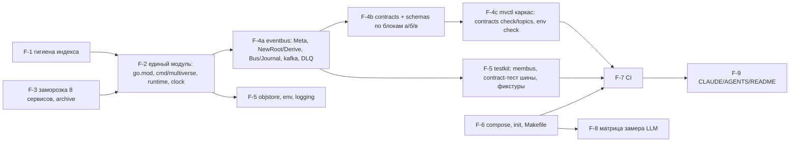

# Каркас фундамента (EPIC-001) — раскладка единого модуля и общие библиотеки

> **Состояние дерева на 2026-09-11 (T-409).** Фундамент написан целиком (`shared/*`, `cmd/multiverse`, `cmd/mvctl`, реестр и схемы). Раскладка §1 описывает весь модуль, включая чужие каталоги: из `internal/*` существует только `internal/mechanics`, а `cmd/multiverse/contexts.go` регистрирует семь контекстов пустыми заглушками. `runtime.Deps` — по коду (C-01 v1.3, §3); `serve.go` пока не собирает шину, журнал и реестр — это нужно до первого настоящего контекста (EPIC-002 T-055). Хука `MV_SWARM_FAKE` (`cmd/multiverse/fake_contexts.go`) в дереве нет; `multiverse db backup|check` отвечает «ни одна база не вкомпилирована» до `internal/gateway`.

Версия 0.2 · 2026-09-09 · architect#1 (TEAM-1, волна 0) · статус: **утверждён на G2 (2026-09-09)** с правками сведения; tech-lead#1 нарезает F-0…F-10 в `epics/EPIC-001-foundation/tasks.md` по `epics/EPIC-001-foundation/design.md`.
**Дополнение после G2**: правки по `architecture/consolidation.md` §9 (решения F-1…F-5, D-1…D-14, T-10, T-16, U-1, U-5) внесены точечно и помечены «Дополнение после G2»; сводка — §14. Где старый текст противоречит дополнению — действует дополнение.
Границы: `overview.md` §13–§16, §19; ADR-001 (модуль, `--contexts`), ADR-004 (хранилища), ADR-007 (конверт `meta`, реестр, топики), ADR-010 (тесты, CI); контракт C-01 (шина/реестр), C-14 (формат снапшотов — реализуется владельцами). Задача документа — чтобы разработчик волны 0 знал, **где что живёт** и **что делать с существующим кодом**, без вопросов «а куда это положить». Детали блока EPIC-002 — `state-and-mechanics.md`.

---

## 1. Раскладка единого модуля `multiverse-core.io`

```
go.mod                         module multiverse-core.io; go 1.26; toolchain go1.26.x (Дополнение после G2: D-1, ADR-001 доп. п. 1; патч — из build/versions.env)
cmd/
  multiverse/main.go           один бинарник: --contexts, --mode, --bus, --recording, --id-source (адрес HTTP — только env MV_CORE_ADDR у любого процесса, не флаг; D-7, T-408)
  telegram-bot/                EPIC-004
  mvctl/                       каркас CLI (cobra не нужен — стандартный flag + подкоманды); наполнение EPIC-005/003
internal/
  state/ mechanics/ replay/    EPIC-002 (state-and-mechanics.md)
  swarm/ llm/ laws/            EPIC-003
  gateway/                     EPIC-004
  memory/                      EPIC-005
shared/
  eventbus/                    C-01: конверт, Meta, NewRoot/Derive, Bus, Journal, kafka-адаптер, Dedup, middleware
    membus/                    вторая реализация Bus + Journal в памяти, транспорт --bus=memory (T-418; см. §9)
  jsonpath/                    как есть
  contracts/                   реестр типов, Lookup/Validate/Topics/OwnershipRules, загрузка схем из schemas/
  entity/                      EPIC-002 (переписывается в волне 1; в волне 0 — только перенос в модуль)
  agent/                       EPIC-003 (типы; перенос в волне 0, переписывание в волне 1)
  objstore/                    единственный клиент MinIO (minio-go v7), buckets.go, ключи, versioning
  env/                         типизированное чтение env + манифест для сверки с .env.example (NFR-074)
  logging/                     slog JSON, обязательные поля, With(ctx), middleware шины
  clock/                       Clock, Timers, Real, Manual (интерфейсы времени; EventClock — internal/replay)
  runtime/                     Context, Deps, Mode, Status, Registry контекстов
  testkit/                     contract-тест шины, Dedup-псевдоним, harness-каркас, фикстуры; фейки — в подпакетах владельцев (v0 создаёт F-10, см. §9); membus — под eventbus/ выше (T-418)
schemas/
  embed.go                     package schemas; //go:embed events/**/*.json agent/**/*.json → FS
  events/_common.json, _envelope.json, <type>.v<n>.json
  agent/                       EPIC-003
rules/ laws/ blueprints/ config/ api/ ops/ testdata/
testdata/fixtures/             {world,region,npc,players}.json + snapshots/state/latest.json (F-10; Дополнение после G2)
build/Dockerfile               один multi-stage Dockerfile: ARG CMD=multiverse|telegram-bot|mvctl
build/minio.Dockerfile         сборка MinIO из исходников тега RELEASE.2025-10-15T17-29-55Z (ADR-021; Дополнение после G2: D-2)
build/versions.env             единый источник пинов образов/toolchain для compose, Makefile, testcontainers (Дополнение после G2: D-13)
build/legacy.Dockerfile        as-is build/Dockerfile для профиля legacy (до S5)
docker-compose.yml, Makefile, .github/workflows/go.yml, .env.example, .mcp.env.example, .gitignore, .gitattributes, .golangci.yml, .gitleaks.toml, .pre-commit-config.yaml
services/<frozen>/FROZEN.md    8 замороженных сервисов (свой go.mod, вне сборки)
services/narrative-orchestrator/, services/semantic-memory/   профиль legacy (EPIC-003; свои go.mod, отдельная сборка в compose до S5; + chromadb — D-3)
services/_archive/<путь>/      выведенный из сборки код с ARCHIVED.md (U-1/OQ-A-17: ничего не удаляется; Дополнение после G2)
Docs/archive/                  исторические документы
```

Правила: `internal/<a>` не импортирует `internal/<b>` кроме `swarm → mechanics|laws|llm`, `state → mechanics`; `internal/replay` импортирует только `cmd/multiverse`; `shared/*` не импортирует `internal/*` — **с двумя именованными исключениями**: `shared/testkit/mechanics` и `shared/testkit/swarm` импортируют `internal/mechanics` и больше ничего из `internal/*` (правила `shared-testkit-mechanics` и `shared-testkit-swarm` в `.golangci.yml`). Почему так: двойник обязан говорить типами C-03, иначе он и настоящие `Rules` не удовлетворяют одному интерфейсу и подмена теряет смысл (`contracts.md` §17; `journal.md` 2026-09-10, T-219). Исключение узкое: тот же импорт в любом другом пакете `shared/**` линтер отвергает (T-409); `cmd/*` импортирует всё. Проверка — `depguard` в `golangci-lint` (конфиг `.golangci.yml`, правила по префиксам путей) в job `unit`.
**Дополнение после G2 (S-2, ADR-001 доп. п. 2)**: границы `state → mechanics` и `cmd/multiverse → internal/replay` приняты системным архитектором и кодируются в `.golangci.yml` в F-2 (не «требуют записи» — уже решено). `cmd/mvctl` подкоманды `world init` (EPIC-002) импортируют `internal/state` (bootstrap) — допустимо по правилу «`cmd/*` импортирует всё».

---

## 2. `cmd/multiverse` — процесс из набора контекстов

```go
// флаги
--contexts=state,mechanics,laws,llm,swarm | gateway | memory | all        (обязателен; только флаг, переменной MV_CONTEXTS нет)
--mode=live|replay                                                      (по умолчанию — значение MV_MODE, само по умолчанию live; флаг перекрывает)
--bus=kafka|memory                                                      (по умолчанию — значение MV_BUS, само по умолчанию kafka; флаг перекрывает; memory — только с --contexts=all)
--recording=<path.jsonl>                                                (только с режимом replay; до internal/replay разбирается и никуда не идёт)
--id-source=uuid|sequence                                               (sequence — детерминированные id в тестах)
# D-7, T-408: флага --admin-addr нет. Адрес единственного HTTP-сервера ЛЮБОГО процесса — env MV_CORE_ADDR (по умолчанию 127.0.0.1:8090);
# в compose — литерал рядом с опубликованным портом: gateway ":8088", core ":8090", memory ":8082". MV_GATEWAY_ADDR и MV_MEMORY_ADDR выведены.
```

**Режим и вид шины — один источник истины (T-408, внесено в T-409).** `MV_MODE` и `MV_BUS` объявлены в манифесте `shared/env/vars.go`, и из них `serve.go` берёт **значение по умолчанию** флагов `--mode` и `--bus`: флаг, переданный явно, перекрывает манифест для запуска вручную, всё остальное — compose прежде всего, который флагов не передаёт, — подчиняется манифесту. Допустимые значения тоже берутся из манифеста (`Enum()`), чтобы у флага снова не завёлся свой словарь. Вид шины называется по **протоколу**: `kafka` (Redpanda в compose — одна из реализаций Kafka API; брокеры — `MV_KAFKA_BROKERS`) или `memory`; прежнее значение `redpanda` отвергается процессом с фразой, называющей замену, а не принимается как синоним. Строка старта и её запись в лог называют, откуда пришло каждое значение (`mode_from`, `bus_from`). Почему так: до T-408 обе переменные доходили до контейнеров и не читались никем, и оператор, записавший `MV_MODE=replay`, получал рабочий режим без единого слова.

**Порядок в списке `--contexts` ничего не решает**: старт упорядочивает `runtime.Registry` по `DependsOn`. Во всех документах и в compose список `core` пишется одинаково — `state,mechanics,laws,llm,swarm`, как в `docker-compose.yml`, чтобы два разных списка не выглядели двумя решениями (T-409).

Порядок в `main`: `env.Load()` → `logging.Init(service=<из contexts>)` → сборка `runtime.Deps` (шина по `--bus`, `objstore`, `clock`/`timers` по `--mode`, `journal`, `contracts` реестр, `id` генератор, **HTTP mux процесса**) → `runtime.Registry` создаёт запрошенные контексты (фабрики регистрируются пакетами `internal/*` через `runtime.Register("state", state.New)`; `cmd/multiverse` импортирует все `internal/*` для регистрации) → `Start` в порядке зависимостей (`state` → `laws` → `mechanics` → `llm` → `swarm` → `gateway` → `memory`; контекст без зависимостей стартует сразу) → HTTP-сервер процесса (`shared/runtime`, §3): `/health` (агрегат `Status` всех контекстов; `agents_by_level` — секция swarm) + маршруты, смонтированные контекстами (`/v1/admin/*`) → ожидание `SIGTERM` → `Stop` в обратном порядке с общим таймаутом 15 с.

**Дополнение после G2 (D-7, W-3, C-06)**: HTTP-сервер принадлежит процессу (`shared/runtime`), а не контексту: `swarm` монтирует `/v1/admin/agents*` и `/v1/admin/llm/usage`, `state` — `/v1/admin/state/{world}/snapshot`, `memory` — `/v1/context/*`, `/v1/trace/*`. Спецификация admin-маршрутов — раздел `admin` в `api/gateway.openapi.yaml` (EPIC-004 проксирует `/v1/admin/*` → `MV_CORE_URL`); отдельного `core.openapi.yaml` нет.

`--contexts=all --bus=memory` — единственный процесс без Docker для e2e (ADR-010): те же фабрики, `membus` вместо Redpanda, `objstore` над `memstore`-адаптером (`objstore.Memory`), `--mode=replay`.

---

## 3. `shared/runtime`

```go
package runtime

type Mode string // "live" | "replay"
type Status struct { Status string /* ok|degraded|fail */; Details map[string]any }
type Deps struct {                     // C-01 v1.3 — по коду shared/runtime/runtime.go (T-409)
    Bus       eventbus.Bus
    Journal   eventbus.Journal
    Contracts *contracts.Registry
    Clock     clock.Clock
    Timers    clock.Timers
    Mode      Mode
    IDs       func() string            // генератор id событий (uuid | sequence)
    Log       *slog.Logger
    Mux       *http.ServeMux           // mux единственного HTTP-сервера процесса; Routes(mux) вызывается до Start
}
// Полей Store и Env нет и не будет: контекст создаёт objstore.New сам, со своими бакетами и повторами,
// а переменные читает через объявления манифеста shared/env. Почему — C-01 v1.3.
type Context interface {
    Name() string
    DependsOn() []string                 // имена контекстов, чьё Start должно завершиться раньше
    Start(ctx context.Context, deps Deps) error
    Stop(ctx context.Context) error
    Health() Status
}
func Register(name string, factory func() Context)
func New(names []string) ([]Context, error)   // упорядочивает по DependsOn, проверяет неизвестные имена

// Дополнение после G2 (D-7, C-06): HTTP-сервер процесса живёт в shared/runtime.
type Routes interface { Routes(mux *http.ServeMux) }   // опционально: контекст монтирует свои маршруты (/v1/admin/*, /v1/context/*)
type HTTP struct { Addr string /* MV_<PROCESS>_ADDR */; Mux *http.ServeMux }
func NewHTTP(addr string, health func() Status) *HTTP   // регистрирует GET /health (агрегат) ; Start/Stop с graceful 5 с
// Deps дополняется полем Mux *http.ServeMux — контекст, реализующий Routes, получает вызов Routes(deps.Mux) до Start.
```

Один тип `Deps` для всех контекстов — контекст берёт нужное и игнорирует остальное; отсутствующая зависимость (например, `Store` в `memory`) — `nil` и ошибка `Start`, если контекст её требует. Права на `/v1/admin/*` (только `X-Actor-Kind: ci`/оператор, ADR-009 п. 9) проверяет общая middleware `runtime.AdminOnly` — контексты её оборачивают сами; `/health` — без ограничений (loopback).

---

## 4. `shared/clock`

```go
type Clock interface { Now() time.Time }
type Timer interface { C() <-chan time.Time; Stop() bool }
type Timers interface { After(d time.Duration) Timer; Every(d time.Duration) Timer }
type Real struct{}; type RealTimers struct{}
type Manual struct{ … }        // тесты: Set/Advance; ManualTimers срабатывают по Advance
```

Все контексты используют только эти интерфейсы; `time.Now()` в `internal/*` запрещён линтером (`forbidigo` правило `time\.Now` вне `shared/clock`). `EventClock` и `NullTimers` для replay — `internal/replay` (EPIC-002), внедряются `cmd/multiverse`.

---

## 5. `shared/eventbus` — библиотека шины с конвертом `meta` (C-01)

### 5.1. Файлы: что переиспользуется, что переписывается

| Файл as-is | Решение |
|---|---|
| `types.go` (`Event`, `EntityRef`, `WorldRef`, `ScopeRef`, `NewEvent`, `GetWorldIDFromEvent`, `GetScopeFromEvent`, `Path`) | **расширить**: поле `Meta Meta`; `NewRoot`/`Derive` рядом с `NewEvent` (`NewEvent` помечается `Deprecated`, остаётся для профиля `legacy`); `Publish*`-хелперы (`PublishEntityCreated` и т. п.) — **удалить** |
| `payload_types.go` (`EventPayload` билдер), `nested_payload.go` (`SetNested`, `Extract*`), `relations.go`, `relation_types.go` | **как есть** (тесты есть) |
| `eventbus.go` (`EventBus` над kafka-go: writer на топик, `Subscribe` с `MinBytes=10e3`, `MaxWait` из env, at-most-once) | **переписать** → `bus.go` (интерфейсы) + `kafka.go` (адаптер) |
| `topics.go` (константы 6 топиков, префиксы типов) | **переписать**: топики — из `contracts.Topics()`; константы имён топиков остаются для читаемости, `scope_management` удаляется, добавляются `llm_records`, `analytics_events`, `dead_letters` |
| `docs/`, `examples/`, `MIGRATION.md`, `README.md` | README переписать по факту; остальное — в `Docs/archive/` |

### 5.2. Конверт и конструкторы

```go
type Meta struct {
    SchemaVersion int       `json:"schema_version"`
    CorrelationID string    `json:"correlation_id"`
    CausationID   string    `json:"causation_id,omitempty"`
    CausationType string    `json:"causation_type,omitempty"`
    ActorKind     string    `json:"actor_kind"`                 // human|ci|sim|system
    Agent         *AgentRef `json:"agent,omitempty"`            // {id, level, blueprint, blueprint_version}
    Replay        bool      `json:"replay"`
    Locale        string    `json:"locale"`                     // ru
    GMPath        string    `json:"gm_path,omitempty"`          // agent|legacy (до S5)
}
type Event struct { ID, Type string; Timestamp time.Time; Source string; World *WorldRef; Scope *ScopeRef; Meta Meta; Payload map[string]any; Relations []Relation }

func NewRoot(typ, source, worldID string, scope *ScopeRef, actorKind string, payload map[string]any, opts ...Option) Event
    // ID = ids(); Timestamp = clock.Now(); Meta{CorrelationID: ID, ActorKind, Locale: "ru", SchemaVersion: из реестра}
func Derive(parent Event, typ, source string, payload map[string]any, opts ...Option) Event
    // копирует World/Scope (переопределяются WithScope), Meta.{CorrelationID, ActorKind, Locale, GMPath, Replay}; CausationID = parent.ID; CausationType = parent.Type; Timestamp = parent.Timestamp
type Option func(*Event)   // WithAgent(AgentRef), WithScope(*ScopeRef), WithWorld(id), WithRelations(...), WithTimestamp (только legacy)
```

Генератор `ID` и часы — пакетные переменные, устанавливаемые `cmd/multiverse` (`eventbus.SetIDSource`, `eventbus.SetClock`): в тестах — `sequence` и `Manual`. `Derive` наследует `Timestamp` причины **всегда** (не только в replay) — иначе две прогонки одной записи дают разные байты (NFR-061).

### 5.3. Интерфейсы шины и журнала

```go
type Handler func(ctx context.Context, ev Event) error
type Middleware func(Handler) Handler
type Bus interface {
    Publish(ctx context.Context, ev Event) error                           // топик — из реестра по ev.Type; Validate до отправки
    Subscribe(ctx context.Context, topic, group string, h Handler) error   // consumer group; at-least-once; retry×3 → dead_letters
    Close() error
}
type Journal interface {                                                   // чтение по офсетам без группы (State/Swarm/Gateway догон)
    ReadRange(ctx context.Context, topic string, from, to int64, h Handler) (next int64, err error)
    Tail(ctx context.Context, topic string, from int64, h Handler) error   // до ctx.Done()
    End(ctx context.Context, topic string) (int64, error)                  // офсет следующего сообщения (high watermark)
}
type Position struct { Topic string; Offset int64 }
func PositionFromContext(ctx context.Context) (Position, bool)            // адаптер кладёт позицию в ctx перед вызовом handler
type Dedup struct{ … }                                                     // LRU по event.id (по умолчанию 10 000); Seen(id) bool
```

Kafka-адаптер (`kafka.go`, `segmentio/kafka-go` v0.4.49 — уже в `go.mod`; franz-go не берём: смена клиента без функционального выигрыша для 1 брокера/1 партиции): writer на топик создаётся лениво из `contracts.Topics()`; `RequiredAcks=all`, ключ `world.entity.id|global`; reader `MinBytes=1, MaxBytes=10 МБ, MaxWait=100ms`, `CommitInterval=0` (коммит после успешного handler), `StartOffset=FirstOffset` для новых групп; `Journal` через reader без `GroupID` + `SetOffset`/`ReadLastOffset`. Обработка: handler → ошибка → повтор ×3 (backoff 100/500/2000 мс) → `Publish(dead_letters, {original, error, consumer, attempts})` → коммит (сообщение не блокирует топик). **Паника обработчика (C-01 v1.5, T-426)** перехватывается `recover` в `Delivery.Deliver` — значит, в `Subscribe` и в `Journal` у обеих реализаций. Паника = дефект (NFR-012), поэтому без повтора: событие сразу уходит в `dead_letters` с `eventbus.ErrHandlerPanic`, `attempts` = номер вызова, в котором была паника, стек в `dead_letters` не пишется. Лог — `Error` с `panic`, `stack`, `handled=false`. Коммит — после записи в `dead_letters`; если запись не удалась — ошибка, офсет не коммитится. Паника вне обработчика по-прежнему роняет процесс. Stateful-контекст, не доверяющий своему состоянию после паники, ставит свой `recover` и останавливает себя. Логирующая middleware (`logging.BusMiddleware`) ставит в ctx `correlation_id`, `event_id`, `topic`, `offset`, пишет `handled`.

Wire-формат — JSON конверта (as-is совместим: новые поля добавляются; `meta` отсутствует у legacy-типов — принимаются с `SchemaVersion=0` только для типов с пометкой `deprecated`).

---

## 6. `shared/contracts` и `schemas/events` (ADR-007)

```go
package contracts
type Spec struct { Type string; Topic string; SchemaVersion int; Schema *jsonschema.Schema; Publishers, Consumers []string; Since string; Deprecated bool }
func Lookup(typ string) (Spec, bool)
func Validate(ev eventbus.Event) error         // конверт по _envelope.json + payload по schemas/events/<type>.v<n>.json
func Topics() []TopicSpec                      // {Name, RetentionMS, ReplayRead bool} — единый источник для redpanda-init (mvctl contracts topics --format=rpk)
func OwnershipRules() []OwnershipRule          // таблица C-02 (наполняет EPIC-003, форма — state-and-mechanics.md §4.6)
func All() []Spec
```

Реестр — Go-таблица `registry.go` (один PR на добавление типа, ревью system-architect), не YAML: компилятор ловит опечатки, `go test` проверяет, что для каждого `Spec` есть файл схемы и наоборот. Библиотека валидации — `github.com/santhosh-tekuri/jsonschema/v6` **v6.0.3** (draft 2020-12, чистый Go; Дополнение после G2: D-5, версия по `infrastructure.md` §2.4); `xeipuuv/gojsonschema` (as-is, draft-07) удаляется из `go.mod` (сам код as-is не удаляется — уходит в `_archive` вместе с потребителями). Схемы компилируются один раз при старте из `schemas.FS` (`embed`); `Validate` ≈ 20–50 мкс на событие — на критическом пути незначимо.

**Дополнение после G2 (T-10, C-01 v1.1)**: `Spec.Policy` — политика топика: `player_events` принимает только `meta.actor_kind ∈ human|ci|sim` и `meta.agent == nil`; `llm_records`, `system_events(tick.*, agent.*)` требуют `meta.agent`. Политика проверяется в `Publish` всегда и в `Subscribe` при `MV_BUS_VALIDATE_ON_READ=true` (по умолчанию включено; невалидное → `dead_letters` без вызова handler). `contracts.OwnershipRules()` в MVP-1 — статичная таблица в `shared/contracts/ownership.go` (F-4b), наполнение по `state-and-mechanics.md` §4.6. **Эта таблица и есть единственная истина** (ADR-025, T-409): прежняя фраза «источник истины после волны 1 — `shared/agent/levels.go`, тест сверяет обе таблицы» отменена — файла `levels.go` нет, а экспорт из пакета роя разворачивал бы зависимость фундамента на EPIC-003. Строки меняют их владельцы PR с меткой `contract-change` (`contracts.md` §16 п. 6).

`schemas/events/_common.json` — `$defs`: `EntityRef`, `EntityWithName`, `ScopeRef`, `AgentRef`, `WorldRef`, `Timestamp`, `Money`; `_envelope.json` — конверт с `meta`; `<type>.v1.json` — `additionalProperties: false` на верхнем уровне payload (ловит опечатки издателей), `$ref` в `_common.json`. Разбивка F-4 по блокам: (а) `player.*`, `group.*`, `round.*`; (б) `entity.*`, `snapshot.created`, `dice.rolled`, `analytics.replay.completed`; (в) `agent.*`, `tick.*`, `llm.*`, `narrative.output`, `world.*`, `region.*`, `npc.*`, `encounter.*`, `content.incident.recorded`, `analytics.session.*`, `analytics.turn.completed`, `analytics.consistency.violated`. Legacy-типы (`player.moved`, `player.used_skill`, `gm.*`, `narrative.generate`, `violation.detected`, `time.syncTime`) — `Spec{Deprecated: true, Schema: nil}` (валидируется только конверт), удаляются вместе с профилем `legacy`.

---

## 7. `shared/objstore`

```go
package objstore
// Дополнение после G2 (ADR-021 п. 2, D-6): минимальный интерфейс, не зависящий от bucket versioning.
type Client interface {
    Put(ctx context.Context, bucket, key string, body []byte, opts PutOptions) (ETag string, err error)   // PutOptions{ContentType}
    Get(ctx context.Context, bucket, key string) ([]byte, error)                 // ErrNotFound
    Stat(ctx context.Context, bucket, key string) (ObjectInfo, error)            // {Key, Size, LastModified, ETag}
    List(ctx context.Context, bucket, prefix string) ([]ObjectInfo, error)
    Delete(ctx context.Context, bucket, key string) error
    EnsureBucket(ctx context.Context, bucket string, opts BucketOptions) error   // BucketOptions{Versioned bool; NoncurrentExpireDays, ExpireDays int} — включает versioning и ILM сам
    Capabilities() Capabilities                                                  // {Versioning, Lifecycle bool}
}
func New(cfg Config) (Client, error)     // minio-go/v7 v7.3.0; Config из env: MV_MINIO_ENDPOINT, MV_MINIO_ACCESS_KEY, MV_MINIO_SECRET_KEY, MV_MINIO_SECURE
type Memory struct{ … }                  // in-memory реализация (тесты, --bus=memory); Capabilities{false,false}
// buckets.go
func EntitiesBucket(worldID string) string   // entities-{world}      — Versioned, NoncurrentExpireDays 30
func SnapshotsBucket(worldID string) string  // snapshots-{world}     — Versioned, NoncurrentExpireDays 30
func PromptsBucket(worldID string) string    // prompts-{world}       — без versioning, ExpireDays 30 (T-13)
const OpsArtifacts = "ops-artifacts"         // без правил
func BucketOptionsFor(bucket string) BucketOptions   // единая таблица опций по префиксу — используют world init и minio-init
```

Из as-is: `shared/minio/minio_official_client.go` — образец (PUT/GET/List над `minio-go`); `http_client.go` (самописный S3 через HTTP), `legacy.go`, `factory.go`, `gameservice/minio_client.go` — **в `services/_archive/shared/minio/`** (U-1; не удаляются). Повторы: 3 попытки на сетевые ошибки (не на 404). Многочастные загрузки, presigned URL, object lock, уведомления — не входят в интерфейс. Если `Capabilities().Versioning=false` — `EnsureBucket` не ошибка, а предупреждение в `/health.store`; ни один путь кода (снапшоты K=5, `history` сущности, интенты) на versioning не опирается (ADR-021 п. 3). Сервер — MinIO, собранный из исходников (`build/minio.Dockerfile`, образ `multiverse-core/minio:<tag>` через `build/versions.env`), тот же образ в testcontainers; `mc` — только в init-контейнере. Contract-тест `objstore` (`-tags integration`) гоняется против `Memory` и собранного MinIO — при замене сервера по триггерам ADR-021 п. 4 меняется только образ.

---

## 8. `shared/env`, `shared/logging`

```go
package env
type Env struct{ … }
func Load() Env                                    // .env не читается кодом (compose/direnv) — только os.Getenv
func (e Env) String(name, def string) string; Int; Bool; Duration; Required(name) (string, error)
func Manifest() []Var                              // все переменные, объявленные через env.Declare(name, def, doc) — источник для скрипта сверки с .env.example (NFR-074)
```
Каждый пакет объявляет свои переменные на уровне пакета (`var kafkaBrokers = env.Declare("MV_KAFKA_BROKERS", "localhost:9092", "…")`), поэтому `mvctl env check` сверяет манифест с `.env.example` без grep по `os.Getenv`.
**Дополнение после G2 (D-4, G-11, W-3; `contracts.md` §16 п. 5)**: имена **не** сохраняются as-is — все платформенные переменные читаются с префиксом `MV_` (`MV_KAFKA_BROKERS`, `MV_MINIO_ENDPOINT`, `MV_OLLAMA_URL`, `MV_CORE_ADDR`, `MV_BUS_VALIDATE_ON_READ`, `MV_SNAPSHOT_EVERY_FACTS`, `MV_LLM_PROVIDER`, `MV_TELEGRAM_BOT_TOKEN`, `MV_MODE`, `MV_BUS`…; имена сверены с манифестом `shared/env/vars.go` в T-409: `MV_GATEWAY_LISTEN` и `MV_CONTEXTS` в манифест не попали — адрес процесса один, `MV_CORE_ADDR`, набор контекстов задаёт только флаг); без префикса — только сторонние, читаемые чужими образами (`OLLAMA_*`, `MINIO_ROOT_*`, `NEO4J_AUTH`, `COMPOSE_PROFILES`). `env.Declare` отклоняет имя без `MV_` (паника при инициализации пакета — ловится unit-тестом), для сторонних — `env.DeclareExternal`. Список — `.env.example` (F-1/F-6, целевой состав — `infrastructure.md` §4.2).

```go
package logging
func Init(service string, level slog.Level) *slog.Logger    // JSON handler в stdout; поля service, context добавляет каждый контекст через With
func With(ctx context.Context, l *slog.Logger) *slog.Logger  // correlation_id, event_id, agent.level из ctx
func BusMiddleware(l *slog.Logger) eventbus.Middleware       // кладёт поля в ctx; логирует ошибки handler с handled=false (до retry) / handled=true (после DLQ)
```
Запрещены `log.Printf`/`fmt.Println` в `internal/*` и `shared/*` (линтер `forbidigo`). Внешние ID не попадают в логи по построению (их нет в `core`); в gateway — тест NFR-041 (EPIC-005).

---

## 9. `shared/testkit`

```
shared/eventbus/membus/   Bus + Journal в памяти: топики — упорядоченные срезы; офсеты = индексы; Subscribe — горутина на группу; End(); chaos: Duplicate(p), ReorderTopics
                          (вторая реализация C-01, не двойник; до T-418 — shared/testkit/membus; C-01 v1.4, ADR-001 доп. 2026-09-11)
shared/testkit/
  contract/     contract-тест шины: один набор проверок против membus (-short) и Redpanda (-tags integration)
  dedup.go      type Dedup = eventbus.Dedup (псевдоним для совместимости C-01)
  versions.go   Versions() — пины из build/versions.env для testcontainers (Дополнение после G2: D-13)
  containers.go testcontainers: redpanda, minio (образ из build/minio.Dockerfile), qdrant, neo4j
  fixtures/     загрузка testdata/fixtures/*.json (мир, регион, NPC, игроки A/B/C) + latest.json seq 0
  harness/      каркас: запуск cmd/multiverse in-process (--contexts=all --bus=memory), HTTP-клиент gateway (наполняет EPIC-004)
  state/        FakeState        — v0 в F-10 (EPIC-001), с волны 1 владелец EPIC-002
  mechanics/    FixedMechanics   — v0 в F-10 (EPIC-001), с волны 1 владелец EPIC-002
  gateway/      Harness v0 (генератор player.* из фикстур, без HTTP) — F-10; FakeGateway + Harness HTTP — EPIC-004
  swarm/        FakeNarrator v0 (шаблон на combat.decided/round.closed/player.looked) — F-10; RecordingWriter — EPIC-003 I1a
  llm/          FakeProvider (EPIC-003)
```

`membus` обязан воспроизводить семантику адаптера (порядок в топике, at-least-once по флагу, DLQ, `Position` в ctx, `Journal` включая `End`); расхождения ловит общий набор contract-тестов шины (`shared/testkit/contract`), запускаемый и против membus (`-short`), и против testcontainers `redpanda` (`-tags integration`).

**Дополнение после G2 (F-10, `decomposition-review.md` §3.3, `epics.md` §6)**: заглушки v0 контрактов C-02…C-05 создаёт EPIC-001 в волне 0, чтобы TEAM-2/TEAM-3 стартовали без ожидания поставщиков. Трёхступенчатое владение `shared/testkit`: ядро (`dedup`, `versions`, `containers`, `fixtures`, contract-тест) — EPIC-001 → tech-lead#1 (`membus` с T-418 — в `shared/eventbus/membus`, владение как у `shared/eventbus/**`: изменение только через system-architect); подпакеты `state/`, `mechanics/`, `swarm/`, `gateway/` — v0 пишет EPIC-001 (developer + architect#1), с волны 1 владелец — поставщик контракта, который заменяет v0 реализацией в своей ветке. Правило: потребитель заглушки её не правит — запрос владельцу. Состав v0 — `epics/EPIC-001-foundation/design.md` §5.

---

## 10. Инфраструктура, которую ждёт код (для devops-engineer, F-6/F-7)

- `redpanda-init`: `rpk topic create <t> -p 1 -r 1 -c retention.ms=<из contracts.Topics()> -c segment.ms=86400000` для 8 топиков (retention 30/90/180 дн. — U-3; `segment.ms=1d` — D-9); список печатает `mvctl contracts topics --format=rpk`, чтобы init-скрипт не дублировал таблицу.
- `minio-init`: только `ops-artifacts`, сервисный пользователь (`MV_MINIO_ACCESS_KEY`) и страховочное `mc version enable`/ILM для **уже существующих** `entities-*`/`snapshots-*`; бакеты `*-{world}` создаёт `mvctl world init` через `EnsureBucket` с versioning/ILM (Дополнение после G2: D-6, ADR-004 доп. п. 2).
- compose (Дополнение после G2: D-2, D-3, D-7, D-10, D-13): пины **только** из `build/versions.env` (`${...}`); MinIO — образ собственной сборки `build/minio.Dockerfile` (ADR-021; OQ-A-20 решён пользователем на G2 — вариант B); профили `gpu|memory|dev|legacy|bot` (`legacy` = as-is narrative-orchestrator + semantic-memory :8083 + chromadb; `bot` = telegram-bot только при `MV_TELEGRAM_BOT_TOKEN`); все порты на `127.0.0.1`, пароли из `.env` без значений по умолчанию; Timescale/Redis вне compose (потребители в `_archive`); `core` слушает `MV_CORE_ADDR=0.0.0.0:8090` внутри сети, наружу `127.0.0.1:8090`; gateway :8088; memory :8082.
- `Makefile` дополнительно: `archive-legacy` (копия томов MinIO/Redpanda до пересоздания тома Redpanda — D-8), `image`, `backup/restore`.
- CI `go.yml`: jobs `unit` (build, vet, staticcheck, golangci-lint с depguard/forbidigo, `go test -short -cover`, порог 60 % по `internal/{state,mechanics,swarm,llm,replay}`), `integration` (Docker, testcontainers-go — модули `redpanda`, `minio`, `qdrant`, `neo4j`), `e2e` (без Docker), `contracts` (`mvctl contracts check`, `mvctl blueprint validate`, `mvctl env check`), `security` (`gitleaks`, `govulncheck`), `compose-lint`.
- `Makefile`: `up/down/logs/health/ci/test/test-integration/test-e2e/build/replay/record` (старые `build-service SERVICE=` удаляются вместе с workspace).

---

## 11. Судьба существующего кода (перенос как есть / переписать / архив)

**Дополнение после G2 (U-1/OQ-A-17, F-1 «ПИ», ADR-001 доп. п. 5)**: слово «удалить» в таблице ниже читать как **«перенести в `services/_archive/<исходный путь>` с `ARCHIVED.md`»** для любого кода; из индекса удаляются только не-код: секреты (`.env`, `.mcp.env`), бинарники (`*.exe`), логи (`mcp_*.log`), gitlink'и `.claude/worktrees/*` (уже сделано в F-0). Каталог `_archive` — вне `go.mod`, compose, `Makefile`, линтера; свои `go.mod` архивных модулей остаются (могут не собираться). Возврат кода из архива — через архитектора.

| Путь as-is | Волна 0 | Далее |
|---|---|---|
| `shared/eventbus` (types, payload_types, nested_payload, relations*) | перенос в модуль как есть + `Meta`, `NewRoot/Derive` | — |
| `shared/eventbus/eventbus.go`, `topics.go` | переписать (§5.3) | — |
| `shared/jsonpath` | как есть | — |
| `shared/entity` | перенос (компилируется) | EPIC-002 переписывает |
| `shared/agent`, `shared/agent/tools` | перенос типов/парсера/валидатора в модуль (удалить `go.mod`, `replace`) | EPIC-003 переписывает рантайм; `tools/*` кроме реестра — удалить |
| `shared/minio` (две реализации), `gameservice/minio_client.go`, прямой `minio-go` в entity-manager/rule-engine | заменить `shared/objstore` | — |
| `shared/config`, `configs/gm_*.yaml` | удалить (конфигурация — env + блупринты) | — |
| `shared/schema`, `shared/redis`, `test_minio.go`, `fake_deps/`, лишние Dockerfile | **F-3: `git mv` → `services/_archive/…`** с `ARCHIVED.md` (код не удаляется — U-1) | — |
| `examples.exe`, `semantic-memory.exe`, `mcp_*.log`, `.env`, `.mcp.env` | `git rm --cached` (F-1, не-код); `memory/`, `plans/` — проверить: документы → `Docs/archive/` | — |
| `services/{ban-of-world,reality-monitor}`, `shared/{rules,intent,tinyml,spatial,oracle,config,minio}`, `shared/agent/tools/*` (кроме реестра) | **F-3: → `services/_archive/`** (решено U-1; в `shared/oracle/README.md` перед переносом — плейсхолдер вместо ключа, U-5/T-16) | возврат — только через архитектора |
| `services/semantic-memory` | **не переносится в волне 0**: as-is остаётся на месте для профиля `legacy` (:8083 + chromadb — D-3); Neo4j-индексер копируется в `internal/memory` в EPIC-005 005-memory | после S5 → `_archive` (EPIC-003 I2); 005-memory — Qdrant вместо Chroma |
| `services/narrative-orchestrator` + `services/game-service` | не переносятся в модуль; `narrative-orchestrator` остаётся отдельным `go.mod` для профиля `legacy` (`build/legacy.Dockerfile`); `game-service` — источник для переписывания EPIC-004 | → `_archive` в S5 / после EPIC-004 |
| `services/{world-generator, universe-genesis-oracle, ontological-archivist, cultivation-module, plan-manager, city-governor, entity-actor, evolution-watcher}` | `FROZEN.md`, вне `Makefile`/compose; `go.work` удалён — их `go.mod` остаются автономными (могут не собираться) | EPIC-006…010 |
| `services/entity-manager`, `services/rule-engine` | не переносятся | EPIC-002 (новые пакеты) |
| `go.work`, `go.work.sum` | удалить (это не код-модуль, а конфигурация workspace — U-1 не касается); один `go.mod` (`go 1.26`) с зависимостями: `google/uuid`, `oklog/ulid/v2`, `segmentio/kafka-go` v0.4.51, `minio/minio-go/v7` v7.3.0, `santhosh-tekuri/jsonschema/v6` v6.0.3, `gopkg.in/yaml.v3`, `stretchr/testify`, `testcontainers-go` v0.44.0 (+модули redpanda/minio/qdrant/neo4j), `modernc.org/sqlite` + `pressly/goose/v3` (EPIC-004, ADR-019), `go-telegram/bot` (EPIC-004, ADR-018), `qdrant/go-client` v1.19.x, `neo4j-go-driver/v5` (Дополнение после G2: F-4, версии — `infrastructure.md` §2.4) | — |
| `.github/workflows/validate-blueprints.yml` | заменить job `contracts`; `qwen-*` — оставить | — |
| `CLAUDE.md`, `AGENTS.md`, `README.md`, `Docs/architecture*.md`, `Docs/LIVING_WORLDS_*`, `AI_AGENT_INSTRUCTIONS.md`, `QWEN.md`, `PULL_REQUEST.md` | F-9: по факту нового кода; исторические — `Docs/archive/` | tech-writer |

---

## 12. Порядок задач F-1…F-9 с уточнениями (нарезка — tech-lead#1)



Диаграмма — запись планирования волны 0 (нарезка tech-lead#1, до T-418); узел `F5t` называет `membus` частью `testkit`, как это было на момент нарезки. Факт (с T-418 `membus` — в `shared/eventbus/membus`) — в критерии готовности EPIC-001 ниже (§12, строка с `testkit` содержит membus).

Уточнения:

- **F-0** (Дополнение после G2) — выполнен оркестратором 2026-09-09: gitlink'и `.claude/worktrees/*` удалены из индекса, `git status` работает, коммит 744fb10, ветка `integration/mvp-1` создана от `feature/agent-gm-core`.
- **F-1** делается первой и отдельным PR: **сначала `gitleaks` + `pre-commit`** (T-16, allowlist только `*.example`), затем `git rm --cached` секретов (`.env`, `.mcp.env`), бинарников, логов; **плейсхолдер `ORACLE_API_KEY=<your-key>` в `shared/oracle/README.md`** (U-5); `.gitignore`, `.gitattributes` (`testdata/recordings/*.jsonl merge=binary` — D-14), `.env.example`/`.mcp.env.example` полные; `gitleaks git --redact` = 0. `fake_deps`, `test_minio.go`, дубли Dockerfile — **не удаляются, а переносятся в F-3**. Ротация утёкших токенов — вне репозитория (пользователь).
- **F-2** включает: `go.mod` с **`go 1.26` + `toolchain go1.26.x`** (D-1), перенос `shared/*`-модулей в пакеты (удаление их `go.mod`), `cmd/multiverse` с пустыми контекстами-заглушками (`Health()=ok`), `shared/runtime` (включая HTTP-сервер процесса и `MV_CORE_ADDR`), `shared/clock`, `.golangci.yml` (depguard c границами ADR-001 доп. п. 2, forbidigo), `build/Dockerfile`; `services/_archive/**` и замороженные — вне `./...`. Критерий: `go build ./... && go vet ./...` зелёные при пустых `internal/*`.
- **F-3** — параллельно F-1: `services/_archive/` по §11 (`git mv`, `ARCHIVED.md` на каталог, `services/_archive/README.md` с индексом); `FROZEN.md` в 8 замороженных сервисах (причина, эпик возврата, коммит заморозки), удаление из `Makefile`/compose; `Docs/archive/` с индексом.
- **F-4** разбить на a/b/c: библиотека шины (один разработчик), схемы по трём блокам (второй разработчик может начинать сразу от `api-contracts.md`, параллельно с F-4a), каркас `mvctl` после реестра. Contract-тест шины (F-5t) обязателен до старта волны 1 — иначе команды получат membus с другой семантикой.
- **F-5** — `objstore` по ADR-021 (§7) с in-memory реализацией сразу (нужна EPIC-002 для unit-тестов State); `env.Declare`-манифест с префиксом `MV_`; `logging.BusMiddleware`; **`build/versions.env`** (D-13).
- **F-6/F-7** — devops-engineer параллельно с F-4/F-5; F-6 включает `build/minio.Dockerfile` (ADR-021), профили `legacy`/`bot`, `redpanda-init` с retention/`segment.ms`; F-7 замыкается, когда есть хотя бы один тест каждого уровня (unit — eventbus; integration — contract-тест шины на testcontainers; e2e — `--contexts=all` с пустыми контекстами и `/health ok`); `govulncheck` блокирующий, пины действий по SHA, `compose-lint`, `privacy-scan` (T-3, T-5, T-15).
- **F-8** — на целевой машине после F-6 (Ollama нативно или профиль `gpu`, `KEEP_ALIVE=-1`); результат `ops/metrics/baseline.md`; **критерий U-2**: одна `qwen3:30b-a3b`, если проходит NFR-002/NFR-090, иначе `8b + 14b`; код не блокирует (модель — параметр блупринта).
- **F-10** (Дополнение после G2) — заглушки v0 C-02…C-05, `shared/entity` v2, типы C-03 + `Load` + `rules/dark-forest.yaml`, фикстуры `testdata/fixtures/`; состав — `epics/EPIC-001-foundation/design.md` §5; идёт параллельно F-4c/F-5t/F-7/F-8 после F-4a/F-4b/F-5.
- **F-9** — последняя; README содержит «как запустить одну команду», карту `internal/*`, статусы сервисов включая «архив» (`services/_archive/README.md`); `.dev-team.json.stack` по факту.

Порядок (по `epics.md` §6): **F-0 → F-1 ∥ F-3 → F-2 → (F-4a ∥ F-4b ∥ F-5 ∥ F-6) → (F-4c ∥ F-5t ∥ F-10 ∥ F-7 ∥ F-8) → F-9**; критический путь волны 0: F-1 → F-2 → F-4a → F-5t.

Критерий готовности EPIC-001 (из `epics.md` v0.2): `git status` чист и работает; `pre-commit` с `gitleaks` установлен, `gitleaks git --redact` = 0; `make ci` зелёный; `make up` поднимает инфраструктуру и `core|gateway|memory` с `/health ok`; contract-тест шины на testcontainers; `testkit` содержит membus + v0 заглушек C-02…C-05 (с T-418 `membus` — в `shared/eventbus/membus`); `mvctl contracts check` без фантомов; секретов в HEAD нет; `services/_archive/` и замороженные сервисы вне `go build ./...`; `baseline.md` с выбором конфигурации по U-2.

---

## 13. Риски каркаса

| Риск | Реакция |
|---|---|
| Семантика `membus` расходится с Redpanda (порядок, офсеты, DLQ) | общий contract-тест шины против обеих реализаций (§9) |
| Конверт `meta` меняется после старта волны 1 | фиксируется в F-4a до G3; изменения — только через system-architect (C-01) |
| `depguard` не ловит импорт через `cmd/*` | `cmd/*` — единственное место сборки, это допустимо по ADR-001; контексты тестируются без `cmd` |
| `Derive` наследует `Timestamp` — события «из прошлого» в логах/памяти | wall-clock для наблюдаемости — поле лога `received_at` в middleware, не в событии; memory индексирует `timestamp` события как игровое время |
| Замороженные сервисы и `services/_archive/**` ломают `go build ./...` | они вне модуля (свои `go.mod`, нет `go.work`) — `./...` их не видит; `.golangci.yml` и `Makefile` исключают путь явно |
| Сборка MinIO из исходников архивированного репозитория ломается на новом toolchain (ADR-021) | пин Go в `build/minio.Dockerfile` отдельный от платформы (`golang:1.24` builder); кэш слоёв в CI; при провале — триггер (б) ADR-021 п. 4 → spike SeaweedFS в EPIC-012 |
| Заглушки v0 (F-10) расходятся с реализацией поставщика | v0 пишет architect#1 по тем же §3/§5.1 `state-and-mechanics.md`, что и реализация; сигнатуры C-02/C-03 не меняются; потребитель заглушку не правит |

---

## 14. Дополнения после G2 — сводка (2026-09-09)

Источник: `architecture/consolidation.md` §5 (F-1…F-5), §7 (D-1…D-14), §6 (T-3, T-5, T-10, T-13, T-15, T-16), §1 (U-1, U-2, U-3, U-5); `contracts.md` v0.2 (C-01 v1.1, §0, Env); `epics.md` v0.2 §6; журнал G2 (OQ-A-20 → вариант B ADR-021).

| # | Решение | Где в документе | Задача |
|---|---|---|---|
| 1 | Все платформенные env с префиксом `MV_`; `env.Declare` требует префикс; сторонние — `DeclareExternal` | §8 | F-5, F-6 (`.env.example`) |
| 2 | `shared/runtime` владеет HTTP-сервером процесса (`/health` + монтирование `/v1/admin/*` контекстами через `Routes(mux)`); `MV_CORE_ADDR=127.0.0.1:8090`, флага `--admin-addr` нет; admin-спецификация — раздел `admin` в `api/gateway.openapi.yaml` | §2, §3 | F-2 |
| 3 | Границы импортов `state → mechanics`, `cmd/multiverse → internal/replay` приняты; `depguard` в F-2 | §1 | F-2 |
| 4 | C-01 v1.1: `Journal{ReadRange, Tail, End}`, `PositionFromContext`, `eventbus.Dedup` в production-пакете; `End` = признак конца журнала (вместо `Bus.Lag()`); валидация при чтении `MV_BUS_VALIDATE_ON_READ`; политики топиков | §5.3, §6 | F-4a, F-5t |
| 5 | JSON Schema 2020-12 — `santhosh-tekuri/jsonschema/v6` v6.0.3; `Spec.Policy` | §6 | F-4b |
| 6 | `objstore` по ADR-021: минимальный интерфейс + `Capabilities()`, `EnsureBucket` включает versioning/ILM сам; MinIO из исходников `build/minio.Dockerfile`; ни один путь кода не зависит от versioning | §7, §10 | F-5, F-6 |
| 7 | `build/versions.env` — единый источник версий (compose, Makefile, `testkit.Versions()`) | §1, §9, §10 | F-5, F-6, F-5t |
| 8 | Go 1.26 + `toolchain go1.26.x`; `govulncheck` блокирующий | §1, §12 | F-2, F-7 |
| 9 | `services/_archive/` вместо удаления кода (U-1); из индекса только не-код; плейсхолдер ключа в `shared/oracle/README.md` (U-5); gitleaks первым шагом F-1 | §11, §12 | F-1, F-3 |
| 10 | Профили compose `gpu/memory/dev/legacy/bot`; `legacy` = orchestrator + semantic-memory :8083 + chromadb (D-3); Timescale/Redis вне compose | §10, §11 | F-6 |
| 11 | `redpanda-init`: retention 30/90/180 (U-3), `segment.ms=1d` (D-9); том Redpanda пересоздаётся, `make archive-legacy` до этого (D-8) | §10 | F-6 |
| 12 | F-10: заглушки v0 C-02…C-05 + `shared/entity` v2 + типы C-03 + `rules/dark-forest.yaml` + фикстуры; трёхступенчатое владение `testkit` | §9, §12 | F-10 |
| 13 | `latest.json` — указатель (C-14 v1.1): фикстура `testdata/fixtures/snapshots/state/latest.json` в формате `state-and-mechanics.md` §4.4 | §9 | F-10 |
| 14 | F-8: критерий U-2 (одна `qwen3:30b-a3b` или `8b + 14b`); стендовая задача вне CI | §12 | F-8 |
| 15 | `.gitattributes`: `testdata/recordings/*.jsonl merge=binary` без `-diff` (D-14); CI: SHA-пины, `permissions`, `go mod verify`, Dependabot, CODEOWNERS, `compose-lint`, `privacy-scan` (T-3/T-5/T-15) | §12 | F-1, F-7 |

Не вошло в этот документ (владельцы других документов): порт 8090 и профили в `infrastructure.md` §1.3–§1.4 (devops-engineer); `api-contracts.md` §2.3.12 `component` enum (system-analyst); `.dev-team.json.stack` по факту (tech-writer, F-9).
