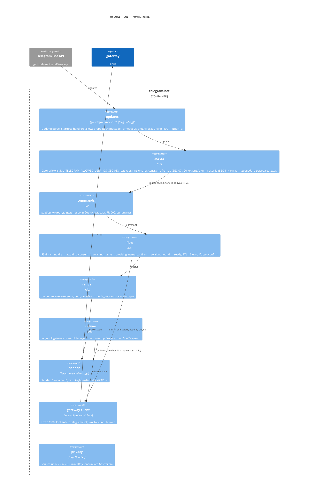

# Компоненты EPIC-004: gateway и telegram-bot

Статус: **утверждён на G2 (2026-09-09), правки сведения внесены** · Версия 0.2 · 2026-09-09 · architect#3 (TEAM-3) · изменения v0.2 — §17 (по `architecture/consolidation.md` §3, §6, §9; `contracts.md` v0.2; решениям пользователя U-5…U-7).
Границы: `architecture/overview.md` §12–§18, ADR-001, ADR-003, ADR-004, ADR-006, ADR-007, ADR-009, ADR-010; контракты `contracts.md` C-04, C-08, C-10 (поставляем), C-01, C-02, C-05, C-06, C-14 (потребляем); `plan/epics.md` EPIC-004 (I1 «соло», I2 «группа»); `plan/ownership.md` (`internal/gateway/**`, `cmd/telegram-bot/**`, `api/gateway.openapi.yaml`, `internal/gateway/migrations/*.sql`, `links.db`, `gateway.db`).
Источники требований: `analysis/api-contracts.md` §1, §2.3.1–2.3.3, 2.3.11, 2.3.14; `analysis/data-model.md` §5, §9.3–9.6, 9.10–9.11; `analysis/use-cases.md` UC-001…UC-005, UC-007, UC-009, UC-012, UC-014…UC-017, UC-020, UC-025, UC-027, UC-031; `analysis/integrations.md` §1, §7; `requirements/prd.md` FR-001…FR-009, FR-023, FR-025, FR-060, FR-061, FR-084…FR-088, BR-07, BR-09, BR-13, BR-17; `requirements/nfr.md` NFR-001, NFR-003, NFR-013, NFR-036, NFR-041, NFR-042, NFR-045, NFR-092; `requirements/domain-review.md` §3.2; `project/metrics.md` §4.2.
Решения уровня реализации: ADR-018 (библиотека Telegram и режим бота), ADR-019 (SQLite без CGO, схема `links.db`/`gateway.db`, миграции), ADR-020 (координатор раундов в gateway).
Глобальные решения здесь **не пересматриваются**; запросы на изменение контрактов (§14) решены на сведении A3 шаг 4 и внесены в `contracts.md` v0.2 — §14 сохранён как история. Имена переменных окружения — с префиксом `MV_` (§11.3); дизайн эпика по инкрементам — `epics/EPIC-004-gateway-bot/design.md`.

---

## 1. Назначение и границы блока

Блок «Вход игрока» — единственная точка, где живой человек (или CI-харнесс) касается платформы. Он состоит из двух процессов:

| Процесс | Пакет / бинарник | Что делает | Чем владеет |
|---|---|---|---|
| `gateway` | `internal/gateway` → `cmd/multiverse --contexts=gateway`, порт `:8088` | HTTP API v1 (C-08); псевдонимизация (BR-07, ADR-009); валидация действий до механики и публикация `player.*`/`group.*`/`round.*` (C-04); сессии, ходы и `analytics.*` (C-10); координация раундов группы (ADR-020); outbox доставок с long-poll и ack (ADR-006); read-model состояния персонажей (проекция C-02/C-05); `/health`; прокси `/v1/admin/*` к `core` (C-06) | `links.db` (единственная копия ПДн), `gateway.db` (сессии, ходы, раунды, ключи идемпотентности, outbox, курсоры), read-model в памяти + объект `snapshots-{world}/gateway/…` |
| `telegram-bot` | `cmd/telegram-bot` | тонкий клиент: long polling Telegram → **allowlist Telegram user id (SEC-06, решение пользователя U-7) и только личные чаты (SEC-07)** → команды словаря FR-002 → HTTP gateway; long-poll доставок → сообщения в чат без `parse_mode` (SEC-10); онбординг (`/start` с уведомлением об ИИ, 18+, согласием), `/help`, `/forget`; редакция токена в логах/ошибках (SEC-08); лимит 20 команд/мин на user id (SEC-11) | ничего персистентного; в памяти — только состояние диалога на чат (TTL), кэш `chat_id → player_id` (TTL) и счётчики лимита |

Вне блока: механика, рой, LLM (EPIC-003), State (EPIC-002), память и `mvctl` (EPIC-005), контракты/шина/`testkit`-каркас (EPIC-001). Всё общение с ними — только события через `eventbus.Bus` (C-01) и один HTTP-прокси к admin-порту `core`.

Принципы, унаследованные из `overview.md` §14 и обязательные в блоке: единственный писатель (gateway **не** пишет сущности мира, только `entity.*.proposed`); record-replay (`round.closed` публикуется до обработки раунда, таймеры — через `Clock`, в `--mode=replay` таймеры выключены); идемпотентность по `action_key` (клиент) и `event.id` (потребитель); приватность по построению (внешний ID — только в `links.db`; ключ идемпотентности `POST /v1/characters` — суррогат `link_id`, не внешний ID (SEC-03); тела `links/*` и `characters` не логируются).

---

## 2. C4 уровень 3 — компоненты контейнера `gateway`

```mermaid
C4Component
    title gateway — компоненты (internal/gateway)
    Container_Boundary(gw, "gateway (cmd/multiverse --contexts=gateway)") {
        Component(api, "api", "net/http 1.22 ServeMux", "маршруты v1, DTO, коды ошибок, middleware: client allow-list, actor_kind, лимит тела, rate limit, JSON-ошибки, request_id")
        Component(links, "links", "SQLite links.db", "Link{link_id}: resolve / consent / attach player / forget (+checkpoint/vacuum); маршрут доставки по player_id; идемпотентность POST /characters по (link_id, action_key)")
        Component(actions, "actions", "Go", "валидация словаря и предусловий (§1.4 api-contracts), InputFilter (пустышка — точка вставки FR-056), идемпотентность action_key, rate limit 30/мин, публикация player.* + entity.*.proposed")
        Component(groups, "groups", "Go", "group create/join/leave, лидер, group.* события, атомарные предложения")
        Component(rounds, "rounds", "Go + таблица rounds", "координатор раундов группы: open/close, таймаут через Clock, auto-defend, idle, explicit close (ci)")
        Component(session, "session", "Go + таблица sessions", "сессии scope, простой 30 мин, analytics.session.started/ended")
        Component(turns, "turns", "Go + таблица turns", "жизненный цикл хода: received → accepted → mechanics → narrated → completed/timeout; analytics.turn.completed")
        Component(readmodel, "readmodel", "in-memory", "проекция World/Region/NPC/Character/Group/Encounter из entity.created/updated; bootstrap из snapshots-{world}/state/latest.json; ожидание фактов по correlation_id")
        Component(outbox, "outbox", "SQLite gateway.db", "Delivery: enqueue из narrative.output / combat.decided / entity.updated / group.*; lease + ack; голова очереди на игрока; повтор через 30 с; TTL 24 ч; drop при /forget; long-poll notifier")
        Component(consumer, "consumer", "eventbus.Bus", "подписки на system_events, game_events, world_events, narrative_output; дедуп по event.id; курсоры; диспетчер к readmodel/turns/rounds/outbox")
        Component(snapshot, "snapshot", "shared/objstore", "snapshot.created component=gateway; объект с курсорами и хэшем проекции")
        Component(store, "store", "modernc.org/sqlite + goose", "открытие двух БД, PRAGMA, миграции из embed FS")
        Component(client, "client", "Go HTTP client", "клиент C-08 для бота и харнесса (одна реализация)")
    }
    ContainerDb(linksdb, "links.db", "SQLite, 0600", "ПДн-связки")
    ContainerDb(gwdb, "gateway.db", "SQLite WAL", "служебные данные")
    ContainerQueue(bus, "Redpanda", "C-01", "player_events, game_events, system_events, analytics_events (пишем); system_events, game_events, world_events, narrative_output (читаем)")
    ContainerDb(minio, "MinIO", "shared/objstore", "snapshots-{world}/state/latest.json (чтение), snapshots-{world}/gateway/* (запись)")
    System_Ext(core, "core admin :8090", "C-06", "/v1/admin/agents*")
    Rel(api, links, "resolve/consent/forget/attach")
    Rel(api, actions, "POST …/actions")
    Rel(api, groups, "group.*")
    Rel(api, rounds, "POST …/rounds/close (ci)")
    Rel(api, outbox, "GET deliveries (long-poll), POST ack")
    Rel(api, readmodel, "GET players/{id}, groups/{id}, worlds")
    Rel(api, core, "reverse proxy /v1/admin/agents*")
    Rel(actions, readmodel, "предусловия")
    Rel(actions, session, "открыть/продолжить сессию")
    Rel(actions, turns, "зарегистрировать ход")
    Rel(actions, rounds, "Accept(action) для scope group")
    Rel(actions, bus, "player.*, entity.*.proposed")
    Rel(groups, bus, "group.*, entity.*.proposed")
    Rel(rounds, bus, "round.opened, player.defended, round.closed")
    Rel(session, bus, "analytics.session.*")
    Rel(turns, bus, "analytics.turn.completed")
    Rel(consumer, bus, "Subscribe")
    Rel(consumer, readmodel, "apply")
    Rel(consumer, outbox, "enqueue")
    Rel(consumer, turns, "mechanics_at / narrative_at")
    Rel(consumer, rounds, "encounter.started/ended, entity.updated(group)")
    Rel(outbox, links, "RouteFor(player_id) в момент выдачи")
    Rel(links, linksdb, "SQL")
    Rel(outbox, gwdb, "SQL")
    Rel(session, gwdb, "SQL")
    Rel(turns, gwdb, "SQL")
    Rel(rounds, gwdb, "SQL")
    Rel(readmodel, minio, "bootstrap latest.json")
    Rel(snapshot, minio, "PUT gateway/{ts}-{seq}.json")
```



### 2.1. Ответственность и владелец данных по компонентам

| Компонент | Ответственность | Данные (владелец) | Зависимости внутрь | NFR |
|---|---|---|---|---|
| `api` | HTTP-контракт C-08: маршруты, DTO, ошибки §1.6, middleware; **не содержит бизнес-логики** | — | все прикладные компоненты через интерфейсы | NFR-001/003 (ack ≤ 300 мс), NFR-092 |
| `links` | псевдонимизация: `Link` CRUD, суррогат `link_id = ULID` (присваивается при первом `resolve`), `player_id = "player-" + ULID`, согласие, `notice_due`, `/forget` с немедленным `wal_checkpoint(TRUNCATE)` + `incremental_vacuum`; маршрут доставки; идемпотентность `POST /v1/characters` по `(link_id, action_key)` | `links.db` целиком | `store` | NFR-041, NFR-042, NFR-045; SEC-03/04/05 |
| `actions` | словарь и предусловия (таблица §1.4), `InputFilter` (пустышка с журналом — **точка вставки** FR-056/US-016; фильтр категории (a) на выходе нарратива — EPIC-003, здесь не дублируется), идемпотентность `action_key`, rate limit 30/мин burst 5 на `player_id`, публикация `player.*` и `entity.update.proposed` (position) | `idempotency_keys` | `readmodel`, `session`, `turns`, `rounds`, `bus` | NFR-001, NFR-013, NFR-043 (экранирование не здесь — текст уходит как данные в `payload.text`); SEC-11 |
| `groups` | `group.create/join/leave`, правила лидера (BR-13), `group.entered_region/left_region` при `enter/leave` лидера, атомарные предложения | — (сущность `group` принадлежит State; gateway — издатель предложений) | `readmodel`, `bus`, `session` | NFR-020 (4–6) через `atomic=true` |
| `rounds` | координатор раундов группы (ADR-020) | `rounds` | `Clock`, `bus`, `readmodel` | FR-025, BR-04 (round.closed записан), NFR-005 |
| `session` | сессии scope, простой 30 мин (BR-17), парные `analytics.session.*` | `sessions` | `Clock`, `bus` | NFR-036 |
| `turns` | учёт хода, тайминги, завершение по доставке нарратива всем адресатам или таймаут 60 с, `analytics.turn.completed` | `turns` | `Clock`, `bus`, `outbox` (ack → narrative_at) | NFR-031, NFR-036 |
| `readmodel` | проекция сущностей мира для валидации и `status`; ожидание `entity.created/updated` по `correlation_id` (≤ 2 с) | память; хэш проекции в снапшоте | `objstore` (только чтение `state/latest.json`) | NFR-010 (восстановление), C-14 |
| `outbox` | `Delivery` от события до ack; порядок на игрока; lease/redelivery; TTL; drop при forget; рендер механики (`generated_by=rules`) | `deliveries` | `links` (маршрут), `Clock` | ADR-006 гарантии C-08 |
| `consumer` | подписки, дедуп `event.id`, курсоры, порядок применения; ошибка обработчика → возврат ошибки в `Bus` (повтор ×3 → DLQ) | `processed_events`, `cursors` | все | NFR-013 |
| `snapshot` | `snapshot.created component=gateway` (C-14) | объект `snapshots-{world}/gateway/{ts}-{seq}.json` | `objstore`, `bus` | NFR-010 |
| `store` | открытие БД, PRAGMA, миграции (ADR-019) | схемы | — | NFR-063 (миграции тестируются на временном файле) |
| `client` | Go-клиент C-08, общий для бота и харнесса; типы DTO переиспользуются из `api` | — | — | NFR-092 |

Нет компонента без владельца данных; данные без владельца (`Link` ↔ `links`, `Delivery` ↔ `outbox`, `Session/Turn` ↔ `session/turns`, `Round` ↔ `rounds`, `IdempotencyKey` ↔ `actions`) — нет.

---

## 3. Структура каталогов и пакетов

```
internal/gateway/
  gateway.go                 # type Context: Start(ctx, Deps) error; Health() Status; Stop()
  config.go                  # Config из env (shared/env), см. §11.3
  deps.go                    # Deps{Bus, ObjStore, Clock, IDs, Logger}; интерфейсы внешних зависимостей
  api/
    server.go                # http.Server, таймауты, listen 127.0.0.1:8088, graceful shutdown
    router.go                # регистрация маршрутов (ServeMux patterns 1.22)
    middleware.go            # client allow-list, actor_kind, request_id, body limit 64 KiB (413), rate limit 30/мин (429), один long-poll на клиента (409), JSON error, recover, no-log для links/characters
    errors.go                # apiError{code,status,msg}; таблица §1.6
    dto.go                   # DTO запросов/ответов (общие с client)
    handlers_links.go        # /v1/links/resolve|consent, DELETE /v1/links, DELETE /v1/admin/links/{player_id}
    handlers_characters.go   # POST /v1/characters
    handlers_players.go      # GET /v1/players/{id}, POST /v1/players/{id}/actions
    handlers_groups.go       # GET /v1/groups/{id}
    handlers_deliveries.go   # GET /v1/clients/{id}/deliveries, POST …/ack, GET …/stream (501)
    handlers_admin.go        # /v1/scopes/{scope_id}/rounds/close, /v1/admin/sessions, proxy /v1/admin/agents*
    handlers_health.go       # /health, GET /v1/worlds
    openapi_test.go          # маршруты ↔ api/gateway.openapi.yaml
  links/
    store.go                 # интерфейс Store + реализация SQLite
    pseudonym.go             # NewPlayerID(ids IDSource) "player-<ULID>"; NewLinkID(ids) "<ULID>" (суррогат связки, SEC-03)
    forget.go                # Forget → каскад (outbox drop, session end, group leave) через хук ForgetHooks; затем checkpoint(TRUNCATE)+incremental_vacuum
  actions/
    validate.go              # Validate(cmd, state) → *apiError; таблица предусловий
    publish.go               # BuildPlayerEvent, BuildPositionProposal
    idempotency.go           # Store (gateway.db idempotency_keys)
    ratelimit.go             # token bucket на player_id: 30/мин, burst 5 (MV_GATEWAY_RATE_ACTIONS_PER_MIN)
    inputfilter.go           # InputFilter интерфейс + NoopFilter с журналом — точка вставки (FR-056); реализация выбирается в gateway.go по MV_GATEWAY_INPUT_FILTER=noop
  groups/
    service.go               # Create/Join/Leave; правила лидера; события group.*
  rounds/
    coordinator.go           # ADR-020
    state.go                 # Round FSM open→closing→closed
    store.go                 # таблица rounds
  session/
    manager.go               # Touch(scope, playerID, actorKind) → session; сweeper простоя
    analytics.go             # session.started/ended
  turns/
    tracker.go               # Register/Ack/Mechanics/Narrated/Timeout → turn.completed
    store.go
  readmodel/
    model.go                 # World, Region, NPC, CharacterState, Group, Encounter (типизированные проекции)
    apply.go                 # Apply(entity.created|updated), ApplyEncounter(started|ended)
    bootstrap.go             # LoadFromStateSnapshot(objstore) → cursor
    waiters.go               # AwaitFact(ctx, correlationID, ≤2s)
  outbox/
    types.go                 # Delivery, Kind, State
    store.go                 # Enqueue/Lease/Ack/ReleaseExpired/Expire/DropForPlayer
    longpoll.go              # Notifier (per platform) + Serve(ctx, req) для handler'а
    render.go                # тексты механики из combat.decided / entity.updated / group.* (ru)
    sweeper.go               # lease release, expire, VACUUM по расписанию
  consumer/
    dispatcher.go            # Subscribe на 4 топика; dedup; cursors; маршрутизация по типу
    handle_entity.go         # entity.created/updated/update.rejected
    handle_narrative.go      # narrative.output → Delivery kind=narrative (по recipients)
    handle_combat.go         # combat.decided → Delivery kind=mechanics
    handle_encounter.go      # encounter.started/ended → readmodel + rounds
    handle_group.go          # свои же group.* (для ре-доставки состава при рестарте — идемпотентно)
  snapshot/
    writer.go                # по SIGTERM и по analytics.session.ended
  store/
    open.go                  # OpenLinks(path), OpenGateway(path); PRAGMA; SetMaxOpenConns(1)
    migrate.go               # goose Provider с embed FS
  migrations/
    links/0001_init.sql
    gateway/0001_init.sql
  client/
    client.go                # Client{BaseURL, ClientID, ActorKind}; методы по C-08; retry на 5xx/сетевые с тем же action_key
    longpoll.go              # Deliveries(ctx, after, wait) / Ack

cmd/telegram-bot/
  main.go                    # config, wiring, graceful shutdown; выход с кодом 3 при 409 getUpdates
  internal/config/           # env с префиксом MV_ (MV_TELEGRAM_BOT_TOKEN, MV_TELEGRAM_ALLOWED_USER_IDS, …)
  internal/access/           # Gate: allowlist user id (SEC-06) + «только личные чаты» (SEC-07) + лимит 20 команд/мин на user id (SEC-11); первый шаг обработки Update, до любого вызова gateway
  internal/updates/          # UpdateSource интерфейс; telegram.go (go-telegram/bot); fake.go
  internal/sender/           # Sender интерфейс; telegram.go (без parse_mode, SEC-10); fake.go
  internal/commands/         # Parse(text) → Command{Type, Target, Text}; словарь FR-002; синонимы без «/»
  internal/flow/             # per-chat FSM: onboarding (consent→name→world→create), game, forget; TTL состояния 15 мин
  internal/render/           # тексты: notice, help, ошибки по code, Delivery → сообщение, клавиатуры
  internal/deliver/          # цикл long-poll → send → ack; последовательность на chat_id
  internal/privacy/          # slog.Handler: запрет полей external_id/chat_id/username/text; редакция токена `bot<digits>:<token>` → `bot<redacted>` в любом сообщении/ошибке (SEC-08); тест-помощник

shared/testkit/gateway/      # владелец — EPIC-004 (ownership.md): FakeGateway, Harness, фикстуры player-A/B/C
api/gateway.openapi.yaml     # OpenAPI 3.1 (§5.6)
```

Правила зависимостей: `internal/gateway/*` не импортирует другие `internal/*` (depguard, ADR-001); разрешены `shared/{eventbus,contracts,jsonpath,objstore,env,logging,entity,testkit}`. `cmd/telegram-bot` импортирует **только** `internal/gateway/client` и `internal/gateway/api` (типы DTO) из платформенного кода — не `eventbus`, не `links`. `shared/testkit/gateway` импортирует `internal/gateway` целиком (in-process сервер) — это тестовый код.

---

## 4. Модель данных (физическая)

Логическая модель — `data-model.md` §5. Здесь — таблицы, индексы, инварианты, retention. Обе БД — SQLite через `modernc.org/sqlite` v1.58 (ADR-019); время — ISO-8601 UTC в `TEXT`; JSON-поля — `TEXT` с `json_valid` CHECK.

### 4.1. `links.db` — единственная копия ПДн

Файл `${MV_GATEWAY_DATA_DIR}/links.db`, режим `0600`, каталог `0700`; `PRAGMA journal_mode=WAL, synchronous=FULL, foreign_keys=ON, secure_delete=ON, auto_vacuum=INCREMENTAL` (перезапись удалённых страниц нулями — физическое удаление при `/forget`, ADR-009 п. 2; SEC-04/05).

```sql
-- migrations/links/0001_init.sql
CREATE TABLE links (
  link_id           TEXT NOT NULL UNIQUE,             -- суррогат связки: ULID, присваивается при первом resolve (SEC-03, C-08 v1.1)
  external_platform TEXT NOT NULL CHECK (external_platform IN ('telegram','ci','sim')),
  external_id       TEXT NOT NULL,                    -- Telegram user id как строка; для ci/sim — имя фикстуры
  player_id         TEXT,                             -- текущий живой (или создаваемый) персонаж
  world_id          TEXT,
  status            TEXT NOT NULL CHECK (status IN ('pending_consent','consented')),
  notice_shown_at   TEXT, consent_at TEXT, age_confirmed_at TEXT,
  last_seen_at      TEXT NOT NULL,
  created_at        TEXT NOT NULL,
  PRIMARY KEY (external_platform, external_id)
) WITHOUT ROWID;
CREATE UNIQUE INDEX ux_links_player ON links(player_id) WHERE player_id IS NOT NULL;

-- идемпотентность POST /v1/characters: ключ — суррогат link_id, не внешний ID (SEC-03);
-- таблица остаётся в links.db, потому что каскадно удаляется вместе со связкой при /forget
CREATE TABLE character_requests (
  link_id           TEXT NOT NULL REFERENCES links(link_id) ON DELETE CASCADE,
  action_key        TEXT NOT NULL,
  player_id         TEXT NOT NULL,
  status_code       INTEGER NOT NULL,
  response_json     TEXT NOT NULL CHECK (json_valid(response_json)),
  expires_at        TEXT NOT NULL,
  PRIMARY KEY (link_id, action_key)
) WITHOUT ROWID;
CREATE INDEX ix_character_requests_exp ON character_requests(expires_at);
```

Инварианты: `status='consented'` ⇒ три timestamp не NULL (проверяется кодом при `Consent`, CHECK не выражает условную обязательность без триггера — намеренно без триггеров); один `player_id` ↔ одна связка (уникальный индекс); `link_id` неизменен на всю жизнь строки (при `dead → новый персонаж` меняется только `player_id`); `username`, имя профиля, `chat_id` — **не хранятся** (в Telegram для личного чата `chat_id == user_id`, бот отправляет по `external_id`). Строка создаётся при первом `POST /v1/links/resolve` со статусом `pending_consent` (это и есть момент выдачи `link_id`; UC-001 допускает `pending_consent`); `Consent` переводит в `consented`. `link_id` нигде, кроме `links.db`, не хранится (в `gateway.db` достаточно `player_id`) и клиентам не отдаётся. После `/forget`: `DELETE FROM links` (каскад в `character_requests`) и **сразу в том же вызове** `PRAGMA wal_checkpoint(TRUNCATE)` + `PRAGMA incremental_vacuum` (ADR-019 дополнение п. 1, T-8) — чтобы байты внешнего ID не оставались ни в WAL, ни в свободных страницах; sweeper раз в час повторяет то же как страховка.

### 4.2. `gateway.db` — служебные данные

Файл `${MV_GATEWAY_DATA_DIR}/gateway.db`; `PRAGMA journal_mode=WAL, synchronous=NORMAL, foreign_keys=ON, busy_timeout=5000`. Внешних ID здесь **нет** ни в одном поле — ни `external_id`, ни производных от него (SEC-03); `link_id` тоже не хранится. Проверяется двумя тестами: тест миграций сверяет список колонок обеих БД с allowlist имён (колонка с подстрокой `external` допустима только в `links.db`), privacy-scan e2e ищет известный тестовый ID в файле и WAL.

```sql
-- migrations/gateway/0001_init.sql
CREATE TABLE sessions (
  id              TEXT PRIMARY KEY,                  -- "{scope.id}:{started_at_unix}"
  world_id        TEXT NOT NULL,
  scope_id        TEXT NOT NULL, scope_type TEXT NOT NULL CHECK (scope_type IN ('solo','group')),
  kind            TEXT NOT NULL CHECK (kind IN ('solo','group')),
  actor_kind      TEXT NOT NULL CHECK (actor_kind IN ('human','ci','sim')),
  participants    TEXT NOT NULL CHECK (json_valid(participants)),   -- ["player-A",…]
  started_at      TEXT NOT NULL, last_action_at TEXT NOT NULL, ended_at TEXT,
  end_reason      TEXT CHECK (end_reason IN ('leave','idle','death','error')),
  turns_count     INTEGER NOT NULL DEFAULT 0,
  turns_degraded  INTEGER NOT NULL DEFAULT 0,
  turns_failed    INTEGER NOT NULL DEFAULT 0,
  state           TEXT NOT NULL CHECK (state IN ('active','ended'))
);
CREATE UNIQUE INDEX ux_sessions_active ON sessions(scope_id) WHERE state='active';
CREATE INDEX ix_sessions_idle ON sessions(state, last_action_at);

CREATE TABLE turns (
  correlation_id  TEXT PRIMARY KEY,                  -- = id события действия
  session_id      TEXT NOT NULL REFERENCES sessions(id),
  seq             INTEGER NOT NULL,
  world_id        TEXT NOT NULL, scope_id TEXT NOT NULL, scope_type TEXT NOT NULL,
  player_id       TEXT NOT NULL, player_name TEXT NOT NULL,
  action_type     TEXT NOT NULL, target_id TEXT, target_type TEXT, text_len INTEGER,
  round_seq       INTEGER,
  status          TEXT NOT NULL CHECK (status IN ('received','accepted','mechanics_applied','narrated','completed','rejected','timeout','error','degraded')),
  received_at     TEXT NOT NULL, acked_at TEXT, mechanics_at TEXT, narrative_at TEXT, deadline_at TEXT,
  gm_path         TEXT, phase1_mode TEXT, lod TEXT,
  generated_by    TEXT, agent_level TEXT, agent_blueprint TEXT, fallback_reason TEXT, filter_applied INTEGER,
  recipients_count INTEGER, delivered_count INTEGER, result_event_id TEXT, narrative_event_id TEXT,
  absence         TEXT CHECK (absence IS NULL OR json_valid(absence)),
  reject_code     TEXT
);
CREATE UNIQUE INDEX ux_turns_session_seq ON turns(session_id, seq);
CREATE INDEX ix_turns_open ON turns(status, deadline_at);
CREATE INDEX ix_turns_round ON turns(scope_id, round_seq);

CREATE TABLE rounds (
  scope_id        TEXT NOT NULL, seq INTEGER NOT NULL,
  world_id        TEXT NOT NULL, encounter_id TEXT NOT NULL,
  state           TEXT NOT NULL CHECK (state IN ('open','closing','closed')),
  timeout_ms      INTEGER NOT NULL,                                  -- из encounter.started.round (или env по умолчанию) — для Restore
  idle_after_missed INTEGER NOT NULL,
  expected        TEXT NOT NULL CHECK (json_valid(expected)),       -- ["player-A",…]
  acted           TEXT NOT NULL CHECK (json_valid(acted)),          -- [{"player_id","event_id","at"}]
  auto_defended   TEXT NOT NULL CHECK (json_valid(auto_defended)),
  idle            TEXT NOT NULL CHECK (json_valid(idle)),
  opened_at       TEXT NOT NULL, deadline_at TEXT NOT NULL, closed_at TEXT,
  close_reason    TEXT CHECK (close_reason IN ('all_acted','timeout','explicit')),
  opened_event_id TEXT NOT NULL, closed_event_id TEXT, narrative_event_id TEXT,
  PRIMARY KEY (scope_id, seq)
) WITHOUT ROWID;
CREATE UNIQUE INDEX ux_rounds_open ON rounds(scope_id) WHERE state IN ('open','closing');

CREATE TABLE group_participation (                   -- счётчик пропусков (владелец — gateway, data-model §4)
  scope_id TEXT NOT NULL, player_id TEXT NOT NULL,
  missed_rounds INTEGER NOT NULL DEFAULT 0,
  participation TEXT NOT NULL CHECK (participation IN ('active','idle')),
  PRIMARY KEY (scope_id, player_id)
) WITHOUT ROWID;

CREATE TABLE idempotency_keys (
  player_id       TEXT NOT NULL, action_key TEXT NOT NULL,
  correlation_id  TEXT NOT NULL,
  status_code     INTEGER NOT NULL,
  response_json   TEXT NOT NULL CHECK (json_valid(response_json)),
  created_at      TEXT NOT NULL, expires_at TEXT NOT NULL,
  PRIMARY KEY (player_id, action_key)
) WITHOUT ROWID;
CREATE INDEX ix_idem_exp ON idempotency_keys(expires_at);

CREATE TABLE pending_characters (                    -- ожидание entity.created (§7.1)
  proposal_id  TEXT PRIMARY KEY,                     -- = correlation_id = id entity.create.proposed
  player_id    TEXT NOT NULL UNIQUE, world_id TEXT NOT NULL, name TEXT NOT NULL,
  actor_kind   TEXT NOT NULL, created_at TEXT NOT NULL, deadline_at TEXT NOT NULL
);

CREATE TABLE deliveries (
  seq             INTEGER PRIMARY KEY AUTOINCREMENT, -- строгий порядок создания
  id              TEXT NOT NULL UNIQUE,              -- "d-<ULID>"
  world_id        TEXT NOT NULL,
  player_id       TEXT NOT NULL,
  platform        TEXT NOT NULL,                     -- из Link в момент постановки
  kind            TEXT NOT NULL CHECK (kind IN ('ack','mechanics','narrative','world_event','group','system')),
  correlation_id  TEXT NOT NULL, event_id TEXT NOT NULL, round_seq INTEGER,
  generated_by    TEXT NOT NULL CHECK (generated_by IN ('rules','llm','template')),
  fallback_reason TEXT,
  text            TEXT NOT NULL,
  data            TEXT CHECK (data IS NULL OR json_valid(data)),
  state           TEXT NOT NULL CHECK (state IN ('pending','delivered','dropped')),
  attempts        INTEGER NOT NULL DEFAULT 0,
  leased_by       TEXT, leased_until TEXT,
  created_at      TEXT NOT NULL, delivered_at TEXT, expires_at TEXT NOT NULL
);
CREATE INDEX ix_deliveries_pending ON deliveries(platform, state, player_id, seq);
CREATE INDEX ix_deliveries_lease   ON deliveries(leased_until) WHERE leased_until IS NOT NULL;
CREATE INDEX ix_deliveries_exp     ON deliveries(state, expires_at);
CREATE INDEX ix_deliveries_event   ON deliveries(event_id, player_id);   -- идемпотентность enqueue

CREATE TABLE processed_events (event_id TEXT PRIMARY KEY, topic TEXT NOT NULL, processed_at TEXT NOT NULL);
CREATE INDEX ix_processed_at ON processed_events(processed_at);
CREATE TABLE cursors (topic TEXT PRIMARY KEY, offset INTEGER NOT NULL, event_id TEXT, updated_at TEXT NOT NULL);
```

Retention/уборка (sweeper раз в 60 с по `Clock`): `idempotency_keys` и `character_requests` — `expires_at < now` (TTL 24 ч); `deliveries` — `state='pending' AND expires_at < now` → `dropped`; `delivered`/`dropped` старше 7 дней — DELETE; `processed_events` — старше 24 ч или сверх 50 000 строк; `turns`/`sessions`/`rounds` — не удаляются в MVP-1 (объём: ≤ 1 000 строк/сессия; источник для `session-report` — шина, не эти таблицы).

Единственный писатель — процесс `gateway`; `SetMaxOpenConns(1)` на каждую БД, транзакции короткие; long-poll **не держит** соединение во время ожидания (ждёт на `Notifier`, §8.3).

---

## 5. HTTP API (реализация C-08)

Спецификация = `api-contracts.md` §1 без изменений; здесь — как она реализуется. Все ответы `application/json; charset=utf-8`; ошибки — `{"error":{"code","message","details"}}`.

### 5.1. Middleware (порядок)

1. `recover` → `500 internal` с `handled=false` в логе (NFR-012: паника = дефект).
2. `request_id` (ULID) → заголовок `X-Request-Id` и поле лога.
3. `client`: `X-Client-Id` обязателен и ∈ `MV_GATEWAY_CLIENTS` (иначе `403 client_unknown`, C-08 v1.1); `X-Actor-Kind` ∈ `human|ci|sim` (по умолчанию `human`), `ci`/`sim` разрешены только клиентам с этими правами (иначе `403 actor_kind_forbidden`); служебные §1.8 — только `ci`/операторский клиент; для маршрутов `/v1/clients/{client_id}/*` — `{client_id}` обязан совпадать с `X-Client-Id` (иначе `403 client_mismatch`, SEC-12).
4. `body_limit` 64 КиБ через `http.MaxBytesReader` → `413 payload_too_large` (SEC-11); `Content-Type` проверка на `POST/DELETE` с телом.
5. `nolog` для `POST /v1/links/*`, `DELETE /v1/links`, `POST /v1/characters`: тело и `external_id` не попадают в лог ни при какой ошибке (только `request_id`, `code`).
6. `ratelimit` на `POST /v1/players/{id}/actions`: token bucket на `player_id` — **30 действий/мин, burst 5** (`MV_GATEWAY_RATE_ACTIONS_PER_MIN=30`, `MV_GATEWAY_RATE_ACTIONS_BURST=5`; стартовые значения по SEC-11, уточняются замером) → `429 rate_limited` с `Retry-After`. Бакеты — в памяти, `player_id` → bucket, уборка неактивных раз в 10 мин; в `replay` лимит выключен.
7. `pollguard` на `GET /v1/clients/{client_id}/deliveries`: один активный long-poll на `client_id` (`sync.Map` client → in-flight); второй параллельный → `409 poll_in_progress` (C-08 v1.1) — защита от истощения соединений (T-13).
8. `timeout`: 5 с на все маршруты, кроме long-poll (`wait_ms + 5 с`, максимум 30 с) и прокси admin (30 с).

Сервер: `http.Server{ReadHeaderTimeout: 5s, ReadTimeout: 10s, WriteTimeout: 35s, IdleTimeout: 120s}`, `MV_GATEWAY_LISTEN` по умолчанию `127.0.0.1:8088` (в compose внутри контейнера `0.0.0.0:8088`, наружу публикуется `127.0.0.1:8088:8088` — `compose-lint` проверяет, ADR-009 дополнение п. 3).

### 5.2. Маршруты и обработчики

| Метод и путь | Обработчик | Синхронность / ответ | Идемпотентность |
|---|---|---|---|
| `POST /v1/links/resolve` | `links.Resolve` + `readmodel` (character_status) | 200 `{link_status: none\|pending_consent\|consented, player_id, world_id, character_status: none\|creating\|alive\|dead, notice_due}`; при отсутствии строки создаёт `pending_consent` с новым `link_id` (`link_id` в ответ **не** входит); обновляет `last_seen_at` | по построению |
| `POST /v1/links/consent` | `links.Consent` | 200 / `400 consent_incomplete` (запись `pending_consent`) | повтор обновляет `last_seen_at` |
| `DELETE /v1/links` | `links.Forget` → хуки §7.6 | 200 `{deleted, player_id_detached}` | да |
| `DELETE /v1/admin/links/{player_id}` | `links.ForgetByPlayer` | как выше; только операторский клиент | да |
| `GET /v1/worlds` | `readmodel.Worlds()` | 200 список миров с регионами и `laws_version` | — |
| `POST /v1/characters` | §7.1 | 201 / 200 (уже есть) / 202 `{player_id, status:"creating"}`; ошибки `world_not_found`, `consent_required`, `name_required`, `name_invalid` | `character_requests` (links.db) по `(link_id, action_key)` — `link_id` находится по `(platform, external_id)` внутри одной транзакции `links.db`; TTL 24 ч (C-08 v1.1, SEC-03) |
| `GET /v1/players/{player_id}` | `readmodel.Character(id)` + `session.Current(scope)` | 200 `CharacterState`; `404 player_not_found`; для `creating` — 200 с `status:"creating"` и минимальными полями | — |
| `POST /v1/players/{player_id}/actions` | §7.2 (`actions`), `group.*` → `groups` (§7.4) | 202 `{correlation_id, turn{seq, session_id, round_seq?}, status:"accepted", acked_at}`; `group.*` → 200 состав / 202 `{status:"pending", group_id, correlation_id}` (C-08 v1.1); ошибки §1.6 + `429 rate_limited`, `413 payload_too_large`, `409 already_acted` | `idempotency_keys` по `(player_id, action_key)`: повтор → тот же ответ и `correlation_id` |
| `GET /v1/groups/{group_id}` | `readmodel.Group(id)` | 200 состав, лидер, позиция, встреча; 404 `unknown_target` | — |
| `GET /v1/clients/{client_id}/deliveries` | `outbox.Serve` §8.3 | 200 `{deliveries[], cursor}`; `wait_ms ≤ 25000`, `limit ≤ 100`; `client_id` == `X-Client-Id` (иначе `403 client_mismatch`); второй параллельный запрос → `409 poll_in_progress`; `route.external_id` подставляется только если `platform` связки == платформе клиента из `MV_GATEWAY_CLIENTS` (иначе доставка не выдаётся этому клиенту, SEC-12) | — |
| `POST /v1/clients/{client_id}/deliveries/ack` | `outbox.Ack` | 200 `{acked: n, unknown: [ids]}` | да |
| `GET /v1/clients/{client_id}/stream` | — | `501 not_implemented` (E-H) | — |
| `POST /v1/scopes/{scope_id}/rounds/close` | `rounds.Close(explicit)` | 200 `{round{seq, close_reason:"explicit"}}`; `409 no_open_round` (C-08 v1.1); только `ci` | да (повтор при закрытом → 409) |
| `POST /v1/admin/agents/{agent_id}/tick`, `GET /v1/admin/agents`, `GET /v1/admin/llm/usage` | `httputil.ReverseProxy` → `MV_CORE_URL` (`http://core:8090`, C-06) | как отдаёт `core`; заголовки клиента пробрасываются; только `ci`/operator | — |
| `GET /v1/admin/sessions` | `session.Active()` | 200 список активных сессий (без внешних ID) | — |
| `GET /health` | §11.4 | 200/503 | — |

### 5.3. DTO (Go, пакет `api`, переиспользуются `client`)

```go
type ResolveRequest struct{ ExternalPlatform, ExternalID string }
type ResolveResponse struct{ LinkStatus string; PlayerID, WorldID, CharacterStatus *string; NoticeDue bool }
type ConsentRequest struct{ ExternalPlatform, ExternalID string; NoticeShown, Consent, AgeConfirmed bool; ShownAt time.Time }
type ConsentResponse struct{ LinkStatus string; ConsentAt, AgeConfirmedAt, NoticeShownAt time.Time }
type ForgetRequest struct{ ExternalPlatform, ExternalID string }
type ForgetResponse struct{ Deleted bool; PlayerIDDetached *string }
type CreateCharacterRequest struct{ ExternalPlatform, ExternalID, WorldID, CharacterName, ActionKey string }
type CreateCharacterResponse struct{ PlayerID string; Character *CharacterState; Created bool; Status string } // Status="creating" при 202
type ActionRequest struct{ ActionKey, Type string; Target, Text *string; ClientTS *time.Time }
type ActionAccepted struct{ CorrelationID string; Turn TurnRef; Status string; AckedAt time.Time }
type TurnRef struct{ Seq int; SessionID string; RoundSeq *int }
type GroupView struct{ GroupID, LeaderID string; Members []GroupMember; Position PositionRef; Encounter *EncounterView }
type CharacterState struct{ /* §1.3 api-contracts: PlayerID, Name, WorldID, Status, HP, HPMax, Position, Scope, Group, Encounter, Inventory, World, Session, Version */ }
type Delivery struct{ ID, PlayerID string; Route DeliveryRoute; Kind string; CorrelationID, EventID string; RoundSeq *int; GeneratedBy string; FallbackReason *string; Text string; Data map[string]any; CreatedAt time.Time }
type DeliveryRoute struct{ ExternalPlatform, ExternalID string }
type DeliveriesResponse struct{ Deliveries []Delivery; Cursor string }
type AckRequest struct{ IDs []string }
type ErrorResponse struct{ Error ErrorBody }
type ErrorBody struct{ Code, Message string; Details map[string]any }
```

Типы кодируются вручную (`encoding/json` с тегами `snake_case`); `oapi-codegen` не используется — генератор добавил бы зависимость и второй источник правды при одном разработчике; сверка с OpenAPI — тестом (§5.6).

### 5.4. Словарь действий и валидация (`actions.Validate`)

Реализуется одной таблицей `map[ActionType]Rule{Target: none|region|npc|group, Text: none|required, Pre []Precondition, IsTurn bool, Phase1 bool}` — прямая кодировка §1.4 api-contracts. Предусловия — чистые функции над `readmodel.CharacterState` + `Group` + `Encounter`, порядок проверок фиксирован (первое несоответствие → код):

1. `player_not_found` (404) → `character_dead` (409) → `unknown_action` (400) → структура (`invalid_request`, `text_invalid`, `unknown_target` для отсутствующей цели);
2. scope/группа: `not_leader` (enter/leave в группе от не-лидера), `already_in_group`, `not_in_group`, `group_full`, `group_in_encounter`;
3. встреча: `in_encounter` (enter/leave/rest/group.join), `not_in_encounter` (attack/flee/defend), `target_dead` (attack, соло), `encounter_unavailable` (встреча `active`, но `task_agent_id` пуст дольше `MV_GATEWAY_ENCOUNTER_GRACE=10s` — временный код);
4. регион: `not_in_region` (leave с опушки), `unknown_target` (регион не в мире / NPC не в этой встрече / группа не существует);
5. раунд (только scope `group`): `already_acted` (§9, ADR-020).

`say`: `strings.TrimSpace`, длина 1–500 рун; `InputFilter.Check(text)` — `NoopFilter` возвращает `pass` и пишет запись журнала `input_filter{applied:true, status:pass, filter:"noop", text_len}` (без текста); ошибка фильтра → `422 filter_error` (fail-closed, FR-056). Имя персонажа проходит тот же фильтр.

**`InputFilter` — точка вставки, не фильтр** (US-016, FR-056; решение G1/OQ-D-16): в MVP-1 единственная реализация — `NoopFilter`; интерфейс `InputFilter{Check(ctx, kind, text) (FilterResult{Status: pass|blocked|replaced, Text string}, error)}` вызывается **до** публикации `player.said` и `entity.create.proposed` (имя), и в шину уходит `FilterResult.Text` — так тестовая реализация оператора («заменить слово») наблюдаема сквозным тестом, а исходный текст не покидает gateway. Выбор реализации — `MV_GATEWAY_INPUT_FILTER=noop` в `gateway.go` (wiring), другие значения в MVP-1 → ошибка старта. Фильтр категории (a) на **выходе** нарратива (`NarrativeFilter`, словарь `config/absolute-limits.yaml`) — EPIC-003 (`internal/llm/filter`), gateway его не дублирует и словарь не читает.

### 5.5. Идемпотентность и ответ 202

Транзакция в `gateway.db`: `SELECT idempotency_keys` → если есть и не истёк — вернуть сохранённый ответ (в т.ч. `4xx`); иначе: валидация → создание `Turn(received)` → публикация события (`Bus.Publish`, синхронно, ожидание подтверждения брокера) → при ошибке публикации: `503 bus_unavailable`, `Turn` не сохраняется, ключ не записывается (клиент повторит с тем же ключом); при успехе → `Turn(accepted)`, запись ключа с ответом, `202`. Ошибки валидации (`4xx`) также сохраняются под ключом (повтор → тот же `4xx`) и порождают `analytics.turn.completed status=rejected` (без публикации `player.*`). Бюджет: валидация ≪ 1 мс (память), два SQL-запроса ≤ 2 мс, `Publish` на localhost ≤ 20 мс — итого ≪ 300 мс (NFR-001/003).

### 5.6. Структура `api/gateway.openapi.yaml` (сам файл — задача разработки)

- `openapi: 3.1.0`; `info.version: 1.0.0`; `servers: [{url: http://127.0.0.1:8088}]`.
- `components.securitySchemes`: `ClientId` (apiKey, header `X-Client-Id`) — единственная схема в MVP-1; `ActorKind` описан как параметр-заголовок `X-Actor-Kind` (enum) в `components.parameters`.
- `components.schemas`: `Error`, `ResolveRequest/Response`, `ConsentRequest/Response`, `ForgetRequest/Response`, `WorldsResponse`, `CreateCharacterRequest`, `CreateCharacterResponse`, `CharacterState`, `PositionRef`, `ScopeRef`, `GroupView`, `GroupMember`, `EncounterView`, `NPCView`, `Item`, `WorldView`, `SessionRef`, `ActionRequest` (с `type` enum из словаря), `ActionAccepted`, `Delivery`, `DeliveryRoute`, `DeliveriesResponse`, `AckRequest`, `AckResponse`, `RoundCloseResponse`, `Health`, `AdminSessions`.
- `components.responses`: `BadRequest`, `Forbidden`, `NotFound`, `Conflict`, `RateLimited`, `Unavailable` — каждая с перечнем `code` из §1.6 в `description` и `examples`.
- `paths`: 14 маршрутов §5.2, для каждого — `operationId` = имя обработчика (`resolveLink`, `consentLink`, `forgetLink`, `adminForgetLink`, `listWorlds`, `createCharacter`, `getPlayer`, `postAction`, `getGroup`, `pollDeliveries`, `ackDeliveries`, `streamDeliveries`, `closeRound`, `adminTick`, `adminAgents`, `adminSessions`, `health`); `x-idempotency: action_key` у изменяющих операций; `x-actor-kind: [ci]` у служебных.
- Тест `openapi_test.go`: парсит YAML (`gopkg.in/yaml.v3`, уже транзитивно есть), сравнивает множество `(method, path)` с зарегистрированными в `router.go` (шаблоны ServeMux нормализуются к `{param}`) и проверяет, что каждый `apiError.code` из `errors.go` упомянут в файле. Расхождение — красный `unit`.

---

## 6. Внутренние интерфейсы Go

Только то, что нужно разработчику, чтобы не спрашивать «где это живёт». Все внешние зависимости инжектируются через `Deps`; в тестах — фейки из `shared/testkit`.

```go
// internal/gateway/deps.go
type Deps struct {
    Bus      eventbus.Bus          // C-01
    ObjStore objstore.Reader       // только чтение snapshots-{world}/state/latest.json + запись gateway/ через objstore.Writer
    Clock    Clock
    IDs      IDSource              // ULID; в тестах --id-source=sequence (ADR-010 п. 3)
    Log      *slog.Logger
    Mode     Mode                  // live | replay
}
type Clock interface { Now() time.Time; AfterFunc(d time.Duration, f func()) Timer; NewTicker(d time.Duration) Ticker }
type Timer interface { Stop() bool }
type IDSource interface { NewID() string }   // ULID, монотонный

// internal/gateway/links
type Link struct {
    LinkID string                                    // суррогат (ULID); не логируется, клиентам не отдаётся
    Platform, ExternalID string; PlayerID, WorldID *string
    Status string; NoticeShownAt, ConsentAt, AgeConfirmedAt *time.Time; LastSeenAt, CreatedAt time.Time
}
func (Link) LogValue() slog.Value // "redacted" — внешний ID и link_id никогда не попадают в slog.Attr
type Store interface {
    Resolve(ctx context.Context, platform, externalID string, now time.Time) (Link, bool /*created*/, error) // нет строки → INSERT pending_consent + новый link_id; обновляет last_seen_at
    Consent(ctx context.Context, platform, externalID string, shownAt, now time.Time) (Link, error)
    AttachPlayer(ctx context.Context, linkID, playerID, worldID string) error                     // при создании персонажа (в т.ч. замена dead → новый)
    ByPlayer(ctx context.Context, playerID string) (Link, bool, error)
    RouteFor(ctx context.Context, playerID string) (platform, externalID string, ok bool, err error) // outbox, в момент выдачи
    Forget(ctx context.Context, platform, externalID string) (detached *string, deleted bool, err error) // DELETE + wal_checkpoint(TRUNCATE) + incremental_vacuum в том же вызове
    ForgetByPlayer(ctx context.Context, playerID string) (deleted bool, err error)
    CharacterRequest(ctx context.Context, linkID, actionKey string) (*StoredResponse, bool, error)   // ключ — link_id, не внешний ID (SEC-03)
    SaveCharacterRequest(ctx context.Context, linkID, actionKey, playerID string, r StoredResponse, ttl time.Duration) error
    Compact(ctx context.Context) error                                                            // sweeper раз в час: checkpoint + incremental_vacuum (страховка)
}
type ForgetHooks interface { OnForget(ctx context.Context, playerID string) error } // outbox.DropForPlayer, session.End(leave), groups.LeaveAll

// internal/gateway/readmodel
type Model interface {
    Character(id string) (CharacterState, bool)
    Group(id string) (Group, bool)
    Encounter(id string) (Encounter, bool)
    NPC(id string) (NPC, bool)
    Region(worldID, regionID string) (Region, bool)
    Worlds() []World
    Apply(ev eventbus.Event) error                       // entity.created/updated, encounter.started/ended
    AwaitFact(ctx context.Context, correlationID string, timeout time.Duration) (eventbus.Event, error) // ≤ 2 с
    Hash() string                                        // SHA-256 канонического JSON (для снапшота)
    Cursor() map[string]int64
}

// internal/gateway/actions
type Command struct { PlayerID, Type string; Target, Text *string; ActionKey string; ActorKind string; ClientID string; ReceivedAt time.Time }
type Service interface { Submit(ctx context.Context, c Command) (ActionAccepted, *apiError) }
type Validator interface { Validate(c Command, st readmodel.Model) (ValidatedAction, *apiError) }
type InputFilter interface { Check(ctx context.Context, kind string /* say|name */, text string) (FilterResult, error) }

// internal/gateway/rounds (ADR-020)
type Coordinator interface {
    OnEncounterStarted(ctx context.Context, scope eventbus.ScopeRef, enc EncounterRef, participants []string) error
    Accept(ctx context.Context, scope eventbus.ScopeRef, playerID, actionType, actionEventID string, at time.Time) (roundSeq int, err error) // ErrAlreadyActed, ErrNotRoundAction
    Close(ctx context.Context, scope eventbus.ScopeRef, reason CloseReason) (Round, error)   // explicit (ci) | внутренние: all_acted, timeout
    OnEncounterEnded(ctx context.Context, scope eventbus.ScopeRef) error
    OnParticipantsChanged(ctx context.Context, scope eventbus.ScopeRef) error                 // смерть/выход/idle → пересчёт expected
    Restore(ctx context.Context) error                                                         // из таблицы rounds при старте
}

// internal/gateway/session
type Manager interface {
    Touch(ctx context.Context, scope eventbus.ScopeRef, worldID, playerID, actorKind string, now time.Time) (Session, bool /*opened*/, error)
    Open(ctx context.Context, scope eventbus.ScopeRef, worldID string, participants []string, actorKind string, now time.Time) (Session, error) // group.created
    End(ctx context.Context, scope eventbus.ScopeRef, reason string, now time.Time) error
    UpdateParticipants(ctx context.Context, scope eventbus.ScopeRef, participants []string) error
    Current(scopeID string) (Session, bool)
    Active(ctx context.Context) ([]Session, error)
}

// internal/gateway/turns
type Tracker interface {
    Register(ctx context.Context, t Turn) error                          // received/accepted/rejected
    OnMechanics(ctx context.Context, correlationID string, ev eventbus.Event) error   // combat.decided | entity.updated
    OnNarrative(ctx context.Context, ev eventbus.Event) error            // narrative.output → recipients_count, narrative_event_id
    OnDelivered(ctx context.Context, deliveryID string, at time.Time) error // ack → delivered_count; последний → narrative_at → completed
    Sweep(ctx context.Context, now time.Time) error                      // deadline → timeout
}

// internal/gateway/outbox
type Delivery struct { ID string; Seq int64; WorldID, PlayerID, Platform, Kind, CorrelationID, EventID string; RoundSeq *int; GeneratedBy string; FallbackReason *string; Text string; Data map[string]any; State string; CreatedAt, ExpiresAt time.Time }
type Store interface {
    Enqueue(ctx context.Context, ds ...Delivery) (int, error)            // идемпотентно по (event_id, player_id)
    Lease(ctx context.Context, clientID, platform string, after int64, limit int, leaseFor time.Duration, now time.Time) ([]Delivery, error) // голова очереди на игрока
    Ack(ctx context.Context, clientID string, ids []string, now time.Time) (acked []string, unknown []string, err error)
    ReleaseExpiredLeases(ctx context.Context, now time.Time) (int, error)
    Expire(ctx context.Context, now time.Time) (int, error)
    DropForPlayer(ctx context.Context, playerID string) (int, error)
}
type Notifier interface { Notify(platform string); Wait(ctx context.Context, platform string, max time.Duration) }
type Renderer interface { Mechanics(ev eventbus.Event, st readmodel.Model) (text string, data map[string]any, ok bool) }

// internal/gateway/client (общий для бота и харнесса)
type Client struct { BaseURL, ClientID, ActorKind string; HTTP *http.Client }
func (c *Client) Resolve(ctx, platform, externalID string) (api.ResolveResponse, error)
func (c *Client) Consent(ctx, api.ConsentRequest) (api.ConsentResponse, error)
func (c *Client) Forget(ctx, platform, externalID string) (api.ForgetResponse, error)
func (c *Client) Worlds(ctx) (api.WorldsResponse, error)
func (c *Client) CreateCharacter(ctx, api.CreateCharacterRequest) (api.CreateCharacterResponse, int /*status*/, error)
func (c *Client) Player(ctx, playerID string) (api.CharacterState, error)
func (c *Client) Action(ctx, playerID string, api.ActionRequest) (api.ActionAccepted, *api.GroupView, error) // *APIError с code
func (c *Client) Deliveries(ctx, clientID, after string, limit int, wait time.Duration) (api.DeliveriesResponse, error)
func (c *Client) Ack(ctx, clientID string, ids []string) error
func (c *Client) CloseRound(ctx, scopeID string) (api.RoundCloseResponse, error)
```

`APIError{Status int; Code, Message string; Details map[string]any}` — типизированная ошибка клиента; бот сопоставляет `Code` с подсказкой (§10.5). Повторы клиента: сетевые ошибки и `503` — до 3 раз с экспоненциальной паузой 200 мс → 1,6 с **с тем же `action_key`**; `4xx` — без повтора.

---

## 7. Потоки внутри блока

### 7.1. Регистрация: `/start` → согласие → персонаж (UC-001, UC-002)

```mermaid
sequenceDiagram
    participant P as Игрок (Telegram)
    participant B as telegram-bot
    participant G as gateway (api→links→actions)
    participant BUS as Redpanda
    participant ST as core/state
    P->>B: /start
    B->>G: POST /v1/links/resolve {telegram, <user_id>}
    G->>G: links.Resolve → нет строки → INSERT links{link_id: ULID, status: pending_consent}
    G-->>B: 200 {link_status: pending_consent, character_status: none, notice_due: true}
    B-->>P: уведомление: ИИ, 18+, обработка текста, /forget; клавиатура [Подтверждаю: 18+ и согласен] [Отказаться]
    P->>B: «Подтверждаю…» (текстовое сообщение с клавиатуры)
    B->>G: POST /v1/links/consent {…, notice_shown, consent, age_confirmed, shown_at}
    G->>G: UPDATE links SET status=consented, три timestamp (links.db; link_id не меняется)
    G-->>B: 200 {link_status: consented}
    B-->>P: «Введите имя персонажа (2–32)»
    P->>B: «Вася»
    B->>B: валидация; если == username → предупреждение и повтор запроса подтверждения
    B->>G: GET /v1/worlds
    G-->>B: 200 [dark-forest-world]
    B->>G: POST /v1/characters {telegram, <user_id>, world_id, "Вася", action_key}
    G->>G: link по (telegram, user_id) → link_id; character_requests(link_id, action_key)? нет; consented? да; alive-персонажа нет
    G->>G: player_id = "player-"+ULID; pending_characters; links.AttachPlayer
    G->>BUS: SE entity.create.proposed {entity{player}, attributes{hp 10/10, position outside:…, scope solo:…, actor_kind}, cause: create} (meta.cid = id)
    BUS->>ST: apply → entity.created (version 1)
    ST->>BUS: SE entity.created (meta.cid тот же)
    BUS->>G: consumer → readmodel.Apply → waiters.Resolve(cid)
    alt факт ≤ 2 с
        G-->>B: 201 {player_id, character, created: true}
        B-->>P: состояние + «Команда: /enter dark-forest-01»
    else таймаут 2 с
        G-->>B: 202 {player_id, status: creating}
        B->>G: GET /v1/players/{player_id} (повтор через 1 с, ≤ 10 раз)
        G-->>B: 200 status=creating → … → 200 alive
    end
```

Детали: `character_requests` сохраняет ответ (201/200/202) под `(link_id, action_key)` на 24 ч — повтор возвращает тот же `player_id`; ключ не содержит внешнего ID, а таблица удаляется каскадом при `/forget` (SEC-03). Если факт не пришёл за `MV_GATEWAY_CHARACTER_DEADLINE=60s` (или пришёл `entity.update.rejected` с этим `proposal_id`) — `pending_characters` удаляется, `links.player_id` очищается, лог `handled=true`; следующий `POST /v1/characters` создаёт новый `player_id`. При `dead` персонаже — новый `player_id`, `AttachPlayer` заменяет ссылку (старый `player_id` остаётся в журнале и read-model, `ux_links_player` не нарушен — старая связка та же строка).

### 7.2. Ход соло `attack` — от бота до нарратива (UC-007, overview §17.1)

```mermaid
sequenceDiagram
    participant P as Игрок
    participant B as telegram-bot
    participant G as gateway
    participant BUS as Redpanda
    participant SW as core (swarm+mechanics+state+llm)
    P->>B: /attack wolf-alpha
    B->>B: Parse → {attack, target: wolf-alpha}; action_key = HMAC(salt, update_id)
    B->>G: POST /v1/players/player-A/actions {action_key, type: attack, target}
    G->>G: idempotency? нет → Validate (alive, in encounter, цель жива и в этой встрече) → session.Touch → Turn(received)
    G->>BUS: PE player.attacked {entity{player}, target{npc}, encounter, action{type, key_hash}, session{id}} (NewRoot: meta.cid=id, actor_kind=human)
    G->>G: Turn(accepted) + idempotency_keys
    G-->>B: 202 {correlation_id, turn{seq}}
    B-->>P: «Принято» (≤ 300 мс)
    BUS->>SW: player.attacked → dice.rolled ×k, combat.decided ×m, entity.update.proposed → entity.updated
    BUS->>G: GE combat.decided (meta.cid) → turns.OnMechanics(mechanics_at); outbox.Enqueue(kind=mechanics, text из render.Mechanics, recipients = участники scope)
    G->>G: Notifier.Notify(telegram)
    B->>G: GET /v1/clients/telegram-bot/deliveries?wait_ms=25000 (висит)
    G-->>B: 200 {deliveries:[{id: d-1, route{telegram, <user_id>}, kind: mechanics, text: "Попадание! Урон 3. Волк 7/10"}], cursor}
    B->>P: sendMessage(chat_id = route.external_id, text)
    B->>G: POST …/deliveries/ack {ids:[d-1]} → outbox delivered → turns.OnDelivered
    BUS->>G: SE entity.updated (wolf, player) → readmodel.Apply (без доставки: cause=combat уже покрыт combat.decided)
    BUS->>SW: combat.decided → player-gm Phase 2 → llm.output → narrative.output
    BUS->>G: NO narrative.output {recipients:[player-A], text, generated_by, kind: turn} → turns.OnNarrative; outbox.Enqueue(kind=narrative, data{narrative_event_id, generated_by, absence?})
    G-->>B: long-poll → доставка d-2 (после ack d-1 — голова очереди на игрока)
    B->>P: текст нарратива + пометка «текст создан ИИ» / «упрощённый режим»
    B->>G: ack d-2
    G->>G: turns.OnDelivered: delivered_count == recipients_count → narrative_at → status completed
    G->>BUS: AE analytics.turn.completed (Derive от события действия: meta.cid = correlation_id) {turn{seq, action_type, status: ok|degraded}, timings{…}, narrative{generated_by, agent_level, fallback_reason, filter_applied}, delivery{recipients_count, delivered_count, result_event_id, narrative_event_id}, absence?}
```

Правила рендера механики (`outbox/render.go`, `generated_by=rules`, всё на русском, без LLM): `combat.decided action=attack` → «Попадание!/Промах. Урон N (крит ×2 при natural 20). {defender.name}: hp_after/max»; `npc_attack` → «{npc} атакует {player}: …»; `flee success` → «Вы вырвались из боя»; `flee fail` → «Бегство не удалось; {npc} бьёт вслед…» (свободная атака придёт отдельным `combat.decided`); `entity.updated cause=move` → «Вы вошли в {region.name}» / «Вы вышли на опушку»; `cause=rest` → «Вы отдохнули: HP hp/max»; `cause=loot` → «Трофей: {item.name}»; `status=dead` у игрока → `kind=system` «Ваш персонаж погиб. /start — создать нового»; `encounter.started` → `kind=world_event` «Из тени выходит {npc}. Действия: /attack {npc_id}, /flee» (адресаты — участники scope). Каждое событие даёт **одну** доставку на адресата; дубликаты по `(event_id, player_id)` отбрасываются индексом.

Латентность: путь `POST → 202` не ждёт шину дальше подтверждения записи брокером (localhost, ≤ 20 мс). Механика к игроку: `combat.decided` → доставка через висящий long-poll — единицы мс после публикации.

### 7.3. Групповой раунд с таймаутом (UC-016, ADR-020)

```mermaid
sequenceDiagram
    participant A as Игрок A (лидер)
    participant Bp as Игрок B
    participant C as Игрок C
    participant G as gateway/rounds
    participant BUS as Redpanda
    participant ENC as core/encounter-wolf:group:g-1
    BUS->>G: WE encounter.started {scope group:g-1, participants [A,B,C], npcs [wolf-alpha]}
    G->>G: readmodel.ApplyEncounter; rounds.OnEncounterStarted → Round{seq 1, expected [A,B,C], deadline = now+60s}; timer := Clock.AfterFunc(60s)
    G->>BUS: GE round.opened {scope, encounter, round{seq:1}, expected[], deadline_at}
    G->>G: outbox: kind=group «Раунд 1. Ждём действий A, B, C (60 с)» → A,B,C
    A->>G: POST actions {attack wolf-alpha}
    G->>G: Validate → rounds.Accept(A) → acted += A (event_id, at)
    G->>BUS: PE player.attacked (A) {round{seq:1}}
    BUS->>ENC: player.attacked → Phase 1 сразу: dice.rolled, combat.decided, entity.update.proposed
    BUS->>G: combat.decided → mechanics-доставка всем участникам
    Bp->>G: POST actions {say "держим строй"}
    G->>BUS: PE player.said (B) (не закрывает ожидание; rounds не трогает)
    G->>G: outbox kind=group «Лена: держим строй» → A,B,C
    Bp->>G: POST actions {attack wolf-alpha}
    G->>G: rounds.Accept(B) → acted [A,B]; expected [A,B,C] → не все
    Note over G: 60 с истекли: timer → Close(timeout)
    G->>G: state=closing; для C: missed_rounds++ (1) → остаётся active
    G->>BUS: PE player.defended (C) {cause: round_timeout} (NewRoot, actor_kind сессии)
    G->>BUS: GE round.closed {round{seq:1, close_reason: timeout}, acted[{A,e1},{B,e2}] (по времени приёма), auto_defended[C], idle[], closed_at}
    G->>G: rounds: state=closed; timer.Stop(); в replay всё это читается из журнала
    BUS->>ENC: round.closed → ответ волка (seed от round.closed) → combat.decided, entity.updated
    BUS->>G: combat.decided (npc_attack) → mechanics-доставка
    BUS->>G: NO narrative.output {recipients [A,B,C], kind: round, round{seq:1}} → 3 доставки с одним narrative_event_id
    G->>G: turns: все ходы раунда (A, B) completed после ack последнего адресата; analytics.turn.completed ×2 (+1 для say B, status ok, narrative none)
    Note over G: Раунд 2 открывается первым действием attack/flee/defend любого active участника после закрытия
    C->>G: POST actions {attack} (второй пропуск не случился — C вернулся)
    G->>G: rounds.Accept(C) → Round{seq 2, expected [A,B,C]}; missed_rounds[C]=0
    G->>BUS: GE round.opened {seq:2}
```

Если бы C промолчал и во втором раунде: `missed_rounds=2` → `participation=idle`: gateway публикует `entity.update.proposed` для группы (`members[C].participation=idle`, `cause=group`, `expected_version`), C исключается из `expected` следующих раундов и попадает в `round.closed.idle[]`; первое действие C возвращает `active` (обратное предложение). Смерть участника (`entity.updated status=dead`) → `OnParticipantsChanged` → пересчёт `expected`; если после пересчёта все ожидаемые уже действовали — немедленное закрытие `all_acted`.

### 7.4. Группа: create / join / leave (UC-014, UC-015)

- `group.create`: `entity.create.proposed group {leader, members[{player, joined_at, participation: active, missed_rounds: 0}], position = позиция игрока, scope group:{id}, state: forming}` → `AwaitFact(≤ 2 с)` → `entity.update.proposed player.scope` (тот же `correlation_id`) → `group.created` → `session.Open(group)` + `session.End(solo, leave)` → 200 состав. Таймаут → `202 {status: pending, group_id}`, бот повторяет `GET /v1/groups/{id}`.
- `group.join`: одно `entity.update.proposed atomic=true` (группа: `members += p`, `expected_version`; игрок: `scope`, `position = позиция группы`, `group_id`) → `AwaitFact` → `group.joined` → `session.UpdateParticipants` → доставка `kind=group` всем участникам («К группе присоединился Олег»).
- `group.leave` вне встречи: атомарное предложение (группа `members -= p`, игрок `scope solo`, `group_id = null`) → `group.left`; лидер ушёл → `leader_id = старейший по joined_at среди alive` → `group.leader_changed cause=leave`; никого не осталось → `group.disbanded`, `session.End(group, leave)`. Во встрече → исполняется как `flee` (тот же обработчик с флагом `leave_after=true`: при `combat.decided flee success` gateway выполняет выход из группы и `position=outside`, UC-017).
- `enter`/`leave` лидера: `group.entered_region {group, leader, members[], target{region}, position{from,to}, by{leader}}` (топик PE) + атомарное `entity.update.proposed` (группа и все `alive` участники) — ADR-007/overview §20 п. 7; `player.entered_region` за участников **не** публикуется.
- Передача лидерства при **смерти** лидера (правило предлагается, запрос к BA, §14): тот же порядок, что при выходе — старейший `alive` участник по `joined_at`; `group.leader_changed cause=death`; если живых нет — группа остаётся без действующего лидера до `disbanded` (все мертвы → `session.End(death)`).

### 7.5. `/forget` (UC-031)

```mermaid
sequenceDiagram
    participant P as Игрок
    participant B as telegram-bot
    participant G as gateway
    participant BUS as Redpanda
    P->>B: /forget
    B-->>P: «Удалить связку? Игровая история по player_id останется. Подтвердите: /forget confirm»
    P->>B: /forget confirm
    B->>G: DELETE /v1/links {telegram, <user_id>}
    G->>G: links.ByExternal → player_id
    G->>G: ForgetHooks.OnForget(player_id): outbox.DropForPlayer (pending → dropped); session.End(scope игрока, leave); groups.Leave(player) если в группе (вне встречи — обычный выход; во встрече — как flee не исполняется: участник помечается out_of_combat через entity.update.proposed encounter? — нет: gateway не владеет encounter; публикуется group.left cause=leave и atomic-предложение по группе/игроку, встреча остаётся Task-агенту)
    G->>BUS: GE group.left (если был в группе), AE analytics.session.ended end_reason=leave
    G->>G: DELETE FROM links (каскад character_requests) → PRAGMA wal_checkpoint(TRUNCATE) → PRAGMA incremental_vacuum (сразу, ADR-019 доп. п. 1); pending_characters по player_id — удалить
    G-->>B: 200 {deleted: true, player_id_detached: "player-A"}
    B->>B: flow.Reset(chat); удалить состояние диалога
    B-->>P: «Связка удалена. /start — начать заново как новый игрок»
```

После удаления: доставки, поступившие позже для `player-A`, при постановке в очередь не находят маршрута (`links.ByPlayer` → нет) и сразу пишутся как `dropped` (не `pending`), чтобы не копить мусор; при выдаче (`Lease`) отсутствие маршрута тоже переводит строку в `dropped` (двойная защита, ADR-006 п. 3).

### 7.6. Сессии, простой, ходы (UC-027)

- `session.Touch` при каждом принятом игровом действии: нет активной сессии scope или `now − last_action_at ≥ MV_GATEWAY_SESSION_IDLE (30m)` → закрыть старую (`analytics.session.ended end_reason=idle`) и открыть новую (`analytics.session.started {session{id, kind, actor_kind, started_at, players_count}, participants[]}`); `actor_kind` сессии = `X-Actor-Kind` первого действия.
- Sweeper раз в 60 с: активные сессии с `last_action_at < now − 30m` → `ended idle` (чтобы парность `started/ended` не зависела от следующего действия — NFR-036). В `--mode=replay` sweeper выключен.
- Завершение: все участники вышли/`/forget` → `leave`; все `dead` (по `entity.updated`) → `death`; необработанная ошибка обработчика → `error`.
- Ход: `Turn.deadline_at = received_at + 60s`; sweeper переводит `accepted/mechanics_applied` с истёкшим сроком в `timeout` и публикует `turn.completed status=timeout`. `status=degraded`, если `narrative.generated_by=template`. `absence{…}` копируется из `narrative.output.absence` + `background_refs[]` → `surfaced_event_ids[]`.
- Восстановление после рестарта: таблица `sessions` — истина (ADR-003 п. 8 допускает и это); при старте активные сессии с `last_action_at` старше 30 мин закрываются `idle`, остальные продолжаются; открытые `turns` с истёкшим дедлайном → `timeout`.

---

## 8. Outbox доставок (ADR-006, C-08)

### 8.1. Постановка (`consumer` → `outbox.Enqueue`)

| Событие | Адресаты | `kind` | `generated_by` | Текст |
|---|---|---|---|---|
| `combat.decided` | все `alive` участники scope (соло — игрок) | `mechanics` | `rules` | `render.Mechanics` |
| `entity.updated` с `cause ∈ {move, rest, loot}` для `player` | сам игрок (при `group_move` — все участники) | `mechanics` | `rules` | `render.Mechanics` |
| `entity.updated player.status=dead` | сам игрок | `system` | `rules` | «Ваш персонаж погиб…» |
| `encounter.started` | участники scope | `world_event` | `rules` | «Из тени выходит …» |
| `narrative.output` | `payload.recipients[]` | `narrative` | из события (`llm`/`template`) | `payload.text`; `data{narrative_event_id: event.id, kind, absence?, filter}` |
| `group.created/joined/left/leader_changed/disbanded`, `round.opened` | участники группы | `group` | `rules` | шаблон состава / «Раунд N…» |
| `player.said` (scope group) | участники группы, кроме автора | `group` | `rules` | «{name}: {text}» |

`platform` берётся из `links.ByPlayer` в момент постановки (нет связки → `dropped`); `expires_at = now + MV_GATEWAY_DELIVERY_TTL (24h)`; `created_at` = `Clock.Now()`; порядок = `seq` (AUTOINCREMENT). Всё — в одной транзакции с `processed_events` и `cursors` (идемпотентность при повторной доставке события шиной, NFR-013).

### 8.2. Выдача: голова очереди на игрока

```sql
-- Lease(client, platform, limit, leaseFor, now): кандидаты — pending без действующего лизинга,
-- у игрока нет другой доставки в лизинге; по одному на игрока (самая ранняя), затем по seq
WITH ranked AS (
  SELECT d.*, ROW_NUMBER() OVER (PARTITION BY d.player_id ORDER BY d.seq) AS rn
  FROM deliveries d
  WHERE d.platform = :platform AND d.state = 'pending'
    AND (d.leased_until IS NULL OR d.leased_until < :now)
    AND NOT EXISTS (SELECT 1 FROM deliveries x WHERE x.player_id = d.player_id AND x.state='pending'
                    AND x.leased_until >= :now AND x.seq < d.seq)
)
SELECT * FROM ranked WHERE rn = 1 ORDER BY seq LIMIT :limit;
UPDATE deliveries SET leased_by=:client, leased_until=:now+:leaseFor, attempts=attempts+1 WHERE id IN (...);
```

Затем для каждой строки — `links.RouteFor(player_id)` → `route{external_platform, external_id}` **только в ответ**, в БД не пишется; нет маршрута → `state=dropped`, строка в ответ не попадает. `MV_GATEWAY_OUTBOX_INFLIGHT_PER_PLAYER=1` (константа в MVP-1; параметр оставлен на случай, если ack на каждое сообщение окажется узким местом — при ≤ 6 игроках не окажется). `cursor` в ответе = `max(seq)` выданных; `after` клиента используется только как подсказка: строки с `seq ≤ after`, лизинг которых ещё действует у этого же клиента, повторно не выдаются (защита от дублей при переподключении до истечения 30 с).

### 8.3. Long-poll без удержания соединения БД

`outbox.Serve(ctx, client, platform, after, limit, wait)`: цикл `Lease` → если пусто и осталось время — `Notifier.Wait(ctx, platform, min(remaining, 1s))` (канал-«звонок» на платформу, `Notify` вызывается после каждого `Enqueue`/`ReleaseExpiredLeases`; периодический пробуждение раз в 1 с страхует от потери сигнала) → повтор; выход по данным, `wait_ms` или отмене запроса. Один клиент висит одним запросом; второй параллельный запрос того же `client_id` отклоняется middleware `pollguard` → `409 poll_in_progress` (C-08 v1.1, SEC-11) — клиент переподключается после завершения текущего; lease остаётся второй линией защиты от двойной выдачи (например, после обрыва соединения до истечения лизинга).

### 8.4. Ack, повтор, TTL, forget

`Ack(ids)`: `UPDATE … SET state='delivered', delivered_at=:now WHERE id IN (...) AND leased_by=:client` → `turns.OnDelivered` по каждому `narrative`; неизвестные/чужие id возвращаются в `unknown[]` (не ошибка). Без ack — `leased_until` истекает через `MV_GATEWAY_DELIVERY_LEASE=30s`, sweeper делает `ReleaseExpiredLeases` (+`Notify`) → повторная выдача. `attempts` — только для наблюдаемости; лимита повторов нет, пока не истёк `expires_at` (24 ч) → `dropped`. `/forget` → `DropForPlayer` (§7.5).

---

## 9. Координатор раундов (кратко; полностью — ADR-020)

- Состояние: `rounds` (durable) + в памяти `map[scopeID]*roundState` с мьютексом на scope; таймер — `Clock.AfterFunc(deadline − now)`. Параметры раунда (`timeout`, `idle_after_missed`) — из `encounter.started.round{}` (C-05 v1.1; источник — блупринт `encounter-*`), сохраняются в `roundState` на всю встречу; при отсутствии поля — `MV_GATEWAY_ROUND_TIMEOUT` / `MV_GATEWAY_ROUND_IDLE_AFTER_MISSED` (ADR-020 дополнение п. 1).
- Открытие: раунд 1 — по `encounter.started` для scope `group` (C-05); раунд N+1 — первым действием `attack|flee|defend` (или `group.leave` во встрече) после `round.closed`. `say` не открывает раунд и не входит в `acted[]` (UC-016 E2; расхождение с шагом 1 UC-016 отмечено в §14).
- `expected[]` = участники группы с `participation=active`, `alive`, не `out_of_combat` (по read-model `Encounter.participants` и `group_participation`).
- Закрытие: `all_acted` (после `Accept`), `timeout` (таймер), `explicit` (`POST …/rounds/close`, только `ci`). Порядок публикации: `player.defended cause=round_timeout` для каждого из `expected − acted` → `round.closed` (содержит `acted[]` по времени приёма, `auto_defended[]`, `idle[]`, `closed_at = Clock.Now()`). `round.closed` — корневое событие (`meta.cid = id`), это seed ответа NPC (ADR-003 п. 5).
- Пропуски: `missed_rounds` в `group_participation`; ≥ `idle_after_missed` встречи (из `encounter.started.round`, иначе `MV_GATEWAY_ROUND_IDLE_AFTER_MISSED=2`) → `idle` (предложение по группе, `cause=group`); первое действие → `active`, `missed_rounds=0`.
- Replay: таймеры не создаются; `round.opened/closed` читаются из журнала и применяются к `rounds` (для `status`/аудита); `Accept` в replay — только учёт.
- Restart: `Restore` читает `open/closing` раунды; для `open` заново ставит таймер на `deadline_at` (если уже прошёл — закрывает `timeout` сразу); `closing` без `closed_event_id` — довести до `round.closed` (идемпотентно по `(scope, seq)`).

---

## 10. Telegram-бот

### 10.1. Компоненты (`cmd/telegram-bot/internal`)



### 10.2. Приём обновлений

`go-telegram/bot` v1.25.0 (ADR-018): `bot.New(token, bot.WithAllowedUpdates([]string{"message"}), bot.WithNotAsyncHandlers(), bot.WithDefaultHandler(flow.Handle), bot.WithErrorsHandler(privacy.ErrorLog), bot.WithSkipGetMe(false))`; `b.Start(ctx)` — long polling с `timeout=25`. `WithNotAsyncHandlers` даёт последовательную обработку обновлений (порядок команд одного игрока сохраняется; ≤ 6 игроков — достаточно). Второй экземпляр бота получит `409 Conflict` — штатная защита от дублей, бот логирует и завершается с кодом 3. Webhook — интерфейс `UpdateSource` оставлен для E-H, реализация только polling.

**Порядок обработки каждого `Update` (`access.Gate`, первый шаг, до FSM и до любого вызова gateway):**
1. `message == nil` или `message.from == nil` → игнор.
2. `message.chat.type != "private"` → одно сообщение «пишите боту в личные сообщения», обновление отброшено, gateway не вызывается (SEC-07, ADR-006 дополнение п. 2). Связка и действия — **только** по `from.id`; `chat.id` личного чата равен `from.id` и отдельно не хранится.
3. `from.id ∉ MV_TELEGRAM_ALLOWED_USER_IDS` → одно сообщение «доступ по приглашению» без деталей, счётчик `bot_denied_total`, лог без ID; пустой allowlist = бот отвечает всем отказом и gateway не вызывает (SEC-06, решение пользователя U-7, ADR-006 дополнение п. 1). Инвайт-коды — E-H.
4. Лимит 20 команд/мин на `from.id` (token bucket в памяти, `MV_BOT_RATE_COMMANDS_PER_MIN=20`) → «слишком часто, подождите», gateway не вызывается (SEC-11).
5. Только после этого — `commands.Parse` и `flow`.

Из обновления используются **только**: `message.from.id` → `external_id` (строка) и он же как `chat_id` для ответа, `message.text`, `update_id` (для `action_key`), `message.chat.type` (для п. 2). `from.username`, `first_name`, `last_name`, фото — не читаются в код (только для проверки «имя персонажа == username» в `flow`, значение сравнивается и отбрасывается, не логируется и не сохраняется). Групповая доставка «в общий чат» (ADR-006 п. 5) — **E-H** (решено на сведении, G-8): в MVP-1 каждый участник группы получает сообщения в личный чат.

### 10.3. Команды и клавиатуры

| Ввод игрока | `Command` | Вызов | Подсказка/клавиатура |
|---|---|---|---|
| `/start` | start | `links/resolve` → онбординг или краткий `GET /players/{id}` | reply-клавиатура: `[Подтверждаю: мне 18+ и я согласен] [Отказаться]` при онбординге |
| `/help` | help | локально + `links/consent` (повтор уведомления → `last_seen_at`) | список команд; уведомление повторяется |
| `/enter <region>` / `enter …` | enter | `actions {enter, target}` | если цель не указана — клавиатура регионов из `GET /v1/worlds` |
| `/leave`, `/look`, `/status`, `/flee`, `/rest`, `/defend` | соответствующие | `actions` (`status` → `GET /players/{id}`, не ход) | базовая клавиатура: `[/look] [/status] [/rest]`; во встрече: `[/attack wolf-alpha] [/flee] [/defend]` (по `CharacterState.encounter.npcs`) |
| `/attack [npc]` | attack | `actions {attack, target}` | без цели и одном живом NPC во встрече — подставляется он; иначе клавиатура целей |
| `/say <текст>` или любой текст в состоянии `ready`, не начинающийся с `/` | say | `actions {say, text}` | текст ≤ 500 — проверка на стороне бота с подсказкой |
| `/group create` / `/group join <id>` / `/group leave` | group.* | `actions {group.create|join|leave, target}` | ответ — состав; `group_id` показывается для передачи друзьям |
| `/forget` → `/forget confirm` | forget | `DELETE /v1/links` | подтверждение обязательно |

`action_key = hex(HMAC-SHA256(MV_BOT_ACTION_KEY_SALT, strconv.Itoa(update_id)))[:32]` — необратим, стабилен при повторной обработке того же обновления (ADR-006 п. 2). `MV_BOT_ACTION_KEY_SALT` — env; по умолчанию `SHA-256(MV_TELEGRAM_BOT_TOKEN)` (одностороннее производное секрета; не логируется).

Онбординг (`flow`): `awaiting_consent` принимает только текст кнопки подтверждения (или `/start` повторно); «Отказаться»/иное → повтор уведомления (UC-001 E1). `awaiting_name`: проверка 2–32, буквы/цифры/пробел/дефис, без управляющих (та же регулярка, что на сервере); совпадение с `username`/`first_name` без учёта регистра → `awaiting_name_confirm` («Это имя совпадает с вашим ником в Telegram и будет видно другим игрокам. Оставить? [Да] [Ввести другое]»). `awaiting_world`: пропускается, если мир один. Состояние диалога — `map[chatID]*chatState` с TTL 15 мин (после рестарта — повторный `/start` восстанавливает по `resolve`). Кэш `chat_id → player_id` — тоже память с TTL 1 ч; промах → `links/resolve`.

### 10.4. Доставка

Горутина `deliver.Loop`: `Deliveries(ctx, "telegram-bot", cursor, 100, 25s)` → для каждой доставки последовательно: `Send(chatID = route.external_id, render.Delivery(d))` → при успехе id в пакет ack; при ошибке Telegram: `429` — пауза `retry_after`, повтор; сеть/`5xx` — 3 попытки с паузой 1 с, затем **без ack** (gateway выдаст повторно через 30 с); `403 bot was blocked` / `400 chat not found` — ack (доставка считается отработанной, игрок недоступен; лог без ID). Пакет ack после обработки всех доставок ответа (≤ 100). Порядок на игрока обеспечивает gateway (одна в лизинге), бот ничего не переупорядочивает.

Рендер: `mechanics` — как есть; `narrative` — текст + строка-пометка «— текст создан ИИ» (`generated_by=llm`) или «— упрощённый режим (шаблон): {fallback_reason}» (`template`); `world_event` — текст + клавиатура боя; `system` — текст + клавиатура `[/start]`; `group` — как есть. Сообщения длиннее 4096 символов режутся по абзацам. **Все `sendMessage` — без `parse_mode`** (plain text, SEC-10, ADR-006 дополнение п. 4): текст игрока (`say`) и нарратив доставляются буквально; заголовки «Механика»/«Рассказчик» — префиксом строки, не разметкой; `Sender.Send` не имеет параметра `parse_mode` по построению, тест подаёт `[x](http://…)`, `<a>`, `*` и проверяет буквальную доставку.

### 10.5. Ошибки для игрока

Сервер отдаёт `message` на русском; бот дополняет подсказкой по `code`: `in_encounter` → «сначала /flee», `not_in_encounter` → «вокруг никого; /look», `not_leader` → «регион меняет лидер группы», `already_acted` → «дождитесь конца раунда», `character_dead` → «/start — создать нового», `consent_required` → перезапуск онбординга, `rate_limited` → «слишком часто», `bus_unavailable`/сеть → «сервис недоступен, повторите позже» (команда не теряется: клиент повторил с тем же `action_key` до 3 раз). Неизвестный код → `message` сервера.

---

## 11. Безопасность, конфигурация, наблюдаемость

### 11.1. Безопасность (ADR-009, NFR-040…045)

| Мера | Реализация |
|---|---|
| Круг игроков (SEC-06/07) | **allowlist Telegram user id** `MV_TELEGRAM_ALLOWED_USER_IDS` в конфигурации бота (решение пользователя U-7); проверка — первый шаг обработки `Update`, до любого вызова gateway; чужой — один отказ без деталей, связка не создаётся, ID не логируется; **только личные чаты**, связка по `from.id`; общий чат группы и инвайт-коды — E-H |
| Сетевая изоляция (SEC-13) | `MV_GATEWAY_LISTEN=127.0.0.1:8088` по умолчанию (бот на той же машине); в compose — публикация **всех** портов только на `127.0.0.1` (`compose-lint`); admin-порт `core` доступен gateway по compose-сети, наружу не публикуется |
| Доверенные клиенты (SEC-12) | `MV_GATEWAY_CLIENTS="telegram-bot:telegram:human;ci-harness:ci:ci,sim;operator:*:human"` — `client_id:platform:allowed_actor_kinds`; неизвестный клиент — `403 client_unknown`; `{client_id}` пути == `X-Client-Id` (`403 client_mismatch`); `route.external_id` — только клиенту платформы связки; служебные и admin-маршруты — только клиенты с `ci` или роль `operator`; `ci-harness` отсутствует в prod-`.env` (профиль `dev`/`test`) |
| Секреты (SEC-08) | `MV_TELEGRAM_BOT_TOKEN` только из env (пустой → бот не стартует с понятной ошибкой); **редакция токена**: `privacy.Handler` заменяет `bot<digits>:<token>` → `bot<redacted>` в любом сообщении лога и в тексте ошибок HTTP-клиента библиотеки (включая `409 Conflict` и сетевые ошибки; `errors.Handler` бота оборачивает всё через `privacy.Redact`); `WithDebug` запрещён; unit-тест «строка ошибки не содержит токен»; ключей у gateway нет; `.env.example` содержит все переменные §11.3 (NFR-074) |
| ПДн в БД (SEC-03/04/05) | внешний ID — только `links.db` (в т. ч. `character_requests` через `link_id`); `gateway.db` — только `player_id`; `links.db` файл `0600`, каталог `0700`, `secure_delete=ON`, `auto_vacuum=INCREMENTAL`, `wal_checkpoint(TRUNCATE)` + `incremental_vacuum` сразу после `/forget`; именованный том; бэкап — по политике DevOps (`infrastructure.md`: шифрование `age`, срок ≤ 30 дней) |
| ПДн в логах (SEC-01/02) | `slog` через `shared/logging`; middleware `nolog` для `links/*` и `characters`; в gateway внешние ID не попадают в `slog.Attr` по построению (тип `links.Link` имеет `LogValue()` → `redacted`); бот — `privacy.Handler` отбрасывает атрибуты `chat_id`, `external_id`, `username`, `text`; библиотека Telegram — без `WithDebug` в проде; тест NFR-041 (EPIC-005) читает логи обоих процессов |
| ПДн в событиях | `player.*` строятся из `Command` (после псевдонимизации), `action.key_hash = SHA-256(action_key)`; текст — только в `player.said.text`; аналитика — только `player_id`, счётчики, ID |
| Инъекции / разметка (SEC-10) | текст `say` и имя — данные (`payload.text`, `entity.name`); экранирование — на стороне промпта (EPIC-003); gateway ограничивает длину и управляющие символы; бот отправляет без `parse_mode` |
| Flood (SEC-11) | бот: 20 команд/мин на user id; gateway: 30 действий/мин burst 5 на `player_id` (`429 rate_limited`), тело ≤ 64 КиБ (`413`), один long-poll на клиента (`409 poll_in_progress`), `ReadHeaderTimeout`, `wait_ms`/`limit` ограничены сверху; `say` ≤ 500 рун, имя 2–32 |
| Retention логов бота | stdout → драйвер логов Docker `json-file` с `max-size=10m, max-file=3` (ротация по объёму, ADR-006 дополнение п. 5); «≤ 7 дней» — ориентир, логи без ПДн по построению — задача DevOps (NFR-041) |

### 11.2. Режимы `live | replay` и восстановление (C-14, ADR-003 п. 8)

- Старт: открыть БД → миграции → `readmodel.LoadFromStateSnapshot` (`snapshots-{world}/state/latest.json` через `objstore`; нет объекта → пустая проекция, `/health.projection=missing`, worlds заполнятся из `entity.created`) → подписки с курсора **снапшота State** для проекции; побочные эффекты (outbox, turns, rounds, analytics) — только для событий с `offset > cursors[topic]` из `gateway.db` (два курсора: «проекция» и «эффекты»); `processed_events` — дедуп внутри окна.
- `--mode=replay`: таймеры раундов, sweeper сессий/ходов, лизинг outbox не работают; `round.opened/closed`, `analytics.*` не публикуются (читаются); `Publish` действий харнесса разрешён (e2e подаёт действия). Признак «конца журнала» — `Journal.End(ctx, topic)` (C-01 v1.1, G-9 принято с изменением: отдельного `Bus.Lag()` нет): gateway читает через `Journal.ReadRange` от курсоров до `End` по каждому из четырёх читаемых топиков; когда по всем `позиция ≥ End − 1`, контекст переключается в `live` (подписки `Subscribe` с consumer-группой `gateway.consumer`, включение таймеров/sweeper'ов от `deadline_at`/`last_action_at`). Реализуют и `membus`, и kafka-адаптер — одна семантика (contract-тест F-5t).
- Снапшот gateway (`snapshot` компонент): объект `snapshots-{world}/gateway/{ts}-{seq}.json` = `{cursors, projection_hash, active_sessions[], open_rounds[], laws_version}` + `snapshot.created component=gateway {snapshot{id, taken_at, cursor, laws_version, state_hash: projection_hash, size_bytes}}` — по `SIGTERM` и по каждому `analytics.session.ended`; хранить последние 5. Назначение — аудит (`mvctl session-report --audit`) и быстрая сверка проекции; истина для gateway — `gateway.db`.

### 11.3. Конфигурация (env, через `shared/env.Declare`; префикс `MV_` обязателен — `contracts.md` §16 п. 5, G-11/D-4)

Все переменные объявляются манифестом `shared/env.Declare` в `internal/gateway/config.go` и `cmd/telegram-bot/internal/config`; CI сверяет `.env.example` с манифестом (NFR-074). Сторонние переменные без префикса в блоке не используются.

| Переменная | По умолчанию | Назначение |
|---|---|---|
| `MV_GATEWAY_LISTEN` | `127.0.0.1:8088` | адрес HTTP |
| `MV_GATEWAY_DATA_DIR` | `/var/lib/multiverse/gateway` | каталог `links.db`, `gateway.db` (именованный том) |
| `MV_GATEWAY_CLIENTS` | `telegram-bot:telegram:human;ci-harness:ci:ci,sim` | allow-list клиентов (в prod-`.env` — без `ci-harness`) |
| `MV_CORE_URL` | `http://core:8090` | прокси `/v1/admin/*` к процессу `core` (C-06, D-7) |
| `MV_GATEWAY_SESSION_IDLE` | `30m` | BR-17 |
| `MV_GATEWAY_TURN_TIMEOUT` | `60s` | `turn.completed status=timeout` |
| `MV_GATEWAY_ROUND_TIMEOUT` | `60s` | значение по умолчанию, если `encounter.started.round.timeout` отсутствует (C-05 v1.1) |
| `MV_GATEWAY_ROUND_IDLE_AFTER_MISSED` | `2` | то же для `round.idle_after_missed` |
| `MV_GATEWAY_CHARACTER_WAIT` / `MV_GATEWAY_CHARACTER_DEADLINE` | `2s` / `60s` | §7.1 |
| `MV_GATEWAY_FACT_WAIT` | `2s` | ожидание фактов для `group.*` (далее `202 pending`) |
| `MV_GATEWAY_DELIVERY_LEASE` / `MV_GATEWAY_DELIVERY_TTL` | `30s` / `24h` | ADR-006 |
| `MV_GATEWAY_OUTBOX_INFLIGHT_PER_PLAYER` | `1` | §8.2 |
| `MV_GATEWAY_RATE_ACTIONS_PER_MIN` / `MV_GATEWAY_RATE_ACTIONS_BURST` | `30` / `5` | §5.1, SEC-11 (стартовые значения) |
| `MV_GATEWAY_INPUT_FILTER` | `noop` | точка вставки `InputFilter` (§5.4); иные значения в MVP-1 → ошибка старта |
| `MV_GATEWAY_ENCOUNTER_GRACE` | `10s` | `encounter_unavailable` |
| `MV_GM_PATH` | `agent` | `agent\|legacy`: при `legacy` `actions.publish` дополнительно издаёт `gm.created` (US-019/FR-014; один `if`, удаляется в EPIC-003 I2) |
| `MV_MODE` | `live` | `live\|replay` (общий флаг процесса, ADR-003) |
| `MV_LOG_LEVEL` | `info` | оба процесса |
| `MV_TELEGRAM_BOT_TOKEN` | — (обязательна) | бот; только из `env_file` сервиса `telegram-bot` (профиль `bot`, `compose-lint`) |
| `MV_TELEGRAM_ALLOWED_USER_IDS` | — (пусто = всем отказ) | allowlist Telegram user id через запятую (SEC-06, U-7) |
| `MV_BOT_GATEWAY_URL` | `http://127.0.0.1:8088` | бот → gateway |
| `MV_BOT_CLIENT_ID` | `telegram-bot` | `X-Client-Id` |
| `MV_BOT_ACTION_KEY_SALT` | производное от токена | §10.3 |
| `MV_BOT_RATE_COMMANDS_PER_MIN` | `20` | лимит команд на user id (SEC-11) |
| `MV_BOT_POLL_TIMEOUT` / `MV_BOT_DELIVERY_WAIT` | `25s` / `25s` | long polling / long-poll |
| `MV_BOT_DIALOG_TTL` | `15m` | состояние диалога |

### 11.4. `/health` и логи

`GET /health` → `{status: ok|degraded|fail, deps{bus: ok|fail, links_store: ok|fail, gateway_store: ok|fail, projection: ok|missing|stale, core_admin: ok|unavailable}, sessions_active, rounds_open, outbox_pending, outbox_oldest_age_s, mode}`; `bus` проверяется публикацией в тестовый топик? — нет: по последней успешной операции `Publish/Subscribe` ≤ 30 с и `Bus.Health()` (C-01); `fail` при недоступности любой БД; `degraded` при `projection=missing/stale` (>60 с без событий при активных сессиях) или `core_admin unavailable`. Логи — `slog` JSON: `service=gateway|telegram-bot, context, request_id, correlation_id, event_id, handled` (NFR-033).

---

## 12. Как обеспечиваются NFR блока

| NFR | Как |
|---|---|
| NFR-001 (механика p95 ≤ 0,5 с — вклад gateway) | приём: 2 SQL + 1 `Publish` ≪ 50 мс; доставка: висящий long-poll и `Notify` сразу после `Enqueue` — мс |
| NFR-003 (ack ≤ 300 мс) | синхронная часть без LLM/шины дальше подтверждения брокера; `Publish` с таймаутом 2 с → `503` |
| NFR-005 (группа не деградирует) | один раунд = одна транзакция закрытия; `Accept` — O(1) в памяти; outbox — индексированные выборки |
| NFR-010/011 (восстановление, RPO 0) | `gateway.db` WAL + курсоры в одной транзакции с эффектами; проекция из снапшота State + догон; активные сессии/раунды из таблиц |
| NFR-013 (идемпотентность) | `processed_events`, индекс `(event_id, player_id)` outbox, `idempotency_keys`, `character_requests` |
| NFR-014 (replay без часов) | `Clock` инжектируется; в `replay` таймеры/sweeper выключены; `round.closed` читается |
| NFR-016 (отказ виден ≤ 30 с) | `/health` считает `Bus`/БД каждые 10 с |
| NFR-020 (4, 5, 6) | `atomic=true` в предложениях группы; валидация `group_full`, `already_in_group`; State — последняя линия |
| NFR-031/036 (трасса, аналитика) | все производные события через `eventbus.Derive`; `turn.completed` парен ходу; `session.started/ended` парны (sweeper) |
| NFR-041/042/045 (ПДн) | §11.1; `links.db` — единственная копия; `DELETE` + `secure_delete`; `consented` обязателен для `POST /characters` |
| NFR-043 | длины и управляющие символы; текст — данные |
| NFR-060…063 (тесты) | §15 |
| NFR-092 | один клиент `internal/gateway/client` для бота и харнесса; Discord — тот же API |

---

## 13. Миграция от `services/game-service`

| As-is (`services/game-service`) | Решение | Основание |
|---|---|---|
| `gameservice/minio_client.go` — прямая запись сущностей в `entities-{world}`; `player_service.go` — `RegisterPlayer` создаёт сущность и публикует `entity.created` от имени game-service | **удалить**; создание — только `entity.create.proposed` → State (BR-03, C-02); чтение сущностей — проекция из фактов + `state/latest.json` (только чтение) | ADR-003, overview §16 |
| `websocket.go` — `/ws/entities|events|actions`, широковещание всем клиентам | **удалить**; адресная доставка через outbox; `GET /v1/clients/{id}/stream` — `501` до E-H | ADR-006 |
| `handlers.go`: `/entities/{id}`, `/entities/{id}/history`, `/events/recent`, `/run_test`, `/players/register`, `/players/login` | **удалить** (`run_test` публиковал `gm.*`/legacy-типы); маршруты `/v1/*` по §5.2 | api-contracts §1.9 |
| `cache.go` (`EntityCache` с TTL) | **не переносить**: read-model — полная проекция без TTL (истина — факты, а не кэш) | overview §20 п. 11 |
| `http_server.go` (gorilla/mux, таймауты, graceful shutdown) | **переиспользовать идею**, не код: `net/http` ServeMux 1.22, те же таймауты; зависимости `gorilla/mux`, `gorilla/websocket`, `minio-go` из блока уходят | overview §13 |
| `cmd/main.go` (`getEnv*` ×3) | **заменить** на `shared/env`; вход — `cmd/multiverse --contexts=gateway` | ADR-001 |
| Подписка `game-service-group` на 5 топиков с `handleEvent`-заглушками | **переписать**: `consumer` с дедупом и курсорами; consumer-группа `gateway.consumer` (ADR-007 п. 6) | C-01 |
| Публикация `player.moved`, `player.used_skill`, `gm.created` | **удалить**; `GM_PATH=legacy` в gateway (overview §19) публикует `gm.created` только при флаге на время профиля `legacy` — реализуется как один `if` в `actions.publish` и удаляется в EPIC-003 I2 | FR-014, S5 |

Порядок: пакет `internal/gateway` создаётся с нуля в ветке `epic/EPIC-004-gateway-bot`; `services/game-service` **переносится в `services/_archive/game-service/` с `ARCHIVED.md`** (решение пользователя U-1/OQ-A-17 — ничего не удалять) **той же веткой** после прохождения S9 (ownership.md: «переносить код, а не править на месте»; владелец переноса — EPIC-004). Данные as-is (`entities-*` с плоским payload) не мигрируются (overview §19).

---

## 14. Запросы на изменение контрактов и замечания (история; решены на сведении A3 шаг 4)

Статус по `consolidation.md` §3 (G-1…G-11): п. 1–5 — **принято** (C-08 v1.1, C-05 v1.1, C-14 v1.1, ownership §1); п. 6, 7 — принято как уточнение семантики C-04, требования переданы BA (FR-025, BR-13); п. 8 — **принято** (ADR-006 дополнение п. 2: только личные чаты, общий чат — E-H); п. 9 — **принято с изменением** (`Journal.End()` вместо `Bus.Lag()`, §11.2). Дополнительно принят G-11: env с префиксом `MV_` (§11.3). Новых запросов на момент v0.2 нет. Таблица ниже сохранена как история; все ниже — **совместимые** дополнения (новый код ошибки, новое опциональное поле, новый код ответа), кроме п. 6.

| # | Контракт | Суть | Совместимость | Потребители |
|---|---|---|---|---|
| 1 | C-08 | новые коды ошибок: `403 client_unknown` (нет `X-Client-Id` в списке), `403 client_mismatch` (`client_id` пути ≠ заголовку), `409 no_open_round` (`rounds/close` без открытого раунда), `501 not_implemented` для `/stream` | совместимо | бот, харнесс |
| 2 | C-08 | `POST …/actions` для `group.*`: дополнительный ответ `202 {status:"pending", group_id}` при таймауте ожидания факта (2 с); клиент опрашивает `GET /v1/groups/{id}` | совместимо | бот, харнесс |
| 3 | C-08 | `POST /v1/links/resolve` → `character_status` расширить значением `creating` (между `entity.create.proposed` и `entity.created`) | совместимо | бот |
| 4 | C-05 | добавить в `encounter.started` опциональное `round{timeout, idle_after_missed}` из блупринта `encounter-*` — иначе параметры раунда дублируются в env gateway (`GATEWAY_ROUND_*`) и могут разойтись с блупринтом | совместимо | EPIC-004 (потребитель), EPIC-003 (издатель) |
| 5 | C-14 / ownership | зарегистрировать префикс `snapshots-{world}/gateway/` за EPIC-004 (сейчас в ownership.md указаны только `state/`, `swarm/`) | совместимо | EPIC-001 (`buckets.go`), EPIC-005 (`--audit`) |
| 6 | C-04 (семантика) | `say` в scope `group` не открывает раунд и не входит в `acted[]` (UC-016 E2), хотя шаг 1 UC-016 перечисляет `say` среди открывающих действий; выбран вариант E2 — просьба BA закрепить в FR-025 | уточнение, не изменение схемы | EPIC-003 (агент встречи) |
| 7 | BR-13 (к BA) | правило передачи лидерства при **смерти** лидера: старейший `alive` участник по `joined_at`, `group.leader_changed cause=death`; при отсутствии живых — группа без лидера до `disbanded` | требование | — |
| 8 | ADR-006 п. 5 (к system-architect) | «общий чат группы» требует хранения `chat_id` группы в боте (нарушает «бот без таблицы»); предлагаю зафиксировать: MVP-1 — только личные чаты, общий чат — E-H | уточнение | — |
| 9 | C-01 (уточнение) | gateway-у нужен признак «конец журнала» для выхода из `replay` в `live` (`Bus.Lag()` или событие от membus) — просьба закрепить в интерфейсе `Bus`/`testkit.membus` | совместимо (новый метод) | EPIC-001 |

---

## 15. Тестирование (ADR-010)

| Уровень | Что | Где |
|---|---|---|
| unit (`-short`, без сети) | `actions.Validate` — табличный тест по всем строкам §1.4 и кодам §1.6; `rounds` с `FakeClock` (all_acted, timeout, explicit, idle после 2, смерть участника, replay без таймеров, restore); `outbox.Lease` — порядок на игрока, одна в лизинге, повтор после 30 с, drop без маршрута; `links` — consent неполный → `pending_consent`, forget каскад, uniqueness `player_id`; `session` — простой 30 мин, парность; `turns` — completed по последнему ack, timeout; `render.Mechanics` — golden-тексты; `api` — идемпотентность, `nolog`, rate limit, `openapi_test`; `commands.Parse` — словарь, синонимы, длины; `flow` — онбординг с `FakeUpdateSource`/`FakeSender` (совпадение с username, отказ, TTL) | пакеты блока |
| unit (безопасность, SEC-03…12 — обязательны для MVP-1) | `access.Gate`: неизвестный user id → отказ, `links/resolve` не вызван (SEC-06); сообщение из группового чата → отказ, gateway не вызван (SEC-07); 21-я команда за минуту → отказ (SEC-11); `privacy.Redact`: строка ошибки с `bot123456:ABC…` не содержит токен, `409 Conflict` редактируется (SEC-08); `Sender`: `[x](http://…)`, `<a>`, `*` доставлены буквально (SEC-10); `api`: `413` на 65 КиБ, `429` на 31-е действие/мин, `409 poll_in_progress` на второй long-poll, `403 client_mismatch`, `route.external_id` не выдаётся клиенту другой платформы (SEC-11/12); тест миграций: список колонок `gateway.db` без `external*` (SEC-03) | `cmd/telegram-bot/internal/{access,privacy,sender}`, `internal/gateway/{api,store}` |
| integration (`//go:build integration`) | миграции `links`/`gateway` на временном файле (up с нуля, повторный up — no-op); `secure_delete`/forget физически: `strings`-скан файла **и WAL** сразу после `/forget` = 0 (checkpoint+vacuum в том же вызове, SEC-04/05); `consumer` против `testcontainers` Redpanda: дедуп дублей, курсоры, DLQ, `Journal.End()` | `internal/gateway/store`, `consumer` |
| e2e (`//go:build e2e`, один процесс `--contexts=all --mode=replay --bus=memory`) | `solo-30` через `testkit.Harness` + `FakeState` + `FakeNarrator`; `group-3x30` с явным `rounds/close` (три клиента `ci-harness` = три `external_id` платформы `ci`); `recovery` (10 ходов → рестарт контекста gateway в процессе → сессии/раунды/outbox сохранены, `identical=true`); `death`, `flee-fail`, `forget` (доставки после forget не выдаются); `privacy-scan` (регистрация с известным ID → grep по `gateway.db`, событиям membus, логам) | `shared/testkit/gateway`, `testdata/` |
| e2e бота (детерминированный) | `FakeUpdateSource` подаёт сценарий обновлений (`/start` → согласие → имя → `/enter` → `/attack`…), `FakeSender` записывает исходящие; gateway — `testkit.FakeGateway` (in-process) или живой `--contexts=gateway` на membus; проверяются тексты, клавиатуры, `action_key` стабильность, ack, порядок сообщений | `cmd/telegram-bot/internal/flow`, `deliver` |
| stand (не CI) | живой Telegram + стенд: S9 (сквозной соло-ход), NFR-003 замер `ack_latency_p95_ms` | ручной чек-лист |

Фейки, которые поставляет EPIC-004 (ownership.md): `shared/testkit/gateway.FakeGateway` (in-process HTTP-сервер поверх реального `internal/gateway` с `membus` — для бота), `Harness` (Go-клиент + фикстуры `player-A/B/C`, `RegisterAndEnter`, `Act`, `AwaitDelivery(kind, timeout)`, `CloseRound`, генератор `player.*` прямо в `membus` для EPIC-002/003 до готовности gateway — C-04 «Заглушка»).

Покрытие: цель ≥ 60 % по `internal/gateway/{actions,rounds,outbox,links,turns,session}` (NFR-064 распространяется на «ядро цикла»; координатор раундов и outbox — часть цикла).

---

## 16. Открытые допущения дизайна (внутри блока, без запроса)

1. Одна доставка в лизинге на игрока (а не пакет с последовательным ack) — упрощает порядок; при ≤ 6 игроках лишние round-trip'ы незначимы.
2. Проекция State хранится только в памяти и восстанавливается из `state/latest.json` + догон — без собственного durable-хранилища проекции (объём ≤ 1 МБ, догон ≤ секунд).
3. `idle` хранится и как счётчик в `gateway.db` (`group_participation`), и предлагается в сущность `group` (`members[].participation`) — второе нужно механике (C-03 `NPCTarget` исключает `idle`), первое — источник для gateway; расхождение невозможно: gateway — единственный, кто предлагает `participation`.
4. `GET /v1/players/{id}.session.turns_count` берётся из `sessions` gateway, не из State.
5. Бот не хранит `cursor` доставок между рестартами (после рестарта — все не подтверждённые выдаются заново по лизингу; дубликат возможен только если ack не дошёл — приемлемо).
6. `link_id` выдаётся при первом `links/resolve` (строка `pending_consent` создаётся до согласия): внешний ID допущенного allowlist-ом пользователя записывается в `links.db` в момент `/start`, до подтверждения; UC-001 E1 это допускает («связка остаётся `pending_consent`»), `/forget` удаляет и такую строку. Альтернатива (создавать строку только при `consent`) потребовала бы `link_id` без строки — отклонена.
7. Выход из `replay` в `live` — по `Journal.End()` (C-01 v1.1); между чтением `End` и переключением возможен «хвост» новых событий — они придут через `Subscribe` с тем же дедупом `processed_events`, повторного применения нет.

---

## 17. Изменения v0.2 (после G2, по сведению 2026-09-09)

| # | Источник | Что изменено | Где |
|---|---|---|---|
| 1 | U-7, T-1, SEC-06/07, ADR-006 доп. п. 1–2 | allowlist Telegram user id (`MV_TELEGRAM_ALLOWED_USER_IDS`) и только личные чаты; компонент `access.Gate` — первый шаг обработки `Update`; общий чат группы — E-H | §1, §3, §10.1–10.2, §11.1, §15 |
| 2 | T-2, SEC-03, ADR-009 доп. п. 2, C-08 v1.1 | идемпотентность `POST /v1/characters` по суррогату `link_id` (ULID в `links.db`); `character_requests(link_id, action_key)`; `gateway.db` без `external_id` и без `link_id`; `link_id` выдаётся при первом `resolve` | §1, §2, §4.1–4.2, §5.2, §6, §7.1, §16 п. 6 |
| 3 | T-12, SEC-11, ADR-009 доп. п. 7, C-08 v1.1 | rate limit 30 действий/мин burst 5 на `player_id` (вместо 2/с), 20 команд/мин на user id в боте, тело ≤ 64 КиБ → `413`, один long-poll на клиента → `409 poll_in_progress` | §3, §5.1, §8.3, §10.2, §11.1, §11.3 |
| 4 | G-1…G-3, T-6, SEC-12, C-08 v1.1 | коды `403 client_unknown/client_mismatch/actor_kind_forbidden`, `409 no_open_round/already_acted`, `501 not_implemented`, `202 pending` для `group.*`, `character_status ∈ none\|creating\|alive\|dead`; `{client_id}` == `X-Client-Id`; `route.external_id` только своей платформе | §5.1, §5.2 |
| 5 | G-11, D-4, `contracts.md` Env | все переменные — с префиксом `MV_`; `GATEWAY_CORE_ADMIN_URL` → `MV_CORE_URL`; `MODE` → `MV_MODE`; добавлены `MV_GATEWAY_INPUT_FILTER`, `MV_GM_PATH`, `MV_TELEGRAM_ALLOWED_USER_IDS`, `MV_BOT_RATE_COMMANDS_PER_MIN` | §11.3 (и упоминания по тексту) |
| 6 | G-9 (ПИ), C-01 v1.1 | признак «конца журнала» — `Journal.End()`; описан переход `replay → live` | §11.2, §16 п. 7 |
| 7 | T-4, SEC-08, ADR-006 доп. п. 3 | редакция токена бота в логах и ошибках (`privacy.Redact`), запрет `WithDebug`, тест | §3, §11.1, §15 |
| 8 | T-11, SEC-10, ADR-006 доп. п. 4 | отправка без `parse_mode`; `Sender.Send` без параметра разметки | §3, §10.4, §11.1, §15 |
| 9 | T-8, SEC-04/05, ADR-019 доп. п. 1 | `wal_checkpoint(TRUNCATE)` + `incremental_vacuum` сразу после `/forget` (sweeper — страховка); `auto_vacuum=INCREMENTAL` | §4.1, §6, §7.5 |
| 10 | G-4, C-05 v1.1, ADR-020 доп. п. 1 | параметры раунда из `encounter.started.round{}`; env — значения по умолчанию | §9, §11.3 |
| 11 | G-5, C-14 v1.1 | префикс `snapshots-{world}/gateway/` закреплён за EPIC-004 | без изменений текста (§11.2 уже соответствует) |
| 12 | US-016/FR-056 (decomposition-review §5) | `InputFilter` описан явно как точка вставки: `FilterResult.Text` уходит в шину, реализация выбирается `MV_GATEWAY_INPUT_FILTER`; фильтр (a) на выходе — EPIC-003 | §2.1, §3, §5.4 |
| 13 | US-019/FR-014 (decomposition-review §5) | `MV_GM_PATH` в gateway: `gm.created` при `legacy` | §11.3 (реализация — §13, строка «Публикация … gm.created») |
| 14 | U-1, D-12 | `services/game-service` → `services/_archive/` вместо удаления; логи бота `10m × 3` | §11.1, §13 |
| 15 | — | §14 переведён в историю с проставленными статусами; тесты безопасности SEC-03…12 добавлены в §15 | §14, §15 |

---

## Дополнение после сведения 3 (внесено tech-lead#1)

Владелец документа — **architect#3**; текст разделов ниже **не переписан**. Это указатель на решения `architecture/consolidation.md` **§14** (замечания З-1…З-9 tech-lead#3) и `architecture/contracts.md` **v0.4** (C-02 v1.2, C-04 v1.1, C-08 v1.2, C-10 v1.1). Внесено tech-lead#1, потому что architect#3 в этой волне не запускался; при следующей ревизии architect#3 переносит решения в основной текст и снимает этот раздел.

| Раздел документа | Что изменилось по сведению 3 | Основание |
|---|---|---|
| **§4.2** (`migrations/gateway/0001_init.sql`) | CHECK по `sessions.end_reason` — **`IN ('leave','idle','death','error','forget')`**; `forget` не является ошибкой (`error` = 0 в S-метриках) | З-1, C-10 v1.1; задача T-302 |
| **§7.4** (лидерство в группе) | `Group.leader_id: ref \| null` и `GroupView.leader_id: string \| null`; при отсутствии `alive`-участников gateway предлагает `set leader_id = null` (тот же atomic-пакет) и публикует `group.leader_changed {leader: null, cause}`; `enter`/`leave` группы при `leader_id = null` → **`409 no_leader`** (проверяется раньше `not_leader`); личный `group.leave` допустим | З-4, C-04 v1.1, C-08 v1.2; задачи T-301, T-352 |
| **§7.5** (`/forget`) и **§6** (`ForgetHooks`) | Обязательный порядок каскада: (1) `outbox.DropForPlayer`; (2) при `status=alive` — один `entity.update.proposed {atomic: true, cause: forget}` (`set status=abandoned` + при лидерстве `set leader_id`); (3) `group.left {cause: forget}` и при смене лидера `group.leader_changed {cause: forget}`; (4) `session.End(forget)` → `analytics.session.ended {end_reason: forget}`; (5) физическое удаление связки. `status=dead` — шаг (2) пропускается (FR-023); `creating` — предложение при `entity.created`. Во встрече gateway ничего дополнительно не публикует. `cause` в `group.left` — **`forget`**, а не `leave` | З-1, З-2, C-02 v1.2, C-04 v1.1; задачи T-314, T-355 |
| **§5.6 / OpenAPI**, **§2** (проекции) | `GET /v1/worlds → worlds[].llm{cloud_enabled: boolean}` — **единственное** место флага облака (не `/v1/players/{id}`, не `Delivery kind=system`); источник — проекция последнего `config.cloud_enabled`, по умолчанию `false`, попадает в снапшот `gateway/`; без провайдера, URL и ключей (SEC-21); `409 character_dead` — и для `status=abandoned` | З-3, C-06 v1.1, C-08 v1.2; задачи T-301, T-320 |
| **§11.3** (переменные окружения) | Новая переменная **`MV_TELEGRAM_CLOUD_FLAG_TTL`** (по умолчанию `60s`) — TTL кэша флага облака в боте; обновление на `/start`, `/help` и по TTL, уведомление один раз за сессию диалога. Имя allowlist — **`MV_TELEGRAM_ALLOWED_USER_IDS`** (канон, З-5); hot reload allowlist — невыполненный Should MVP-1, кандидат в EPIC-013 (З-6) | З-3, З-5, З-6 |
| **§13** (ветка) | Каноническое имя ветки эпика — **`epic/EPIC-004-gateway`** (`plan/teams.md`); ссылка на `epic/EPIC-004-gateway-bot` в §13 подлежит правке при ревизии | З-7 |
