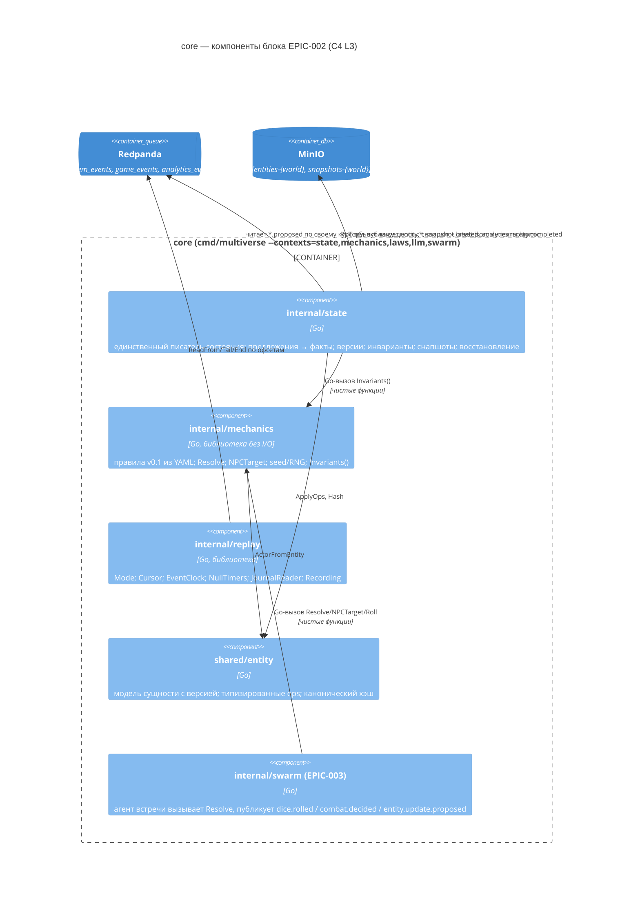

# Компоненты блока «Состояние и механика» (EPIC-002)

> **Состояние дерева на 2026-09-11 (T-409).** `internal/state` и `internal/replay` в дереве **нет**; роль State играет `shared/testkit/state.FakeState` (в памяти, без объектного хранилища, интентов и снапшотов). `internal/mechanics` есть: типы C-03, `Load` правил, формулы, RNG, `ActorFromEntity`, `DiceRolledPayload`, реестр инвариантов — но `Resolve` и `ChangesFor` возвращают `ErrNotImplemented`, `NPCTarget` ещё без канала ошибки (T-053), у инвариантов нет проверок (T-054). Ответственность ниже — целевая. Правило для владельца: вливая настоящий контекст, тем же изменением снять пометку «будущее» с `diagrams/c4-component-state-and-mechanics.md` (решение 2026-09-11).

Версия 0.3 · 2026-09-11 · architect#1 (TEAM-1) · статус: **утверждён на G2 (2026-09-09)**; запросы §14 приняты системным архитектором (`consolidation.md` §2, S-1…S-6 — «П»); детализация инкрементов — `epics/EPIC-002-state-mechanics/design.md`.
**v0.3 — сведение расхождений волны 0** (§17): §4.4 (что живёт только в указателе), §4.5 п. 1а (одна сущность — один набор изменений) и п. 9 (`details.batch_size` снят), §4.10 (объект снапшота в фикстурах), §5.1 (сигнатуры C-03 v1.2), §5.3 (предел 1000 — часть грамматики), §5.4 (`NPCTarget` и его ошибка). Действует правило приоритета `contracts.md` v0.5: где принятый код и документ расходились, побеждала форма с доказательством.
**Дополнение после G2**: правки по `consolidation.md` §9 внесены точечно с пометкой «Дополнение после G2»; сводка — §16. Где старый текст противоречит дополнению — действует дополнение.
**Правка T-471 (2026-09-14, system-architect#1)**, без смены номера версии: §4.1 и §4.6 (строка `system`, «Отдых») — сняты пометки «Код расходится до T-471», код T-471 им соответствует; порядок отдыха называет шаг 7 (C-02 v1.8a).
Границы заданы `architecture/overview.md` §11–§19, ADR-001, ADR-003, ADR-004, ADR-007, ADR-010 и контрактами C-01, C-02, C-03, C-13, C-14 (`architecture/contracts.md`). Этот документ — уровень **компонентов** (C4 L3) внутри контейнера `core` для пакетов `internal/state`, `internal/mechanics`, `internal/replay`, `shared/entity` и файла `rules/dark-forest.yaml`. Решения уровня реализации — ADR-011 (хранение и снапшоты), ADR-012 (правила как данные), ADR-013 (версии и atomic-пакеты). Запросы на изменение контрактов — §14.

Трассировка: FR-018, FR-020…FR-025, FR-030…FR-034, FR-087; BR-01, BR-03, BR-04, BR-05, BR-06, BR-13, BR-16; NFR-001, NFR-010…NFR-014, NFR-020, NFR-033, NFR-060, NFR-061, NFR-064; UC-004, UC-006…UC-011, UC-015…UC-017, UC-025, UC-026; `data-model.md` §3, §4, §6.3, §8, §10; `api-contracts.md` §2.3.4, §2.3.5, §2.3.12; `domain-review.md` §3.2–3.3; PRD приложение A.

---

## 1. Место блока в контейнере `core`



Правила зависимостей (**Дополнение после G2**: приняты ADR-001 дополнение п. 2, S-2; кодируются в `.golangci.yml` `depguard` в EPIC-001 F-2): `internal/state → internal/mechanics` (библиотека инвариантов, чистая), `internal/mechanics → shared/entity`, `internal/state → shared/{entity,eventbus,contracts,objstore,clock,runtime,logging,env}`. `internal/replay` импортирует **только** `cmd/multiverse` (сборка `EventClock`, таймеров, журнала и режима в `runtime.Deps`); контексты получают их через интерфейсы `shared/clock` и `shared/runtime` (см. `foundation.md` §3–§4). `internal/swarm`, `internal/gateway` не импортируют `internal/state` — общение только через шину. `cmd/mvctl/internal/world` (подкоманда `world init`, EPIC-002) импортирует `internal/state` (bootstrap) — допустимо по правилу «`cmd/*` импортирует всё».

Владение данными: `internal/state` — все сущности мира и снапшоты `snapshots-{world}/state/*`; `internal/mechanics` — не владеет состоянием (файл `rules/dark-forest.yaml` в Git); `internal/replay` — не владеет ничем персистентным (`testdata/recordings/*.jsonl` — EPIC-005).

---

## 2. Структура пакетов и модулей

```
internal/state/
  context.go        runtime.Context: Start(ctx, deps) / Stop / Health; создаёт по worker'у на мир
  worker.go         последовательная обработка предложений одного мира (mailbox); тайлинг system_events с курсора
  proposal.go       разбор entity.create.proposed / entity.update.proposed → Proposal (типизировано)
  apply.go          Applier: Validate → ApplyOnCopies → Invariants → Persist → Publish
  ownership.go      level_violation по contracts.OwnershipRules
  invariants.go     адаптер: mechanics.Invariants() над WorldView (overlay копий) → law_violation
  world.go          WorldSet: рабочий набор мира в памяти, индексы (по типу, по трофеям, по группам)
  store.go          Store (интерфейс) + objStore (реализация над shared/objstore)
  memstore/         in-memory Store (тесты, testkit.FakeState)
  intent.go         интент atomic-пакета (WAL из одного объекта) — запись, roll-forward, удаление
  snapshot.go       Snapshot: сборка, state_hash, запись объекта + latest.json, ротация K=5
  recovery.go       протокол старта: latest.json → снапшот → факты журнала → сверка объектов → интенты → replay.completed
  dedup.go          дедуп proposal_id (LRU 10k + last_change сущности) и event.id фактов
  facts.go          конструкторы событий entity.created/updated/update.rejected, snapshot.created, analytics.replay.completed
  bootstrap.go      загрузка фикстур (мир/регион/NPC/игроки) через create.proposed из testdata/fixtures — используется тестами и mvctl world init (§4.10)
  health.go         секция /health: lag, snapshot, intents, counters
  admin.go          Routes(mux): POST /v1/admin/state/{world}/snapshot — монтируется на HTTP-сервере процесса shared/runtime (MV_CORE_ADDR=127.0.0.1:8090), обёрнут runtime.AdminOnly (Дополнение после G2: D-7)
cmd/mvctl/internal/world/
  init.go           mvctl world init --world <id> --fixtures <dir> [--bus kafka|memory]: EnsureBucket ×2 → bootstrap → снапшот seq 0 reason=bootstrap (Дополнение после G2: epics.md §2)
  status.go         mvctl world status: latest.json, entities_count, cursor, health
internal/mechanics/
  types.go          Actor, Action, Outcome, Roll, ProposedChange, Item, ErrNotImplemented — весь публичный словарь C-03 (есть в дереве; в раскладке v0.2 не был назван, T-409)
  rules.go          Rules, Load(path), RulesDocument (YAML-модель), валидация
  formula.go        мини-грамматика формул: DiceExpr, CheckExpr; парсер и вычислитель
  rng.go            Seed, NewRNG, roll (одна реализация детерминизма)
  resolve.go        Resolve(causeEventID, rollIndexStart, Action, actors) → Outcome, []Roll
  target.go         NPCTarget(npc, candidates) → (*Actor, error)   # канал ошибки — C-03 v1.2
  invariants.go     реестр инвариантов inv-01…inv-10 (реализации), Invariants(), StateView, Violation
  actor.go          ActorFromEntity(e, enc) → (*Actor, error) — enc = сущность встречи (nil вне боя)
  changes.go        ChangesFor(Action, Outcome, attacker, target, factEventID) → ([]ProposedChange, error)
  dice_event.go     DiceRolledPayload(roll, roller entity.Ref) — единственный конструктор payload dice.rolled
internal/replay/
  cursor.go         Cursor map[topic]int64; Merge/Min; JSON
  eventclock.go     EventClock (реализует clock.Clock; Observe(ts) монотонно)
  timers.go         NullTimers (реализует clock.Timers; таймеры никогда не срабатывают)
  journal.go        ReadRange(bus, topic, from, to), Tail(bus, topic, from, h): обёртки над eventbus.Journal
  recording.go      Reader/Writer JSONL событий; Index по (type, ключ) для RecordedProvider (EPIC-003) и харнесса
  middleware.go     BusMiddleware: в режиме replay — EventClock.Observe перед handler, meta.replay=true при пробросе
shared/entity/      (раскладка по дереву на 2026-09-11, T-409; файлов ref.go и change.go нет — их содержимое живёт ниже)
  entity.go         Entity{ID, Type, WorldID, Name, Version, CreatedAt, UpdatedAt, LastEventID, Attributes, LastChange, History}; Ref{ID, Type}; LastChange
  ops.go            OpKind set|inc|append|remove; Op; ApplyOps(e, ops) → []Change; Change{Path, Old, New}, ChangeSet; reservedPaths; set без изменения значения изменения не даёт
  path.go           запись по пути операции (`members[0].participation`): splitPath, setIn, deleteIn; чтение пути делегировано shared/jsonpath
  hash.go           CanonicalJSON(e) без служебных полей; StateHash(entities)
  attrs.go          типизированные геттеры: HP(), HPMax(), Status(), Position(), Scope(), GroupID(), EncounterID(), Inventory(), Members()…
  types.go          константы типов (world, region, player, npc, group, encounter), статусов, причин (cause), причин отказа; TerminalStatuses, IsTerminalStatus, StatusTransitionAllowed (матрица статусов, C-02 v1.4)
rules/dark-forest.yaml
schemas/events/entity.create.proposed.v1.json, entity.update.proposed.v1.json, entity.created.v1.json,
               entity.updated.v1.json, entity.update.rejected.v1.json, dice.rolled.v1.json,
               snapshot.created.v1.json, analytics.replay.completed.v1.json
shared/testkit/state/fake_state.go       testkit.FakeState (C-02): memstore + membus, WithInvariants()
shared/testkit/mechanics/fixed.go        testkit.FixedMechanics (C-03): табличные исходы по seed
testdata/fixtures/{world,region,npc,players}.json, testdata/fixtures/snapshots/state/latest.json
```

Владелец каждого файла — EPIC-002 (`plan/ownership.md`). Схемы `analytics.replay.completed` — совместно с EPIC-005 (mode=test), файл один.
**Дополнение после G2 (F-10)**: `shared/entity` v2 (§3), `internal/mechanics/{rules,formula,actor}.go` (типы C-03 + `Load`, без `Resolve`), `rules/dark-forest.yaml`, `testkit/state.FakeState` v0 (ops в память, факты, без инвариантов), `testkit/mechanics.FixedMechanics`, фикстуры — создаются в EPIC-001 F-10 (developer + architect#1) по этому документу; с волны 1 владелец — EPIC-002, который заменяет v0 реализацией в своей ветке. `testdata/fixtures/**` после создания — общие (менять существующие — уведомить tech-lead#1).

---

## 3. `shared/entity` — модель сущности и типизированные ops

### 3.1. Структура (в памяти и на диске — одна)

```go
package entity

type Entity struct {
    SchemaVersion int            `json:"schema_version"`          // 1
    ID            string         `json:"id"`
    Type          string         `json:"type"`                    // world|region|player|npc|group|encounter
    WorldID       string         `json:"world_id"`                // = ID для type=world
    Name          string         `json:"name"`
    Version       int64          `json:"version"`                 // строго +1 на факт
    CreatedAt     time.Time      `json:"created_at"`              // = timestamp create.proposed
    UpdatedAt     time.Time      `json:"updated_at"`              // = timestamp последнего *.proposed
    LastEventID   string         `json:"last_event_id"`           // id последнего факта entity.created/updated
    Attributes    map[string]any `json:"attributes"`              // доменные атрибуты (data-model §3)
    LastChange    *LastChange    `json:"last_change,omitempty"`   // commit-record последнего применения (ADR-011)
    History       []HistoryEntry `json:"history,omitempty"`       // последние 50; полная история — журнал
}

type HistoryEntry struct { Version int64; EventID, ProposalID string; At time.Time }

type LastChange struct {
    ProposalID      string    `json:"proposal_id"`
    ProposalEventID string    `json:"proposal_event_id"`
    FactEventID     string    `json:"fact_event_id,omitempty"`   // пусто, пока факт не опубликован
    Cause           string    `json:"cause"`
    Changed         []Change  `json:"changed"`
    AppliedAt       time.Time `json:"applied_at"`
    Atomic          bool      `json:"atomic"`
    BatchSize       int       `json:"batch_size"`
}
```

Отличия от as-is `shared/entity.Entity`: `Payload` → `Attributes`; добавлены `Version`, `WorldID`, `Name`, `LastEventID`, `LastChange`, `SchemaVersion`; `History` ограничена; методы `Set/Get/AddToStringSlice/…` заменены `ApplyOps` и типизированными геттерами; `time.Now()` внутри методов удалён (время — только из событий). Старые объекты `entities-{world}/{id}.json` с `payload` не читаются (overview §19).

### 3.2. Ops

```go
type OpKind string
const ( OpSet OpKind = "set"; OpInc OpKind = "inc"; OpAppend OpKind = "append"; OpRemove OpKind = "remove" )

type Op struct { Op OpKind `json:"op"`; Path string `json:"path"`; Value any `json:"value,omitempty"` }
// На проводе old есть ⇔ путь существовал до изменения, new есть ⇔ путь существует после (C-02 v1.6, T-448);
// наличие решают только признаки HasOld/HasNew (не значение: null — это значение), MarshalJSON/UnmarshalJSON
// пишут и читают ключи по ним. MarshalJSON возвращает ошибку, если нет ни одного признака или значение не nil
// при опущенном признаке — дефект виден у издателя с путём, а не в схеме entity.updated при Publish.
type Change struct { Path string; Old, New any; HasOld, HasNew bool }

// JSONCompatible — значение переживает провод: кодируется в JSON и не несёт числа по модулю ≥ 2^53 (C-02 v1.6).
// Им State проверяет value каждой операции и attributes создания (§4.5).
func JSONCompatible(v any) bool

// ApplyOps применяет ops к КОПИИ e.Attributes и возвращает список изменений; при ошибке — ErrInvalidOp{Op, Reason}.
func ApplyOps(e *Entity, ops []Op) (attrs map[string]any, changed []Change, err error)
func Clone(e *Entity) *Entity
```

| Op | Семантика | Ошибка `invalid_op` |
|---|---|---|
| `set` | записать `value` по `path` (создаёт промежуточные map); в `changed` `old` есть, только если путь существовал (T-448) | путь зарезервирован; `value` — не JSON-совместимое значение, в том числе число по модулю **не меньше 2^53** где угодно внутри `value` (допустимо `\|x\| ≤ 2^53−1`, C-02 v1.6) |
| `inc` | целочисленный `value` прибавить к текущему (отсутствующее = 0); для путей `hp` — clamp в `[0, hp_max]` (§6.4) | текущее значение не число; `value` не целое; `value`, текущее значение или результат по модулю не меньше 2^53 (C-02 v1.6; у текущего значения своя причина в тексте ошибки — виноват атрибут, а не операция) |
| `append` | добавить `value` в список по `path` (создаёт список); элементы-объекты с полем `item_id`/`player_id`/`npc_id` не дублируются по этому ключу (повтор = no-op, `changed` пуст); объект без такого поля — повтор, только если равен элементу целиком; равенство — в канонической JSON-форме (§3.3; изм. T-449, T-050) | по пути не список |
| `remove` | с `value`: удалить из списка элементы, равные `value` (по `item_id`/`player_id`/`npc_id` для объектов, по равенству для скаляров; равенство — в канонической JSON-форме, §3.3; изм. T-449, T-050); без `value`: удалить ключ | по пути нет ключа/списка |

Пути — грамматика `shared/jsonpath` (`a.b[0].c`); запись через `jsonpath.Accessor.Set/Delete` (уже реализованы). **Каноническая запись пути (C-02 v1.8 п. 2; изм. T-470, просмотр T-056, ответ 2).** Операция несёт путь только в канонической записи: ключи через одну точку; индекс только в скобках после ключа — `[0]` или до девяти цифр без ведущего нуля; ключ не пуст, без `.`, `[`, `]` и не читается как целое (`inventory.0`, `+1` недопустимы); путь ниже атрибута, который `data-model.md` §3 типизирует одним значением (`status.x`, `hp.x`, `name.x`), недопустим. Перечень скаляров — только таблицы сущностей `data-model.md` §3: общие атрибуты (с `name`; без `scope` — объект `{id, type}`), §3.1–§3.4, §3.6, §3.7; поля Item §3.5 (`item_id`, `acquired_at`, `source`) — значения внутри `inventory[]`, а не атрибуты, и в перечень не входят; контейнеры §3 (`canon[]`, `spawned_by`, `inventory[]`, `participants[]`) и атрибуты вне §3 скалярами не считаются, а список в коде сверяется с этими таблицами *(итерация 2 T-470, Ma-1, Mi-2 ревью #1; приёмка T-470, Mi-3 ревью #2: прежде «только таблицы `data-model.md` §3» без исключения §3.5)*. Разбор `jsonpath` терпимее: `status.`, `.status` и `inventory.0` он читает как второе написание того же пути. Целевое место правила — `ApplyOps`: `invalid_op` на путь не в канонической записи, на путь ниже типизированного скаляра и на значение чужого вида в корне типизированного атрибута после операций (`set hp {x: 999}`); виды — таблица «тип сущности → атрибут → вид значения» в `attrs.go` рядом с `Attr*` (текст, целое, число, время, длительность, ссылка, перечисление; `null` — у необязательных; атрибут вне таблицы не типизирован). Создание проверяет `attributes` по той же таблице; правило догона (§4.8) считает путь не в канонической записи повреждённым фактом. До T-472 (EPIC-002, перенос в `shared/entity`) правило держит шаг 1 State (§4.5 п. 1). Зарезервированные пути (`id`, `type`, `world_id`, `version`, `created_at`, `updated_at`, `last_event_id`, `history`, `last_change`, `schema_version`, любой путь с ведущим `_`) → `invalid_op`. `changed[]` строится **после** применения всех ops сущности: один элемент на конечный путь (первый `old`, последний `new`), `no-op` исключается: путь был и до, и после (или не был ни до, ни после), и значение в канонической форме (§3.3) не изменилось *(итерация 2 T-449, ревью #1 Mi-2; T-050 — сравнение каноническое и учитывает наличие пути; прежде «равенство `old == new` по `reflect.DeepEqual`»)*; если `changed` пуст — версия **не** увеличивается, факт `entity.updated` публикуется с `changed: []` (UC-011 E2 «HP уже max — ход засчитан»), `version` не меняется. **Форма элемента (C-02 v1.6, T-448):** `old` есть ⇔ путь существовал до изменения, `new` есть ⇔ путь существует после; `set` существующего — оба, `set` отсутствовавшего (в т. ч. в `null`) и `inc` отсутствовавшего — только `new`, `append` — путь элемента `a[n]` и только `new`, `remove` без `value` (ключ) — только `old`, `remove` с `value` и `remove` элемента по индексу — путь списка, оба (список до и после). Если путь, затронутый операцией, в конце отсутствует, а его предок предложением создан (не было или был скаляр — есть контейнер: `inc fresh.deep` + `remove fresh.deep` оставляет `fresh = {}`), в `changed[]` добавляется элемент предка — иначе догон §4.8 не восстановил бы его. Элемент предка идёт **после** элементов путей; порядок — часть формы, потому что догон применяет элементы по порядку (элемент предка переписывает записанное под ним согласованно).

### 3.3. Хэш

```go
// CanonicalJSON: {"id","type","version","attributes"} с отсортированными ключами, без пробелов, числа как int64/float64 без экспоненты.
func CanonicalJSON(e *Entity) []byte
// StateHash: sha256 по конкатенации CanonicalJSON сущностей, отсортированных по (type, id); формат "sha256:<hex>".
func StateHash(es []*Entity) string
```

Хэш исключает `updated_at`, `history`, `last_change`, `last_event_id` — они не влияют на игровое состояние и позволяют `mvctl report --audit` (EPIC-005) пересчитать хэш из снапшота + `entity.updated.changed[]`. Метрика `recovery_state_identical` (metrics.md) сравнивает именно этот хэш.

**Каноническая форма значения (изм. T-449; T-050, подтверждено system-architect).** Значение пишется в форме после `json.Marshal` → `Unmarshal`: типизированный `nil` — `null`; `float32` — десятичная запись кодировщика, а не ближайший `float64`; `[]byte` — строка base64; `json.RawMessage`, `time.Time` и тип со своим `MarshalJSON`/`MarshalText` — тем, что пишет метод; `map` с целыми ключами — объектом со строковыми ключами; структура — объектом с отсортированными ключами. Исключение — три `nil`-контейнера `jsonpath`: `nil` у `[]any`, `map[string]any` и `[]map[string]any` пишется `[]`/`{}`, потому что `jsonpath.Clone` пересобирает их пустыми и после `Commit` сущность держит пустые. *Почему:* значение, пришедшее с шины, этими ветками не проходит, поэтому хэши данных с шины не изменились; а сущность, собранная в Go (bootstrap, `append` структуры `Item`), хэшируется так же, как после снапшота. Доказательство — `TestStateHashOfAGoBuiltWorldMatchesItsWireForm` и дифференциальный тест приёмки T-050 на 60 120 значениях. Числа по модулю от 2^53 JSON без потерь не переносит — с T-448 их отвергает State: `ApplyOps` — в значениях операций, проверка создания (`entity.JSONCompatible`) — в `attributes`; допустимый диапазон ±(2^53−1) (C-02 v1.6, в EPIC-002 с T-448, в develop — с контрольного слияния EPIC-002; итерация 2 T-449, N-5; изм. T-456, R2-N-3 ревью #2 T-449).

---

## 4. `internal/state` — единственный писатель

### 4.1. Внутренняя модель

```go
package state

type Proposal struct {
    ID       string            // proposal_id — обязателен и для create, и для update (C-02 v1.6, T-448); подстановки id события нет
    Event    eventbus.Event    // событие *.proposed целиком (для Derive и timestamp)
    Kind     Kind              // KindCreate | KindUpdate
    Create   *CreateSpec       // {Ref entity.Ref; Name string; Attributes map[string]any}
    Changes  []Change          // для update
    Atomic   bool
    Cause    string            // combat|rest|move|loot|spawn|tick|group|create|flee|death|init
    Proposer Proposer          // {Kind: gateway|agent|author|system; Level string; AgentID string; Source string}
}
type Change struct { Ref entity.Ref; ExpectedVersion *int64; Ops []entity.Op }

type Result struct { Applied []Applied; Rejected []Rejection }
type Applied struct { Entity *entity.Entity; Changed []entity.Change; Created bool }
type Rejection struct { Reason Reason; Ref *entity.Ref; ExpectedVersion, ActualVersion *int64; InvariantID string; Message string }

type Reason string // version_conflict|unknown_entity|level_violation|law_violation|invalid_op|dead_entity|duplicate_entity
```

`Proposer` выводится рантаймом: `meta.agent != nil` → `agent` с `Level = meta.agent.level`; иначе `source` события: `gateway` → `gateway`; `mvctl` → `author` (включая bootstrap, §4.10); ~~`core/state` (bootstrap) → `system`~~ *(изм. T-444, C-02 v1.5: предложения bootstrap публикуются с `source=mvctl` — `core/state` нет в `Spec.Publishers` типов предложений, и при `--bus kafka` публикует процесс `mvctl`, а не `core`; строка `system` в `ownership.go` остаётся без издателя в MVP-1, решение о ней — за EPIC-002)*. Отдельно `actor_kind` не участвует в проверке владения (он про сессию, не про право писать).

Агент с `meta.agent.level` не из `global|domain|task|object|monitor` строки не получает, и источник при этом не решает (`level_violation`). `testkit/gateway` сопоставляется с `gateway`. Строка `system` пуста (C-02 v1.8 п. 6) *(изм. T-470; просмотр T-056, ответ 7; пометка «Код расходится до T-471» снята, изм. T-471: строка в `ownership.go` пуста, `proposerOf` её не выводит)*.

### 4.2. Рабочий набор мира

```go
type WorldSet struct {
    worldID   string
    byID      map[string]*entity.Entity          // ключ — id (уникален в мире)
    byType    map[string]map[string]*entity.Entity
    lootIndex map[string]string                   // item.source.entity.id → player_id (inv-03)
    laws      string                              // World.attributes.laws_version
}
type WorldView interface { Get(id string) (*entity.Entity, bool); ByType(t string) []*entity.Entity; WorldID() string }
// overlayView: WorldSet + копии изменённых сущностей текущего предложения — по нему считаются инварианты
```

Один мир — одна горутина-worker (`worker.go`): последовательный порядок применения = порядок в `system_events` (одна партиция). Параллельность между мирами — по worker'у на мир. При ≤ 50 сущностей на scope это единицы МБ и микросекунды на операцию.

### 4.3. Interface Store и раскладка объектов

```go
type Store interface {
    // сущности (entities-{world}/{type}/{id}.json)
    ListEntities(ctx context.Context, worldID string) ([]*entity.Entity, error)
    GetEntity(ctx context.Context, worldID, entityType, id string) (*entity.Entity, error)   // ErrNotFound
    PutEntity(ctx context.Context, worldID string, e *entity.Entity) error                     // PUT целиком, ContentType application/json
    // интенты atomic-пакетов (entities-{world}/_intents/{proposal_id}.json) — ADR-013
    PutIntent(ctx context.Context, worldID string, in *Intent) error
    ListIntents(ctx context.Context, worldID string) ([]*Intent, error)
    DeleteIntent(ctx context.Context, worldID, proposalID string) error
    // снапшоты (snapshots-{world}/state/{ts}-{seq}.json + latest.json) — ADR-011
    PutSnapshot(ctx context.Context, worldID string, s *Snapshot) error       // объект, затем latest.json
    ReadLatest(ctx context.Context, worldID string) (*LatestPointer, error)   // ErrNoSnapshot
    ReadSnapshot(ctx context.Context, worldID, key string) (*Snapshot, error)
    ListSnapshots(ctx context.Context, worldID string) ([]SnapshotRef, error) // по seq убыв.
    DeleteSnapshot(ctx context.Context, worldID, key string) error
}
```

Реализации: `objStore` (над `shared/objstore`, ключи и бакеты из `objstore/buckets.go`), `memstore.Store` (map + копии; используется в unit-тестах, e2e `--bus=memory`, `testkit.FakeState`). Замена на PostgreSQL при росте — новая реализация без изменения `Applier` (NFR-081, ADR-004).

Ключи: `entities-{world}/{type}/{id}.json`; `entities-{world}/_intents/{proposal_id}.json`; `snapshots-{world}/state/{YYYYMMDDTHHMMSSZ}-{seq:06d}.json`; `snapshots-{world}/state/latest.json`.
**Дополнение после G2 (ADR-021 п. 3, D-6)**: бакеты `entities-{world}` и `snapshots-{world}` создаёт `mvctl world init` через `objstore.EnsureBucket(bucket, objstore.BucketOptionsFor(bucket))` — versioning + ILM `noncurrent-expire-days 30` включаются кодом (init-контейнер не видит ещё не созданных бакетов). Versioning — **только страховочный слой**: ни один путь State не зависит от него (откат снапшота — ротация K=5; история сущности — `history`/`last_change`; интент — обычный объект). При `Capabilities().Versioning=false` (`objstore.Memory`, будущая замена сервера) поведение State не меняется. Объект `Put` использует `PutOptions{ContentType: "application/json"}`; `ETag` не сохраняется (целостность — `state_hash` и `version`).

### 4.4. Формат `latest.json` (указатель, не состояние)

**Дополнение после G2 (S-5 → C-14 v1.1)**: формат указателя закреплён контрактом; `component ∈ state|swarm|gateway`; тот же формат реализуют EPIC-003 (`swarm/`) и EPIC-004 (`gateway/`). Фикстура `testdata/fixtures/snapshots/state/latest.json` (seq 0 «Тёмного леса», F-10) — эталон для потребителей read-model до готовности State.

```json
{
  "schema_version": 1,
  "component": "state",
  "world": { "entity": { "id": "dark-forest-world", "type": "world" } },
  "snapshot": {
    "id": "state:dark-forest-world:000042",
    "seq": 42,
    "key": "state/20260909T101500Z-000042.json",
    "taken_at": "2026-09-09T10:15:00Z",
    "cursor": { "system_events": 12345 },
    "laws_version": "v1",
    "rules_version": "0.1",
    "state_hash": "sha256:…",
    "size_bytes": 184320,
    "entities_count": 17,
    "reason": "interval|session_ended|shutdown|admin|bootstrap"
  },
  "written_at": "2026-09-09T10:15:00.120Z",
  "writer": "core/state@host:pid"
}
```

Потребители read-model (gateway, swarm) читают `latest.json`, затем объект `snapshot.key` и проверяют `state_hash` (пересчёт `entity.StateHash`). `cursor` — офсет **следующего** непрочитанного сообщения по топику; потребители догоняют `entity.updated` с `cursor.system_events`. `latest.json` записывается **после** успешного PUT объекта снапшота: если процесс упал между ними, указатель ссылается на предыдущий целостный снапшот.

Объект снапшота:

```json
{ "schema_version": 1, "component": "state", "snapshot": { …как в latest… },
  "world_id": "dark-forest-world",
  "entities": [ { …entity.Entity, включая last_change… } ],          // отсортированы по (type, id)
  "applied_proposals": [ "…последние 1000 proposal_id…" ] }
```

`state_hash` считается по `entities` (§3.3) и хранится в `snapshot.state_hash`; при чтении проверяется — несовпадение = повреждённый снапшот (UC-025 E1).

**Что живёт только в указателе (сведение волны 0, T-016).** `size_bytes`, `entities_count`, `rules_version` и `reason` — поля **указателя**, а не объекта и не события. `size_bytes` объект не может назвать сам: записав в себя собственную длину, он её изменит; длину знает тот, кто объект уже записал, — писатель указателя. `snapshot.created` строится из указателя **снятием** `rules_version`, `entities_count` и `reason`, а схема `snapshot.created.v1.json` остаётся закрытой (`additionalProperties: false`): принцип fail-closed важнее удобства потребителя, схему под эти поля не расширять. Порядок чтения потребителем — указатель → объект по `snapshot.key` → сверка `state_hash`; ключ объекта **выводится** из `taken_at` и `seq` (§4.3), а не берётся литералом: иначе сдвиг `taken_at` при неизменном имени файла оставляет расхождение указателя и объекта незамеченным (мутация ревьюера T-016, Minor-1).

### 4.5. Обработка `entity.update.proposed` → `entity.updated | entity.update.rejected`

Пошагово (`apply.go`), всё внутри worker'а мира:

1. **Разбор** (`proposal.go`): валидность уже проверена библиотекой шины по схеме; извлекаются `proposal_id`, `changes[]`, `atomic`, `cause`, `meta.agent`. Ошибка формы операций — неизвестный `op`, пустой путь, путь не в канонической записи или ниже скаляра (C-02 v1.8 п. 2), служебный корень, число по модулю от 2^53 — даёт `invalid_op` на всё предложение до дедупликации (п. 2) и владения. Правило п. 1а проверяется раньше *(изм. T-470; прежде «Ошибка формата ops (неизвестный `op`, пустой `path`)»)*.

   **Предложение без `proposal_id` (C-02 v1.6, T-448).** Поле обязательно в обоих типах предложений, и шина с проверкой при чтении (`MV_BUS_VALIDATE_ON_READ`, по умолчанию включена) паркует такое событие в `dead_letters` раньше State. Дойти до State оно может только при выключенной проверке (явный выбор оператора) или при прямом вызове. Тогда State предложение **не применяет и не отвергает** — `entity.update.rejected` требует `proposal_id`, и валидного отказа без него нет, — пишет `Warn` с `event_id` и `type`, фиксирует офсет и идёт дальше. Подстановки идентификатора события нет; своего пути в `dead_letters` для этого случая State не заводит. Правило нормативно для всех реализаций State (двойник — `shared/testkit/state`, `refuseMalformed`).

   **п. 1а. Одна сущность — один набор изменений** (`apply.go`): если `changes[]` называет одну сущность (по `entity.id`) дважды — предложение отклоняется **целиком**, `rejected reason=invalid_op`, `entity` = повторённая сущность, независимо от `atomic`; в лог пишется, что делать вместо этого (слить операции сущности в один набор). *Почему отдельным шагом и почему до дедупа:* у такого пакета нет исхода, который разрешает C-02. Применённые по очереди, два набора дают два `entity.updated` на одну сущность под одной версией (зонд ревью #1 T-017: `inc hp -1` и `inc hp -2` по `player-A` → hp 8, версия 2, два факта, 10→9 и 10→8) — нарушены «версия строго +1 на сущность» (C-02) и «один факт на сущность» (п. 12). Применённые как один — молча теряют первый набор. Правило **не выражается схемой**: JSON Schema не умеет требовать уникальность по вложенному полю (`uniqueItems` сравнивает элементы целиком, а два набора по одной сущности различаются операциями), поэтому реестр такое предложение пропускает и отвергать его обязана каждая реализация State, а не только заглушка. Настоящая реализация (T-056) **не должна выводить это правило из журнала заглушки** — оно записано здесь и в C-02 v1.3.

2. **Дедуп** (`dedup.go`): `proposal_id ∈ applied LRU` **или** у **хотя бы одной** целевой сущности `last_change.proposal_id == proposal_id` → предложение уже применено *(изм. T-470, C-02 v1.8 п. 5; прежде «у всех»)*. Если факты для него ещё не подтверждены (`last_change.fact_event_id == ""`) — повторно опубликовать факты (§4.8) и выйти; иначе выйти молча (лог `debug`, `handled=true`). *Почему не «у всех»:* частично применённый неатомарный пакет оставляет запись только на применённых сущностях, и правило «у всех» применило бы эту часть второй раз, как только окно забудет id (C-02 v1.8 п. 5). Повтор частично применённого пакета ничего не применяет и ответа не получает; отказ всего предложения в окно не входит, и его повтор решается заново.
3. **Существование**: каждая `changes[i].entity` найдена в `WorldSet` → иначе `unknown_entity`. Тип набора, не совпадающий с типом сущности в мире, — `invalid_op`; владение и нормы читают тип мира *(изм. T-470)*.
4. **Версия**: `expected_version` задан и `≠ entity.Version` → `version_conflict {expected_version, actual_version}`.
5. **Мёртвые**: `status ∈ {dead, abandoned, ascended_final}` *(изм. T-457: `abandoned` — по C-02 v1.2)* у сущности **до** применения → `dead_entity`, кроме ops только по путям `died_at`, `killed_by`, `loot_claimed_by`, `encounter_id` и кроме `type=encounter/group` (у них нет `dead`). Переход терминальной сущности в нетерминальный статус (`dead → alive` и любой другой) — тоже `dead_entity` на этом шаге, в том числе когда пакет заодно стирает `died_at`/`killed_by` *(изм. T-457, C-02 v1.5b; прежде «запрещён всегда (`law_violation inv-09`)»: проверка шага 8 перехода не видит, мира «до» у неё нет)*.
6. **Владение** (`ownership.go`): для каждой (сущность, op) проверка по `contracts.OwnershipRules` (§4.6) → `level_violation`.
7. **Применение на копиях**: `entity.ApplyOps` на `Clone(e)` → `attrs, changed` или `invalid_op`. Нормы, которые читают результат, решаются по копии после `ApplyOps`. Переход статуса сравнивает сущность до и после: статус после операций не строка или переход вне матрицы — `invalid_op`; остальное — нормы `abandoned` (C-02 v1.2, v1.5). Норма отдыха — §4.6 *(изм. T-470)*.
8. **Инварианты** (`invariants.go`): `overlayView` (WorldSet + копии) → `mechanics.Invariants()` с `touched` — id всех сущностей применяемой части пакета, включая наборы с пустым `changed[]` *(изм. T-470; прежде «`touched = ids изменённых`»)* → первое нарушение → `law_violation {invariant_id}`.
9. **Решение по пакету**: `atomic=true` — любая ошибка на шагах 3–8 отклоняет **весь** пакет одним `entity.update.rejected` (в `entity` — первая проблемная сущность; **`details.batch_size` не публикуется**: схема `entity.update.rejected.v1.json` закрыта, `details` знает только `expected_version`, `actual_version`, `invariant_id`, и `api-contracts.md` §2.3.4 называет тот же набор. Размер пакета издателю и так известен — он его и составил, а применённый размер остаётся в `last_change.batch_size` сущности. Открывать закрытую схему ради поля, которое ничего не сообщает потребителю, — та же уступка, от которой отказались в §4.4). `atomic=false` — ошибки отклоняют только свои `changes[i]` (по одному `rejected` на сущность), остальные применяются; инварианты пересчитываются по оставшимся. Закон, ответивший на сущность без оставшегося набора (её нет в пакете или её набор отвергнут раньше), — `law_violation` каждому оставшемуся набору под его сущностью, с `invariant_id` закона; сущность закона — только в логе (`entity_id`). Закон, ответивший на сущность оставшегося набора, отвергает этот набор, и законы спрашиваются снова по остальным (C-02 v1.8 п. 1) *(изм. T-470)*.
10. **Фиксация**: для каждой применённой копии `Version++` (если `changed` не пуст), `UpdatedAt = proposal.Event.Timestamp`, `LastChange = {…, FactEventID: ""}`, `History` append (обрезка до 50).
11. **Персист** (`Persist`): если применённых сущностей > 1 и `atomic=true` → `PutIntent` (ADR-013); затем `PutEntity` по каждой в порядке возрастания `id`; после всех PUT — `DeleteIntent`. Ошибка PUT → повтор ×3 (100/300/900 мс); неуспех → worker переводит мир в `state: persist_failed`, `/health fail`, обработка останавливается (§9).
12. **Публикация** (`facts.go`): по одному `entity.updated` на сущность (`Derive(proposal.Event, …)`, `timestamp = proposal.Event.Timestamp`), общий `proposal_id`; порядок = порядок PUT; после `Publish` каждого факта — `LastChange.FactEventID = fact.ID`, `LastEventID = fact.ID` и **повторный PUT не делается** (поле `fact_event_id` дозаписывается при следующем изменении сущности или в снапшоте; при рестарте отсутствие `fact_event_id` при `version` ≥ восстановленной — сигнал сверки, §4.8). Затем `WorldSet` заменяет оригиналы копиями, `dedup.Add(proposal_id)`, счётчик снапшота `+len(applied)`.
13. **Аналитика**: ничего (`analytics.turn.completed` — gateway); `rejected` виден как событие.

`entity.create.proposed` (те же шаги без 4–5): `proposal_id` обязателен (C-02 v1.6, без него — пропуск по п. 1); `attributes` проходят `entity.JSONCompatible` — число по модулю не меньше 2^53 где угодно внутри → `rejected reason=invalid_op` (C-02 v1.6: иначе создание записало бы то, чего не может записать `set`); `duplicate_entity`, если `id` уже есть (с тем же `proposal_id` — дедуп; с другим — `rejected reason=duplicate_entity`; новая причина, §14); проверка `attributes` по типу (обязательные атрибуты `data-model.md` §3: для `player` — `hp, hp_max, atk, def, dmg, flee, status, position, scope, actor_kind`), владение (кто может создавать тип), инварианты; `Version = 1`, `CreatedAt = UpdatedAt = timestamp предложения`; факт `entity.created {entity, version:1, attributes, proposal_id}` (`proposal_id` в факте обязателен с C-02 v1.6).

Латентность применения (цель C-02: p95 ≤ 50 мс без шины): разбор+проверки+ops+инварианты ≪ 1 мс; PUT ≈ 5–20 мс локально; одна сущность → ≈ 20 мс; atomic-пакет из `n` сущностей → интент + `n` PUT + удаление ≈ 20·(n+2) мс (группа из 6 при перемещении ≈ 160 мс — вне критического пути боя; бой = 1–2 сущности).

### 4.6. Владение (level_violation) — таблица `contracts.OwnershipRules` для MVP-1

Структура (Go, в `shared/contracts/ownership.go`; наполнение подтверждает EPIC-003 по `owned_entity_types` блупринтов — C-02):

```go
type OwnershipRule struct {
    Proposer    string   // gateway | author | system | global | domain | task | object
    EntityTypes []string // "*" — любой
    Paths       []string // префиксы путей ("*" — любой); пути, не начинающиеся ни с одного, запрещены
    Causes      []string // допустимые cause; "*" — любой
    Create      bool     // разрешено entity.create.proposed этих типов
}
```

| Proposer | Типы | Пути | Причины | Create |
|---|---|---|---|---|
| `gateway` | `player` | `position`, `scope`, `group_id`, `encounter_id`; `hp` **только** при `cause=rest` (см. ниже) | `move, group, rest, create, leave` | `player`, `group` |
| `gateway` | `group` | `*` (кроме `encounter_id`) | `group, move` | `group` |
| `task` (агент встречи; механика внутри него) | `player` | `hp`, `status`, `position` (только `flee`), `inventory`, `encounter_id` | `combat, loot, flee, death` | — |
| `task` | `npc` | `hp`, `status`, `died_at`, `killed_by`, `loot_claimed_by` | `combat, death` | — |
| `task` | `encounter` | `*` | `combat, flee, group, death, resolve` | — |
| `domain` (GM региона) | `region` | `*` кроме `description` | `tick, spawn` | `npc`, `encounter` |
| `domain` | `npc` | `*` кроме `hp` вниз при живом игроке в встрече; `status: dead→alive` запрещён всегда (`dead_entity`, §4.5 п. 5; изм. T-457) | `tick, spawn` | `npc` |
| `domain` | `encounter` | `state`, `participants`, `npcs` (создание) | `spawn` | `encounter` |
| `global` | `world` | `weather`, `time_of_day`, `day`, `season`, `epoch` (не `laws_version`) | `tick` | — |
| `author` (`mvctl`, в том числе bootstrap) | `*` | `*` | `init, author` | все |
| `system` | — | — | — | — (резерв; C-02 v1.8 п. 6; изм. T-470; пометка «Код расходится до T-471» снята, изм. T-471: строка в `ownership.go` пуста) |
| `object`, `monitor` | — | — | — | — (зарезервировано C-13; спавн выключен) |

`scope` в строке gateway — это **право**, а не обязанность: таблица разрешает менять `scope`, но по C-04 v1.2 gateway предлагает его только вместе с изменением членства в группе; при движении в предложении есть один `position`. Иначе State получал бы набор без изменений и публиковал факт с пустым `changed[]` и той же версией.

Отдых (`rest`): предложение публикует **gateway** после валидации «не во встрече» с `ops: [{set hp = hp_max}]`, `cause=rest`; State проверяет: набор с `cause=rest` пишет только `hp`, и `hp` после операций равен `hp_max`, иначе `level_violation`; `hp > hp_max` или нет целого `hp_max` — `law_violation {inv-02}`; `hp` не целое — `invalid_op`; непустой `encounter_id` у сущности до операций — `law_violation` без `invariant_id`. Порядок: норма пути (шаг 6) → применение операций (шаг 7: всё, что отвергает `ApplyOps`, — `invalid_op` формы пакета) → встреча → вид `hp` → значение (C-02 v1.8a п. 3; пометка «Код расходится до T-471» снята, изм. T-471: код — `normAllows` и `restRefusal`) *(изм. T-470; прежде «State дополнительно проверяет `encounter_id == ""` и `new hp == hp_max` (иначе `level_violation`)»)*. Это уточнение `data-model.md` §4 («HP кроме rest через механику»): у `rest` нет агента встречи, а держать ради него Phase 1 в персональном GM противоречит его правилу «ничего не меняет». Запрос на подтверждение — §14.

### 4.7. Atomic-пакет: алгоритм для позиции группы (BR-13, inv-04)

Вход от gateway на `group.entered_region` (overview §20 п. 7): одно предложение

```json
{ "proposal_id": "…", "atomic": true, "cause": "move",
  "changes": [
    { "entity": {"entity": {"id": "g-1", "type": "group"}}, "expected_version": 7, "ops": [{"op":"set","path":"position","value":"dark-forest-01"}] },
    { "entity": {"entity": {"id": "player-A", "type": "player"}}, "expected_version": 23, "ops": [{"op":"set","path":"position","value":"dark-forest-01"}] },
    { "entity": {"entity": {"id": "player-B", "type": "player"}}, "expected_version": 11, "ops": [{"op":"set","path":"position","value":"dark-forest-01"}] } ] }
```

Алгоритм: шаги §4.5 1–10 на копиях; инвариант `inv-04` считается по `overlayView` для каждой затронутой группы: `∀ m ∈ group.members, status(m) = alive: position(m) == group.position` (мёртвые участники остаются в `members` формально — UC-009 A1 — и из проверки исключаются; допущение к подтверждению BA). `inv-06`: `player.scope == group:{g} ⇔ player.group_id == g ⇔ player ∈ g.members`. Если gateway забыл участника — пакет отклоняется целиком (`law_violation inv-04`, `entity` = участник), gateway публикует новый пакет. Персист: `PutIntent{proposal_id, world, changes: [{ref, from_version, to_version, attributes_after}]}` → PUT `g-1`, `player-A`, `player-B` (по `id`) → `DeleteIntent` → три `entity.updated` с общим `proposal_id`. Гарантия «все или ничего» на диске обеспечивается roll-forward интента при рестарте (§4.8, ADR-013). Идентичный механизм для `group.joined/left` (members + scope + group_id), для `encounter` + HP игрока/NPC в раунде (агент встречи может объединять в один пакет).

### 4.8. Протокол восстановления State (C-14, ADR-003 п. 3)

```mermaid
sequenceDiagram
    participant ST as core/state (world worker)
    participant S as Store (MinIO)
    participant J as Journal (system_events)
    participant BUS as Bus
    ST->>S: ReadLatest(world) → latest.json (или ErrNoSnapshot)
    alt latest.json есть
        ST->>S: ReadSnapshot(key); проверить state_hash
        Note over ST: несовпадение → ListSnapshots → предыдущий (до K=5); все битые → /health fail {snapshot: corrupted}, мир не обслуживается
    else нет снапшота
        ST->>S: ListEntities(world)
        Note over ST: объекты есть → восстановить из объектов, cursor = End(system_events), reason=no_snapshot, /health degraded; объектов нет → мир пуст (первый запуск: mvctl world init / bootstrap)
    end
    ST->>J: ReadRange(system_events, cursor, End)
    loop каждое событие
        Note over ST: entity.created/updated → applyFact (идемпотентно по event.id; version строго +1; иначе state_divergence → /health fail); *.proposed и прочее → пропуск
    end
    ST->>S: ListEntities(world) → сверка версий с памятью
    Note over ST: объект.version == mem+1 и last_change.fact_event_id == "" → «висящая запись»: принять объект, опубликовать недостающий entity.updated; объект.version > mem+1 → state_divergence → /health fail
    ST->>S: ListIntents(world) → roll-forward каждого (сущности с version < to_version дописать из attributes_after, PUT), опубликовать факты, DeleteIntent
    ST->>BUS: analytics.replay.completed {mode: recovery, snapshot_id, events_replayed, llm_calls: 0, dice_rolled_new: 0, state_hash_before, state_hash_after, identical, duration_ms, incomplete_record: false}
    ST->>ST: /health ok; cursor := End; старт Tail(system_events, cursor) — приём предложений
```

Правила:

- **Что переигрывается**: только факты `entity.created`, `entity.updated` (свои же). Применение факта (`created`) = записать `attributes`. Применение факта (`updated`) — **правило догона (C-02 v1.6, T-448)**: элементы `changed[]` по порядку; если у элемента есть `new` — записать его по `path`; промежуточный узел, которого нет или который не контейнер, заменяется объектом, как у `set`. Если `path` — элемент `a[n]` и `n` равно длине списка `a` (для `n = 0` — и когда списка нет или по пути списка `null`: это отсутствующий список), — дописать элемент в конец **простым добавлением, без дедупликации** по `item_id`/`player_id`/`npc_id`: решение о повторе уже принято при применении и отражено в факте. Элемента `a[n]` с `n` больше длины списка в факте State не бывает: индексы добавлений идут подряд, а любое сокращение списка несёт элемент пути списка. Такой элемент означает повреждённый факт — `state_divergence`, мир не обслуживается (§9), как при версии ≠ `mem.Version + 1`. Если `new` нет — удалить путь; если пути уже нет (предыдущий элемент того же факта записал контейнер без него), ничего не делать. Ключ `old` для применения не нужен и служит сверке. Затем `Version = fact.version`, `LastEventID = fact.id`, `UpdatedAt = fact.timestamp`; версия должна быть ровно `mem.Version + 1` (для `created` — сущности нет). Факт с `version ≤ mem.Version` — пропуск (дубль/уже в снапшоте). Правило закреплено тестом-свойством `shared/entity`: для каждой строки таблицы C-02 v1.6 и для 4000 случайных предложений факт, применённый по правилу догона после JSON туда-обратно, даёт тот же `StateHash`, что `ApplyOps` (`TestChangedFormPerOperation`, `TestCatchingUpOnChangedReproducesTheState`); три решения правила — именованными векторами (`TestChangedReportsTheAncestorAProposalCreated`, `TestCatchingUpAppendsWithoutDeduplication`, `TestCatchingUpSkipsAPathAnEarlierEntryAlreadyRemoved`), `a[n]` за концом — `TestCatchingUpRefusesAnElementPastTheEndOfItsList`.
- **Что пропускается**: `*.proposed` (уже породили факты или были отклонены — ADR-003), `entity.update.rejected`, `snapshot.created`, `tick.*`, `agent.*`, всё вне `entity.created/updated`. Предложения, чей офсет `< cursor` после старта, не обрабатываются (State ведёт свой курсор, а не consumer group — ADR-011).
- **Курсор**: `cursor.system_events` = офсет следующего непрочитанного; `End` берётся у шины до чтения (события, пришедшие во время догона, дочитываются `Tail`).
- **`identical`** = `state_hash_after == snapshot.state_hash` — истинно после штатной остановки (снапшот по `SIGTERM`, `events_replayed = 0`); после аварийного рестарта `events_replayed > 0`, `identical=false` — это норма, тест S3 проверяет `state_hash_after == hash(снапшот + факты)`, что делает `mvctl --audit`.
- **Разрыв журнала** (`cursor < earliest offset` — retention): восстановить из объектов `entities-{world}` (они всегда ≥ снапшота), `/health degraded {log_gap}`, `analytics.consistency.violated code=log_gap severity=warn` (UC-025 E3).
- **Режим `--mode=replay` (тест, ADR-010)**: тот же протокол; отличие — после догона State продолжает читать предложения из журнала/записи, публикует факты с `meta.replay=true` (проброс в membus), `applied_at`/`timestamp` фактов = timestamp предложения (и так в обоих режимах), поэтому две прогонки дают побайтово те же факты (NFR-061). Wall-clock в фактах нет; `taken_at` снапшота — `clock.Now()` (в replay — `EventClock`).

### 4.9. Снапшоты (C-14)

Триггеры: каждые `MV_SNAPSHOT_EVERY_FACTS=200` применённых фактов (счётчик на мир; Дополнение после G2: префикс `MV_`); `analytics.session.ended` (State подписан на `analytics_events` только как на триггер, группа `core.state.triggers`; в replay не читается — снапшот по счётчику; **I2**); `SIGTERM` (`Stop()` ждёт завершения текущего предложения, пишет снапшот с `reason=shutdown`, ≤ 10 с); admin `POST /v1/admin/state/{world}/snapshot` (харнесс S3, `X-Actor-Kind: ci`; маршрут смонтирован на HTTP-сервере процесса `shared/runtime`, `MV_CORE_ADDR`; в compose доступен через прокси gateway `/v1/admin/*` — C-06); `bootstrap` (seq 0 после `world init`, §4.10). Ротация: после успешной записи удаляются снапшоты старше пяти последних (`K=5`), `latest.json` не считается. Событие `snapshot.created {component: state, snapshot{id, seq, taken_at, cursor, laws_version, state_hash, size_bytes, key}}` публикуется после записи `latest.json`. Снапшот **не** блокирует обработку дольше сериализации (≤ 1 МБ, единицы мс): worker делает копию списка сущностей под своим же исполнением (сериализация в горутине, курсор фиксируется в момент копии).

### 4.10. Инициализация мира: `bootstrap.go` и `mvctl world init --fixtures` (Дополнение после G2)

Решение G2 (`epics.md` §2, журнал): **единственный** способ создать мир на MVP-1 — фикстуры; `npc_table` блупринта региона — производный механизм только для респауна (EPIC-003 I1b); `swarm.InitWorld`/`mvctl world init --blueprints` — не в MVP-1.

Фикстуры `testdata/fixtures/` (создаёт EPIC-001 F-10 по `data-model.md` §3; общие):

| Файл | Содержимое | Обязательные атрибуты |
|---|---|---|
| `world.json` | `dark-forest-world` (`type=world`) | `laws_version: "v1"`, `weather`, `time_of_day`, `day`, `season` |
| `region.json` | `dark-forest-01` «Тёмный лес» (`type=region`, `world_id`) | `name`, `description` (краткое), `encounter_chance`, `respawn_ttl: 24h`, `npcs: []` |
| `npc.json` | `wolf-alpha` (`type=npc`, `kind=wolf`, `position=dark-forest-01`) | статы из `rules.entities.wolf` (`hp, hp_max, atk, def, dmg`), `status=alive` |
| `players.json` | `player-A`, `player-B`, `player-C` (`type=player`, `actor_kind=ci`, `position=outside:dark-forest-world`, `scope=solo:{id}`) | `hp, hp_max, atk, def, dmg, flee` из `rules.entities.player`, `status=alive`, `inventory: []` |
| `snapshots/state/latest.json` | указатель на снапшот seq 0 (формат §4.4) — эталон для read-model потребителей | `entities_count: 6`, `cursor.system_events: 0`, `state_hash` пересчитывается тестом |
| `snapshots/state/{ts}-000000.json` | **сам объект снапшота seq 0** (формат §4.4) — сверх исходного списка, подтверждено при приёмке T-016 | `entities[]` отсортированы по `(type, id)`, `applied_proposals: []`; `size_bytes` и `state_hash` указателя пересчитываются тестом по этому файлу |

*Почему объект снапшота — часть фикстур, хотя первый список его не называл:* без него порядок чтения потребителя «указатель → объект по ключу → сверка `state_hash`» на фикстурах не проходит вовсе, а `size_bytes` нечем проверить (§4.4). Файл нормализован в `.gitattributes` (`testdata/fixtures/** text eol=lf`): без этого на Windows после обычного `git checkout` объект весил 4686 байт против обещанных указателем 4531, и потребитель read-model, не вызывающий нормализацию теста, получал не тот файл.

Статы NPC/игроков в фикстурах **дублируют** `rules/dark-forest.yaml` намеренно (сущность — истина о состоянии, правила — истина о формулах); тест `bootstrap_test.go` проверяет, что фикстурные `hp_max/atk/def/dmg` равны `Rules.Stats(kind)` — расхождение = ошибка (тот же тест в EPIC-003 I1b проверяет `npc_table.stats_ref`).

```go
package state
// Bootstrap читает fixtures и публикует entity.create.proposed (proposer author, cause=init, meta.actor_kind=system,
// source="mvctl" — изм. T-444, C-02 v1.5; было proposer system, source="core/state"; proposal_id = "bootstrap:{world}:{type}/{id}") в порядке world → region → npc → players;
// ждёт entity.created по каждому (таймаут 10 с) через Journal.Tail; повтор идемпотентен (duplicate_entity с тем же
// proposal_id = дедуп → тихий пропуск). Возвращает число созданных/пропущенных.
func Bootstrap(ctx context.Context, deps runtime.Deps, worldID, fixturesDir string) (BootstrapResult, error)
```

`mvctl world init --world dark-forest-world --fixtures testdata/fixtures/ [--bus kafka|memory]`: (1) `objstore.EnsureBucket` для `entities-{world}`, `snapshots-{world}` (versioning/ILM — §4.3); (2) если `latest.json` уже есть и `--force` не задан — отказ «мир инициализирован» (exit 2); (3) `Bootstrap`; (4) снапшот `seq 0, reason=bootstrap` через admin-маршрут State (`POST /v1/admin/state/{world}/snapshot`, `X-Actor-Kind: ci`) или — при `--bus memory` — in-process `state.Context`; (5) печатает `entities_count`, `state_hash`. Требует запущенного `core` с контекстом `state` (при `--bus kafka`); e2e-харнессы вызывают `Bootstrap` напрямую в процессе `--contexts=all --bus=memory`. Права: предлагающий `author` (§4.6) — `Create` любых типов, `cause=init` *(изм. T-470; прежде «`system` proposer в `OwnershipRules`»)*.

Что не делает `world init`: не создаёт агентов роя (их спавнит EPIC-003 при старте по блупринтам), не пишет `laws/` (файл в Git), не трогает `gateway.db`/`links.db`.

---

## 5. `internal/mechanics` — правила как данные (C-03, ADR-012)

### 5.1. Публичный Go-API (C-03 + совместимые дополнения)

```go
package mechanics

type Rules struct { Version string; World string; doc RulesDocument; checks map[string]CheckExpr; invariants []Invariant }
func Load(path string) (*Rules, error)                 // YAML → валидация (§5.2) → компиляция формул
func LoadBytes(b []byte) (*Rules, error)

type Actor struct {
    ID, Type string          // player | npc
    Kind string              // C-03 v1.3: вид NPC ("wolf") — ключ таблицы трофеев; у NPC обязателен, у персонажа пусто (изм. итерация 2 T-449)
    Version int64            // C-03 v1.3: версия сущности, из которой прочитан актор; ≤ 0 — не прочитан, ChangesFor такого актора не меняет (изм. итерация 2 T-449)
    HP, HPMax, Atk, Def int
    Dmg, Flee string         // dice-выражения ("d6"); Flee "" — не бежит
    Status string            // alive | dead | abandoned | ascended_final (три терминальных — одинаково, C-02 v1.2)
    Participation string     // active | idle | out_of_combat (только player, из encounter.participants); "" = active
    LastDamager string       // только npc: encounter.npcs[].last_damager
}
func (a Actor) Alive() bool  // Status == alive
func (a Actor) Attr(name string) (int, bool)   // atk|def|hp|hp_max|flee — то, что читают формулы §5.3
type Action struct { Kind string /* attack|flee|npc_attack|rest|free_attack */; Actor, Target string; LivingEnemies int
                     At time.Time /* C-03 v1.3: timestamp события-причины; читает только ChangesFor (изм. итерация 2 T-449) */ }
type Outcome struct {
    Hit, Critical, Fumble, TargetDead bool
    Natural, Damage, Threshold int
    Success *bool                 // только flee
    HPBefore, HPAfter int         // цель (attack/npc_attack/free_attack) или актор (rest)
    Loot []Item                   // при TargetDead и Target.Type == npc
    FreeAttack bool
}
type Item struct { Kind, Name string }
type Roll struct { Index int; Formula string; Seed uint64; Result, Natural int; Purpose string }

type ProposedChange struct { Entity entity.Ref; ExpectedVersion *int64; Ops []entity.Op; Cause string }

func (r *Rules) Resolve(causeEventID string, rollIndexStart int, a Action, actors map[string]*Actor) (Outcome, []Roll, error)
func (r *Rules) NPCTarget(npc *Actor, candidates []*Actor) (*Actor, error)   // C-03 v1.2: канал ошибки
func (r *Rules) Roll(causeEventID string, rollIndex int, formula, purpose string) (Roll, error)   // для encounter_chance, фоновых таблиц
func (r *Rules) RollCheck(causeEventID string, rollIndex int, c CheckExpr, purpose string, actor, target Actor, ctx map[string]int) (Roll, CheckResult, error)
func Seed(eventID string, rollIndex int) uint64
func NewRNG(seed uint64) *rand.Rand
func (r *Rules) Invariants() []Invariant
func (r *Rules) Stats(kind string) (Actor, bool)                 // базовые статы из entities{} (для создания сущностей); C-03 v1.3: ставит Kind (только NPC), Version не ставит — 0
func (r *Rules) FleePosition(worldID, regionID string) string    // C-03 v1.3: куда успешный побег ставит персонажа; зовёт вызывающий (изм. итерация 2 T-449)
func ActorFromEntity(e *entity.Entity, enc *entity.Entity) (*Actor, error)   // enc — сущность встречи; nil = вне боя; C-03 v1.3: Version = e.Version, Kind = атрибут kind (у NPC обязателен; изм. T-456, R2-N-4)
func ChangesFor(a Action, o Outcome, attacker, target *Actor, factEventID string) ([]ProposedChange, error)   // ops для entity.update.proposed
func DiceRolledPayload(roll Roll, roller entity.Ref) map[string]any                                  // payload dice.rolled (схема EPIC-002)
```

Гарантии: без I/O, без часов, без глобального состояния; `Resolve` — чистая функция от `(rules, causeEventID, rollIndexStart, action, actors)`; `actors` не мутируются (результат — в `Outcome`).

**Формы, общие с C-03, совпадают с C-03 v1.3; `Attr`, `RollCheck` и `Item` — дополнения КД сверх контракта** *(итерация 2 T-449, ревью #1 Ma-1; прежде — «этот раздел и C-03 v1.2 совпадают дословно (сведение волны 0)»)*. При сведении волны 0 четыре сигнатуры, по которым документы расходились, приведены к формам **этого** раздела — их и реализовал T-015: `Roll` и `ActorFromEntity` возвращают ошибку, `ActorFromEntity` принимает сущность встречи, `DiceRolledPayload` принимает `entity.Ref`. Две правки внесены **в оба** документа: `ChangesFor` возвращает `([]ProposedChange, error)` (канал ошибки нужен и после T-053: функция может получить исход, несовместимый с действием), а `NPCTarget` получает канал ошибки, потому что иначе `nil` неотличим от «целей нет» (UC-008 A2). Обоснование каждой формы — C-03 v1.2 и ADR-024; **`NPCTarget` — единственная правка, требующая изменения кода (T-053)**, остальные уже реализованы.

### 5.2. Формат `rules/dark-forest.yaml` (RulesDocument, data-model §6.3)

```yaml
schema_version: 1
rules_version: "0.1"          # семвер; в combat.decided.rules_version и в снапшоте
world: dark-forest-world

entities:                     # stats_ref для npc_table блупринта и для создания player
  player: { hp_max: 10, atk: 2, def: 12, dmg: d6, flee: 2 }
  wolf:   { hp_max: 10, atk: 3, def: 11, dmg: d4, flee: null }

attack:
  hit: "d20 + atk >= def"     # left: бросок + атрибуты атакующего; right: атрибуты цели (+ константы)
  crit_natural: 20            # натуральная 20: попадание и урон ×crit_multiplier
  crit_multiplier: 2
  fumble_natural: 1           # натуральная 1: промах независимо от суммы
  damage_formula: dmg         # имя атрибута атакующего с dice-выражением ИЛИ dice-выражение ("d6+1")
  rolls: [hit, damage]        # назначение бросков по порядку roll_index (damage — только при попадании)

npc_attack:
  inherit: attack             # те же правила; purposes npc_hit, npc_damage
  once_per_round: true

flee:
  check: "d20 + flee >= 10 + living_enemies"
  rolls: [flee]
  on_fail: free_attack        # NPC атакует вне очереди (purposes npc_hit, npc_damage со следующими индексами)
  success_position: "outside:{world_id}"

rest:
  restore: hp_max
  allowed_in_encounter: false

npc_target:
  order: [last_damager, min_hp, player_id_asc]
  exclude: [idle, out_of_combat, dead]

loot:
  wolf: [{ kind: wolf-pelt, name: "волчья шкура" }]

round:                        # параметры раунда группы (координатор — gateway; блупринт ссылается сюда)
  timeout: 60s
  idle_after_missed: 2

invariants: [inv-01, inv-02, inv-03, inv-04, inv-05, inv-06, inv-07, inv-08, inv-09, inv-10]   # активные id; реализация — Go, текст — laws@v1
```

Валидация при `Load`: все формулы разбираются; `damage_formula` ссылается на существующий атрибут или валидное dice-выражение; `entities.*` содержат `hp_max ≥ 1`, `def ≥ 1`; `loot` ссылается на известные `kind`; `invariants` — только известные `id`; неизвестные ключи верхнего уровня → ошибка (защита от опечаток). Изменение чисел — правка YAML (FR-020); тесты правил читают тот же файл (золотые числа приложения A).

### 5.3. Формулы: мини-грамматика вместо движка выражений

```
check   := dice ( '+' term )* '>=' term ( '+' term )*
dice    := [INT] 'd' INT [ ('+'|'-') INT ]        # d20, 2d6, d6+1
term    := IDENT | INT

предел  : 1 ≤ count ≤ 1000, 1 ≤ sides ≤ 1000, |modifier| ≤ 1000, |константа в term| ≤ 1000
```

Идентификаторы слева резолвятся из атакующего (`atk`, `flee`), справа — из цели (`def`) и контекста (`living_enemies`, константы). Неизвестный идентификатор — ошибка `Load`. Никаких `==`, `in`, вложенных выражений: этого достаточно для v0.1 (приложение A), а общий движок (`shared/rules` as-is, `evaluateCondition` со строками) — источник недетерминизма и инъекций (ADR-012).

**Предел 1000 — часть грамматики, а не константа реализации (сведение волны 0, T-015).** Он проверяется там же, где всё остальное — при `Load` и при разборе формулы, — и потому является **контрактом для авторов блупринтов EPIC-003**: формула приходит не только из `rules/*.yaml` под ревью, но и из блупринта региона через `Rules.Roll` (фоновые таблицы, `encounter_chance`), то есть от автора, которому нельзя доверить соблюдение неписаного ограничения. *Почему именно 1000:* `200000000d6` загружается без единого слова и тратит 466 мс внутри одного хода, 10^12 кубов — минуты, около 10^18 диапазон выражения перестаёт помещаться в `int`; тысяча каждого не задевает ни одной настоящей формулы, стоит микросекунды в худшем случае и держит результат любого выражения ниже 10^6 + 10^3, где арифметика хода не переполняется. Тот же предел на константу справа: без него `d20 >= 9223372036854775807 + def` загружался молча и играл как проверка, которая всегда проходит (сумма заворачивалась в отрицательный порог).

### 5.4. Resolve — таблица исходов

| Action | Броски (purpose, индексы от `rollIndexStart`) | Логика | Outcome |
|---|---|---|---|
| `attack` (player → npc) | `hit` (d20) → idx; `damage` (dmg атакующего) → idx+1 только при попадании | `natural == fumble` → промах; иначе `hit := natural == crit ∨ natural + atk ≥ def`; `damage := dmg × (crit ? multiplier : 1)`; `hp_after := max(0, hp_before − damage)` | `Hit, Critical, Fumble, Natural, Damage, HPBefore/After, TargetDead = hp_after==0`, `Loot` при смерти npc |
| `npc_attack` / `free_attack` (npc → player) | `npc_hit`, `npc_damage` | как `attack`; `FreeAttack=true` для free_attack; `actors[target].Status == dead` или `Participation ∈ exclude` → ошибка `ErrInvalidTarget` (вызывающий обязан выбрать цель через `NPCTarget`) | как выше |
| `flee` | `flee` (d20) → idx | `success := natural + flee ≥ 10 + LivingEnemies`; `Threshold = 10 + LivingEnemies` | `Success`, `Natural`, `Threshold`; при провале вызывающий делает `free_attack` с `rollIndexStart = idx+1`; при успехе позицию побега предлагает агент встречи — `set position` из `Rules.FleePosition(world, region)` с `cause=flee`, `ChangesFor` её не выдаёт (C-03 v1.3; изм. T-449) |
| `rest` | — | `allowed_in_encounter=false` — проверка на стороне gateway/State; `HPAfter = HPMax` | `HPBefore/After` |

`NPCTarget`: фильтр `Status != dead ∧ Participation ∉ exclude` (терминальные `dead|abandoned|ascended_final` — одинаково, C-02 v1.2) → если `npc.LastDamager` среди кандидатов — он; иначе минимальный `HP`; при равенстве — `ID` по возрастанию; кандидатов не осталось → **`(nil, nil)`** — это законный ответ «некого кусать» (UC-008 A2), а не ошибка. Ошибка — это `npc == nil`, не-NPC в роли кусающего и прочие дефекты вызывающего; до реализации (T-053) заглушка возвращает `ErrNotImplemented`, и именно ради этого различия C-03 v1.2 добавил второй результат.

### 5.5. RNG и seed (ADR-003 п. 5, NFR-060)

```go
func Seed(eventID string, rollIndex int) uint64 {
    h := sha256.Sum256([]byte(eventID + ":" + strconv.Itoa(rollIndex)))
    return binary.BigEndian.Uint64(h[:8])
}
func NewRNG(seed uint64) *rand.Rand { return rand.New(rand.NewPCG(seed, 0)) }   // math/rand/v2
// бросок NdM+K: сумма N вызовов 1+r.IntN(M) на ОДНОМ RNG данного roll_index, плюс K; Natural — первый d20
```

Один `Roll` — один RNG; индексы не переиспользуются внутри причины: соло-ход — `player.attacked` → 0..3; раунд группы — действия игроков от их `player.*` (0..1 каждый), ответ NPC от `round.closed` (0..1), свободная атака после провального `flee` — от `player.flee_attempted` (1..2); шанс встречи — от `tick.fired` (0). Тест: 1000 событий × 4 броска — повторяемость и отсутствие корреляции между индексами (χ² по парам).

### 5.6. `dice.rolled` — payload и порядок публикации

`DiceRolledPayload` строит `{ roll{index, formula, seed (строка десятичная uint64), result, natural}, purpose, roller{entity} }`; издатель (агент встречи, GM региона — EPIC-003) вызывает `eventbus.Derive(cause, "dice.rolled", …)` для каждого `Roll` **до** `combat.decided` (C-03). В replay `dice.rolled` не переиздаются: агент, работая в `--mode=replay`, всё равно вызывает `Resolve` (детерминизм гарантирует те же числа), но публикация идёт через шину с `meta.replay=true` и сравнивается с записью (`events_hash_match`); `dice_rolled_new` считает броски, которых **нет** в записи, — ожидается 0.

### 5.7. Инварианты — одна реализация, общие идентификаторы с `laws@v1`

```go
type StateView interface { Get(id string) (*entity.Entity, bool); ByType(t string) []*entity.Entity; WorldID() string }
type Violation struct { InvariantID, EntityID, Message string }
type Invariant struct {
    ID    string                                        // inv-01 … inv-10 = law id в laws/dark-forest-world.v1.yaml
    Where []string                                      // где проверяется: state|mechanics|gateway|guardian|audit
    Check func(v StateView, touched []string) []Violation   // nil для инвариантов, проверяемых вне State (inv-07, inv-08)
}
```

**Состояние на 2026-09-11 (T-409).** Реестр `internal/mechanics/invariants.go` существует — идентификаторы и места проверки (`Where`) заполнены, — но **у всех десяти записей `Check == nil`**: проверки пишет EPIC-002 **T-054** (соло: inv-01, 02, 03, 09, 10) и последующие задачи. У `inv-07` и `inv-08` `Check` останется `nil` навсегда — они проверяются по журналу, а не по миру. Таблица ниже — целевое распределение, а не описание работающего кода; «мёртвый не действует» (inv-01) сегодня реализовано в одном месте — `Actor.Alive()` (C-03). Файла законов `laws/dark-forest-world.v1.yaml`, с которым сверяется реестр, в дереве тоже нет (EPIC-003). *(изм. T-457: T-054 написал `Check` для inv-01, 02, 03, 09, 10; уточнения inv-01 по C-05 v1.8 п. 9 — T-056 и T-066.)*

| ID | Инвариант (NFR-020) | `state` (Applier) | `mechanics` | другие |
|---|---|---|---|---|
| inv-01 | `dead` не действует и не цель | `dead_entity` на изменение терминального (§4.5 п. 5); `Check` на затронутой незакрытой встрече: `npcs[]` не пуст и все NPC в нём терминальны; терминальный персонаж, затронутый тем же пакетом, ещё участвует (C-05 п. 9; изм. T-457) | `NPCTarget` исключает; `Resolve` → `ErrInvalidTarget` | gateway валидирует действие |
| inv-02 | `0 ≤ hp ≤ hp_max` | `set hp` вне диапазона → `law_violation`; `inc hp` — clamp | `Resolve` даёт clamped `HPAfter` | — |
| inv-03 | трофей за NPC ≤ 1 | `lootIndex[source.entity.id]` занят другим игроком → `law_violation`; заполняется при `append inventory` | — | `--audit` |
| inv-04 | позиция участника = позиция группы | overlayView по затронутым группам/игрокам (`alive`) | — | тест |
| inv-05 | `1 ≤ members ≤ 6` | при изменении `members`/`state` (0 допустимо только при `state=disbanded`) | — | gateway |
| inv-06 | игрок ровно в одном scope | согласованность `scope ⇔ group_id ⇔ members` | — | — |
| inv-07 | HP после факта = `hp_after` из `combat.decided` | — | — | `--audit`, тест |
| inv-08 | нет `combat.decided` против игрока без его действия | — | — | страж (EPIC-003), тест |
| inv-09 | NPC не возрождается раньше TTL; `dead → alive` запрещён | переход из терминального статуса → `dead_entity` (§4.5 п. 5); `Check` — запись смерти у нетерминальной сущности → `law_violation` (изм. T-457, C-02 v1.5b) | — | GM региона (TTL, новый id) |
| inv-10 | одна сущность — одна позиция | `position` — одно поле формата `outside:{world}` \| `{region_id}`, регион существует; проекция `players_present` региона инвариантом не проверяется (изм. T-457; `data-model.md` §3.2) | — | — |

Файл законов `laws/dark-forest-world.v1.yaml` (EPIC-003) содержит `laws[] {id: inv-02, kind: invariant, text: "…"}`; тест контрактов (`mvctl laws check`, EPIC-003/005) сверяет: множество `kind: invariant` в законах == множество `Invariants()` в коде. Ни текст, ни логика не дублируются: текст — только в законах, код — только в `mechanics/invariants.go`. `rules.invariants[]` лишь включает/выключает id для набора правил.

---

## 6. `internal/replay` — время из событий, курсор, журнал, запись

### 6.1. Интерфейсы фундамента, которые реализует пакет

```go
// shared/clock (EPIC-001, foundation.md §4)
type Clock interface { Now() time.Time }
type Timer interface { C() <-chan time.Time; Stop() bool }
type Timers interface { After(d time.Duration) Timer; Every(d time.Duration) Timer }
// shared/runtime
type Mode string // "live" | "replay"
```

```go
package replay // internal/replay: часы, таймеры, курсор, догон, middleware, маршрут часов (изм. T-470; C-01 v1.9, v1.11)

type EventClock struct{ … }
func NewEventClock(start time.Time) *EventClock
func (c *EventClock) Observe(t time.Time)          // now = max(now, t) — монотонно; вызывается middleware шины ДО handler
func (c *EventClock) Now() time.Time
func (c *EventClock) Advance(at time.Time) error   // маршрут часов: at раньше now → ErrClockBehind, часы не меняются; сравнение и сдвиг под одной блокировкой
var ErrClockBehind error

type NullTimers struct{}                           // After/Every возвращают таймер с каналом, который никогда не отправляет
type Cursor map[string]int64                       // topic → офсет следующего непрочитанного
func (c Cursor) Advance(pos eventbus.Position); func (c Cursor) Merge(o Cursor) Cursor; func (c Cursor) Min(o Cursor) Cursor
func (c Cursor) Clone() Cursor; func (c Cursor) Topics() []string

func ReadToEnd(ctx context.Context, j eventbus.Journal, topic string, from int64, h eventbus.Handler) (int64, error) // End снимается один раз
func CatchUp(ctx context.Context, j eventbus.Journal, c Cursor, h eventbus.Handler) (Cursor, error)                 // догон — доставка: в replay двигает часы

func Middleware(mode runtime.Mode, ec *EventClock) eventbus.Middleware // replay: Observe + meta.replay=true; обработчик с recording.InReadJournal(ctx) — как есть
type Transport interface{ eventbus.Bus; eventbus.Journal }
func WithMiddleware(t Transport, mws ...eventbus.Middleware) Transport // Subscribe, ReadRange, Tail — внутри Delivery

const ClockPath = "/v1/admin/replay/clock"
func ClockHandler(ec *EventClock) http.Handler // cmd/multiverse монтирует "POST "+ClockPath через runtime.AdminOnly, только в --mode=replay; 400/409 — форма Error
```

```go
package recording // shared/recording (EPIC-001; перенос из internal/replay — T-458)

const TypeLLMOutput = "llm.output"
type Recording struct{ … }                          // JSONL событий (одно событие на строку), порядок записи
func Open(path string) (*Recording, error); func Read(r io.Reader) (*Recording, error)
func (r *Recording) Len() int; func (r *Recording) Start() (time.Time, bool)
func (r *Recording) Events(types ...string) iter.Seq[eventbus.Event]
func (r *Recording) Index(typ string, key func(eventbus.Event) string) map[string]eventbus.Event // первая запись по ключу побеждает
func LLMOutputKey(correlationID, agentID, phase string, attempt int) string
func LLMOutputKeyOf(ev eventbus.Event) string        // "" — нет агента, фазы или целого attempt от 1 до 2^53
type Writer struct{ … }; func NewWriter(path string) (*Writer, error)
func (w *Writer) Append(ev eventbus.Event) error; func (w *Writer) Close() error
func ReadJournal(ctx context.Context, j eventbus.Journal, topic string, from int64) (*Recording, error) // чтение истории: [from, End), часы replay не двигает, Meta.Replay не ставит
func InReadJournal(ctx context.Context) bool
```

*Изм. T-470 (C-01 v1.9, v1.11; ревью system-architect T-458, п. 5).* Прежняя редакция держала `Recording`, `OpenRecording` и `Writer` в `internal/replay`, не знала `Advance` и называла обёртки `ReadRange`/`Tail`. Формат записи, её чтение и ключ `llm.output` живут в `shared/recording`: depguard пускает `internal/replay` только в `cmd/multiverse`, а читать запись нужно и `internal/llm`. В `internal/replay` остались часы, таймеры, курсор, догон (`ReadToEnd`, `CatchUp`), middleware с исключением `InReadJournal`, `Advance` и маршрут часов. Процесс читает запись один раз и кладёт её в `runtime.Deps.Recording`.

### 6.2. Кто как использует

| Потребитель | live | replay |
|---|---|---|
| State | `Clock` — только `taken_at` снапшота; факты без wall-clock | `EventClock`; снапшот по счётчику |
| Swarm (EPIC-003) | `Timers.Every` — планировщик тиков; `Timers.After` — TTL | `NullTimers`: тики читаются из `tick.fired`, TTL — из `agent.stopped` |
| Gateway (EPIC-004) | `Timers.After(round.timeout)` — таймаут раунда | `NullTimers`; `round.closed` читается из журнала/записи |
| LLM (EPIC-003) | провайдер живой | `providers/recorded` над `rec.Events(recording.TypeLLMOutput)`: `rec` — `Deps.Recording` (с `--recording`) или `recording.ReadJournal(llm_records)` (без записи); ключ вызова — `recording.LLMOutputKey` *(изм. T-470; прежде «`RecordedProvider` над `Recording.Index("llm.output", …)`»)* |

Сборка в `cmd/multiverse`: `--mode=live` → `clock.Real{}`, `clock.RealTimers{}`; `--mode=replay` → `replay.NewEventClock(t0)`, `replay.NullTimers{}`, middleware шины `replay.Middleware`, маршрут часов `POST /v1/admin/replay/clock` *(изм. T-470)*. Справочное чтение журнала (записи LLM, окно бюджета при догоне) — только `recording.ReadJournal`: обработчик над `Deps.Journal.ReadRange`/`Tail` в replay — доставка, он двигает часы процесса и ставит `Meta.Replay` (C-01 v1.11). Контексты видят только интерфейсы. Производные события всегда наследуют `Timestamp` причины (`eventbus.Derive`), поэтому wall-clock не попадает в доменные события ни в одном режиме (BR-04, NFR-061).

---

## 7. Потоки данных

### 7.1. Ход-атака соло (UC-007/008) — детализация State

```mermaid
sequenceDiagram
    participant G as gateway
    participant BUS as Redpanda
    participant ENC as swarm: encounter-wolf:solo:A
    participant M as mechanics
    participant ST as state (worker dark-forest-world)
    participant S as MinIO
    G->>BUS: PE player.attacked (id=E1, cid=E1)
    BUS->>ENC: player.attacked
    ENC->>M: ActorFromEntity(player-A, wolf-alpha, enc-7); Resolve(E1, 0, attack A→wolf)
    M-->>ENC: Outcome{hit, dmg 3, hp 10→7}, rolls[0,1]
    ENC->>BUS: GE dice.rolled ×2 (Derive E1), GE combat.decided (attacker A)
    ENC->>M: NPCTarget(wolf, [A]) → A; Resolve(E1, 2, npc_attack wolf→A)
    ENC->>BUS: GE dice.rolled ×2, GE combat.decided (attacker wolf)
    ENC->>BUS: SE entity.update.proposed {pid P1, atomic:true, changes:[wolf hp 7 (ev 12), A hp 8 (ev 23), enc-7 npcs[0].last_damager=A], cause: combat, meta.agent task}
    BUS->>ST: Tail(system_events) → P1
    ST->>ST: dedup ✗; versions ok; ownership task/combat ok; ApplyOps на копиях; Invariants(inv-01,02,03,09) ok
    ST->>S: PutIntent(P1) → PUT enc-7 → PUT player-A → PUT wolf-alpha → DeleteIntent(P1)
    ST->>BUS: SE entity.updated enc-7 (v+1), player-A (v24), wolf-alpha (v13) — общий pid P1, timestamp = E1
    BUS->>G: entity.updated → read-model → Delivery kind=mechanics
```

Замечание: агент может публиковать два предложения (по одному на `combat.decided`) вместо одного пакета — тогда интент не нужен, но проверка `expected_version` для второго требует дождаться первого факта. Рекомендация EPIC-003: один atomic-пакет на раунд соло (меньше PUT, версии известны из read-model агента).

### 7.2. Групповой раунд из трёх игроков (UC-016) — порядок, версии, atomic

```mermaid
sequenceDiagram
    participant G as gateway
    participant BUS as Redpanda
    participant ENC as encounter-wolf:group:g-1
    participant ST as state
    G->>BUS: GE round.opened {seq 3, expected [A,B,C]}
    G->>BUS: PE player.attacked (A, id EA), PE player.defended (B), PE player.said (C)
    BUS->>ENC: player.attacked EA
    ENC->>BUS: dice.rolled(EA,0..1), combat.decided(A→wolf), SE entity.update.proposed {P_A: wolf hp ev12, enc participants[A].damage_dealt}
    BUS->>ST: P_A → ok → entity.updated wolf v13, enc v+1
    Note over G: таймаут 60 с (Timers.After) или все действовали
    G->>BUS: PE player.defended cause=round_timeout (C), GE round.closed {seq 3, id RC, acted[A], auto_defended[C], idle[]}
    BUS->>ENC: round.closed RC
    ENC->>ENC: NPCTarget(wolf{last_damager: A}, [A,B,C]) → A
    ENC->>BUS: dice.rolled(RC,0..1), combat.decided(wolf→A), SE entity.update.proposed {P_RC: A hp ev24, enc.npcs[0].last_damager, atomic}
    BUS->>ST: P_RC → ok → entity.updated A v25, enc v+1
    Note over ENC,ST: два удара «одновременно» (A и B по волку): P_A применён первым, P_B пришёл с ev12 → version_conflict → агент пересчитывает по факту (wolf hp 7) и переиздаёт с ev13; при hp_after=0 второй Resolve даёт TargetDead уже в P_A, а P_B по мёртвому → dead_entity/target_dead 0 урона (UC-016 A1)
```

Правило для EPIC-003: агент встречи держит проекцию версий из `entity.updated` и сериализует свои предложения на scope (одна очередь на агента), поэтому конфликт версий внутри одного агента невозможен; конфликт возможен только между уровнями (GM региона меняет NPC во время боя) — разрешается версией (BR-16 п. 4), повтор ≤ 3.

### 7.3. Рестарт с replay (UC-025, S3)

```mermaid
sequenceDiagram
    participant OP as оператор / харнесс
    participant CORE as cmd/multiverse (core)
    participant ST as state
    participant S as MinIO
    participant BUS as Redpanda
    participant SW as swarm
    participant G as gateway
    OP->>CORE: SIGTERM (или kill -9 — путь «висящих записей»)
    CORE->>ST: Stop(): дождаться предложения → снапшот reason=shutdown → latest.json → snapshot.created
    OP->>CORE: start --mode=live
    CORE->>ST: Start(deps)
    ST->>S: latest.json → снапшот seq N (hash ok)
    ST->>BUS: End(system_events)=E; ReadRange(cursor..E): факты → apply; proposed → skip
    ST->>S: ListEntities → сверка; ListIntents → roll-forward
    ST->>BUS: AE analytics.replay.completed {mode: recovery, events_replayed, identical, state_hash_after}
    ST->>BUS: Tail(system_events, E) — приём предложений
    CORE->>SW: Start после replay.completed State (порядок C-14)
    SW->>S: snapshots-{world}/swarm/latest.json; read-model сущностей из snapshots-{world}/state/latest.json + entity.updated с cursor
    CORE->>G: gateway.db локально; read-model из latest.json State + entity.updated
```

Порядок старта в одном процессе (`--contexts=all`): `state` → ждёт своего `replay.completed` → `swarm`/`laws`/`llm` → `gateway` → `memory`. В разных процессах `swarm`/`gateway` ждут `analytics.replay.completed component=state` по шине (таймаут 120 с → `/health degraded {waiting_state}`), затем строят проекции.

---

## 8. Реализация контрактов

| Контракт | Поставляет EPIC-002 | Как |
|---|---|---|
| C-02 (вход) | обработка `entity.create.proposed`, `entity.update.proposed` | §4.5; схемы `schemas/events/entity.*.v1.json` — payload по `api-contracts.md` §2.3.4; `proposal_id` обязателен и для update, и для create (C-02 v1.6, T-448; подстановки id события нет; без него — `Warn` и пропуск, §4.5 п. 1); число по модулю не меньше 2^53 в `value` операции или в `attributes` создания → `invalid_op` (допустимо `\|x\| ≤ 2^53−1`) |
| C-02 (выход) | `entity.created`, `entity.updated`, `entity.update.rejected` | `facts.go`; `entity.created` несёт `proposal_id` (обязателен с C-02 v1.6); `entity.updated.changed[]` = `entity.Change`: `old` есть ⇔ путь был, `new` есть ⇔ путь есть (C-02 v1.6, T-448); для `append` — `old` **отсутствует** (не `null`), `new: <элемент>` по пути `inventory[<n>]`; для `remove` ключа — `new` отсутствует; для `remove` элементов списка — путь списка, оба; `applied_at = timestamp предложения`; причины отказа: `version_conflict, unknown_entity, level_violation, law_violation, invalid_op, dead_entity, duplicate_entity` |
| C-02 (read-model) | `snapshots-{world}/state/latest.json` (указатель) + объект | §4.4; чтение через `shared/objstore` только на старте потребителя |
| C-02 (заглушка) | `testkit.FakeState` | `shared/testkit/state`: `internal/state.Applier` над `memstore` без таблицы владения (`WithoutOwnership`); нормы статуса действуют; `WithInvariants()` — законы `rules/dark-forest.yaml`; предложение без мира пропускается (C-02 v1.8; в EPIC-002 — со слиянием T-056, в develop и прочих эпиках до контрольного слияния EPIC-002 — двойник v0) *(изм. T-470; прежде «`memstore` + `Applier` без `Store` I/O; `WithInvariants()` включает `mechanics.Invariants()`; без опции — только версии и ops»)* |
| C-03 v1.3 | Go-API §5.1 (формы, общие с C-03, совпадают с C-03 v1.3; итерация 2 T-449); `rules/dark-forest.yaml` в первой волне | до готовности `Resolve` — `testkit.FixedMechanics` из **`shared/testkit/mechanics`** (EPIC-002 пишет вместе с YAML: табличные исходы по seed для 20 первых ходов золотого набора) |
| C-13 | резерв уровня `object` | `OwnershipRules` содержит пустые строки `object`/`monitor`; State отклоняет `level_violation` до включения флага `MV_SWARM_OBJECT_AGENTS_ENABLED` (флаг читает Swarm; State — только таблицу; Дополнение после G2: префикс `MV_`) |
| C-14 | формат `snapshot.created`, объекты снапшота, `latest.json`, порядок старта | §4.4, §4.8, §4.9; `component ∈ state|swarm|gateway` (значения C-14; `api-contracts.md` §2.3.12 использует старые имена — правка system-analyst) |
| C-01 (потребление) | `Bus`, `Journal`, `contracts.Validate` | State публикует через `Bus.Publish` (валидация схем), читает через `Journal.ReadRange/Tail` со своим курсором (§14 — запрос на `Journal` и позицию в ctx) |
| C-01 v1.2 (границы) | старт и остановка подписки | новая группа читает с первого офсета — рукопожатие готовности State не нужно; `Close` не обещает числа доставок и не отменяет контекст обработчика, поэтому запись в объектное хранилище доводится до конца (иначе рушится «факт после успешной записи», §4.5 п. 11–12); точка «прочитано ровно до сюда» берётся из `End`/`ReadRange`, ADR-022, ADR-023 |

---

## 9. Обработка ошибок

| Ситуация | Поведение | Лог (`handled`) | Событие |
|---|---|---|---|
| Невалидный payload предложения (схема) | отклонено библиотекой шины у издателя; до State не доходит | — | — |
| Ошибка разбора ops | `entity.update.rejected invalid_op` | `warn handled=true` | rejected |
| Предложение без `proposal_id` (проверка при чтении выключена или прямой вызов; C-02 v1.6) | не применяется и не отвергается, офсет фиксируется (§4.5 п. 1) | `warn handled=true` с `event_id`, `type` | — |
| Конфликт версии / неизвестная сущность / владение / инвариант | `rejected` с причиной | `info handled=true` | rejected |
| Дубль предложения (`proposal_id`) | пропуск; при неподтверждённом факте — повторная публикация | `debug` | факт (повторно, тот же `event.id` — потребители дедуплицируют) |
| Ошибка PUT (MinIO) | повтор ×3 с backoff; затем мир `persist_failed`, обработка остановлена, факт **не** публикуется | `error handled=false` | `/health fail {store}` |
| Ошибка `Publish` факта после PUT | повтор ×3; затем факт помечен неподтверждённым (`fact_event_id=""`), worker продолжает; следующая итерация `Tail`/рестарт дошлёт | `error handled=true` | `/health degraded {unpublished_facts: n}` |
| Снапшот повреждён (hash) | предыдущий из K; все битые → мир не обслуживается | `error handled=false` | `/health fail {snapshot: corrupted}` |
| Факт журнала с версией ≠ mem+1 или с элементом `changed[]` `a[n]` за концом списка (§4.8) | `state_divergence`, мир не обслуживается | `error handled=false` | `analytics.consistency.violated {code: state_divergence, severity: break}` |
| Разрыв журнала (retention) | восстановление из объектов, продолжение | `warn handled=true` | `consistency.violated {code: log_gap, severity: warn}`, `/health degraded` |
| Паника в worker'е | `recover` на границе worker'а — это дефект (NFR-012): лог `panic`, мир останавливается, `/health fail` | `error handled=false` | — |
| Ошибка записи снапшота | не влияет на обработку; повтор при следующем триггере | `error handled=true` | `/health degraded {snapshot_stale: age}` |
| Предложение без мира в конверте (проверка при чтении выключена или прямой вызов; C-02 v1.7) | не применяется и не отвергается, офсет фиксируется; предложение мира не из `MV_STATE_WORLDS` — пропуск на `debug` (законная раскладка с несколькими процессами State) *(изм. T-456)* | `warn handled=true` с `event_id`, `type`, `proposal_id` | — |
| Предложение остановленного мира (после паники в worker'е или `publish_failed`) | обычная ошибка шине (`ErrWorldStopped`), **не** `eventbus.Permanent`: в живом процессе — повторы и `dead_letters`; при `Stop` (отменённый контекст подписки) событие не фиксируется, после рестарта предложение решается заново на восстановленном мире, недосланные факты досылаются дедупликацией `proposal_id` *(изм. T-456, итерация 2: решение оркестратора по Ma-2 ревью #1 T-456; в базе строки не было: «Паника в worker'е» говорила только «мир останавливается, `/health fail`», без ответа на предложения остановленного мира)* | `error handled=true` | `/health fail` по миру |

**Ограничение процесса с несколькими мирами (изм. T-456; ревью #1 T-055; итерация 2).** Предложение остановленного мира возвращает обычную ошибку и проходит повторы `DefaultBackoff` (0,1 + 0,5 + 2 с). Подписка `core.state` одна и доставляет последовательно, поэтому каждое такое предложение задерживает предложения остальных миров процесса на ≈ 2,6 с (зонд ревью #1 T-055: два предложения — 5,2 с). В MVP-1 это не проявляется: мир в процессе один (`MV_STATE_WORLDS=dark-forest-world`), а остановленный мир — это `/health fail` и перезапуск процесса.
- *Почему не `eventbus.Permanent` (C-01 v1.10), в том числе после паники:* окончательна только ошибка, которую повтор не исправит ни в каком процессе, а отказ остановленного мира — состояние получателя. После рестарта предложение решается заново на мире, восстановленном из хранилища и журнала: паника могла зависеть от состояния worker'а, а не от события, а у предложения с `publish_failed` факты уже записаны и должны быть досланы (`Stop`, T-055). В живом процессе разница с обычной ошибкой — только время до `dead_letters`: `Permanent` паркует сразу, обычная ошибка — после повторов (≈ 2,6 с); под отменой при `Stop` не паркуется ни та, ни другая, и досылка после рестарта от выбора не зависит. Предложения, пришедшие к остановленному миру до рестарта, уходят в `dead_letters` в обоих вариантах, поэтому остановленный мир — рестарт по `/health fail` без промедления. Против `Permanent` остаётся определение: отказ по состоянию получателя читался бы в отчётах как дефект события *(приёмка T-456, N-5 ревью #2)*. Детерминированная паника от самого события цикла не даёт: предложение, остановившее мир, в живом процессе уходит в `dead_letters` обычным путём после повторов.
- Процесс с несколькими мирами — отдельное решение, когда он понадобится: по процессу State на мир или перезапуск процесса по `/health fail`. До него раскладка «несколько миров в одном процессе» не поддерживается (бэклог system-architect).

Нет тихих `log.Printf` и продолжения (as-is entity-manager); каждая ошибка либо превращается в `rejected`, либо в статус здоровья.

---

## 10. Наблюдаемость

- Логи `slog` JSON (поля `service=core, context=state|mechanics, world, correlation_id, event_id, proposal_id, handled`): `applied {entities, versions, cause, duration_ms}`, `rejected {reason, entity, invariant_id}`, `snapshot {seq, reason, size_bytes, duration_ms}`, `recovery {snapshot_id, events_replayed, duration_ms, identical}`.
- `/health` секция `state`: `{status, worlds: {<id>: {entities, cursor, lag: End-cursor, snapshot: {seq, taken_at, age_s}, pending_intents, unpublished_facts, applied_total, rejected_total_by_reason}}}`; `mechanics: {rules_version, rules_path, invariants: 10}`; `mode`.
- Метрики MVP-1 — из событий через `mvctl report`: `state_divergence_count`, `invariant_violations` (по `rejected reason=law_violation` **с** `details.invariant_id`; отказ без него — условие мира без закона, C-02 v1.8 п. 3; изм. T-470), `replay_*` из `analytics.replay.completed`, латентность применения — из разницы `entity.updated.timestamp`? — **нет**: timestamp наследуется от причины; латентность State считает gateway (`mechanics_at − received_at`) и, для стенда, лог `applied.duration_ms` (Prometheus — E-G).

---

## 11. Тестирование (ADR-010, NFR-060…NFR-064)

| Уровень | Что | Где |
|---|---|---|
| unit `mechanics` | RNG: 1000 × 4 — детерминизм и независимость; `Seed` — известные векторы; парсер формул (таблица + ошибки); `Resolve` — таблица исходов (нат. 20/1, попадание/промах, урон ×2, clamp, смерть и трофей, flee успех/провал/порог); `NPCTarget` — last_damager/min_hp/id, исключения; `Load` — золотые числа приложения A и ошибки валидации; `ChangesFor` — ожидаемые ops; `DiceRolledPayload` ↔ схема | `internal/mechanics/*_test.go` |
| unit `entity` | `ApplyOps` — все op/ошибки, no-op, зарезервированные пути, `append` дедуп по `item_id`; `CanonicalJSON`/`StateHash` — стабильность порядка ключей, независимость от `updated_at` | `shared/entity/*_test.go` |
| unit `state` | `Applier` на `memstore`+`membus`: каждая причина отказа; atomic all-or-nothing; non-atomic частично; дедуп `proposal_id` (дубль → один факт); инварианты inv-01…06, 09, 10 (позитив/негатив); `create` дубликат; `rest` правило; владение по таблице (матрица proposer × тип × путь) | `internal/state/*_test.go` |
| unit `state` recovery | снапшот → факты → сверка: (a) штатная остановка `identical=true`; (b) факты после снапшота; (c) висящая запись (объект v+1 без факта) → факт дослан; (d) незавершённый интент → roll-forward; (e) битый снапшот → предыдущий; (f) дивергенция → fail; (g) `log_gap` → объекты | `internal/state/recovery_test.go` (`memstore` с инъекцией ошибок) |
| unit `replay` | `EventClock` монотонность; `NullTimers`; `Recording` round-trip и `Index` | `internal/replay/*_test.go` |
| integration (`-tags integration`) | `objStore` над testcontainers `minio` (PUT/GET/List, versioning, latest после падения между PUT); `Journal` над testcontainers `redpanda` (ReadRange/Tail/End, офсеты) | `internal/state/store_integration_test.go`, `shared/eventbus` (EPIC-001) |
| e2e (`-tags e2e`, один процесс, `--bus=memory --mode=replay`) | `solo-30` (S1) на `testkit.FixedMechanics`→`Resolve` и `FakeNarrator`; `recovery` (S3): 10 ходов → `Stop`/`Start` контекстов in-process → `replay.completed identical=true, llm_calls=0`; `--chaos=duplicate` (NFR-013): дубли предложений и фактов не меняют состояние; `group-3x30` (I2): одновременные удары, `version_conflict` + повтор, atomic-перемещение группы, `idle` | `internal/state/e2e_test.go` + сценарии EPIC-005 |
| contracts | схемы `entity.*`, `dice.rolled`, `snapshot.created` валидны и покрывают примеры из `api-contracts.md`; `Invariants()` ↔ `laws@v1` (совместно с EPIC-003) | `shared/contracts` тест (EPIC-001), `mvctl laws check` |
| покрытие | `internal/state`, `internal/mechanics`, `internal/replay` ≥ 60 % (NFR-064) | CI job `unit` |

Детерминизм e2e: `--id-source=sequence` (ADR-010 п. 3) даёт предсказуемые `event.id`, следовательно и seed'ы; фикстуры `testdata/fixtures/{world,region,npc,players}.json` (EPIC-001) загружаются `bootstrap.go`.

---

## 12. Миграция от as-is

| As-is | Решение | Комментарий |
|---|---|---|
| `services/entity-manager` (`manager.go`: `state_changes`/`entity_snapshots` из любых событий, PUT без версий, `log.Printf`) | **не переносится**; идеи ops (`set/add_to_slice/remove_from_slice/remove`) → `entity.Op` (`append/remove`) | подписка на 4 топика и `entity_snapshots` исчезают; вход — только `*.proposed` |
| `shared/entity` (`Payload`, `Set/Get/…`, `time.Now()`) | **переписывается** по §3; `types.go` заменяется константами | as-is потребители — entity-manager (удаляется) и game-service (переписывается EPIC-004) |
| `services/game-service` пишет `entities-{world}` напрямую (`minio_client.go`) | удаляется в EPIC-004; gateway публикует `entity.create.proposed`/`update.proposed` | владение данными восстановлено (T5) |
| `services/rule-engine`, `shared/rules` (движок правил с MinIO, строковые условия, `time.Now()` seed), `shared/agent/filter.go` | **заменяются** `internal/mechanics`; код не переносится | ADR-012 |
| Бакеты `entities-{world}` с плоским `payload` | не мигрируются; MVP-1 стартует с `mvctl world init` (снапшот seq 0) | overview §19 |
| `entity-actor`, `evolution-watcher` снапшоты сущностей | заморожены (E-A); при возврате — только через `entity.update.proposed` (C-13) | — |

Порядок внедрения (I1; **Дополнение после G2**: `shared/entity` v2, типы C-03 + `Load`, `FixedMechanics`, `FakeState` v0 и фикстуры уже созданы в F-10 — EPIC-002 начинает с их доработки, не с нуля): `shared/entity` (дозаполнение) + схемы → `mechanics` (RNG, `Resolve`, `NPCTarget`, `Invariants`, `ChangesFor`) → `state` (memstore, Applier, факты; замена `FakeState` v0 реализацией) → `objStore` + снапшоты → **`bootstrap.go` + `mvctl world init`** → recovery + `replay` → e2e S1/S3. I2: atomic группы, `Participation` в `NPCTarget`, снапшот по `session.ended`, `state_hash` для `--audit` (совместно с 005-ops). Детализация — `epics/EPIC-002-state-mechanics/design.md`.

Судьба as-is по U-1: `services/entity-manager`, `services/rule-engine`, `shared/rules` **не удаляются** — после готовности новых пакетов переносятся в `services/_archive/` владельцем (EPIC-002) с `ARCHIVED.md`.

---

## 13. Как обеспечиваются NFR блока

| NFR | Как |
|---|---|
| NFR-001 (механика p95 ≤ 0,5 с) | Resolve ≪ 1 мс; State в памяти; один PUT на сущность (≈ 20 мс); интент только для пакетов > 1 сущности; факт публикуется сразу после PUT |
| NFR-010/011 (RPO=0, RTO ≤ 2 мин) | объект на сущность = commit-record (ничего не теряется после PUT); снапшот каждые 200 фактов / сессия / SIGTERM; догон фактов из журнала; сверка объектов; RTO: снапшот ≤ 1 МБ + ≤ 200 фактов — секунды |
| NFR-012 (0 расхождений) | инварианты до записи; версии строго +1; `--audit` пересчитывает `state_hash` |
| NFR-013 (идемпотентность) | `proposal_id` (LRU + `last_change`), `event.id` фактов при replay; курсор вместо consumer group |
| NFR-014 (replay без источников) | mechanics без часов/RNG-состояния; факты без wall-clock; `NullTimers`, `EventClock` |
| NFR-020 (инварианты) | §5.7 — одна реализация, проверка на каждом предложении |
| NFR-033 (логи) | slog-поля через middleware шины и `logging.With` |
| NFR-060/061 (детерминизм) | seed SHA-256, PCG, один RNG на бросок; timestamp фактов = причина; `--id-source=sequence` |
| NFR-064 (покрытие ≥ 60 %) | §11 |
| NFR-081 (границы под рост) | `Store` интерфейс; worker на мир; ключи по миру |

---

## 14. Запросы на изменение контрактов и уточнения (для system-architect)

**Статус после G2**: все шесть запросов **приняты** (`consolidation.md` §2: S-1 → C-01 v1.1; S-2 → ADR-001 доп. п. 2–3; S-3 → C-03 v1.1; S-4 → C-02 v1.1; S-5 → C-14 v1.1 + правка `api-contracts.md` §2.3.12 system-analyst; S-6 → `ownership.md` §1). Текст ниже сохранён как история; действующие формулировки — в `contracts.md` v0.2.

1. **C-01 (шина) — дополнение, совместимое:** интерфейс `eventbus.Journal { ReadRange(ctx, topic string, from, to int64, h Handler) (next int64, err error); Tail(ctx, topic string, from int64, h Handler) error; End(ctx, topic string) (int64, error) }` (реализации: kafka-go — `SetOffset`/`ReadLastOffset`; membus — индексы очередей) и позиция сообщения в контексте обработчика (`eventbus.PositionFromContext(ctx) (Position{Topic, Offset}, bool)`). Нужно State (свой курсор), Swarm и Gateway (догон с курсора снапшота, C-14). Также `eventbus.Dedup` (LRU по `event.id`) — в production-пакете `eventbus`, а `testkit.Dedup` — псевдоним.
2. **ADR-001 п. 3 (границы импортов) — уточнение:** разрешить `internal/state → internal/mechanics` (библиотека инвариантов, чистая; иначе инварианты дублируются) и `cmd/multiverse → internal/replay` (единственный импортёр; контексты получают `Clock/Timers/Journal/Mode` через `shared/runtime.Deps`). Новые foundation-пакеты `shared/clock`, `shared/runtime` — добавить в `plan/ownership.md` (EPIC-001 → tech-lead).
3. **C-03 — совместимые дополнения:** поля `Actor.Participation`, `Actor.LastDamager`; функции `Rules.Roll`, `Rules.Stats`, `LoadBytes`, `ActorFromEntity`, `ChangesFor`, `DiceRolledPayload`; типы `StateView`, `Violation`, поле `Invariant.Where`. Сигнатуры C-03 не меняются.
4. **C-02 — уточнения семантики (без изменения схем):** `rest` предлагает gateway (`cause=rest`, `set hp = hp_max`), State проверяет отсутствие встречи (§4.6); `atomic=false` — отказ по каждой сущности отдельно (по одному `rejected`); `applied_at` и `timestamp` фактов = timestamp предложения; новая причина отказа `duplicate_entity` для `entity.create.proposed` (расширение enum — совместимо); `changed[]` для `append` — путь элемента `inventory[n]`. *(T-448, 2026-09-13: сужения схем C-02 v1.6 — `old`/`new` по наличию пути, `proposal_id` у `entity.create.proposed` и `entity.created` обязателен, число по модулю не меньше 2^53 в значении операции или в `attributes` создания → `invalid_op`; текст контракта вносит T-449.)*
5. **C-14 — уточнение:** `latest.json` — указатель (§4.4), не полный снапшот; потребители читают указатель, затем объект; `component ∈ state|swarm|gateway` (значения C-14, а не `api-contracts.md` §2.3.12 — правка system-analyst).
6. **Схема `analytics.replay.completed`** — файл один (`schemas/events/analytics.replay.completed.v1.json`), владелец EPIC-002 для `mode=recovery`, EPIC-005 добавляет поля `mode=test` (`events_hash_match`) — зафиксировать совладение в `ownership.md`.

## 15. Открытые вопросы и допущения

- inv-04 применяется к `alive` участникам группы (мёртвые остаются в `members` формально, UC-009 A1) — **передано BA (S-7, NFR-020)**; архитектурно принято, реализация по `alive` до ответа BA.
- `entity.update.proposed` от агента встречи: рекомендован один atomic-пакет на раунд соло (§7.1); EPIC-003 может публиковать и по одному предложению на `combat.decided` — оба варианта поддерживаются (S-8 — «К», закреплено в C-03 v1.1).
- Интент как WAL для atomic-пакетов добавляет два объектных вызова (~40 мс) на пакет из > 1 сущности; при замере NFR-001 на стенде, если группа из 6 не укладывается, вариант — батч-PUT в одном объекте-«транзакции» (ADR-013, отклонённый вариант B) — не меняет контрактов (S-9 — «К», замер в I2).
- Снапшот State по `analytics.session.ended` требует чтения `analytics_events` (не участвует в replay); альтернатива — триггер от gateway через `system_events`; оставлено по ADR-003 (S-10 — «К»).

---

## 16. Дополнения после G2 — сводка (2026-09-09)

Источник: `consolidation.md` §2 (S-1…S-10), §9; `contracts.md` v0.2; `epics.md` v0.2 §2 (инициализация мира), §6 (F-10); журнал G2.

| # | Решение | Где в документе |
|---|---|---|
| 1 | Все env с префиксом `MV_`: `MV_SNAPSHOT_EVERY_FACTS`, `MV_SWARM_OBJECT_AGENTS_ENABLED`, `MV_CORE_ADDR` | §4.9, §8 |
| 2 | Admin-маршрут State монтируется на HTTP-сервере процесса (`shared/runtime`, `Routes(mux)`, `MV_CORE_ADDR=127.0.0.1:8090`); спецификация — раздел `admin` `api/gateway.openapi.yaml` | §2, §4.9 |
| 3 | Границы импортов `state → mechanics`, `cmd/multiverse → internal/replay` приняты; `cmd/mvctl/internal/world → internal/state` | §1 |
| 4 | C-01 v1.1: `Journal`/`Position`/`Dedup` — реализация EPIC-001, State использует как есть | §4.8, §14 |
| 5 | `latest.json` — указатель (C-14 v1.1), фикстура seq 0 | §4.4 |
| 6 | Инициализация мира — фикстуры: `bootstrap.go` + `mvctl world init --fixtures`; `npc_table` только респаун | §2, §4.10, §12 |
| 7 | F-10: `shared/entity` v2, типы C-03 + `Load`, `rules/dark-forest.yaml`, `FakeState` v0, `FixedMechanics`, фикстуры — создаёт EPIC-001, EPIC-002 дорабатывает | §2, §12 |
| 8 | Versioning MinIO — не опора; `EnsureBucket` включает versioning/ILM в `world init`; MinIO из исходников (ADR-021) прозрачно для State | §4.3 |
| 9 | `services/entity-manager`, `rule-engine`, `shared/rules` → `services/_archive/` после переноса, не удаляются (U-1) | §12 |
| 10 | Схема `analytics.replay.completed` — совладение с EPIC-005 (файл EPIC-002; `mode=test`, `events_hash_match` — EPIC-005 через PR) | §2, §8 |
| 11 | inv-04 по `alive` — BA (S-7); прочие допущения §15 — «К» | §15 |

---

## Дополнение после сведения 3 (внесено tech-lead#1)

Владелец документа — **architect#1**; текст разделов ниже **не переписан**. Указатель на решения `architecture/consolidation.md` **§14** (З-2, TL2-3), `architecture/contracts.md` **v0.4** (C-02 v1.2, §16 п. 6) и ADR-017 «Дополнение 1» п. 5. Внесено tech-lead#1, потому что architect#1 в этой волне не запускался; при следующей ревизии architect#1 переносит решения в основной текст и снимает этот раздел.

| Раздел документа | Что изменилось по сведению 3 | Основание |
|---|---|---|
| Раздел **«Мёртвые»** (терминальные статусы), §5.5 inv-01 | Терминальные статусы — **`status ∈ {dead, abandoned, ascended_final}`**. Покинутый персонаж (`abandoned`, следствие `/forget`) трактуется как `dead` во всех правилах: `dead_entity` при попытке изменения, inv-01 `dead_does_not_act`, `NPCTarget`, таблица видимости стража, исключение из scope, `expected[]`/`acted[]` и `participation=active`. Отличие от смерти: `narrative.output kind=death` **не** генерируется | З-2, C-02 v1.2, ADR-017 доп. 1 п. 5; задачи T-053, T-054, T-056 |
| §4.4/§4.8 (`cause` в предложениях и фактах) | `cause` дополнена значением **`forget`**; переход `alive → abandoned` предлагает **только gateway** (`entity.update.proposed {atomic: true, cause: forget}`, `set status=abandoned`, `expected_version`, без `meta.agent`); предложение с `meta.agent` → `level_violation`; над `dead`/`ascended_final`/`abandoned` → `dead_entity`. Факт — `entity.updated {changed:[{path: status, old: alive, new: abandoned}], cause: forget}`. Схемы с `cause=forget` создаёт EPIC-001 F-4b (T-006) | З-2, C-02 v1.2; задача T-056 |
| **§4.6** (`OwnershipRules`) | Добавляется строка **gateway**: `Character.status → abandoned` (только из `alive`) и `Group.leader_id` (включая `null`). ~~Истина — `shared/agent/levels.go` (EPIC-003), `shared/contracts.OwnershipRules` — статичная копия; копия правится **тем же PR**, что и истина~~ — **отменено 2026-09-11 (ADR-025, T-409)**: единственная истина — `shared/contracts/ownership.go`, строки меняют их владельцы PR `contract-change`; State — только потребитель, узнаёт из отчёта PR. Связку «путь ↔ причина» State проверяет поверх таблицы (C-02 v1.4) | З-2, TL2-3, `contracts.md` §16 п. 6; задачи T-202 (EPIC-003), T-006 (EPIC-001) |


---

## 17. Сведение расхождений волны 0 (2026-09-11, architect#1)

Раздел «Дополнение после сведения 3» выше сохраняется как история; решения ниже — действующие. Каждая строка разобрана по существу в `journal.md` (записи 2026-09-10…2026-09-11) с доказательством: тестом, мутацией или зондом.

| Что | Решение | Где в этом документе | Правка кода |
|---|---|---|---|
| Четыре сигнатуры C-03, по которым расходились C-03 v1.1 и §5.1 | Прав §5.1: `Roll` и `ActorFromEntity` с ошибкой, `ActorFromEntity` со вторым аргументом-встречей, `DiceRolledPayload(roll, entity.Ref)`. `ChangesFor` правится в обоих документах → `([]ProposedChange, error)` | §2 (перечень файлов), §5.1 | не требуется — T-015 уже такой |
| `NPCTarget` без канала ошибки | `(*Actor, error)`: `(nil, nil)` — «некого кусать», ошибка — дефект вызывающего | §5.1, §5.4 | **требуется: EPIC-002 T-053** |
| Правило «одна сущность — один набор изменений в одном предложении» | Пакет с повтором сущности отвергается целиком, `invalid_op`; схемой не выразимо, обязательно для любой реализации State | §4.5 п. 1а, C-02 v1.3 | не требуется — заглушка делает; T-056 обязан повторить |
| `details.batch_size` из §4.5 п. 9 | Поле снято из документа: схема закрыта, `api-contracts.md` §2.3.4 его не знает, размер пакета издателю известен, применённый — в `last_change.batch_size` | §4.5 п. 9 | нет |
| `size_bytes` и закрытая схема `snapshot.created` | Живёт только в указателе; схема остаётся закрытой, событие строится снятием трёх полей | §4.4 | нет |
| Объект снапшота сверх списка фикстур §4.10 | Подтверждён и внесён в таблицу: без него не проверяются ни порядок чтения, ни `size_bytes` | §4.10 | нет |
| Предел 1000 на кубы, грани и модификатор | Часть грамматики формул и контракт для авторов блупринтов EPIC-003, а не константа пакета | §5.3 | нет |
| Двойник механики | `shared/testkit/mechanics`, не `shared/testkit/state` (`contracts.md` §17 исправлен) | §2, §12 | нет |

Открытым **намеренно** оставлено: чем заполнять `Outcome.Loot`, если трофей берётся по виду существа, а `mechanics.Actor` несёт только идентификатор и тип. Развилка — поле `Actor.Kind` (совместимое дополнение C-03) против отдельного аргумента `ChangesFor`; выбор делает T-053, когда увидит обе формы на настоящей реализации, а не сейчас по догадке. То же для константы пути трупа `loot_claimed_by` в `shared/entity/types.go` (три остальных есть) и формата идентификатора прогона в `analytics.replay.completed` — это задачи-исполнители, а не контракт.
