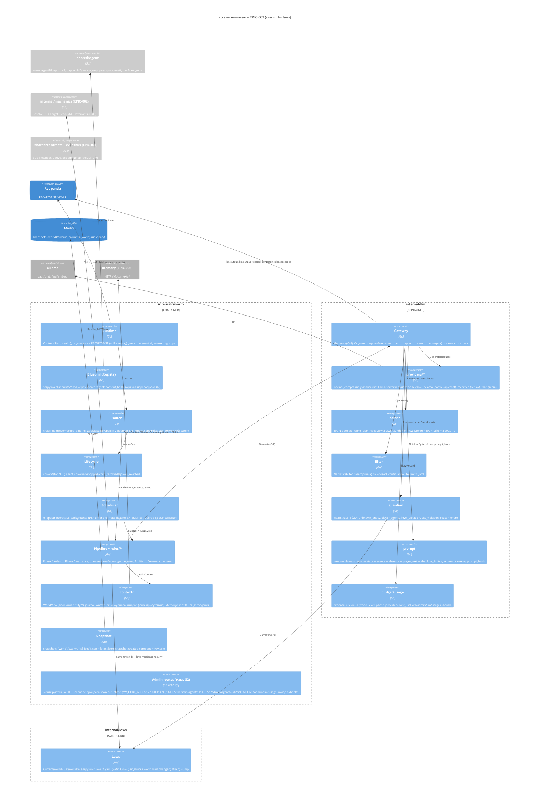

# Компоненты блока EPIC-003: рой GM, LLM-шлюз, страж, законы

> **Состояние дерева на 2026-09-11 (T-409).** Документ описывает **целевой** блок. Каталогов `internal/swarm`, `internal/llm`, `internal/laws` в дереве нет; нет и данных, на которых они работают: `blueprints/`, `laws/`, `schemas/agent/`, `config/absolute-limits.yaml`. `shared/agent` — as-is Agent GM Core, ни одного целевого файла (§2). От имени роя сегодня работают двойники `shared/testkit/swarm`: `FakeEncounter` (Phase 1 боя, с повтором при конфликте версий — C-05 v1.3) и `FakeNarrator` (три повода нарратива из шести — C-05 «Заглушка»). Провайдер по умолчанию — `openai_compat` (C-15 v1.1), не `ollama`. Правило для владельца: вливая настоящий контекст, тем же изменением снять пометку «будущее» с `diagrams/c4-component-swarm-llm-laws.md` (решение 2026-09-11).

Версия 0.2 · 2026-09-09 · architect#2 (TEAM-2) · статус: утверждён на G2 в составе архитектуры; v0.2 — точечные правки по сведению (`architecture/consolidation.md` §4, §9) и решениям G2 (`journal.md`), сводка — **§20 «Дополнение после G2»**. Места, изменённые в тексте, помечены «(изм. G2)».
Границы: `architecture/overview.md` Часть II (§11–§20), ADR-001…ADR-010, `contracts.md` (поставляем C-05, C-06, C-07, C-11, C-12, C-15; потребляем C-01, C-02, C-03, C-04, C-09, C-14), `plan/epics.md` EPIC-003 (I1/I2), `plan/ownership.md`. Требования: `prd.md` §5.13, FR-010…FR-018, FR-030…FR-046, FR-050…FR-056, FR-070…FR-072, FR-090…FR-092, FR-120…FR-128, BR-02, BR-05, BR-06, BR-08, BR-10, BR-14…BR-16; `nfr.md` §1, §3, §5–§7, §10; `use-cases.md` UC-004…UC-008, UC-016, UC-018…UC-026, UC-029, UC-030, UC-034; `api-contracts.md` §2, §3; `data-model.md` §4, §6–§8; `domain-review.md` §3.1; `metrics.md` §4.
Решения уровня реализации — ADR-014 (планировщик), ADR-015 (формат блупринта v2 и валидатор), ADR-016 (парсер вывода LLM, язык, фильтр (a)), ADR-017 (страж и `reason`).

Глобальные решения (стек, конверт `meta`, топики, порядок middleware ADR-005 п. 2, уровни ADR-002, контракт пробоя ADR-008) здесь **не меняются**; всё, что требует правки контракта, вынесено в отчёт разделом «Запросы на изменение контрактов».

---

## 1. Обзор блока

Блок живёт в процессе `core` (ADR-001) как три контекста одного бинарника `cmd/multiverse --contexts=…,swarm,llm,laws` плюс общий пакет типов `shared/agent` и файлы данных (`blueprints/`, `laws/`, `schemas/agent/`, `config/absolute-limits.yaml`). Ответственности:

| Контекст / пакет | Ответственность | Владеет данными | Не делает |
|---|---|---|---|
| `internal/swarm` | рантайм роя: реестр блупринтов, роутер событий, жизненный цикл агентов, планировщик тиков и очередей, двухфазный конвейер по ролям, контекст агентов (WorldView + журнал), снапшот роя, admin-HTTP | `AgentInstance[]`, расписание, бюджет фона, окно журнала, индекс фоновых событий, присутствие игроков, снапшот `snapshots-{world}/swarm/*` | не пишет сущности (только `*.proposed`, BR-03); не вызывает провайдера LLM напрямую (только через `internal/llm`) |
| `internal/llm` | LLM-шлюз: провайдеры, middleware (бюджет → провайдер → парсер → язык → фильтр (a) → запись `llm.output` → страж), промпт-билдер, учёт | журнал `llm.output`/`llm.output.rejected`/`content.incident.recorded`, бюджеты, словарь фильтра (a) | не знает о ролях агентов и топиках доменных событий; не публикует доменных событий |
| `internal/laws` | документы `laws@vN`: загрузка, `Current/Get`, подписка на `world.laws.changed`, счётчик напряжения, `Bump` для CLI | `LawsVersion` (файлы в Git, объекты MinIO — E-B), `strain` | не проверяет инварианты сам (проверки — `mechanics.Invariants()` C-03, вызывает страж/State) |
| `shared/agent` | типы (`AgentLevel`, `LODLevel`, `AgentLifecycleState`, `AgentBlueprint` v2), парсер MD/YAML, валидатор C-11, словарь плейсхолдеров, реестр уровней | формат блупринта (C-11) | ничего рантаймного (без горутин, без I/O кроме чтения файлов) |

### 1.1. C4 уровень 3 — компоненты контейнера `core` (часть EPIC-003)



Правило зависимостей (проверяется `depguard` в CI EPIC-001): `swarm → llm, laws, mechanics, agent, contracts, eventbus, objstore`; `llm → contracts, eventbus, laws (только тип LawsVersion), agent (только AgentRef/типы)`; `laws → contracts, eventbus, objstore`; `agent → ничего из internal/*`. Обратных рёбер нет: `llm` не импортирует `swarm`; `laws` не импортирует `mechanics` (сопоставление инвариантов по `id` делает страж — §10.4).

---

## 2. Структура пакетов и файлов

```
internal/swarm/
  swarm.go            # Context: Start(ctx, deps) / Health(); сборка компонентов; режимы live|replay; фаза догона
  runtime.go          # подписки (consumer-group core.swarm), дедуп (eventbus.Dedup — изм. G2), фаза догона через Journal.ReadRange, маршрутизация в Router, курсор
  registry.go         # BlueprintRegistry: LoadDir, Get, ByTrigger, ContentHash, Reload (I2: fsnotify → agent.blueprint_reloaded)
  scope.go            # ScopeIndex: solo/group → region → world; encounter → scope; обновляется из entity.*/group.*
  router.go           # Router: Match (спавн) + Deliver (доставка по уровням), см. §5
  instance.go         # AgentInstance (данные) + Behaviour (интерфейс роли), см. §4
  lifecycle.go        # Lifecycle: Ensure/Stop/ExpireTTL; события agent.*; TTL поверх Clock
  scheduler.go        # Scheduler: очереди, воркеры, тики, уступка, см. §7 и ADR-014
  budget.go           # BackgroundBudget: скользящее окно вызовов фона на мир (питается llm.output)
  emitter.go          # Emitter: Derive(parent) + meta.agent + белые списки allowed_event_types/owned_entity_types
  pipeline.go         # Pipeline: HandleEvent → Behaviour.OnEvent / OnTick; вызов LLM-заданий; fallback-шаблоны
  roles/
    global_gm.go      # role=global-gm: tick-фаза (LOD basic|rule-only), background_events, world.* + entity.update.proposed(world)
    region_gm.go      # role=region-gm: tick idle/active; обнаружение встреч (rules); npc_table/respawn_ttl; region.*/npc.*
    encounter.go      # role=encounter: Phase 1 rules (mechanics.Resolve), раунд группы, encounter.ended, child_resolved
    personal_gm.go    # role=personal-gm: Phase 2 (turn|entry|death|world_event); в группе — rule-only (entry|death)
    group_narrator.go # role=group-narrator: Phase 2 по завершению раунда, один narrative.output на раунд
    triggers.go       # таблица «событие → фаза/kind» по ролям (§8.2)
  context/
    worldview.go      # WorldView: read-only проекция сущностей мира из entity.created/updated (+ latest.json State при старте)
    journal.go        # journalContext: EventWindow (кольцо N на scope), BackgroundIndex (world/region, 30 дн.), Presence (player → last_seen_at)
    memory.go         # MemoryClient (C-09) с таймаутом 500 мс и деградацией; NopMemory в replay
    builder.go        # AgentContext → prompt.Sections (state, events, absence, canon, laws, player_text)
  template/
    ru.go             # шаблоны деградации: turn/round/entry/death/world_event/encounter (generated_by=template)
  snapshot.go         # SwarmSnapshot: сериализация/восстановление; snapshot.created component=swarm
  admin.go            # (изм. G2) маршруты /v1/admin/agents, /v1/admin/agents/{id}/tick — монтируются на mux shared/runtime (MV_CORE_ADDR); Health() отдаёт agents_by_level в /health процесса
  *_test.go

internal/llm/
  gateway.go          # Gateway.Generate(ctx, Call) (Result, error); ErrUnavailable/ErrBudget/ErrQuarantined/ErrInvalid
  types.go            # Provider, Request, Response, Params, Phase, Call, Result, Rejection, ValidationStatus (C-15)
  config.go           # MV_LLM_PROVIDER, таймауты фаз, MV_LLM_CLOUD_*, MV_LLM_STORE_PROMPTS, таблица цен (env через shared/env.Declare — изм. G2)
  budget.go           # Budget: окна (world, level, phase, provider); облачный денежный лимит
  record.go           # Recorder: llm.output / llm.output.rejected / content.incident.recorded (Derive от cause); вход записи: Labels *LabelTable (nil — не нарратив), CalledAt; labels.go — LabelTable, LabelsHash, ErrLabelTable (C-07 v1.5, T-211; изм. T-459)
  usage.go            # агрегаты для mvctl llm usage и /v1/admin/llm/usage (маршрут монтируется на mux shared/runtime — изм. G2)
  providers/
    registry.go       # providers.Registry: Register(name, factory); New(name, cfg)
    ollama/client.go  # native /api/chat, /api/embed; format=schema, think, keep_alive, options.num_ctx; токены из eval_count
    openai_compat/    # ПРОВАЙДЕР ПО УМОЛЧАНИЮ (C-15 v1.1, U-8): llama-server и любой OpenAI-совместимый сервер, облако — тот же адаптер с другим MV_LLM_URL за гейтом MV_LLM_CLOUD_ENABLED; /v1/chat/completions + response_format json_schema, enable_thinking=false. Прежняя пометка «E-H, включается флагом» устарела (T-409)
    recorded/         # recorded.Provider: ключ (correlation_id, agent.id, phase, attempt) — recording.LLMOutputKey из полей llm.Request (C-15 v1.4, без WithCall), источник — события shared/recording (C-01 v1.9; изм. T-459); промах = ошибка; (изм. T-444) Writer того же формата + фильтр SEC-23 — для mvctl record
    fake/             # fake.Provider: табличные ответы для unit/e2e; счётчик вызовов
  parser/
    parser.go         # Parse(raw) (json.RawMessage, Strategy, error) — восстановление (ADR-016)
    schema.go         # компилированные схемы schemas/agent/*.json (jsonschema/v6, draft 2020-12)
    language.go       # CheckLanguage(text, policy) — 0 CJK, латиница ≤ порога
  filter/
    filter.go         # NarrativeFilter (интерфейс) + CategoryAFilter (словарь/regexp, fail-closed), filter_version
    config.go         # загрузка config/absolute-limits.yaml; встроенный список по умолчанию при пустом файле (UC-023 A2)
  guardian/
    guardian.go       # Evaluate(value, GuardInput) (Verdict) — правила 3–6 §2.4 (ADR-017)
    visibility.go     # Visible(agent, entity) по уровню/scope
    reasons.go        # Reason enum (общий с схемой llm.output.rejected)
  prompt/
    builder.go        # Build(Sections) (system, user string); секции ADR-005 п. 4; prompt_hash
    placeholders.go   # подстановка словаря плейсхолдеров блупринта
    escape.go         # экранирование <, > в тексте игрока и именах
    events.go         # рендер окна событий (перенос clusterEvents/formatEventDescription из narrative-orchestrator)
  *_test.go

internal/laws/
  laws.go             # Service: Current, Get, Watch, Bump; загрузчик; подписка world.laws.changed
  document.go         # LawsVersion, Law{ID, Kind, Text, Check, Source}
  source.go           # Source интерфейс: FileSource(laws/), ObjectSource(laws-{world}/vN.json — E-B)
  strain.go           # Strain: Inc(lawID), Snapshot(); в MVP-1 только накопление
  *_test.go

shared/agent/        # ЦЕЛЕВАЯ раскладка. На 2026-09-11 (T-409) в каталоге лежит as-is Agent GM Core: router.go, lifecycle.go,
                     # pipeline.go, worker_pool.go, state_manager.go, md_parser.go, blueprint_loader.go, blueprint_validator.go,
                     # helpers.go, interfaces.go, agent_types.go, lod.go, tools/, examples/ — и ни одного целевого файла ниже.
                     # В архив уехали только filter.go, tools/*_tool.go, adapter.go и e2e-тест. Каталог — неподключённая
                     # вторая архитектура GM, а не типы роя; переписывание — EPIC-003 (T-201/T-202). Таблицы владения
                     # в levels.go нет и не будет: истина — shared/contracts/ownership.go (ADR-025).
  types.go            # AgentLevel, LODLevel, AgentLifecycleState (из agent_types.go, без изменений)
  blueprint.go        # AgentBlueprint v2 (§13.1) + вложенные типы
  parser.go           # ParseFile/ParseBytes: frontmatter + секции ## system/phase1/phase2/tick/canon/description; чистый YAML
  validator.go        # Validate(bp, env ValidationEnv) []Issue{File, Field, Reason, Severity, Code} — правила §3.2 api-contracts и КД §13.2 (ADR-015); EnvFromProject(root, eventTypes, ownedEntityTypes, invariants, models) (изм. T-459)
  levels.go           # реестр уровней: AllowedEventTypes(level, role) — белые списки api-contracts.md §2.4, у city-gm пусто (§13.2; изм. T-459); OwnedEntityTypes(level, role) — ПРОИЗВОДНАЯ от contracts.OwnershipRules, которую вызывающий передаёт в ValidationEnv (ADR-025); своей таблицы владения файл не держит; monitor/object зарезервированы
  placeholders.go     # словарь плейсхолдеров промптов
  lod.go              # без изменений (E-G)
  tools/registry.go   # без изменений (MVP-1 не использует; tools/*_tool.go удаляются)
  testdata/blueprints/{valid,invalid}/*.md
  # удаляются: router.go, lifecycle.go, worker_pool.go, pipeline.go, state_manager.go, filter.go, helpers.go (TTLManager),
  #            md_parser.go/blueprint_loader.go (заменены parser.go), examples/domain-dark-forest.md (→ blueprints/), README.md/MIGRATION.md (→ Docs/archive)

blueprints/
  global-dark-forest-world.md   domain-dark-forest.md   encounter-wolf.md   player-gm.md   group-narrator.md
laws/
  dark-forest-world.v1.yaml
schemas/agent/
  tick-global.json   tick-region.json   narrative.json   breach.json (зарезервировано, E-B)
schemas/events/   (типы, которыми владеет EPIC-003, v1)
  combat.decided  encounter.started  encounter.ended  world.weather_changed  world.time_advanced  world.event_occurred
  region.event_occurred  npc.moved  npc.spawned  tick.fired  tick.aborted  agent.spawned  agent.child_resolved  agent.stopped
  agent.spawn_rejected  agent.blueprint_reloaded  llm.output  llm.output.rejected  narrative.output  content.incident.recorded
  world.laws.changed  world.law_breach.{proposed,rejected,applied,review_decided,rolled_back}
config/
  absolute-limits.yaml
shared/testkit/swarm/
  fake_narrator.go    # testkit.FakeNarrator (C-05 заглушка для EPIC-004; v0 создаёт F-10, реализация — EPIC-003 I1a)
  fake_encounter.go   # (изм. G2) testkit.FakeEncounter — Phase 1 боя на mechanics.Rules/FixedMechanics без роя: combat.decided/dice.rolled/entity.update.proposed для точки I1-α (см. design.md §4.1)
  # recording_writer.go — (изм. T-444, C-07 v1.3) переехал: писатель записей — internal/llm/providers/recorded.Writer, не testkit
  template/ru.go      # шаблоны деградации; (изм. T-444) в T-228 переезжают в internal/swarm/template (листовой пакет), двойник импортирует ровно его
cmd/mvctl/internal/
  record/             # (изм. G2) `mvctl record --scenario … --out testdata/recordings/<s>.jsonl` — только actor_kind=ci (SEC-23)
  blueprint/          # `mvctl blueprint validate <dir>` — вызывает agent.Validate (код валидатора — shared/agent)
  laws/               # `mvctl laws bump|show`
testdata/
  recordings/{solo-30,group-3x30,background-6h,death,flee-fail,injections-10,recovery}.jsonl   # владелец EPIC-003 (изм. G2)
  llm/preamble/*.txt  golden/*.json (эталоны golden — совместно с EPIC-005 005-ops)
```

---

## 3. Ключевые интерфейсы Go

Только сигнатуры, определяющие границы; детали — в разделах ниже.

```go
// internal/swarm — контекст процесса (overview §14 п. 1)
type Context interface { Start(ctx context.Context, deps Deps) error; Health() Status }
type Deps struct {
    Bus       eventbus.Bus                 // C-01
    Store     objstore.Client              // snapshots-{world}/swarm, чтение snapshots-{world}/state/latest.json
    LLM       llm.Gateway                  // §9
    Laws      laws.Service                 // §12
    Mechanics *mechanics.Rules             // C-03 (или testkit.FixedMechanics)
    Memory    swarmctx.MemoryClient        // C-09 (NopMemory при отсутствии/replay)
    Journal   eventbus.Journal             // (изм. G2) C-01 v1.1: догон с курсора снапшота ReadRange(cursor…End)
    Clock     clock.Clock; Timers clock.Timers // (изм. G2) shared/clock (C-01 v1.1); в replay — EventClock/NullTimers от cmd/multiverse
    HTTP      runtime.Mux                  // (изм. G2) mux HTTP-сервера процесса (shared/runtime, MV_CORE_ADDR) — swarm/llm монтируют /v1/admin/*
    Mode      Mode                         // ModeLive | ModeReplay
    Config    Config                       // BlueprintsDir, WorldIDs, SnapshotEveryEvents (AdminAddr удалён — адрес принадлежит процессу)
}
// Фактический тип — runtime.Deps (foundation §4); поля выше — подмножество, которое использует контекст swarm.

// Поведение роли (реализации в roles/*)
type Behaviour interface {
    Role() string
    Subscribes(inst *AgentInstance, ev eventbus.Event, idx *ScopeIndex) bool // видимость события агенту (§5.2)
    OnEvent(ctx context.Context, inst *AgentInstance, ev eventbus.Event, r *Runtime) error // Phase 1 sync + постановка LLM-заданий
    OnTick(ctx context.Context, inst *AgentInstance, tick eventbus.Event, r *Runtime) error // только timer-роли
}

// Router
type Router struct{ … }
func (r *Router) Route(ctx context.Context, ev eventbus.Event) error // спавн по триггерам, затем доставка живым агентам
func (r *Router) Match(ev eventbus.Event) []SpawnIntent             // блупринты с trigger.event, совпавшие по scope_binding
func (r *Router) Recipients(ev eventbus.Event) []*AgentInstance     // живые агенты, для которых Behaviour.Subscribes == true

// Lifecycle
func (l *Lifecycle) Ensure(ctx context.Context, bp *agent.AgentBlueprint, scope eventbus.ScopeRef, cause eventbus.Event) (*AgentInstance, bool, error) // (inst, spawned, err); max_instances=1 по детерминированному id
func (l *Lifecycle) Stop(ctx context.Context, id string, reason StopReason, cause eventbus.Event) error
func (l *Lifecycle) Touch(id string, at time.Time)                 // продление TTL от активности
func (l *Lifecycle) ExpireDue(ctx context.Context, now time.Time)  // вызывается планировщиком; в replay не вызывается

// Scheduler (ADR-014)
type Job struct { Kind JobKind /* narrative|tick|entry */; Agent string; Cause eventbus.Event; Priority Queue; Run func(ctx context.Context, lod agent.LODLevel) error }
func (s *Scheduler) Enqueue(q Queue, j Job)                        // QueueInteractive | QueueBackground
func (s *Scheduler) RegisterTimer(inst *AgentInstance)             // global/domain: next_tick_at по intervals
func (s *Scheduler) SetTickMode(agentID string, mode TickMode)     // idle|active (domain при игроках)
func (s *Scheduler) FireNow(ctx context.Context, agentID string, actorKind string) error // admin-тик (C-06)

// Emitter — единственный путь публикации из агентов
func (e *Emitter) Emit(ctx context.Context, inst *AgentInstance, cause eventbus.Event, typ string, payload map[string]any) (eventbus.Event, error)
// Derive(cause) + meta.agent{id,level,blueprint,blueprint_version} + проверка allowed_event_types / owned_entity_types → ErrLevelViolation

// internal/llm (C-15, ADR-005 п. 1)
type Provider interface {
    Generate(ctx context.Context, req Request) (Response, error)
    Embed(ctx context.Context, model string, texts []string) ([][]float32, error)
    Health(ctx context.Context) Status
}
type Request struct { Phase Phase; Model, System string; Messages []Message; Schema json.RawMessage; Params Params; Timeout time.Duration; CorrelationID string; AgentID string; Attempt int } // (изм. T-459, C-15 v1.4) AgentID, Attempt — части ключа записи llm.output, шлюз заполняет перед каждой попыткой
type Params struct { Temperature float64; MaxTokens int; Think bool; NumCtx int; Seed *int64 }
type Response struct { Content string; Thinking string; Tokens Tokens; Model string; Latency time.Duration; Done bool }

type Gateway interface { Generate(ctx context.Context, call Call) (Result, error); Health(ctx context.Context) Status; Usage() Usage }
type Call struct {
    Agent        eventbus.AgentRef           // meta.agent для записей
    Phase        Phase                        // PhaseNarrative | PhaseTick (| PhaseDecision — не в MVP-1)
    Cause        eventbus.Event               // событие-причина: Derive() для llm.output
    World, Scope string
    ActorKind    string
    LawsVersion  string
    Prompt       prompt.Sections              // → system/user + prompt_hash
    Schema       parser.Schema                // скомпилированная схема фазы
    Model        string; Params Params; Retries int; Timeout time.Duration
    TextPaths    []string                     // JSON-пути текстовых полей для языка/фильтра: ["text"], ["events[*].summary"]
    Guard        guardian.Input               // видимость, белые списки, инварианты (§10); (изм. T-444) рой видит из llm ровно корень, prompt и guardian — parser только если Schema остаётся parser.Schema (рекомендация: имя схемы строкой)
    LOD          agent.LODLevel; GMPath string
}
type Result struct {
    Value         json.RawMessage             // валидный остаток после стража
    OutputEventID string                      // id записанного llm.output (последней попытки)
    Status        ValidationStatus; Rejected []Rejection; Attempts int
    Tokens        Tokens; LatencyMS int
}
var ErrUnavailable, ErrBudget, ErrQuarantined, ErrInvalidAfterRetries, ErrFilter, ErrLabelTable error // (изм. T-459, C-07 v1.5) internal/llm/labels.go (T-211): type LabelTable struct { Mentions, Absence map[string]string }; func LabelsHash(t LabelTable) (string, error); ErrLabelTable — ключ вне формы eK/bK, вызов отвергается на входе Generate (T-213)

// internal/llm/guardian (ADR-017)
// (изм. T-444, ADR-001 доп. 2026-09-13 п. 1) страж не импортирует internal/laws и internal/mechanics: вместо laws.LawsVersion
// и map[string]mechanics.Invariant — данные; адаптер mechanics.Invariant → InvariantFunc живёт в internal/swarm
type Input struct { Level agent.AgentLevel; Role string; Scope eventbus.ScopeRef; Allowed []string; Owned []string; View StateView; LawsVersion string; CheckKeys []string; Invariants map[string]InvariantFunc; AbsenceEventIDs map[string]string; Mentions map[string]string; Kind SchemaKind } // (изм. T-439, ADR-029 п. 5) нарратив: ярлык вызова → id события (`b1…`) и → id сущности (`e1…`); прежде AbsenceEventIDs map[string]bool — множество id событий
type StateView interface { Entity(id string) (Entity, bool); InScope(id string, scope eventbus.ScopeRef) bool; Position(id string) string }
type InvariantView interface { Get(id string) (*entity.Entity, bool); ByType(t string) []*entity.Entity; WorldID() string } // набор методов mechanics.StateView; страж строит его сам: View + ops на копии (§10.4)
type InvariantFunc func(v InvariantView, touched []string) []Violation // Violation{InvariantID, EntityID, Message}
func Evaluate(value json.RawMessage, in Input) Verdict // Verdict{Value json.RawMessage; Rejected []Rejection; Status ValidationStatus}; Rejection (internal/llm/types.go){Reason, Element, Entity, EntityName, Category, Budget, Ref} — Ref: ссылка ответа, как её написала модель, для поля ref (C-07 v1.5, T-217; изм. T-459)

// internal/llm/filter
type NarrativeFilter interface { Check(ctx context.Context, text string) (Decision, error); Version() string } // Decision: Pass | Block{Category}

// internal/laws (C-12)
// (изм. T-444, C-12) источник текущей версии — интерфейс потребителя; WorldView роя его реализует, nil — файлы
type WorldVersions interface { LawsVersion(worldID string) (version string, ok bool) }
type Service interface {
    Current(world string) (LawsVersion, error)
    Get(world, version string) (LawsVersion, error)
    Watch() <-chan Changed                  // после world.laws.changed
    Strain() *Strain
    Bump(ctx context.Context, world, path string) (LawsVersion, error) // mvctl laws bump: файл vN+1 → world.laws.changed + entity.update.proposed(world.laws_version)
}
type LawsVersion struct { Version, WorldID, Status, CreatedBy string; BasedOn string; Laws []Law; CreatedAt time.Time }
type Law struct { ID, Kind /* invariant|declarative */, Text, Check, Source string }

// shared/agent (C-11)
func ParseFile(path string) (*AgentBlueprint, error)
func ParseBytes(name string, data []byte) (*AgentBlueprint, error)
func Validate(bp *AgentBlueprint, env ValidationEnv) []Issue // env — §13.2: EventTypes, OwnedEntityTypes, Blueprints, FileExists, Tools, Schemas, Invariants, Models (изм. T-459)
type Issue struct { File, Field, Reason string; Severity Severity /* error|warning|info */; Code string /* стабильный код находки, §13.2 решение 1 (изм. T-459) */ }
func ContentHash(bp *AgentBlueprint) string
```

---

## 4. Модель агента

### 4.1. Уровни и роли MVP-1 (ADR-002 п. 1)

| Роль (`role`) | Уровень | Блупринт | Scope экземпляра | Спавн | Стоп | Фазы | LOD MVP-1 |
|---|---|---|---|---|---|---|---|
| `global-gm` | `global` | `global-dark-forest-world` | `world:{world_id}` | `swarm.Start` — для каждого блупринта `global` с `scope_binding.id` (сущности мира — из фикстур `mvctl world init --fixtures`, не из блупринта — изм. G2) | никогда (`ttl` игнорируется с предупреждением) | tick (60 мин idle) | `basic` → `rule-only` при бюджете |
| `region-gm` | `domain` | `domain-dark-forest` (по одному на регион) | `region:{region_id}` | `swarm.Start` — для каждого блупринта `domain`; регион и его NPC должны существовать в `WorldView` (фикстуры); при отсутствии сущности региона агент стартует, но `/health degraded {swarm: region_missing}` (изм. G2) | никогда | tick (30 мин idle / 60 с active), обнаружение встреч (rules), респаун по `npc_table` (только респаун — изм. G2), Phase 1 — нет | `basic` → `rule-only` |
| `encounter` | `task` | `encounter-wolf` | scope игрока/группы (`solo:…`/`group:…`) | **(изм. 2026-09-11, ADR-028)** решение `region-gm` открыть встречу — `Spawner.SpawnChild` до публикации `entity.create.proposed`, фаза «открывается»; триггер `encounter.started` остаётся страховкой (`Ensure` идемпотентен) | `encounter.ended` → `agent.child_resolved` + `agent.stopped`; отказ создания → `agent.stopped reason=error` (ADR-028); страховочный TTL 30 мин | Phase 1 `rules` | `rule-only` |
| `personal-gm` | `task` | `player-gm` | `solo:{player_id}` (и в группе) | первое `player.*` scope без живого агента | TTL 45 мин от последнего действия игрока; `agent.stopped reason=ttl` | Phase 2 (`turn|entry|death|world_event`) | `basic`; в группе — `rule-only` (только `entry|death`) |
| `group-narrator` | `task` | `group-narrator` | `group:{group_id}` | `group.created` | `group.disbanded` или TTL 45 мин от последнего действия любого участника | Phase 2 (`round`) | `basic` |
| (резерв) `guardian-monitor` | `monitor` | — | `world:*` | выключен `SWARM_MONITOR_AGENTS_ENABLED=false` | — | — | — |
| (резерв) `entity-actor` | `object` | — | сущность | выключен `SWARM_OBJECT_AGENTS_ENABLED=false` (C-13) | — | — | — |

`agent.id = "{blueprint.name}:{scope.id}"` — детерминированный, обеспечивает `max_instances=1` без блокировок (второй `Ensure` находит существующий; при явном спавне по триггеру — `agent.spawn_rejected reason=max_instances` не публикуется, если агент уже жив и это тот же scope: событие просто доставляется существующему; `spawn_rejected` публикуется только при попытке спавна с другим `scope_binding.id` для `global/domain` и при провале валидации).

### 4.2. AgentInstance (данные, `data-model.md` §6.2)

```go
type AgentInstance struct {
    ID, Blueprint, BlueprintVersion, ContentHash string
    Level agent.AgentLevel; Role string
    Scope eventbus.ScopeRef; WorldID string
    ParentID string          // динамический для personal-gm/group-narrator (§5.3); фиксированный для domain/encounter
    State agent.AgentLifecycleState // initializing → running → finishing → finished (paused не используется в MVP-1)
    LOD agent.LODLevel       // фиксированный по роли (таблица 4.1); для personal-gm — rule-only, пока игрок в группе
    SpawnedAt, LastActivityAt time.Time; ExpiresAt *time.Time // TTL только task
    Tick struct{ Seq int64; LastAt, NextAt time.Time; Mode TickMode } // только timer-роли
    LawsVersion string       // версия законов, под которой строится контекст
    Observed struct{ Players []string; Encounter string; Group string } // наблюдаемый scope (не сущности — те в WorldView)
    Runtime struct{ inflight int; mu sync.Mutex } `json:"-"`
}
```

Состояние агента **не содержит копий сущностей**: единственная проекция мира — `WorldView` (§11.1), общая для всех агентов; агент хранит только идентификаторы наблюдения. Это делает снапшот роя малым и исключает расхождение копий (T5 аудита).

### 4.3. Снапшот роя (C-14, ADR-003 п. 7)

`snapshots-{world}/swarm/{ts}-{seq}.json` + `latest.json`:

```json
{ "schema_version": 1, "component": "swarm", "world_id": "dark-forest-world", "taken_at": "…", "seq": 12,
  "cursor": { "player_events": 1042, "world_events": 388, "game_events": 511, "system_events": 2210, "llm_records": 97 },
  "laws_version": "v1",
  "blueprints": { "domain-dark-forest": { "version": "1.1", "content_hash": "sha256:…" } },
  "agents": [ { "…AgentInstance без Runtime…" } ],
  "scheduler": { "budget": { "window": ["2026-09-09T10:02:11Z", "…"], "cap": 4 } },
  "journal": { "windows": { "solo:player-A": [ { "id": "…", "type": "combat.decided", "at": "…", "summary": "…" } ] },
               "background": { "region:dark-forest-01": [ { "id": "…", "type": "npc.moved", "at": "…", "summary": "…" } ] },
               "presence": { "player-A": { "last_seen_at": "…", "region": "dark-forest-01" } } },
  "state_hash": "sha256:…", "size_bytes": 18432 }
```

Триггеры снапшота: после каждого тика, при изменении состава агентов, каждые `MV_SWARM_SNAPSHOT_EVERY_EVENTS=200` обработанных событий, по `SIGTERM`; хранится `K=5` (ротация в коде, не зависит от bucket versioning — ADR-021). `latest.json` — **указатель** (метаданные + `key` объекта, C-14 v1.1), пишется после успешного PUT объекта. `snapshot.created {component: swarm, …}` публикуется после PUT. Восстановление (изм. G2, C-01 v1.1/C-14 v1.1): ждать `analytics.replay.completed mode=recovery` от State → прочитать `snapshots-{world}/state/latest.json` → объект (WorldView) → свой `latest.json` → проверка `state_hash` → фаза догона: `Journal.ReadRange(topic, cursor[topic], End(topic))` по каждому читаемому топику без consumer group, без эмиссии (агенты восстанавливаются из `agent.*`, вызовы LLM — из `llm.output`, тики — из `tick.fired`); «конец журнала» = позиция ≥ `End − 1` по всем топикам → переход в `live` (`Subscribe` с consumer-group `core.swarm`); лог `catch_up_done events=N`. Нет снапшота при пустом журнале — первый запуск (`agent.spawned` для global/domain); нет снапшота при непустом журнале — `/health fail {snapshot: missing}` (UC-025 E1), не стартуем с пустым состоянием молча.

---

## 5. Router

### 5.1. Обработка события

```
Route(ev):
  1. dedup: eventbus.Dedup по ev.ID (production-пакет C-01 v1.1; LRU 10k, сериализуется в снапшот роя) → Has(ev.ID): событие, уже доставленное всем получателям, игнорируется (NFR-013); Add — только на шаге 8 (изм. T-431, C-01 v1.6 «посредник доставки»); схема события уже проверена библиотекой при чтении (MV_BUS_VALIDATE_ON_READ) — изм. G2
  2. legacy-фильтр: типы с пометкой deprecated/gm_path=legacy (gm.*, narrative.generate, time.syncTime, player.moved, player.used_skill) → игнор
  3. проекции: WorldView.Apply(ev) для entity.*; ScopeIndex.Apply(ev) для entity.*/group.*/encounter.*; journal.Observe(ev) (все типы); budget.Observe(ev) для llm.output; presence.Observe(ev) для player.* — каждая идемпотентна при повторе: WorldView по версии, ScopeIndex как множество, journal/budget/presence по ev.ID (изм. T-431)
  4. спавн: for bp in Match(ev): scope := bindScope(bp, ev); inst, spawned := Lifecycle.Ensure(bp, scope, ev)
  5. доставка: for inst in Recipients(ev): Pipeline.HandleEvent(inst, ev) — последовательно на агента (per-instance очередь), параллельно между агентами; синхронно — Route ждёт ответа всех получателей; ошибка одного не отменяет доставку остальным; Route возвращает шине ошибку первого по порядку Recipients(ev), шаг 8 не выполняется (изм. T-431)
  6. tick.fired: если meta.agent.id — живой timer-агент → Pipeline.HandleTick (повтор с tick_seq не больше последнего закрытого — выполненного или прерванного tick.aborted — тик не выполняет, лишь допубликовывает неопубликованный tick.aborted; изм. T-431); иначе (replay: агент ещё не восстановлен) → лог handled=true
  7. agent.* в replay: agent.stopped → Lifecycle.stopSilently(id); agent.spawned → Ensure без публикации
  8. Add(ev.ID) — только если шаги 3–7 прошли без ошибки (изм. T-431). Отмена при остановке — тоже ошибка: окно не пополняется, событие не закоммичено и после рестарта дойдёт до агента
```

**Почему `Add` после доставки (изм. T-431; C-01 v1.6, design EPIC-003 §14.5 п. 1).** Раньше шаг 1 запоминал событие до доставки, а окно Router лежит в снапшоте роя. Тогда повтор шины после ошибки агента и повторная доставка после рестарта гасли у Router и до агента не доходили. Двухшаговое окно агента встречи (design §14.1) повтора не видело: ответ не допубликовывался, а в `dead_letters` ничего не попадало.

Match — по `trigger.type=event`: `event_name` совпадает с `ev.Type` (поддерживается glob `player.*` — см. запрос к C-11) **и** `scope_binding` совпадает с `ev.Scope` (`type` ∈ binding.type; `id` равен или `pattern` матчит). `bindScope` для `encounter`: scope события `encounter.started` (scope игрока/группы); для `group-narrator`: `group:{group.entity.id}`; для `personal-gm`: `solo:{entity.entity.id}` — из `entity{player}` события, **не** из `ev.Scope` (в группе `ev.Scope = group:…`, а персональный GM всё равно живёт в `solo:{player_id}`, `data-model.md` §6.2).

### 5.2. Доставка по уровням (вверх/вниз, FR-121)

`Behaviour.Subscribes(inst, ev, idx)` — таблица видимости (все проверки внутри одного `world`):

| Роль | Видит (тип события → условие) |
|---|---|
| `global-gm` | `region.*`, `encounter.started/ended`, `npc.spawned` (любой регион мира — «сводка вверх»); `world.laws.changed`; `tick.fired` адресованный; свои `entity.updated(world)` |
| `region-gm` | `player.entered_region/left_region`, `group.entered_region/left_region` где `target.region == self`; `encounter.*`, `combat.decided`, `npc.*`, `region.*` где `idx.RegionOf(ev.Scope) == self`; `entity.updated` сущностей региона (регион, его NPC, встречи, игроки в регионе); `world.*` (вниз от родителя); `tick.fired` адресованный |
| `encounter` | `player.attacked/flee_attempted/defended/said/rested`, `round.opened/closed`, `group.left`, `entity.updated` участников и NPC встречи — только при `ev.Scope == inst.Scope`; **(изм. 2026-09-11, ADR-028)** `entity.created` своей встречи (по id встречи) и `entity.update.rejected` по `proposal_id` её создания — пока встреча открывается |
| `personal-gm` | `player.*` где `entity.entity.id == player`; `combat.decided`, `encounter.*`, `round.*`, `group.*`, `player.said` где `ev.Scope == solo:{player}` или `ev.Scope == group:{idx.GroupOf(player)}`; `region.*`, `npc.*` где `idx.RegionOf(solo:{player}) == ev region`; `world.*` мира; `entity.updated(player)` (смерть → `kind: death`) |
| `group-narrator` | всё, что `encounter` в `group:{id}`, плюс `combat.decided`, `encounter.*`, `group.*`, `region.*`/`npc.*` региона группы, `world.*` |

«Вверх» = родитель подписан на события дочерних scope через `ScopeIndex` (регион видит `combat.decided` своих встреч; глобальный видит `region.*`). «Вниз» = дочерние подписаны на типы уровней выше (`world.*` → регион и персональные). Прямых вызовов между агентами нет: `Emitter` публикует в шину, `Router` доставляет — в том числе самому издателю, если он подписан (например, `region-gm` видит своё `encounter.started`; `Behaviour` игнорирует собственные события по `meta.agent.id == inst.ID`, кроме `tick.fired`).

### 5.3. Динамический родитель персонального GM

`inst.ParentID` для `personal-gm`/`group-narrator` пересчитывается при каждом `entity.updated(position)` игрока/группы: `region-gm` региона текущей позиции, при `outside:{world}` — `global-gm`. Родитель используется (а) в `Subscribes` (регион, чьи `region.*`/`npc.*` видны), (б) в `agent.spawned.parent` (первое значение), (в) в контексте промпта (`{region.description}`, `{canon}` берутся из блупринта родителя-региона). Смена родителя события не порождает (это не факт мира).

### 5.4. `level_violation` на выходе

Все публикации агентов идут через `Emitter.Emit`: тип ∉ `allowed_event_types` или `entity.*.proposed` с сущностью типа ∉ `owned_entity_types` (или вне scope агента для `task`) → `ErrLevelViolation`. Если источник — вывод LLM, элемент уже отброшен стражем (§10) и до Emitter не доходит; если источник — код роли, это дефект: событие не публикуется, лог `handled=false`, тест роли падает. Белые списки типов событий уровня — `shared/agent/levels.go`; типы сущностей уровня — из `contracts.OwnershipRules` (`shared/contracts/ownership.go`), единственной таблицы владения, которую читает и State (C-02 v1.4, ADR-025; прежнее «экспортируется из `levels.go`» отменено в T-409).

---

## 6. Lifecycle

| Переход | Условие | Событие |
|---|---|---|
| `initializing → running` | `Ensure`: блупринт валиден, контекст собран (`WorldView` есть сущности scope) | `agent.spawned {agent, parent{id}, scope, ttl_expires_at?, lod}` |
| `running` (продление) | любое событие scope от игрока (`Touch`) — для `personal-gm`: `player.*` своего игрока; для `group-narrator`: `player.*` любого участника; для `encounter`: любое действие участника | — |
| `running → finishing` | `encounter.ended` (encounter); `group.disbanded` (narrator); TTL истёк (`ExpireDue` по `Clock`); `Stop` при shutdown; необработанная ошибка роли ×3 | `agent.child_resolved {reason: npc_dead|players_out|ttl|abandoned}` (только task с parent) затем `agent.stopped {reason: ttl|shutdown|error}` |
| `finishing → finished` | снапшот роя записан (для `shutdown`), иначе сразу | — |
| Отказ спавна | `global/domain` с другим `scope_binding.id`, невалидный блупринт | `agent.spawn_rejected {blueprint, scope, reason: max_instances|validation}` |

Правила: `global`/`domain` создаются при старте для всех блупринтов с `scope_binding.id` и **никогда** не истекают (`ttl` в их блупринте — предупреждение валидатора). `personal-gm` после смерти персонажа публикует `narrative.output kind=death`, остаётся до TTL (игрок может `status`), затем `stopped`. TTL — таймеры поверх `Clock` (ADR-003 п. 6); в `mode=replay` `ExpireDue` не вызывается, стоп читается из `agent.stopped`. Повторный спавн после TTL — обычный `Ensure` по следующему `player.*`; контекст восстанавливается из `WorldView` + `journal` (дёшево, без LLM).

Ограничение NFR-083: `/health.agents_by_level` и мягкий лимит `SWARM_MAX_AGENTS=64` — при превышении `agent.spawn_rejected reason=max_instances` для `task` (global/domain всегда спавнятся).

---

## 7. Scheduler (детали — ADR-014)

### 7.1. Две очереди и воркеры

- `interactive` — задания, вызванные действием игрока: Phase 2 (`turn|round|entry|death`), нарратив `world_event` (`encounter.started`). Источник причины — `player.*`/`round.closed`/`encounter.started`.
- `background` — задания тиков timer-агентов (`tick` LLM-фаза) и `agent.blueprint_reloaded`-перечитывания.
- Воркеры LLM: `SWARM_LLM_WORKERS=1` (Ollama `OLLAMA_NUM_PARALLEL=1` — параллелизм на GPU отсутствует; второй воркер только удлинил бы очередь). Воркер всегда берёт из `interactive`; из `background` — только если `interactive` пуста **и** с момента последнего интерактивного задания прошло ≥ `SWARM_BACKGROUND_QUIET=5s`.
- **Уступка**: (а) фоновое задание, ждущее в очереди дольше `SWARM_BACKGROUND_MAX_WAIT=30s`, выполняется в `rule-only` без LLM (UC-018 A3); (б) если во время фонового LLM-вызова появилось интерактивное задание, контекст фонового вызова отменяется (`context.Cancel` → Ollama освобождает GPU), попытка записывается как `llm.output validation_status=error error.code=yielded`, тик завершается по таблице `background_events` (`rule-only`); интерактивное задание стартует немедленно. В replay записанный `error/yielded` ведёт в ту же ветку — детерминизм сохраняется.
- Phase 1 (`rules`) **не проходит через очереди**: выполняется синхронно в `OnEvent` агента встречи (CPU ≪ 10 мс), чтобы механика никогда не ждала LLM (BR-10, NFR-001).
- Порядок внутри агента: per-instance FIFO (одна горутина на агента через `Runtime.inflight`), между агентами — параллельно. Для `group-narrator` и `personal-gm` одного игрока задания также сериализованы по `correlation_id`.

### 7.2. Тики

- Регистрация: `RegisterTimer(inst)` для `trigger.type=timer`: `next_tick_at = max(last_tick_at, now) + interval(mode)`; `mode=idle` по умолчанию; `region-gm` переходит в `active` при первом игроке в регионе (`ScopeIndex.PlayersIn(region) > 0`) и обратно в `idle`, когда игроков нет (`player.left_region`/TTL сессии не отслеживается — только позиция).
- Срабатывание: цикл планировщика с шагом `Clock`-тикера 1 с (в replay выключен). При `next_tick_at ≤ now`: считает бюджет → публикует `tick.fired {agent, scope, tick{seq, mode, scheduled_at, fired_at, lod_allowed}, budget{window_calls, cap}}` (**до** выполнения, BR-04) → `Router` доставляет агенту → `OnTick`. `tick_seq` монотонен на агента и хранится в `AgentInstance`.
- Пропущенные тики после простоя/рестарта — один тик, не пачка (overview §20 п. 10): `next_tick_at = now + interval` после выполнения.
- Источник времени для мира: агенты используют `tick.fired.timestamp` (в live = `Clock.Now()` при публикации), не `time.Now()` — `world.time_advanced` и сводки вычисляются от него; replay воспроизводит те же значения.
- Admin-тик (`POST /v1/admin/agents/{id}/tick`, C-06): `FireNow` публикует тот же `tick.fired {mode: background}` с `meta.actor_kind=ci`, минуя `next_tick_at` (и не сдвигая его в replay-тестах, где таймеры выключены).
- `tick.aborted {tick{seq}, reason}` — при ошибке выполнения тика после публикации `tick.fired` (паника роли перехвачена, `handled=false`) или при рестарте, если в снапшоте `Tick.Seq` больше последнего `tick.fired` в журнале для агента... точнее: при догоне тик, чей `tick.fired` есть в журнале, но нет ни одного производного события и нет `tick.aborted`, считается прерванным → рой публикует `tick.aborted reason=restart` после догона (один раз, идемпотентно по `tick_seq`).

### 7.3. Бюджет фона (FR-125, NFR-007)

`BackgroundBudget` на мир: скользящее окно 1 ч, наполняется из событий `llm.output` с `meta.actor_kind=system` и `meta.replay=false` (как в live, так и при догоне — счётчик восстанавливается из журнала, снапшот содержит окно на случай отсутствия событий). `cap = B` из `budget.background_calls_per_hour_world` блупринта `global-gm` (стартовое 4). `lod_allowed = basic` если `window_calls < cap`, иначе `rule-only`; значение пишется в `tick.fired` и **не пересчитывается** агентом (в replay читается из события). Второй рубеж — middleware бюджета шлюза (§9.3) по ключу `(world, level ∈ {global, domain}, phase=tick)`; расхождение (агент запросил LLM при `rule-only`) → `llm.output.rejected reason=budget_exceeded budget{kind: background, limit: B, window: 1h}` без вызова.

Персональные GM и Task-агенты без игроков не выполняются по построению: у них нет таймера, а задания создаются только по событиям игроков (NFR-053).

---

## 8. Двухфазный конвейер

### 8.1. Принципы (BR-05, FR-013)

1. **Phase 1 = механика без LLM** (`phase1.mode: rules` во всех блупринтах MVP-1). Только роль `encounter` имеет Phase 1: `mechanics.Resolve` → публикации `dice.rolled` ×k (тип EPIC-002, издаёт агент — C-03) → `combat.decided` → `entity.update.proposed {atomic: true, expected_version}`. Всё синхронно в `OnEvent`.
2. **Phase 2 = нарратив, асинхронно, без изменений состояния**: задание в очередь `interactive`; результат — только `narrative.output` (схема `narrative.json` не имеет полей действий/событий — ADR-009 п. 6).
3. **Tick-фаза** (global/domain): при `lod_allowed=basic` — LLM по схеме `tick-*.json` (`{events[]{type ∈ allowed_event_types, summary, ops[]}}`), при `rule-only` — выбор из `background_events[]` по весам с `rng = mechanics.NewRNG(mechanics.Seed(tick.id, 0))`. В обоих случаях результат публикуется одинаково: доменное событие (`world.*`/`region.*`/`npc.*`) + сопутствующее `entity.update.proposed` (`cause: tick`), `meta.actor_kind=system`, `meta.correlation_id = tick.fired.id`.
4. **Один нарратив на раунд**: в `group` Phase 2 делает только `group-narrator`, `narrative.output.recipients[]` = все участники группы со статусом `active|idle|out_of_combat` (`dead` — только `kind: death` от своего персонального GM); `narrative_event_id` = `id` этого события; персональные GM участников в группе в `rule-only` (`entry`/`death` шаблоном или LLM? — **LLM только для `entry` при `absence`, иначе шаблон**; итого ≤ 2 вызова на раунд, NFR-006).
5. Персональные GM **доставляют**: `narrative.output` от `group-narrator` уже содержит `recipients[]`, gateway доставляет напрямую (C-05); персональный GM участника группы не переиздаёт его (иначе дубль) — «доставляют» означает, что он остаётся владельцем `entry`/`death` и адресной сводки фона.

### 8.2. Таблица триггеров нарратива (roles/triggers.go)

| Роль | Событие-причина (в scope агента) | Условие | `kind` | Вызов LLM |
|---|---|---|---|---|
| `personal-gm` (solo) | `player.entered_region` | всегда | `entry` (+`absence` при паузе ≥ 30 мин или предыдущем присутствии) | да |
| | `player.looked`, `player.rested`, `player.said`, `player.left_region` | всегда | `turn` | да |
| | `combat.decided action=npc_attack` **или** `encounter.ended` | последнее событие цикла «действие → ответ NPC» с тем же `correlation_id` | `turn` | да (один на ход) |
| | `combat.decided action=flee` (успех) → далее ждёт `encounter.ended` | — | `turn` | да |
| | `encounter.started` | не ход игрока | `world_event` | да |
| | `entity.updated(player) status=dead` | — | `death` | да |
| | `world.*` вне хода | блупринт `immediate_broadcast: false` (по умолчанию) | — (в контекст следующего) | нет |
| `personal-gm` (в группе, `rule-only`) | `player.entered_region` первого действия после паузы | `absence` есть | `entry` | да (одно на вход) |
| | иначе `entry`, `death` | — | шаблон | нет |
| `group-narrator` | `combat.decided action=npc_attack round.seq=N` **или** `encounter.ended` после `round.closed seq=N` | завершение раунда механикой | `round` | да (один на раунд) |
| | `player.entered_region`/`group.entered_region`, `encounter.started`, `player.looked` вне встречи | — | `turn`/`world_event` | да |
| `region-gm` | `tick.fired` (`active`) | обнаружение встреч — всегда rules; фон — по `lod_allowed` | — | по `lod_allowed` |
| `global-gm` | `tick.fired` | по `lod_allowed` | — | по `lod_allowed` |

Завершение раунда всегда наблюдаемо событиями (NPC действует ровно один раз в раунд — либо `combat.decided npc_attack`, либо встреча завершена), поэтому нарратор не ждёт по таймеру — детерминизм в replay без таймеров.

### 8.3. Роль `encounter`: раунд группы (I2)

`round.closed {acted[], auto_defended[], idle[]}` → агент восстанавливает порядок действий раунда по `acted[].event{id}` (уже применены Phase 1 по мере приёма — UC-016 шаг 2), затем ответ NPC: `mechanics.NPCTarget` (исключая `idle|out_of_combat|dead`), `Resolve(causeEventID = round.closed.id, rollIndexStart = 0)` → `dice.rolled`, `combat.decided {action: npc_attack, round{seq}}`, `entity.update.proposed`. Учёт пропусков (`idle` после 2 подряд `auto_defended`) — `entity.update.proposed(encounter.participants[player].state)`. Завершение: NPC мёртв → `encounter.ended reason=npc_dead killer=…`, все участники `out_of_combat|idle|dead` → `reason=players_out`.

В `solo` (I1): `player.attacked` → Phase 1 атаки игрока (`causeEventID = player.attacked.id`, `rollIndex 0..1`) → ответ NPC тем же событием-причиной (`rollIndex 2..3`) → `combat.decided` ×2 → одно `entity.update.proposed atomic`.

(изм. G2, C-05 v1.1 / C-11 v1.1) `encounter.started` публикует **`region-gm`** (UC-006 шаг 4) и включает `round{timeout, idle_after_missed}` из блупринта дочерней встречи (`encounter.child_blueprint` → `encounter-wolf.round`, значения по умолчанию `60s`/`2`); gateway использует их для таймера раунда (I2). Агент `encounter` при спавне читает те же значения из своего блупринта — источник один.

### 8.4. Деградация (BR-14, FR-015)

`Gateway.Generate` вернул `ErrUnavailable | ErrBudget | ErrInvalidAfterRetries | ErrQuarantined | ErrFilter` → роль строит текст шаблоном `template/ru.go` из `WorldView` и событий причины (`generated_by: template`, `fallback_reason: unavailable|timeout|invalid_after_retries|budget|filter_blocked|filter_error|language|restart`), помечает «упрощённый режим»; тики — `rule-only`. Рестарт между Phase 1 и Phase 2 (UC-025 A1): при догоне для `combat.decided` без `narrative.output` с тем же `correlation_id` — если `llm.output` записан → нарратив из записи; иначе шаблон с `fallback_reason=restart` (публикуется после выхода из догона).

---

## 9. LLM-шлюз (`internal/llm`)

### 9.1. Провайдеры (C-15, ADR-005 п. 1)

| Реализация | Транспорт | Особенности |
|---|---|---|
| `providers/ollama` | `POST {OLLAMA_URL}/api/chat` (native), `POST /api/embed` | `format` = JSON-схема фазы (объект), `think: false` (Phase tick/narrative MVP-1; поле блупринта `thinking`), `keep_alive: -1` (`LLM_KEEP_ALIVE`), `options{temperature, num_predict=max_tokens, num_ctx=LLM_NUM_CTX (8192), seed?}`, `stream: false`; токены из `prompt_eval_count`/`eval_count` (NFR-052); таймаут фазы через `context`; `Health` = `GET /api/tags` + `GET /api/ps` (модели резидентны). Клиент — `net/http` без зависимости от модуля `ollama` <!-- gitleaks:allow: ложное срабатывание generic-api-key на параметрах генерации (.gitleaksignore); изм. T-444 --> |
| `providers/openai_compat` | `/v1/chat/completions`, `response_format: {type: json_schema}` | **провайдер по умолчанию** (C-15 v1.1, U-8, T-208): llama-server и любой OpenAI-совместимый сервер; адрес — только `MV_LLM_URL` (обязателен, без значения по умолчанию, `/v1` на конце допустим — T-404); облако — тот же адаптер с внешним адресом, `MV_LLM_API_KEY` и гейтом `MV_LLM_CLOUD_ENABLED=true`. Имена провайдера `openai`/`deepseek` выведены (ADR-005 доп. 2). Прежняя строка «компилируется, включается флагом (E-H)» устарела (T-409) |
| `providers/recorded` (`recorded.Provider`) | события `llm.output` записи из `shared/recording` (C-01 v1.9): `--mode=replay` с `--recording` — `runtime.Deps.Recording`; replay без записи — `recording.ReadJournal(ctx, Deps.Journal, llm_records, 0)`; догон после рестарта в live — `ReadJournal` от курсора `llm_records` снапшота роя (§4.3). Провайдер строится над `recorded.Events(rec.Events(recording.TypeLLMOutput))`; своего разбора JSONL и чтения журнала нет | ключ `(meta.correlation_id, meta.agent.id, phase, attempt)` — `recording.LLMOutputKey` из полей `llm.Request` (`CorrelationID`, `AgentID`, `Phase`, `Attempt`; C-15 v1.4), индекс — `recording.LLMOutputKeyOf`; контекстного `recorded.WithCall` нет (удаляет T-212); пустая часть ключа → `ErrNoCallKey`; запись без ключа → `ErrMalformedRecord` на весь источник; промах → `ErrIncompleteRecord` (в `mode=replay` тест падает, в recovery — шаблон с пометкой) *(изм. T-459; T-457, T-207)* |
| `providers/fake` (`fake.Provider`) | in-memory правила `Rule{Phase, Match, Replies}` (`fake.New(fake.WithRules(…))`); повтор — следующий `Reply` правила | счётчики `Calls()`/`CallsFor(phase)` для NFR-014/NFR-053 и тестов «отказ бюджета не зовёт провайдер» (T-212); генератор записей — `providers/recorded.Writer` *(изм. T-444, C-07 v1.3; прежде `testkit.RecordingWriter`; имена типов — изм. T-459)* |

`providers.Registry`: `Register("ollama", factory)`; выбор `MV_LLM_PROVIDER` (по умолчанию `openai_compat` — C-15 v1.1, манифест `shared/env/vars.go`; прежнее «по умолчанию `ollama`» устарело, T-409); модель — из `Call.Model` (блупринт на фазу), не из env. (изм. G2) `Provider.Models(ctx) []string` (C-15) — список доступных моделей: `ollama` → `GET /api/tags`, `fake`/`recorded` → модели из таблицы/записи; используется валидатором блупринтов (§13.2 п. 7а) и `/health.llm` (`model_not_resident`). Контекст `llm` публикует `config.cloud_enabled {enabled, provider, external_players_ack}` при каждом старте `core` и при изменении флага, без URL, ключей и их фрагментов *(изм. T-444, C-06 v1.1–v1.2; прежде — только при `MV_LLM_CLOUD_ENABLED=true` и с полем `by`; подробности — §9.4)*.

### 9.2. Конвейер `Generate` (порядок побочных эффектов — ADR-005 п. 2)

```
Generate(call):
  0. replay-режим: provider = recorded (шаги 2–5 читают запись; запись llm.output не издаётся, meta.replay=true при пробросе)
  1. (изм. T-459; приёмка T-210, ревью T-210 Mi-2) бюджет проверяется перед КАЖДОЙ попыткой — шаг 3a, а не один раз до цикла
  2. prompt.Build(call.Prompt) → system, user, prompt_hash (SHA-256); по флагу MV_LLM_STORE_PROMPTS=true → prompts-{world}/{cid}/{agent}/{phase}-{attempt}.txt
     (изм. T-439, ADR-029 п. 8; под шагом 2 — приёмка T-439, ревью #2 N-11) replay-режим: prompt_hash шага 2 ≠ prompt_hash записи → warn llm_replay_prompt_drift
     (изм. T-459, C-07 v1.5; распределение — ревью #1 T-459 Ma-1) replay, запись с labels_hash: LabelsHash(таблица из call.Guard) = labels_hash записи → ярлыки разрешаются и при расхождении prompt_hash; ≠ → warn llm_replay_labels_drift при любых массивах, непустые массивы пусты, text используется (T-213); запись без labels_hash (до v1.5) → при расхождении prompt_hash массивы нарратива пусты (T-213); warn prompt_drift и labels_hash записи из recorded — T-212
  3. for attempt := 1; attempt <= 1+retries; attempt++ :
       a. budget.Allow(world, level, phase, provider) → нет → publish llm.output.rejected{reason: budget_exceeded, budget{kind,limit,window}, attempt} без llm_output → ErrBudget (провайдер не вызывается; llm.output прежних попыток остаются)
       req := Request{…, CorrelationID, AgentID: call.Agent.ID, Phase, Attempt: attempt}   # (изм. T-459, C-15 v1.4) ключ записи — в запросе, recorded.WithCall нет
       calledAt := clock.Now()                                        # (C-07 v1.6, T-456; действует после её слияния) момент попытки после Allow → llm.output.called_at; окно бюджета — от него (T-250)
       resp, err := provider.Generate(ctx(timeout фазы), req)        # ошибка/таймаут → status=error, повтор при временной ошибке, иначе → ErrUnavailable
       value, strategy, perr := parser.Parse(resp.Content, schema)   # ADR-016; perr → status=invalid(schema_invalid) → retry
       (изм. T-439, ADR-029 п. 4) Kind=narrative: ярлык eK/bK в text → status=invalid + rejected{reason: schema_invalid} без element → retry с подсказкой
       lerr := parser.CheckLanguage(texts(value, call.TextPaths))    # 0 CJK, латиница ≤ LLM_LATIN_MAX_RATIO (0.10) → status=invalid + rejected{reason: language} → retry   (изм. T-444: статуса rejected_language нет — C-07 v1.2, ADR-017 доп. 1)
       fdec, ferr := filter.Check(texts)                              # error → status=filter_error (raw НЕ сохраняется — изм. T-444, C-07 v1.2, ОВ-33); block → status=quarantined (raw НЕ сохраняется) + content.incident.recorded; без повтора
       verdict := guardian.Evaluate(value, call.Guard)               # чистая функция; даёт итоговый status valid|partially_rejected|invalid и rejected[]
       ev := record.LLMOutput(call, attempt, resp, status, hashes, labels_hash (Kind=narrative, C-07 v1.5), called_at (C-07 v1.6), parse{strategy}, filter{…}, tokens, latency)   # ЗАПИСЬ ДО ИСПОЛЬЗОВАНИЯ
       budget.Observe(ev)                                             # (изм. T-459; приёмка T-210 Mi-3) синхронно, и при ошибке публикации (провайдер уже вызван), до следующей попытки или возврата
       for r in verdict.Rejected: publish llm.output.rejected{llm_output{event{id: ev.ID}}, reason, element, entity | background_ref | ref}   # (изм. T-439, T-459; ADR-029 п. 6) выдуманная ссылка — unknown_entity + element + ref (C-07 v1.5)
       if status ∈ {valid, partially_rejected}: return Result{Value: verdict.Value, OutputEventID: ev.ID}
       if status ∈ {quarantined, filter_error}: return ErrQuarantined/ErrFilter
       if status == invalid && verdict.Reason == law_violation(stale laws): обновить laws_version в промпте, retry
  4. исчерпание попыток → ErrInvalidAfterRetries (или ErrUnavailable, если все попытки — ошибки провайдера); отказ бюджета на повторе — ErrBudget (шаг 3a), рой пишет fallback_reason=budget
```

*(изм. T-444, C-07 v1.3)* Какие поля записи обязательны при каком статусе, проверяет схема `llm.output` (`response_raw` при `valid|partially_rejected|invalid`; `filter` со статусом `pass|block|error` при `valid|partially_rejected`, `quarantined`, `filter_error`; `error{}` — ровно при `error`). То, что зависит от стадии, проверяет свойство-тест шлюза: `filter` при `invalid` есть, только если шаг `filter.Check` наступил (при `schema_invalid` и `language` его нет), а `reasons[]` равно множеству `reason` опубликованных `rejected`. Хеши `prompt_hash` и `response_hash` — `sha256:<64 hex>`. Устаревшие ветки двух строк выше (`rejected_language`, «raw сохраняется» при `filter_error`) приведены к ADR-017 «Дополнение 1»; пометка об устаревании в самом ADR-016 п. 2–3 уже есть (T-409).

Уточнения к ADR-005 (не меняют наблюдаемый порядок эффектов): оценка стража — чистая функция и выполняется **до** записи, чтобы `validation_status` в `llm.output` был окончательным (`partially_rejected` и т. п. из `data-model.md` §7.2); публикация `llm.output.rejected` — после записи со ссылкой на `llm_output.event.id`. Кэш ответов в шлюзе **не вводится**: кэшированный ответ не имел бы собственного `llm.output`, что ломает record-replay; в replay роль «кэша» выполняет `providers/recorded`.

*(изм. T-459; приёмка T-210, ревью T-210 Mi-2 и Mi-3)* **Бюджет — перед каждой попыткой.** Каждая попытка — отдельный вызов провайдера и отдельное `llm.output`. При одной проверке до цикла окно с одним свободным местом пропустило бы вызов с повтором, и фоновых вызовов за час стало бы `B + 1` — против критерия 4 US-012 «≤ B» (Must). Отказ на повторе — `llm.output.rejected reason=budget_exceeded` с `budget{}` и номером несостоявшейся попытки, без `llm_output`; `Generate` возвращает `ErrBudget`, а не `ErrInvalidAfterRetries`, чтобы рой записал `fallback_reason=budget`. Учёт без гонки держат синхронный `Observe` своей записи и один воркер LLM (`MV_SWARM_LLM_WORKERS=1`, T-226); резерва в `Budget` нет. Порядок ADR-005 п. 2 внутри попытки не меняется.

Таймауты фаз (ориентиры ADR-005, уточняются замером): `LLM_TIMEOUT_NARRATIVE=20s`, `LLM_TIMEOUT_TICK=30s`, `LLM_TIMEOUT_DECISION=5s`. Повторы `retries` из блупринта (по умолчанию 2 для narrative, 1 для tick); повтор при `schema_invalid`/`language` добавляет в `user`-сообщение короткую подсказку «Ответ должен быть валидным JSON по схеме, на русском» (не меняет `system`, чтобы кэш промпта Ollama сохранялся).

### 9.3. Бюджеты и учёт (FR-071, FR-072, NFR-050…053)

`Budget` — скользящие окна по ключу `(world, level, phase, provider)`: фон `(world, {global,domain}, tick)` cap B/1h (Must); интерактив `(world, task, narrative)` cap `LLM_TURN_CALLS_PER_MIN` (Should, по умолчанию 0 = выключено); облако — `LLM_CLOUD_BUDGET_USD_PER_DAY`. Окна наполняются собственными записями и восстанавливаются из `llm_records` при догоне — вызов ложится в окно по `called_at` записи, запись без поля — по `timestamp` *(изм. T-459; C-07 v1.6, T-456 — действует после её слияния; T-250)*. `Usage` агрегирует `calls, tokens{prompt, completion}, cost_usd, latency p50/p95` по `(phase, level, provider, model)` для `mvctl llm usage` и `GET /v1/admin/llm/usage` (Should). `cost_usd` по таблице `config/llm-prices.yaml` (0 для Ollama).

### 9.4. Облако (BR-15, ADR-005 п. 6, ADR-009 п. 7)

`MV_LLM_CLOUD_ENABLED=true` + `MV_LLM_API_KEY` + облачный `MV_LLM_URL` у провайдера `openai_compat` (`anthropic` — отдельный провайдер E-H; имена провайдера `openai`/`deepseek` выведены, ADR-005 доп. 2; гейт — по адресу, а не по имени провайдера; T-409); проверка «внешних игроков» требует числа связок `alive` — у `core` нет `links.db`, поэтому шлюз читает флаг `MV_LLM_CLOUD_ALLOW_EXTERNAL_PLAYERS` и публикует `config.cloud_enabled {enabled, provider, external_players_ack}` при каждом старте и при изменении *(изм. T-444, C-06 v1.2: поля — по схеме; `provider` — имя из `MV_LLM_PROVIDER`, заполняется всегда; полей `by`, `model`, `at` нет — время и инициатор в конверте)*; проверка фактического числа игроков — на стороне gateway/оператора (замечание в отчёте). В промпт уходят только `player_id`, имена персонажей и текст `say`.

### 9.5. Деградация и здоровье

Любая ошибка провайдера после повторов → `ErrUnavailable`; `Health()` опрашивает провайдера раз в 10 с (`llm: ok|unavailable|degraded(model_not_resident)`), `/health` процесса `core` отражает (NFR-016); восстановление без рестарта — следующий вызов идёт в провайдер, если `Health` снова `ok` (без circuit-breaker с длинным окном, чтобы не задерживать восстановление: при `unavailable` вызовы всё равно пробуются с укороченным таймаутом `LLM_TIMEOUT_DEGRADED=3s`).

---

## 10. Страж (`internal/llm/guardian`, ADR-017)

### 10.1. Место в конвейере

Правила §2.4 api-contracts распределены: 1 (схема) — `parser`; 2 (язык) — `parser.CheckLanguage`; 7 (фильтр (a)) — `filter`; 8 (бюджет) — `budget`; **3–6 — страж**; 9 (числа нарратива ≠ механики) — метрика NFR-023, не рантайм. Страж — чистая функция над распарсенным значением и `Input` (видимость, белые списки, инварианты, законы); не публикует событий сам (публикует шлюз по `Verdict`).

### 10.2. Проверки по видам схем

| Правило | `narrative.json` (`{text, background_refs[], mentions[], tone?}`) | `tick-*.json` (`{events[]{type, summary, ops[]{path, value}, affects[]?, entity?}}`) |
|---|---|---|
| 3 `unknown_entity` | `mentions[i]` ∉ `View`/не видима → элемент удаляется из `mentions` (текст остаётся); `background_refs[i]` ∉ `AbsenceEventIDs` → удаляется. *(изм. T-439, ADR-029 п. 5–6)* Элементы — ярлыки вызова: `mentions[i]` разрешается через `Input.Mentions` в id сущности, `background_refs[i]` — через `AbsenceEventIDs` в id события. Ярлыка нет в таблице (выдуман) → элемент отброшен, текст остаётся; событие — `unknown_entity` с `element` и `ref` (C-07 v1.5). Ярлык в таблице, сущность не видима → `unknown_entity`, `entity` — id и тип из `View`. Таблица не передана — непустой `mentions` при `Mentions == nil` или непустой `background_refs` при `AbsenceEventIDs == nil` — ошибка программы: весь ответ `invalid`, `reason=other` без `element`, лог `error` *(условие по массиву — ревью #2 T-439 N-6, ADR-029 п. 5, подтверждено T-457)* | `events[i].entity`/`affects[]` ∉ View или не видимы → `events[i]` отброшен; *(изм. T-459, C-07 v1.5)* id вне `View` — `unknown_entity` с `ref` (id как написан), существующая невидимая сущность — `entity` из `View`; id длиннее 128 символов отвергает парсер (`schema_invalid`, §13.4) |
| 4 `player_agency` | текст не проверяется (нет структурных полей действий) | `events[i].type` начинается с `player.` или `ops[].path` меняет сущность типа `player` → отброшен |
| 5 `level_violation` | — (allowed = `[narrative.output]`, страж не применяется; Emitter — §5.4) | `events[i].type` ∉ `Allowed`; `ops[]` меняют сущность типа ∉ `Owned` или вне scope агента (регион GM — только свой регион/NPC) → отброшен |
| 6 `law_violation` | `LawsVersion` вызова ≠ `Laws.Current` → весь ответ `invalid`, повтор с новой версией | инварианты по `check`-ключам к гипотетическому состоянию `View + ops` (см. 10.4): провал → `events[i]` отброшен с `details{invariant_id}`; stale laws → `invalid` |

Итог: `valid` (ничего не отброшено), `partially_rejected` (≥ 1 элемент отброшен, ≥ 1 остался), `invalid` (ничего не осталось или stale laws). Для `tick` c `invalid` роль переходит в `rule-only`. Каждый отброшенный элемент → `llm.output.rejected {reason, element{index, type}, entity? | background_ref? | ref?, details?}` (при `unknown_entity` — ровно одно из трёх, C-07 v1.5).

### 10.3. Видимость (`visibility.go`)

| Уровень/роль | Видимые сущности |
|---|---|
| `global` | мир, все регионы (только id/name/атрибуты), NPC — нет |
| `domain` | свой регион, его NPC, встречи в регионе, игроки/группы с позицией в регионе |
| `task/encounter` | участники и NPC встречи, регион |
| `task/personal-gm` | свой игрок, группа и её участники, регион позиции и его живые NPC, активная встреча, мир |
| `task/group-narrator` | группа и участники, регион, NPC региона, встреча, мир |

Мёртвые NPC видимы (нужны для «волк мёртв»), но операции над ними — `law_violation dead_does_not_act`.

### 10.4. Инварианты и законы

`laws.LawsVersion.Laws[kind=invariant].Check` — ключ, совпадающий с `mechanics.Invariant.ID` (C-03). Страж получает `Invariants map[id]guardian.InvariantFunc` и `CheckKeys` — ключи текущей версии законов. Их собирает рой из `Deps.Mechanics.Invariants()` и `Laws.Current(world)`: адаптер `mechanics.Invariant → InvariantFunc` живёт в `internal/swarm`, потому что страж не импортирует ни `internal/mechanics`, ни `internal/laws` *(изм. T-444, ADR-001 доп. 2026-09-13 п. 1; прежде — `map[id]mechanics.Invariant` и `laws.LawsVersion` прямо во входе стража)*. Страж проверяет только те `id`, что есть в `CheckKeys` (законы управляют набором, механика — реализацией). При старте `core` проверяет полноту сопоставления: закон с `check` без реализации → `/health degraded {laws: unknown_check}`. Отклонение с `law_violation` инкрементирует `Laws.Strain().Inc(lawID)` (ADR-008 п. 5).

---

## 11. Контекст агента и промпт

### 11.1. WorldView (`context/worldview.go`)

Read-only проекция сущностей мира: `map[entityID]Entity{ID, Type, Name, Version, Attrs map[string]any, Position, Status}`; при старте — `snapshots-{world}/state/latest.json` (только чтение, C-02), далее `entity.created/updated` (по `version` строго; отставание → `analytics.consistency.violated` не публикуется роем — лог). Используется: страж (`StateView`), роли (Phase 1 актёры → `mechanics.Actor`), промпт (`<state>`), `ScopeIndex`.

### 11.2. journalContext (`context/journal.go`) — штатный, не тестовый (C-09)

- `EventWindow`: кольцо последних `N=50` событий на scope (`solo:*`, `group:*`, `region:*`, `world:*`) с `{id, type, at, actor_kind, summary}`; `summary` — короткий рендер `prompt/events.go` (перенос `formatEventDescription`).
- `BackgroundIndex`: на `(world)` и `(region)` — события `world.*`, `region.*`, `npc.*` с `meta.actor_kind=system` за `SWARM_BACKGROUND_INDEX_TTL=30d` (≤ ~3 000 записей/мир при B=4).
- `Presence`: `player_id → {last_seen_at, region}` из `player.*` (последняя активность).
- `Absence(player, region, now)`: если `last_seen_at` есть и `now − last_seen_at ≥ 30 мин` (или это первый `enter` после `left_region`) → `since_at = last_seen_at`, события = `BackgroundIndex(world) ∪ BackgroundIndex(region)` в `(since_at, now]`, отсортированы по `at`, лимит 20 последних (остальное — счётчик). Итог: `absence{since_at, background_events_count}` + `background_refs[]` кандидаты (страж пропускает в `narrative.output` только те `background_refs`, что были в контексте). *(изм. T-439, ADR-029 п. 2)* В промпт нарратива события отсутствия идут под ярлыками `b1…b20`, `background_refs[]` ответа — ярлыки; id событий в `narrative.output.background_refs` подставляет роль по таблице вызова.
- Всё персистится в снапшоте роя (§4.3) и восстанавливается при догоне; чтения журнала **по времени** не требуется (изм. G2: `Journal` C-01 v1.1 даёт диапазон по офсетам — используется для догона, не для сводки; сводка фона по-прежнему из индекса роя).

### 11.3. memoryContext (C-09)

`MemoryClient{ScopeContext, AbsenceSummary, Trace}` с `MEMORY_URL`; каждое обращение — `context.WithTimeout(500 ms)`; ошибка/таймаут → журнал без ошибки игроку, лог `memory_degraded=true`. `ScopeContext.facts[]` добавляются в секцию `<facts source=memory>` после журнала; `AbsenceSummary` заменяет список журнала, если вернулся (иначе журнал). В `mode=replay` — `NopMemory` (обращение к памяти недетерминировано; промпт может отличаться, но ответ берётся из записи; `prompt_hash` сравнивается только предупреждением).

### 11.4. Секции промпта (`internal/llm/prompt`, ADR-005 п. 4)

System (кэшируемая часть, порядок фиксирован): `<role>` (из `## system` блупринта) → `<laws laws_version="v1">` (декларативные законы `Laws.Current` + инварианты одной строкой) → `<canon>` (`## canon` мира + региона родителя) → `<absolute_limits>` (короткая позитивная формулировка из `config/absolute-limits.yaml.prompt_notice`) → `<format>` (краткое описание схемы; сама схема уходит в `format`). User: `<state>` (WorldView: мир{погода, время}, регион{описание из `## description`}, игрок/участники{hp/hp_max, статус, инвентарь}, NPC{hp, статус}, встреча{раунд}) → `<events>` (окно журнала + события причины, с `actor_kind`) → `<absence since_at=…>` (если есть) → `<facts source="memory">` (если есть) → `<player_text>` (реплики `say` и имена — **только как данные**, `<`→`&lt;`, `>`→`&gt;`, длина ≤ 500) → `<task>` (из `## phase2`/`## tick` с подстановкой плейсхолдеров). `locale` — в `<role>` и в `meta.locale`. `prompt_hash = SHA-256(system + "\n \n" + user)`. *(изм. T-439, ADR-029 п. 2–3)* В вызовах нарратива (`Kind=narrative`) сущности `<state>` и события `<absence>` помечены ярлыками вызова в скобках (`Альфа-волк [e3]`, `[b2] …`) вместо id, а в `<events>` сущности названы именем и ярлыком, без id (§13.4.2). Ярлыки — только в `user`: `system`, включая `<format>`, от набора ярлыков не зависит, и `system` двух вызовов с разными таблицами побайтно равен — кэш префикса сохраняется. `<format>` нарратива — статичное правило ярлыков. Вызовы тика несут id, как прежде.

Словарь плейсхолдеров блупринта (`shared/agent/placeholders.go`): `{world.name} {world.weather} {world.time_of_day} {world.day} {region.name} {region.description} {player.name} {player.hp} {player.hp_max} {events} {state} {absence} {canon} {laws_version} {locale} {npc.name} {encounter.round}`; неизвестный → ошибка валидации (C-11).

Перенос из narrative-orchestrator: `prompt_builder.go` → `prompt/builder.go` (идея system/user и теги сохраняются; удаляется `fmt.Println`, `new_events`, примеры произвольных типов), `clusterEvents/formatEventDescription` → `prompt/events.go`, `prompt_builder_test.go` → `prompt/builder_test.go` (переписан под новые секции).

---

## 12. Законы (`internal/laws`, ADR-008, C-12)

### 12.1. Документ `laws/dark-forest-world.v1.yaml`

```yaml
version: v1
world_id: dark-forest-world
status: approved
created_by: author
created_at: 2026-09-09T00:00:00Z
laws:
  - { id: inv-1,  kind: invariant, check: dead_does_not_act,        text: "Мёртвая сущность не действует и не выбирается целью" }
  - { id: inv-2,  kind: invariant, check: hp_in_range,              text: "0 ≤ hp ≤ hp_max" }
  - { id: inv-3,  kind: invariant, check: loot_once,                text: "Трофей за NPC выдаётся не более одного раза" }
  - { id: inv-4,  kind: invariant, check: group_position,           text: "Позиция участника группы равна позиции группы" }
  - { id: inv-5,  kind: invariant, check: group_size,               text: "1 ≤ участников группы ≤ 6" }
  - { id: inv-6,  kind: invariant, check: single_scope,             text: "Игрок ровно в одном scope" }
  - { id: inv-7,  kind: invariant, check: hp_matches_combat,        text: "HP после entity.updated = HP в combat.decided" }
  - { id: inv-8,  kind: invariant, check: no_combat_without_action, text: "Нет combat.decided против игрока без его действия" }
  - { id: inv-9,  kind: invariant, check: no_respawn_in_ttl,        text: "NPC, убитый игроком, не возрождается в течение respawn_ttl" }
  - { id: inv-10, kind: invariant, check: single_position,          text: "Одна сущность — одна позиция" }
  - { id: inv-11, kind: invariant, check: laws_version_current,     text: "Вывод LLM создан под текущей версией законов" }
  - { id: law-1,  kind: declarative, source: author, text: "В Тёмном лесу нет магии, лечащей раны; отдых — единственный способ восстановить силы" }
  - { id: law-2,  kind: declarative, source: author, text: "Волки не разговаривают и не торгуют" }
```

Декларативные законы — из `## canon`/авторского текста блупринта мира (перечень для v1 уточняет автор; выше — примеры под механику FR-024). `inv-11` реализуется стражем (не механикой) — единственное исключение из сопоставления §10.4 (ключ зарезервирован в `guardian`).

### 12.2. Сервис

`FileSource` читает `laws/{world}.v{N}.yaml` при старте (все версии); `Current(world)` = версия из `WorldView.World.laws_version` (истина — State), при отсутствии сущности мира — старшая `approved` из файлов. *(изм. T-444, C-12, ADR-001 доп. 2026-09-13 п. 6)* Законы не импортируют рой: версию они получают через интерфейс, объявленный в `internal/laws`, — `WorldVersions{LawsVersion(worldID) (version string, ok bool)}`. `WorldView` роя реализует его напрямую, `nil` или `ok=false` — старшая `approved` из файлов. `mvctl laws show` работает без роя и печатает источник версии. `ObjectSource` (`laws-{world}/vN.json`, MinIO) — интерфейс есть, реализация E-B. Подписка `world.laws.changed` → перечитать источники → `Watch()` уведомляет рой (агенты берут `Current()` при сборке каждого промпта, отдельного «перезагрузить» не требуется). `Bump(world, path)`: валидирует файл `vN+1` (`based_on = vN`, `status=approved`, `created_by=author`, `check`-ключи известны), публикует `world.laws.changed {laws{version_from, version_to, status: approved}, created_by: author, diff{added[], removed[]}, effective_from{round_boundary: true}}` и `entity.update.proposed {world.laws_version}` от `actor_kind=system, cause=author` *(изм. T-444, C-02 v1.5: было `cause=laws` — такой причины нет ни в схеме `entity.update.proposed`, ни в строке `author` таблицы владения; `source=mvctl` → предлагающий `author`)*; используется `mvctl laws bump` (EPIC-003 *(изм. T-444: прежде EPIC-005; реестр `cmd/mvctl/main.go` и `ownership.md` v0.6 отдают `laws` EPIC-003)*). `mvctl laws show` — `Current` + `Strain().Snapshot()`.

### 12.3. Контракт пробоя: что в MVP-1, что в EPIC-007

| Элемент ADR-008 | MVP-1 (EPIC-003) | E-B (EPIC-007) |
|---|---|---|
| `laws@v1` файл, `Laws.Current/Get`, `laws_version` в промптах/`llm.output`/`narrative.output`/снапшотах | реализуется | — |
| `world.laws.changed` (author) + `mvctl laws bump/show` | реализуется | — |
| Схемы `world.law_breach.{proposed,rejected,applied,review_decided,rolled_back}` в `schemas/events/` | регистрируются, издателя нет | обработчики |
| `strain` счётчик (инкремент от стража) | в памяти, восстанавливается из `llm.output.rejected reason=law_violation` при догоне; без последствий | пороги, триггеры автора, Monitor-агент |
| `LAWS_BREACH_PHASE_ENABLED=false`; `schemas/agent/breach.json` | флаг читается, схема-заглушка в репозитории | фаза пробоя в `global/domain` (отдельная `Phase = breach`, не читает `<player_text>`) |
| Состояния `approved | pending_review | rolled_back | superseded`, автоодобрение по таймауту, откат `vN+2 = vN`, `retconned` | только типы/enum в `document.go` | машина состояний, ревью, ретрокон |
| `ObjectSource` (MinIO) | интерфейс | реализация |

---

## 13. Блупринты (C-11, ADR-015)

### 13.1. `AgentBlueprint` v2 (`shared/agent/blueprint.go`)

Существующие поля сохраняются (`name, version, description, trigger, constraints, llm, tools, parent, ttl, type`, промпты) для совместимости парсера; `type` становится необязательным псевдонимом `role`; `phase1_prompt/phase2_prompt` заполняются из секций.

```go
type AgentBlueprint struct {
    Name, Version, Description string
    Level  string `yaml:"level"`  // global|domain|task|monitor|object
    Role   string `yaml:"role"`   // global-gm|region-gm|city-gm|personal-gm|encounter|group-narrator|entity-actor|guardian-monitor
    ScopeBinding ScopeBinding `yaml:"scope_binding"` // {Type []string (через "|"), ID, Pattern}
    Parent *ParentReference    // {Name, Instance: ""|"dynamic"}
    Trigger BlueprintTrigger   // {Type: timer|event, EventName (glob допустим), Conditions[], Intervals{Idle, Active}}
    TTL string; Constraints BlueprintConstraints // {MaxInstances, Priority}
    LLM LLMSettings            // {Phase1 *PhaseLLM{Mode: rules|llm, …}, Phase2 *PhaseLLM, Tick *TickLLM{Model, LODDefault, MaxTokens, SchemaRef}, Retries int, Fallback: template|rules}
    AllowedEventTypes, OwnedEntityTypes []string
    Tools []ToolReference
    LawsRef, RulesRef, AbsoluteLimitsRef string
    NPCTable []NPCRow          // {NPCID, Kind, Name, StatsRef, Count, Spawn{On, Chance}}
    RespawnTTL string
    Encounter *EncounterCfg    // {DetectOn, Perception, Chance, ChildBlueprint}
    BackgroundEvents []BackgroundEvent // {Kind, Weight, SummaryTemplate, Ops[]}
    Round *RoundCfg            // {Timeout, IdleAfterMissed}
    Budget *BudgetCfg          // {BackgroundCallsPerHourWorld}
    Invariants []InvariantRef  // {ID, Check}
    Locale string
    ImmediateBroadcast []string // типы world.*/region.* для немедленной доставки kind=world_event (по умолчанию пусто)
    Prompts Prompts            // {System, Phase1, Phase2, Tick, Canon []string, Description string} — из секций
    SourceFile, ContentHash string `yaml:"-"`
}
```

Парсер: frontmatter `---…---` (YAML) + секции `## system`, `## phase1`, `## phase2`, `## tick`, `## canon` (список маркерами `- `), `## description`; файл без frontmatter, целиком YAML (`.yaml/.yml`) — те же поля, промпты в `prompts:`. Неизвестный ключ frontmatter — ошибка (`yaml.v3` `KnownFields(true)`).

### 13.2. Валидатор (правила §3.2 + уровневые)

`Validate(bp, env)` возвращает `[]Issue{File, Field, Reason, Severity, Code}`; тот же код — в рантайме (`BlueprintRegistry.LoadDir`) и в `mvctl blueprint validate` (EPIC-005 вызывает `agent.Validate`). *(изм. T-459, по коду T-202)* `ValidationEnv{EventTypes, OwnedEntityTypes, Blueprints, FileExists, Tools, Schemas, Invariants, Models}`: пустая часть окружения читается как пустая — проверка отказывает; исключение — `Models == nil`, «модели не проверять» (п. 7а). Окружение собирает вызывающий: типы событий и `OwnedEntityTypes` — из `shared/contracts` (строки `contracts.OwnershipRules` по уровню, ADR-025; `shared/agent` не импортирует `shared/contracts`), файлы и схемы — из файловой системы, инварианты — из `mechanics.Invariants()`, модели — из `Provider.Models()`. CLI (T-204) и рантайм (T-222) собирают `OwnedEntityTypes` одним построителем. Хелпер — `agent.EnvFromProject(root, eventTypes, ownedEntityTypes, invariants, models)` (ADR-015 п. 3).

| # | Правило | Severity |
|---|---|---|
| 1 | `name`, `version` (semver `X.Y[.Z]`), `level` ∈ реестра, `role` ∈ реестра и соответствует уровню (`global-gm`↔`global`, `region-gm|city-gm`↔`domain`, `personal-gm|encounter|group-narrator`↔`task`, `guardian-monitor`↔`monitor`, `entity-actor`↔`object`), `locale` | error |
| 2 | `scope_binding.type` ⊂ `{world, region, solo, group}` и согласован с ролью (§3.1); `global/domain` — `id` обязателен; `task` — `pattern` или `type` список | error |
| 3 | `parent` обязателен кроме `global`; `parent.name` ∈ `env.Blueprints` либо `instance: dynamic` для `personal-gm`/`group-narrator` | error |
| 4 | `trigger.type=timer` → `intervals.idle` обязателен (для `domain` — и `active`); `trigger.type=event` → `event_name` матчит ≥ 1 тип из `env.EventTypes` (glob) | error |
| 5 | `ttl` у `global/domain`; *(изм. T-459, приёмка T-202 Mi-1)* у `task` `ttl` обязателен — положительная длительность `time.ParseDuration`; у резервного `monitor` не требуется | warning (`global/domain`) / error (`task`) |
| 6 | `constraints.max_instances == 1` для `global/domain/personal-gm/group-narrator`; *(изм. T-459, Mi-1 T-202)* `max_instances ≥ 1` у всех уровней | error |
| 7 | `llm`: фазы, используемые ролью, имеют `model` (кроме `phase1.mode=rules`); `schema_ref` ∈ `env.Schemas`; `temperature ∈ [0,2]`; `max_tokens > 0`; `fallback` задан; модель не из списка `qwen:7b|qwen:72b` (NFR-071) | error |
| 7а (изм. G2) | модель ∈ `env.Models` (список `Provider.Models()` выбранного `MV_LLM_PROVIDER`, C-11 v1.1/SEC-21); блупринт не содержит поля провайдера (неизвестный ключ `provider` → error по `KnownFields`). Если `env.Models == nil` (провайдер недоступен, CLI `--offline`) — проверка пропускается с `info: models not checked` (код `models_not_checked`; только у блупринта, который называет модель) | error (CLI с доступным провайдером) / **warning** в рантайме: находка несёт код `model_missing`, `LoadDir` понижает её по коду; агент активируется, `/health degraded {llm: model_missing}`, вызовы фазы уходят в шаблон до появления модели *(изм. T-459 — решение 1 ниже)* |
| 8 | `allowed_event_types` ⊂ `env.EventTypes` ∩ `levels.AllowedEventTypes(level, role)` — белые списки `api-contracts.md` §2.4; `owned_entity_types` ⊂ `env.OwnedEntityTypes(level, role)` — строка уровня `contracts.OwnershipRules`, её собирает вызывающий (ADR-025) *(изм. T-459; прежде `levels.OwnedEntityTypes` — таблицы владения в `levels.go` нет)*; роль, в белом списке которой нет `entity.*.proposed`, сущностями не владеет: любой `owned_entity_types` — error (приёмка T-202 Mi-2; решение 3 ниже) | error |
| 9 | `tools[].name` ∈ `env.Tools` (MVP-1: пусто → любой `tools` — error) | error |
| 10 | `laws_ref` (global/domain) — ссылка на версию законов формы `laws/<мир>@vN`; существует файл `laws/<мир>.vN.yaml` (`env.FileExists`); другая форма — error *(изм. T-459, по T-202: ссылка на версию — не путь)*. `rules_ref` (domain/encounter) и `absolute_limits_ref` (personal-gm/group-narrator/encounter) — пути, существуют (`env.FileExists`, лексически внутри корня проекта) | error |
| 11 | `domain`: `npc_table` непуст, `respawn_ttl`, `encounter.child_blueprint` ∈ `env.Blueprints`, `background_events` непуст, `## description` непуст; *(изм. T-459, Mi-1 T-202)* роль `encounter`: `round` обязателен; `round.timeout`, если задан, — положительная длительность | error |
| 12 | `global`: `budget.background_calls_per_hour_world > 0`, `invariants[].check` ∈ `env.Invariants`; *(изм. T-459, Mi-1 T-202)* `background_events` непуст | error |
| 13 | плейсхолдеры в секциях — только из словаря; `## system` обязателен для ролей с LLM | error |
| 14 | `monitor`/`object` — валидны, но помечаются `info: reserved level, spawn disabled`; *(изм. T-459 — решение 2 ниже)* роль `city-gm` — `info: reserved role, spawn disabled` | info |

Невалидный блупринт не активируется, остальные загружаются; `/health degraded {blueprints: [file]}` (UC-029 E1).

**Решения по вопросам приёмки T-202 (architect#2, T-459).**
1. **Серьёзность 7а в рантайме — стабильный код находки, а не поле окружения.** `Issue.Code` — строковый код, стабильный между версиями пакета: `model_missing` (модель фазы вне `env.Models`) и `models_not_checked` (`env.Models == nil`). У остальных находок код пока пуст. Потребители и тесты сравнивают `Code`, а не текст `Reason`.
   - Валидатор выдаёт 7а всегда одинаково — `error`. Рантайм (`LoadDir`, T-222) понижает находки `model_missing` до `warning`, активирует агента, отдаёт блупринт и фазу для `/health degraded {llm: model_missing}` и отправляет вызовы этой фазы в шаблон. CLI (T-204) оставляет `error` и печатает код.
   - *Почему код:* рантайму всё равно нужно узнать, у какого блупринта и какой фазы нет модели, — для `/health` и для шаблона. Поле окружения (например, `ModelMissingSeverity`) сменило бы только серьёзность, а находку рантайм искал бы по тексту `Reason`. Получились бы два механизма на одно правило.
   - *Отвергнуто:* поле окружения — выше; сравнение `Reason` как текста — ломается правкой сообщения.
   - Кто делает: `Issue.Code` и константы добавляет T-222 (подволна D, раньше T-204); T-204 ими пользуется.
2. **`city-gm` — пустой белый список и резервная роль.** В MVP-1 нет ни блупринта города, ни типа scope `city` (правило 2), а сервис города заморожен (EPIC-006…EPIC-010).
   - Список `domain` дал бы роли города права GM региона (`region.*`, `npc.*`, `encounter.started`) без решения о её полномочиях — расширение BR-16 данными.
   - Поэтому `AllowedEventTypes(domain, city-gm)` пуст, а блупринт с `role: city-gm` получает `info: reserved role, spawn disabled` (как `monitor`/`object`, правило 14) и не поднимается. Иначе таймер-агент без разрешённых событий тратил бы бюджет фона `B` на тики, которые страж целиком отвергнет.
   - Правила уровня `domain`, в том числе 10 и 11, к резервной роли применяются: блупринт города остаётся валидным блупринтом `domain`, и включение роли не потребует его правки. Резервность меняет только спавн — как у `monitor`/`object`, к которым правила своего уровня тоже применяются *(итерация 2, ревью #1 T-459 N-4)*.
   - Список роли города задаёт эпик городов вместе с типом scope `city`. *Отвергнуто:* список как у `region-gm` — полномочия без решения и без scope.
3. **Владение — по уровню, как сейчас (приёмка T-202, Mi-2; бэклог исполнителя п. 5 — оставить).** `owned_entity_types` сверяется со строкой уровня `contracts.OwnershipRules` (ADR-025). Роль сужает её только выводом из белого списка событий: роль без `entity.*.proposed` сущностями не владеет (правило 8). В MVP-1 этого достаточно: у `task` сущности предлагает только `encounter`, у `domain` — только `region-gm`. Строки ролей в C-02 не вводятся.
   - *Условие пересмотра:* у одного уровня появляются две роли с предложениями сущностей и разными правами (например, `city-gm` рядом с `region-gm`). Тогда — запрос к C-02 о строках ролей (system-architect#1), а не правка валидатора.

### 13.3. Пять блупринтов MVP-1 (файлы в `blueprints/`)

Скелеты §3.3 api-contracts берутся без изменений с уточнениями:

- `global-dark-forest-world.md` — как в §3.3; добавлены `locale: ru`, `## system`, `## tick`; `invariants` — ссылки на `laws/dark-forest-world@v1` (список `id/check` дублируется валидатором против файла законов; расхождение — error).
- `domain-dark-forest.md` — как в §3.3 (`version: "1.1"`), `trigger.intervals{idle: 30m, active: 60s}`, `encounter{detect_on: tick, perception: all, child_blueprint: encounter-wolf}`; секции `## description`, `## canon`, `## system`, `## tick`. Заменяет `shared/agent/examples/domain-dark-forest.md` (старый файл удаляется; старые `configs/gm_*.yaml` не конвертируются — ADR-002 п. 6).
- `encounter-wolf.md` — как в §3.3; `scope_binding: {type: "solo|group", pattern: "*"}`; `llm: {phase1: {mode: rules}, fallback: rules}`; `round{timeout: 60s, idle_after_missed: 2}`.
- `player-gm.md` — `level: task`, `parent: {name: "region-gm", instance: dynamic}`, `trigger: {type: event, event_name: "player.*"}`, `ttl: 45m`, `llm.phase2{model: <по ops/metrics/baseline.md §5: базовая E Qwen3.8-27B-UD-Q3_K_XL>, temperature: 0.7, max_tokens: <потолок конфигурации §13.4.1, для E 160>, thinking: false, schema_ref: schemas/agent/narrative.json}` *(изм. T-439; прежде — «стартово qwen3:30b-a3b», `temperature: 0.8`, 700 токенов)*, `retries: 2`, `fallback: template`, `allowed_event_types: [narrative.output]`, `owned_entity_types: []`, `absolute_limits_ref: config/absolute-limits.yaml`; секции `## system`, `## phase2`.
- `group-narrator.md` — `level: task`, `role: group-narrator`, `scope_binding: {type: group, pattern: "group:*"}`, `parent: {name: region-gm, instance: dynamic}`, `trigger: {type: event, event_name: group.created}`, `ttl: 45m`, `llm.phase2{model, temperature: 0.7, thinking: false, schema_ref: schemas/agent/narrative.json}` как у `player-gm`, но **потолок `max_tokens` — свой, группы** (§13.4.1, для E 160) *(изм. T-439; прежде — «`llm.phase2` как у `player-gm`»)*, `retries: 2`, `fallback: template`, `allowed_event_types: [narrative.output]`, `owned_entity_types: []`, `absolute_limits_ref`; секции `## system` («описываешь раунд для всей группы; каждый участник назван по имени; числа механики — истина»), `## phase2`.

Модель на фазу — параметр блупринта: замена конфигурации A/B/C/D матрицы (overview §18.1) = правка YAML. *(изм. T-439)* Смена конфигурации меняет вместе с моделью и потолок длины: `model` и `max_tokens` в YAML, длина L в `## phase2` и `text.maxLength` в `schemas/agent/narrative.json` вместе с c и c_min в её `$comment` — одним PR (T-260, ADR-005 доп. 3 п. 2); Go не меняется.

**(изм. T-439) Модели по ADR-005 доп. 3 и `ops/metrics/baseline.md` §5**: базовая конфигурация на переход — **E, одна `Qwen3.8-27B-UD-Q3_K_XL`** во всех фазах с LLM (`player-gm.llm.phase2.model`, `group-narrator.llm.phase2.model`, `global-*.llm.tick.model`, `domain-*.llm.tick.model`), `thinking: false`; Phase 1 везде `mode: rules` (модель не нужна). Целевая конфигурация нарратива — **`Qwen3.6-35B-A3B-UD-Q3_K_XL`**: становится базовой по исходу T-438 (три `pass` в ячейке платформы и объяснённый хвост «прочего»). Порядок запасных — `decision_order` матрицы: E → Qwen3.6-35B-A3B → C (`qwen3:30b-a3b`) → A (`qwen3:8b` для `tick`, `qwen3:14b` для `phase2`). Правило выбора — «проходит пороги **и** даёт нужную длину нарратива» (доп. 3 п. 1), поэтому переход меняет вместе с моделью и потолок длины (§13.4.1). Переключение — правка YAML-полей и схемы нарратива без кода; в блупринтах строка `# model: per ops/metrics/baseline.md §5 (ADR-005 доп. 3)` рядом с полем. Валидатор 7а гарантирует, что модель есть у провайдера. B, D и E+ — только материал замера. *Запись G2 (прежде):* стартовая конфигурация — C, одна `qwen3:30b-a3b`; запасная — A.

**(изм. T-439) Семплинг фаз.** В блупринте `temperature: 0.7` — одно значение с умолчанием фазы в шлюзе (non-thinking-профиль `temperature 0.7 / top_p 0.8 / top_k 20 / min_p 0 / presence_penalty 1.5`, ADR-005 доп. 2 п. 1). *Почему 0.7, а не прежнее 0.8:* пороги `baseline.md` (NFR-002, B3, NFR-090) получены замером на этом профиле (`ops/metrics/bench-matrix.json`, `request.sampling_non_thinking`: замер повторяет путь платформы). Значение 0.8 пришло из черновика под Ollama (`api-contracts.md` §3.3) и не измерялось; другая температура сдвигает и длину, и долю латиницы, то есть выводит вызов из-под замера. Остальные параметры профиля в блупринт не выносятся: формат фазы §13.1, разбор с `KnownFields`.

### 13.4. Схемы `schemas/agent/`

- `narrative.json` *(изм. T-439; прежде `text.maxLength: 1500`, массивы без `maxItems`, элементы — id)*: `{ "$comment": "narrative cap: config=E; c=2.5; c_min=2.0; overhead=66; ops/metrics/baseline.md §5, КД §13.4.1, ADR-029", "type":"object", "required":["text","mentions","background_refs"], "properties": { "text": {"type":"string","minLength":1,"maxLength":185}, "mentions": {"type":"array","maxItems":4,"items":{"type":"string","pattern":"^e[1-9][0-9]?$"}}, "background_refs": {"type":"array","maxItems":2,"items":{"type":"string","pattern":"^b[1-9][0-9]?$"}}, "tone": {"enum":["calm","tense","grim","hopeful"]} }, "additionalProperties": false }`. Числа — строка E таблицы §13.4.1 (итерация 2: `maxLength` 185 вместо 210 — c_min, ревью #1 Mi-2); элементы массивов — ярлыки вызова, а не id; схема статична и на вызов не сужается (§13.4.2, ADR-029 п. 3). Один файл на `player-gm` и `group-narrator`, пока порог группы не зафиксирован (§13.4.1, «Группа»).
- `tick-global.json`: `{ events: [ { type: enum[world.weather_changed, world.time_advanced, world.event_occurred], summary: string ≤ 300, ops: [ { path: enum[weather, time_of_day, day], value } ] } ] }`, `maxItems: 2`.
- `tick-region.json`: `{ events: [ { type: enum[region.event_occurred, npc.moved, npc.spawned], summary, entity?: {id}, affects?: [{id}], ops: [ { path, value } ] } ] }`, `maxItems: 3`. *(изм. T-459, C-07 v1.5; T-457 Mi-5)* Каждый id ответа тика (`entity.id`, `affects[].id`) — `maxLength: 128`: предел общий с `llm.output.rejected.ref`, id длиннее отвергает парсер (`schema_invalid`) до стража (T-203).
- `breach.json` — заглушка `{ "$comment": "reserved E-B" }`.

Схемы компилируются при старте (`jsonschema/v6`), передаются провайдеру как `format`, валидируются парсером; `enum` типов в схемах тика = пересечение `allowed_event_types` блупринта (схема генерируется из шаблона на блупринт: `schema_ref` + подстановка enum).

#### 13.4.1. Потолок длины нарратива по конфигурации *(изм. T-439)*

Основание — ADR-005 доп. 3 и «Уточнение исполнения» п. 4, `ops/metrics/baseline.md` §5 (строка 2 таблицы оговорок), ADR-029 п. 9. Длину ответа держат три числа схемы и блупринта:
- `max_tokens` фазы — жёсткий обрез: обрезанный ответ невалиден, дальше повтор и шаблон;
- `text.maxLength` и `maxItems` схемы — сама длина: грамматика `json_schema` закрывает строку, и ответ в пределах схемы до обреза не доходит;
- L в `## phase2` — длина, которую просят у модели. Она ниже `maxLength`, чтобы грамматика не закрывала строку посреди фразы.

**Числа Qwen3.6 предварительные**: стендовая сессия T-438 не проведена.

| Конфигурация | Статус | `max_tokens` `player-gm` | `max_tokens` `group-narrator` | `text.maxLength` | L в `## phase2` | `mentions.maxItems` | `background_refs.maxItems` |
|---|---|---|---|---|---|---|---|
| E `Qwen3.8-27B-UD-Q3_K_XL` — базовая на переход | **действует**, в файлах T-203 | 160 | 160 | 185 | 140 | 4 | 2 |
| `Qwen3.6-35B-A3B-UD-Q3_K_XL` — целевая, хвост «прочего» есть | предварительно, до T-438 | 210 | 210 | 285 | 220 | 4 | 2 |
| `Qwen3.6-35B-A3B-UD-Q3_K_XL` — хвост исчез или объяснён | предварительно, окончательно — по T-438 | 400 | 400 | 665 | 530 | 4 | 2 |

*Итерация 2 (ревью #1 T-439, Mi-1 и Mi-2).* Прежние строки — 160/210, 220/345 и 410/775. N Qwen3.6 было округлено до ближайшего, а `maxLength` посчитан по c = 2,5 без нижней границы.

**Потолок ответа N** — формула бюджета ADR-005 УИ п. 4: N = (порог − «прочее» − 150 мс на шину и gateway) × скорость генерации на запрос, **округление вниз до десятков** у всех конфигураций. Скорость — минимум по запросам `phase2`.
- E: (5000 − 850 − 150) мс × 40,8 ток/с = 163,2 → **160**.
- Qwen3.6 с хвостом: (5000 − 2801 − 150) × 107,2 = 219,7 → **210**; без хвоста: (5000 − 1027 − 150) × 107,2 = 409,8 → **400**.
- *Почему не «≈ 220» и «≈ 410» ADR-005 УИ п. 4.* Там округление до ближайшего, а N — потолок латентности. 220 токенов — это 2052 мс генерации, вместе с «прочим» и 150 мс — 5003 мс, выше порога; у 410 — 5002 мс. Окончательные числа дадут три прогона T-438 по тому же правилу. Расхождение с ADR-005 и `baseline.md` §5 передано architect#1.

**`text.maxLength`** = (N − каркас − служебные поля) × min(0,9 × c; c_min), **округление вниз** до кратного 5:
- каркас ≈ 30 токенов — ключи, скобки, кавычки, `tone`;
- служебные поля = 6 × (`mentions.maxItems` + `background_refs.maxItems`) = 36 токенов, где 6 — ярлык в кавычках с запятой (§13.4.2, ADR-029). Вместе с каркасом вычитается 66;
- c — ожидаемые символы на токен: медиана калибровки, до калибровки — допущение **2,5** для кириллицы; 0,9 — запас на разброс;
- c_min — нижняя граница плотности: 5-й процентиль символов на токен по ответам калибровочного набора длиной `text` ≥ L/2, до калибровки — **2,0**. Не минимум: один короткий ответ с числами или латиницей обвалил бы `maxLength` у всех *(приёмка T-439, ревью #2 N-9)*.

Расчёт: E — 94 × min(2,25; 2,0) = 188 → **185**; Qwen3.6 с хвостом — 144 × 2,0 = 288 → **285**; без хвоста — 334 × 2,0 = 668 → **665**.

*Почему c_min = 2,0 до калибровки (ревью #1, Mi-2).* Если плотность кириллицы у модели ниже допущения, ответ длины `maxLength` с полными массивами в N не помещается. Тогда `max_tokens` обрезает ответ, дальше `invalid`, повтор и шаблон, и NFR-002 теряется именно на самых длинных ответах. При c = 2,5 и реальных 2,0 символа на токен текст в 210 символов — это 105 токенов, со служебными 66 — 171 > 160. Цена запаса на E — 25 символов текста. Калибровка T-438 вернёт их правкой данных, если c_min окажется выше.

**L** — длина, которую `## phase2` обоих блупринтов просит у модели: «1–2 предложения, до ~L символов». L = 0,8 × `maxLength`, вниз до десятков. Грамматика закрывает строку на `maxLength` даже посреди слова; L держит обычный ответ ниже этой границы (ревью #1, Mi-3).

**Инварианты** — проверяет тест T-203:
1. 66 + ⌈`maxLength` / c_min⌉ ≤ N. E: 66 + 93 = 159 ≤ 160; Qwen3.6: 66 + 143 = 209 ≤ 210 и 66 + 333 = 399 ≤ 400.
2. `maxLength` ≤ (N − 66) × 0,9 × c. E: 185 ≤ 211,5.
3. L ≤ 0,8 × `maxLength`. E: 140 ≤ 148.

*Что тест защищает, а что нет.* c и c_min записаны рядом с числами — в `$comment` схемы (`c=2.5; c_min=2.0`); служебные поля тест считает по `maxItems` схемы.
- Тест ловит ручную правку любого числа без пересчёта остальных.
- После калибровки он ловит и содержательную ошибку: `maxLength`, взятый по медиане c, выходит за нижнюю границу c_min.
- Запас — отдельная константа c_min, а не тот же c, поэтому инвариант 1 не выполняется «по построению» для числа, взятого по c: `maxLength` 210 итерации 1 даёт 66 + ⌈210 / 2,0⌉ = 171 > 160, и тест красный (мутант DoD T-203). До калибровки само значение c_min — допущение, тест его не проверяет.
- Реальную плотность токенизатора модели CI не видит. Её проверяет только стенд (ниже).

Что пересчитывается и когда:
- калибровка T-438 (шаг 5, `/tokenize` на ответах прогона) дала c и c_min модели → `maxLength` и L по формулам выше, c и c_min — в `$comment`; N не меняется;
- меняется `maxItems` → служебные поля = 6 × сумма `maxItems`, формула та же;
- промпт роя длиннее ~420 токенов замера → больше «прочего» → N пересчитывается по `prompt_ms` (T-434), затем `maxLength` и L.

**Группа — свой потолок, а не «как у `player-gm`».** Потолок промптов замера 512 токенов — свойство замера, а не цель: на E под 5000 мс он не проходит (ADR-005 УИ п. 4). Порог группы NFR-002 не зафиксирован (T-140, BA); в матрице он справочный — 5000 мс. Пока так, потолок группы — **меньшая** из двух оценок, по соло и по данным группы, обе вниз до десятков: E — min(160, 160) → 160 (оценки 163,2 и 169,0); Qwen3.6 — min(210, 220) → 210 и min(400, 410) → 400 (по данным группы ≈ 226 и ≈ 418). Числа совпали с соло, но выведены отдельно и меняются отдельно. Когда T-140 зафиксирует порог группы (ориентир — «не хуже двух соло», 10 с), `group-narrator.llm.phase2.max_tokens` пересчитывается по той же формуле на данных группы (ориентиры ADR-005 УИ п. 4: E ≈ 367, Qwen3.6 ≈ 760 и ≈ 950). Тогда же группа получает свою схему `schemas/agent/narrative-group.json` со своими `text.maxLength` и L и, если нужно, своим `mentions.maxItems`. Это правка данных — файл схемы и `schema_ref` блупринта; Go не меняется: вид схемы (`guardian.Input.Kind`) задаёт роль, а не имя файла. Раньше второй файл не заводится: две одинаковые схемы разошлись бы молча.

*`mentions` группы (ревью #1, N-4).* `## system` группы требует назвать каждого участника **в тексте**. `mentions` не обязаны покрывать всех участников: адресаты — `recipients[]` из состава группы, а не из `mentions`. Поэтому `maxItems` 4 при группе до 6 игроков (NFR-080) — не ошибка.

**Проверки.**
- CI (T-203): `max_tokens` обоих блупринтов, `text.maxLength` и `maxItems` схемы, L в `## phase2` равны строке E таблицы; инварианты 1–3 проверяются тестом по c и c_min из `$comment`.
- Стенд — **T-260 в сессии T-438** (агенты стенд LLM не трогают). Промпт с заданием на длинный нарратив, `max_tokens` = N текущей конфигурации, ответы трёх прогонов:
  - `finish_reason` не `length` во всех ответах; JSON валиден по схеме с первой попытки; длина `text` ≤ `maxLength`; `usage.completion_tokens` ≤ N;
  - **упор в потолок:** доля ответов с длиной `text` ≥ `maxLength` − 5 — не выше 5 %. Выше — грамматика режет фразы: L снижается или `maxLength` пересматривается;
  - **конец фразы:** `text` оканчивается знаком конца предложения (`.`, `!`, `?`, `…`; после него допустима закрывающая кавычка или скобка) — не меньше 95 % ответов;
  - **ярлык в `text`** (ADR-029 п. 4): доля **попыток**, отвергнутых за ярлык в `text`, — не выше 2 %. «Ни одного в принятых ответах» — свойство парсера T-209, а не проверка стенда: такой ответ принятым не бывает *(приёмка T-439, ревью #2 Mi-10)*;
  - **выдуманные ярлыки** — ярлык ответа вне таблицы промпта (в платформе — отброс стражем, ADR-029 п. 5–6; считаются по `llm.output.rejected` `unknown_entity` с `ref` у `Kind=narrative`, C-07 v1.5) — не больше 5 на 100 вызовов. Оба порога — условия пересмотра ADR-029: превышение — вопрос о пересмотре решения, а не правка чисел;
  - калибровка: c — медиана, c_min — 5-й процентиль символов на токен по `text` ответов длиной ≥ L/2 (`/tokenize`); при c_min ≠ 2,0 — пересчёт `maxLength` и L одним PR;
  - для Qwen3.6 — на её числах.

  Тот же прогон закрывает оговорку `baseline.md` §5 «потолок подтверждён расчётом, а не замером».

#### 13.4.2. Ярлыки ссылок в ответе нарратива *(изм. T-439; решение — ADR-029)*

Элемент ≈ 6 токенов в формуле §13.4.1 верен только для коротких ссылок. Id событий — UUID (`shared/eventbus`), id встречи — `encounter-<id события>` (T-232), у NPC респауна — новый производный id; такой id — ≈ 20–25 токенов. Поэтому в вызовах нарратива модель ссылается не на id, а на **ярлыки вызова**. Контекст, варианты и условия пересмотра — в ADR-029.
- **Выдача** (`context/builder.go`, T-235). Сущности `<state>` — `e1…eN` по id (байтовое сравнение), события `<absence>` — `b1…bM` по `at`, затем по id. N ≤ 99: сверх — без ярлыка и с `warn`, по NFR-080 недостижимо. M ≤ 20. N = 0 или M = 0 — пустая, но не `nil` карта: `nil` значит «таблицу не передали» (§10.2). Форма в промпте — `Имя [eK]`; id в промпт нарратива не попадает; ярлыки — только в `user` (§11.4). Одинаковый контекст даёт одинаковые ярлыки и `prompt_hash`.
- **Схема** `narrative.json` статична: `pattern` `^e[1-9][0-9]?$` и `^b[1-9][0-9]?$`, на вызов не сужается, компилируется при старте (ADR-016 п. 1 без изменений). `<format>` — статичное правило ярлыков (T-218).
- **Ярлык в `text`** проверяет парсер после схемы выражением `(^|[^0-9A-Za-z_])[eb][1-9][0-9]?([^0-9A-Za-z_]|$)`: совпадение → `invalid`, `schema_invalid` без `element`, повтор с подсказкой (ADR-029 п. 4, T-209).
- **Страж.** Таблица — в `guardian.Input` (`Mentions`, `AbsenceEventIDs`, §3), правило 3 по элементу — §10.2. Ярлык вне таблицы отбрасывается элементом, текст остаётся. Событие отброса — `unknown_entity` с `element` и `ref` (C-07 v1.5; ADR-029 п. 5–6, T-217, T-213). Условие «таблицу не передали» — по каждому массиву (§10.2).
- **Роль** пишет в `narrative.output.background_refs` id событий из таблицы и схлопывает повторы (T-233, T-247). Во внешних событиях ярлыков нет.
- **`llm.output.response_raw`** хранит ответ с ярлыками; таблица в запись не пишется — только её хеш `labels_hash` у `Kind=narrative` (C-07 v1.5, T-211). Аудит читает таблицу из сохранённого промпта (`MV_LLM_STORE_PROMPTS`) или восстанавливает правилом выдачи и подтверждает `labels_hash` записи (ADR-029 п. 7; у записи до v1.5 — `prompt_hash`). *(изм. T-459)*
- **Replay и нарратив из записи** (§8.4; ADR-029 п. 8, C-07 v1.5; `prompt_hash` — T-212, ярлыки — T-213). `prompt_hash` пересобранного промпта ≠ записи → `warn llm_replay_prompt_drift`. Ярлыки нарратива с непустыми массивами разрешаются по `labels_hash`: хеш пересобранной таблицы совпал с записью — ярлыки разрешаются и при расхождении `prompt_hash`; не совпал — `warn llm_replay_labels_drift` (при любых массивах, в том числе пустых), непустые массивы пусты, `text` используется; запись без `labels_hash` (до v1.5) — прежнее правило по `prompt_hash`. Поэтому смена L или текста `## phase2` при переходе конфигурации (§13.4.1) и `<facts source="memory">` в I2 ссылок записей не гасят: перезапись записей с нарративом нужна, только если меняется правило выдачи ярлыков (T-260, T-262). Оговорка I2 с `NopMemory` (§11.3, T-248): запись, снятая с живой памятью, теряет ссылки в replay, только если различается сама таблица — список `<absence>`. Но `AbsenceSummary` памяти заменяет список журнала (§11.3), поэтому у такой записи таблица обычно различается, и e2e на записях с памятью `background_refs` не сверяют (T-248). *(изм. T-459; прежде — сверка только по `prompt_hash`, приёмка T-439, ревью #2 Mi-11; хеш таблицы принят в T-457)*

Отклонено (подробно — ADR-029, «Рассмотренные варианты»):
- id как есть;
- объекты `{"entity":{"id","type"}}`;
- сужение схемы на вызов до `enum` выданных ярлыков — решение итерации 1 T-439. Выдуманный ярлык стоил бы повтора всего ответа, а под грамматикой становился бы невидимой ошибкой ссылки.

### 13.5. `config/absolute-limits.yaml`

```yaml
filter_version: a-2026-09
prompt_notice: "Мир вымышлен, все персонажи — взрослые; реальных инструкций причинения вреда, реальных людей и событий в тексте нет."
categories:
  a:
    enabled: true
    terms: [ … словарь … ]          # регулярные выражения RE2, без lookahead
    context_terms: [ … ]             # сочетания «возрастной маркер + сексуальный контекст» (оба должны встретиться в окне 80 символов)
  b: { enabled: false }   # … g: реестр 7 пунктов BR-08 с enabled=false (контракт фильтра, E-H)
```

Пустой `terms` → предупреждение при старте и встроенный список по умолчанию (UC-023 A2). Ложные срабатывания на золотом наборе = 0 — тест `filter/golden_test.go`.

---

## 14. Схемы событий и объекты данных (владение EPIC-003)

Все типы из `contracts.md` §0 для EPIC-003 получают `schemas/events/<type>.v1.json` (draft 2020-12, `$ref` на `_common.json`: `EntityRef`, `ScopeRef`, `AgentRef`). Ключевые payload — по `api-contracts.md` §2.3.6–2.3.13, 2.3.15 без изменений; дополнения в пределах совместимости (§16 п. 1 contracts): `llm.output` +`parse{strategy, recovered}` (опц.), `narrative.output` +`narrative_event_id` (= `id`, опц., дубль для удобства gateway), `tick.fired` — `tick.lod_allowed` обязателен, `agent.spawned` +`content_hash` (опц.). *(изм. T-444, C-07 v1.3)* Хеши `content_hash`, `prompt_hash`, `response_hash` — `sha256:<64 hex>` в нижнем регистре; условная обязательность полей `llm.output` и `llm.output.rejected` — в схеме по статусу и причине, `llm.output.rejected` получает опц. `background_ref{event{id}}` для отброшенной ссылки на фоновое событие; `scope` в payload новых схем не копируется (C-01 v1.8). Схемы — T-445.

Объекты MinIO (`shared/objstore/buckets.go`): `snapshots-{world}/swarm/*` (владелец EPIC-003), `prompts-{world}/*` (по флагу `LLM_PROMPT_STORE`, retention — задача DevOps).

Переменные окружения блока (изм. G2: **все с префиксом `MV_`**, объявляются через `shared/env.Declare` в пакете-владельце; сверка с `.env.example` в CI, NFR-074). Во всех разделах выше имена `SWARM_*`, `LLM_*`, `LAWS_*`, `MEMORY_URL`, `GM_PATH`, `OLLAMA_URL` читать как `MV_SWARM_*`, `MV_LLM_*`, `MV_LAWS_*`, `MV_MEMORY_URL`, `MV_GM_PATH`, `MV_OLLAMA_URL`:

| Пакет-владелец | Переменные (значение по умолчанию) |
|---|---|
| `internal/swarm` | `MV_SWARM_BLUEPRINTS_DIR=blueprints`, `MV_SWARM_LLM_WORKERS=1`, `MV_SWARM_BACKGROUND_QUIET=5s`, `MV_SWARM_BACKGROUND_MAX_WAIT=30s`, `MV_SWARM_SNAPSHOT_EVERY_EVENTS=200`, `MV_SWARM_MAX_AGENTS=64`, `MV_SWARM_BACKGROUND_INDEX_TTL=720h`, `MV_SWARM_MONITOR_AGENTS_ENABLED=false`, `MV_SWARM_OBJECT_AGENTS_ENABLED=false`, `MV_MEMORY_URL` (пусто = `journalContext`) |
| `internal/llm` | `MV_LLM_PROVIDER=openai_compat` (по умолчанию, C-15 v1.1; `ollama` — вторым, и только тогда `MV_OLLAMA_URL=http://ollama:11434`), `MV_LLM_URL` (обязателен, без значения по умолчанию, T-404), `MV_LLM_KEEP_ALIVE=-1`, `MV_LLM_NUM_CTX=8192`, `MV_LLM_TIMEOUT_NARRATIVE=20s`, `MV_LLM_TIMEOUT_TICK=30s`, `MV_LLM_TIMEOUT_DECISION=5s`, `MV_LLM_TIMEOUT_DEGRADED=3s`, `MV_LLM_LATIN_MAX_RATIO=0.10`, `MV_LLM_STORE_PROMPTS=false` (имя по ADR-005 доп. п. 1; ранее `LLM_PROMPT_STORE`), `MV_LLM_CLOUD_ENABLED=false`, `MV_LLM_CLOUD_ALLOW_EXTERNAL_PLAYERS=false`, `MV_LLM_CLOUD_BUDGET_USD_PER_DAY`, `MV_LLM_TURN_CALLS_PER_MIN=0`, ключи `MV_OPENAI_API_KEY`/`MV_DEEPSEEK_API_KEY`/`MV_ANTHROPIC_API_KEY` (E-H), `MV_LLM_PRICES=config/llm-prices.yaml` |
| `internal/laws` | `MV_LAWS_DIR=laws`, `MV_LAWS_BREACH_PHASE_ENABLED=false` |
| `shared/runtime` (EPIC-001), не блок | **`MV_CORE_ADDR=127.0.0.1:8090`** — адрес HTTP-сервера процесса `core`; `SWARM_ADMIN_ADDR` **упразднён**: контексты `swarm`/`llm` только монтируют маршруты `/v1/admin/agents*`, `/v1/admin/llm/usage` на `runtime.Mux`; gateway проксирует по `MV_CORE_URL` (C-06). `MV_BUS_VALIDATE_ON_READ=true` — валидация схем при чтении подписок роя (невалидное → `dead_letters`, handler не вызывается) |
| gateway (EPIC-004), не блок | `MV_GM_PATH=agent` — читает gateway; `core` копирует `meta.gm_path` события-причины в `combat.decided.gm_path`/`llm.output.gm_path` |
| сторонние (без префикса) | `OLLAMA_KEEP_ALIVE`, `OLLAMA_MAX_LOADED_MODELS=2`, `OLLAMA_NUM_PARALLEL=1` — переменные контейнера Ollama (compose, EPIC-001) |

---

## 15. Потоки

### 15.1. Ход соло с нарративом (UC-007/UC-020)

```mermaid
sequenceDiagram
    participant BUS as Redpanda
    participant RT as swarm.Runtime/Router
    participant ENC as encounter-wolf:solo:A
    participant M as mechanics (C-03)
    participant PGM as player-gm:solo:A
    participant SCH as Scheduler (interactive)
    participant GW as llm.Gateway
    participant P as providers/ollama
    BUS->>RT: PE player.attacked {cid=id, scope solo:A}
    RT->>RT: dedup; WorldView/ScopeIndex/journal.Observe; Lifecycle.Touch(player-gm)
    RT->>ENC: OnEvent (Phase 1, sync)
    ENC->>M: Resolve(attack, cid, rollIndex 0..) / NPCTarget / Resolve(npc_attack)
    M-->>ENC: Outcome×2, Rolls[0..3]
    ENC->>BUS: GE dice.rolled ×4, GE combat.decided (attack), GE combat.decided (npc_attack)
    ENC->>BUS: SE entity.update.proposed {atomic, expected_version, cause: combat}
    BUS->>RT: GE combat.decided (npc_attack, cid)
    RT->>PGM: OnEvent → триггер turn (последнее событие цикла)
    PGM->>SCH: Enqueue(interactive, Job{narrative, cid})
    SCH->>PGM: Run(lod=basic)
    PGM->>PGM: BuildContext: WorldView + journal window + laws.Current + canon; absence=nil
    PGM->>GW: Generate(Call{phase narrative, schema narrative.json, model из блупринта})
    GW->>GW: budget.Allow → ok
    GW->>P: /api/chat {format: schema, think:false, keep_alive:-1}
    P-->>GW: content (JSON или JSON с преамбулой)
    GW->>GW: parser.Parse (восстановление) → language → filter(a) pass → guardian.Evaluate (mentions видимы)
    GW->>BUS: LR llm.output {status valid, laws_version v1, phase narrative, attempt 1} (ДО использования)
    GW-->>PGM: Result{Value{text, mentions}, OutputEventID}
    PGM->>BUS: NO narrative.output {recipients:[A], kind: turn, generated_by: llm, llm_output{event}, based_on[combat.decided×2], filter{pass}, laws_version v1}
```

### 15.2. Фоновый тик региона без игроков (UC-019)

```mermaid
sequenceDiagram
    participant SCH as Scheduler
    participant BUS as Redpanda
    participant RT as Router
    participant RGM as domain-dark-forest:region:dark-forest-01
    participant GW as llm.Gateway
    participant BUDGET as BackgroundBudget
    SCH->>SCH: next_tick_at ≤ Clock.Now(); mode=idle (игроков нет)
    SCH->>BUDGET: window_calls(world) < cap(4)?
    SCH->>BUS: SE tick.fired {agent, scope region, tick{seq, mode: background, lod_allowed: basic}, budget{2,4}, actor_kind system}
    BUS->>RT: tick.fired
    RT->>RGM: OnTick
    RGM->>RGM: обнаружение встреч (rules): игроков нет → пропуск; respawn: died_at + 24h > now → пропуск
    alt lod_allowed = basic и interactive-очередь тиха ≥ 5 с
        RGM->>SCH: Enqueue(background, Job{tick})
        SCH->>GW: Generate(Call{phase tick, schema tick-region.json, model qwen3:8b/30b-a3b})
        GW->>BUS: LR llm.output {phase tick, actor_kind system, laws_version v1}
        GW-->>RGM: Result{events[{npc.moved …}]} (страж: NPC региона, тип ∈ allowed)
    else lod_allowed = rule-only или уступка (yield/max_wait)
        RGM->>RGM: background_events по весам, rng(Seed(tick.id, 0))
    end
    RGM->>BUS: WE npc.moved {entity wolf-alpha, position{from,to}} (Derive от tick.fired, meta.agent domain)
    RGM->>BUS: SE entity.update.proposed {npc.position, cause: tick}
    Note over BUS: State применяет → entity.updated; memory индексирует actor_kind=system; journal.BackgroundIndex(region) += npc.moved
```

### 15.3. Отклонение вывода стражем (UC-022)

```mermaid
sequenceDiagram
    participant GGM as global-dark-forest-world:world:dfw
    participant GW as llm.Gateway
    participant P as providers/ollama
    participant G as guardian
    participant BUS as Redpanda
    GGM->>GW: Generate(Call{phase tick, allowed [world.*], owned [world]})
    GW->>P: /api/chat
    P-->>GW: {"events":[{"type":"world.weather_changed","ops":[{"path":"weather","value":"rain"}]},{"type":"npc.moved","entity":{"id":"wolf-alpha"}},{"type":"world.event_occurred","affects":[{"id":"ghost-7"}]}]}
    GW->>GW: parse ok; language ok; filter pass
    GW->>G: Evaluate(value, Input{level global, view, laws v1})
    G-->>GW: Verdict{Value: events[0]; Rejected: [{1, level_violation, npc.moved ∉ allowed}, {2, unknown_entity, ghost-7}]; status partially_rejected}
    GW->>BUS: LR llm.output {validation_status: partially_rejected, response_raw, laws_version v1}
    GW->>BUS: LR llm.output.rejected {llm_output{event}, reason level_violation, element{1, npc.moved}, agent, actor_kind system}
    GW->>BUS: LR llm.output.rejected {reason unknown_entity, element{2}, entity{ghost-7}}
    GW-->>GGM: Result{Value: [weather_changed]}
    GGM->>BUS: WE world.weather_changed + SE entity.update.proposed(world.weather)
```

### 15.4. Деградация LLM (UC-021)

```mermaid
sequenceDiagram
    participant PGM as player-gm:solo:A
    participant GW as llm.Gateway
    participant P as providers/ollama
    participant BUS as Redpanda
    participant H as core /health
    PGM->>GW: Generate(Call{phase narrative, retries 2})
    GW->>P: attempt 1 (timeout 20 s)
    P-->>GW: connection refused
    GW->>BUS: LR llm.output {attempt 1, validation_status error, error{code: unavailable}, response_raw ""}
    GW->>P: attempt 2 (timeout 3 s, degraded)
    P-->>GW: timeout
    GW->>BUS: LR llm.output {attempt 2, status error, error{code: timeout}}
    GW-->>PGM: ErrUnavailable
    PGM->>PGM: template/ru.Turn(WorldView, combat.decided×2) → «Вы бьёте волка: попадание, урон 3… (упрощённый режим)»
    PGM->>BUS: NO narrative.output {generated_by: template, fallback_reason: unavailable, filter{applied:false}}
    GW->>H: Health → llm: unavailable (≤ 30 с, NFR-016)
    Note over GW: следующий вызов снова пробует провайдера; при ответе — восстановление без рестарта
```

---

## 16. NFR — как обеспечивается блоком

| NFR | Механизм |
|---|---|
| NFR-001 (механика p95 ≤ 0,5 с) | Phase 1 синхронно в обработчике, без очередей и LLM; `WorldView` в памяти; `Emitter` публикует без ожидания фактов |
| NFR-002 (нарратив p95 ≤ 5 с, после замера) | очередь `interactive` впереди фона; отмена фонового вызова при появлении интерактивного; один вызов на ход/раунд; `keep_alive=-1`; модель на фазу из блупринта; *(изм. T-439)* потолок длины ответа на конфигурацию — `max_tokens` фазы и `text.maxLength`/`maxItems` схемы (§13.4.1, `baseline.md` §5); ярлыки вместо id укорачивают промпт и ответ (§13.4.2) |
| NFR-004 (холодный старт) | `keep_alive=-1`, `Health` проверяет `/api/ps`; при `model_not_resident` — шаблон с пометкой на время прогрева |
| NFR-005 (группа) | один `group-narrator` на группу, Phase 2 по завершению раунда; персональные GM в группе `rule-only` |
| NFR-006/007/053 (бюджет) | таблица триггеров 8.2 (≤ 1 вызов на ход соло, ≤ 2 на раунд группы); `BackgroundBudget` B/час/мир + middleware бюджета; отсутствие таймеров у `task` |
| NFR-010…014 (восстановление, replay) | снапшот роя §4.3; догон без эмиссии; `providers/recorded`; `EventClock`; `agent.stopped`/`tick.fired`/`round.closed` из журнала; дедуп по `event.id` |
| NFR-015/016 (деградация, здоровье) | §8.4, §9.5 |
| NFR-020/021/026 (консистентность, законы) | страж §10 (правила 3–6), `laws_version` в каждом промпте/записи/снапшоте, инварианты по `check`-ключам, `Emitter` белые списки |
| NFR-022 (валидность JSON) | structured output (`format`), парсер с восстановлением, повторы, золотой набор |
| NFR-031/034 (трасса) | `Emitter` = `eventbus.Derive(cause)`; `meta.agent` всегда; `llm.output` с `prompt_hash`, `lod`, `laws_version` |
| NFR-033 | `slog` с `service=core context=swarm|llm|laws agent.level handled` |
| NFR-041/043/048 (ПДн, инъекции, контент (a)) | в промпт только `player_id`/имена; `<player_text>` экранирован как данные; схема Phase 2 без действий; фильтр (a) до записи `response_raw`, `quarantined` без raw; фаза пробоя выключена |
| NFR-060/061 | RNG только через `mechanics.Seed/NewRNG` с `causeEventID`; тик использует `Seed(tick.id, i)`; сортировка map при сериализации |
| NFR-062…065 | §18 |
| NFR-071 | валидатор запрещает `qwen:7b/72b`; модели — реальные теги |
| NFR-083 | `SWARM_MAX_AGENTS`, `/health.agents_by_level`, `max_instances=1` по детерминированному id |
| NFR-090/091 | `parser.CheckLanguage` + повтор + шаблон; `locale` в `meta` и в `<role>` |

---

## 17. Миграция от narrative-orchestrator (фича-флаг, overview §19, ADR-002 п. 7)

| Шаг | Что делаем | Где |
|---|---|---|
| I1-0 | `GM_PATH=agent` по умолчанию в gateway (EPIC-004); legacy narrative-orchestrator только в compose-профиле `legacy` и реагирует на `gm.created`, которые gateway публикует лишь при `GM_PATH=legacy`; рой игнорирует deprecated-типы (§5.1 шаг 2) | compose, gateway, `swarm/router.go` |
| I1-1 | перенос `prompt_builder.go` → `internal/llm/prompt` (секции ADR-005 п. 4), `clusterEvents/formatEventDescription` → `prompt/events.go`, тесты переписаны; `GMInstance` не переносится: его буфер событий = `journal.EventWindow`, TTL = `Lifecycle`, снапшот = `SwarmSnapshot`, `isOwnEvent` не нужен (подписки по типам), `spatial` — заморожен | `internal/llm/prompt` |
| I1-2 | `shared/agent`: удаление файлов §2, расширение типов, новый парсер/валидатор; `examples/domain-dark-forest.md` → `blueprints/domain-dark-forest.md` (переписан под v2) | `shared/agent`, `blueprints/` |
| I1-3 | `gm_path` пишется в `combat.decided`, `llm.output` из `meta.gm_path` события-причины; сравнение нарративов legacy/agent — `mvctl report` по `gm_path` | `swarm/emitter.go`, `llm/record.go` |
| I2-1 | `group-narrator`, раунд в `encounter`, `MemoryClient` к EPIC-005, `agent.blueprint_reloaded` | `roles/`, `context/memory.go`, `registry.go` |
| I2-2 (последняя задача EPIC-003 I2, после зелёного S2) | (изм. G2, U-1/D-3) перенести `services/narrative-orchestrator` **и** `services/semantic-memory` as-is в `services/_archive/` с `ARCHIVED.md` (ничего не удалять), убрать профиль `legacy` (вместе с `chromadb`) из compose, deprecated-типы из реестра, флаг `MV_GM_PATH` (S5) | compose, `shared/contracts` (через system-architect), `services/_archive/` |

Данные as-is (`entities-{world}` с плоским payload, снапшоты GM в MinIO) не мигрируются.

**(изм. G2) Инициализация мира — только из фикстур** (`epics.md` §2, решение G2): источник истины на MVP-1 — `testdata/fixtures/{world,region,npc,players}.json`, загружаемые `internal/state/bootstrap.go` через `mvctl world init --fixtures` (EPIC-002 I1). `swarm.InitWorld(bp…)` **не реализуется**, `mvctl world init --blueprints` — вне MVP-1 (кандидат в EPIC-011). `npc_table` блупринта региона — **производный** механизм: `region-gm` использует его только для респауна (`respawn_ttl`, `npc.spawned` с новым `entity_id` + `entity.create.proposed` типа `npc`, `stats_ref` → `rules/dark-forest.yaml`). Тест согласованности (I1b, `roles/region_gm_test.go`): каждая запись `npc_table` имеет `stats_ref` в `rules/dark-forest.yaml` и `kind`, присутствующий среди типов NPC фикстур; регион блупринта (`scope_binding.id`) есть в `testdata/fixtures/region.json`. Следствие для S6 («второй регион без Go»): новый регион = `blueprints/domain-<region>.md` + запись региона и его NPC в фикстурах (данные, не код) + при необходимости строки в `laws`/`rules`.

Профиль `legacy` (D-3): as-is `narrative-orchestrator` + `semantic-memory` (:8083) + `chromadb` живут в compose-профиле `legacy` до S5; рой при `MV_GM_PATH=legacy` игнорирует deprecated-типы, `gm_path` в `combat.decided`/`llm.output` берётся из `meta.gm_path`. Запасной критерий S5 (если профиль нежизнеспособен, решение до старта волны 1, F-6): «флаг удалён, `gm_path=agent` в 100 % `llm.output`» без сравнения нарративов.

---

## 18. Тесты (ADR-010)

| Уровень | Набор | Где |
|---|---|---|
| unit (`-short`) | Router: таблица видимости §5.2 (по одному кейсу на строку), спавн по glob/scope, динамический parent; Lifecycle: TTL по `FakeClock`, `agent.*` события, `max_instances`; Scheduler: две очереди, quiet-window, yield (отмена контекста), max_wait → rule-only, бюджет B, один тик после простоя, admin-тик; Emitter: белые списки; roles: таблица триггеров 8.2, раунд группы (порядок, idle, трофей один раз) на `FixedMechanics`; template: все `kind`; snapshot: round-trip + `state_hash` | `internal/swarm/**_test.go` |
| unit | parser: корпус `testdata/llm/preamble/*.txt` (преамбула, `<think>`, код-блоки, trailing commas, обрезанный JSON → ошибка), схема; language: CJK/латиница; filter: золотой набор 0 FP + позитивные кейсы категории (a) + `error` fail-closed; guardian: 9 правил ×(narrative, tick) с подложенными сущностями/типами/инвариантами; record: `quarantined` без `response_raw`; budget: окна; prompt: секции, экранирование, `prompt_hash` стабилен; providers/ollama: httptest с записанными ответами `/api/chat` | `internal/llm/**_test.go` |
| unit | laws: загрузка v1, `Current` по `World.laws_version`, `Bump` diff, неизвестный `check` → ошибка; strain | `internal/laws/**_test.go` |
| unit | shared/agent: парсер (frontmatter/секции/чистый YAML), валидатор — по одному файлу на правило 13.2 в `testdata/blueprints/invalid/`, пять блупринтов MVP-1 валидны; `ContentHash` стабилен | `shared/agent/**_test.go` |
| integration (`-tags integration`) | подписка/дедуп/DLQ через testcontainers Redpanda; снапшот роя в MinIO (versioning); догон с курсора | `internal/swarm/integration_test.go` |
| e2e (`-tags e2e`) | `cmd/multiverse --contexts=all --mode=replay --bus=memory --recording=testdata/recordings/<s>.jsonl`: `solo-30` (S1), `group-3x30` (S2, I2), `background-6h` (S14, admin-тики; проверка ≤ B), `death`, `flee-fail`, `injections-10` (0 `entity.updated` от нарратива, 0 `world.law_breach.proposed`), `recovery` (рестарт контекстов → `llm_calls=0`, `identical=true`), `degraded` (fake-провайдер возвращает ошибку → 100 % шаблонов) | `test/e2e/` |
| golden (NFR-065) | 20 ходов + 3 тика: эталоны `testdata/golden/*.json` (схема, язык, числа механики в тексте не противоречат `combat.decided`, фильтр pass) | `internal/llm/golden_test.go` |
| фикстуры (изм. G2) | записи создаются **`mvctl record` (EPIC-003 I1a, `cmd/mvctl/internal/record`)** на GPU-стенде через `providers/recorded.Writer` *(изм. T-444, C-07 v1.3; прежде `testkit.RecordingWriter`)*; ключ записи `(correlation_id, agent.id, phase, attempt)` не зависит от текста промпта; **принимаются только сессии `meta.actor_kind=ci` с фикстурными `player-A/B/C`** — событие с `actor_kind=human` в сценарии → отказ (SEC-23, ADR-010 доп. п. 1); `testdata/recordings/*.jsonl merge=binary` (текстовый diff сохраняется); CI `privacy-scan` сканирует `testdata/`; обновление — осознанная задача с ревью диффа нарративов | `testdata/recordings/` (владелец EPIC-003) |
| golden (изм. G2) | эталоны `testdata/golden/*.json` — только из записей `actor_kind=ci`; набор собирает EPIC-005 005-ops из записей EPIC-003; тест `internal/llm/golden_test.go` — EPIC-003 | `testdata/golden/` |
| nightly-gpu | матрица §18.1 overview; `phase2 p95`, `valid_first_try`, язык; результат в `ops/metrics/baseline.md` и модели в блупринтах | стенд |

Покрытие ≥ 60 % по `internal/{swarm,llm}` (NFR-064) — контроль в job `unit`.

---

## 19. Трассировка и допущения

- FR-010/012/013/016/037/120…128 → §4, §5, §7, §8; FR-014 → §17; FR-015 → §8.4; FR-018/BR-05 → схема `narrative.json` без действий + Emitter; FR-032/034 → §9.2, §10; FR-040/045/BR-02 → §12; FR-050/051/055/056 → §9.2, §11.4, §13.5 (`InputFilter` — gateway, EPIC-004); FR-070…072 → §9.1, §9.3; FR-090…092 → §13, §11.4 (`prompt_hash` в `llm.output`), `mvctl blueprint validate` (валидатор — здесь, команда — EPIC-005).
- Допущения: (1) `Journal` C-01 v1.1 даёт чтение по офсетам, не по времени — сводка фона строится из индекса роя в снапшоте (принято к сведению, W-6); (2) число внешних игроков для облака `core` не знает — флаг оператора; (3) *(изм. T-439)* модели в блупринтах — базовая E по `baseline.md` §5, целевая нарратива Qwen3.6-35B-A3B, запасные C и A (§13.3); потолки Qwen3.6 предварительны до T-438; до калибровки символов на токен c = 2,5 и нижняя граница c_min = 2,0 (§13.4.1, ADR-029 п. 9); выдуманный ярлык нарратива публикуется как `unknown_entity` с `element` и `ref` (C-07 v1.5, ADR-029 п. 6; изм. T-459); (4) `laws@v1` декларативные законы — уточняет автор мира; (5) `strain` в памяти до E-B.

---

## 20. Дополнение после G2 (2026-09-09) — сводка правок v0.2

Основание: `architecture/consolidation.md` §4 (W-1…W-6), §6 (T-5, T-7, T-9, T-10), §7 (D-3, D-4, D-7), §9; `journal.md` (решения G2); `contracts.md` v0.2; `plan/epics.md` v0.2 §2. Детальный дизайн инкрементов — `epics/EPIC-003-swarm-llm-laws/design.md`.

| # | Решение сведения / G2 | Что изменено в этом документе | Где |
|---|---|---|---|
| 1 | Префикс `MV_` для всех платформенных env (D-4, W-3) | таблица переменных по пакетам-владельцам; `LLM_PROMPT_STORE` → `MV_LLM_STORE_PROMPTS`; `OLLAMA_URL` → `MV_OLLAMA_URL`; сторонние `OLLAMA_*` без префикса | §14 |
| 2 | `MV_CORE_ADDR=127.0.0.1:8090`, HTTP-сервер — у `shared/runtime` (D-7, W-3) | `SWARM_ADMIN_ADDR` упразднён; `admin.go`/`usage.go` монтируют маршруты на `runtime.Mux`; `Deps.HTTP`; `/health` процесса собирает `agents_by_level`/`llm` из `Health()` контекстов; спецификация маршрутов — раздел `admin` в `api/gateway.openapi.yaml` (EPIC-004), отдельного `core.openapi.yaml` нет | §1.1, §2, §3, §14 |
| 3 | Инициализация мира — фикстуры; `npc_table` только респаун; `swarm.InitWorld`/`mvctl world init --blueprints` — не в MVP-1 (G2) | §17 переписан; §4.1 спавн `global/domain` при `Start` по блупринтам, сущности — из фикстур; `/health degraded {swarm: region_missing}`; тест согласованности `npc_table` ↔ `rules`/фикстуры в I1b; S6 = блупринт + фикстура | §4.1, §17 |
| 4 | Модели по OQ-A-18 (U-2) | стартово C (`qwen3:30b-a3b` во всех LLM-фазах), запасная A (`8b` tick / `14b` phase2); параметризовано через блупринты и `baseline.md`; валидатор 7а (`Provider.Models()`, W-5/T-7) *(запись своего времени; с ADR-005 доп. 3 и T-439 — базовая E, целевая нарратива Qwen3.6-35B-A3B, запасные C и A, потолок длины на конфигурацию — §13.3, §13.4.1)* | §9.1, §13.2, §13.3 |
| 5 | Профиль `legacy` = as-is narrative-orchestrator + semantic-memory + chromadb до S5 (D-3, U-1) | I2-2: перенос в `services/_archive/`, не удаление; запасной критерий S5 | §17 |
| 6 | `RecordingWriter` + `mvctl record` → EPIC-003 I1a (decomposition-review §5.1 п. 2) | структура `cmd/mvctl/internal/record`; владелец `testdata/recordings/` — EPIC-003 | §2, §18 |
| 7 | Записи/golden только `actor_kind=ci` (T-5, ADR-010 доп. п. 1) | ограничение в `mvctl record`, `merge=binary`, `privacy-scan` | §18 |
| 8 | C-01 v1.1: `Journal`, `eventbus.Dedup`, `MV_BUS_VALIDATE_ON_READ`, `shared/clock`/`runtime` (S-1, T-10, F-3) | догон через `Journal.ReadRange…End`; `eventbus.Dedup` вместо `testkit.Dedup`; `Deps.Journal/Clock/Timers`; допущение (1) снято | §3, §4.3, §5.1, §11.2, §19 |
| 9 | C-05/C-06/C-07/C-11 v1.1 (W-1, W-2, W-4, G-4) | `encounter.started.round{}` из блупринта встречи публикует `region-gm`; glob в `trigger.event_name` — принят (валидатор ≥ 1 совпадение); `parse{}`, `narrative_event_id`, `lod_allowed` обязателен, `content_hash`, `error.code=yielded` — уже в §7–§9, §14 | §8.3, §13.2, §14 |
| 10 | `config.cloud_enabled {by, provider, allow_external_players}` — издатель контекст `llm` (ADR-005 доп. п. 3) | публикуется при старте только при `MV_LLM_CLOUD_ENABLED=true`, без ключей *(запись своего времени: с C-06 v1.1 — при каждом старте; с C-06 v1.2 (T-444) поля — `enabled`, `provider`, `external_players_ack`, полей `by`, `model`, `at` нет)* | §9.1 |
| 11 | Точка I1-α «соло на шаблонах через бота» (G2) | `testkit/swarm.FakeEncounter` + `FakeNarrator` — Phase 1 на реальной механике без роя; состав — `design.md` §4.1 | §2 |
| 12 | Экранирование `generated`-фактов памяти (T-9, ADR-005 доп. п. 4) | секция `<facts source="memory">` — те же правила экранирования и лимит длины, что `<player_text>`; `injections-10` включает ≥ 3 инъекции через память (I2, при 005-memory) | §11.3–§11.4 (уточнение), §18 |

Не изменилось: порядок middleware (ADR-005 п. 2), ADR-014…017, таблицы видимости и триггеров, схемы `schemas/agent/*`, структура `AgentBlueprint` v2.

---

## Дополнение после сведения 3 (внесено tech-lead#1)

Владелец документа — **architect#2**; текст разделов ниже **не переписан**. Указатель на решения `architecture/consolidation.md` **§14** (TL2-1…TL2-8, З-2, З-3), `architecture/contracts.md` **v0.4** (§0, C-02 v1.2, C-06 v1.1, C-07 v1.2) и ADR-017 **«Дополнение 1»**. Внесено tech-lead#1, потому что architect#2 в этой волне не запускался; при следующей ревизии architect#2 переносит решения в основной текст и снимает этот раздел.

| Раздел документа | Что изменилось по сведению 3 | Основание |
|---|---|---|
| **§9.2**, §10.2 (`validation_status`) | Единый enum из **6 значений**: `valid \| partially_rejected \| invalid \| error \| quarantined \| filter_error`. `rejected_language` — **не статус**: это `invalid` + `llm.output.rejected reason=language`. Причины живут только в `llm.output.rejected.reason` (одно событие на отброшенный элемент); `budget_exceeded` — `rejected` без `llm.output`. Новое опциональное поле `llm.output.reasons[]` (сводка причин, заполняет шлюз) | TL2-1, C-07 v1.2, ADR-017 доп. 1; задачи T-215, T-213 |
| **§10.3**, **§10.4** (страж: видимость и правила) | `status = abandoned` эквивалентен `dead`: сущность **видима** (нужна для фраз «его больше нет»), таблица видимости §10.3 не меняется, но `ops` над ней → `law_violation` / `inv-01 dead_does_not_act`; инвариант действует для `status ∈ dead \| abandoned \| ascended_final`; `narrative.output kind=death` по `abandoned` не генерируется | З-2, C-02 v1.2, ADR-017 доп. 1 п. 5; задачи T-217, T-230, T-246 |
| **§13.4** (`enum` в `schemas/agent/tick-*.json`) | **Подтверждено** (TL2-7): файл схемы содержит полный набор типов MVP-1 для уровня; рантайм при компиляции подставляет пересечение с `allowed_event_types` блупринта; валидатор проверяет `allowed ⊆ enum` файла. Изменений в T-203 нет | TL2-7 |
| **§14 п. 10** (`config.cloud_enabled`) | Событие публикуется контекстом `llm` **при каждом старте `core`** — и при `MV_LLM_CLOUD_ENABLED=true`, и при `false` — а также при изменении. Прежняя формулировка «только при `true`» отменена: иначе проекция gateway (`worlds[].llm.cloud_enabled`) после рестарта недетерминирована. Payload — булев флаг, без имени провайдера, URL и ключей (SEC-21). *(изм. T-444, C-06 v1.2: «без имени провайдера» — неверно; payload — ровно схема `{enabled, provider, external_players_ack}`, `provider` — имя по шаблону, заполняется всегда; SEC-21 закрывает URL, ключи и их фрагменты)* | З-3, C-06 v1.1, C-06 v1.2; задача T-212 |
| **§14** (издатели типов), §4.3/§5.1 (старт роя) | «Тип — владелец схемы; фактические издатели — `Spec.Publishers` реестра» (`contracts.md` v0.4 §0, §16 п. 7); `dice.rolled` (владелец EPIC-002) издают агент встречи и `FakeEncounter`; job `contracts` проверяет `source ∈ Spec.Publishers`. Старт догона: рой **ждёт** `analytics.replay.completed {mode: recovery}` с таймаутом `MV_SWARM_REPLAY_WAIT` (120 с) → `/health degraded {state_replay: missing}`; `testkit/state.FakeState` v0 сигнал публикует | TL2-2, TL2-5, TL2-6; задачи T-215, T-237, EPIC-001 T-006/T-017 |
| **§13.2** (валидатор, `levels.go`) | В `shared/agent/levels.go` добавляется строка **gateway**: `Character.status: alive → abandoned`, `Group.leader_id` (включая `null`). ~~`levels.go` — истина, `shared/contracts.OwnershipRules` — копия~~ (**отменено 2026-09-11, ADR-025, T-409:** строка gateway живёт только в `shared/contracts/ownership.go`, единственной истине; `levels.go` строки шлюза не держит), правится **тем же PR** (метка `contract-change`, ревью tech-lead#1 + system-architect), тест равенства блокирует merge | TL2-3, З-2, `contracts.md` §16 п. 6; задача T-202 |

---

## Дополнение 2026-09-11 (architect#2): подъём агента встречи и окно его действий

Решения уровня реализации. Полный текст — design EPIC-003 §14, подъём агента — **ADR-028**. Контракты не меняются. В основном тексте документа изменены две строки, обе с пометкой «(изм. 2026-09-11, ADR-028)».

| Раздел | Что изменилось | Основание |
|---|---|---|
| **§4.1** (строка `encounter`) | Агента встречи поднимает решение `region-gm` открыть встречу: `Spawner.SpawnChild` вызывается до публикации `entity.create.proposed`, агент стартует в фазе «открывается». Триггер `encounter.started` остаётся страховкой (`Ensure` идемпотентен). Отказ создания → `agent.stopped reason=error` | ADR-028, T-427; задачи T-223, T-225, T-232, T-422 |
| **§5.2** (строка `encounter`) | Пока встреча открывается, агент видит `entity.created` своей встречи и `entity.update.rejected` по `proposal_id` её создания | ADR-028; задача T-229 |
| **§5.1**, **§4.3** (дедуп и снапшот агента встречи) | Окно действий агента встречи — `Dedup.Has`/`Add`, не `Seen`. Id всех событий ответа выводятся из причины. Ответ собирается один раз и лежит в слоте экземпляра с курсором публикаций; слот и очередь отложенных действий входят в снапшот роя | design §14.1; задачи T-230, T-421, T-236 |
| §3 (интерфейсы) | новый интерфейс роли `Spawner{SpawnChild, Alive}`, реализует `Lifecycle` | design §14.2; T-223, T-225 |

---

## Дополнение 2026-09-13 (architect#2, T-439): потолок длины нарратива

Решения уровня реализации по ADR-005 доп. 3 и «Уточнению исполнения» п. 4, `ops/metrics/baseline.md` §5; решение о ярлыках — **ADR-029** (итерация 2 по ревью #1). Схемы событий этой задачей не менялись; отброс выдуманной ссылки и хеш таблицы ярлыков — C-07 v1.5 (принят, T-457; ADR-029 п. 6, 8). В основном тексте изменённые места помечены «(изм. T-439)».

| Раздел | Что изменилось | Основание |
|---|---|---|
| **§13.3** (`player-gm`, `group-narrator`, модели, семплинг) | модель — базовая E по `baseline.md` §5, запасные по `decision_order` (Qwen3.6-35B-A3B, C, A); `temperature: 0.7` вместо 0.8; `max_tokens` — потолок конфигурации (E — 160), у группы свой | ADR-005 доп. 2 п. 1, доп. 3; `bench-matrix.json` `request.sampling_non_thinking`; T-203 |
| **§13.4**, **§13.4.1** | `narrative.json`: `text.maxLength` 185, `mentions.maxItems` 4, `background_refs.maxItems` 2; таблица E / Qwen3.6 (210 → 285, 400 → 665, предварительно); N вниз до десятков; формула с c и c_min; длина L в `## phase2`; потолок группы и `mentions` группы; инварианты теста; проверки CI и стенда — упор в потолок, конец фразы, ярлыки в тексте (T-260 в сессии T-438). *Итерация 2:* прежде 210, 220 → 345, 410 → 775 | ADR-005 УИ п. 4; ADR-029 п. 9; ревью #1 T-439 Mi-1…Mi-3, N-4; T-203, T-260, T-438 |
| **§13.4.2**, §3 (`guardian.Input`), §9.2, §10.2, §11.2, §11.4 | ярлыки `eK`/`bK` вместо id в промпте и ответе нарратива; статическая схема с `pattern`; ярлык в `text` — `schema_invalid`; выдуманный ярлык — отброс элемента стражем (`unknown_entity` с `ref`, C-07 v1.5); `Input.Mentions`, `AbsenceEventIDs` — ярлык → id; сверка replay (с T-459 — по `labels_hash`, C-07 v1.5). *Итерация 2:* сужение схемы на вызов отменено | **ADR-029**; T-203, T-209, T-212, T-213, T-217, T-218, T-233, T-235, T-247 |
| §16 (NFR-002), §19 (допущение 3), §20 (строка 4) | потолок на конфигурацию; модели по доп. 3 | ADR-005 доп. 3 |

---

## Дополнение 2026-09-13 (architect#2, T-459): решения T-457 и приёмок T-210, T-202

Основание: T-457 (EPIC-001, system-architect#1) — ADR-029 принят, C-07 v1.5 (`llm.output.rejected.ref`, `llm.output.labels_hash`), C-15 v1.4 (`llm.Request.AgentID`/`Attempt`), C-01 v1.9 (`shared/recording`); приёмка T-210 (tech-lead#2) — `Allow` перед каждой попыткой; приёмка T-202 (tech-lead#2) — вопросы по валидатору. Изменённые места помечены «(изм. T-459)».

| Раздел | Что изменилось | Основание |
|---|---|---|
| §2 (`recorded/`, `fake/`, `validator.go`, `levels.go`), §3 (`llm.Request`, `Validate`, `Issue`) | `recorded.Provider` строит ключ из полей `Request` и читает события `shared/recording`; `Request.AgentID`, `Request.Attempt`; `Rejection.Ref`; `Issue.Code`; `EnvFromProject` с `ownedEntityTypes`; источник белых списков — `api-contracts.md` §2.4 | C-15 v1.4, C-01 v1.9; T-202; T-211, T-212, T-222 |
| §9.1 (`providers/recorded`, `providers/fake`) | источники записей для replay и догона; ключ `recording.LLMOutputKey` без `WithCall`; `ErrNoCallKey`, `ErrMalformedRecord`; имена `recorded.Provider`, `fake.Provider` | C-01 v1.9, C-15 v1.4; T-207, T-212 |
| §9.2 | `budget.Allow` — перед каждой попыткой (шаг 3a); отказ на повторе — `rejected budget_exceeded` без `llm_output` и `ErrBudget`; синхронный `Observe`; `labels_hash` в записи (T-211) и сверка replay по нему (T-213); отброс с `ref`; `called_at` (C-07 v1.6, после слияния T-456) | приёмка T-210 Mi-2, Mi-3; C-07 v1.5; T-212, T-213 |
| §10.2 | правило 3: выдуманная ссылка нарратива и тика — `unknown_entity` с `ref` (`Rejection.Ref`, T-217); условие «таблицу не передали» по массиву подтверждено | C-07 v1.5, ADR-029 п. 5–6; T-213, T-217 |
| §13.2 | состав `ValidationEnv`; правила 5, 6, 7а, 8, 10, 11, 12, 14 — по коду и приёмке T-202; решения: код находки 7а, `city-gm` — резервная роль, владение по уровню | приёмка T-202; T-204, T-222 |
| §13.4, §13.4.1, §13.4.2 | `maxLength: 128` у id схем тика; стендовый порог выдуманных ярлыков — по `unknown_entity` с `ref`; replay и аудит — по `labels_hash`, перезапись записей при смене L не нужна | C-07 v1.5, T-457 Mi-5, Mi-11; T-203, T-260, T-262 |
| §19 (допущение 3), «Дополнение T-439» | прежний номер запроса и временная форма `other` заменены на C-07 v1.5 | T-457 |

*Итерация 2 (ревью #1 T-459).* Таблица для `labels_hash` приходит в `Recorder` явным входом (T-211); из `Call.Guard` его заполняет T-213, она же сверяет ярлыки в replay — `Call.Guard` вводит только она. `llm_replay_labels_drift` пишется при любых массивах (C-07 v1.5). Правила уровня к резервной роли `city-gm` применяются. `round.timeout` проверяется, только если задан. Оговорка e2e на записях с памятью восстановлена. `called_at` — по C-07 v1.6 после слияния T-456.
