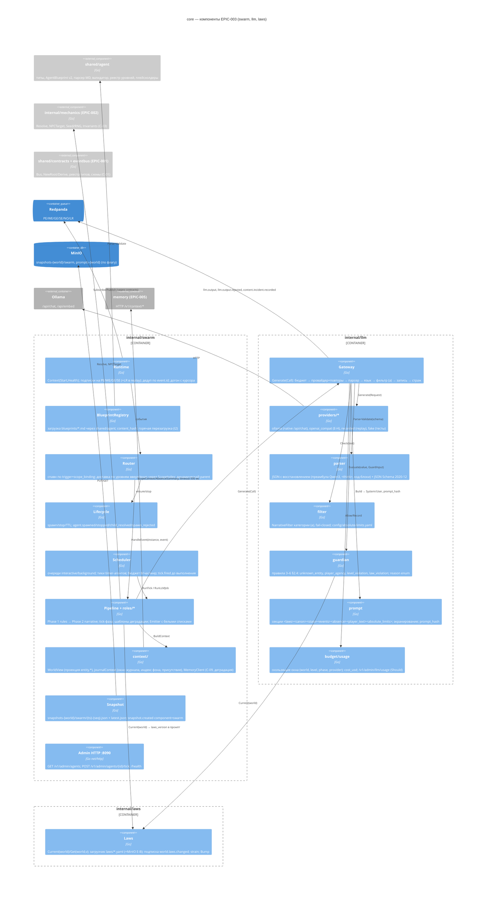

# Компоненты блока EPIC-003: рой GM, LLM-шлюз, страж, законы

Версия 0.1 · 2026-09-09 · architect#2 (TEAM-2) · статус: к ревью system-architect#1 и tech-lead#1 (Flow A, A3 шаг 2).
Границы: `architecture/overview.md` Часть II (§11–§20), ADR-001…ADR-010, `contracts.md` (поставляем C-05, C-06, C-07, C-11, C-12, C-15; потребляем C-01, C-02, C-03, C-04, C-09, C-14), `plan/epics.md` EPIC-003 (I1/I2), `plan/ownership.md`. Требования: `prd.md` §5.13, FR-010…FR-018, FR-030…FR-046, FR-050…FR-056, FR-070…FR-072, FR-090…FR-092, FR-120…FR-128, BR-02, BR-05, BR-06, BR-08, BR-10, BR-14…BR-16; `nfr.md` §1, §3, §5–§7, §10; `use-cases.md` UC-004…UC-008, UC-016, UC-018…UC-026, UC-029, UC-030, UC-034; `api-contracts.md` §2, §3; `data-model.md` §4, §6–§8; `domain-review.md` §3.1; `metrics.md` §4.
Решения уровня реализации — ADR-014 (планировщик), ADR-015 (формат блупринта v2 и валидатор), ADR-016 (парсер вывода LLM, язык, фильтр (a)), ADR-017 (страж и `reason`).

Глобальные решения (стек, конверт `meta`, топики, порядок middleware ADR-005 п. 2, уровни ADR-002, контракт пробоя ADR-008) здесь **не меняются**; всё, что требует правки контракта, вынесено в отчёт разделом «Запросы на изменение контрактов».

---

## 1. Обзор блока

Блок живёт в процессе `core` (ADR-001) как три контекста одного бинарника `cmd/multiverse --contexts=…,swarm,llm,laws` плюс общий пакет типов `shared/agent` и файлы данных (`blueprints/`, `laws/`, `schemas/agent/`, `config/absolute-limits.yaml`). Ответственности:

| Контекст / пакет | Ответственность | Владеет данными | Не делает |
|---|---|---|---|
| `internal/swarm` | рантайм роя: реестр блупринтов, роутер событий, жизненный цикл агентов, планировщик тиков и очередей, двухфазный конвейер по ролям, контекст агентов (WorldView + журнал), снапшот роя, admin-HTTP | `AgentInstance[]`, расписание, бюджет фона, окно журнала, индекс фоновых событий, присутствие игроков, снапшот `snapshots-{world}/swarm/*` | не пишет сущности (только `*.proposed`, BR-03); не вызывает провайдера LLM напрямую (только через `internal/llm`) |
| `internal/llm` | LLM-шлюз: провайдеры, middleware (бюджет → провайдер → парсер → язык → фильтр (a) → запись `llm.output` → страж), промпт-билдер, учёт | журнал `llm.output`/`llm.output.rejected`/`content.incident.recorded`, бюджеты, словарь фильтра (a) | не знает о ролях агентов и топиках доменных событий; не публикует доменных событий |
| `internal/laws` | документы `laws@vN`: загрузка, `Current/Get`, подписка на `world.laws.changed`, счётчик напряжения, `Bump` для CLI | `LawsVersion` (файлы в Git, объекты MinIO — E-B), `strain` | не проверяет инварианты сам (проверки — `mechanics.Invariants()` C-03, вызывает страж/State) |
| `shared/agent` | типы (`AgentLevel`, `LODLevel`, `AgentLifecycleState`, `AgentBlueprint` v2), парсер MD/YAML, валидатор C-11, словарь плейсхолдеров, реестр уровней | формат блупринта (C-11) | ничего рантаймного (без горутин, без I/O кроме чтения файлов) |

### 1.1. C4 уровень 3 — компоненты контейнера `core` (часть EPIC-003)



Правило зависимостей (проверяется `depguard` в CI EPIC-001): `swarm → llm, laws, mechanics, agent, contracts, eventbus, objstore`; `llm → contracts, eventbus, laws (только тип LawsVersion), agent (только AgentRef/типы)`; `laws → contracts, eventbus, objstore`; `agent → ничего из internal/*`. Обратных рёбер нет: `llm` не импортирует `swarm`; `laws` не импортирует `mechanics` (сопоставление инвариантов по `id` делает страж — §10.4).

---

## 2. Структура пакетов и файлов

```
internal/swarm/
  swarm.go            # Context: Start(ctx, deps) / Health(); сборка компонентов; режимы live|replay; фаза догона
  runtime.go          # подписки (consumer-group core.swarm), дедуп (testkit.Dedup), маршрутизация в Router, курсор
  registry.go         # BlueprintRegistry: LoadDir, Get, ByTrigger, ContentHash, Reload (I2: fsnotify → agent.blueprint_reloaded)
  scope.go            # ScopeIndex: solo/group → region → world; encounter → scope; обновляется из entity.*/group.*
  router.go           # Router: Match (спавн) + Deliver (доставка по уровням), см. §5
  instance.go         # AgentInstance (данные) + Behaviour (интерфейс роли), см. §4
  lifecycle.go        # Lifecycle: Ensure/Stop/ExpireTTL; события agent.*; TTL поверх Clock
  scheduler.go        # Scheduler: очереди, воркеры, тики, уступка, см. §7 и ADR-014
  budget.go           # BackgroundBudget: скользящее окно вызовов фона на мир (питается llm.output)
  emitter.go          # Emitter: Derive(parent) + meta.agent + белые списки allowed_event_types/owned_entity_types
  pipeline.go         # Pipeline: HandleEvent → Behaviour.OnEvent / OnTick; вызов LLM-заданий; fallback-шаблоны
  roles/
    global_gm.go      # role=global-gm: tick-фаза (LOD basic|rule-only), background_events, world.* + entity.update.proposed(world)
    region_gm.go      # role=region-gm: tick idle/active; обнаружение встреч (rules); npc_table/respawn_ttl; region.*/npc.*
    encounter.go      # role=encounter: Phase 1 rules (mechanics.Resolve), раунд группы, encounter.ended, child_resolved
    personal_gm.go    # role=personal-gm: Phase 2 (turn|entry|death|world_event); в группе — rule-only (entry|death)
    group_narrator.go # role=group-narrator: Phase 2 по завершению раунда, один narrative.output на раунд
    triggers.go       # таблица «событие → фаза/kind» по ролям (§8.2)
  context/
    worldview.go      # WorldView: read-only проекция сущностей мира из entity.created/updated (+ latest.json State при старте)
    journal.go        # journalContext: EventWindow (кольцо N на scope), BackgroundIndex (world/region, 30 дн.), Presence (player → last_seen_at)
    memory.go         # MemoryClient (C-09) с таймаутом 500 мс и деградацией; NopMemory в replay
    builder.go        # AgentContext → prompt.Sections (state, events, absence, canon, laws, player_text)
  template/
    ru.go             # шаблоны деградации: turn/round/entry/death/world_event/encounter (generated_by=template)
  snapshot.go         # SwarmSnapshot: сериализация/восстановление; snapshot.created component=swarm
  admin.go            # HTTP :8090 — /v1/admin/agents, /v1/admin/agents/{id}/tick, /health (agents_by_level, llm)
  *_test.go

internal/llm/
  gateway.go          # Gateway.Generate(ctx, Call) (Result, error); ErrUnavailable/ErrBudget/ErrQuarantined/ErrInvalid
  types.go            # Provider, Request, Response, Params, Phase, Call, Result, Rejection, ValidationStatus (C-15)
  config.go           # LLM_PROVIDER, таймауты фаз, LLM_CLOUD_*, LLM_PROMPT_STORE, таблица цен
  budget.go           # Budget: окна (world, level, phase, provider); облачный денежный лимит
  record.go           # Recorder: llm.output / llm.output.rejected / content.incident.recorded (Derive от cause)
  usage.go            # агрегаты для mvctl llm usage и /v1/admin/llm/usage
  providers/
    registry.go       # providers.Registry: Register(name, factory); New(name, cfg)
    ollama/client.go  # native /api/chat, /api/embed; format=schema, think, keep_alive, options.num_ctx; токены из eval_count
    openai_compat/    # response_format json_schema (E-H; в MVP-1 компилируется, включается флагом)
    recorded/         # RecordedProvider: ключ (correlation_id, agent.id, phase, attempt); промах = ошибка
    fake/             # FakeProvider: табличные ответы для unit/e2e; счётчик вызовов
  parser/
    parser.go         # Parse(raw) (json.RawMessage, Strategy, error) — восстановление (ADR-016)
    schema.go         # компилированные схемы schemas/agent/*.json (jsonschema/v6, draft 2020-12)
    language.go       # CheckLanguage(text, policy) — 0 CJK, латиница ≤ порога
  filter/
    filter.go         # NarrativeFilter (интерфейс) + CategoryAFilter (словарь/regexp, fail-closed), filter_version
    config.go         # загрузка config/absolute-limits.yaml; встроенный список по умолчанию при пустом файле (UC-023 A2)
  guardian/
    guardian.go       # Evaluate(value, GuardInput) (Verdict) — правила 3–6 §2.4 (ADR-017)
    visibility.go     # Visible(agent, entity) по уровню/scope
    reasons.go        # Reason enum (общий с схемой llm.output.rejected)
  prompt/
    builder.go        # Build(Sections) (system, user string); секции ADR-005 п. 4; prompt_hash
    placeholders.go   # подстановка словаря плейсхолдеров блупринта
    escape.go         # экранирование <, > в тексте игрока и именах
    events.go         # рендер окна событий (перенос clusterEvents/formatEventDescription из narrative-orchestrator)
  *_test.go

internal/laws/
  laws.go             # Service: Current, Get, Watch, Bump; загрузчик; подписка world.laws.changed
  document.go         # LawsVersion, Law{ID, Kind, Text, Check, Source}
  source.go           # Source интерфейс: FileSource(laws/), ObjectSource(laws-{world}/vN.json — E-B)
  strain.go           # Strain: Inc(lawID), Snapshot(); в MVP-1 только накопление
  *_test.go

shared/agent/
  types.go            # AgentLevel, LODLevel, AgentLifecycleState (из agent_types.go, без изменений)
  blueprint.go        # AgentBlueprint v2 (§13.1) + вложенные типы
  parser.go           # ParseFile/ParseBytes: frontmatter + секции ## system/phase1/phase2/tick/canon/description; чистый YAML
  validator.go        # Validate(bp, Env) []Issue{File, Field, Reason, Severity} — правила §3.2 (ADR-015)
  levels.go           # реестр уровней: AllowedEventTypes(level, role), OwnedEntityTypes(level, role); monitor/object зарезервированы
  placeholders.go     # словарь плейсхолдеров промптов
  lod.go              # без изменений (E-G)
  tools/registry.go   # без изменений (MVP-1 не использует; tools/*_tool.go удаляются)
  testdata/blueprints/{valid,invalid}/*.md
  # удаляются: router.go, lifecycle.go, worker_pool.go, pipeline.go, state_manager.go, filter.go, helpers.go (TTLManager),
  #            md_parser.go/blueprint_loader.go (заменены parser.go), examples/domain-dark-forest.md (→ blueprints/), README.md/MIGRATION.md (→ Docs/archive)

blueprints/
  global-dark-forest-world.md   domain-dark-forest.md   encounter-wolf.md   player-gm.md   group-narrator.md
laws/
  dark-forest-world.v1.yaml
schemas/agent/
  tick-global.json   tick-region.json   narrative.json   breach.json (зарезервировано, E-B)
schemas/events/   (типы, которыми владеет EPIC-003, v1)
  combat.decided  encounter.started  encounter.ended  world.weather_changed  world.time_advanced  world.event_occurred
  region.event_occurred  npc.moved  npc.spawned  tick.fired  tick.aborted  agent.spawned  agent.child_resolved  agent.stopped
  agent.spawn_rejected  agent.blueprint_reloaded  llm.output  llm.output.rejected  narrative.output  content.incident.recorded
  world.laws.changed  world.law_breach.{proposed,rejected,applied,review_decided,rolled_back}
config/
  absolute-limits.yaml
shared/testkit/swarm/
  fake_narrator.go    # testkit.FakeNarrator (C-05 заглушка для EPIC-004)
  recording_writer.go # testkit.RecordingWriter (C-07)
testdata/
  recordings/{solo-30,group-3x30,background-6h,death,flee-fail,injections-10}.jsonl
  llm/preamble/*.txt  golden/*.json
```

---

## 3. Ключевые интерфейсы Go

Только сигнатуры, определяющие границы; детали — в разделах ниже.

```go
// internal/swarm — контекст процесса (overview §14 п. 1)
type Context interface { Start(ctx context.Context, deps Deps) error; Health() Status }
type Deps struct {
    Bus       eventbus.Bus                 // C-01
    Store     objstore.Client              // snapshots-{world}/swarm, чтение snapshots-{world}/state/latest.json
    LLM       llm.Gateway                  // §9
    Laws      laws.Service                 // §12
    Mechanics *mechanics.Rules             // C-03 (или testkit.FixedMechanics)
    Memory    swarmctx.MemoryClient        // C-09 (NopMemory при отсутствии/replay)
    Clock     replay.Clock                 // ADR-003 п. 6
    Mode      Mode                         // ModeLive | ModeReplay
    Config    Config                       // BlueprintsDir, WorldIDs, AdminAddr, SnapshotEveryEvents, GMPath
}

// Поведение роли (реализации в roles/*)
type Behaviour interface {
    Role() string
    Subscribes(inst *AgentInstance, ev eventbus.Event, idx *ScopeIndex) bool // видимость события агенту (§5.2)
    OnEvent(ctx context.Context, inst *AgentInstance, ev eventbus.Event, r *Runtime) error // Phase 1 sync + постановка LLM-заданий
    OnTick(ctx context.Context, inst *AgentInstance, tick eventbus.Event, r *Runtime) error // только timer-роли
}

// Router
type Router struct{ … }
func (r *Router) Route(ctx context.Context, ev eventbus.Event) error // спавн по триггерам, затем доставка живым агентам
func (r *Router) Match(ev eventbus.Event) []SpawnIntent             // блупринты с trigger.event, совпавшие по scope_binding
func (r *Router) Recipients(ev eventbus.Event) []*AgentInstance     // живые агенты, для которых Behaviour.Subscribes == true

// Lifecycle
func (l *Lifecycle) Ensure(ctx context.Context, bp *agent.AgentBlueprint, scope eventbus.ScopeRef, cause eventbus.Event) (*AgentInstance, bool, error) // (inst, spawned, err); max_instances=1 по детерминированному id
func (l *Lifecycle) Stop(ctx context.Context, id string, reason StopReason, cause eventbus.Event) error
func (l *Lifecycle) Touch(id string, at time.Time)                 // продление TTL от активности
func (l *Lifecycle) ExpireDue(ctx context.Context, now time.Time)  // вызывается планировщиком; в replay не вызывается

// Scheduler (ADR-014)
type Job struct { Kind JobKind /* narrative|tick|entry */; Agent string; Cause eventbus.Event; Priority Queue; Run func(ctx context.Context, lod agent.LODLevel) error }
func (s *Scheduler) Enqueue(q Queue, j Job)                        // QueueInteractive | QueueBackground
func (s *Scheduler) RegisterTimer(inst *AgentInstance)             // global/domain: next_tick_at по intervals
func (s *Scheduler) SetTickMode(agentID string, mode TickMode)     // idle|active (domain при игроках)
func (s *Scheduler) FireNow(ctx context.Context, agentID string, actorKind string) error // admin-тик (C-06)

// Emitter — единственный путь публикации из агентов
func (e *Emitter) Emit(ctx context.Context, inst *AgentInstance, cause eventbus.Event, typ string, payload map[string]any) (eventbus.Event, error)
// Derive(cause) + meta.agent{id,level,blueprint,blueprint_version} + проверка allowed_event_types / owned_entity_types → ErrLevelViolation

// internal/llm (C-15, ADR-005 п. 1)
type Provider interface {
    Generate(ctx context.Context, req Request) (Response, error)
    Embed(ctx context.Context, model string, texts []string) ([][]float32, error)
    Health(ctx context.Context) Status
}
type Request struct { Phase Phase; Model, System string; Messages []Message; Schema json.RawMessage; Params Params; Timeout time.Duration; CorrelationID string }
type Params struct { Temperature float64; MaxTokens int; Think bool; NumCtx int; Seed *int64 }
type Response struct { Content string; Thinking string; Tokens Tokens; Model string; Latency time.Duration; Done bool }

type Gateway interface { Generate(ctx context.Context, call Call) (Result, error); Health(ctx context.Context) Status; Usage() Usage }
type Call struct {
    Agent        eventbus.AgentRef           // meta.agent для записей
    Phase        Phase                        // PhaseNarrative | PhaseTick (| PhaseDecision — не в MVP-1)
    Cause        eventbus.Event               // событие-причина: Derive() для llm.output
    World, Scope string
    ActorKind    string
    LawsVersion  string
    Prompt       prompt.Sections              // → system/user + prompt_hash
    Schema       parser.Schema                // скомпилированная схема фазы
    Model        string; Params Params; Retries int; Timeout time.Duration
    TextPaths    []string                     // JSON-пути текстовых полей для языка/фильтра: ["text"], ["events[*].summary"]
    Guard        guardian.Input               // видимость, белые списки, инварианты (§10)
    LOD          agent.LODLevel; GMPath string
}
type Result struct {
    Value         json.RawMessage             // валидный остаток после стража
    OutputEventID string                      // id записанного llm.output (последней попытки)
    Status        ValidationStatus; Rejected []Rejection; Attempts int
    Tokens        Tokens; LatencyMS int
}
var ErrUnavailable, ErrBudget, ErrQuarantined, ErrInvalidAfterRetries, ErrFilter error

// internal/llm/guardian (ADR-017)
type Input struct { Level agent.AgentLevel; Role string; Scope eventbus.ScopeRef; Allowed []string; Owned []string; View StateView; Laws laws.LawsVersion; Invariants map[string]mechanics.Invariant; AbsenceEventIDs map[string]bool; Kind SchemaKind }
type StateView interface { Entity(id string) (Entity, bool); InScope(id string, scope eventbus.ScopeRef) bool; Position(id string) string }
func Evaluate(value json.RawMessage, in Input) Verdict // Verdict{Value json.RawMessage; Rejected []Rejection; Status ValidationStatus}

// internal/llm/filter
type NarrativeFilter interface { Check(ctx context.Context, text string) (Decision, error); Version() string } // Decision: Pass | Block{Category}

// internal/laws (C-12)
type Service interface {
    Current(world string) (LawsVersion, error)
    Get(world, version string) (LawsVersion, error)
    Watch() <-chan Changed                  // после world.laws.changed
    Strain() *Strain
    Bump(ctx context.Context, world, path string) (LawsVersion, error) // mvctl laws bump: файл vN+1 → world.laws.changed + entity.update.proposed(world.laws_version)
}
type LawsVersion struct { Version, WorldID, Status, CreatedBy string; BasedOn string; Laws []Law; CreatedAt time.Time }
type Law struct { ID, Kind /* invariant|declarative */, Text, Check, Source string }

// shared/agent (C-11)
func ParseFile(path string) (*AgentBlueprint, error)
func ParseBytes(name string, data []byte) (*AgentBlueprint, error)
func Validate(bp *AgentBlueprint, env ValidationEnv) []Issue // env: известные типы событий, блупринты, файлы rules/laws, инструменты, схемы
type Issue struct { File, Field, Reason string; Severity Severity /* error|warning */ }
func ContentHash(bp *AgentBlueprint) string
```

---

## 4. Модель агента

### 4.1. Уровни и роли MVP-1 (ADR-002 п. 1)

| Роль (`role`) | Уровень | Блупринт | Scope экземпляра | Спавн | Стоп | Фазы | LOD MVP-1 |
|---|---|---|---|---|---|---|---|
| `global-gm` | `global` | `global-dark-forest-world` | `world:{world_id}` | старт мира (`mvctl world init` / `Start`) | никогда (`ttl` игнорируется с предупреждением) | tick (60 мин idle) | `basic` → `rule-only` при бюджете |
| `region-gm` | `domain` | `domain-dark-forest` (по одному на регион) | `region:{region_id}` | старт мира | никогда | tick (30 мин idle / 60 с active), обнаружение встреч (rules), Phase 1 — нет | `basic` → `rule-only` |
| `encounter` | `task` | `encounter-wolf` | scope игрока/группы (`solo:…`/`group:…`) | `encounter.started` | `encounter.ended` → `agent.child_resolved` + `agent.stopped`; страховочный TTL 30 мин | Phase 1 `rules` | `rule-only` |
| `personal-gm` | `task` | `player-gm` | `solo:{player_id}` (и в группе) | первое `player.*` scope без живого агента | TTL 45 мин от последнего действия игрока; `agent.stopped reason=ttl` | Phase 2 (`turn|entry|death|world_event`) | `basic`; в группе — `rule-only` (только `entry|death`) |
| `group-narrator` | `task` | `group-narrator` | `group:{group_id}` | `group.created` | `group.disbanded` или TTL 45 мин от последнего действия любого участника | Phase 2 (`round`) | `basic` |
| (резерв) `guardian-monitor` | `monitor` | — | `world:*` | выключен `SWARM_MONITOR_AGENTS_ENABLED=false` | — | — | — |
| (резерв) `entity-actor` | `object` | — | сущность | выключен `SWARM_OBJECT_AGENTS_ENABLED=false` (C-13) | — | — | — |

`agent.id = "{blueprint.name}:{scope.id}"` — детерминированный, обеспечивает `max_instances=1` без блокировок (второй `Ensure` находит существующий; при явном спавне по триггеру — `agent.spawn_rejected reason=max_instances` не публикуется, если агент уже жив и это тот же scope: событие просто доставляется существующему; `spawn_rejected` публикуется только при попытке спавна с другим `scope_binding.id` для `global/domain` и при провале валидации).

### 4.2. AgentInstance (данные, `data-model.md` §6.2)

```go
type AgentInstance struct {
    ID, Blueprint, BlueprintVersion, ContentHash string
    Level agent.AgentLevel; Role string
    Scope eventbus.ScopeRef; WorldID string
    ParentID string          // динамический для personal-gm/group-narrator (§5.3); фиксированный для domain/encounter
    State agent.AgentLifecycleState // initializing → running → finishing → finished (paused не используется в MVP-1)
    LOD agent.LODLevel       // фиксированный по роли (таблица 4.1); для personal-gm — rule-only, пока игрок в группе
    SpawnedAt, LastActivityAt time.Time; ExpiresAt *time.Time // TTL только task
    Tick struct{ Seq int64; LastAt, NextAt time.Time; Mode TickMode } // только timer-роли
    LawsVersion string       // версия законов, под которой строится контекст
    Observed struct{ Players []string; Encounter string; Group string } // наблюдаемый scope (не сущности — те в WorldView)
    Runtime struct{ inflight int; mu sync.Mutex } `json:"-"`
}
```

Состояние агента **не содержит копий сущностей**: единственная проекция мира — `WorldView` (§11.1), общая для всех агентов; агент хранит только идентификаторы наблюдения. Это делает снапшот роя малым и исключает расхождение копий (T5 аудита).

### 4.3. Снапшот роя (C-14, ADR-003 п. 7)

`snapshots-{world}/swarm/{ts}-{seq}.json` + `latest.json`:

```json
{ "schema_version": 1, "component": "swarm", "world_id": "dark-forest-world", "taken_at": "…", "seq": 12,
  "cursor": { "player_events": 1042, "world_events": 388, "game_events": 511, "system_events": 2210, "llm_records": 97 },
  "laws_version": "v1",
  "blueprints": { "domain-dark-forest": { "version": "1.1", "content_hash": "sha256:…" } },
  "agents": [ { "…AgentInstance без Runtime…" } ],
  "scheduler": { "budget": { "window": ["2026-09-09T10:02:11Z", "…"], "cap": 4 } },
  "journal": { "windows": { "solo:player-A": [ { "id": "…", "type": "combat.decided", "at": "…", "summary": "…" } ] },
               "background": { "region:dark-forest-01": [ { "id": "…", "type": "npc.moved", "at": "…", "summary": "…" } ] },
               "presence": { "player-A": { "last_seen_at": "…", "region": "dark-forest-01" } } },
  "state_hash": "sha256:…", "size_bytes": 18432 }
```

Триггеры снапшота: после каждого тика, при изменении состава агентов, каждые `SWARM_SNAPSHOT_EVERY_EVENTS=200` обработанных событий, по `SIGTERM`; хранится `K=5`. `snapshot.created {component: swarm, …}` публикуется после PUT. Восстановление: `latest.json` → проверка `state_hash` → чтение топиков с `cursor` в фазе догона (§7.6) → `analytics.replay.completed` публикует State (C-14); рой пишет строку в лог `catch_up_done events=N`.

---

## 5. Router

### 5.1. Обработка события

```
Route(ev):
  1. dedup: testkit.Dedup по ev.ID (LRU 10k + курсор снапшота) → повтор игнорируется (NFR-013)
  2. legacy-фильтр: типы с пометкой deprecated/gm_path=legacy (gm.*, narrative.generate, time.syncTime, player.moved, player.used_skill) → игнор
  3. проекции: WorldView.Apply(ev) для entity.*; ScopeIndex.Apply(ev) для entity.*/group.*/encounter.*; journal.Observe(ev) (все типы); budget.Observe(ev) для llm.output; presence.Observe(ev) для player.*
  4. спавн: for bp in Match(ev): scope := bindScope(bp, ev); inst, spawned := Lifecycle.Ensure(bp, scope, ev)
  5. доставка: for inst in Recipients(ev): Pipeline.HandleEvent(inst, ev) — последовательно на агента (per-instance очередь), параллельно между агентами
  6. tick.fired: если meta.agent.id — живой timer-агент → Pipeline.HandleTick; иначе (replay: агент ещё не восстановлен) → лог handled=true
  7. agent.* в replay: agent.stopped → Lifecycle.stopSilently(id); agent.spawned → Ensure без публикации
```

Match — по `trigger.type=event`: `event_name` совпадает с `ev.Type` (поддерживается glob `player.*` — см. запрос к C-11) **и** `scope_binding` совпадает с `ev.Scope` (`type` ∈ binding.type; `id` равен или `pattern` матчит). `bindScope` для `encounter`: scope события `encounter.started` (scope игрока/группы); для `group-narrator`: `group:{group.entity.id}`; для `personal-gm`: `solo:{entity.entity.id}` — из `entity{player}` события, **не** из `ev.Scope` (в группе `ev.Scope = group:…`, а персональный GM всё равно живёт в `solo:{player_id}`, `data-model.md` §6.2).

### 5.2. Доставка по уровням (вверх/вниз, FR-121)

`Behaviour.Subscribes(inst, ev, idx)` — таблица видимости (все проверки внутри одного `world`):

| Роль | Видит (тип события → условие) |
|---|---|
| `global-gm` | `region.*`, `encounter.started/ended`, `npc.spawned` (любой регион мира — «сводка вверх»); `world.laws.changed`; `tick.fired` адресованный; свои `entity.updated(world)` |
| `region-gm` | `player.entered_region/left_region`, `group.entered_region/left_region` где `target.region == self`; `encounter.*`, `combat.decided`, `npc.*`, `region.*` где `idx.RegionOf(ev.Scope) == self`; `entity.updated` сущностей региона (регион, его NPC, встречи, игроки в регионе); `world.*` (вниз от родителя); `tick.fired` адресованный |
| `encounter` | `player.attacked/flee_attempted/defended/said/rested`, `round.opened/closed`, `group.left`, `entity.updated` участников и NPC встречи — только при `ev.Scope == inst.Scope` |
| `personal-gm` | `player.*` где `entity.entity.id == player`; `combat.decided`, `encounter.*`, `round.*`, `group.*`, `player.said` где `ev.Scope == solo:{player}` или `ev.Scope == group:{idx.GroupOf(player)}`; `region.*`, `npc.*` где `idx.RegionOf(solo:{player}) == ev region`; `world.*` мира; `entity.updated(player)` (смерть → `kind: death`) |
| `group-narrator` | всё, что `encounter` в `group:{id}`, плюс `combat.decided`, `encounter.*`, `group.*`, `region.*`/`npc.*` региона группы, `world.*` |

«Вверх» = родитель подписан на события дочерних scope через `ScopeIndex` (регион видит `combat.decided` своих встреч; глобальный видит `region.*`). «Вниз» = дочерние подписаны на типы уровней выше (`world.*` → регион и персональные). Прямых вызовов между агентами нет: `Emitter` публикует в шину, `Router` доставляет — в том числе самому издателю, если он подписан (например, `region-gm` видит своё `encounter.started`; `Behaviour` игнорирует собственные события по `meta.agent.id == inst.ID`, кроме `tick.fired`).

### 5.3. Динамический родитель персонального GM

`inst.ParentID` для `personal-gm`/`group-narrator` пересчитывается при каждом `entity.updated(position)` игрока/группы: `region-gm` региона текущей позиции, при `outside:{world}` — `global-gm`. Родитель используется (а) в `Subscribes` (регион, чьи `region.*`/`npc.*` видны), (б) в `agent.spawned.parent` (первое значение), (в) в контексте промпта (`{region.description}`, `{canon}` берутся из блупринта родителя-региона). Смена родителя события не порождает (это не факт мира).

### 5.4. `level_violation` на выходе

Все публикации агентов идут через `Emitter.Emit`: тип ∉ `allowed_event_types` или `entity.*.proposed` с сущностью типа ∉ `owned_entity_types` (или вне scope агента для `task`) → `ErrLevelViolation`. Если источник — вывод LLM, элемент уже отброшен стражем (§10) и до Emitter не доходит; если источник — код роли, это дефект: событие не публикуется, лог `handled=false`, тест роли падает. Реестр белых списков уровня — `shared/agent/levels.go`, тот же экспортируется в `contracts.OwnershipRules` (C-02) для State.

---

## 6. Lifecycle

| Переход | Условие | Событие |
|---|---|---|
| `initializing → running` | `Ensure`: блупринт валиден, контекст собран (`WorldView` есть сущности scope) | `agent.spawned {agent, parent{id}, scope, ttl_expires_at?, lod}` |
| `running` (продление) | любое событие scope от игрока (`Touch`) — для `personal-gm`: `player.*` своего игрока; для `group-narrator`: `player.*` любого участника; для `encounter`: любое действие участника | — |
| `running → finishing` | `encounter.ended` (encounter); `group.disbanded` (narrator); TTL истёк (`ExpireDue` по `Clock`); `Stop` при shutdown; необработанная ошибка роли ×3 | `agent.child_resolved {reason: npc_dead|players_out|ttl|abandoned}` (только task с parent) затем `agent.stopped {reason: ttl|shutdown|error}` |
| `finishing → finished` | снапшот роя записан (для `shutdown`), иначе сразу | — |
| Отказ спавна | `global/domain` с другим `scope_binding.id`, невалидный блупринт | `agent.spawn_rejected {blueprint, scope, reason: max_instances|validation}` |

Правила: `global`/`domain` создаются при старте для всех блупринтов с `scope_binding.id` и **никогда** не истекают (`ttl` в их блупринте — предупреждение валидатора). `personal-gm` после смерти персонажа публикует `narrative.output kind=death`, остаётся до TTL (игрок может `status`), затем `stopped`. TTL — таймеры поверх `Clock` (ADR-003 п. 6); в `mode=replay` `ExpireDue` не вызывается, стоп читается из `agent.stopped`. Повторный спавн после TTL — обычный `Ensure` по следующему `player.*`; контекст восстанавливается из `WorldView` + `journal` (дёшево, без LLM).

Ограничение NFR-083: `/health.agents_by_level` и мягкий лимит `SWARM_MAX_AGENTS=64` — при превышении `agent.spawn_rejected reason=max_instances` для `task` (global/domain всегда спавнятся).

---

## 7. Scheduler (детали — ADR-014)

### 7.1. Две очереди и воркеры

- `interactive` — задания, вызванные действием игрока: Phase 2 (`turn|round|entry|death`), нарратив `world_event` (`encounter.started`). Источник причины — `player.*`/`round.closed`/`encounter.started`.
- `background` — задания тиков timer-агентов (`tick` LLM-фаза) и `agent.blueprint_reloaded`-перечитывания.
- Воркеры LLM: `SWARM_LLM_WORKERS=1` (Ollama `OLLAMA_NUM_PARALLEL=1` — параллелизм на GPU отсутствует; второй воркер только удлинил бы очередь). Воркер всегда берёт из `interactive`; из `background` — только если `interactive` пуста **и** с момента последнего интерактивного задания прошло ≥ `SWARM_BACKGROUND_QUIET=5s`.
- **Уступка**: (а) фоновое задание, ждущее в очереди дольше `SWARM_BACKGROUND_MAX_WAIT=30s`, выполняется в `rule-only` без LLM (UC-018 A3); (б) если во время фонового LLM-вызова появилось интерактивное задание, контекст фонового вызова отменяется (`context.Cancel` → Ollama освобождает GPU), попытка записывается как `llm.output validation_status=error error.code=yielded`, тик завершается по таблице `background_events` (`rule-only`); интерактивное задание стартует немедленно. В replay записанный `error/yielded` ведёт в ту же ветку — детерминизм сохраняется.
- Phase 1 (`rules`) **не проходит через очереди**: выполняется синхронно в `OnEvent` агента встречи (CPU ≪ 10 мс), чтобы механика никогда не ждала LLM (BR-10, NFR-001).
- Порядок внутри агента: per-instance FIFO (одна горутина на агента через `Runtime.inflight`), между агентами — параллельно. Для `group-narrator` и `personal-gm` одного игрока задания также сериализованы по `correlation_id`.

### 7.2. Тики

- Регистрация: `RegisterTimer(inst)` для `trigger.type=timer`: `next_tick_at = max(last_tick_at, now) + interval(mode)`; `mode=idle` по умолчанию; `region-gm` переходит в `active` при первом игроке в регионе (`ScopeIndex.PlayersIn(region) > 0`) и обратно в `idle`, когда игроков нет (`player.left_region`/TTL сессии не отслеживается — только позиция).
- Срабатывание: цикл планировщика с шагом `Clock`-тикера 1 с (в replay выключен). При `next_tick_at ≤ now`: считает бюджет → публикует `tick.fired {agent, scope, tick{seq, mode, scheduled_at, fired_at, lod_allowed}, budget{window_calls, cap}}` (**до** выполнения, BR-04) → `Router` доставляет агенту → `OnTick`. `tick_seq` монотонен на агента и хранится в `AgentInstance`.
- Пропущенные тики после простоя/рестарта — один тик, не пачка (overview §20 п. 10): `next_tick_at = now + interval` после выполнения.
- Источник времени для мира: агенты используют `tick.fired.timestamp` (в live = `Clock.Now()` при публикации), не `time.Now()` — `world.time_advanced` и сводки вычисляются от него; replay воспроизводит те же значения.
- Admin-тик (`POST /v1/admin/agents/{id}/tick`, C-06): `FireNow` публикует тот же `tick.fired {mode: background}` с `meta.actor_kind=ci`, минуя `next_tick_at` (и не сдвигая его в replay-тестах, где таймеры выключены).
- `tick.aborted {tick{seq}, reason}` — при ошибке выполнения тика после публикации `tick.fired` (паника роли перехвачена, `handled=false`) или при рестарте, если в снапшоте `Tick.Seq` больше последнего `tick.fired` в журнале для агента... точнее: при догоне тик, чей `tick.fired` есть в журнале, но нет ни одного производного события и нет `tick.aborted`, считается прерванным → рой публикует `tick.aborted reason=restart` после догона (один раз, идемпотентно по `tick_seq`).

### 7.3. Бюджет фона (FR-125, NFR-007)

`BackgroundBudget` на мир: скользящее окно 1 ч, наполняется из событий `llm.output` с `meta.actor_kind=system` и `meta.replay=false` (как в live, так и при догоне — счётчик восстанавливается из журнала, снапшот содержит окно на случай отсутствия событий). `cap = B` из `budget.background_calls_per_hour_world` блупринта `global-gm` (стартовое 4). `lod_allowed = basic` если `window_calls < cap`, иначе `rule-only`; значение пишется в `tick.fired` и **не пересчитывается** агентом (в replay читается из события). Второй рубеж — middleware бюджета шлюза (§9.3) по ключу `(world, level ∈ {global, domain}, phase=tick)`; расхождение (агент запросил LLM при `rule-only`) → `llm.output.rejected reason=budget_exceeded budget{kind: background, limit: B, window: 1h}` без вызова.

Персональные GM и Task-агенты без игроков не выполняются по построению: у них нет таймера, а задания создаются только по событиям игроков (NFR-053).

---

## 8. Двухфазный конвейер

### 8.1. Принципы (BR-05, FR-013)

1. **Phase 1 = механика без LLM** (`phase1.mode: rules` во всех блупринтах MVP-1). Только роль `encounter` имеет Phase 1: `mechanics.Resolve` → публикации `dice.rolled` ×k (тип EPIC-002, издаёт агент — C-03) → `combat.decided` → `entity.update.proposed {atomic: true, expected_version}`. Всё синхронно в `OnEvent`.
2. **Phase 2 = нарратив, асинхронно, без изменений состояния**: задание в очередь `interactive`; результат — только `narrative.output` (схема `narrative.json` не имеет полей действий/событий — ADR-009 п. 6).
3. **Tick-фаза** (global/domain): при `lod_allowed=basic` — LLM по схеме `tick-*.json` (`{events[]{type ∈ allowed_event_types, summary, ops[]}}`), при `rule-only` — выбор из `background_events[]` по весам с `rng = mechanics.NewRNG(mechanics.Seed(tick.id, 0))`. В обоих случаях результат публикуется одинаково: доменное событие (`world.*`/`region.*`/`npc.*`) + сопутствующее `entity.update.proposed` (`cause: tick`), `meta.actor_kind=system`, `meta.correlation_id = tick.fired.id`.
4. **Один нарратив на раунд**: в `group` Phase 2 делает только `group-narrator`, `narrative.output.recipients[]` = все участники группы со статусом `active|idle|out_of_combat` (`dead` — только `kind: death` от своего персонального GM); `narrative_event_id` = `id` этого события; персональные GM участников в группе в `rule-only` (`entry`/`death` шаблоном или LLM? — **LLM только для `entry` при `absence`, иначе шаблон**; итого ≤ 2 вызова на раунд, NFR-006).
5. Персональные GM **доставляют**: `narrative.output` от `group-narrator` уже содержит `recipients[]`, gateway доставляет напрямую (C-05); персональный GM участника группы не переиздаёт его (иначе дубль) — «доставляют» означает, что он остаётся владельцем `entry`/`death` и адресной сводки фона.

### 8.2. Таблица триггеров нарратива (roles/triggers.go)

| Роль | Событие-причина (в scope агента) | Условие | `kind` | Вызов LLM |
|---|---|---|---|---|
| `personal-gm` (solo) | `player.entered_region` | всегда | `entry` (+`absence` при паузе ≥ 30 мин или предыдущем присутствии) | да |
| | `player.looked`, `player.rested`, `player.said`, `player.left_region` | всегда | `turn` | да |
| | `combat.decided action=npc_attack` **или** `encounter.ended` | последнее событие цикла «действие → ответ NPC» с тем же `correlation_id` | `turn` | да (один на ход) |
| | `combat.decided action=flee` (успех) → далее ждёт `encounter.ended` | — | `turn` | да |
| | `encounter.started` | не ход игрока | `world_event` | да |
| | `entity.updated(player) status=dead` | — | `death` | да |
| | `world.*` вне хода | блупринт `immediate_broadcast: false` (по умолчанию) | — (в контекст следующего) | нет |
| `personal-gm` (в группе, `rule-only`) | `player.entered_region` первого действия после паузы | `absence` есть | `entry` | да (одно на вход) |
| | иначе `entry`, `death` | — | шаблон | нет |
| `group-narrator` | `combat.decided action=npc_attack round.seq=N` **или** `encounter.ended` после `round.closed seq=N` | завершение раунда механикой | `round` | да (один на раунд) |
| | `player.entered_region`/`group.entered_region`, `encounter.started`, `player.looked` вне встречи | — | `turn`/`world_event` | да |
| `region-gm` | `tick.fired` (`active`) | обнаружение встреч — всегда rules; фон — по `lod_allowed` | — | по `lod_allowed` |
| `global-gm` | `tick.fired` | по `lod_allowed` | — | по `lod_allowed` |

Завершение раунда всегда наблюдаемо событиями (NPC действует ровно один раз в раунд — либо `combat.decided npc_attack`, либо встреча завершена), поэтому нарратор не ждёт по таймеру — детерминизм в replay без таймеров.

### 8.3. Роль `encounter`: раунд группы (I2)

`round.closed {acted[], auto_defended[], idle[]}` → агент восстанавливает порядок действий раунда по `acted[].event{id}` (уже применены Phase 1 по мере приёма — UC-016 шаг 2), затем ответ NPC: `mechanics.NPCTarget` (исключая `idle|out_of_combat|dead`), `Resolve(causeEventID = round.closed.id, rollIndexStart = 0)` → `dice.rolled`, `combat.decided {action: npc_attack, round{seq}}`, `entity.update.proposed`. Учёт пропусков (`idle` после 2 подряд `auto_defended`) — `entity.update.proposed(encounter.participants[player].state)`. Завершение: NPC мёртв → `encounter.ended reason=npc_dead killer=…`, все участники `out_of_combat|idle|dead` → `reason=players_out`.

В `solo` (I1): `player.attacked` → Phase 1 атаки игрока (`causeEventID = player.attacked.id`, `rollIndex 0..1`) → ответ NPC тем же событием-причиной (`rollIndex 2..3`) → `combat.decided` ×2 → одно `entity.update.proposed atomic`.

### 8.4. Деградация (BR-14, FR-015)

`Gateway.Generate` вернул `ErrUnavailable | ErrBudget | ErrInvalidAfterRetries | ErrQuarantined | ErrFilter` → роль строит текст шаблоном `template/ru.go` из `WorldView` и событий причины (`generated_by: template`, `fallback_reason: unavailable|timeout|invalid_after_retries|budget|filter_blocked|filter_error|language|restart`), помечает «упрощённый режим»; тики — `rule-only`. Рестарт между Phase 1 и Phase 2 (UC-025 A1): при догоне для `combat.decided` без `narrative.output` с тем же `correlation_id` — если `llm.output` записан → нарратив из записи; иначе шаблон с `fallback_reason=restart` (публикуется после выхода из догона).

---

## 9. LLM-шлюз (`internal/llm`)

### 9.1. Провайдеры (C-15, ADR-005 п. 1)

| Реализация | Транспорт | Особенности |
|---|---|---|
| `providers/ollama` | `POST {OLLAMA_URL}/api/chat` (native), `POST /api/embed` | `format` = JSON-схема фазы (объект), `think: false` (Phase tick/narrative MVP-1; поле блупринта `thinking`), `keep_alive: -1` (`LLM_KEEP_ALIVE`), `options{temperature, num_predict=max_tokens, num_ctx=LLM_NUM_CTX (8192), seed?}`, `stream: false`; токены из `prompt_eval_count`/`eval_count` (NFR-052); таймаут фазы через `context`; `Health` = `GET /api/tags` + `GET /api/ps` (модели резидентны). Клиент — `net/http` без зависимости от модуля `ollama` |
| `providers/openai_compat` | `/v1/chat/completions`, `response_format: {type: json_schema}` | компилируется, включается `LLM_PROVIDER=openai|deepseek` + `LLM_CLOUD_ENABLED=true` (E-H) |
| `providers/recorded` | чтение `testdata/recordings/*.jsonl` или журнала `llm_records` | ключ `(meta.correlation_id, meta.agent.id, phase, attempt)`; промах → `ErrIncompleteRecord` (в `mode=replay` тест падает, в recovery — шаблон с пометкой) |
| `providers/fake` | in-memory таблица `(phase, matcher) → Response` | счётчик вызовов для NFR-014/NFR-053; генератор записей через `testkit.RecordingWriter` |

`providers.Registry`: `Register("ollama", factory)`; выбор `LLM_PROVIDER` (по умолчанию `ollama`); модель — из `Call.Model` (блупринт на фазу), не из env.

### 9.2. Конвейер `Generate` (порядок побочных эффектов — ADR-005 п. 2)

```
Generate(call):
  0. replay-режим: provider = recorded (шаги 2–5 читают запись; запись llm.output не издаётся, meta.replay=true при пробросе)
  1. budget.Allow(world, level, phase, provider) → нет → publish llm.output.rejected{reason: budget_exceeded, budget{kind,limit,window}} → ErrBudget (без вызова)
  2. prompt.Build(call.Prompt) → system, user, prompt_hash (SHA-256); по флагу LLM_PROMPT_STORE=true → prompts-{world}/{cid}/{agent}/{phase}-{attempt}.txt
  3. for attempt := 1; attempt <= 1+retries; attempt++ :
       resp, err := provider.Generate(ctx(timeout фазы), req)        # ошибка/таймаут → status=error, повтор при временной ошибке, иначе → ErrUnavailable
       value, strategy, perr := parser.Parse(resp.Content, schema)   # ADR-016; perr → status=invalid(schema_invalid) → retry
       lerr := parser.CheckLanguage(texts(value, call.TextPaths))    # 0 CJK, латиница ≤ LLM_LATIN_MAX_RATIO (0.10) → status=rejected_language → retry
       fdec, ferr := filter.Check(texts)                              # error → status=filter_error (raw сохраняется); block → status=quarantined (raw НЕ сохраняется) + content.incident.recorded; без повтора
       verdict := guardian.Evaluate(value, call.Guard)               # чистая функция; даёт итоговый status valid|partially_rejected|invalid и rejected[]
       ev := record.LLMOutput(call, attempt, resp, status, hashes, parse{strategy}, filter{…}, tokens, latency)   # ЗАПИСЬ ДО ИСПОЛЬЗОВАНИЯ
       for r in verdict.Rejected: publish llm.output.rejected{llm_output{event{id: ev.ID}}, reason, element, entity}
       if status ∈ {valid, partially_rejected}: return Result{Value: verdict.Value, OutputEventID: ev.ID}
       if status ∈ {quarantined, filter_error}: return ErrQuarantined/ErrFilter
       if status == invalid && verdict.Reason == law_violation(stale laws): обновить laws_version в промпте, retry
  4. исчерпание попыток → ErrInvalidAfterRetries (или ErrUnavailable, если все попытки — ошибки провайдера)
```

Уточнения к ADR-005 (не меняют наблюдаемый порядок эффектов): оценка стража — чистая функция и выполняется **до** записи, чтобы `validation_status` в `llm.output` был окончательным (`partially_rejected` и т. п. из `data-model.md` §7.2); публикация `llm.output.rejected` — после записи со ссылкой на `llm_output.event.id`. Кэш ответов в шлюзе **не вводится**: кэшированный ответ не имел бы собственного `llm.output`, что ломает record-replay; в replay роль «кэша» выполняет `providers/recorded`.

Таймауты фаз (ориентиры ADR-005, уточняются замером): `LLM_TIMEOUT_NARRATIVE=20s`, `LLM_TIMEOUT_TICK=30s`, `LLM_TIMEOUT_DECISION=5s`. Повторы `retries` из блупринта (по умолчанию 2 для narrative, 1 для tick); повтор при `schema_invalid`/`language` добавляет в `user`-сообщение короткую подсказку «Ответ должен быть валидным JSON по схеме, на русском» (не меняет `system`, чтобы кэш промпта Ollama сохранялся).

### 9.3. Бюджеты и учёт (FR-071, FR-072, NFR-050…053)

`Budget` — скользящие окна по ключу `(world, level, phase, provider)`: фон `(world, {global,domain}, tick)` cap B/1h (Must); интерактив `(world, task, narrative)` cap `LLM_TURN_CALLS_PER_MIN` (Should, по умолчанию 0 = выключено); облако — `LLM_CLOUD_BUDGET_USD_PER_DAY`. Окна наполняются собственными записями и восстанавливаются из `llm_records` при догоне. `Usage` агрегирует `calls, tokens{prompt, completion}, cost_usd, latency p50/p95` по `(phase, level, provider, model)` для `mvctl llm usage` и `GET /v1/admin/llm/usage` (Should). `cost_usd` по таблице `config/llm-prices.yaml` (0 для Ollama).

### 9.4. Облако (BR-15, ADR-005 п. 6, ADR-009 п. 7)

`LLM_CLOUD_ENABLED=true` + ключ + `LLM_PROVIDER=openai|deepseek|anthropic`; проверка «внешних игроков» требует числа связок `alive` — у `core` нет `links.db`, поэтому шлюз читает флаг `LLM_CLOUD_ALLOW_EXTERNAL_PLAYERS` и публикует `config.cloud_enabled {by: operator, allow_external_players}` при старте; проверка фактического числа игроков — на стороне gateway/оператора (замечание в отчёте). В промпт уходят только `player_id`, имена персонажей и текст `say`.

### 9.5. Деградация и здоровье

Любая ошибка провайдера после повторов → `ErrUnavailable`; `Health()` опрашивает провайдера раз в 10 с (`llm: ok|unavailable|degraded(model_not_resident)`), `/health` процесса `core` отражает (NFR-016); восстановление без рестарта — следующий вызов идёт в провайдер, если `Health` снова `ok` (без circuit-breaker с длинным окном, чтобы не задерживать восстановление: при `unavailable` вызовы всё равно пробуются с укороченным таймаутом `LLM_TIMEOUT_DEGRADED=3s`).

---

## 10. Страж (`internal/llm/guardian`, ADR-017)

### 10.1. Место в конвейере

Правила §2.4 api-contracts распределены: 1 (схема) — `parser`; 2 (язык) — `parser.CheckLanguage`; 7 (фильтр (a)) — `filter`; 8 (бюджет) — `budget`; **3–6 — страж**; 9 (числа нарратива ≠ механики) — метрика NFR-023, не рантайм. Страж — чистая функция над распарсенным значением и `Input` (видимость, белые списки, инварианты, законы); не публикует событий сам (публикует шлюз по `Verdict`).

### 10.2. Проверки по видам схем

| Правило | `narrative.json` (`{text, background_refs[], mentions[], tone?}`) | `tick-*.json` (`{events[]{type, summary, ops[]{path, value}, affects[]?, entity?}}`) |
|---|---|---|
| 3 `unknown_entity` | `mentions[i]` ∉ `View`/не видима → элемент удаляется из `mentions` (текст остаётся); `background_refs[i]` ∉ `AbsenceEventIDs` → удаляется | `events[i].entity`/`affects[]` ∉ View или не видимы → `events[i]` отброшен |
| 4 `player_agency` | текст не проверяется (нет структурных полей действий) | `events[i].type` начинается с `player.` или `ops[].path` меняет сущность типа `player` → отброшен |
| 5 `level_violation` | — (allowed = `[narrative.output]`, страж не применяется; Emitter — §5.4) | `events[i].type` ∉ `Allowed`; `ops[]` меняют сущность типа ∉ `Owned` или вне scope агента (регион GM — только свой регион/NPC) → отброшен |
| 6 `law_violation` | `LawsVersion` вызова ≠ `Laws.Current` → весь ответ `invalid`, повтор с новой версией | инварианты по `check`-ключам к гипотетическому состоянию `View + ops` (см. 10.4): провал → `events[i]` отброшен с `details{invariant_id}`; stale laws → `invalid` |

Итог: `valid` (ничего не отброшено), `partially_rejected` (≥ 1 элемент отброшен, ≥ 1 остался), `invalid` (ничего не осталось или stale laws). Для `tick` c `invalid` роль переходит в `rule-only`. Каждый отброшенный элемент → `llm.output.rejected {reason, element{index, type}, entity?, details?}`.

### 10.3. Видимость (`visibility.go`)

| Уровень/роль | Видимые сущности |
|---|---|
| `global` | мир, все регионы (только id/name/атрибуты), NPC — нет |
| `domain` | свой регион, его NPC, встречи в регионе, игроки/группы с позицией в регионе |
| `task/encounter` | участники и NPC встречи, регион |
| `task/personal-gm` | свой игрок, группа и её участники, регион позиции и его живые NPC, активная встреча, мир |
| `task/group-narrator` | группа и участники, регион, NPC региона, встреча, мир |

Мёртвые NPC видимы (нужны для «волк мёртв»), но операции над ними — `law_violation dead_does_not_act`.

### 10.4. Инварианты и законы

`laws.LawsVersion.Laws[kind=invariant].Check` — ключ, совпадающий с `mechanics.Invariant.ID` (C-03). Страж получает `Invariants map[id]mechanics.Invariant` из `Deps.Mechanics.Invariants()` и `Laws.Current(world)`; проверяет только те `id`, что есть в текущей версии законов (законы управляют набором, механика — реализацией). При старте `core` проверяет полноту сопоставления: закон с `check` без реализации → `/health degraded {laws: unknown_check}`. Отклонение с `law_violation` инкрементирует `Laws.Strain().Inc(lawID)` (ADR-008 п. 5).

---

## 11. Контекст агента и промпт

### 11.1. WorldView (`context/worldview.go`)

Read-only проекция сущностей мира: `map[entityID]Entity{ID, Type, Name, Version, Attrs map[string]any, Position, Status}`; при старте — `snapshots-{world}/state/latest.json` (только чтение, C-02), далее `entity.created/updated` (по `version` строго; отставание → `analytics.consistency.violated` не публикуется роем — лог). Используется: страж (`StateView`), роли (Phase 1 актёры → `mechanics.Actor`), промпт (`<state>`), `ScopeIndex`.

### 11.2. journalContext (`context/journal.go`) — штатный, не тестовый (C-09)

- `EventWindow`: кольцо последних `N=50` событий на scope (`solo:*`, `group:*`, `region:*`, `world:*`) с `{id, type, at, actor_kind, summary}`; `summary` — короткий рендер `prompt/events.go` (перенос `formatEventDescription`).
- `BackgroundIndex`: на `(world)` и `(region)` — события `world.*`, `region.*`, `npc.*` с `meta.actor_kind=system` за `SWARM_BACKGROUND_INDEX_TTL=30d` (≤ ~3 000 записей/мир при B=4).
- `Presence`: `player_id → {last_seen_at, region}` из `player.*` (последняя активность).
- `Absence(player, region, now)`: если `last_seen_at` есть и `now − last_seen_at ≥ 30 мин` (или это первый `enter` после `left_region`) → `since_at = last_seen_at`, события = `BackgroundIndex(world) ∪ BackgroundIndex(region)` в `(since_at, now]`, отсортированы по `at`, лимит 20 последних (остальное — счётчик). Итог: `absence{since_at, background_events_count}` + `background_refs[]` кандидаты (страж пропускает в `narrative.output` только те `background_refs`, что были в контексте).
- Всё персистится в снапшоте роя (§4.3) и восстанавливается при догоне; отдельного чтения журнала по времени не требуется (ограничение C-01: `Bus` без range-чтения).

### 11.3. memoryContext (C-09)

`MemoryClient{ScopeContext, AbsenceSummary, Trace}` с `MEMORY_URL`; каждое обращение — `context.WithTimeout(500 ms)`; ошибка/таймаут → журнал без ошибки игроку, лог `memory_degraded=true`. `ScopeContext.facts[]` добавляются в секцию `<facts source=memory>` после журнала; `AbsenceSummary` заменяет список журнала, если вернулся (иначе журнал). В `mode=replay` — `NopMemory` (обращение к памяти недетерминировано; промпт может отличаться, но ответ берётся из записи; `prompt_hash` сравнивается только предупреждением).

### 11.4. Секции промпта (`internal/llm/prompt`, ADR-005 п. 4)

System (кэшируемая часть, порядок фиксирован): `<role>` (из `## system` блупринта) → `<laws laws_version="v1">` (декларативные законы `Laws.Current` + инварианты одной строкой) → `<canon>` (`## canon` мира + региона родителя) → `<absolute_limits>` (короткая позитивная формулировка из `config/absolute-limits.yaml.prompt_notice`) → `<format>` (краткое описание схемы; сама схема уходит в `format`). User: `<state>` (WorldView: мир{погода, время}, регион{описание из `## description`}, игрок/участники{hp/hp_max, статус, инвентарь}, NPC{hp, статус}, встреча{раунд}) → `<events>` (окно журнала + события причины, с `actor_kind`) → `<absence since_at=…>` (если есть) → `<facts source="memory">` (если есть) → `<player_text>` (реплики `say` и имена — **только как данные**, `<`→`&lt;`, `>`→`&gt;`, длина ≤ 500) → `<task>` (из `## phase2`/`## tick` с подстановкой плейсхолдеров). `locale` — в `<role>` и в `meta.locale`. `prompt_hash = SHA-256(system + "\n\n" + user)`.

Словарь плейсхолдеров блупринта (`shared/agent/placeholders.go`): `{world.name} {world.weather} {world.time_of_day} {world.day} {region.name} {region.description} {player.name} {player.hp} {player.hp_max} {events} {state} {absence} {canon} {laws_version} {locale} {npc.name} {encounter.round}`; неизвестный → ошибка валидации (C-11).

Перенос из narrative-orchestrator: `prompt_builder.go` → `prompt/builder.go` (идея system/user и теги сохраняются; удаляется `fmt.Println`, `new_events`, примеры произвольных типов), `clusterEvents/formatEventDescription` → `prompt/events.go`, `prompt_builder_test.go` → `prompt/builder_test.go` (переписан под новые секции).

---

## 12. Законы (`internal/laws`, ADR-008, C-12)

### 12.1. Документ `laws/dark-forest-world.v1.yaml`

```yaml
version: v1
world_id: dark-forest-world
status: approved
created_by: author
created_at: 2026-09-09T00:00:00Z
laws:
  - { id: inv-1,  kind: invariant, check: dead_does_not_act,        text: "Мёртвая сущность не действует и не выбирается целью" }
  - { id: inv-2,  kind: invariant, check: hp_in_range,              text: "0 ≤ hp ≤ hp_max" }
  - { id: inv-3,  kind: invariant, check: loot_once,                text: "Трофей за NPC выдаётся не более одного раза" }
  - { id: inv-4,  kind: invariant, check: group_position,           text: "Позиция участника группы равна позиции группы" }
  - { id: inv-5,  kind: invariant, check: group_size,               text: "1 ≤ участников группы ≤ 6" }
  - { id: inv-6,  kind: invariant, check: single_scope,             text: "Игрок ровно в одном scope" }
  - { id: inv-7,  kind: invariant, check: hp_matches_combat,        text: "HP после entity.updated = HP в combat.decided" }
  - { id: inv-8,  kind: invariant, check: no_combat_without_action, text: "Нет combat.decided против игрока без его действия" }
  - { id: inv-9,  kind: invariant, check: no_respawn_in_ttl,        text: "NPC, убитый игроком, не возрождается в течение respawn_ttl" }
  - { id: inv-10, kind: invariant, check: single_position,          text: "Одна сущность — одна позиция" }
  - { id: inv-11, kind: invariant, check: laws_version_current,     text: "Вывод LLM создан под текущей версией законов" }
  - { id: law-1,  kind: declarative, source: author, text: "В Тёмном лесу нет магии, лечащей раны; отдых — единственный способ восстановить силы" }
  - { id: law-2,  kind: declarative, source: author, text: "Волки не разговаривают и не торгуют" }
```

Декларативные законы — из `## canon`/авторского текста блупринта мира (перечень для v1 уточняет автор; выше — примеры под механику FR-024). `inv-11` реализуется стражем (не механикой) — единственное исключение из сопоставления §10.4 (ключ зарезервирован в `guardian`).

### 12.2. Сервис

`FileSource` читает `laws/{world}.v{N}.yaml` при старте (все версии); `Current(world)` = версия из `WorldView.World.laws_version` (истина — State), при отсутствии сущности мира — старшая `approved` из файлов. `ObjectSource` (`laws-{world}/vN.json`, MinIO) — интерфейс есть, реализация E-B. Подписка `world.laws.changed` → перечитать источники → `Watch()` уведомляет рой (агенты берут `Current()` при сборке каждого промпта, отдельного «перезагрузить» не требуется). `Bump(world, path)`: валидирует файл `vN+1` (`based_on = vN`, `status=approved`, `created_by=author`, `check`-ключи известны), публикует `world.laws.changed {laws{version_from, version_to, status: approved}, created_by: author, diff{added[], removed[]}, effective_from{round_boundary: true}}` и `entity.update.proposed {world.laws_version}` от `actor_kind=system, cause=laws`; используется `mvctl laws bump` (EPIC-005). `mvctl laws show` — `Current` + `Strain().Snapshot()`.

### 12.3. Контракт пробоя: что в MVP-1, что в EPIC-007

| Элемент ADR-008 | MVP-1 (EPIC-003) | E-B (EPIC-007) |
|---|---|---|
| `laws@v1` файл, `Laws.Current/Get`, `laws_version` в промптах/`llm.output`/`narrative.output`/снапшотах | реализуется | — |
| `world.laws.changed` (author) + `mvctl laws bump/show` | реализуется | — |
| Схемы `world.law_breach.{proposed,rejected,applied,review_decided,rolled_back}` в `schemas/events/` | регистрируются, издателя нет | обработчики |
| `strain` счётчик (инкремент от стража) | в памяти, восстанавливается из `llm.output.rejected reason=law_violation` при догоне; без последствий | пороги, триггеры автора, Monitor-агент |
| `LAWS_BREACH_PHASE_ENABLED=false`; `schemas/agent/breach.json` | флаг читается, схема-заглушка в репозитории | фаза пробоя в `global/domain` (отдельная `Phase = breach`, не читает `<player_text>`) |
| Состояния `approved | pending_review | rolled_back | superseded`, автоодобрение по таймауту, откат `vN+2 = vN`, `retconned` | только типы/enum в `document.go` | машина состояний, ревью, ретрокон |
| `ObjectSource` (MinIO) | интерфейс | реализация |

---

## 13. Блупринты (C-11, ADR-015)

### 13.1. `AgentBlueprint` v2 (`shared/agent/blueprint.go`)

Существующие поля сохраняются (`name, version, description, trigger, constraints, llm, tools, parent, ttl, type`, промпты) для совместимости парсера; `type` становится необязательным псевдонимом `role`; `phase1_prompt/phase2_prompt` заполняются из секций.

```go
type AgentBlueprint struct {
    Name, Version, Description string
    Level  string `yaml:"level"`  // global|domain|task|monitor|object
    Role   string `yaml:"role"`   // global-gm|region-gm|city-gm|personal-gm|encounter|group-narrator|entity-actor|guardian-monitor
    ScopeBinding ScopeBinding `yaml:"scope_binding"` // {Type []string (через "|"), ID, Pattern}
    Parent *ParentReference    // {Name, Instance: ""|"dynamic"}
    Trigger BlueprintTrigger   // {Type: timer|event, EventName (glob допустим), Conditions[], Intervals{Idle, Active}}
    TTL string; Constraints BlueprintConstraints // {MaxInstances, Priority}
    LLM LLMSettings            // {Phase1 *PhaseLLM{Mode: rules|llm, …}, Phase2 *PhaseLLM, Tick *TickLLM{Model, LODDefault, MaxTokens, SchemaRef}, Retries int, Fallback: template|rules}
    AllowedEventTypes, OwnedEntityTypes []string
    Tools []ToolReference
    LawsRef, RulesRef, AbsoluteLimitsRef string
    NPCTable []NPCRow          // {NPCID, Kind, Name, StatsRef, Count, Spawn{On, Chance}}
    RespawnTTL string
    Encounter *EncounterCfg    // {DetectOn, Perception, Chance, ChildBlueprint}
    BackgroundEvents []BackgroundEvent // {Kind, Weight, SummaryTemplate, Ops[]}
    Round *RoundCfg            // {Timeout, IdleAfterMissed}
    Budget *BudgetCfg          // {BackgroundCallsPerHourWorld}
    Invariants []InvariantRef  // {ID, Check}
    Locale string
    ImmediateBroadcast []string // типы world.*/region.* для немедленной доставки kind=world_event (по умолчанию пусто)
    Prompts Prompts            // {System, Phase1, Phase2, Tick, Canon []string, Description string} — из секций
    SourceFile, ContentHash string `yaml:"-"`
}
```

Парсер: frontmatter `---…---` (YAML) + секции `## system`, `## phase1`, `## phase2`, `## tick`, `## canon` (список маркерами `- `), `## description`; файл без frontmatter, целиком YAML (`.yaml/.yml`) — те же поля, промпты в `prompts:`. Неизвестный ключ frontmatter — ошибка (`yaml.v3` `KnownFields(true)`).

### 13.2. Валидатор (правила §3.2 + уровневые)

`Validate(bp, env)` возвращает `[]Issue{File, Field, Reason, Severity}`; тот же код — в рантайме (`BlueprintRegistry.LoadDir`) и в `mvctl blueprint validate` (EPIC-005 вызывает `agent.Validate`). `ValidationEnv{EventTypes set, Blueprints set, FileExists func, Tools set, Schemas set, Invariants set}` — рантайм заполняет из `contracts`, файловой системы и `mechanics.Invariants()`; CLI — из тех же источников.

| # | Правило | Severity |
|---|---|---|
| 1 | `name`, `version` (semver `X.Y[.Z]`), `level` ∈ реестра, `role` ∈ реестра и соответствует уровню (`global-gm`↔`global`, `region-gm|city-gm`↔`domain`, `personal-gm|encounter|group-narrator`↔`task`, `guardian-monitor`↔`monitor`, `entity-actor`↔`object`), `locale` | error |
| 2 | `scope_binding.type` ⊂ `{world, region, solo, group}` и согласован с ролью (§3.1); `global/domain` — `id` обязателен; `task` — `pattern` или `type` список | error |
| 3 | `parent` обязателен кроме `global`; `parent.name` ∈ `env.Blueprints` либо `instance: dynamic` для `personal-gm`/`group-narrator` | error |
| 4 | `trigger.type=timer` → `intervals.idle` обязателен (для `domain` — и `active`); `trigger.type=event` → `event_name` матчит ≥ 1 тип из `env.EventTypes` (glob) | error |
| 5 | `ttl` у `global/domain` | warning |
| 6 | `constraints.max_instances == 1` для `global/domain/personal-gm/group-narrator` | error |
| 7 | `llm`: фазы, используемые ролью, имеют `model` (кроме `phase1.mode=rules`); `schema_ref` ∈ `env.Schemas`; `temperature ∈ [0,2]`; `max_tokens > 0`; `fallback` задан; модель не из списка `qwen:7b|qwen:72b` (NFR-071) | error |
| 8 | `allowed_event_types` ⊂ `env.EventTypes` ∩ `levels.AllowedEventTypes(level, role)`; `owned_entity_types` ⊂ `levels.OwnedEntityTypes(level, role)` | error |
| 9 | `tools[].name` ∈ `env.Tools` (MVP-1: пусто → любой `tools` — error) | error |
| 10 | `laws_ref` (global/domain) и `rules_ref` (domain/encounter) существуют (`env.FileExists`); `absolute_limits_ref` (personal-gm/group-narrator/encounter) существует | error |
| 11 | `domain`: `npc_table` непуст, `respawn_ttl`, `encounter.child_blueprint` ∈ `env.Blueprints`, `background_events` непуст, `## description` непуст | error |
| 12 | `global`: `budget.background_calls_per_hour_world > 0`, `invariants[].check` ∈ `env.Invariants` | error |
| 13 | плейсхолдеры в секциях — только из словаря; `## system` обязателен для ролей с LLM | error |
| 14 | `monitor`/`object` — валидны, но помечаются `info: reserved level, spawn disabled` | info |

Невалидный блупринт не активируется, остальные загружаются; `/health degraded {blueprints: [file]}` (UC-029 E1).

### 13.3. Пять блупринтов MVP-1 (файлы в `blueprints/`)

Скелеты §3.3 api-contracts берутся без изменений с уточнениями:

- `global-dark-forest-world.md` — как в §3.3; добавлены `locale: ru`, `## system`, `## tick`; `invariants` — ссылки на `laws/dark-forest-world@v1` (список `id/check` дублируется валидатором против файла законов; расхождение — error).
- `domain-dark-forest.md` — как в §3.3 (`version: "1.1"`), `trigger.intervals{idle: 30m, active: 60s}`, `encounter{detect_on: tick, perception: all, child_blueprint: encounter-wolf}`; секции `## description`, `## canon`, `## system`, `## tick`. Заменяет `shared/agent/examples/domain-dark-forest.md` (старый файл удаляется; старые `configs/gm_*.yaml` не конвертируются — ADR-002 п. 6).
- `encounter-wolf.md` — как в §3.3; `scope_binding: {type: "solo|group", pattern: "*"}`; `llm: {phase1: {mode: rules}, fallback: rules}`; `round{timeout: 60s, idle_after_missed: 2}`.
- `player-gm.md` — `level: task`, `parent: {name: "region-gm", instance: dynamic}`, `trigger: {type: event, event_name: "player.*"}`, `ttl: 45m`, `llm.phase2{model: <из baseline.md, стартово qwen3:30b-a3b>, temperature: 0.8, max_tokens: 700, thinking: false, schema_ref: schemas/agent/narrative.json}`, `retries: 2`, `fallback: template`, `allowed_event_types: [narrative.output]`, `owned_entity_types: []`, `absolute_limits_ref: config/absolute-limits.yaml`; секции `## system`, `## phase2`.
- `group-narrator.md` — `level: task`, `role: group-narrator`, `scope_binding: {type: group, pattern: "group:*"}`, `parent: {name: region-gm, instance: dynamic}`, `trigger: {type: event, event_name: group.created}`, `ttl: 45m`, `llm.phase2` как у `player-gm`, `retries: 2`, `fallback: template`, `allowed_event_types: [narrative.output]`, `owned_entity_types: []`, `absolute_limits_ref`; секции `## system` («описываешь раунд для всей группы; каждый участник назван по имени; числа механики — истина»), `## phase2`.

Модель на фазу — параметр блупринта: замена конфигурации A/B/C/D матрицы (overview §18.1) = правка YAML.

### 13.4. Схемы `schemas/agent/`

- `narrative.json`: `{ "type":"object", "required":["text","mentions","background_refs"], "properties": { "text": {"type":"string","minLength":1,"maxLength":1500}, "mentions": {"type":"array","items":{"type":"string"}}, "background_refs": {"type":"array","items":{"type":"string"}}, "tone": {"enum":["calm","tense","grim","hopeful"]} }, "additionalProperties": false }`.
- `tick-global.json`: `{ events: [ { type: enum[world.weather_changed, world.time_advanced, world.event_occurred], summary: string ≤ 300, ops: [ { path: enum[weather, time_of_day, day], value } ] } ] }`, `maxItems: 2`.
- `tick-region.json`: `{ events: [ { type: enum[region.event_occurred, npc.moved, npc.spawned], summary, entity?: {id}, affects?: [{id}], ops: [ { path, value } ] } ] }`, `maxItems: 3`.
- `breach.json` — заглушка `{ "$comment": "reserved E-B" }`.

Схемы компилируются при старте (`jsonschema/v6`), передаются провайдеру как `format`, валидируются парсером; `enum` типов в схемах тика = пересечение `allowed_event_types` блупринта (схема генерируется из шаблона на блупринт: `schema_ref` + подстановка enum).

### 13.5. `config/absolute-limits.yaml`

```yaml
filter_version: a-2026-09
prompt_notice: "Мир вымышлен, все персонажи — взрослые; реальных инструкций причинения вреда, реальных людей и событий в тексте нет."
categories:
  a:
    enabled: true
    terms: [ … словарь … ]          # регулярные выражения RE2, без lookahead
    context_terms: [ … ]             # сочетания «возрастной маркер + сексуальный контекст» (оба должны встретиться в окне 80 символов)
  b: { enabled: false }   # … g: реестр 7 пунктов BR-08 с enabled=false (контракт фильтра, E-H)
```

Пустой `terms` → предупреждение при старте и встроенный список по умолчанию (UC-023 A2). Ложные срабатывания на золотом наборе = 0 — тест `filter/golden_test.go`.

---

## 14. Схемы событий и объекты данных (владение EPIC-003)

Все типы из `contracts.md` §0 для EPIC-003 получают `schemas/events/<type>.v1.json` (draft 2020-12, `$ref` на `_common.json`: `EntityRef`, `ScopeRef`, `AgentRef`). Ключевые payload — по `api-contracts.md` §2.3.6–2.3.13, 2.3.15 без изменений; дополнения в пределах совместимости (§16 п. 1 contracts): `llm.output` +`parse{strategy, recovered}` (опц.), `narrative.output` +`narrative_event_id` (= `id`, опц., дубль для удобства gateway), `tick.fired` — `tick.lod_allowed` обязателен, `agent.spawned` +`content_hash` (опц.).

Объекты MinIO (`shared/objstore/buckets.go`): `snapshots-{world}/swarm/*` (владелец EPIC-003), `prompts-{world}/*` (по флагу `LLM_PROMPT_STORE`, retention — задача DevOps).

Переменные окружения блока (документируются в `.env.example`, NFR-074): `SWARM_BLUEPRINTS_DIR=blueprints`, `SWARM_ADMIN_ADDR=127.0.0.1:8090`, `SWARM_LLM_WORKERS=1`, `SWARM_BACKGROUND_QUIET=5s`, `SWARM_BACKGROUND_MAX_WAIT=30s`, `SWARM_SNAPSHOT_EVERY_EVENTS=200`, `SWARM_MAX_AGENTS=64`, `SWARM_MONITOR_AGENTS_ENABLED=false`, `SWARM_OBJECT_AGENTS_ENABLED=false`, `LLM_PROVIDER=ollama`, `OLLAMA_URL`, `LLM_KEEP_ALIVE=-1`, `LLM_NUM_CTX=8192`, `LLM_TIMEOUT_NARRATIVE=20s`, `LLM_TIMEOUT_TICK=30s`, `LLM_TIMEOUT_DECISION=5s`, `LLM_TIMEOUT_DEGRADED=3s`, `LLM_LATIN_MAX_RATIO=0.10`, `LLM_PROMPT_STORE=false`, `LLM_CLOUD_ENABLED=false`, `LLM_CLOUD_ALLOW_EXTERNAL_PLAYERS=false`, `LLM_CLOUD_BUDGET_USD_PER_DAY`, `LLM_TURN_CALLS_PER_MIN=0`, `LAWS_DIR=laws`, `LAWS_BREACH_PHASE_ENABLED=false`, `MEMORY_URL` (пусто = деградация), `GM_PATH=agent` (читает gateway; `core` пишет в `combat.decided.gm_path`/`llm.output.gm_path` значение из `meta.gm_path` события-причины).

---

## 15. Потоки

### 15.1. Ход соло с нарративом (UC-007/UC-020)

```mermaid
sequenceDiagram
    participant BUS as Redpanda
    participant RT as swarm.Runtime/Router
    participant ENC as encounter-wolf:solo:A
    participant M as mechanics (C-03)
    participant PGM as player-gm:solo:A
    participant SCH as Scheduler (interactive)
    participant GW as llm.Gateway
    participant P as providers/ollama
    BUS->>RT: PE player.attacked {cid=id, scope solo:A}
    RT->>RT: dedup; WorldView/ScopeIndex/journal.Observe; Lifecycle.Touch(player-gm)
    RT->>ENC: OnEvent (Phase 1, sync)
    ENC->>M: Resolve(attack, cid, rollIndex 0..) / NPCTarget / Resolve(npc_attack)
    M-->>ENC: Outcome×2, Rolls[0..3]
    ENC->>BUS: GE dice.rolled ×4, GE combat.decided (attack), GE combat.decided (npc_attack)
    ENC->>BUS: SE entity.update.proposed {atomic, expected_version, cause: combat}
    BUS->>RT: GE combat.decided (npc_attack, cid)
    RT->>PGM: OnEvent → триггер turn (последнее событие цикла)
    PGM->>SCH: Enqueue(interactive, Job{narrative, cid})
    SCH->>PGM: Run(lod=basic)
    PGM->>PGM: BuildContext: WorldView + journal window + laws.Current + canon; absence=nil
    PGM->>GW: Generate(Call{phase narrative, schema narrative.json, model из блупринта})
    GW->>GW: budget.Allow → ok
    GW->>P: /api/chat {format: schema, think:false, keep_alive:-1}
    P-->>GW: content (JSON или JSON с преамбулой)
    GW->>GW: parser.Parse (восстановление) → language → filter(a) pass → guardian.Evaluate (mentions видимы)
    GW->>BUS: LR llm.output {status valid, laws_version v1, phase narrative, attempt 1} (ДО использования)
    GW-->>PGM: Result{Value{text, mentions}, OutputEventID}
    PGM->>BUS: NO narrative.output {recipients:[A], kind: turn, generated_by: llm, llm_output{event}, based_on[combat.decided×2], filter{pass}, laws_version v1}
```

### 15.2. Фоновый тик региона без игроков (UC-019)

```mermaid
sequenceDiagram
    participant SCH as Scheduler
    participant BUS as Redpanda
    participant RT as Router
    participant RGM as domain-dark-forest:region:dark-forest-01
    participant GW as llm.Gateway
    participant BUDGET as BackgroundBudget
    SCH->>SCH: next_tick_at ≤ Clock.Now(); mode=idle (игроков нет)
    SCH->>BUDGET: window_calls(world) < cap(4)?
    SCH->>BUS: SE tick.fired {agent, scope region, tick{seq, mode: background, lod_allowed: basic}, budget{2,4}, actor_kind system}
    BUS->>RT: tick.fired
    RT->>RGM: OnTick
    RGM->>RGM: обнаружение встреч (rules): игроков нет → пропуск; respawn: died_at + 24h > now → пропуск
    alt lod_allowed = basic и interactive-очередь тиха ≥ 5 с
        RGM->>SCH: Enqueue(background, Job{tick})
        SCH->>GW: Generate(Call{phase tick, schema tick-region.json, model qwen3:8b/30b-a3b})
        GW->>BUS: LR llm.output {phase tick, actor_kind system, laws_version v1}
        GW-->>RGM: Result{events[{npc.moved …}]} (страж: NPC региона, тип ∈ allowed)
    else lod_allowed = rule-only или уступка (yield/max_wait)
        RGM->>RGM: background_events по весам, rng(Seed(tick.id, 0))
    end
    RGM->>BUS: WE npc.moved {entity wolf-alpha, position{from,to}} (Derive от tick.fired, meta.agent domain)
    RGM->>BUS: SE entity.update.proposed {npc.position, cause: tick}
    Note over BUS: State применяет → entity.updated; memory индексирует actor_kind=system; journal.BackgroundIndex(region) += npc.moved
```

### 15.3. Отклонение вывода стражем (UC-022)

```mermaid
sequenceDiagram
    participant GGM as global-dark-forest-world:world:dfw
    participant GW as llm.Gateway
    participant P as providers/ollama
    participant G as guardian
    participant BUS as Redpanda
    GGM->>GW: Generate(Call{phase tick, allowed [world.*], owned [world]})
    GW->>P: /api/chat
    P-->>GW: {"events":[{"type":"world.weather_changed","ops":[{"path":"weather","value":"rain"}]},{"type":"npc.moved","entity":{"id":"wolf-alpha"}},{"type":"world.event_occurred","affects":[{"id":"ghost-7"}]}]}
    GW->>GW: parse ok; language ok; filter pass
    GW->>G: Evaluate(value, Input{level global, view, laws v1})
    G-->>GW: Verdict{Value: events[0]; Rejected: [{1, level_violation, npc.moved ∉ allowed}, {2, unknown_entity, ghost-7}]; status partially_rejected}
    GW->>BUS: LR llm.output {validation_status: partially_rejected, response_raw, laws_version v1}
    GW->>BUS: LR llm.output.rejected {llm_output{event}, reason level_violation, element{1, npc.moved}, agent, actor_kind system}
    GW->>BUS: LR llm.output.rejected {reason unknown_entity, element{2}, entity{ghost-7}}
    GW-->>GGM: Result{Value: [weather_changed]}
    GGM->>BUS: WE world.weather_changed + SE entity.update.proposed(world.weather)
```

### 15.4. Деградация LLM (UC-021)

```mermaid
sequenceDiagram
    participant PGM as player-gm:solo:A
    participant GW as llm.Gateway
    participant P as providers/ollama
    participant BUS as Redpanda
    participant H as core /health
    PGM->>GW: Generate(Call{phase narrative, retries 2})
    GW->>P: attempt 1 (timeout 20 s)
    P-->>GW: connection refused
    GW->>BUS: LR llm.output {attempt 1, validation_status error, error{code: unavailable}, response_raw ""}
    GW->>P: attempt 2 (timeout 3 s, degraded)
    P-->>GW: timeout
    GW->>BUS: LR llm.output {attempt 2, status error, error{code: timeout}}
    GW-->>PGM: ErrUnavailable
    PGM->>PGM: template/ru.Turn(WorldView, combat.decided×2) → «Вы бьёте волка: попадание, урон 3… (упрощённый режим)»
    PGM->>BUS: NO narrative.output {generated_by: template, fallback_reason: unavailable, filter{applied:false}}
    GW->>H: Health → llm: unavailable (≤ 30 с, NFR-016)
    Note over GW: следующий вызов снова пробует провайдера; при ответе — восстановление без рестарта
```

---

## 16. NFR — как обеспечивается блоком

| NFR | Механизм |
|---|---|
| NFR-001 (механика p95 ≤ 0,5 с) | Phase 1 синхронно в обработчике, без очередей и LLM; `WorldView` в памяти; `Emitter` публикует без ожидания фактов |
| NFR-002 (нарратив p95 ≤ 5 с, после замера) | очередь `interactive` впереди фона; отмена фонового вызова при появлении интерактивного; один вызов на ход/раунд; `keep_alive=-1`; модель на фазу из блупринта |
| NFR-004 (холодный старт) | `keep_alive=-1`, `Health` проверяет `/api/ps`; при `model_not_resident` — шаблон с пометкой на время прогрева |
| NFR-005 (группа) | один `group-narrator` на группу, Phase 2 по завершению раунда; персональные GM в группе `rule-only` |
| NFR-006/007/053 (бюджет) | таблица триггеров 8.2 (≤ 1 вызов на ход соло, ≤ 2 на раунд группы); `BackgroundBudget` B/час/мир + middleware бюджета; отсутствие таймеров у `task` |
| NFR-010…014 (восстановление, replay) | снапшот роя §4.3; догон без эмиссии; `providers/recorded`; `EventClock`; `agent.stopped`/`tick.fired`/`round.closed` из журнала; дедуп по `event.id` |
| NFR-015/016 (деградация, здоровье) | §8.4, §9.5 |
| NFR-020/021/026 (консистентность, законы) | страж §10 (правила 3–6), `laws_version` в каждом промпте/записи/снапшоте, инварианты по `check`-ключам, `Emitter` белые списки |
| NFR-022 (валидность JSON) | structured output (`format`), парсер с восстановлением, повторы, золотой набор |
| NFR-031/034 (трасса) | `Emitter` = `eventbus.Derive(cause)`; `meta.agent` всегда; `llm.output` с `prompt_hash`, `lod`, `laws_version` |
| NFR-033 | `slog` с `service=core context=swarm|llm|laws agent.level handled` |
| NFR-041/043/048 (ПДн, инъекции, контент (a)) | в промпт только `player_id`/имена; `<player_text>` экранирован как данные; схема Phase 2 без действий; фильтр (a) до записи `response_raw`, `quarantined` без raw; фаза пробоя выключена |
| NFR-060/061 | RNG только через `mechanics.Seed/NewRNG` с `causeEventID`; тик использует `Seed(tick.id, i)`; сортировка map при сериализации |
| NFR-062…065 | §18 |
| NFR-071 | валидатор запрещает `qwen:7b/72b`; модели — реальные теги |
| NFR-083 | `SWARM_MAX_AGENTS`, `/health.agents_by_level`, `max_instances=1` по детерминированному id |
| NFR-090/091 | `parser.CheckLanguage` + повтор + шаблон; `locale` в `meta` и в `<role>` |

---

## 17. Миграция от narrative-orchestrator (фича-флаг, overview §19, ADR-002 п. 7)

| Шаг | Что делаем | Где |
|---|---|---|
| I1-0 | `GM_PATH=agent` по умолчанию в gateway (EPIC-004); legacy narrative-orchestrator только в compose-профиле `legacy` и реагирует на `gm.created`, которые gateway публикует лишь при `GM_PATH=legacy`; рой игнорирует deprecated-типы (§5.1 шаг 2) | compose, gateway, `swarm/router.go` |
| I1-1 | перенос `prompt_builder.go` → `internal/llm/prompt` (секции ADR-005 п. 4), `clusterEvents/formatEventDescription` → `prompt/events.go`, тесты переписаны; `GMInstance` не переносится: его буфер событий = `journal.EventWindow`, TTL = `Lifecycle`, снапшот = `SwarmSnapshot`, `isOwnEvent` не нужен (подписки по типам), `spatial` — заморожен | `internal/llm/prompt` |
| I1-2 | `shared/agent`: удаление файлов §2, расширение типов, новый парсер/валидатор; `examples/domain-dark-forest.md` → `blueprints/domain-dark-forest.md` (переписан под v2) | `shared/agent`, `blueprints/` |
| I1-3 | `gm_path` пишется в `combat.decided`, `llm.output` из `meta.gm_path` события-причины; сравнение нарративов legacy/agent — `mvctl session-report` по `gm_path` | `swarm/emitter.go`, `llm/record.go` |
| I2-1 | `group-narrator`, раунд в `encounter`, `MemoryClient` к EPIC-005, `agent.blueprint_reloaded` | `roles/`, `context/memory.go`, `registry.go` |
| I2-2 (последняя задача EPIC-003 I2, после зелёного S2) | удалить `services/narrative-orchestrator`, профиль `legacy`, deprecated-типы из реестра, флаг `GM_PATH` (S5) | compose, `shared/contracts` (через system-architect) |

Данные as-is (`entities-{world}` с плоским payload, снапшоты GM в MinIO) не мигрируются; мир создаётся `mvctl world init --blueprints blueprints/` (EPIC-005; логика инициализации — `swarm.InitWorld(bp…)` публикует `entity.create.proposed` для мира/регионов/NPC из `npc_table`).

---

## 18. Тесты (ADR-010)

| Уровень | Набор | Где |
|---|---|---|
| unit (`-short`) | Router: таблица видимости §5.2 (по одному кейсу на строку), спавн по glob/scope, динамический parent; Lifecycle: TTL по `FakeClock`, `agent.*` события, `max_instances`; Scheduler: две очереди, quiet-window, yield (отмена контекста), max_wait → rule-only, бюджет B, один тик после простоя, admin-тик; Emitter: белые списки; roles: таблица триггеров 8.2, раунд группы (порядок, idle, трофей один раз) на `FixedMechanics`; template: все `kind`; snapshot: round-trip + `state_hash` | `internal/swarm/**_test.go` |
| unit | parser: корпус `testdata/llm/preamble/*.txt` (преамбула, `<think>`, код-блоки, trailing commas, обрезанный JSON → ошибка), схема; language: CJK/латиница; filter: золотой набор 0 FP + позитивные кейсы категории (a) + `error` fail-closed; guardian: 9 правил ×(narrative, tick) с подложенными сущностями/типами/инвариантами; record: `quarantined` без `response_raw`; budget: окна; prompt: секции, экранирование, `prompt_hash` стабилен; providers/ollama: httptest с записанными ответами `/api/chat` | `internal/llm/**_test.go` |
| unit | laws: загрузка v1, `Current` по `World.laws_version`, `Bump` diff, неизвестный `check` → ошибка; strain | `internal/laws/**_test.go` |
| unit | shared/agent: парсер (frontmatter/секции/чистый YAML), валидатор — по одному файлу на правило 13.2 в `testdata/blueprints/invalid/`, пять блупринтов MVP-1 валидны; `ContentHash` стабилен | `shared/agent/**_test.go` |
| integration (`-tags integration`) | подписка/дедуп/DLQ через testcontainers Redpanda; снапшот роя в MinIO (versioning); догон с курсора | `internal/swarm/integration_test.go` |
| e2e (`-tags e2e`) | `cmd/multiverse --contexts=all --mode=replay --bus=memory --recording=testdata/recordings/<s>.jsonl`: `solo-30` (S1), `group-3x30` (S2, I2), `background-6h` (S14, admin-тики; проверка ≤ B), `death`, `flee-fail`, `injections-10` (0 `entity.updated` от нарратива, 0 `world.law_breach.proposed`), `recovery` (рестарт контекстов → `llm_calls=0`, `identical=true`), `degraded` (fake-провайдер возвращает ошибку → 100 % шаблонов) | `test/e2e/` |
| golden (NFR-065) | 20 ходов + 3 тика: эталоны `testdata/golden/*.json` (схема, язык, числа механики в тексте не противоречат `combat.decided`, фильтр pass) | `internal/llm/golden_test.go` |
| фикстуры | записи создаются `mvctl record` (EPIC-005) на GPU-стенде через `testkit.RecordingWriter`; обновление — осознанная задача с ревью диффа | `testdata/recordings/` |
| nightly-gpu | матрица §18.1 overview; `phase2 p95`, `valid_first_try`, язык; результат в `ops/metrics/baseline.md` и модели в блупринтах | стенд |

Покрытие ≥ 60 % по `internal/{swarm,llm}` (NFR-064) — контроль в job `unit`.

---

## 19. Трассировка и допущения

- FR-010/012/013/016/037/120…128 → §4, §5, §7, §8; FR-014 → §17; FR-015 → §8.4; FR-018/BR-05 → схема `narrative.json` без действий + Emitter; FR-032/034 → §9.2, §10; FR-040/045/BR-02 → §12; FR-050/051/055/056 → §9.2, §11.4, §13.5 (`InputFilter` — gateway, EPIC-004); FR-070…072 → §9.1, §9.3; FR-090…092 → §13, §11.4 (`prompt_hash` в `llm.output`), `mvctl blueprint validate` (валидатор — здесь, команда — EPIC-005).
- Допущения: (1) `Bus` C-01 не даёт чтения по диапазону времени — сводка фона строится из индекса роя в снапшоте; (2) число внешних игроков для облака `core` не знает — флаг оператора; (3) стартовые модели в блупринтах — до `baseline.md`; (4) `laws@v1` декларативные законы — уточняет автор мира; (5) `strain` в памяти до E-B.
