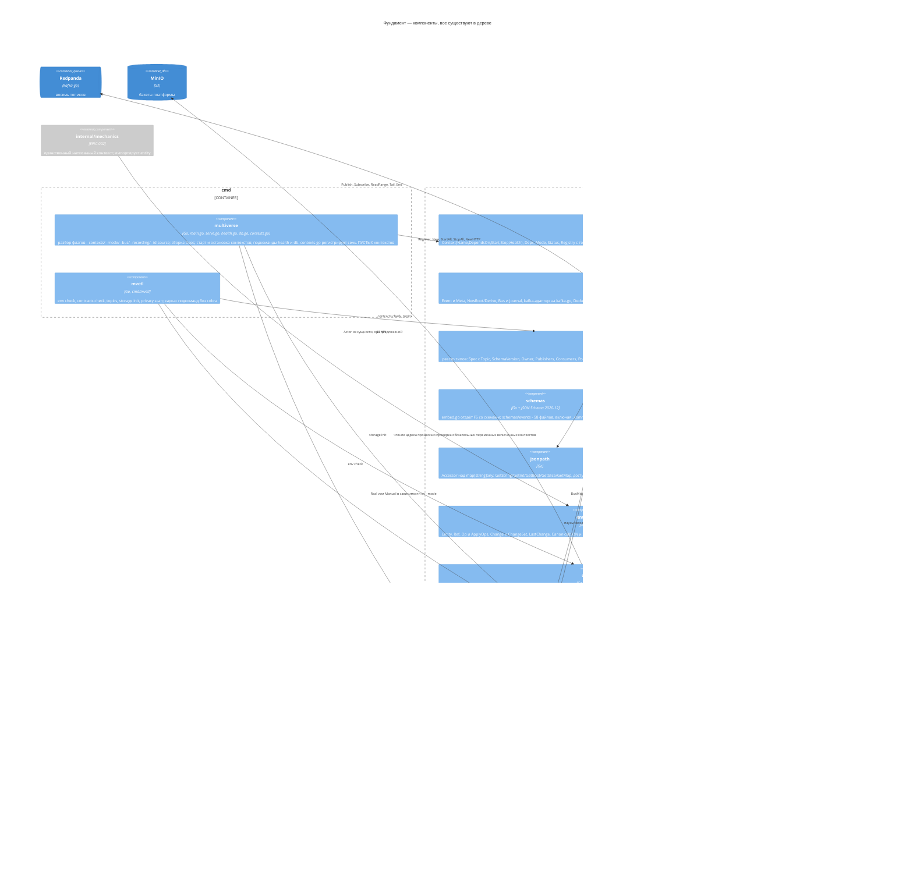

# C4 уровень 3 — фундамент (EPIC-001)

**Вопрос читателя: из чего собран каркас, который используют все остальные блоки, и что из него уже написано?**

Дата: 2026-09-11 · system-architect#1
Иллюстрирует: [`../components/foundation.md`](../components/foundation.md), [`../contracts.md`](../contracts.md) C-01 (конверт, реестр, шина и журнал), ADR-001 (один модуль, контексты — параметр деплоя), ADR-007 (формат события), ADR-021 (объектное хранилище).
Проверено по дереву: все файлы `shared/{eventbus,contracts,jsonpath,entity,objstore,env,logging,clock,runtime,testkit}`, `schemas/embed.go`, `cmd/multiverse/*`, `cmd/mvctl/*`.

Это единственный блок, который на дату ревизии написан целиком: диаграмма ниже — снимок дерева, а не намерения.

## Что здесь будущее

Ничего из нарисованного — все компоненты существуют. Будущее в фундаменте — только то, чего на диаграмме нет:

- **Наполнение семи контекстов.** `cmd/multiverse/contexts.go` регистрирует `state, laws, mechanics, llm, swarm, gateway, memory` как `stub{}`: `Start` ничего не делает, `Health` всегда `ok`. Владельцы заменяют регистрацию в своих ветках.
- **Хук `MV_SWARM_FAKE`.** `contracts.md` §0 и ADR-001 дополнение п. 8 описывают файл `cmd/multiverse/fake_contexts.go`, монтирующий двойников роя в `core`. Файла в дереве нет; двойники работают только в тестах на `membus`.
- **Переезд `membus` в `shared/eventbus/membus`** (C-01 v1.4, ADR-001 доп. 2026-09-11). До него `cmd/multiverse/bus_memory.go` импортирует `shared/testkit` по узкому временному исключению линтера (один файл, пакет `…/testkit/membus$`). В индексе на 2026-09-11 это единственный такой импорт; хук T-255 (`fake_contexts.go`, в работе) добавит второй, и после переезда он останется единственным. После переезда компонент `testkit` на диаграмме теряет `membus`, а `eventbus` его получает.
- **Подкоманды `multiverse db backup|check`** возвращают «в этот процесс не вкомпилирована ни одна база» до появления `internal/gateway`.

## Расхождения с деревом

**Сверка T-409 (2026-09-11, architect#1).** «Закрыто» — документ приведён к дереву; «код» — прав контракт, названа задача; «открыто» — оставлено намеренно.

| # | Статус | Что сделано |
|---|---|---|
| 1 | закрыто (хвост закрыт T-410; сверка T-416) | C-01 v1.3 и `foundation.md` §3: `Deps{Bus, Journal, Contracts, Clock, Timers, Mode, IDs, Log, Mux}`, без `Store` и `Env` — прав код (решение оркестратора). Комментарий над `Deps` в `shared/runtime/runtime.go` исправлен в T-410 |
| 2 | закрыто (T-410; сверка T-416) | `serve.go` заполняет все поля `Deps`: `Bus` и `Journal` — один транспорт по `MV_BUS`/`--bus`, `Contracts` — `contracts.Default()`, транспорт закрывает процесс после остановки последнего контекста (C-01 v1.3a). Остались два пробела процесса, оба названы в C-01 v1.4: глобальные источники конструкторов не ставятся (T-055) и шина в replay получает ручные таймеры (T-060) |
| 3 | закрыто | `state-and-mechanics.md` §2: раскладка `shared/entity` по дереву — `Ref`/`LastChange` в `entity.go`, `Change`/`ChangeSet` в `ops.go`, `path.go` назван |
| 4 | закрыто | подкоманда отчёта — `mvctl report` во всех документах области T-409 (`overview.md`, `infrastructure.md`, `components/*.md`, C-10, `analysis/*.md`); `c4-container.md` поправлен. Хвост закрыт T-416: `plan/epics.md` и `design.md` эпиков приведены; в `tasks.md` эпиков и в `plan/{roadmap,teams,decomposition-review}.md` старое имя осталось — это область тимлида и PM, список правок — в отчёте T-416 |
| 5 | закрыто | `contracts.md` §0: легаси-типы названы; `foundation.md` §6 описывал их и раньше |

Формулировки, записанные при рисовании (до сверки):

1. **`runtime.Deps` не содержит `Store` и `Env`.** C-01 v1.1 перечисляет `Deps{Bus, Journal, Store, Clock, Timers, Mode, IDs, Log, Env, Contracts}`; в коде поля: `Bus, Journal, Contracts, Clock, Timers, Mode, IDs, Log, Mux`. Комментарий в `runtime.go` обещает `Store` и `Env` «в F-5 (T-007)», но T-007 закрыт, а полей нет: контексты будут читать окружение напрямую через `shared/env`, а объектное хранилище создавать сами. Поле `Mux`, наоборот, есть в коде и отсутствует в контракте. Это несовместимое расхождение Go-контракта: правится либо C-01, либо `Deps` — решение за системным архитектором, пока первый контекст его не потребовал.
2. **`serve.go` не строит ни шину, ни журнал, ни реестр**: `Deps` собирается с `Mode`, `IDs`, `Log`, `Clock`, `Timers`, `Mux`. Флаг `--bus=kafka|memory` разбирается и проверяется, но нигде не используется — пустым контекстам шина не нужна. Первый настоящий контекст обнаружит, что подключение шины к `Deps` ещё никто не написал.
3. **`shared/entity` не имеет файлов `ref.go` и `change.go`**, которые перечисляет `components/state-and-mechanics.md` §2: `Ref` и `LastChange` живут в `entity.go`, `Change` и `ChangeSet` — в `ops.go`, плюс есть незадокументированный `path.go`. Расхождение косметическое, но карта файлов в документе уже не годится как навигация.
4. **Имена будущих команд CLI уже заняты, и одно из них не то.** `cmd/mvctl/main.go` держит места под `world`, `blueprint`, `laws`, `record`, `golden`, `llm`, `memory`, `report`, `trace` — занятое имя дешевле, чем спор двух команд на слиянии. Но контракты и план говорят `mvctl session-report`, а зарезервировано `report`: либо документы правятся до реализации, либо владелец EPIC-005 обнаружит расхождение уже в задаче. *(Запись до сверки; имя заменено: `mvctl session-report` → `mvctl report`, закрыто строкой 4 таблицы выше, см. T-409/T-416.)*
5. **Реестр несёт восемь легаси-типов** (`player.moved`, `gm.*`, `narrative.generate`, `violation.detected`) с пометкой `Deprecated` и источником `legacy`, которых нет ни в `contracts.md` §0, ни среди файлов `schemas/events/`.
