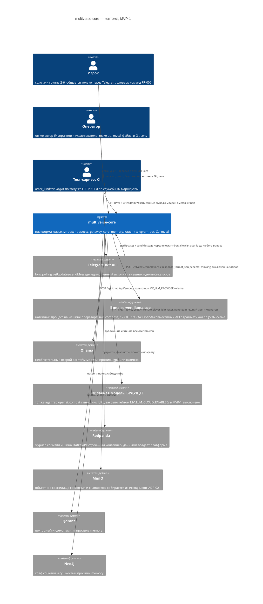

# C4 уровень 1 — контекст

**Вопрос читателя: кто пользуется системой, с чем она разговаривает снаружи и где проходит её внешняя граница?**

Дата: 2026-09-11 · system-architect#1
Иллюстрирует: [`../overview.md`](../overview.md) §12 (контекст to-be), ADR-005 дополнение 2 (нативный llama-server), ADR-009 (граница персональных данных).
Проверено по дереву: `docker-compose.yml`, `docker-compose.bot.yml`, `docker-compose.legacy.yml`, `build/versions.env`, `cmd/`, `scripts/llm-server.ps1`.

## Что здесь будущее

- **Игрок и Telegram.** Бинарника `cmd/telegram-bot` в дереве нет; `docker-compose.bot.yml` уже описывает сервис с `entrypoint: ["/telegram-bot"]` и ждёт, когда файл появится (EPIC-004). Сегодня по этой стрелке не проходит ничего.
- **Облачная модель.** Провайдера `anthropic` нет, `openai_compat` с внешним адресом закрыт гейтом; строка в реестре есть, кода нет (E-H).
- **Qdrant и Neo4j.** Контейнеры поднимаются профилем `memory` и здоровы, но контекст `memory` — пустая заглушка: клиента ни к одному из них в дереве нет.

## Расхождения с деревом

1. `overview.md` §12 показывает Ollama как основной рантайм модели рядом с `System_Ext(ollama, "Ollama (Qwen3)")`. По U-8 и ADR-005 дополнение 2 основной рантайм — **нативный llama-server вне compose**, а Ollama второй; `docker-compose.yml` это уже отражает (сервиса `llama-server` нет вовсе, есть `extra_hosts: host.docker.internal`), а §12 — ещё нет.
2. `overview.md` §12 называет актором «Тест-харнесс CI» с доступом к «HTTP v1 + служебные эндпоинты». Служебные маршруты `/v1/admin/*` в дереве отсутствуют: `shared/runtime` умеет монтировать `Routes(mux)`, но ни один контекст их не монтирует, потому что контекстов нет.
3. Внешних систем, кроме перечисленных, у платформы нет — в частности, нет GitHub Actions как внешней системы контекста: workflow'ы это часть репозитория, а не собеседник рантайма. В `overview.md` §2 (as-is) GitHub Actions нарисован как внешняя система; в целевом контексте его быть не должно.
