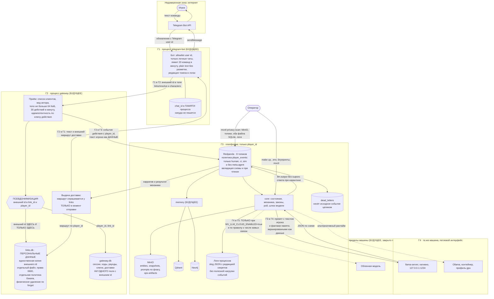

# Потоки данных и границы доверия

**Вопрос читателя: где данные пересекают границу процесса, где они уходят наружу к модели, где лежат персональные данные и где стоит псевдонимизация?**

Дата: 2026-09-11 · system-architect#1
Иллюстрирует: [`../threat-model.md`](../threat-model.md), ADR-009 (приватность по построению), ADR-019 (два файла SQLite), [`../contracts.md`](../contracts.md) C-01 (политики топиков), C-08 (лимиты и коды), C-09 (экранирование фактов памяти), C-15 (гейт облака).
Проверено по дереву: `docker-compose.yml` (публикация портов только на loopback), `shared/env/vars.go`, `shared/logging/logging.go` (редакция), `shared/objstore/buckets.go`, `scripts/compose-lint.sh`, `cmd/mvctl/internal/privacy/`.

Границы пронумерованы: **Г1** — процесс бота, **Г2** — процесс шлюза, **Г3** — платформа и её хранилища, **Г4** — рантайм модели на той же машине, **Г5** — за пределы машины. Пересечение границы — место, где стоит проверка.

## Что проверяется на каждом пересечении

| Пересечение | Что проходит | Проверка |
|---|---|---|
| интернет → Г1 | Telegram user id, текст | allowlist идентификаторов **до** любого вызова шлюза, только личные чаты, лимит команд |
| Г1 → Г2 | внешний идентификатор, имя персонажа, команда | заголовок клиента из списка, вид актора, лимит тела, лимит частоты, идемпотентность |
| внутри Г2 | внешний идентификатор | псевдонимизация: дальше живут только `link_id` и `player_id` |
| Г2 → Г3 | событие действия | политика топика: `player_events` только с видом актора `human`, `ci`, `sim` и без ссылки на агента; валидация схемы при публикации **и** при чтении |
| Г3 → Г4 | промпт с текстом игрока и фактами памяти | экранирование текста игрока и фактов слоя `generated` как данных, ограничение длины, абсолютные пределы в промпте |
| Г4 → Г3 | ответ модели | восстановление JSON, проверка по схеме, проверка языка, фильтр категории «а» с отказом в пользу блокировки, страж |
| Г4 → Г5 | текст игрока уходит с машины | гейт `MV_LLM_CLOUD_ENABLED`, отдельное правило про внешних игроков, флаг облака виден игроку через `GET /v1/worlds`, имя провайдера и ключи наружу не отдаются |
| Г2 → Г1 | доставка | внешний маршрут запрашивается только в момент выдачи и не сохраняется |

## Где персональные данные и что с ними можно

Ровно два места: **память процесса бота** (`chat_id`, не пишется никуда) и **`links.db`** (внешний идентификатор и таблица идемпотентности создания персонажа). Всё остальное — шина, объектное хранилище, векторный индекс, граф, `gateway.db`, логи, записи для золотого набора — знает только `player_id`. Удаление по `/forget` физическое, с немедленной фиксацией журнала и уплотнением файла; запись, попавшая в бэкап, живёт по отдельной политике оператора.

## Что здесь будущее

- **Г1 и Г2 целиком**: ни бота, ни шлюза, ни файлов SQLite, ни псевдонимизации — вся левая часть диаграммы это чертёж.
- **Г5**: облачного провайдера нет; есть только гейт в виде переменных окружения, объявленных в манифесте.
- **Память**: контекст `memory` пуст, Qdrant и Neo4j поднимаются без клиента.
- **Сканер утечек**: `cmd/mvctl/internal/privacy` в дереве есть и работает по дереву исходников и по файлам, но проверка живых хранилищ (топики, бакеты, оба файла SQLite) — часть теста NFR-041, которого нет.

## Расхождения с деревом

1. **`dead_letters` — дыра в псевдонимизации, о которой контракт молчит.** Обёртка `DeadLetter` несёт исходное событие **целиком**, включая текст игрока, и ограничивает только размер нечитаемого тела. Это правильно для разбора инцидента, но означает, что топик разбора живёт по тем же правилам приватности, что и доменные, — а `contracts.md` его в перечислении политик не упоминает.
2. **Флаг хранения промптов в модели угроз назван без префикса.** `threat-model.md` (T-23, SEC-22, §11) трижды пишет `LLM_STORE_PROMPTS`, тогда как манифест и compose знают `MV_LLM_STORE_PROMPTS`. Правило «платформенные переменные — с префиксом `MV_`» принято в C-01 и реализовано; читатель модели угроз, ищущий переменную по имени, её не найдёт. Само правило хранения (срок 30 дней, versioning выключен, бакет вне бэкапа) в коде исполнено таблицей `shared/objstore/buckets.go`, общей для платформы и init-контейнера.
3. **Логи бота ротируются по объёму, а не по времени** (10 МБ × 3 против 50 МБ × 5 у платформы) — решение принято в сведении с devops. На диаграмме логи бота не показаны отдельно, но при разборе утечки искать их надо в другом месте и с другим горизонтом.
4. **Проверка «все порты только на loopback» держится линтером композиции, а не рантаймом.** `scripts/compose-lint.sh` отвергает публикацию без `127.0.0.1`, но это статическая проверка файлов: локальный `docker-compose.override.yml`, которым README предлагает добираться до консолей, из-под неё выходит.
