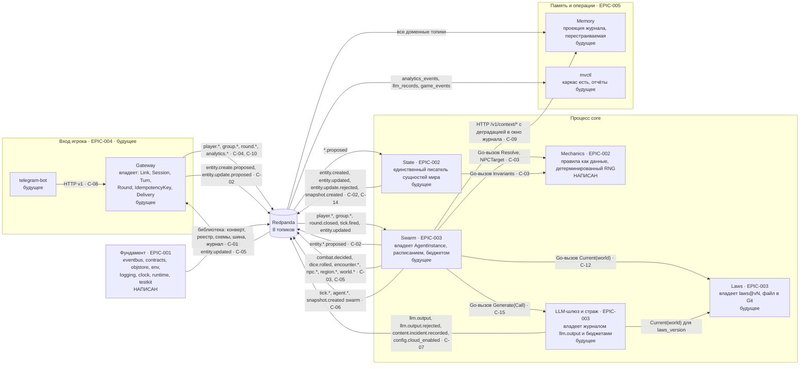

# Карта ограниченных контекстов

**Вопрос читателя: где живёт функциональность, кто чем владеет и что ходит между блоками через шину?**

Дата: 2026-09-11 · system-architect#1
Иллюстрирует: [`../overview.md`](../overview.md) §11, [`../contracts.md`](../contracts.md) §0 (границы и владение) и §1–§15 (контракты C-01…C-15).
Проверено по дереву: `shared/contracts/{registry.go,sources.go,ownership.go}`, `shared/eventbus/topics.go`, `schemas/events/*.json` (55 файлов), `internal/`, `shared/testkit/*`.

Направление стрелок — направление зависимости; циклов нет. Подпись на ребре — типы событий, а не топик: топик выбирает реестр по типу (`contracts.Lookup`), издатель топик не называет.

## Что ходит по каждому топику (по реестру, а не по прозе)

| Топик | Типы | Владелец типов |
|---|---|---|
| `player_events` | `player.entered_region/left_region/looked/attacked/flee_attempted/rested/said/defended`, `group.entered_region/left_region` | EPIC-004 |
| `game_events` | `group.created/joined/left/leader_changed/disbanded`, `round.opened/closed`, `combat.decided`, `dice.rolled` | EPIC-004 (группа, раунд), EPIC-003 (`combat.decided`), EPIC-002 (`dice.rolled`) |
| `world_events` | `encounter.started/ended`, `world.weather_changed/time_advanced/event_occurred`, `region.event_occurred`, `npc.moved/spawned`, `world.laws.changed`, `world.law_breach.*` (зарезервированы) | EPIC-003 |
| `system_events` | `entity.create.proposed`, `entity.update.proposed`, `entity.created`, `entity.updated`, `entity.update.rejected`, `snapshot.created`, `tick.fired/aborted`, `agent.*`, `content.incident.recorded`, `config.cloud_enabled` | EPIC-002 (сущности, снапшот), EPIC-003 (тики, агенты, инцидент, флаг облака) |
| `narrative_output` | `narrative.output` | EPIC-003 |
| `llm_records` | `llm.output`, `llm.output.rejected` | EPIC-003 |
| `analytics_events` | `analytics.session.started/ended`, `analytics.turn.completed`, `analytics.replay.completed`, `analytics.consistency.violated` | EPIC-004, EPIC-002, EPIC-005 |
| `dead_letters` | обёртка над всем, что не удалось обработать; издатель — сама библиотека, `source = core/bus` | EPIC-001 |

## Правила границ, которые эта карта закрепляет

1. **Публиковать тип может только тот, кто перечислен в `Spec.Publishers`** реестра; владелец типа — владелец схемы и семантики, а не единственный издатель (`contracts.md` §0 v0.4). Читать может любой блок любой топик.
2. **Между контекстами — только шина**, даже внутри одного процесса. Исключение — библиотечные вызовы без состояния «внутрь»: `Swarm → Mechanics`, `Swarm → Laws`, `Swarm → LLM`, `State → Mechanics`. Они на карте нарисованы как «Go-вызов» и проверяются `depguard`.
3. **Единственный писатель.** Любое изменение сущности проходит через State: предложение → факт. Ни gateway, ни агент не пишут в объектное хранилище мира.
4. **Персональные данные не пересекают границу gateway.** Внутри всей карты ходит только `player_id`.

## Что здесь будущее

Из восьми блоков карты в дереве написаны два: **фундамент** (`shared/*`, `cmd/multiverse`, реестр и схемы) и **механика** (`internal/mechanics`). Остальные шесть — пустые контексты. Играбельный срез сегодня собирается из двойников:

| Роль на карте | Кто её играет сегодня |
|---|---|
| Gateway (издатель `player.*`) | `shared/testkit/gateway.Harness` |
| State (применение предложений) | `shared/testkit/state.FakeState` |
| Swarm, роль встречи (Phase 1) | `shared/testkit/swarm.FakeEncounter` |
| Swarm, роль нарратора (Phase 2) | `shared/testkit/swarm.FakeNarrator` |
| Mechanics для тех, кому нужен фиксированный исход | `shared/testkit/mechanics.FixedMechanics` |

Двойникам разрешено публиковать типы подменяемого контракта только на `membus` и в `core` при `MV_SWARM_FAKE=true`; их `Source` — `testkit/*`, и реестр это проверяет.

## Расхождения с деревом

**Сверка T-409 (2026-09-11, architect#1).** «Закрыто» — документ приведён к дереву; «код» — прав контракт, названа задача; «открыто» — оставлено намеренно.

| # | Статус | Что сделано |
|---|---|---|
| 1 | закрыто, хвост в коде | **ADR-025**: единственная истина таблицы владения — существующий `shared/contracts/ownership.go`; копии и теста равенства нет; C-02 v1.4, `contracts.md` §16 п. 6, ADR-015 п. 4, `api-contracts.md`, `foundation.md` §6, `state-and-mechanics.md`, `swarm-llm-laws.md` §2 и §5.4. Хвост: комментарии `ownership.go`/`ownership_test.go` ещё называют истиной `levels.go` (правка кода, метка `contract-change`), T-202 переформулировать (tech-lead EPIC-003) |
| 2 | закрыто | `swarm-llm-laws.md` (шапка и §2) и `contracts.md` §0 прямо называют as-is содержимое `shared/agent` и то, что целевых файлов нет; переписывание — EPIC-003 T-201/T-202. Сам каталог остаётся as-is до этих задач — это план, а не расхождение документа |
| 3 | закрыто | `contracts.md` §0: абзац о восьми легаси-типах реестра (`Deprecated`, издатель `legacy`, без файла схемы, уходят на S5) |
| 4 | закрыто | `contracts.md` §0: колонки «Пакеты» и «Файлы-данные» объявлены целевыми, названо, что есть в дереве; шапка `swarm-llm-laws.md` перечисляет недостающие каталоги |

Формулировки, записанные при рисовании (до сверки):

1. **`shared/agent/levels.go` не существует.** `contracts.md` §16 п. 6 называет его единственной истиной таблицы владения и требует блокирующего теста равенства с копией `shared/contracts/ownership.go`. Копия в дереве есть и работает, истины нет, теста равенства нет — сравнивать не с чем. До появления `levels.go` (EPIC-003) фактической истиной является копия, что прямо запрещено процедурой.
2. **`shared/agent` — это ещё as-is Agent GM Core.** В каталоге лежат `router.go`, `lifecycle.go`, `pipeline.go`, `worker_pool.go`, `state_manager.go`, `md_parser.go`, `blueprint_loader.go`, `helpers.go`, `interfaces.go` — файлы, которые `components/swarm-llm-laws.md` §2 объявляет удаляемыми, и нет ни одного из файлов, которые тот же §2 объявляет целевыми (`types.go`, `blueprint.go`, `parser.go`, `validator.go`, `levels.go`, `placeholders.go`). На карте `shared/agent` поэтому не показан как часть контекста Swarm: сегодня это не типы роя, а вторая, неподключённая архитектура GM.
3. **Реестр знает больше типов, чем таблица `contracts.md` §0.** В `shared/contracts/registry.go` есть блок `legacyEvent(...)`: `player.moved`, `player.used_skill`, `gm.created/deleted/merged/split`, `narrative.generate`, `violation.detected` — помечены `Deprecated`, издатель и потребитель `legacy`. Это цена профиля `legacy`; в §0 таких строк нет. Типы уйдут вместе с профилем на вехе S5.
4. **Каталогов `blueprints/`, `laws/`, `config/`, `schemas/agent/`, `api/` в дереве нет**, хотя на них ссылаются C-06, C-08, C-09, C-11, C-12 и таблица владения. Существуют только `rules/dark-forest.yaml` и `schemas/events/`.
