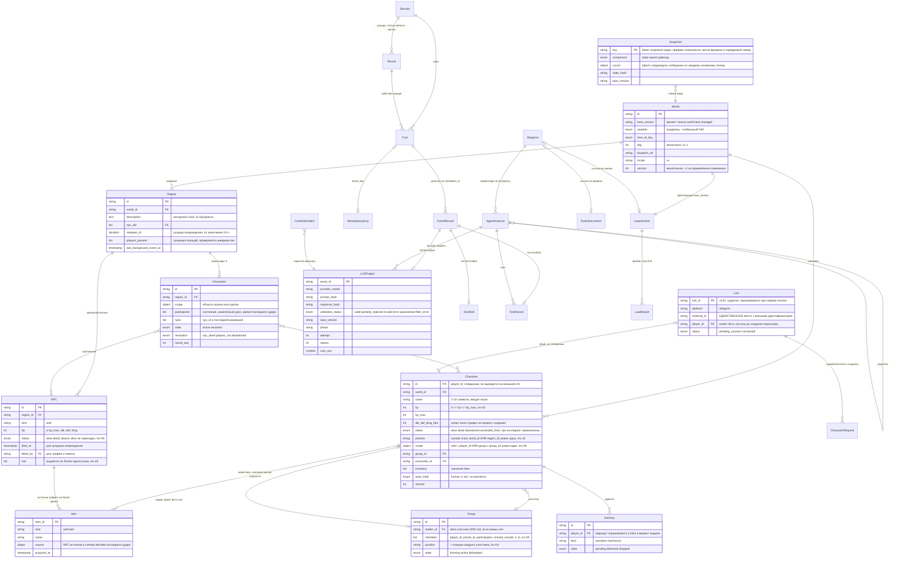

# Сущности мира и их связи

**Вопрос читателя: какие сущности есть в мире, кто ими владеет и как они связаны?**

Дата: 2026-09-11 · system-architect#1
Иллюстрирует: [`../../analysis/data-model.md`](../../analysis/data-model.md) §2–§7, [`../contracts.md`](../contracts.md) C-02 (владение и версии), C-14 (снапшоты).
Проверено по дереву: `shared/entity/{entity.go,types.go,attrs.go,ops.go}`, `testdata/fixtures/{world,region,npc,players}.json`, `schemas/events/entity.*.json`, `rules/dark-forest.yaml`.

Диаграмма разделена на три класса данных, потому что они живут в разных хранилищах и по разным правилам: **состояние мира** (объект на сущность в MinIO, единственный писатель — State), **приватные и служебные данные шлюза** (два файла SQLite, наружу не выходят) и **журнал** (append-only в Redpanda, не сущности, а записи).

## Правила, без которых схема читается неверно

1. **Версия — часть контракта, а не служебное поле.** `version` растёт строго на единицу на сущность при непустом наборе изменений; при пустом наборе факт публикуется, а версия не меняется — ход засчитан, движения не было.
2. **Один набор изменений на сущность в одном предложении.** Пакет, называющий сущность дважды, отвергается целиком (`invalid_op`, C-02 v1.3). Схемой это невыразимо — правило обязана соблюдать каждая реализация State.
3. **`Item` — значение внутри `Character.inventory`, а не сущность.** Отдельной сущностью он станет в целевом состоянии; связь «NPC — источник трофея» существует только через `Item.source` и именно ею доказывается единственность трофея.
4. **`Link` ↔ `Character` — единственный мост между внешним миром и псевдонимом**, и он односторонний: у персонажа нет поля со ссылкой на связку.

## Что здесь будущее

- **`LawBreach`** — контракт зарезервирован, издателя нет, фаза пробоя выключена флагом; механика — эпик E-B.
- **`Blueprint`, `AgentInstance`, `RulesDocument` в части блупринтов** — каталогов `blueprints/` и `laws/` в дереве нет; существует только `rules/dark-forest.yaml`.
- **Весь средний блок (`Link`, `CharacterRequest`, `Session`, `Turn`, `Round`, `IdempotencyKey`, `Delivery`)** — ни файлов SQLite, ни миграций.
- **`Snapshot`** — формат описан контрактом и реализован в двойнике (`testkit/state/snapshot.go`), настоящего писателя нет.

## Расхождения с деревом

**Сверка T-409 (2026-09-11, architect#1).** «Закрыто» — документ приведён к дереву; «снято» — расхождения нет; «открыто» — оставлено намеренно.

| # | Статус | Что сделано |
|---|---|---|
| 1 | открыто | не расхождение документа: `data-model.md` описывает модель, фикстуры — стартовое состояние стенда. Нужны ли фикстуры группы и встречи, решает EPIC-002 при `mvctl world init` (T-058) |
| 2 | закрыто | `data-model.md` §2, абзац «Как читать схему»: атрибуты — содержимое карты `Attributes` с геттерами `shared/entity/attrs.go`; опечатка в пути — `invalid_op` в рантайме |
| 3 | закрыто | `data-model.md`: в тексте только целевые имена State и gateway; строка соответствия as-is → целевое оставлена в шапке |
| 4 | снято | `data-model.md` §3.3 и §9.1 называют `ascended_final` резервом E-C; §3.3 теперь указывает функции `shared/entity` |
| 5 | закрыто | `data-model.md` §2: `Scope` → `ScopeRef`, прямо сказано «значение, не сущность» |

Формулировки, записанные при рисовании (до сверки):

1. **Фикстуры описывают меньше, чем модель.** `testdata/fixtures/` содержит `world.json`, `region.json`, `npc.json`, `players.json` и `snapshots/` — сущностей `group` и `encounter` в фикстурах нет; встречу создаёт на лету двойник встречи. Стартовое состояние мира, из которого поднимается стенд, беднее ER-диаграммы.
2. **Атрибуты живут не в полях структуры, а в карте `Attributes`.** `shared/entity.Entity` хранит доменные атрибуты как `map[string]any` с типизированными геттерами (`HP()`, `Status()`, `Position()`, `Scope()`, `Members()`); ER-таблицы `data-model.md` §3 читаются как описание полей структуры Go, а это описание содержимого карты. Практическое следствие: опечатка в пути операции — не ошибка компиляции, а `invalid_op` в рантайме.
3. **`data-model.md` §2 всё ещё называет писателем состояния `entity-manager`, а шлюзом — `game-service`** (as-is имена сервисов). Оба вынесены: `entity-manager` переписывается в `internal/state`, `game-service` — в `internal/gateway`, и ни того, ни другого в дереве целевого кода нет.
4. **`Character.status = ascended_final` объявлен, но недостижим.** `shared/entity/types.go` знает его и включает в `TerminalStatuses`, `CanTransition` его допускает, а перехода в него в MVP-1 нет ни у кого: это резерв под эпик E-C. На диаграмме оставлен, потому что от него зависит формулировка «три терминальных статуса отвечают одинаково» в C-02 и C-03 — и именно она уже реализована в `Actor.Alive()`.
5. **Область (`scope`) на диаграмме — атрибут персонажа, а не сущность**, хотя `data-model.md` §2 рисует `Scope ||--o{ Session`. Отдельной сущности `scope` в реестре типов нет: в конверте события это `ScopeRef` рядом с `world`, в состоянии — атрибут. Диаграмма следует коду.
