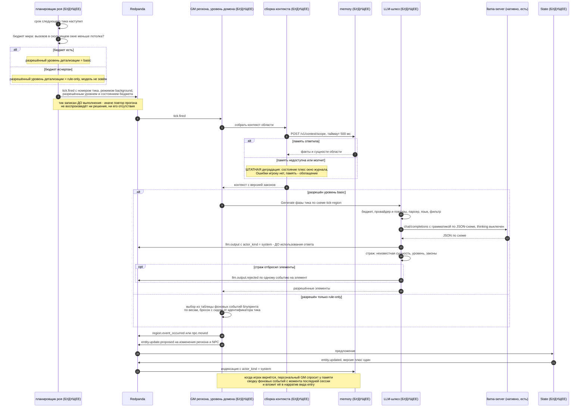

# Сценарий: фоновый тик GM региона без игроков

**Вопрос читателя: как мир живёт, когда игрока в нём нет, и что удерживает эту жизнь в рамках бюджета?**

Дата: 2026-09-11 · system-architect#1
Иллюстрирует: [`../overview.md`](../overview.md) §17.3, UC-019 и UC-024 из [`../../analysis/use-cases.md`](../../analysis/use-cases.md), [`../contracts.md`](../contracts.md) C-06 (тики), C-07 (записи модели), C-09 (память и деградация), C-11 (блупринт), ADR-014 (две очереди и бюджет), ADR-005 (порядок побочных эффектов шлюза).
Проверено по дереву: `shared/contracts/registry.go` (типы `tick.fired`, `tick.aborted`, `region.event_occurred`, `npc.moved`, `npc.spawned`), `schemas/events/tick.fired.v1.json`, `internal/` (каталогов `swarm`, `llm` нет).

**Почему выбран этот сценарий.** Он единственный отвечает на вопрос «чем эта система отличается от чат-бота»: здесь мир меняется без игрока. И он единственный, где сходятся расписание, бюджет модели, уровень детализации и штатная деградация — четыре механизма, которые в остальных сценариях не видны. Ошибка в этой диаграмме стоит дороже прочих: неверный порядок «тик записан — тик выполнен» ломает воспроизводимость всего прогона.

## Правила, которые эта диаграмма закрепляет

1. **Уровень детализации решает планировщик, а не агент.** Поле разрешённого уровня в `tick.fired` обязательно: агент его не пересчитывает. Иначе один и тот же тик в повторе мог бы пойти по другой ветке.
2. **Ход игрока всегда впереди тика.** В рантайме роя две очереди — интерактивная и фоновая; воркер фона уступает. На диаграмме этого не видно, потому что игрока в сценарии нет, — но именно поэтому фон и разрешён.
3. **Пропущенные тики не догоняются пачкой.** После простоя выполняется один тик, а не столько, сколько сроков прошло.
4. **Память — обогащение, а не зависимость.** Контекст агента по умолчанию строится из состояния и окна журнала; деградация здесь норма, а не исключение. Стек стартует и играет без Qdrant и Neo4j.
5. **`actor_kind = system`** отличает фоновую жизнь от действий игрока во всех отчётах и в индексе памяти.

## Что здесь будущее

Всё, кроме шины, реестра типов, схем и нативного llama-server. Конкретно отсутствуют: планировщик, бюджет, роли агентов, сборка контекста, шлюз модели, клиент памяти, State. Нет и данных: `blueprints/domain-dark-forest.md` (таблица фоновых событий, веса, потолок вызовов), `schemas/agent/tick-region.json`, `laws/dark-forest-world.v1.yaml`.

Типы `tick.fired`, `tick.aborted`, `region.event_occurred`, `npc.moved`, `npc.spawned`, `llm.output`, `llm.output.rejected` в реестре есть и схемы имеют — контракт к реализации готов.

## Расхождения с деревом

1. **Пример блупринта региона живёт в архиве, а не в `blueprints/`.** Единственный файл такого рода в дереве — `services/_archive/shared/agent/`, и он был написан под старый формат парсера. Каталога `blueprints/`, на который ссылается C-11 и вся эта диаграмма, нет.
2. **`overview.md` §17.3 показывает вызов модели `qwen3:8b` на тик**, то есть вторую модель. По решению U-8 базовая конфигурация — одна модель на нарратив и на тики, а вторая появляется только в конфигурации `E+` и только по результатам замера. Модель на фазу задаёт блупринт, поэтому смена конфигурации — правка YAML, но диаграмма в `overview.md` называет конкретную модель как данность.
3. **`ops/metrics/baseline.md` есть, а замера в нём нет.** Файл создан, матрица конфигураций описана в `ops/metrics/bench-matrix.json`, но выбор конфигурации моделей (E, C или A) в дереве не зафиксирован — значит, «разрешённый уровень детализации» и потолок вызовов сегодня не имеют числовых оснований.
