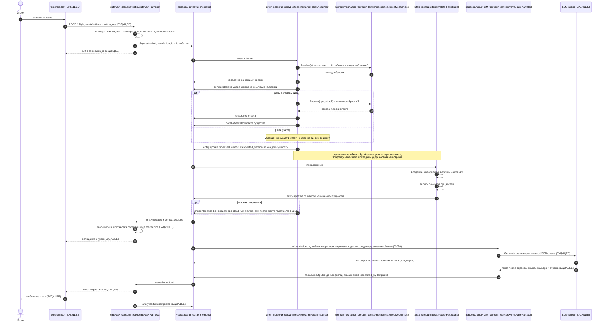

# Сценарий: удар в соло-бою

**Вопрос читателя: что происходит между командой игрока «атаковать» и текстом в чате, и в каком порядке это записывается в журнал?**

Дата: 2026-09-11 · system-architect#1
Иллюстрирует: [`../overview.md`](../overview.md) §17.1, UC-006/UC-007/UC-008, [`../contracts.md`](../contracts.md) C-04 (действие), C-03 (механика и броски), C-02 (предложение и факт), C-05 (нарратив), C-07 (запись вывода модели), ADR-003 (запись до использования), ADR-013 (версии и атомарные пакеты).
Проверено по дереву: `shared/testkit/gateway/{harness.go,scenario.go}`, `shared/testkit/swarm/{fake_encounter.go,fake_narrator.go}` (до T-220 — `narrator.go`; сверка T-416), `shared/testkit/state/{state.go,apply.go}`, `internal/mechanics/*`.

Подписи участников говорят, что стоит за ролью **сегодня**. Шаги, которых сегодня не происходит, отмечены в диаграмме словом `БУДУЩЕЕ` и разобраны под ней.

## Почему порядок именно такой

1. **Броски публикуются до решения.** `dice.rolled` — недетерминированный источник, и по ADR-003 он записывается **до** того, как на него опираются: в replay бросок читается, а не бросается. `combat.decided` ссылается на события бросков по идентификатору.
2. **Индексы бросков фиксированы, а не считаются.** Удар игрока занимает индексы 0 и 1, ответ существа — 2 и 3, побег — 0. Индекс урона тратится, даже если удар прошёл мимо: иначе повтор того же события действия дал бы другой ответ существа. Половина сида — это индекс, вторая — идентификатор события действия.
3. **Один обмен — один атомарный пакет.** Иначе хиты игрока и существа применились бы разными транзакциями, и промежуточное состояние стало бы видимым. Правило «одна сущность — один набор изменений» (C-02 v1.3) означает, что hp, статус и трофей одной сущности едут вместе.
4. **Факт после записи, не до.** State публикует `entity.updated` только после успешной записи объекта: истина — снапшот.
5. **Нарратив вторичен.** Механика уже разрешена и доставлена, когда фаза нарратива только начинается. Недоступность модели даёт `generated_by=template`, а не отказ в ходе.

## Что здесь будущее

| Шаг | Чего нет |
|---|---|
| HTTP и `202` | нет ни бота, ни `internal/gateway`: харнесс публикует событие действия напрямую в шину, без сессии, идемпотентности и ключа действия |
| `Resolve` | `internal/mechanics.Resolve` возвращает `ErrNotImplemented`; исход даёт табличный двойник |
| запись состояния | двойник State держит сущности в памяти и не пишет в объектное хранилище |
| доставка | нет outbox, нет read-model, нет доставок |
| **нарратив через модель** | с T-220 двойник нарратора отвечает на все шесть поводов C-05: соло-удар даёт `turn`, смерть — `death`, начало встречи — `world_event`, всё шаблоном (`generated_by=template`). Фазы нарратива через LLM, стража и фильтра пока нет. Правило «смерть после текста удара» (C-05 v1.4 п. 8) — для настоящего GM; у двойника инверсия возможна при отставании чтения `game_events` |
| `llm.output`, страж, фильтр | каталога `internal/llm` нет |
| `analytics.turn.completed` | нет контекста gateway |

## Расхождения с деревом

**Сверка T-409 (2026-09-11, architect#1).** «Закрыто» — документ приведён к дереву; «код» — прав контракт, названа задача.

| # | Статус | Что сделано |
|---|---|---|
| 1 | закрыто, хвост в коде | `overview.md` §17: абзац «Это целевые потоки, а не снимок дерева» — `Resolve` ещё `ErrNotImplemented` (T-053). Нарратив на удар есть с T-220: двойник нарратора закрывает ход по последнему решению обмена и публикует `turn` шаблоном (сверка T-416) |
| 2 | закрыто | `overview.md` §17.1: в пакете — сущность встречи, факты по каждой изменённой сущности; правило записано в C-05 v1.3 п. 2 |
| 3 | закрыто | C-03, абзац «Отдых — действие механики, а не боя»: два множества названы, отказ схемы — правило |
| 4 | закрыто | C-05 v1.3 п. 1: повтор при конфликте версий под тем же `proposal_id` с уточнениями 1а–1в из ревью #2 T-219 и T-400; п. 1в в v1.4 переписан без противоречия (ADR-026) |
| 5 (новое, T-416) | код (задача «двойники по C-05 v1.4») | диаграмма рисует целевой порядок ADR-026: `encounter.ended` публикуется после факта закрывающего пакета, а решения обмена — до пакета. Двойник встречи сегодня публикует конец сразу за пакетом, до факта; расхождение названо в C-05 v1.4 «Заглушка» |

Формулировки, записанные при рисовании (до сверки):

1. **`overview.md` §17.1 показывает `SW->>M: Resolve` как рабочий вызов** и рисует `narrative.output` как завершение хода. В дереве первый возвращает «не реализовано», а второй на этом пути не публикуется вовсе. Диаграмма выше сохраняет форму контракта, но помечает оба места.
2. **`overview.md` §17.1 не показывает сущность встречи в атомарном пакете.** По решению ревью T-219 (Critical-1) каждое принятое действие обязано положить в пакет набор изменений и для сущности встречи — иначе действие, которым никто не попал, не оставляет следа, и встреча выглядит незакрытой. Таблица владения это разрешает уровню задачи.
3. **`combat.decided` знает четыре вида действия, механика — пять.** У механики есть отдых, у схемы решения боя его нет: издатель, решивший опубликовать решение об отдыхе, получит отказ схемы. Ловушка закреплена невалидной фикстурой (T-214) — это не дефект, но читатель диаграммы должен знать, что «действие» в схеме и «действие» в C-03 — не одно множество.
4. **Остаточная гонка представления агента.** Двойник встречи отвечает по своему представлению о мире, которое пополняет фактами по отдельности; при конфликте версий он обязан обновить представление и предложить заново. Это правило пока живёт в журнале решений, а не в C-05 — запрос на дополнение контракта открыт.
