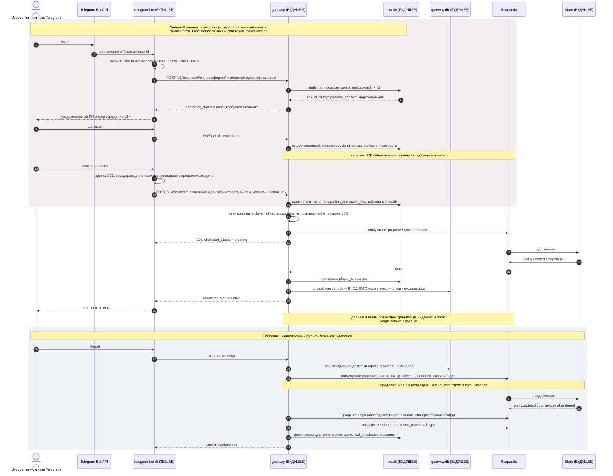

# Сценарий: первый контакт, согласие и создание персонажа

**Вопрос читателя: где внешний идентификатор игрока превращается в псевдоним, и что происходит, когда игрок просит себя забыть?**

Дата: 2026-09-11 · system-architect#1
Иллюстрирует: UC-001, UC-002, UC-031 из [`../../analysis/use-cases.md`](../../analysis/use-cases.md), [`../contracts.md`](../contracts.md) C-08 (HTTP API), C-02 v1.2 (переход в `abandoned`), C-04 v1.1 (каскад забвения), C-10 (аналитика), ADR-009 (приватность по построению), ADR-019 (два файла SQLite).
Проверено по дереву: `cmd/` и `internal/` — ни бота, ни шлюза нет; `docker-compose.bot.yml`; `shared/entity/types.go` (`TerminalStatuses`, `CanTransition`); `shared/contracts/ownership.go` (строка `gateway`).

**Почему выбран этот сценарий.** Это единственное место всей системы, где внешний идентификатор пересекает границу платформы, и единственное, где данные физически удаляются. Диаграмма потоков данных [`dfd.md`](dfd.md) опирается ровно на него: без него граница доверия — просто слово. Второе основание — здесь впервые появляется `player_id`, которым дальше оперируют все остальные диаграммы.

**Предупреждение читателю: ни один участник этой диаграммы, кроме шины и реестра типов, в дереве не существует.** Это чертёж, а не снимок. Он нарисован, потому что решает вопрос, который нельзя откладывать до кода: форму границы приватности.

## Правила, которые эта диаграмма закрепляет

0. **Согласие — не событие мира.** Между `/start` и созданием персонажа в шину не уходит ничего: связка живёт только в `links.db`. Сессия открывается первым игровым действием, а не согласием.
1. **Порядок в каскаде забвения обязателен**: сначала сброс доставок, потом предложение о статусе, потом события группы, потом закрытие сессии и только в конце — удаление связки. Иначе доставка успеет уйти в чат уже после того, как игрок попросил его забыть.
2. **`abandoned` — терминальный статус, и предлагать его вправе только шлюз.** Предложение от агента (`meta.agent` заполнен) State отвергает как нарушение уровня; над `dead` и `ascended_final` — как действие над терминальной сущностью. Нарратива о смерти при этом не порождается.
3. **Персонаж в статусе `creating`** — это состояние связки, а не сущности: между предложением и фактом сущности ещё нет. Если забвение придёт в этот промежуток, шлюз публикует то же предложение, когда факт создания наконец придёт.
4. **`link_id` — суррогат для идемпотентности.** Идемпотентность создания персонажа считается по `link_id`, а не по внешнему идентификатору, чтобы таблица идемпотентности не стала вторым местом хранения персональных данных.

## Что здесь будущее

Всё, кроме шины и реестра типов. Ни `cmd/telegram-bot`, ни `internal/gateway`, ни файлов `links.db` и `gateway.db`, ни миграций. Из событий диаграммы в реестре зарегистрированы и имеют схемы все: `entity.create.proposed`, `entity.created`, `entity.update.proposed`, `entity.updated`, `group.left`, `group.leader_changed`, `analytics.session.ended`. То есть контракт готов к реализации целиком.

## Расхождения с деревом

1. **Строка `gateway` в таблице владения уже есть, а проверять её некому.** `shared/contracts/ownership.go` разрешает проверяющему `gateway` менять у персонажа `position`, `scope`, `group_id`, `encounter_id`, `hp`, `status`, а у группы — всё. Реализации State, которая эту таблицу читает, в дереве нет; двойник `FakeState` инварианты и владение по умолчанию не проверяет вовсе (включаются `WithInvariants()`).
2. **Таблица владения — декартово произведение путей и причин, и этим шире прозы.** Строка `gateway` разрешает пути `position, scope, group_id, encounter_id, hp, status` при причинах `move, group, rest, create, leave, forget`. По таблице проходит и `set status` с причиной `move`, чего C-02 не допускает: переход в `abandoned` возможен только с причиной `forget`, а `hp` — только с `rest`. Связку «путь ↔ причина» держит проза, а не структура, и реализация State обязана проверить её отдельно. Копия таблицы при этом выглядит самодостаточной — это ловушка для того, кто будет писать `ownership.go` контекста.
3. **Профиль `bot` собирается, но не запускается.** `build/Dockerfile` собирает `./cmd/...` целиком, поэтому образ соберётся и без бота; `docker-compose.bot.yml` задаёт `entrypoint: ["/telegram-bot"]` и проверку здоровья того же файла. Значит, `make up PROFILES=bot` сегодня падает на старте контейнера, а не на проверке конфигурации — и падает после того, как остальной стек уже поднят.
