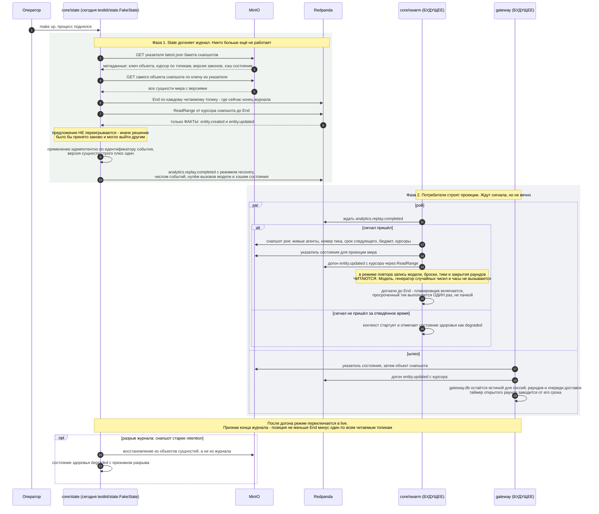

# Сценарий: рестарт и восстановление из снапшота с догоном журнала

**Вопрос читателя: что происходит при перезапуске платформы, в каком порядке поднимаются контексты и почему при этом не вызывается модель?**

Дата: 2026-09-11 · system-architect#1
Иллюстрирует: [`../overview.md`](../overview.md) §17.4, UC-025 из [`../../analysis/use-cases.md`](../../analysis/use-cases.md), [`../contracts.md`](../contracts.md) C-14 (снапшоты и протокол восстановления), C-01 v1.2 (журнал, `End`, старт с первого офсета), C-02, ADR-003 (запись до использования), ADR-011 (указатель и ротация).
Проверено по дереву: `shared/eventbus/{bus.go,kafka.go}` (`Journal`), `shared/testkit/state/{state.go,snapshot.go}`, `testdata/fixtures/snapshots/state/latest.json`, `shared/objstore/buckets.go`, `shared/env/vars.go`.

**Почему выбран этот сценарий.** Это единственный сценарий, который исполняет **каждый** контекст с состоянием, и единственный, где ошибка не видна игроку сразу, а всплывает расхождением состояния через час игры. Он же задаёт порядок старта процессов и объясняет, зачем в конверте события живёт признак повтора. Наконец, это единственный сценарий, часть которого в дереве уже написана: двойник State соблюдает протокол старта.

## Правила, которые эта диаграмма закрепляет

1. **Истина — снапшот, журнал — способ его догнать.** Поэтому факт публикуется только после успешной записи, а восстановление начинается с указателя, а не с начала журнала.
2. **Переигрываются факты, а не предложения.** Предложение — это просьба принять решение; повторив его, система приняла бы решение заново, и оно могло бы выйти иным.
3. **Указатель отделён от снапшота** и пишется после успешной записи объекта: иначе после падения посреди записи потребитель прочитал бы указатель на несуществующий объект.
4. **Недетерминированные источники читаются, а не вызываются.** В режиме повтора провайдер модели — читатель записей, генератор случайных чисел берёт сид из события, часы идут по меткам событий. Именно ради этого запись `llm.output` идёт до использования ответа.
5. **Ожидание сигнала ограничено.** Потребитель, не дождавшийся `analytics.replay.completed`, стартует и честно отмечает состояние здоровья как ухудшенное — та же ветка нужна и в бою, когда State просто упал.
6. **Новая группа читает журнал с первого офсета** (C-01 v1.2). Это гарантия контракта, а не свойство одной реализации, и именно она избавляет потребителя от рукопожатия «подписка готова».

## Что здесь будущее

Настоящих `internal/state`, `internal/swarm`, `internal/gateway`, `internal/replay` в дереве нет. Что есть:

- **Двойник State соблюдает протокол старта**: `testkit/state.FakeState` публикует `analytics.replay.completed {mode: recovery}` сразу после подписки на системные события — с нулевым числом переигранных событий и без снапшота. Заглушка подстраивается под протокол, а не потребители под заглушку.
- **Журнальная половина шины написана и покрыта общим контрактным тестом**: `ReadRange`, `Tail`, `End` работают одинаково на брокере и на шине в памяти.
- **Фикстура снапшота существует**: `testdata/fixtures/snapshots/state/latest.json` — указатель нулевого снапшота с причиной `bootstrap`, курсором и хэшем состояния, рядом сам объект.

## Расхождения с деревом

1. **Переменной `MV_SWARM_REPLAY_WAIT` в манифесте нет.** C-14 v0.4 вводит её со значением по умолчанию 120 секунд и делает частью протокола («ожидание сигнала ограничено таймаутом»). В `shared/env/vars.go` её нет, значит `mvctl env check` о ней не знает и в `.env.example` она не попадёт. То же и с `MV_GATEWAY_REPLAY_WAIT`.
2. **Режим и вид шины задаются флагами, а окружение их дублирует и не читается.** `cmd/multiverse` берёт `--mode` и `--bus` из флагов; `docker-compose.yml` передаёт `MV_MODE` и `MV_BUS`, а `serve.go` их не смотрит. Хуже того, значения не совпадают по словарю: манифест объявляет `MV_BUS` со значением `redpanda`, флаг принимает `kafka` или `memory`. Оператор, поставивший `MV_MODE=replay` в `.env`, получит процесс в режиме `live` и не узнает об этом.
3. **`--recording` разбирается и никуда не идёт.** Флаг проверяется (допустим только при `--mode=replay`) и складывается в структуру параметров, которую никто не читает: `internal/replay` появится в EPIC-002.
4. **`overview.md` §17.4 показывает восстановление gateway из `gateway.db` и проекции State**, но не называет ограничение ожидания сигнала — а именно оно определяет, что делает процесс, когда State не поднялся. Это уточнение живёт только в C-14 v0.4.
