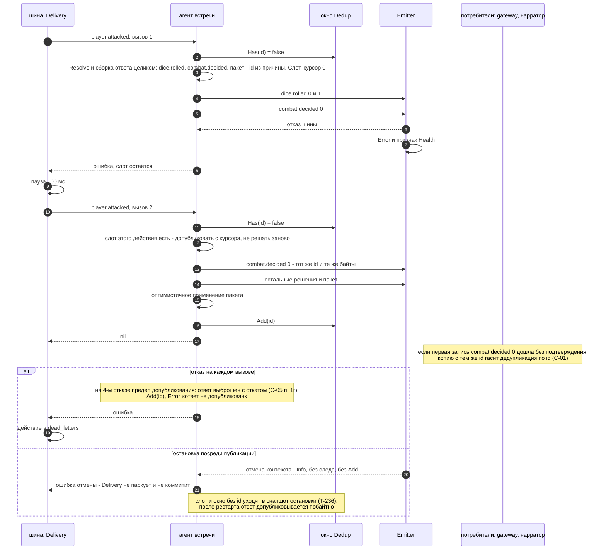

# Сценарий роя: ответ агента встречи при отказе шины и при остановке

**Вопрос читателя: что происходит с полуопубликованным ответом на удар, если шина отказала или процесс останавливается, и почему потребитель не видит двух разных ответов?**

Дата: 2026-09-11 · architect#2 (EPIC-003)
Иллюстрирует: design EPIC-003 §14.1, C-01 v1.5 (`Dedup.Has`/`Add`, `WithCauseID`, `Delivery`), ADR-027 и его «Уточнение исполнения», C-14 v1.2 (а), правило `Emitter` T-223.
Целевой сценарий: `internal/swarm` в дереве нет. Двойник `FakeEncounter` держит окно `Seen`, и повтор у него отвечает `nil` (T-415). Двойник снимается T-256, поэтому образцом он здесь не служит.

## Почему так

1. **Ответ собирается один раз, а публикуется по курсору.** Факт, пришедший по другой подписке между вызовами, решения не меняет. Под одним id не могут оказаться разные байты.
2. **Id — из причины** (`WithCauseID`: у бросков — индекс броска, у решений — `exchange.index`, у пакета — номер попытки). Повтор, рестарт и replay дают те же id. Генератор id не расходуется, поэтому последовательность id остальных событий не сдвигается (ADR-027 «Уточнение исполнения» п. 2).
3. **`Add` — только когда ответ опубликован целиком.** С `Seen` id действия попадал бы в окно, окно — в снапшот остановки, и после рестарта полуотвеченное действие было бы погашено молча.
4. **Предел допубликования (4) равен числу вызовов обработчика у шины.** Дефект сборки события не отравляет бой навсегда: ответ выбрасывается, а действие уходит в `dead_letters` с причиной.
