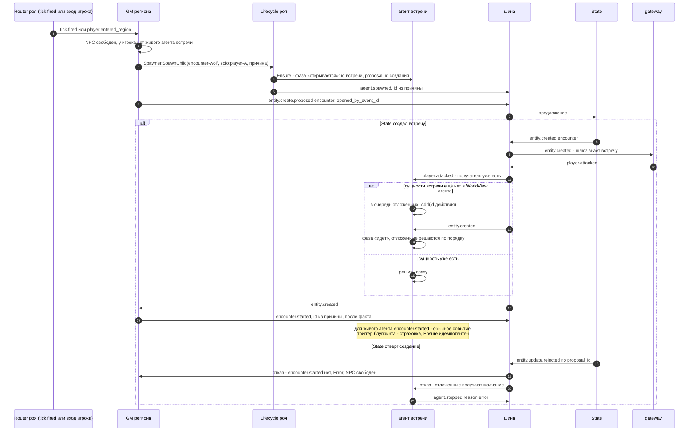

# Сценарий роя: открытие встречи и удар до `encounter.started`

**Вопрос читателя: кто и когда поднимает агента встречи и почему удар, принятый шлюзом, не теряется, даже если придёт раньше `encounter.started`?**

Дата: 2026-09-11 · architect#2 (EPIC-003)
Иллюстрирует: ADR-028, design EPIC-003 §14.2, C-05 v1.5 п. 3–4, ADR-026 и его «Уточнение исполнения» п. 3–4.
Целевой сценарий: `internal/swarm` в дереве нет. У двойника `shared/testkit/swarm/fake_encounter.go` открывающий и агент встречи — один объект, поэтому окна там нет по построению.

## Почему так

1. **Агент поднимается до публикации предложения.** Удар проходит цепочку «предложение → факт State → шлюз → удар», и в её начале агент уже есть. Поэтому удар застаёт его, как бы Router ни читал разные топики (C-01: порядок только внутри топика).
2. **Очередь одна — у агента** (T-425 п. 5). Router ничего не держит и сроков не ждёт.
3. **`encounter.started` публикует GM региона после факта** (C-05 п. 4). Подъём агента от этого события больше не зависит.
4. **Отказ создания — дефект** (ADR-026 п. 2). Агент останавливается с `reason: error`, этот enum в схеме уже есть.
