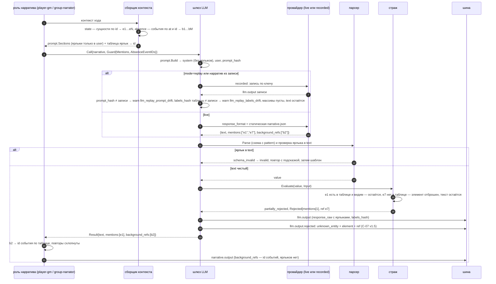

# Сценарий роя: ярлыки вызова в нарративе — выдача, проверка, разрешение в id, replay

**Вопрос читателя: где рождаются ярлыки `eK`/`bK`, кто превращает их обратно в id и что происходит с ярлыком, которого не было в промпте?**

Дата: 2026-09-13 · architect#2 (EPIC-003, T-439; приведено к C-07 v1.5 — T-459)
Иллюстрирует: ADR-029 п. 2–8; КД `components/swarm-llm-laws.md` §9.2, §10.2, §11.4, §13.4.2.
Целевой сценарий: пакетов `internal/swarm` и `internal/llm/{prompt,parser,guardian}` в дереве ещё нет (T-209, T-217, T-218, T-233, T-235).

Что читать на диаграмме:
- Ярлыки не выходят за пределы вызова: в `system`, во внешних событиях и в `narrative.output` их нет. В `llm.output.response_raw` они остаются как ответ модели (ADR-029 п. 7).
- Ярлык, которого не было в промпте, стоит отброса одного элемента, а не повтора всего ответа (п. 5). Событие отброса — `unknown_entity` с `ref` (C-07 v1.5, п. 6).
- В replay расхождение `prompt_hash` не останавливает прогон и само по себе ссылок не гасит: ярлыки сверяются по `labels_hash` записи. Разошлась таблица — массивы пусты, чтобы ссылка не ушла другому id (п. 8, C-07 v1.5).
