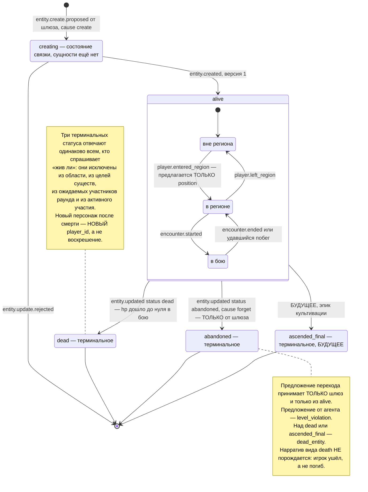

# Жизненный цикл персонажа

**Вопрос читателя: какие состояния проходит персонаж, кто вправе его туда перевести и какие состояния необратимы?**

Дата: 2026-09-11 · system-architect#1
Иллюстрирует: [`../../analysis/data-model.md`](../../analysis/data-model.md) §3.3 и §9.1, [`../contracts.md`](../contracts.md) C-02 v1.2 (переход в `abandoned` и терминальные статусы), C-03 (`Actor.Alive`), C-04 v1.1 (каскад забвения), C-08 (коды ответа шлюза).
Проверено по дереву: `shared/entity/types.go` (`StatusAlive`, `StatusDead`, `StatusAbandoned`, `StatusAscendedFinal`, `TerminalStatuses`, `IsTerminal`, `StatusTransitionAllowed`), `shared/contracts/ownership.go` (строка `gateway`), `internal/mechanics/types.go` (`Actor.Alive`), `schemas/events/entity.update.rejected.v1.json`.

## Под-состояния, которые не видны в статусе

`alive` — не одно состояние, а четыре независимые оси, и различать их приходится всем потребителям:

| Ось | Значения | Кто меняет |
|---|---|---|
| позиция | вне мира или регион; ровно одна | шлюз при входе и выходе, механика при удавшемся побеге |
| встреча | нет, в бою, вне боя | агент встречи |
| участие | активен или бездействует | координатор раунда: два подряд пропуска переводят в бездействие, любое действие возвращает |
| область | соло или группа | шлюз, и только вместе с изменением членства в группе |

## Правила, которые эта диаграмма закрепляет

1. **Область не путешествует вместе с позицией.** При входе в регион предлагается только позиция: у соло-игрока область не меняется, у участника группы — тоже. Предложить область значило бы прислать набор изменений, который ничего не меняет, и получить факт с пустым списком изменений и прежней версией.
2. **`abandoned` — не смерть.** Для области, целей и раундов он равен смерти, но нарратива о гибели не порождает.
3. **Терминальность проверяется одной функцией.** `Actor.Alive()` отвечает по одному правилу для всех трёх терминальных статусов — это единственное место, где решение принимается, и оно уже написано.
4. **`creating` — состояние связки, а не сущности.** Оно живёт в служебных данных шлюза и не является статусом персонажа: в состоянии мира персонажа в этот момент ещё нет.

## Что здесь будущее

- **`ascended_final`** — статус объявлен в `shared/entity/types.go` и включён в терминальные, но перехода в него в MVP-1 не делает никто: резерв эпика культивации.
- **`creating`, участие, раунды, коды `409`** — часть шлюза, которого в дереве нет.
- **Переход в `dead`** — требует настоящего State и настоящей механики: `Resolve` не реализован, а двойник State по умолчанию инвариантов не проверяет.

## Расхождения с деревом

**Сверка T-409 (2026-09-11, architect#1).** «Закрыто» — документ приведён к дереву; «код» — прав контракт, названа задача.

| # | Статус | Что сделано |
|---|---|---|
| 1 | код (T-056) | прав контракт: C-02 v1.4, абзац «Статус в то же значение». Двойник уже соответствует (`ApplyOps` отбрасывает `set` без изменения до матрицы); `entity.StatusTransitionAllowed(x, x)` и строка теста `alive→alive` правятся в EPIC-002 T-056, метка `contract-change` |
| 2 | закрыто | `data-model.md` §3.3 называет `TerminalStatuses`, `IsTerminalStatus`, `StatusTransitionAllowed`, `Actor.Alive()` |
| 3 | закрыто | `data-model.md` §9.1: петля подписана «не переход статуса — меняются под-состояния», четыре оси описаны под диаграммой |
| 4 | код (T-054) | `state-and-mechanics.md` §5.7: сказано, что «мёртвый не действует» сегодня написано только в `Actor.Alive()`, а `Check` у inv-01 — `nil`; проверки — T-054 |

Формулировки, записанные при рисовании (до сверки):

1. **Переход «в тот же статус» запрещён функцией и разрешён контрактом.** `StatusTransitionAllowed` отвечает отказом, когда исходный и целевой статусы совпадают, а C-02 говорит: набор изменений, который ничего не меняет, даёт факт с пустым списком изменений и прежней версией — ход засчитан. Кто прав, решать State, которого нет: сегодня две половины отвечают на один вопрос по-разному, и решение стоит принять до того, как его примет случайная строка кода.
2. **Имя функции не совпадает с именем в документах.** В дереве это `StatusTransitionAllowed` и `IsTerminal`; `data-model.md` §3.3 описывает правило словами, не называя точки, где оно проверяется. Навигация по документу к коду не ведёт.
3. **`data-model.md` §9.1 рисует петлю `alive → alive` по всем действиям**, не разделяя четыре оси под-состояний. Практическая цена: непонятно, что «бездействует» — это ось участия в группе, а не статус, и что проверка «жив ли» её не видит.
4. **Проверка «мёртвый не действует» заявлена в трёх местах** (шлюз, механика, состояние), но написана в одном: `Actor.Alive()`. Реестр инвариантов знает `inv-01` и места его проверки, а функции проверки у него нет — она `nil`.
