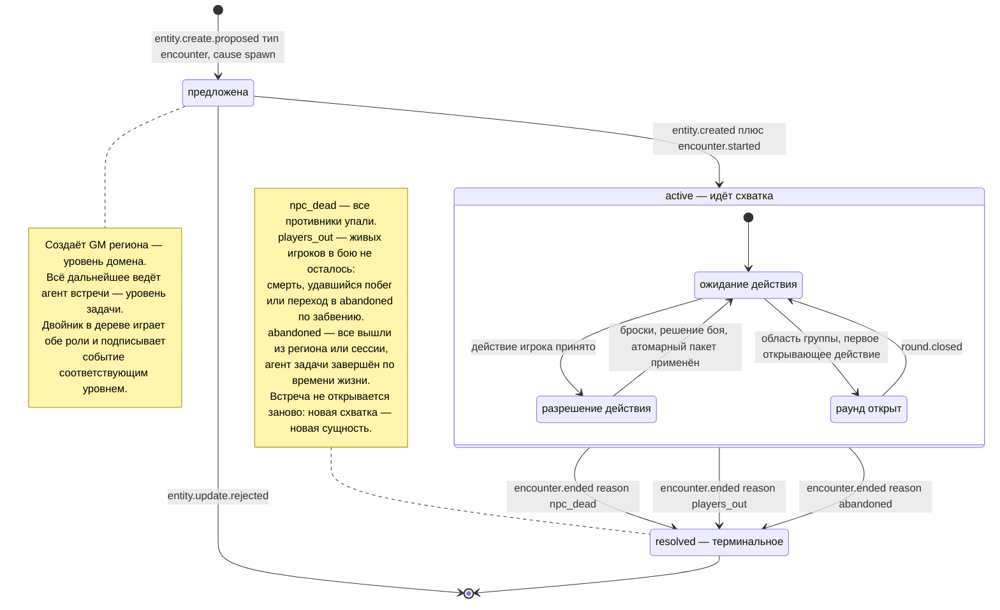

# Жизненный цикл встречи

**Вопрос читателя: какие состояния проходит встреча, кто её открывает и закрывает и по каким причинам она заканчивается?**

Дата: 2026-09-11 · system-architect#1
Иллюстрирует: [`../../analysis/data-model.md`](../../analysis/data-model.md) §3.7 и §9.2, [`../contracts.md`](../contracts.md) C-05 (жизненный цикл встречи), C-02 (владение и предложения), C-04 (каскад забвения).
Проверено по дереву: `shared/entity/types.go` (`EncounterStateActive`, `EncounterStateResolved`, `ResolutionNPCDead`, `ResolutionPlayersOut`, `ResolutionAbandoned`), `schemas/events/encounter.started.v1.json`, `schemas/events/encounter.ended.v1.json`, `shared/testkit/swarm/fake_encounter.go`, `shared/testkit/gateway/harness.go`.

## Правила, которые эта диаграмма закрепляет

1. **Открывает и закрывает встречу не один и тот же уровень.** Создание с причиной «появление» принадлежит уровню домена, всё последующее — уровню задачи. Таблица владения это различает, и проверка в дереве сделана не списком в тесте, а сверкой с самой таблицей.
2. **Событие конца строится до пакета изменений, а публикуется после.** Иначе набор изменений не может сослаться на идентификатор события, которое его вызвало.
3. **Ни одно принятое действие не остаётся без следа.** Даже обмен, в котором никто не попал, кладёт в пакет набор изменений сущности встречи: иначе действие неотличимо от «никто не слушал».
4. **Один противник — одна активная встреча.** Ограничение записано в модели данных и держится тем, что встреча заводится на область игрока или группы.
5. **Забвение встречу не закрывает напрямую.** Шлюз ничего не делает со встречей: агент видит факт перехода персонажа в `abandoned` и закрывает встречу сам с причиной «живых игроков нет».

## Что здесь будущее

- **Раунд группы** (`round.opened` → `round.closed`) — координатора раундов нет: `internal/gateway` не написан. Во вложенном состоянии эта ветка нарисована, потому что она часть контракта C-04, но сегодня по ней не проходит ничего.
- **Настоящий агент встречи** — `internal/swarm` не написан; роль играет двойник `testkit/swarm.FakeEncounter`, и он работает только на шине в памяти или в `core` при включённом хуке, которого в дереве тоже нет.
- **Причина `abandoned`** — требует времени жизни агента и выхода из региона; ни того, ни другого в дереве нет. Двойник закрывает встречу только по двум первым причинам.

## Расхождения с деревом

1. **Поле причины в событии называется не так, как атрибут сущности.** В схеме `encounter.ended` это `reason`, в сущности встречи — `resolution` (`shared/entity/types.go`). Значения совпадают, имена — нет. `data-model.md` §3.7 называет только `resolution`, и читатель, ищущий его в событии, не найдёт.
2. **`data-model.md` §9.2 рисует переход `active → active` по `round.opened`, `combat.decided`, `round.closed`** как петлю без внутренней структуры. Это скрывает то, что решает дефекты: внутри активной встречи есть ожидание действия и его разрешение, и именно в момент разрешения агент обязан обновить своё представление о мире, если получил отказ по конфликту версий. Правило пока живёт в журнале решений, а не в C-05.
3. **Состояния «предложена» в модели данных нет.** Между предложением создать встречу и фактом её создания сущности ещё не существует, а событие `encounter.started` уже может быть опубликовано — двойник публикует его сразу за предложением. Кто и что видит в этот промежуток, контракт не оговаривает.
