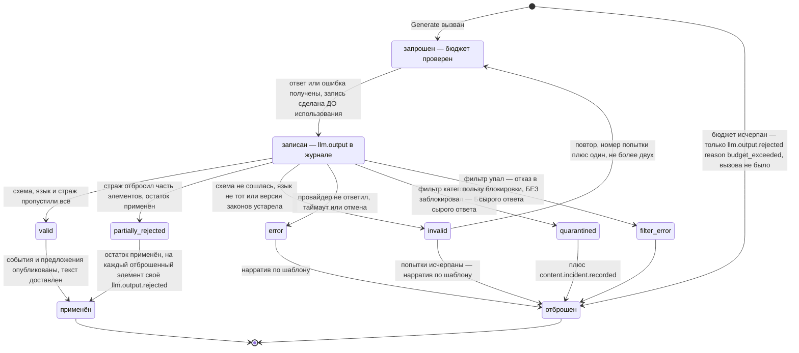

# Жизненный цикл вывода модели

**Вопрос читателя: что бывает с ответом модели между вызовом и нарративом, и что из этого попадает в журнал?**

Дата: 2026-09-11 · system-architect#1
Иллюстрирует: [`../../analysis/data-model.md`](../../analysis/data-model.md) §7.2 и §9.7, [`../contracts.md`](../contracts.md) C-07 v1.2 (единый перечень исходов из шести значений), C-15 (интерфейс провайдера), ADR-005 (порядок побочных эффектов), ADR-016 (парсер и восстановление), ADR-017 (страж и причины отказа).
Проверено по дереву: `schemas/events/llm.output.v1.json`, `schemas/events/llm.output.rejected.v1.json`, `schemas/events/content.incident.recorded.v1.json`, `shared/contracts/registry.go`, `testdata/fixtures/events/llm.output.*`.

**Почему выбран третий жизненный цикл именно этот.** Перечень исходов сузили в сведении 3 с одиннадцати значений до шести, и разница между «статусом» и «причиной» — ровно то место, где документы и код успели разойтись дважды. Диаграмма фиксирует принятую форму до того, как её начнут писать.

## Правила, которые эта диаграмма закрепляет

1. **Запись до использования.** `llm.output` публикуется раньше, чем ответ применён: иначе повтор прогона не воспроизвёл бы решение. Отсюда же и ключ записи — идентификатор цепочки, идентификатор агента, фаза и номер попытки.
2. **Статус — это исход конвейера, причина — отдельное событие.** Шесть значений описывают, что стало с ответом; почему именно — только в `llm.output.rejected.reason`, по одному событию на отброшенный элемент. Значения вида «отклонено из-за неизвестной сущности» из ранней редакции модели данных удалены и никогда не издавались.
3. **`budget_exceeded` — не статус.** Вызова не было, значит и записи вывода нет: публикуется только отказ.
4. **Карантин и падение фильтра не сохраняют сырой ответ.** Именно поэтому они отдельные исходы, а не разновидность «недействительного».
5. **Деградация не является ошибкой хода.** Из любого отброшенного исхода игрок получает нарратив по шаблону в пределах таймаута фазы.

## Что здесь будущее

Каталога `internal/llm` в дереве нет: ни шлюза, ни провайдеров, ни парсера, ни фильтра, ни стража, ни учёта бюджета. Что есть:

- **Схемы и реестр**: `llm.output`, `llm.output.rejected`, `content.incident.recorded` зарегистрированы, схемы закрыты, фикстуры валидного и невалидного вида лежат в `testdata/fixtures/events/`.
- **Перечень причин отказа закреплён тестом-заглушкой**, который читает файл схемы как исходный текст и включится, когда появится пакет стража. Приём стоит перенять на остальные перечни.

## Расхождения с деревом

1. **`data-model.md` §7.2 в редакции v0.2 всё ещё описывает одиннадцать значений** перечня исходов, включая удалённые `rejected_unknown_entity`, `rejected_player_agency`, `rejected_level_violation`, `rejected_language` и `budget_exceeded`. Схема в дереве знает шесть. Прав код и C-07 v1.2.
2. **Два пункта ADR-016 устарели** после дополнения к ADR-017: они называют статус, которого больше нет, и требуют хранить сырой ответ там, где он теперь не хранится. Вопрос поднят исполнителем и открыт.
3. **Риск утечки в поле сообщения об ошибке закрыт наполовину.** Имя провайдера в схеме ограничено шаблоном строки — короткое имя из строчных букв, цифр и подчёркиваний, куда адрес не поместится. А свободная строка сообщения об ошибке ничем не ограничена: именно туда попадает ответ HTTP-клиента, а он может нести адрес и заголовки. Требование ушло в задачу реализации записи, но схемой не выражено, и, значит, нарушить его можно молча.
4. **Ловушка на границе механики и события.** У механики пять видов действия, у события решения боя — четыре: диаграмма исходов вывода модели с этим не связана напрямую, но обе живут в одном конвейере, и обе полагаются на то, что перечни в схеме и в коде совпадают. Сегодня такое совпадение проверяется только там, где кто-то догадался написать тест.
