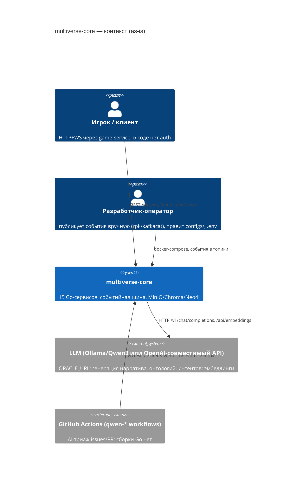
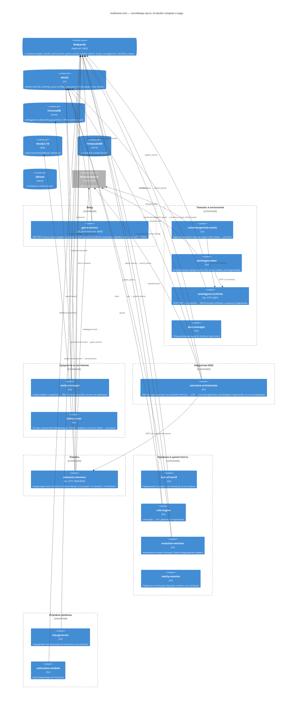
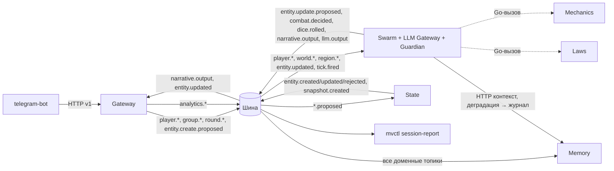
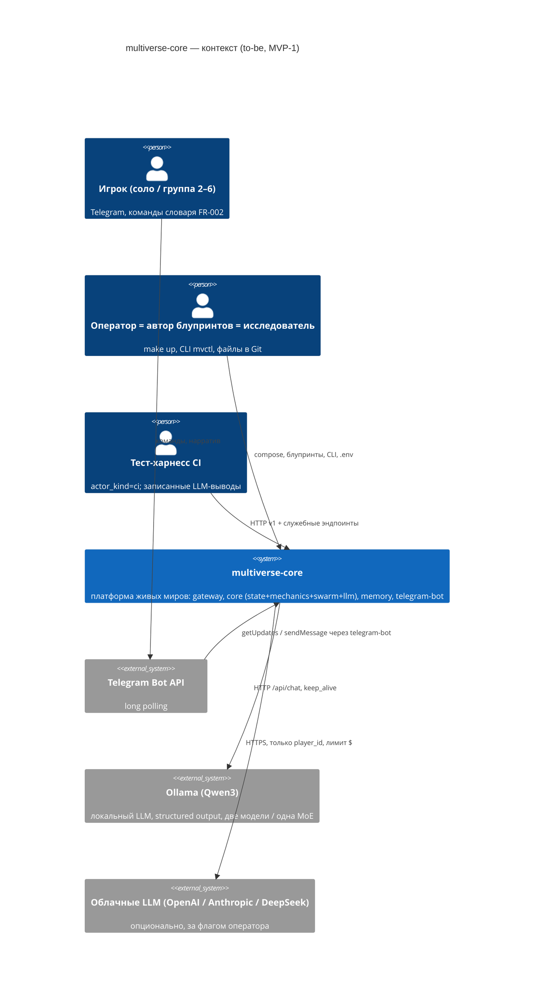
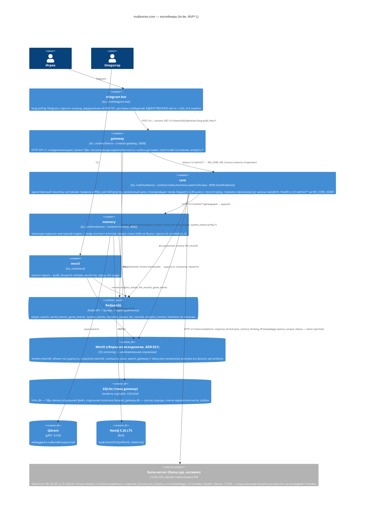

# Архитектурный обзор multiverse-core

Статус документа: раздел «Текущее состояние» заполнен по аудиту A0 (2026-09-09); раздел «Целевое состояние» заполнен на этапе A3 (2026-09-09, system-architect#1), к утверждению на G2.
Сырые факты, счётчики и результаты сборки/тестов — в [audit-facts.md](audit-facts.md). Решения — в [adr/](adr/) (ADR-001…ADR-010). Контракты между блоками — в [contracts.md](contracts.md). Эпики и карта владения — в [../plan/epics.md](../plan/epics.md), [../plan/ownership.md](../plan/ownership.md). Открытые вопросы — в [../project/open-questions.md](../project/open-questions.md).
Канонический документ архитектуры проекта — этот файл плюс ADR (OQ-A-13); `Docs/architecture*.md`, `Docs/LIVING_WORLDS_*.md`, `Docs/agent-gm-research/` считаются историческими и переносятся в `Docs/archive/` задачей гигиены (EPIC-001).

---

## Часть I. Текущее состояние (as-is)

### 1. Краткая характеристика

multiverse-core — событийно-ориентированная платформа «живых миров» на Go (workspace из 22 модулей, ~29 k строк без тестов): 15 микросервисов вокруг шины Redpanda, с MinIO как основным хранилищем состояния (JSON-снапшоты), ChromaDB + Neo4j как семантической памятью для LLM и Ollama/Qwen как генератором нарратива. Проект ведёт один разработчик; код прошёл несколько волн рефакторинга (иерархические события, EntityRef, Agent GM Core), каждая из которых завершена частично.

Фактическая степень зрелости: **3 сервиса реализованы** (semantic-memory, narrative-orchestrator, world-generator), **6 частично**, **4 — прототипы in-memory**, **2 — заглушки/неработоспособны**. Единственный оператор входа для игрока — game-service (HTTP/WS), большинство его обработчиков — TODO. Полных «сквозных» цепочек событий, замкнутых от издателя до бизнес-потребителя, — пять (см. audit-facts §5).

### 2. C4 уровень 1 — контекст



Внешних систем, кроме LLM, нет. Мультитенантности нет: `world_id` используется как ключ партиционирования и имя бакета, но не как граница изоляции/авторизации.

### 3. C4 уровень 2 — контейнеры



Ответственность и технологии каждого контейнера, топики и хранилища — таблица в audit-facts §4. Ключевые наблюдения:

- **Владелец данных не определён** для бакетов `entities-{world_id}`: пишут entity-manager и game-service, читает game-service; entity-actor и evolution-watcher держат собственные снапшоты тех же сущностей.
- **Три HTTP-контракта между сервисами** (semantic-memory, ontological-archivist, LLM) существуют только в виде кода клиентов; OpenAPI/схем нет.
- **Единственный «мозг» системы** — narrative-orchestrator (2 316 строк в одном файле), совмещающий две архитектуры GM.

### 4. Карта топиков и потоков

| Топик | Издатели | Подписчики (бизнес) | Замечания |
|---|---|---|---|
| player_events | game-service | ban-of-world, cultivation-module, entity-actor, entity-manager, evolution-watcher, game-service | единственный вход игрока |
| world_events | ban-of-world, cultivation-module, entity-actor, narrative-orchestrator (в т.ч. произвольные типы из LLM), game-service | city-governor, cultivation-module, entity-actor, entity-manager, evolution-watcher, game-service, narrative-orchestrator, plan-manager | самый «широкий» топик; риск петель GM→GM (есть защита `isOwnEvent`) |
| game_events | city-governor, game-service | city-governor, entity-actor, entity-manager, evolution-watcher, game-service, narrative-orchestrator | |
| system_events | world-generator, universe-genesis-oracle, plan-manager, evolution-watcher, reality-monitor, narrative-orchestrator (time.syncTime), game-service (gm.*) | cultivation-module, entity-actor, entity-manager, evolution-watcher, game-service, narrative-orchestrator, plan-manager, rule-engine, universe-genesis-oracle, world-generator | смешаны lifecycle GM, генерация миров, тики времени и системные нарушения |
| narrative_output | narrative-orchestrator | game-service (TODO) | результат для клиента фактически не доставляется |
| scope_management | — | — | мёртвый топик |
| фантомные: entity_actor_events, mechanical_results, entity.created, entity.deleted, world.metrics.*, reality.anomaly.detected | — | entity-actor, narrative-orchestrator, entity-manager, reality-monitor | подписки на несуществующие топики |

Всё индексирует semantic-memory (6 consumer-групп). Подробный список разрывов издатель→потребитель — audit-facts §5.

Ключевые потоки as-is:

1. **Ход игрока**: клиент → `POST /players/*` или WS → game-service публикует `player.moved` / `player.used_skill` (player_events) → ban-of-world проверяет и публикует `violation.detected` (world_events) → city-governor реагирует `city.violation.consequence` (game_events) → narrative-orchestrator подмешивает в контекст GM. Ответ игроку по WS — не реализован.
2. **Нарратив**: game-service публикует `gm.created` (system_events) → narrative-orchestrator создаёт `GMInstance` на scope, буферизует события scope, по таймеру/порогу запрашивает у semantic-memory контекст (HTTP), строит промпт, вызывает LLM, публикует `narrative.generate` (narrative_output) и `new_events` из ответа LLM (world_events); снапшот GM → MinIO.
3. **Генерация мира**: внешний `world.generation.requested` (system_events) → world-generator через LLM создаёт концепт, географию, публикует `entity.created` для мира/регионов/вод/городов и `world.generated` → entity-manager сохраняет сущности в MinIO, semantic-memory индексирует, plan-manager регистрирует план; схемы → ontological-archivist (HTTP).
4. **Память**: любое событие → semantic-memory: текстовый контекст → Chroma (эмбеддинг через Ollama при v2), узлы/рёбра Event→Entity/World/Trigger + `relations[]` → Neo4j.

### 5. Хранилища

| Хранилище | Кто использует | Что хранит | Состояние |
|---|---|---|---|
| Redpanda | все, кроме ontological-archivist | события; retention по умолчанию | нет DLQ, схем, идемпотентности; consumer-группы фиксированы в коде |
| MinIO | entity-manager, game-service, ontological-archivist, narrative-orchestrator, entity-actor, evolution-watcher, rule-engine, shared/config|tinyml|rules | `entities-{world}`, `schemas`, `gnue-configs`, снапшоты GM/акторов, правила, модели | де-факто основная БД; JSON-объект на сущность; нет транзакций, версий, индексов |
| ChromaDB | semantic-memory | эмбеддинги событий и сущностей | v1 API против образа `latest` — риск поломки; v2 требует build-tag |
| Neo4j | semantic-memory | граф Event/Entity/World + relations | наиболее развитая часть; тесты требуют живую БД |
| TimescaleDB | никто | — | удалить или начать использовать |
| Qdrant | никто | — | альтернатива Chroma, не решено |
| Redis | entity-actor, evolution-watcher (через заглушку) | hot-cache состояния акторов | сервиса нет, драйвера нет |
| Ollama | narrative-orchestrator, world-generator, universe-genesis-oracle, intent (entity-actor, evolution-watcher), semantic-memory (эмбеддинги) | LLM | compose требует GPU nvidia |

### 6. Shared-пакеты

Раскладка: 7 отдельных модулей (`agent`, `agent/tools`, `config`, `eventbus`, `minio`, `oracle`, `spatial`) и 7 пакетов внутри root-модуля (`entity`, `intent`, `jsonpath`, `redis`, `rules`, `schema`, `tinyml`) — два разных способа «шарить» код без обоснования.

- Реально общее ядро: `eventbus` (+`jsonpath`) — используется 14 сервисами; `oracle` — 3; `minio` — 4 сервиса + 3 shared.
- Узкоспециализированные под Living Worlds: `intent`, `redis`, `rules`, `tinyml` — по 1–2 потребителя (entity-actor, evolution-watcher).
- Мёртвые/незавершённые: `schema` (0 потребителей), `redis` (без драйвера), `config` (1 потребитель, читает YAML из MinIO, а `configs/*.yaml` с диска не используются), `agent` (скомпилирован, в runtime выключен, ~45 TODO).
- Дублирование: 3–4 LLM-клиента, 4 способа ходить в MinIO, 3 движка правил (audit-facts §10).

**Agent GM Core (`shared/agent`)**: каркас агентной архитектуры (Router → Lifecycle → WorkerPool, двухфазный LLM-пайплайн, LOD, StateManager, ToolRegistry) реализован на уровне типов и оркестрации, но «периферия» (условия спавна, tools, память Redis/PG, парсер MD-блупринтов в валидаторе) — заглушки. Подключён к narrative-orchestrator мостами (`event_adapter`, `narrative_agent`, `narrative_agent_factory`, `oracle_llm_adapter`, `yaml_blueprint_converter`), но активируется только через `NewServiceWithPipeline`, который `main.go` не вызывает. Итого: две параллельные модели GM в одном пакете, ни одна не является «целевой» по коду.

### 7. Домены и ограниченные контексты (как сложились фактически)

| Контекст | Ядро/поддержка | Сервисы и пакеты | Данные | Состояние границ |
|---|---|---|---|---|
| Генезис и онтология | ядро (по user stories P0) | universe-genesis-oracle, world-generator, ontological-archivist, plan-manager | MinIO `schemas`; сущности мира | границы есть (HTTP к archivist), но archivist не знает о событиях; plan-manager — прототип |
| Сущности и состояние мира | ядро | entity-manager, entity-actor, shared/entity, shared/tinyml, shared/rules | MinIO `entities-{world}`, снапшоты акторов, Redis (план) | **нарушены**: game-service пишет напрямую; entity-manager не публикует; две модели сущности (entity.Entity и актор) |
| Нарратив / Game Master | ядро | narrative-orchestrator, shared/agent(+tools), shared/spatial, shared/config, configs/gm_*.yaml | снапшоты GM (MinIO), профили в `gnue-configs` | внутри — две архитектуры; наружу — narrative_output и произвольные события LLM в world_events |
| Семантическая память / знание | ядро-поддержка | semantic-memory, shared/jsonpath | Chroma, Neo4j | самый зрелый контекст, чёткий HTTP-API; но зависит от формата всех событий (Event→Entity extraction) |
| Правила и целостность | поддерживающий | ban-of-world, rule-engine, evolution-watcher, reality-monitor, shared/rules, shared/intent | in-memory, MinIO rules | размыт между 4 сервисами и 3 движками; reality-monitor неработоспособен |
| Игрок и культивация | поддерживающий | cultivation-module, game-service (players) | in-memory | прототип |
| Города и экономика | поддерживающий | city-governor | in-memory | прототип, не в compose |
| Вход игрока (API) | generic | game-service | in-memory кэш + MinIO | нет auth, обработчики TODO, WS без действий |
| LLM-шлюз | сквозной | shared/oracle, shared/intent, orchestrator/oracle.go, oracle_llm_adapter | — | нет единого владельца, нет лимитов/бюджета/кэша (кроме intent) |

Единого языка нет: `scope` (GM) vs `region` (генерация) vs `zone` (plan-manager); `Overseer` (user stories) vs `BanOfWorld` (код) vs `reality-monitor`; `ontology` — и схема сущности (archivist), и профиль запрета (genesis), и «дуальность» (US-002).

### 8. Стиль и принципы — фактические

- Стиль: микросервисы (15 процессов) при одном разработчике; связь только через Kafka-топики + 3 HTTP-контракта. По объёму кода и связности это модульный монолит, разрезанный на процессы.
- Слои внутри сервисов: `cmd/main.go` + один пакет `<svc>/`; выделенного домена/портов/адаптеров нет; бизнес-логика и I/O смешаны (например, `orchestrator.go`).
- Событийность: at-most-once обработка (ошибка обработчика логируется, сообщение считается прочитанным); нет идемпотентности, нет версий схем событий; формат — «иерархический с fallback на плоский» (миграция не завершена).
- Границы транзакций: отсутствуют (MinIO put per entity, Neo4j отдельные MERGE).
- Ошибки: `log.Printf` и продолжение; `log.Fatal` при инициализации.
- Наблюдаемость: логи stdout; ни метрик, ни трейсинга, ни health у 13 из 15 сервисов.
- Конфигурация: env + захардкоженные дефолты в каждом `main.go`; секреты по умолчанию (`minioadmin`, `neo4j/password`).

### 9. Технический долг и риски (оценка серьёзности)

Шкала: **Критично** — блокирует запуск/безопасность; **Высоко** — блокирует развитие/надёжность; **Средне** — ухудшает сопровождение; **Низко** — гигиена.

| # | Долг / риск | Серьёзность | Где |
|---|---|---|---|
| T1 | Секреты в git: `.mcp.env` с `GITHUB_TOKEN`, `DB_MCP_TOKEN` (история, коммит `6e328eb`) | **Критично** | корень |
| T2 | Нет CI на build/vet/test сервисов; `go vet` root падает из-за `test_minio.go`; интеграционные тесты semantic-memory не отделены | **Высоко** | `.github/workflows`, корень |
| T3 | Разрыв контрактов: 6 фантомных топиков, ~30 типов без издателя, ~25 без потребителя; `narrative_output` не доходит до игрока | **Высоко** | все сервисы |
| T4 | Две архитектуры GM в одном пакете; агентный путь не активирован; `orchestrator.go` 2 316 строк | **Высоко** | narrative-orchestrator, shared/agent |
| T5 | Владение данными сущностей размыто (entity-manager, game-service, entity-actor); entity-manager не публикует; replay не реализован | **Высоко** | entity-*, game-service |
| T6 | LLM публикует произвольные типы событий в `world_events` без валидации/белого списка | **Высоко** | narrative-orchestrator |
| T7 | Chroma v1 API против образа `latest`; v2 только по build-tag; образы без пинов | **Высоко** | semantic-memory, compose |
| T8 | Redis-заглушка вместо драйвера; TimescaleDB и Qdrant в compose без кода; GPU-резервация Ollama ломает compose на машинах без nvidia | **Средне** | compose, shared/redis |
| T9 | 4 сервиса in-memory без персистентности; reality-monitor и rule-engine нерабочие; entity-actor API не подключён | **Средне** | ban-of-world, city-governor, cultivation-module, plan-manager, reality-monitor, rule-engine, entity-actor |
| T10 | Дубли: LLM-клиенты ×4, MinIO-клиенты ×4, движки правил ×3, Dockerfile ×5, `getEnv` ×8 | **Средне** | shared, services |
| T11 | Отсутствие наблюдаемости (метрики, трейсинг, health, корреляция событий) | **Средне** | все |
| T12 | Отсутствие auth/сессий в game-service; `world_id` не является границей доступа | **Средне** (критично при выходе наружу) | game-service |
| T13 | Смешанный workspace: 7 shared-модулей + 7 shared-пакетов root-модуля; `replace` только в agent/tools; версии Go 1.24.0/1.24.11/1.25 | **Средне** | go.work, go.mod |
| T14 | 12 из 15 сервисов без тестов; покрытие ядра (eventbus, jsonpath, agent, prompt_builder) есть | **Средне** | services |
| T15 | Бинарники (31 MB), логи, IDE/AI-конфиги в git; пустые каталоги; `fake_deps`; три версии архитектурного документа; user stories не закоммичены | **Низко** | корень, Docs |
| T16 | Документация систематически расходится с кодом (audit-facts §9) — AI-агенты и разработчик получают ложные вводные | **Средне** | CLAUDE.md, AGENTS.md, README, Docs |

### 10. Что работает и на что можно опираться

- `shared/eventbus` + `shared/jsonpath`: устойчивая модель события (EntityRef, relations[]), билдер, тесты — годится как основа контрактов.
- `semantic-memory`: рабочая индексация в Chroma+Neo4j, структурированный контекст (`/v1/context/structured`), метрики связей; лучший кандидат на «эталонный» сервис.
- `narrative-orchestrator` (legacy-ветка): полный цикл scope → контекст → LLM → событие, снапшоты, spatial-фильтрация.
- `world-generator`: детерминированный контракт генерации с тестами.
- `shared/agent`: типы и каркас можно переиспользовать при решении о целевой модели GM.

---

## Часть II. Целевое состояние (to-be)

Основание: `project/vision.md` v1.1 (G1), `requirements/prd.md` v0.3, `requirements/nfr.md` v0.3, `analysis/*.md` v0.1, `requirements/domain-review.md` §3, `project/metrics.md` §4, решения журнала (раунды 1–5, G1). Каждое решение ниже трассируется к FR/BR/NFR и оформлено ADR. Горизонты: **MVP-1** («Тёмный лес», соло → группа, фоновая жизнь) и **целевое** (Living Worlds, пробой законов, культивация, города, генерация миров, авторские инструменты).

### 11. Домены и ограниченные контексты (to-be) и сопоставление с as-is

Единый язык — по `project/glossary.md` v0.2. Контексты выделены по данным (кто владеет) и по командам (кто меняет). Ядро — то, без чего нет продукта «живой мир»; поддерживающие — заменяемые; generic — покупные/типовые.

| Контекст (to-be) | Тип | Владеет данными | Пакет / процесс MVP-1 | Из as-is (что переиспользуем / выводим) | Эпик |
|---|---|---|---|---|---|
| **Вход игрока и доставка** (Gateway) | generic → ядро для MVP (единственный клиентский контракт) | `Link` (ПДн, отдельно), `Session`, `Turn`, `Round`, `IdempotencyKey`, `Delivery`; read-model `CharacterState` | `internal/gateway` → процесс `gateway` (:8088); клиент `cmd/telegram-bot` | game-service: HTTP-каркас переиспользуем, обработчики и MinIO-клиент выводим; WS-широковещание выводим | EPIC-004 |
| **Состояние мира** (State) | ядро | все сущности мира (`World, Region, Character, NPC, Group, Encounter`), версии, снапшоты, `laws_version` | `internal/state` → процесс `core` | entity-manager: переписывается (единственный писатель, предложения → факты, replay); `shared/entity` — расширяется версией | EPIC-002 |
| **Механика** (Mechanics / Rule Engine) | ядро | `RulesDocument` (файл), детерминированный RNG; не владеет состоянием | `internal/mechanics` (библиотека, вызывается роем) → процесс `core` | rule-engine + `shared/rules` + `shared/agent/filter.go`: заменяются одним пакетом с `damage_formula` и seed; entity-actor/tinyml — заморожены | EPIC-002 |
| **Рой GM** (Swarm — Agent GM Core runtime) | ядро | `AgentInstance`, расписание тиков, бюджет фона, контекст агентов, снапшот рантайма; блупринты (файлы) | `internal/swarm` → процесс `core` | `shared/agent`: типы/уровни/LOD/парсер блупринтов переиспользуем; Router/Lifecycle/Pipeline/StateManager переписываем; narrative-orchestrator: `prompt_builder.go` переносится в LLM-шлюз, `GMInstance` выводится | EPIC-003 |
| **LLM-шлюз и страж** (LLM Gateway + Guardian) | ядро (сквозной) | `llm.output` (журнал), бюджеты, словарь фильтра (a), реестр запретов | `internal/llm` (+`internal/llm/guardian`) → процесс `core` | `shared/oracle` + `shared/intent/oracle_client` + `orchestrator/oracle.go` + `oracle_llm_adapter.go` → один шлюз; ban-of-world выводится (роль стража — валидация в конвейере) | EPIC-003 |
| **Законы и канон** (Laws) | ядро (контракт в MVP-1, механика — целевое) | `LawsVersion` (файл `laws/…@vN`), `LawBreach` (целевое) | `internal/laws` (загрузка/версии) → процесс `core` | нет аналога; universe-genesis-oracle (законы вселенной) — заморожен до E-E | EPIC-003 (контракт), EPIC-007 (механика) |
| **Семантическая память** (Memory) | поддерживающий (проекция; Should в MVP-1) | векторный индекс, граф событий/сущностей; перестраивается из журнала | `internal/memory` → процесс `memory` (:8082) | semantic-memory: Neo4j-часть переиспользуем, Chroma → Qdrant | EPIC-005 |
| **Аналитика и операции** (Ops) | поддерживающий | `analytics.*`, `ops/metrics/*.csv`, артефакты прогонов, baseline | `cmd/mvctl` (`session-report`, `blueprint validate`, `world init`, `replay`) | reality-monitor выводится; evolution-watcher заморожен (E-A) | EPIC-005 |
| **Контракты и шина** (Contracts) | ядро-инфраструктура | реестр типов событий, JSON-схемы, топики, конверт события | `shared/eventbus`, `shared/jsonpath`, `shared/contracts`, `schemas/` | eventbus/jsonpath переиспользуем, конверт расширяем `meta`; `scope_management` удаляем | EPIC-001 |
| Игровые домены-расширения: культивация и Планы, города, генерация миров, Entity-Actor | целевые расширения | свои сущности через `entity.*.proposed` и свои блупринты | `internal/ext/*` (после MVP-1) | cultivation-module, plan-manager, city-governor, world-generator, universe-genesis-oracle, ontological-archivist, entity-actor, evolution-watcher — **заморожены** (выведены из `go.work`, compose и Makefile; каталоги сохранены с `FROZEN.md`) | EPIC-006…EPIC-010 |

Карта контекстов (направление зависимостей — только по стрелкам; циклов нет):



Правила единого языка, закрываемые этим документом: `scope` (не `zone`, не `location`) с типами `solo | group | region | world` в MVP-1 (`city`, `quest` зарезервированы — OQ-D-05); `страж` — автомат (валидация в LLM-шлюзе), `ревьюер` — человек; `GM` — экземпляр агента роя по блупринту, «один GM» = одна архитектура (BR-12); `Entity-Actor` — агент уровня `object` (зарезервировано), не отдельный сервис.

### 12. C4 уровень 1 — контекст (to-be)



Внешние ID (Telegram user id) не пересекают границу «telegram-bot ↔ gateway» нигде, кроме `links/*` и создания персонажа (BR-07). Внутри системы — только `player_id`.

### 13. C4 уровень 2 — контейнеры (to-be)

Принцип NFR-075: **число процессов — параметр деплоя, не архитектуры** (ADR-001). Все контексты — пакеты одного Go-модуля; бинарник `cmd/multiverse` поднимает набор контекстов по флагу `--contexts`. Деплой MVP-1 — три процесса платформы плюс бот (ниже). Тот же код можно запустить как один процесс (`--contexts=all`, для e2e без Docker) или как шесть.



Ответственность, технология, владелец данных — по контейнерам:

| Контейнер | Ответственность | Технология | Владелец данных | NFR, которые закрывает |
|---|---|---|---|---|
| `telegram-bot` | тонкий клиент: allowlist Telegram user id (`MV_TELEGRAM_ALLOWED_USER_IDS`, проверка до любого вызова gateway); только личные чаты; команды → HTTP; доставки → чат (plain text, без `parse_mode`); уведомление FR-009; предупреждение «имя = username»; редакция токена в логах | Go, Telegram Bot API (long polling, `timeout=25 с`), `github.com/go-telegram/bot` v1.25 (ADR-018) | ничего персистентного (chat_id == user id, только в памяти для доставки) | NFR-003, NFR-041 (логи без пейлоадов, ротация по объёму), NFR-092 |
| `gateway` | HTTP API v1 (`analysis/api-contracts.md` §1 + C-08 v1.1); валидация до механики; псевдонимизация (`link_id` → `player_id`); координация раундов группы; outbox; сессии и `analytics.*`; прокси `/v1/admin/*` к `core`; `/health`; снапшот курсоров `snapshots-{world}/gateway/` | Go `net/http` (стандартный роутер 1.22+), SQLite (`modernc.org/sqlite`, миграции `goose` embed — ADR-019) | `Link`, `character_requests` (links.db — единственное место с внешним ID), `Session/Turn/Round/IdempotencyKey/Delivery/cursors` (gateway.db — без внешних ID), read-model `CharacterState` (память; старт от `state/latest.json` + догон `Journal`) | NFR-001 (ack ≤ 300 мс), NFR-013, NFR-036, NFR-041, NFR-042, NFR-045 |
| `core` | контексты State, Mechanics, Swarm, LLM, Laws в одном процессе (ADR-001); HTTP-сервер процесса `MV_CORE_ADDR` (`127.0.0.1:8090`): `/health` (`agents_by_level`, `llm`, `store`), `/v1/admin/agents*`, `/v1/admin/llm/usage`; до EPIC-003 I1 — хук `MV_SWARM_FAKE=true` (фейки `testkit/swarm` под именем `swarm`, I1-α) | Go; `shared/objstore` над MinIO SDK; LLM через `internal/llm` (`openai_compat` → llama-server, `ollama` → native API); `math/rand/v2` PCG; `shared/clock`/`shared/runtime` | сущности мира и снапшоты (State); `AgentInstance`, расписание, бюджет (Swarm); `llm.output` (LLM); `laws@vN` (Laws — файл в Git) | NFR-001, NFR-002, NFR-006, NFR-007, NFR-010…NFR-016, NFR-020…NFR-022, NFR-026, NFR-030, NFR-050…NFR-053, NFR-060, NFR-083, NFR-090 |
| `memory` | проекция журнала; контекст агентов; сводка фона; трасса | Go, Qdrant gRPC (официальный `github.com/qdrant/go-client`), Neo4j driver v5 | индекс и граф (производные, перестраиваемые) | NFR-034 (трасса), FR-035, FR-127 (сводка) |
| `mvctl` | операторские и исследовательские команды | Go CLI | `ops/metrics/*.csv`, `ops/metrics/sessions/*.json`, `ops/metrics/baseline.md` | FR-088, FR-101, NFR-032 |
| Redpanda | журнал событий и шина | Redpanda v26.1 (пин по `build/versions.env`; не `latest`), `rpk topic create … -c retention.ms=… -c segment.ms=86400000` в `redpanda-init`; том as-is (v24.2) пересоздаётся | — | NFR-011 (RPO=0 для подтверждённых), NFR-061 |
| MinIO | объектное хранилище состояния/снапшотов | MinIO, **собранный из исходников** тега `RELEASE.2025-10-15` (`build/minio.Dockerfile`, ADR-021 — образы upstream больше не публикуются); bucket versioning и ILM включает `objstore.EnsureBucket` (страховка, код от versioning не зависит); замена на SeaweedFS — по триггерам ADR-021 | — | NFR-010, NFR-071 |
| SQLite | приватные и служебные данные gateway | `modernc.org/sqlite` | — | NFR-041, NFR-042 |
| Qdrant, Neo4j | память (Should) | Qdrant (пин), Neo4j 5.26 LTS | — | FR-035 |
| llama-server (основной LLM-рантайм, U-8) | LLM: генерация по JSON-схеме, эмбеддинги | llama.cpp `llama-server.exe` **нативно на Windows** (вне compose), `127.0.0.1:1234`, `Qwen3.8-27B-UD-Q3_K_XL.gguf` (13,1 ГБ + KV 2–4 ГБ при 8–16k), `--n-gpu-layers 99 --flash-attn on --jinja --kv-unified --load-mode mmap+mlock`; запуск `scripts/llm-server.ps1`; здоровье `GET /health` (200/503 loading), `GET /v1/models`; thinking выключается шлюзом на запрос (`chat_template_kwargs.enable_thinking=false`, llama.cpp #20345) | — | NFR-002, NFR-004 (модель резидентна с момента старта), NFR-022, NFR-071, NFR-076 |
| Ollama (опциональный второй рантайм) | LLM для конфигураций C/A и эмбеддингов, если llama-server их не обслуживает | Ollama ≥ 0.12 нативно или профиль `gpu`; теги `qwen3:8b`, `qwen3:14b`, `qwen3:30b-a3b`; `OLLAMA_KEEP_ALIVE=-1`, `OLLAMA_MAX_LOADED_MODELS=2`; провайдер `ollama` (native API) | — | NFR-004, NFR-076 (материал замера) |

Что **не** в контейнерах MVP-1 и почему: TimescaleDB (нет клиента, метрики — CSV+CLI по FR-088; ADR-004); Redis (in-memory + снапшот достаточно при ≤ 20 агентах, NFR-083; ADR-004); ChromaDB (v1 API удалён в Chroma 1.x, v2 требует CGO и стороннего клиента; ADR-004) — **живёт только в compose-профиле `legacy`** вместе с as-is `semantic-memory` (:8083), потому что as-is narrative-orchestrator жёстко зависит от `/v1/context-with-events`; Redpanda Schema Registry (реестр — локальные JSON-схемы в репозитории, ADR-007); legacy narrative-orchestrator (только профиль `legacy` на время миграции, ADR-002); Kubernetes/облачный деплой (вне объёма).

**Compose-профили** (`infrastructure.md` §1.3): без профиля — `redpanda`, `redpanda-init`, `minio`, `minio-init`, `gateway`, `core` (минимальный стек «соло без памяти и LLM»); `memory` — `qdrant`, `neo4j`, `memory`; `gpu` — `ollama` в контейнере (опционально: основной рантайм — нативный llama-server вне compose, `MV_LLM_URL=http://host.docker.internal:1234`); **`bot`** — `telegram-bot` (только при заданном `MV_TELEGRAM_BOT_TOKEN`; в CI/e2e выключен; `env_file` с токеном только у него); `dev` — `redpanda-console`; `legacy` — as-is `narrative-orchestrator` + `semantic-memory` + `chromadb` до S5. **Все порты публикуются только на `127.0.0.1`** (ADR-009 дополнение п. 3; `compose-lint`): gateway 8088, core 8090, memory 8082, Redpanda 19092/9644, MinIO 9000/9001, Qdrant 6333/6334, Neo4j 7474/7687, Ollama 11434 (профиль `gpu`), Console 8092; нативный llama-server — `127.0.0.1:1234` (вне compose, `--host 127.0.0.1`). Переменные окружения платформы — с префиксом `MV_` (`shared/env.Declare`); сторонние (`OLLAMA_*`, `MINIO_ROOT_*`, `NEO4J_AUTH`) — без.

### 14. Стиль и принципы

1. **Модульный монолит на событийной шине** (ADR-001). Контексты — пакеты `internal/<context>` с единым интерфейсом `Context{Start(ctx, deps) error; Health() Status}`; общение между контекстами **только через шину** даже внутри одного процесса (иначе ломаются record-replay, аудит и трасса). Исключение — библиотечные вызовы «внутрь» без состояния: Swarm → Mechanics (`Resolve`), Swarm → Laws (`Current()`), все → Contracts.
2. **Единственный писатель** (BR-03, FR-030): любое изменение сущности — `entity.update.proposed` → State применяет, проверяет версию (`expected_version`) и инварианты `laws@v1`, публикует `entity.updated` или `entity.update.rejected`. Пакетные предложения `atomic=true` применяются целиком (инвариант позиции группы).
3. **Механика первична, нарратив вторичен** (BR-05, FR-013): Phase 1 без LLM в MVP-1 (`phase1.mode: rules`), результат публикуется до запуска Phase 2; Phase 2 асинхронна и не публикует событий, меняющих состояние.
4. **Record-replay** (BR-04, ADR-003): все недетерминированные источники — LLM, RNG, часы/таймеры — записываются как события **до** использования (`llm.output`, `dice.rolled`, `tick.fired`, `round.closed`). В replay провайдер LLM = «читатель записей», RNG = seed из события, часы = из событий. Снапшот — истина; журнал — способ догнать.
5. **Рой агентов на одной архитектуре** (BR-12, BR-16, ADR-002): уровни `global → domain → task`; `monitor`/`object` зарезервированы; агенты общаются только событиями; каждый меняет состояние только своего уровня (белые списки `allowed_event_types`/`owned_entity_types` в блупринте, проверка стражем `level_violation`); `max_instances = 1` на (блупринт, scope); детерминированный `agent.id = "{blueprint}:{scope.id}"`.
6. **LOD и бюджет** (BR-10, FR-125): MVP-1 — фиксированные LOD (бой `rule-only`, фоновые тики `basic` с откатом в `rule-only` при исчерпании `B` вызовов/час/мир); ход игрока всегда впереди тика (две очереди в рантайме роя: `interactive` и `background`, воркер фона уступает).
7. **Контракты явные и версионированные** (FR-036, ADR-007): каждый публикуемый тип — в реестре `shared/contracts` со схемой; неизвестный тип отклоняется библиотекой при публикации; поля трассы и происхождения — в конверте события (`meta`), а не в payload.
8. **Идемпотентность и at-least-once** (FR-033): потребители дедуплицируют по `event.id` (окно = снапшот-курсор + LRU); State — по `proposal_id`; Gateway — по `action_key`.
9. **Границы транзакций**: одна сущность = одна атомарная запись (объект MinIO с версией в содержимом, PUT целиком); пакет `atomic=true` — последовательные PUT после проверки всех версий в памяти State (State держит рабочий набор мира в памяти; при ≤ 50 сущностей/scope это единицы МБ). Межконтекстных транзакций нет; согласованность — через события и версии.
10. **Ошибки**: обработчик события не «глотает» ошибку молча — `handled: bool` в логе (NFR-033), повтор ≤ N для временных сбоев, затем DLQ-топик `dead_letters` с исходным событием и причиной (одна строка в `redpanda-init`); паника в обработчике = дефект (NFR-012).
11. **Наблюдаемость**: `slog` JSON с `service, context, correlation_id, event_id, agent.level, handled`; `/health` с зависимостями и `agents_by_level` у каждого процесса; метрики MVP-1 — из событий через `mvctl session-report`; Prometheus-эндпоинт — E-G.
12. **Приватность по построению** (BR-07, ADR-009): внешние ID существуют только в `links.db` и в памяти бота; все остальные хранилища и логи проверяются тестом NFR-041.
13. **Деградация без LLM** (BR-14): шлюз возвращает `ErrUnavailable` → конвейер публикует `narrative.output generated_by=template`; фоновые тики — LOD 1 по таблицам блупринта.

### 15. Технологии и хранилища — обоснование (ADR-004, ADR-005)

| Область | Решение | Почему | Что не берём и почему |
|---|---|---|---|
| Язык / сборка | Go, **один модуль** `multiverse-core.io` (**`go 1.26`**, `toolchain go1.26.x` — последний патч из `build/versions.env`; 1.25 вне окна поддержки, ADR-001 дополнение), `cmd/{multiverse,telegram-bot,mvctl}`; foundation-пакеты `shared/{eventbus,jsonpath,contracts,objstore,env,logging,clock,runtime,testkit}` | один разработчик, одна машина; единая сборка и тесты (`go test ./...` покрывает всё); Dockerfile без переписывания `go.work` | 22 модуля workspace (as-is): дублирование зависимостей, `replace`, разные версии Go; отдельные модули оправданы только при независимом релизном цикле — его нет |
| Шина и журнал | Redpanda, 7 топиков + `dead_letters`; ключ = `world.entity.id`; retention: доменные 30 дн., `llm_records` 90 дн., `analytics_events` 180 дн. | уже используется; порядок внутри мира; retention покрывает FR-127 (≥ 30 дн.) и ≥ 3 интервала снапшота; отдельные retention для тяжёлых `llm.output` и аналитики | NATS/JetStream (миграция без выигрыша); Kafka Apache (тяжелее на одной машине) |
| Состояние и снапшоты | MinIO (сборка из исходников, ADR-021), объект на сущность (`entities-{world}/{type}/{id}.json`, `version`, `history`, `last_change` в теле) + снапшоты `snapshots-{world}/{state,swarm,gateway}/{ts}-{seq}.json` с указателем `latest.json` (ротация K=5); bucket versioning/ILM включает `objstore.EnsureBucket` как страховку — код от versioning не зависит | объём мал (≤ 1 МБ на мир), нужна атомарная замена объекта; уже есть SDK и данные; минимальный интерфейс `objstore` (Put/Get/Stat/List/Delete) делает сервер заменяемым | PostgreSQL/JSONB (C в OQ-A-03): +1 сервис и миграции ради ≤ 50 сущностей; при росте до тысяч сущностей — дверь открыта (State за интерфейсом `Store`); SeaweedFS/RustFS сейчас — новая технология в волне 0, только по триггерам ADR-021; Garage — нет versioning/lifecycle |
| Приватные и служебные данные gateway | SQLite через `modernc.org/sqlite` (CGO-free): `links.db` и `gateway.db` в томе gateway | нужны запросы (outbox по `player_id` и порядку, истечение ключей), долговечность, физическое удаление строки при `/forget`, отдельный файл для отдельной политики бэкапа/шифрования | MinIO (нет запросов, риск утечки в общий бакет); PostgreSQL (лишний сервис); bbolt (нет SQL для outbox) |
| Векторный индекс | **Qdrant** (пин версии), официальный `github.com/qdrant/go-client` (gRPC, без CGO); эмбеддинги — Ollama `nomic-embed-text`/`bge-m3` через LLM-шлюз | образ `chroma:latest` сломал v1 API; v2 требует build-tag, CGO и сторонний клиент; Qdrant уже в compose, есть healthcheck; переписать `chroma*.go` (~600 строк) дешевле, чем поддерживать два пути сборки | Chroma (см. слева); отказ от векторов (C в OQ-A-05) — оставляем как **деградацию по умолчанию**: контекст агента строится из состояния + окна журнала, память — обогащение |
| Граф | Neo4j **5.26 LTS** (пин), driver v5 | самая зрелая часть as-is; трасса и связи «кто с кем» полезны исследователю; Should в MVP-1 — стек стартует без него | Neo4j 2026.x CalVer (без LTS-гарантий); графовые запросы поверх Postgres (нет Postgres) |
| Кэш | нет (in-memory в процессе + снапшот) | ≤ 20 агентов, ≤ 50 сущностей/scope; один процесс `core` | Redis (OQ-A-07): вернуть при выносе Swarm в отдельные процессы или при E-A |
| Метрики / временные ряды | нет; `analytics_events` + `mvctl session-report` → CSV/JSON | metrics.md §6: дашборд MVP-1 — CSV; TimescaleDB без клиентов | TimescaleDB — удалить из compose; Prometheus/Grafana — E-G |
| LLM | LLM-шлюз с интерфейсом `Provider` (C-15 v1.1); реализации: **`openai_compat` — по умолчанию** (нативный llama-server: `/v1/chat/completions` + `response_format json_schema`, `chat_template_kwargs.enable_thinking=false`, семплинг фазы на запрос, `/v1/embeddings`, `/v1/models`, `/health`), `ollama` (native `/api/chat`, `format`=схема, `think=false`, `keep_alive=-1`) — второй, облако — тот же `openai_compat` с внешним `MV_LLM_URL`/`MV_LLM_API_KEY` за гейтом `MV_LLM_CLOUD_ENABLED`, `anthropic` — целевое; модель — на фазу/уровень из блупринта (ADR-005 доп. 2, U-8) | FR-070; решение пользователя U-8: LLM на машине запущен нативно через llama.cpp; llama-server даёт грамматику по JSON-схеме (NFR-022), учёт токенов (`usage`), здоровье и список моделей; один адаптер закрывает локаль и облако; Ollama остаётся для конфигураций C/A | Ollama native API как основной путь (было в v0.1–0.2 — заменено по U-8; остаётся вторым провайдером); thinking при structured output (llama.cpp #20345 — грамматика не применяется); LangChain-подобные обёртки |
| Модели | **решение пользователя (OQ-A-18, уточнено U-8)**: базовая конфигурация — **(E)** одна `Qwen3.8-27B UD-Q3_K_XL` на llama-server на нарратив и тики, если проходит замер NFR-002/NFR-090 по матрице §18.1 (F-8); **иначе (C)** `qwen3:30b-a3b`; **иначе (A)** `qwen3:8b` + `qwen3:14b`; блупринты до `baseline.md` задают E | E: 13,1 ГБ весов + KV 256 КиБ/токен (64 слоя × 4 KV-головы × 256) ≈ 2–4 ГБ при 8–16k → 16–19 ГБ, помещается целиком; dense 27B — качество русского ожидаемо выше MoE-3B-активных, скорость — замер; Phase 1 в MVP-1 без LLM | (B) 8b + 30b-a3b с выгрузкой в RAM, (D) `qwen3:32b` dense, (E+) 27B + `qwen3-8b` в router-режиме — только материал замера |
| Схемы и API | JSON Schema (draft 2020-12) для событий в `schemas/events/`, валидатор `santhosh-tekuri/jsonschema/v6` (as-is `gojsonschema` — только draft-07); OpenAPI 3.1 для HTTP в `api/gateway.openapi.yaml` (включая раздел `admin`) и `api/memory.openapi.yaml`; Go-типы — вручную или `oapi-codegen` (решение архитектора команды) | минимальный порог для одного разработчика; валидация на публикации; документ = контракт | protobuf/gRPC между контекстами (нет межпроцессных RPC, кроме memory); Redpanda Schema Registry (лишняя зависимость при одном издателе-библиотеке) |
| Тесты | `go test -short` без сети; `//go:build integration` + testcontainers-go (модули `redpanda`, `minio`, `qdrant`); e2e — один процесс `--contexts=all` на записанных LLM-выводах, без GPU | NFR-060…NFR-065, OQ-A-10 | compose-профиль `test` в CI (медленнее, хуже изоляция) |
| Клиент | Telegram Bot API, long polling; бот — отдельный бинарник | нет публичного адреса; один экземпляр; 409 при двух пуллерах защищает от дублей; webhook — при появлении внешнего адреса (E-H) | webhook в MVP-1 (нужны домен и TLS) |

### 16. Целевой набор процессов MVP-1 и судьба 15 сервисов (OQ-A-04, ADR-001)

| As-is сервис / пакет | Решение | Куда | Основание |
|---|---|---|---|
| game-service | **переписать** → `internal/gateway` | процесс `gateway` | FR-001…FR-009, FR-060, FR-085; as-is обработчики TODO, пишет в MinIO напрямую |
| entity-manager | **переписать** → `internal/state` | процесс `core` | BR-03, FR-030…FR-033; as-is не публикует, нет версий и replay |
| rule-engine, `shared/rules`, `shared/agent/filter.go` | **заменить** одним `internal/mechanics` | процесс `core` (библиотека) | FR-020…FR-025, NFR-060; `damage_formula`, seed |
| narrative-orchestrator | **вывести**; `prompt_builder.go` (структурированные секции промпта, тесты) → `internal/llm/prompt`; `spatial` — в архив | compose-профиль `legacy` (вместе с as-is `semantic-memory` + Chroma) до S5, затем → `services/_archive/` | FR-014, S5, BR-12 |
| `shared/agent` (+tools) | **переиспользовать типы** (`AgentLevel`, `LODLevel`, `AgentLifecycleState`, `AgentBlueprint` — расширить), `md_parser` (frontmatter + секции), `blueprint_validator` (переписать под контракт §3 api-contracts), `lod.go` (E-G); **переписать** Router (матчинг по `scope_binding` и `parent`), Lifecycle (TTL, спавн, `agent.*` события), Pipeline (вокруг LLM-шлюза, record-replay, страж), планировщик тиков (новый); **удалить** StateManager (Redis/PG заглушки), WorkerPool в текущем виде (без backpressure), `RuleEngineFilter`, `tools/*` кроме реестра | `internal/swarm` + `shared/agent` (типы) | FR-010…FR-017, FR-120…FR-128 |
| semantic-memory | **оставить**, заменить Chroma → Qdrant, вынести HTTP-контракт в OpenAPI, тесты Neo4j — за `integration` | процесс `memory` | FR-035, OQ-A-05 |
| ban-of-world | **в архив** `services/_archive/ban-of-world` (роль стража — валидация в LLM-шлюзе; «последствия в духе мира» — E-B); решение пользователя: не удалять | вне сборки, `ARCHIVED.md` | FR-042; OQ-A-17 (решено) |
| reality-monitor | **в архив** `services/_archive/reality-monitor` (неработоспособен; наблюдаемость — E-G) | вне сборки, `ARCHIVED.md` | OQ-A-17 (решено) |
| world-generator, universe-genesis-oracle, ontological-archivist | **заморозить** до E-E (генерация миров); `world-generator` имеет тесты — сохранить как образец контракта генерации | вне `go.work`/compose | FR-114 |
| cultivation-module, plan-manager | **заморозить** до E-C | вне `go.work`/compose | FR-111, FR-112 |
| city-governor | **заморозить** до E-D | вне `go.work`/compose | FR-113 |
| entity-actor, evolution-watcher | **заморозить** до E-A (Entity-Actor, эволюция правил); контракт для них резервируется уровнем `object`/`monitor` и белыми списками | вне `go.work`/compose, `FROZEN.md` | FR-110, FR-115 |
| `shared/tinyml`, `shared/intent`, `shared/redis`, `shared/rules`, `shared/spatial` | **в архив** `services/_archive/shared/<pkg>` — материал для E-A и целевого spatial-фильтра; не в сборке | `ARCHIVED.md` с эпиком возврата | OQ-A-17 (решено) |
| `shared/oracle`, `shared/intent/oracle_client`, `orchestrator/oracle.go`, `oracle_llm_adapter.go` | **заменить** одним `internal/llm`; исходники — в архив; `shared/oracle/README.md` — плейсхолдер вместо реального ключа (F-1) | процесс `core` | FR-070…FR-072 |
| `shared/minio` (две реализации), `gameservice/minio_client.go`, прямой `minio-go` | **заменить** одним `shared/objstore` (обёртка над `minio-go`); исходники — в архив | все | T10 аудита |
| `shared/config` (профили из MinIO), `configs/gm_*.yaml` | **в архив**; конфигурация агентов — блупринты в `blueprints/`, конфигурация процессов — env через один пакет `shared/env` (`MV_`-префикс) | — | FR-090, NFR-074 |
| `shared/schema` (мёртвый), `test_minio.go`, `fake_deps/`, `shared/agent/tools/*` (кроме реестра), лишние Dockerfile | **в архив** `services/_archive/…` (код не удаляется — решение пользователя OQ-A-17) | — | T15 |
| бинарники (`*.exe`), логи (`mcp_*.log`), `.claude/worktrees/*` (gitlink), `.env`/`.mcp.env` | **удалить из индекса** (не код) — F-1, первым шагом `.claude/worktrees/*` (блокер `git status`) | — | OQ-A-15 (решено), SEC-24 |
| `shared/eventbus`, `shared/jsonpath`, `shared/entity` | **переиспользовать и расширить** (конверт `meta`, реестр типов, `version` сущности) | все | FR-036, FR-084 |

Итог по процессам MVP-1: **`gateway`, `core`, `memory` (Should) + `telegram-bot`** = 3–4 процесса вместо 15; CLI `mvctl` — не демон. Инфраструктура: Redpanda (+console по профилю `dev`), MinIO, Qdrant, Neo4j (профиль `memory`), Ollama (профиль `gpu`; без него — деградация FR-080/NFR-072), бот — профиль `bot`.

**Принцип «архив вместо удаления» (решение пользователя, OQ-A-17)**: любой код, выводимый из сборки, перемещается в `services/_archive/<исходный путь>` с `ARCHIVED.md` (причина, коммит, эпик возврата), остаётся в git и вне `go.mod`/compose/Makefile/линтера; удаление — только по явному решению пользователя. Из индекса удаляются только не-код (бинарники, логи, gitlink-записи worktree, секреты).

### 17. Потоки данных ключевых сценариев

Обозначения: `PE/WE/GE/SE/NO/LR/AE` — топики; `meta.cid` — `correlation_id` в конверте (ADR-007).

#### 17.1. Ход игрока соло (`attack`) — UC-006/007, NFR-001/002

```mermaid
sequenceDiagram
    participant B as telegram-bot
    participant G as gateway
    participant BUS as Redpanda
    participant SW as core/swarm (encounter-wolf, player-gm)
    participant M as core/mechanics
    participant ST as core/state
    participant L as core/llm
    B->>G: POST /v1/players/A/actions {attack wolf-alpha, action_key}
    G->>G: валидация (словарь, alive, встреча, цель), идемпотентность
    G->>BUS: PE player.attacked (id=cid)
    G-->>B: 202 {correlation_id}
    BUS->>SW: player.attacked → агент encounter-wolf:solo:A
    SW->>M: Resolve(attack, state, rng(cid))
    M-->>SW: outcome, rolls[0..3]
    SW->>BUS: GE dice.rolled ×k, GE combat.decided (npc_attack тоже)
    SW->>BUS: SE entity.update.proposed {atomic, expected_version}
    BUS->>ST: apply → версия+1, инварианты laws@v1
    ST->>BUS: SE entity.updated ×2 (wolf, player)
    BUS->>G: entity.updated → read-model, Delivery kind=mechanics
    G-->>B: long-poll deliveries → «Попадание! Урон 3»
    BUS->>SW: combat.decided → player-gm:solo:A (Phase 2)
    SW->>L: Generate(phase=narrative, schema=narrative.json)
    L->>BUS: LR llm.output (до использования)
    L-->>SW: text (страж: сущности, язык, фильтр (a))
    SW->>BUS: NO narrative.output {recipients:[A], generated_by:llm}
    BUS->>G: Delivery kind=narrative; AE analytics.turn.completed
    G-->>B: текст нарратива
```

Бюджет латентности механики (цель p95 ≤ 0,5 с): 4 прохода через шину × ≤ 50 мс (reader `MinBytes=1`, `MaxWait=100ms` — as-is 10 КБ / 1 с недопустимо) + PUT в MinIO ≤ 20 мс + вычисления ≪ 10 мс ≈ 0,25 с. Нарратив: один вызов Phase 2 модели нарратива (замер).

#### 17.2. Групповой раунд (3 игрока) — UC-012…UC-016, BR-13

```mermaid
sequenceDiagram
    participant G as gateway (координатор раунда)
    participant BUS as Redpanda
    participant ENC as encounter-wolf:group:g-1
    participant NAR as group-narrator:group:g-1
    participant ST as core/state
    G->>BUS: GE round.opened {seq, expected[A,B,C], deadline}
    G->>BUS: PE player.attacked (A), PE player.defended (B), PE player.said (C)
    Note over G: все active действовали ИЛИ таймаут 60 с ИЛИ POST rounds/close (ci)
    G->>BUS: PE player.defended cause=round_timeout (молчавшие)
    G->>BUS: GE round.closed {seq, acted[], auto_defended[], idle[], closed_at}
    BUS->>ENC: round.closed → порядок по времени приёма → атаки игроков → ответ волка (цель: last_damager / min_hp / player_id)
    ENC->>BUS: GE dice.rolled ×n, GE combat.decided ×m, SE entity.update.proposed (atomic)
    BUS->>ST: apply → SE entity.updated
    BUS->>NAR: round.closed + combat.decided[] → один вызов Phase 2 на раунд
    NAR->>BUS: NO narrative.output {recipients:[A,B,C], kind:round, narrative_event_id}
    BUS->>G: доставки каждому участнику; analytics.turn.completed ×3
```

Персональные GM участников группы **не** вызывают LLM (A-13): они в LOD `rule-only` и публикуют только `kind: entry` (сводка «пока тебя не было» при `enter`) и `kind: death`. Нарратор группы — Task-агент `group-narrator` (ADR-002).

#### 17.3. Фоновый тик регионального GM без игроков — UC-023…UC-025, FR-124…FR-128

```mermaid
sequenceDiagram
    participant SCH as core/swarm scheduler
    participant BUS as Redpanda
    participant DGM as domain-dark-forest:region:dark-forest-01
    participant L as core/llm
    participant ST as core/state
    participant MEM as memory
    SCH->>SCH: next_tick_at ≤ now; бюджет мира: window_calls < B?
    SCH->>BUS: SE tick.fired {agent, tick{seq, mode:background, lod_allowed}, budget}
    BUS->>DGM: tick.fired
    alt lod_allowed = basic и бюджет есть
        DGM->>L: Generate(phase=tick, model=qwen3:8b, schema=tick-region.json)
        L->>BUS: LR llm.output {phase:tick, actor_kind:system}
    else lod_allowed = rule-only
        DGM->>DGM: выбор из background_events[] по весам (rng(tick.id))
    end
    DGM->>BUS: WE region.event_occurred / npc.moved (+ SE entity.update.proposed)
    BUS->>ST: apply → SE entity.updated (region.last_background_event_at)
    BUS->>MEM: индексация с actor_kind=system
```

При входе игрока (`enter`) персональный GM запрашивает у memory (или читает журнал за окно при деградации) фоновые события региона с `since_at` последней сессии и вкладывает `absence{…}` + `background_refs[]` в `narrative.output kind=entry`.

#### 17.4. Рестарт с восстановлением (snapshot + replay) — UC-018, NFR-010/014

```mermaid
sequenceDiagram
    participant ST as core/state
    participant SW as core/swarm
    participant G as gateway
    participant MINIO as MinIO
    participant BUS as Redpanda
    ST->>MINIO: последний snapshots-{world}/state/*.json (cursor, state_hash, laws_version)
    ST->>BUS: читать SE с cursor: entity.created/updated (факты), идемпотентно по event.id, version строго +1
    ST->>BUS: AE analytics.replay.completed {mode:recovery, events_replayed, llm_calls:0, identical}
    SW->>MINIO: snapshots-{world}/swarm/*.json (AgentInstance[], tick_seq, next_tick_at, бюджет)
    SW->>BUS: читать PE/WE/GE/SE/LR с cursor в режиме replay: llm.output/dice.rolled/tick.fired/round.closed читаются, LLM/RNG/часы не вызываются
    Note over SW: после догона — планировщик включается; один тик, если срок прошёл (не пачка)
    G->>G: gateway.db (сессии, раунды, outbox) — локально; read-model из snapshot state + entity.updated
```

Режим replay задаётся `MODE=replay|live` на процесс; в тестах (NFR-061) — `--contexts=all --mode=replay --recording=testdata/recordings/solo-30.jsonl`.

#### 17.5. Пробой законов — контракт MVP-1, механика E-B (FR-045, BR-02)

В MVP-1 фаза пробоя выключена флагом `laws.breach_phase=false`. Что живёт уже сейчас: файл `laws/dark-forest-world.v1.yaml` (инварианты NFR-020 + декларативные законы блупринта) → `Laws.Current(world) = v1`; `laws_version` в `World`, в контексте каждого агента, в каждом `llm.output`, в снапшотах и в `narrative.output`; типы `world.laws.changed`, `world.law_breach.{proposed,rejected,applied,review_decided,rolled_back}` зарегистрированы со схемами; страж проверяет инварианты и `laws_version` актуальность (правило 6 §2.4 api-contracts); ручная правка автором создаёт `vN+1 approved` через `mvctl laws bump`. Целевой поток (E-B): `strain ≥ порога | авторский триггер → фаза пробоя (global/domain, отдельная схема) → world.law_breach.proposed → автопроверка стража → applied + world.laws.changed(pending_review, effective с границы раунда) → трансляция через глобальный → персональные GM → review_decided (human | timeout→approved) → rolled_back = ретрокон (vN+2 = vN, факты retconned)`. Уровень `monitor` зарезервирован под стража-аномалий и счётчик напряжения.

### 18. Стратегия NFR — «как обеспечивается»

| Группа NFR | Как обеспечивается |
|---|---|
| **Латентность** NFR-001…NFR-005 | Phase 1 без LLM (правила, in-process); шина на localhost с `MinBytes=1`/`MaxWait≤100ms`; State держит мир в памяти, PUT в MinIO асинхронно не блокирует публикацию `entity.updated`? — **нет**: факт публикуется после успешного PUT (истина — снапшот), PUT ≤ 20 мс; Phase 2 в отдельной очереди `interactive`, один вызов на раунд; ack `202` до публикации в шину (NFR-003); холодный старт исключён: llama-server держит модель резидентной с момента старта (`mmap+mlock`, `/health=200` после загрузки), для Ollama — `keep_alive=-1` + прогрев при `make up` (NFR-004) |
| **Размещение моделей** NFR-076 | матрица замера §18.1 (E/C/A/B/D); конфигурация модели на фазу в блупринте; llama-server — одна модель в single-model режиме (E) или router-режим `--models-dir` для двух (E+/A); Ollama — `OLLAMA_MAX_LOADED_MODELS=2`, `num_gpu` при частичной выгрузке; результат — `ops/metrics/baseline.md` |
| **Бюджет LLM** NFR-006/007, NFR-050…NFR-053 | LLM-шлюз считает вызовы по `(world, level, phase, provider)` в скользящем окне; фон: `B` вызовов/час/мир из блупринта глобального GM, при исчерпании планировщик передаёт `lod_allowed=rule-only`; облако — только при `MV_LLM_CLOUD_ENABLED=true` и (число `alive`-связок ≤ 1 или `MV_LLM_CLOUD_ALLOW_EXTERNAL_PLAYERS=true` с записью `config.cloud_enabled` в журнал); блупринт провайдера не выбирает; `cost_usd` по прайс-таблице конфигурации |
| **Надёжность и восстановление** NFR-010…NFR-016 | снапшот State каждые N применённых фактов и по `analytics.session.ended`; снапшот Swarm по тику и по смене состава агентов; retention ≥ 30 дн.; идемпотентность по `event.id`; replay без LLM/RNG/часов (провайдеры-заглушки в режиме replay); `/health` с проверкой зависимостей раз в 10 с; деградация: `ErrUnavailable` → шаблон |
| **Детерминизм** NFR-060/061 | `seed = SHA-256(event_id ‖ ":" ‖ roll_index)[0:8] → uint64`, RNG = `math/rand/v2` PCG(seed, 0), `1 + IntN(sides)`; функция одна в `internal/mechanics/rng.go`, тест 1000 × 4 бросков; время — `Clock` интерфейс, в replay — из событий |
| **Консистентность** NFR-020…NFR-026 | инварианты 1–10 — код State (clamp HP, версии, позиции, единственность трофея по `item.source`) + законы `laws@v1`; страж в LLM-шлюзе (9 правил §2.4); `mvctl session-report --audit` сверяет снапшот с агрегатом журнала → `analytics.consistency.violated` |
| **Наблюдаемость** NFR-030…NFR-036 | `slog` JSON, поля обязательны через middleware `eventbus.Subscribe`; `meta.correlation_id` во всех событиях цепочки копируется рантаймом автоматически (нельзя забыть); `/health`; `mvctl session-report`; трасса — `mvctl trace <cid>` по журналу (memory — обогащение) |
| **Безопасность и ПДн** NFR-040…NFR-048 | ADR-009 (+ дополнение по `threat-model.md`): allowlist Telegram user id в боте, только личные чаты; `links.db` отдельно (`link_id` — суррогат для идемпотентности, внешний ID нигде больше), физическое удаление с немедленным `wal_checkpoint`/`vacuum`, `route.external_id` только в момент выдачи доставки; все порты только на `127.0.0.1` (`compose-lint`); редакция токена бота в логах; валидация схем и политики топиков при чтении (`player_events` без `system`/`meta.agent`); rate limit и лимит тела; тест NFR-041 сканирует MinIO, топики, Qdrant, Neo4j, оба SQLite-файла, логи; записи для golden — только `actor_kind=ci` + `privacy-scan`; секреты — env, `gitleaks` в CI и pre-commit (allowlist только `*.example`); фильтр (a) fail-closed до записи `response_raw`; текст игрока и `generated`-факты памяти в промпте — как данные с экранированием (FR-055, SEC-17) |
| **Тестируемость** NFR-060…NFR-065 | ADR-010 (+ дополнение): unit без сети; `integration` с testcontainers (версии из `build/versions.env`); e2e `--contexts=all --mode=replay` на записях в `testdata/recordings/`; золотой набор 20 ходов из CI-сессий; покрытие ядра ≥ 60 % в CI; contract-тест шины против `membus` и kafka; Actions по SHA, `govulncheck` блокирующий |
| **Эксплуатация** NFR-070…NFR-076 | `make up` = compose с профилями `gpu`, `memory`, `dev`, `legacy`, `bot`; все образы с тегами из `build/versions.env` (MinIO — собственная сборка, ADR-021); `make health` обходит `/health` трёх процессов (:8088, :8090, :8082); `.env.example` сверяется с манифестом `shared/env.Declare` (NFR-074, префикс `MV_`); `--contexts` = параметр деплоя (NFR-075); `segment.ms=1d` гарантирует срабатывание retention |
| **Масштаб** NFR-080…NFR-083 | партиционирование по `world` (ключ сообщения); контексты за интерфейсами (`Store`, `Provider`, `MemoryClient`); лимит агентов из блупринтов (`max_instances`), `/health.agents_by_level` |
| **Локализация** NFR-090/091 | `locale` в конверте `meta`; проверка языка в страже (0 CJK, латиница ≤ порога) с повтором и шаблоном |

#### 18.1. Матрица первого замера (уточняет `nfr.md` «Что измерить первым»)

| # | Конфигурация (рантайм) | Ожидание по размеру (VRAM) | Что измеряем |
|---|---|---|---|
| **E** | **одна `Qwen3.8-27B UD-Q3_K_XL` (GGUF, unsloth) на нативном llama-server** на нарратив **и** тики; провайдер `openai_compat`; thinking off; `num_ctx` 8192 и 16384; KV f16 и q8_0 | **13,1 ГБ весов + KV 256 КиБ/токен (f16) ≈ 2 ГБ @8k / 4 ГБ @16k + compute-буферы ≈ 16–19 ГБ — помещается целиком** (проверено по HF `unsloth/Qwen3.8-27B-GGUF`: 64 слоя, 4 KV-головы, head_dim 256) | NFR-002 p95 (dense 27B медленнее MoE на токен — главный вопрос), NFR-090 русский, NFR-022 `valid_first_try` с грамматикой llama.cpp, стоимость тика |
| A | `qwen3:8b` (тики) + `qwen3:14b` (нарратив), обе резидентны (Ollama или llama-server router) | ≈ 5,2 + 9,0 + KV ≈ 17–19 ГБ — помещается | NFR-002 p95, NFR-090 качество русского на 14b, NFR-022 |
| B | `qwen3:8b` + `qwen3:30b-a3b` с частичной выгрузкой (`num_gpu`) | ≈ 5,2 + 18,6 + KV > 24 ГБ — часть MoE в RAM (128 ГБ есть) | скорость Phase 2 при выгрузке; холодный старт |
| C | одна `qwen3:30b-a3b` на нарратив **и** тики (Ollama или GGUF на llama-server) | ≈ 18,6 + KV ≈ 21–23 ГБ — помещается впритык | NFR-002; стоимость тика на MoE (3B активных — быстро); упрощение до одной модели |
| D | `qwen3:32b` dense + без второй модели | ≈ 20 ГБ + KV | только если E и C проваливают NFR-090 |
| E+ | `Qwen3.8-27B UD-Q3_K_XL` (нарратив) + `qwen3-8b` GGUF (тики) в router-режиме llama-server (`--models-dir`, без `-m`) | ≈ 13,1 + 5 + KV ≈ 20–22 ГБ | материал: дешёвые тики без MoE; переключение моделей по имени |

Решение пользователя (OQ-A-18, 2026-09-09; уточнено U-8): базовая конфигурация — **E**, если проходит NFR-002/NFR-090; иначе **C**; иначе **A**; фиксируется в `ops/metrics/baseline.md` после матрицы F-8. Блупринты уже задают модель на фазу (`model` = имя из `GET /v1/models`), поэтому смена конфигурации — правка YAML и скрипта запуска, не кода. Скрипт замера ходит в `/v1/chat/completions` (`response_format json_schema`, `chat_template_kwargs.enable_thinking=false`), метрики — из `usage`/`timings` и `nvidia-smi`.

### 19. Эволюция и миграция от as-is (порядок и фича-флаг)

| Шаг | Что делаем | Что переиспользуем | Что удаляем / замораживаем | Критерий |
|---|---|---|---|---|
| 0. Фундамент (EPIC-001) | один модуль (`go 1.26`); `cmd/multiverse --contexts` + `shared/runtime`/`shared/clock`; `shared/contracts` + схемы + конверт `meta` + `Journal`; топики, retention и `segment.ms` в `redpanda-init` (том Redpanda as-is v24.2 **пересоздаётся** — прямого обновления до v26.1 нет; данные не нужны); compose с пинами из `build/versions.env`, профилями (`memory`, `gpu`, `dev`, `legacy`, `bot`) и всеми портами на `127.0.0.1`; MinIO из исходников (`build/minio.Dockerfile`, ADR-021); CI (unit/integration/e2e/contracts/security/compose-lint); `.mcp.env.example`; удаление секретов из индекса; перенос старых документов в `Docs/archive/`; матрица замера LLM → `ops/metrics/baseline.md` | eventbus, jsonpath, entity, `build/Dockerfile` | из индекса — только не-код: бинарники, логи, `.claude/worktrees/*` (первым шагом), `.env`/`.mcp.env`; **в `services/_archive/`** (не удаляя): ban-of-world, reality-monitor, `shared/{schema,redis,config,minio,oracle,rules,intent,tinyml,spatial}`, `fake_deps`, `test_minio.go`, лишние Dockerfile; заморозка 8 сервисов (`FROZEN.md`, вне `go.work`, compose, Makefile); `make archive-legacy` — копия томов as-is вне git | `go build ./... && go vet ./... && go test -short ./...` зелёные в CI; секретов в HEAD нет; плейсхолдер в `shared/oracle/README.md` |
| 1. Соло-цикл (EPIC-002 ∥ EPIC-003 ∥ EPIC-004, инкремент «соло») | State (единственный писатель, снапшот, replay), Mechanics (правила v0.1, seed), Swarm (global, domain, encounter, player-gm; планировщик тиков; бюджет), LLM-шлюз (`openai_compat` → llama-server, `ollama` вторым; record-replay, страж, фильтр (a)), Gateway (API v1 соло, links, сессии, outbox, allowlist в боте), telegram-bot (соло-команды) | `shared/agent` типы и парсер; `prompt_builder.go`; `world-generator` как образец тестов | narrative-orchestrator (+ as-is semantic-memory + Chroma) остаётся только в профиле `legacy` за флагом `MV_GM_PATH` (по умолчанию `agent`) для сравнения нарративов | S1 (30 ходов соло), S3 (replay), S8, S9, S10, S14 (фон с ускоренными тиками); `legacy_gm_path_share = 0` |
| 2. Группа и память (инкремент «группа») | раунды в Gateway, `group.*`, `group-narrator`, `idle`/таймауты; Memory на Qdrant + Neo4j, сводка «пока тебя не было» из памяти; `mvctl session-report/--audit/--json`; baseline измерений закреплён в NFR | semantic-memory (Neo4j-часть, structured context) | narrative-orchestrator, as-is semantic-memory и Chroma → `services/_archive/`, профиль `legacy` и флаг `MV_GM_PATH` снимаются (S5) | S2 (30 раундов группы из 3), S4 (пороги зафиксированы), S6 (регион блупринтом), S7 (старт наблюдения) |
| 3. Целевое (EPIC-006…EPIC-013) | по одному эпику за инкремент; порядок рекомендуемый: E-G наблюдаемость → E-B пробой → E-A Living Worlds → E-H доступ/Discord → E-D города → E-C культивация → E-E генерация → E-F авторские инструменты | замороженные сервисы — как исходный материал доменов, не как код «как есть» | — | S11–S13 |

Фича-флаг миграции GM (`MV_GM_PATH=agent|legacy`, US-019): живёт в Gateway (какой путь получает `player.*`: топик один, но legacy-оркестратор запускается только в профиле `legacy` и реагирует на `gm.created`, которые Gateway публикует лишь при `MV_GM_PATH=legacy`); поле `gm_path` в `combat.decided`/`llm.output`/`analytics.turn.completed`; флаг и профиль удаляются в шаге 2 — критерий S5.

Данные as-is (`entities-{world}` в MinIO с плоским `payload`, том Redpanda v24.2) не мигрируются: MVP-1 стартует с `mvctl world init --blueprints blueprints/` (мир, регион, NPC из блупринтов); перед первым `make up` целевого стека `make archive-legacy` копирует тома as-is в `./backups/legacy-<date>/` (вне git), после чего том Redpanda пересоздаётся (прямое обновление v24.2 → v26.1 невозможно), старые бакеты MinIO остаются как архив и не читаются.

### 20. Отклонения от анализа (A2) и почему

| # | Аналитик предложил | Решение архитектора | Почему |
|---|---|---|---|
| 1 | `correlation_id`, `actor_kind`, `agent{…}`, `schema_version`, `replay` — в `payload` | в конверте `Event.Meta` (`correlation_id`, `causation_id`, `actor_kind`, `agent`, `schema_version`, `replay`, `locale`); `payload.trigger{event}` не дублируется — `meta.causation_id`/`causation_type` | поля сквозные для всех типов — копирование рантаймом в одном месте (`eventbus.Derive(parent, …)`), а не в каждом издателе; payload остаётся доменным и стабильным для LLM-промптов; в as-is конверт уже несёт `world`/`scope` рядом с payload (прецедент). `laws_version` остаётся в payload (`llm.output`, `world.laws.*`, `snapshot.created`) — он доменный (ADR-007) |
| 2 | `dice.rolled` → топик `llm_records` (или GE) | `dice.rolled` → `game_events`; `llm_records` — только `llm.output`, `llm.output.rejected` | броски — часть механики раунда и малы; `llm_records` — тяжёлые записи с длинным retention |
| 3 | нарратор раунда — «персональный GM / нарратор» (не выбран) | scope `solo` → персональный GM; scope `group` → Task-агент `group-narrator` (1 на группу, TTL = сессия группы); персональные GM в группе — LOD `rule-only`, только `entry`/`death` | один вызов Phase 2 на раунд (A-13) без выбора «чей персональный GM главный»; чистое владение `narrative_event_id` |
| 4 | персональный GM: `task` или `monitor` | `task` (TTL 45 мин от последнего действия; спавн по первому `player.*` scope без живого агента) | `monitor` в коде — без TTL и долгоживущий; FR-016 требует TTL; `monitor` резервируется под стража/аномалии |
| 5 | две модели Qwen3 одновременно как данность | матрица замера A/B/C/D, рекомендация — одна MoE (C), если проходит | пара 8b + 30b-a3b в Q4_K_M с KV-кэшем не помещается в 24 ГБ целиком (§15); Phase 1 в MVP-1 без LLM — вторая модель нужна только тикам |
| 6 | доставка: long-poll **или** WebSocket (эквивалентны) | MVP-1 — только long-poll outbox с ack; WS — E-H | outbox нужен в любом случае; один клиентский процесс; меньше состояния соединений |
| 7 | формат события перемещения группы (BR-06, две альтернативы) | `group.entered_region {leader, members[], target, position}` + `entity.updated` по каждому участнику (пакет `atomic`) | один доменный факт вместо N `player.*` с `cause=group_move`; принцип «агент не публикует `player.*`» не размывается |
| 8 | реестр событий: локальные JSON-схемы **или** Schema Registry | локальные схемы в репозитории, валидация в библиотеке публикации; Schema Registry не используется | один издатель-библиотека; схемы версионируются вместе с кодом |
| 9 | семантическая память как источник контекста агентов (Should) | контекст агента по умолчанию = состояние + окно журнала (последние N событий scope и родителя из in-memory буфера рантайма); memory — обогащение и сводка фона | MVP-1 не зависит от Qdrant/Neo4j; деградация FR-035 становится нормой, а не исключением |
| 10 | пропущенные тики после простоя — один тик, не пачка | принято без изменений | — |
| 11 | `status` — read-model gateway (проекция `entity.updated`) | принято; при рестарте read-model строится из последнего снапшота State (чтение объекта из MinIO) + `entity.updated` после курсора | — |
| 12 | ChromaDB v2 или Qdrant | Qdrant | §15 |
| 13 | `llm.output.validation_status` — 11 значений (`data-model.md` §7.2 v0.2, US-018), включая `rejected_*` и `budget_exceeded` | **6 значений** (`valid | partially_rejected | invalid | error | quarantined | filter_error`): статус — исход конвейера, причина — только `llm.output.rejected.reason`; `budget_exceeded` — `rejected` без `llm.output` (сведение 3, C-07 v1.2, ADR-017 доп. 1) | `consolidation.md` §14 TL2-1 |
| 14 | `abandoned` после `/forget` (FR-061) — издатель не определён; `end_reason=leave` | предлагает **gateway** в каскаде `/forget` одним atomic `entity.update.proposed cause=forget` (только `alive → abandoned`; `dead` терминален), `group.left/leader_changed {cause: forget}`, `leader_id = null` без живых, `end_reason=forget` (C-02 v1.2, C-04 v1.1, C-10 v1.1) | §14 З-1/З-2/З-4 |
| 15 | уведомление бота об облаке (US-008) — бот шину не читает | флаг `GET /v1/worlds → worlds[].llm.cloud_enabled` из проекции gateway; `config.cloud_enabled` публикуется при каждом старте `core`; без провайдера/ключей (C-06 v1.1, C-08 v1.2); типы с несколькими издателями — `Spec.Publishers` реестра (`contracts.md` §0 v0.4) | §14 З-3, TL2-2 |

### 21. Риски и открытые вопросы архитектуры

| Риск | Влияние | Митигируется |
|---|---|---|
| Пара моделей не помещается в VRAM; качество русского у 14b/30b-a3b ниже ожидаемого | S4, NFR-090 | матрица §18.1 в EPIC-001 (первая задача после сборки), модель — параметр блупринта |
| Structured output: у llama-server грамматика JSON-схемы **не применяется при включённом thinking** (ggml-org/llama.cpp#20345, открыт); у Ollama на Qwen3 «протекает» преамбулой на некоторых версиях | NFR-022 | шлюз всегда шлёт `chat_template_kwargs.enable_thinking=false` для фаз со схемой (`Params.Think=false`), парсер с восстановлением JSON (`strip_think`) + повтор ≤ 2 + шаблон; пин билда llama.cpp/версии Ollama в `build/versions.env`; золотой набор; `valid_first_try` в матрице F-8 |
| Обновление llama.cpp (ручное, нативная установка) меняет поведение API/грамматики/шаблона `--jinja` | NFR-022, NFR-071 | билд llama.cpp — справочная запись в `build/versions.env`; `mvctl llm ping` в `make health`; golden ловит регрессию; обновление — осознанной задачей с прогоном golden |
| Объём переписывания (State, Swarm, Gateway) при одном разработчике | сроки инкрементов | три параллельные виртуальные команды по контрактам; заглушки (`contracts.md`); соло-срез первым |
| Один брокер/одна партиция — потеря диска = потеря журнала после снапшота | NFR-011 | снапшоты часто (каждые N фактов, по сессии); ротация снапшотов K=5; бэкап томов Redpanda/MinIO — `infrastructure.md` §5.6 |
| MinIO: upstream архивирован, образы не публикуются | NFR-071, безопасность хранилища | сборка из исходников последнего тега (CVE-2025-62506 закрыт), loopback-only, `objstore` минимальный и заменяемый; триггеры замены — ADR-021; OQ-A-20 |
| Профиль `legacy` тянет as-is semantic-memory + Chroma | объём compose в волне 0 | профиль опционален; живёт до S5; не влияет на целевой стек |
| Legacy-ветки `claude/*`, `gm-*` расходятся с новой раскладкой | конфликты | заморозка веток после EPIC-001, работа только от `main`/`develop` |
| Telegram и 18+ контент | внешний | вне архитектуры; `plan/risks.md` |

Открытые вопросы к пользователю после A3 — `project/open-questions.md`: OQ-A-17, OQ-A-18, OQ-A-19 — **решены пользователем 2026-09-09** (архив вместо удаления; одна `30b-a3b` после замера, иначе 8b+14b; retention 30/90/180); новый **OQ-A-20** — подтверждение варианта ADR-021 (MinIO из исходников на MVP-1 vs замена сервера уже в EPIC-001). Сводка запросов на изменение контрактов и замечаний security/devops с решениями — `architecture/consolidation.md`.
