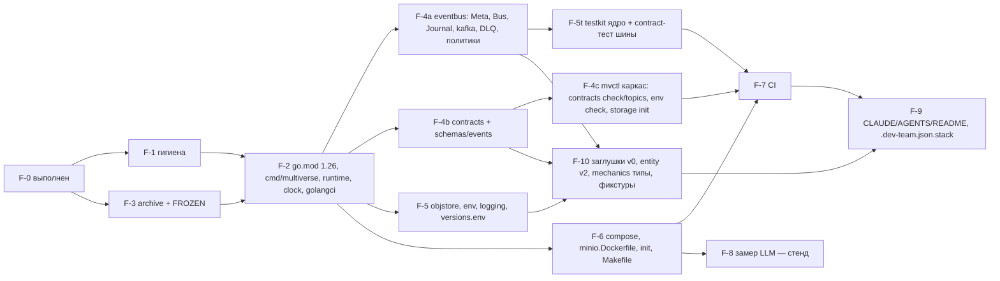

# Дизайн эпика EPIC-001 «Фундамент»

Версия 0.1 · 2026-09-09 · architect#1 (TEAM-1) · статус: к нарезке tech-lead#1 (`tasks.md`).
Команда TEAM-1 · ветка `epic/EPIC-001-foundation` (от `integration/mvp-1`) · волна 0 · G2 утверждён 2026-09-09.
Основание: `plan/epics.md` v0.2 §2 «EPIC-001», §6 (F-0…F-10); `architecture/components/foundation.md` v0.2 (детальная архитектура каркаса — здесь **не дублируется**); `architecture/contracts.md` v0.2 (C-01, §0, §17); `architecture/consolidation.md` §5, §7, §9; ADR-001/004/007/009/010 (с дополнениями), ADR-021; `architecture/infrastructure.md` (F-6/F-7 — devops); `plan/decomposition-review.md` §3.3, §5.3; `plan/teams.md` §4 (слоты волны 0).

---

## 1. Цель и границы

**Цель**: репозиторий, в котором три команды работают параллельно по контрактам v0.2 — единый модуль Go 1.26, библиотека шины с конвертом `meta` и `Journal`, реестр типов и схемы всех событий, инфраструктура одной командой (`make up`), CI без GPU, гигиена индекса, и **заглушки v0 всех межкомандных контрактов уже в `integration/mvp-1`** до старта волны 1.

**Входит** (по `epics.md` §2): F-0 (выполнен), F-1 гигиена, F-3 архив/заморозка, F-2 единый модуль + `cmd/multiverse` + `shared/{runtime,clock}`, F-4a `shared/eventbus`, F-4b `shared/contracts` + `schemas/events`, F-4c каркас `cmd/mvctl`, F-5 `shared/{objstore,env,logging}` + `build/versions.env`, F-5t `shared/testkit` ядро + contract-тест шины, F-6 compose/init/Makefile, F-7 CI, F-8 замер LLM (стенд), F-9 документация, F-10 заглушки v0 + `shared/entity` v2 + фикстуры.

**Не входит**: доменная логика (`Resolve`, инварианты, рой, gateway) — только типы C-03 и `Load` правил в F-10; очистка истории git (`git filter-repo`) — только по явной команде пользователя; перенос as-is `semantic-memory` в `internal/memory` (EPIC-005); спецификация admin-маршрутов `api/gateway.openapi.yaml` (EPIC-004; EPIC-001 даёт только `/health`).

**Что берут другие эпики**: реализации заглушек v0 (C-02/C-03 — EPIC-002 I1; C-04 — EPIC-004 I1; C-05 — EPIC-003 I1a); правки `infrastructure.md` под сведение — devops-engineer (вне кода эпика, но F-6/F-7 делаются по обновлённой версии).

---

## 2. Входящие требования (трассировка)

| Требование | Что из него в EPIC-001 | Задача | Проверка |
|---|---|---|---|
| US-010 (FR-080, FR-081, NFR-070/071/076) | `make up` поднимает инфраструктуру и процессы `core|gateway|memory` с `/health`; **частично** — критерий «глобальный GM и GM региона активны» закрывается после EPIC-003 I1b | F-2, F-6, F-7 | UC-028 шаг 1, 3 (без шага 2) |
| US-013 (FR-083, NFR-040) | `.env`/`.mcp.env` вне индекса; `gitleaks` в pre-commit и CI; плейсхолдер вместо реального ключа (U-5) | F-1, F-7 | UC-035 |
| FR-036 (конверт события, `correlation_id`) | `eventbus.Meta`, `NewRoot`/`Derive`, реестр типов | F-4a, F-4b | contract-тест, `mvctl contracts check` |
| NFR-062, NFR-063 (тесты без сети, CI ≤ 10 мин) | уровни unit/integration/e2e/contracts/security/compose-lint; membus; testcontainers | F-5t, F-7 | CI зелёный, время job'ов |
| NFR-074 (`.env.example` ↔ код) | `env.Declare`-манифест, `mvctl env check` | F-5, F-4c | job `contracts` |
| NFR-075 (единый модуль, границы) | `go.mod` один, `depguard`/`forbidigo` | F-2 | job `unit` |
| NFR-076 (замер на целевой машине) | матрица F-8 → `ops/metrics/baseline.md`, выбор по U-2 | F-8 | стенд, вне CI |
| ADR-021 / OQ-A-20 (решено на G2) | MinIO из исходников, `objstore` минимальный | F-5, F-6 | contract-тест `objstore` на testcontainers |
| `decomposition-review.md` §3.3 (заглушки существуют на старте волны 1) | F-10 | F-10 | e2e «пустой мир»: FakeState + Harness v0 + FakeNarrator на membus |

---

## 3. Подход

1. **Сначала гигиена и архив, потом модуль** (F-1 ∥ F-3 → F-2): единый `go.mod` собирается только после того, как выводимый код лежит в `services/_archive/`, иначе `go build ./...` тянет мёртвые пакеты.
2. **Библиотека шины раньше схем, схемы раньше CLI** (F-4a → F-4b → F-4c): `contracts.Validate` зависит от `eventbus.Event`; `mvctl contracts check` — от реестра.
3. **Contract-тест шины — ворота волны 1** (F-5t): membus и kafka-адаптер проходят один набор тестов; без него команды получат разную семантику `Journal.End`/DLQ.
4. **Заглушки v0 пишутся по тем же спецификациям, что реализации** (`state-and-mechanics.md` §3, §5.1; `contracts.md` C-04/C-05), сигнатуры не меняются — замена v0 реализацией в ветке поставщика не трогает потребителей.
5. **Инфраструктура параллельно коду** (F-6/F-7 — devops-engineer с подволны 0.2): compose и CI не зависят от содержимого `internal/*`.
6. **Стендовое (F-8) не блокирует** — модель является параметром блупринта; результат замера фиксируется в `baseline.md` и в `nfr.md` (BA).

---

## 4. Компоненты и порядок внутри эпика

Детальная архитектура каждого пакета — `foundation.md` §1–§10 (v0.2, с дополнениями после G2); здесь — только что и в каком порядке делается.

| Подволна | Задачи (по `teams.md` §4) | Что должно быть на выходе |
|---|---|---|
| 0.1 | F-1 (developer#1 + security-engineer), F-3 (developer#2) | `gitleaks git --redact` = 0; `services/_archive/` с `ARCHIVED.md`; `FROZEN.md` ×8; плейсхолдер в `shared/oracle/README.md` |
| 0.2 | F-2 (developer#1); F-6 старт (devops) | `go build ./... && go vet ./...` зелёные при пустых контекстах; `cmd/multiverse --contexts=all --bus=memory` отвечает `/health ok` на `MV_CORE_ADDR` |
| 0.3 | F-4a (developer#1), F-4b (developer#2), F-5 (developer#3); F-6 → F-7 (devops) | `Publish`/`Subscribe`/`Journal` на kafka и membus; все схемы §2.2 `api-contracts.md`; `objstore.Memory` + `minio`; `env.Declare` с `MV_`; `build/versions.env` |
| 0.4 | F-4c (developer#1), F-5t (developer#2), F-10 (developer#3 + architect#1); F-7 (devops); F-8 (architect#1 + человек, стенд) | contract-тест шины зелёный на обеих реализациях; `mvctl contracts check` без фантомов; заглушки v0 + фикстуры; e2e «пустой мир» |
| 0.5 | F-9 (tech-writer); долги ревью (code-reviewer#1 ×2–3) | README/CLAUDE.md/AGENTS.md по факту; тег `mvp-1/wave-0` |

### 4.1. Что специфично для эпика (не в `foundation.md`)

- **`cmd/multiverse` в волне 0** регистрирует **пустые** контексты `state|mechanics|swarm|llm|laws|gateway|memory` (`Health()=ok`, `Start/Stop` no-op) — чтобы `--contexts=all` и compose-профили работали до появления `internal/*`. Каждый владелец заменяет заглушку своим `runtime.Register` в своей ветке; `cmd/multiverse/main.go` после волны 0 меняется только через tech-lead#1 (регистрационные импорты добавляет владелец контекста одним PR).
- **`cmd/mvctl` реестр подкоманд** (`cmd/mvctl/main.go`, tech-lead#1) — таблица `name → func(args) int`; подкоманды в `cmd/mvctl/internal/<cmd>/` по владельцам (`decomposition-review.md` §5.2 п. 4): `contracts`, `env`, `storage` — EPIC-001; `world` — EPIC-002; `blueprint`, `laws`, `record` — EPIC-003; `report`, `llmusage`, `trace`, `golden`, `memory` — EPIC-005. Стандартный `flag`, без cobra.
- **`mvctl storage init`** (F-4c): `EnsureBucket(ops-artifacts)` + проверка `Capabilities()`; бакеты миров создаёт `mvctl world init` (EPIC-002).
- **`mvctl contracts check`** (F-4c, наполнение 005-ops): (а) каждая схема компилируется (2020-12); (б) каждый `Spec` имеет файл схемы и наоборот; (в) каждый тип имеет издателя и ≥ 1 потребителя по `Publishers/Consumers` реестра (исключения `world.law_breach.*`, `rules.change.*`); (г) политики топиков на фикстурах (`player_events` отклоняет `actor_kind=system`/`meta.agent`); (д) `--format=rpk` печатает команды `redpanda-init`.

---

## 5. Заглушки v0 (F-10) — состав и границы

Цель — TEAM-2 и TEAM-3 компилируются и гоняют свои e2e на `membus` с первого дня волны 1. Всё пишется по спецификациям поставщиков; **потребитель заглушку не правит** — запрос владельцу.

| Заглушка | Пакет (владелец с волны 1) | Что делает в v0 | Чего **не** делает (появится у поставщика) |
|---|---|---|---|
| `shared/entity` v2 | `shared/entity` (EPIC-002) | Полностью по `state-and-mechanics.md` §3: `Entity`, `LastChange`, `Op{set,inc,append,remove}`, `ApplyOps`, `Clone`, `CanonicalJSON`, `StateHash`, типизированные геттеры `attrs.go`, константы `types.go`, `Ref` | ничего — это не заглушка, а полная модель (EPIC-002 только дополняет при необходимости) |
| `internal/mechanics` типы + `Load` | `internal/mechanics` (EPIC-002) | `rules.go` (`RulesDocument`, `Load`, `LoadBytes`, валидация §5.2), `formula.go` (парсер мини-грамматики §5.3 — нужен для валидации при `Load`), `rng.go` (`Seed`, `NewRNG`, `Roll` — детерминизм 10 строк), типы `Actor/Action/Outcome/Item/Roll/Invariant/StateView/Violation/ProposedChange`, `Stats`, `DiceRolledPayload`, `ActorFromEntity`; `Invariants()` — 10 записей с `Check=nil`; `Resolve`, `NPCTarget`, `ChangesFor` возвращают `mechanics.ErrNotImplemented` | логика `Resolve`/`NPCTarget`/`ChangesFor`, реализации `Check` |
| `rules/dark-forest.yaml` v0.1 | `rules/` (EPIC-002) | числа приложения A PRD по §5.2 | правки чисел после прогонов (DR-04) |
| `testkit/state.FakeState` v0 | `shared/testkit/state` (EPIC-002) | `memstore` + подписка membus `system_events` на `entity.*.proposed`; применяет `ApplyOps` на копии, `version+1`, публикует `entity.created/updated` (`Derive`, `timestamp` предложения, общий `proposal_id`); отказы только `unknown_entity`, `version_conflict`, `invalid_op`, `duplicate_entity`; `atomic=true` — всё или ничего в памяти; `Seed(entities)` из фикстур; `Snapshot()` → объект + `latest.json` в `objstore.Memory` (формат §4.4) | инварианты (`WithInvariants()` — no-op с логом в v0), владение, `dead_entity`, интенты, recovery, дедуп `proposal_id` по `last_change` (только LRU) |
| `testkit/mechanics.FixedMechanics` | `shared/testkit/mechanics` (EPIC-002) | тот же набор методов, что у `*mechanics.Rules` (`Resolve/NPCTarget/Roll/Stats/Invariants`); `Resolve` — таблица исходов по `(Seed(causeEventID, rollIndexStart) mod N)`: 60 % попадание d6, 10 % крит, 10 % фамбл, 20 % промах; `NPCTarget` — первый живой кандидат по `id`; `Stats` из `rules/dark-forest.yaml`. Потребитель (EPIC-003) объявляет **свой** интерфейс на стороне потребителя с этим набором методов — `*Rules` и `FixedMechanics` ему удовлетворяют без изменения C-03 | настоящие броски по формулам |
| `testkit/gateway.Harness` v0 | `shared/testkit/gateway` (EPIC-004) | генератор `player.*` в membus **из фикстур, без HTTP**: `NewHarness(bus, fixtures)`, `CreatePlayer(id)` (публикует `entity.create.proposed` как gateway), `Enter(player, region)` (`player.entered_region` + `entity.update.proposed position/scope, cause=move`), `Look`, `Attack(player, target)`, `Flee`, `Rest` (`entity.update.proposed cause=rest`), `Say`, `Leave`; `Scenario("solo-30")` — скрипт 30 ходов; `meta.actor_kind=ci`, `correlation_id = id`, `X-Client-Id` эквивалент `source=gateway` | HTTP-клиент, `FakeGateway`, `round.*`, `group.*`, сессии/`analytics.*` |
| `testkit/swarm.FakeNarrator` v0 | `shared/testkit/swarm` (EPIC-003) | подписка membus: на `combat.decided` → `narrative.output kind=turn`, на `round.closed` → `kind=round`, на `player.looked`/`player.entered_region` → `kind=entry`; `generated_by=template`, тексты из `ru`-таблицы (≤ 10 шаблонов с подстановкой `hp`/`damage`/имени), `recipients[]` = игроки scope (из `entity.updated`-проекции или `scope.id`), `narrative_event_id = id`, `filter{applied:false,status:pass,filter_version:"none"}`, `laws_version:"v1"`, `meta.agent{id:"fake-narrator", level:"task", blueprint:"fake-narrator", blueprint_version:"0.0.0"}`, `Derive` от причины | LLM, фильтр, страж, `absence`, `background_refs`; роль встречи (`dice.rolled`/`combat.decided`/`encounter.*`) — `WithEncounterStub` не делается (C-05 v0.3, решение d); заглушка боя для I1-α — `testkit/swarm.FakeEncounter` EPIC-003 (T-219), см. §5.1 |
| Фикстуры | `testdata/fixtures/` (EPIC-001 → общие) | `{world,region,npc,players}.json`, `snapshots/state/latest.json` (seq 0) — состав `state-and-mechanics.md` §4.10 | — |

### 5.1. Граница v0 для I1-α

I1-α («соло на шаблонах через бота») = EPIC-002 I1 + EPIC-004 I1 + `FakeNarrator`. Бой с волком требует, чтобы **кто-то** вызвал `Resolve` и опубликовал `dice.rolled`/`combat.decided`/`entity.update.proposed` — в целевой архитектуре это агент встречи (EPIC-003). Чтобы I1-α не зависела от роя, эту роль на I1-α берёт **`testkit/swarm.FakeEncounter`** (EPIC-003, T-219, единственная заглушка боя): на `player.attacked` вызывает `Resolve` (реальный после EPIC-002 I1, `FixedMechanics` до него), публикует `dice.rolled`, `combat.decided`, `entity.update.proposed` (один atomic-пакет, как §7.1 `state-and-mechanics.md`), отвечает ударом волка через `NPCTarget`; издаёт `encounter.started` при первом `player.attacked` в регионе с живым NPC и `encounter.ended` при смерти/бегстве. *(Решено сведением 2, запрос d: вариант «`FakeNarrator` v0 получает режим `WithEncounterStub(rules)`» не делается — заглушка боя живёт отдельно от нарратора, ранний merge подпакета `shared/testkit/swarm` у EPIC-003.)* Это **тестовая** подмена роли `encounter` (типы событий принадлежат EPIC-003, схемы — F-4b), включается флагом только в e2e/I1-α, выключается при слиянии EPIC-003 I1b. Решение зафиксировано здесь, чтобы tech-lead#1 не искал «кто бьёт волка в I1-α».

---

## 6. Интерфейсы с другими эпиками

| Контракт | Роль EPIC-001 | Что поставляет в волне 0 | Потребители |
|---|---|---|---|
| C-01 (шина, реестр, журнал, часы, рантайм) | **поставщик** | `shared/{eventbus,contracts,clock,runtime,jsonpath}`, `schemas/events/*.v1.json` всех типов §2.2, `membus`, contract-тест | все |
| C-14 (формат снапшота) | поставщик **формата** через реестр (`snapshot.created.v1.json`, `analytics.replay.completed.v1.json` — файлы EPIC-002, но создаются в F-4b по `state-and-mechanics.md` §4.4/§4.8 и передаются владельцу) | схемы + фикстура `latest.json` | EPIC-002/003/004 |
| C-02, C-03 | заглушки v0 (F-10) | `FakeState` v0, типы `mechanics` + `Load`, `FixedMechanics`, `rules/dark-forest.yaml` | EPIC-003, EPIC-004 |
| C-04 | заглушка v0 | `Harness` v0 (генератор) | EPIC-002, EPIC-003 |
| C-05 | заглушка v0 | `FakeNarrator` v0 — только нарратив; `WithEncounterStub` не делается (C-05 v0.3, решение d), заглушка боя для I1-α — `testkit/swarm.FakeEncounter` EPIC-003 (T-219) | EPIC-004, EPIC-002 |
| C-06 (HTTP процесса) | поставщик сервера | `shared/runtime.HTTP`, `/health`, `Routes(mux)`, `AdminOnly` | EPIC-003 (маршруты), EPIC-004 (прокси), EPIC-005 |
| `contracts.OwnershipRules` (C-02) | статичная таблица MVP-1 в `shared/contracts/ownership.go` | таблица §4.6 `state-and-mechanics.md` | EPIC-002 (читает); EPIC-003 — валидатор блупринтов получает из неё вид «типы сущностей уровня»; единственная истина, копии нет (ADR-025) |
| Инфраструктура | поставщик | compose (профили), `redpanda-init` (8 топиков), `minio-init`, `build/minio.Dockerfile`, `versions.env`, CI, Makefile | все |

Никаких контрактов EPIC-001 не потребляет; после волны 0 `shared/{eventbus,contracts,entity,clock,runtime}` и `schemas/events/_common.json` меняются только через system-architect (`contract-change`).

---

## 7. Данные и миграции

- **Хранилищ у эпика нет**; создаются топики (8, retention 30/90/180, `segment.ms=1d`) и бакет `ops-artifacts`. Данные as-is (бакеты с плоским `payload`, том Redpanda v24.2) **не мигрируют** — `make archive-legacy` снимает копию в `./backups/legacy-<date>/` вне git, том Redpanda пересоздаётся (ADR-004 доп. п. 6, 8).
- **Схемы событий** — `schemas/events/<type>.v1.json`, `_common.json`, `_envelope.json`; версия 1 у всех; legacy-типы — `Deprecated: true, Schema: nil`.
- **Фикстуры** — `testdata/fixtures/` (§5), `state_hash` seq 0 пересчитывается тестом, не хранится «руками».
- **Архив кода** — `services/_archive/<путь>/ARCHIVED.md` (причина, коммит, эпик возврата) и `services/_archive/README.md` (индекс); `Docs/archive/` для документов.

---

## 8. Конфигурация

Все переменные — через `env.Declare` с префиксом `MV_` (`foundation.md` §8); `.env.example` — по `infrastructure.md` §4.2 с заменой имён на `MV_*`. Переменные волны 0: `MV_CONTEXTS`, `MV_MODE`, `MV_BUS`, `MV_KAFKA_BROKERS`, `MV_MINIO_ENDPOINT/ACCESS_KEY/SECRET_KEY/SECURE`, `MV_CORE_ADDR=127.0.0.1:8090` (в compose у `gateway` — `:8088`; T-408), `MV_MEMORY_ADDR=:8082`, `MV_BUS_VALIDATE_ON_READ=true`, `MV_LOG_LEVEL`, `MV_ID_SOURCE`; сторонние — `MINIO_ROOT_USER/PASSWORD`, `COMPOSE_PROFILES`, `OLLAMA_*`, `NEO4J_AUTH`. `build/versions.env` — пины (Go toolchain, образы, testcontainers).

---

## 9. Безопасность (что учтено)

- T-16/U-5: `gitleaks` первым шагом F-1, allowlist только `*.example`; плейсхолдер вместо реального ключа; ключ считается скомпрометированным до отзыва пользователем.
- T-3: все порты compose только на `127.0.0.1`; `compose-lint` в CI.
- T-10: политики топиков и валидация при чтении (`MV_BUS_VALIDATE_ON_READ`), `player_events` без `meta.agent`.
- T-15: CI — пины действий по SHA, `permissions: contents: read`, `go mod verify`, Dependabot, CODEOWNERS на `shared/`, `schemas/`, `.github/`.
- T-5: job `privacy-scan` для `testdata/` (в волне 0 — на фикстурах; записи появятся в EPIC-003).
- D-1: `govulncheck` блокирующий с Go 1.26.
- ADR-009 п. 9: `/v1/admin/*` только `X-Actor-Kind: ci`/оператор — `runtime.AdminOnly`; `/health` без ограничений (loopback).
- ADR-021: MinIO без security-обновлений принят осознанно на MVP-1 (loopback, доверенная машина); триггеры замены — EPIC-012.

---

## 10. Тестируемость (ADR-010) и критерии готовности

| Уровень | Тесты EPIC-001 | Критерий готовности, который закрывает |
|---|---|---|
| unit (`-short`) | `eventbus`: `NewRoot/Derive` (наследование `Timestamp`, `CorrelationID`), `Validate` на всех схемах, политики топиков, `Dedup`; `contracts`: каждый `Spec` ↔ файл схемы, примеры из `api-contracts.md` валидны; `env`: манифест, отказ имени без `MV_`; `objstore.Memory`; `clock.Manual`; `runtime.New` порядок по `DependsOn`; `entity` v2: `ApplyOps` (все op/ошибки/no-op), `StateHash` стабильность; `mechanics.Load` золотые числа + ошибки валидации, `Seed` векторы | `make ci` зелёный; покрытие `shared/{eventbus,contracts,entity}` ≥ 60 % |
| contract-тест шины (`-short` на membus, `-tags integration` на testcontainers redpanda) | порядок в топике; at-least-once (дубли по `--chaos=duplicate`); retry ×3 → `dead_letters`; `Journal.ReadRange` строго по возрастанию, `End` монотонен, `Tail` до `ctx.Done()`; `PositionFromContext`; невалидное при чтении → DLQ без handler | «contract-тест шины на testcontainers» (обязателен до волны 1) |
| integration (`-tags integration`) | `objstore` над собранным MinIO (образ из `versions.env`): `Put/Get/Stat/List/Delete`, `EnsureBucket` включает versioning+ILM, `Capabilities()`; `latest.json` после падения между PUT (эмуляция) | ADR-021 п. 2; D-6 |
| e2e (`-tags e2e`, без Docker) | «пустой мир»: `cmd/multiverse --contexts=all --bus=memory` с пустыми контекстами → `/health ok`; «заглушки v0»: `Harness.Scenario("solo-30")` + `FakeState` v0 + `testkit/swarm.FakeEncounter` (бой) + `FakeNarrator` v0 (только нарратив, без боя — `WithEncounterStub` не делается, C-05 v0.3, решение d; T-219) на membus → 30 `narrative.output`, `entity.updated` по каждому удару, нет `dead_letters` | «`testkit` содержит membus + v0 заглушек C-02…C-05» (с T-418 `membus` — в `shared/eventbus/membus`); готовность заглушек для волны 1 |
| contracts (CI job) | `mvctl contracts check` (§4.1), `mvctl env check` (`.env.example` ↔ манифест) | «`mvctl contracts check` без фантомов» |
| security (CI job) | `gitleaks`, `govulncheck`, `privacy-scan testdata/` | «секретов в HEAD нет» |
| compose-lint | пины из `versions.env`, порты `127.0.0.1`, нет паролей по умолчанию, `env_file` с токеном только у `telegram-bot`; `docker compose config -q` | «`make up` поднимает инфраструктуру» (сам `make up` — стенд, руками) |
| стенд (вне CI) | `make up` на машине владельца → `make health` = ok для `core/gateway/memory`; F-8 матрица → `baseline.md` | US-010 частично; «`baseline.md` с выбором по U-2» |

---

## 11. Отклонённые альтернативы

| Альтернатива | Почему отклонена |
|---|---|
| Оставить заглушки поставщикам «первой задачей волны 1» (`decomposition-review.md` §3.3 вариант 2) | три команды теряют первую неделю; ранние слияния в `integration/mvp-1` вне порядка 002 → 004 → 003 |
| `FixedMechanics` через изменение C-03 (интерфейс в `internal/mechanics`) | не нужно: Go-интерфейс объявляет потребитель (EPIC-003) на своей стороне с тем же набором методов; C-03 не меняется |
| Отдельный `core.openapi.yaml` для admin-маршрутов | D-7: раздел `admin` в `api/gateway.openapi.yaml` (gateway всё равно проксирует) |
| Пин на замороженный образ `minio/minio:RELEASE.2025-09-07` (ADR-021 вариант A) | известная CVE; решено пользователем на G2 — вариант B |
| Замена MinIO на SeaweedFS в волне 0 (вариант D) | новая технология на критическом пути при одном разработчике; отложено по триггерам |
| Удалить `shared/{config,schema,redis,…}`, `fake_deps`, `test_minio.go` | U-1: ничего не удалять — `services/_archive/` |
| `franz-go` вместо `kafka-go` | один брокер, одна партиция — смена клиента без выигрыша |
| YAML-реестр типов вместо Go-таблицы | компилятор ловит опечатки; тест сверяет файлы схем |
| Инициализация мира из блупринтов (`swarm.InitWorld`) в фикстурах F-10 | решено на G2: фикстуры — источник, `npc_table` — только респаун |

---

## 12. Риски и допущения

| Риск / допущение | Реакция |
|---|---|
| *(Снято сведением 2, решение d: `WithEncounterStub` в `FakeNarrator` не делается вовсе — риск «прижилась» устранён отказом от неё, а не удалением после I1. Единственная заглушка боя для I1-α — `testkit/swarm.FakeEncounter` (EPIC-003, T-219); удаление хука `MV_SWARM_FAKE` из `cmd/multiverse` остаётся критерием готовности I1.)* | — |
| Сборка MinIO из исходников архивированного репозитория не проходит на выбранном Go | отдельный `golang:1.24` builder в `build/minio.Dockerfile`; при провале — триггер (б) ADR-021 и запасной пин на замороженный образ **только для локального стенда** (не CI) с записью в журнал |
| Объём F-10 (M) при одном разработчике + архитекторе на подволне 0.4 | `shared/entity` v2 и `mechanics.Load` — специфицированы полностью (§3, §5.2 `state-and-mechanics.md`); при нехватке — `Harness` v0 сокращается до `CreatePlayer/Enter/Attack/Look` (достаточно для e2e «заглушки») |
| Расхождение имён env в `infrastructure.md` (`MV_CORE_ADDR=:8081`, имена без `MV_`) с кодом | devops правит `infrastructure.md` §1.4/§4.2 на A4 (consolidation §9); код — единственная истина через `mvctl env check` |
| Замер F-8 не успевает до конца волны 0 | не блокирует: модель — параметр блупринта; `baseline.md` может появиться в волне 1 (стенд) |
| Ветка EPIC-002 в `teams.md` названа `epic/EPIC-002-state`, в задании оркестратора — `epic/EPIC-002-state-mechanics` | tech-lead#1 фиксирует одно имя в `teams.md` до создания ветки (рекомендация — как в каталоге `epics/EPIC-002-state-mechanics`) |
| Допущение: `shared/agent` переносится в модуль как есть (типы, парсер, валидатор) без `tools/*`; его правки — EPIC-003 | если перенос ломает `go build` — временный `//go:build ignore` на проблемных файлах с задачей EPIC-003 I1a |

Связь: ADR-001, ADR-004, ADR-007, ADR-009, ADR-010, ADR-021; C-01, C-14; `foundation.md` v0.2 §14.
