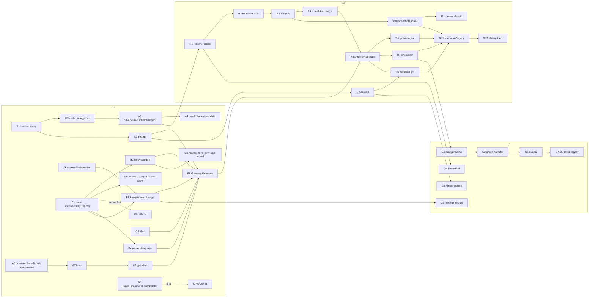

# EPIC-003 «Рой GM, LLM-шлюз, страж, законы» — дизайн эпика

Версия 0.2 · 2026-09-09 · architect#2 (TEAM-2); правки сведения 2 внесены tech-lead#2 · статус: к нарезке tech-lead#2 (Flow A, A4 шаг 2). Ветка эпика: `epic/EPIC-003-swarm-llm-laws` от `integration/mvp-1` (после `mvp-1/wave-0`).
Основание: `architecture/components/swarm-llm-laws.md` v0.2 (далее — **КД**, детальная архитектура блока; здесь не дублируется), ADR-002/005 (+ «Дополнение 2»)/008/010 (с дополнениями), ADR-001 доп. п. 7–8, ADR-014…017, `architecture/contracts.md` v0.3 (C-15 v1.1, C-05 заглушки), `architecture/consolidation.md` §4/§9 и **§10–§13 (сведение 2)**, `architecture/overview.md` §18.1, `plan/epics.md` v0.3 (EPIC-003, §2 I1-α, §5), `plan/decomposition-review.md` §2.1/§3.3, `plan/teams.md` §4, `journal.md` (решения G2; «Сведение 2 завершено»), `requirements/user-stories.md` v0.3, `analysis/use-cases.md`.

### Changelog

| Версия | Дата | Изменения |
|---|---|---|
| 0.1 | 2026-09-09 | Первая редакция (architect#2). |
| **0.2** | **2026-09-09** | **Сведение 2, внесено tech-lead#2** (architect#2 не запущен; основание — `consolidation.md` §13 строка «architect#2 / tech-lead#2»): §3.1 **B3 → B3a `openai_compat` (llama-server) первым + B3b `ollama` вторым**; §3.1 B1 — поля `Params`/`Response`, `MV_LLM_URL`/`MV_LLM_API_KEY`, гейт облака по host; §3.1 A3, §6, §11 п. 3 — стартовая модель **E `Qwen3.8-27B-UD-Q3_K_XL`, `thinking: false`**, запасные C/A по `baseline.md`; §4.1 п. 1 и §13 п. 1 — хук `MV_SWARM_FAKE` читает **`cmd/multiverse` (`fake_contexts.go`)**, `FakeContext` как `runtime.Context`, удаление хука — критерий I1; §5 схема (B3a/B3b); §8, §9 — llama-server вместо Ollama как основной рантайм стенда; §10 риск 2 — **llama.cpp #20345**; §10 риск 3/9 — переформулированы под E. Содержательных решений архитектора не добавлено — только перенос принятых в сведении 2. |

---

## 1. Цель и границы

**Цель.** Игрок получает от роя GM на Agent GM Core: (а) механически честный бой (Phase 1 без LLM), (б) нарратив на русском от персонального GM / нарратора группы через LLM-шлюз с записью каждого вызова, стражем и фильтром (a), (в) живой мир — фоновые тики глобального и регионального GM в бюджете B/час; всё воспроизводимо в replay без LLM и описано данными (блупринты, законы, правила), а не Go-кодом.

**Входит** (по `contracts.md` §0, `ownership.md`): `internal/swarm`, `internal/llm` (+`guardian`, `prompt`, `providers`, `filter`, `parser`), `internal/laws`, `shared/agent` (типы, парсер, валидатор, `levels.go`), `blueprints/*.md` (5), `laws/dark-forest-world.v1.yaml`, `schemas/agent/*.json`, `schemas/events/<типы EPIC-003>.v1.json` (26 типов), `config/absolute-limits.yaml`, `config/llm-prices.yaml`, `shared/testkit/swarm` (`FakeNarrator`, `FakeEncounter`, `RecordingWriter`), `cmd/mvctl/internal/{record,blueprint,laws}`, `testdata/{recordings,llm,golden}`, admin-маршруты `/v1/admin/agents*`, `/v1/admin/llm/usage`; `services/narrative-orchestrator` + `services/semantic-memory` — только as-is в профиле `legacy` до S5.

**Не входит**: State/механика (`internal/state`, `internal/mechanics`, `rules/*.yaml`, `mvctl world init` — EPIC-002); действия игрока, раунды, доставка, бот (EPIC-004); память C-09 и `mvctl report`/golden-набор как CLI (EPIC-005); HTTP-сервер процесса, шина, реестр, `shared/clock`/`runtime`/`objstore` (EPIC-001); фаза пробоя законов (EPIC-007), Entity-Actor/Monitor (EPIC-006), облачные провайдеры как рабочая опция (EPIC-013), адаптивный LOD (EPIC-012). Первичное создание мира из блупринтов (`swarm.InitWorld`) — не реализуется (решение G2).

**Инкременты**: I1a → I1b → I2; точка I1-α («соло на шаблонах через бота») — вклад EPIC-003 в неё минимален и описан в §4.1.

---

## 2. Трассировка требований

| US | FR / BR / NFR | UC | Инкремент | Компоненты (КД) |
|---|---|---|---|---|
| US-002 соло 30 ходов | FR-010…013, FR-120…123, BR-05, BR-10 | UC-004…008, UC-010 | I1b (сквозная приёмка — интеграция I1) | Router/Lifecycle §5–6, roles `encounter`/`personal-gm`/`region-gm` §8, journalContext §11.2 |
| US-004 нарратив асинхронно, деградация | FR-013, FR-015, FR-050…052, BR-14, NFR-001/002 | UC-020, UC-021 | I1a (шлюз, деградация) + I1b (роль, очереди) | Gateway §9, template §8.4, Scheduler §7 |
| US-011 снапшот роя, replay | FR-031…033, FR-087, NFR-010…014 | UC-025, UC-026 | I1b | Snapshot §4.3, `providers/recorded` §9.1, догон §4.3 |
| US-012 контроль LLM, бюджеты | FR-070…072, FR-125, NFR-006/007/050…053 | UC-024 | I1a (учёт, бюджет шлюза) + I1b (`BackgroundBudget`, `lod_allowed`) | budget/usage §9.3, §7.3 |
| US-014 провайдер/модели | FR-070, BR-15, NFR-046, NFR-076 | UC-030 | I1a | providers §9.1, config, `config.cloud_enabled` |
| US-015 регион из блупринта без кода | FR-090…092, FR-120, FR-124, NFR-083 | UC-029 | I1a (формат, валидатор, CLI) + I1b (спавн, S6) + I2 (FR-091 hot reload, Should) | shared/agent §13, Registry §2 |
| US-016 фильтр выхода, абсолютные запреты | FR-050, FR-051, FR-053, BR-08 (`InputFilter` FR-056 — EPIC-004) | UC-023 | I1a | filter §9.2/§13.5, prompt `<absolute_limits>` §11.4 |
| US-017 воспроизводимый прогон | FR-021, FR-032, FR-100, NFR-060/061 | UC-026 | I1a (`recorded`, `RecordingWriter`, `mvctl record`) + I1b (e2e replay) | §9.1, §18 |
| US-018 `llm.output` как события | FR-032, FR-034, FR-045, BR-04, NFR-021/022 | UC-022 | I1a | record §9.2, guardian §10, laws_version §12 |
| US-019 фича-флаг `MV_GM_PATH` | FR-014, BR-12 | UC-034 | I1b (`gm_path` из `meta`, deprecated-фильтр) → I2 (S5, архив) | §17 |
| US-036 мир живёт между сессиями | FR-037, FR-124…128, BR-10, BR-16, NFR-007/053 | UC-018, UC-019, UC-004 (сводка) | I1b | Scheduler §7, roles global/region, journalContext `Absence` |
| US-037 иерархия роя | FR-010, FR-120…123, BR-12, BR-16, NFR-034 | UC-020, UC-022 | I1a (страж `level_violation`) + I1b (Router вверх/вниз, Emitter) | §5.2, §5.4, §10 |
| US-006/US-007 (вклад) группа, раунды | FR-013, FR-025, FR-033, BR-13, NFR-005 | UC-016, UC-020 | I2 | `group-narrator`, `encounter` раунд §8.3 |
| US-005 (вклад, Must-часть) мир помнит | FR-127 | UC-004 A2 | I1b (`journalContext`), I2 (`MemoryClient` за флагом) | §11.2–11.3 |
| US-003 (вклад) `player_agency`/`level_violation` | BR-06, BR-16 | UC-022 | I1a | guardian §10.2 |
| US-010 (вклад) «глобальный GM и GM региона активны» | FR-080/081 | UC-028 | I1b | `Health()`, `agent.spawned` при старте |
| NFR-020/021/026 законы | FR-040, FR-042, FR-045, BR-02 | UC-022 | I1a | laws §12, guardian §10.4 |
| NFR-090/091 русский язык | — | UC-022 п. 2 | I1a | parser.CheckLanguage |
| NFR-041/043/048 ПДн, инъекции, контент (a) | BR-07, BR-08 | UC-023 | I1a (+ e2e I1b) | prompt escape, filter, схема без действий |

Полный список FR/NFR эпика — `epics.md` §2 EPIC-003; ответ «как обеспечивается NFR» — КД §16.

---

## 3. Инкременты: точный состав

Правило: задача ≤ M, один пакет-владелец, тесты уровня unit в той же задаче (ADR-010). Ниже — «единицы работы» (не задачи: нарезку и оценку делает tech-lead#2, §9 подсказывает, что параллельно).

### 3.1. I1a «LLM-шлюз, страж, законы, формат блупринта» (зависит только от EPIC-001: C-01, `membus`, `contracts`, `clock`)

| # | Единица работы | Пакет | Что входит | Критерий готовности единицы |
|---|---|---|---|---|
| A1 | Типы и парсер блупринта v2 | `shared/agent` (`types.go`, `blueprint.go`, `parser.go`, `placeholders.go`) | `AgentBlueprint` v2 (КД §13.1), frontmatter + секции, чистый YAML, `KnownFields(true)`, миграция плоских `llm.model` → `phase2` с предупреждением, `ContentHash`; удаление `md_parser.go`, `blueprint_loader.go`, `helpers.go`, `worker_pool.go`, `state_manager.go`, `filter.go`, `router.go`, `lifecycle.go`, `pipeline.go`, `examples/` (ADR-015 п. 6; старый код не удаляется из истории — только из пакета; `tools/*_tool.go` → `services/_archive/shared/agent/tools` уже в F-3) | `ParseFile` на 5 блупринтах MVP-1 и `testdata/blueprints/valid|invalid`; `ContentHash` стабилен |
| A2 | Реестр уровней и валидатор | `shared/agent` (`levels.go`, `validator.go`) | `AllowedEventTypes(level, role)` по `data-model.md` §4; вид «типы сущностей уровня» валидатор получает от вызывающего через `ValidationEnv`, собранный из `contracts.OwnershipRules` — единственной истины таблицы владения (`shared/contracts/ownership.go`, ADR-025, C-02 v1.4); своей таблицы `levels.go` не держит; 14 правил КД §13.2 + 7а (модели); `ValidationEnv`, `EnvFromProject(root, types, invariants, models)`; glob по сегментам | по одному invalid-файлу на правило; блупринт, чей `owned_entity_types` шире строки уровня в `contracts.OwnershipRules`, отвергается |
| A3 | Пять блупринтов + `schemas/agent` | `blueprints/`, `schemas/agent/` | `global-dark-forest-world.md`, `domain-dark-forest.md`, `encounter-wolf.md`, `player-gm.md`, `group-narrator.md` (КД §13.3; **модели — стартовая конфигурация E: `model: Qwen3.8-27B-UD-Q3_K_XL`, `thinking: false` на все фазы, комментарий-указатель `# per ops/metrics/baseline.md (OQ-A-18)`; запасные C (`qwen3:30b-a3b`) / A (`8b`+`14b`) — по итогам F-8, сведение 2, внесено tech-lead#2**); `narrative.json`, `tick-global.json`, `tick-region.json`, `breach.json` (заглушка); генерация `enum` типов тика из `allowed_event_types` | `mvctl blueprint validate blueprints/` зелёный; схемы компилируются `jsonschema/v6` |
| A4 | `mvctl blueprint validate` | `cmd/mvctl/internal/blueprint` | подкоманда в реестре mvctl (каркас — F-4c), `--offline` (пропуск 7а), вывод «файл, поле, причина, severity», код возврата | job `contracts` CI вызывает команду |
| A5 | Схемы событий EPIC-003 (часть 1: рой/тики/законы) | `schemas/events/` + PR в `shared/contracts/registry.go` | `tick.fired`, `tick.aborted`, `agent.spawned/child_resolved/stopped/spawn_rejected/blueprint_reloaded`, `encounter.started/ended`, `combat.decided`, `world.weather_changed/time_advanced/event_occurred`, `region.event_occurred`, `npc.moved/spawned`, `world.laws.changed`, `world.law_breach.*` ×5 (без издателя), `config.cloud_enabled` | тест `contracts`: схемы валидны, тип → топик; фикстуры payload по `api-contracts.md` §2.3 |
| A6 | Схемы событий (часть 2: LLM/нарратив) | `schemas/events/` | `llm.output` (+`parse{}`, `error.code` с `yielded`), `llm.output.rejected` (`reason` enum ADR-017 п. 3), `narrative.output` (+`narrative_event_id`), `content.incident.recorded`; политика `llm_records`: `meta.agent` обязателен | то же; `reason` enum один с `guardian/reasons.go` (тест) |
| A7 | Законы | `internal/laws`, `laws/dark-forest-world.v1.yaml`, `cmd/mvctl/internal/laws` | `Service{Current, Get, Watch, Strain, Bump}`, `FileSource`, `ObjectSource` (интерфейс), `document.go` (enum статусов E-B), подписка `world.laws.changed`, `mvctl laws bump|show`; `MV_LAWS_*` | unit КД §18; `Bump` публикует `world.laws.changed` + `entity.update.proposed(world.laws_version)` в `membus` |
| B1 | Типы шлюза, конфигурация, реестр провайдеров | `internal/llm` (`types.go`, `config.go`, `providers/registry.go`) | `Provider{Generate, Embed, Health, Models}` (C-15 **v1.1**), `Request/Response/Params`, `Gateway`, `Call/Result`, `ValidationStatus`, ошибки; **(сведение 2, внесено tech-lead#2)** `Params{Temperature, TopP, TopK, MinP, PresencePenalty, MaxTokens, Think}` (`Think=false` по умолчанию для всех фаз MVP-1), `Response.Tokens{Prompt, Completion, Cached}` (`Cached` — из `usage.prompt_tokens_details.cached_tokens`, 0 при отсутствии) и `Response.ReasoningLen` (длина отброшенного `reasoning_content`, сам текст не сохраняется); `MV_LLM_*` через `env.Declare`, **добавлены `MV_LLM_URL` (по умолчанию `http://127.0.0.1:1234`) и `MV_LLM_API_KEY`** (`MV_OLLAMA_URL` — только при `MV_LLM_PROVIDER=ollama`); значения `MV_LLM_PROVIDER = openai_compat \| ollama \| anthropic \| recorded \| fake`; **гейт облака по host `MV_LLM_URL`** (не loopback / не `host.docker.internal` / не RFC1918 → отказ старта без `MV_LLM_CLOUD_ENABLED=true`, ADR-005 доп. 2 п. 3); таблица цен `config/llm-prices.yaml` по ключу `(endpoint_host, model)`, локальные адреса = 0 | компилируется с `fake`; `env check` видит переменные; внешний `MV_LLM_URL` без `MV_LLM_CLOUD_ENABLED` → отказ старта |
| B2 | Провайдеры `fake`, `recorded` | `internal/llm/providers/{fake,recorded}` | `FakeProvider` (таблица `(phase, matcher) → Response`, счётчик, генерация «преамбулы» для тестов парсера), `RecordedProvider` (ключ `(correlation_id, agent.id, phase, attempt)`, чтение `*.jsonl` или журнала `llm_records`, `ErrIncompleteRecord`), `Models()` | unit; промах ключа → ошибка, не шаблон |
| **B3a** | **Провайдер `openai_compat` (llama-server) — по умолчанию** *(сведение 2, внесено tech-lead#2: U-8, ADR-005 доп. 2 п. 1–5, C-15 v1.1)* | `internal/llm/providers/openai_compat` | `Generate` → `POST /v1/chat/completions` с `response_format {type: json_schema, json_schema:{name, schema}}`, `chat_template_kwargs {"enable_thinking": Params.Think}` (**`false` для всех фаз MVP-1** — llama.cpp #20345), `stream:false`, семплинг **на запрос** из блупринта фазы (`temperature, top_p, top_k, min_p, presence_penalty, max_tokens`; профиль non-thinking `0.7 / 0.8 / 20 / 0 / 1.5` — значения по умолчанию фазы, серверные `--temp 1 …` переопределяются); `Embed` → `POST /v1/embeddings`; `Models` → `GET /v1/models` (single-model режим `-m` → одно имя, stem файла, напр. `Qwen3.8-27B-UD-Q3_K_XL`); `Health` → `GET /health` (**503 = `loading`, не `unavailable`**) + `Models` (модель блупринта отсутствует → `degraded(model_not_resident)`); токены из `usage{prompt_tokens, completion_tokens, prompt_tokens_details.cached_tokens}`, задержка из `timings` (при отсутствии — по часам шлюза); `message.reasoning_content` **не сохраняется** (только `ReasoningLen` в `llm.output.parse{}`), `strip_think` в парсере остаётся страховкой; облако — та же реализация с другим `MV_LLM_URL`/`MV_LLM_API_KEY` (гейт по host); `net/http`, без SDK | httptest с записанными ответами `/v1/chat/completions`, `/v1/models`, `/health` (200 и 503), `/v1/embeddings`; тест отмены контекста (ADR-014 п. 2); тест «`Think=false` всегда уходит в `chat_template_kwargs`»; тест разбора `usage`/`timings` |
| **B3b** | **Провайдер `ollama` native — второй** *(сведение 2: может уйти за F-8, если конфигурация E проходит замер)* | `internal/llm/providers/ollama` | `/api/chat` (`format`=схема, `think:false`, `keep_alive`, `options{num_ctx,…}`), `/api/embed`, `/api/tags` (`Models`), `/api/ps` (`Health`), токены из `prompt_eval_count`/`eval_count`, отмена контекста закрывает соединение (ADR-014 п. 2); `net/http` без модуля `ollama`; включается `MV_LLM_PROVIDER=ollama` + `MV_OLLAMA_URL` | httptest с записанными ответами; тест отмены; реализуется **только** если F-8 выбирает конфигурацию C или A (иначе задача остаётся отложенной) |
| B4 | Парсер + язык | `internal/llm/parser` | `Parse(raw, schema)` — стратегии `direct → strip_think → strip_fence → balanced_object → trailing_commas` (ADR-016 п. 1), `schema.go` (компиляция 2020-12), `CheckLanguage` (0 CJK, латиница ≤ `MV_LLM_LATIN_MAX_RATIO`, идентификаторы исключены) | корпус `testdata/llm/preamble/*.txt` (≥ 12 кейсов); обрезанный JSON → `schema_invalid` |
| B5 | Бюджет, запись, учёт | `internal/llm/{budget,record,usage}.go` | окна `(world, level, phase, provider)`, восстановление из `llm_records` при догоне (через `Journal` — интерфейс, вызов из swarm), `Recorder` (`llm.output`/`.rejected`/`content.incident.recorded` через `Derive(cause)`, `quarantined` без `response_raw`, `MV_LLM_STORE_PROMPTS` → `prompts-{world}`), `Usage` агрегаты, `GET /v1/admin/llm/usage` (монтируется на `runtime.Mux`) | unit; `record` — свойство «raw отсутствует при quarantined/filter_error» |
| B6 | `Gateway.Generate` — конвейер | `internal/llm/gateway.go` | порядок КД §9.2 (бюджет → провайдер+повторы → парсер → язык → фильтр → страж (чистая) → запись → публикация `rejected`), таймауты фаз, `MV_LLM_TIMEOUT_DEGRADED`, повтор `stale laws`, `Health()` (опрос 10 с), `config.cloud_enabled` при старте | e2e-unit на `fake`: все ветки статусов (`valid`, `partially_rejected`, `invalid`, `quarantined`, `filter_error`, `rejected_language`, `error/unavailable`, `budget_exceeded`); один `llm.output` на попытку |
| C1 | Фильтр (a) | `internal/llm/filter`, `config/absolute-limits.yaml` | `NarrativeFilter`, `CategoryAFilter` (RE2, `context_terms` окно 80), `filter_version`, встроенный словарь по умолчанию, fail-closed; `prompt_notice` | golden 0 FP + позитивные кейсы; `error` → `filter_error` |
| C2 | Страж | `internal/llm/guardian` | `Evaluate(value, Input) Verdict`, правила 3–6 × (`narrative`, `tick`), `visibility.go` (таблица КД §10.3), `reasons.go`, гипотетическое применение `ops` к копии сущности, инварианты по `check`-ключам законов, `inv-11` | таблица 9 правил × 2 вида схем (ADR-017); без шины |
| C3 | Промпт-билдер | `internal/llm/prompt` | секции КД §11.4, плейсхолдеры, `escape.go` (`<`/`>` для `player_text` и `<facts source="memory">`), `events.go` (перенос `clusterEvents/formatEventDescription` из narrative-orchestrator), `prompt_hash`; тесты переписаны из `prompt_builder_test.go` | `prompt_hash` стабилен; system неизменен между попытками |
| C4 | `FakeEncounter` + `FakeNarrator` (реализация, замена v0 из F-10) | `shared/testkit/swarm` | **для I1-α** (§4.1): `FakeEncounter` — на `player.entered_region` публикует `entity.create.proposed encounter` + `encounter.started`; на `player.attacked/flee_attempted/rested` — Phase 1 через `mechanics.Rules` (реальный `Resolve` EPIC-002 или `FixedMechanics`), `dice.rolled`, `combat.decided` ×2, `entity.update.proposed atomic`, `encounter.ended`; `FakeNarrator` — `narrative.output generated_by=template` (`template/ru.go` вынесен в `shared/testkit/swarm/template` и переиспользуется ролями I1b) на `combat.decided`/`encounter.started`/`player.looked`/`round.closed`/`entity.updated status=dead`; без LLM, без Router | e2e `solo-30` на `membus` + `FakeState` + `Harness` v0 проходит без роя: 30 ходов, 0 без ответа |
| C5 | `RecordingWriter` + `mvctl record` | `shared/testkit/swarm/recording_writer.go`, `cmd/mvctl/internal/record` | запись `llm.output` из живого прогона (`Journal.ReadRange` по `llm_records` за окно сценария) в `*.jsonl` по ключу; отказ при `actor_kind≠ci` или игроке вне `player-A/B/C`; `mvctl record diff`; `.gitattributes` уже в F-1 | запись `solo-30.jsonl` снимается на стенде (стендовая задача); unit на фикстуре |

**Готовность I1a** (`epics.md`): `mvctl blueprint validate blueprints/` зелёный на пяти блупринтах; `llm.Gateway.Generate` на `fake`/`recorded`/**живом llama-server** (`openai_compat`; Ollama — только если F-8 выберет C/A) проходит парсер → язык → фильтр (a) → страж; `llm.output` записывается; `FakeEncounter`/`FakeNarrator` реализованы и слиты в `integration/mvp-1` до I1-α; первая запись `solo-30.jsonl` снята на стенде (стенд, не блокирует слияние I1a).

### 3.2. I1b «Рой: рантайм, роли, тики, миграция» (зависит от I1a; от EPIC-002 — через заглушки v0 `FakeState`/`FixedMechanics`/`rules/dark-forest.yaml`, затем реальные)

| # | Единица работы | Пакет | Что входит | Критерий |
|---|---|---|---|---|
| R1 | Реестр блупринтов и индекс scope | `internal/swarm/{registry,scope}.go` | `LoadDir` (валидация, `/health degraded {blueprints}`), `ByTrigger`, `ScopeIndex` (`solo/group → region → world`, `PlayersIn`, `RegionOf`, `GroupOf`) из `entity.*`/`group.*`/`encounter.*` | unit на фикстурах |
| R2 | Router + Emitter + Instance | `internal/swarm/{router,emitter,instance}.go` | `Route` (КД §5.1: dedup `eventbus.Dedup`, legacy-фильтр, проекции, `Match` по glob+scope_binding, `bindScope`, `Recipients`), `Behaviour` интерфейс, таблица видимости §5.2 — как метод ролей, динамический parent §5.3, `Emitter` с белыми списками §5.4 (`ErrLevelViolation`) | таблица видимости — по кейсу на строку; Emitter отклоняет `player.*` |
| R3 | Lifecycle | `internal/swarm/lifecycle.go` | `Ensure/Stop/Touch/ExpireDue`, детерминированный `agent.id`, `agent.*` события с `content_hash`, TTL на `clock.Timers`, `MV_SWARM_MAX_AGENTS`, replay-ветка (`agent.stopped` из журнала) | unit на `clock.Manual` |
| R4 | Scheduler + BackgroundBudget | `internal/swarm/{scheduler,budget}.go` | ADR-014: две очереди, quiet-window, yield (отмена контекста → `yielded`), max_wait → rule-only, `RegisterTimer/SetTickMode/FireNow`, `tick.fired` до выполнения с `lod_allowed` (обязателен), один тик после простоя, `tick.aborted` после догона; окно бюджета из `llm.output actor_kind=system` | unit на `clock.Manual` + `FakeProvider` с задержкой |
| R5 | Pipeline + шаблоны деградации | `internal/swarm/pipeline.go`, `template` (из C4) | `HandleEvent/HandleTick`, постановка LLM-заданий, `fallback_reason`, «рестарт между Phase 1 и 2» (КД §8.4), per-instance FIFO, сериализация по `correlation_id` | unit: все `fallback_reason` |
| R6 | Роли `global-gm`, `region-gm` | `internal/swarm/roles/{global_gm,region_gm,triggers}.go` | tick-фаза (`basic` — LLM по `tick-*.json`; `rule-only` — `background_events` по весам с `Seed(tick.id, 0)`), `world.*`/`region.*`/`npc.*` + `entity.update.proposed cause=tick`; обнаружение встреч (rules, `encounter.detect_on: tick`, `chance` через `Rules.Roll`), `entity.create.proposed encounter`, `encounter.started` с `round{}` из блупринта встречи; респаун по `npc_table` (`respawn_ttl`, `died_at`, новый `entity_id`); тест согласованности `npc_table` ↔ `rules`/фикстуры | unit на `FixedMechanics` + `FakeProvider`; US-036 критерии в `membus` |
| R7 | Роль `encounter` (соло) | `internal/swarm/roles/encounter.go` | Phase 1 синхронно: `Resolve` атаки/бегства/`npc_attack`, `dice.rolled` ×k до `combat.decided`, один `entity.update.proposed atomic` с `expected_version`, трофей один раз, `encounter.ended reason=npc_dead|players_out`, `agent.child_resolved`; `rest` во встрече — не его дело (State отклоняет) | unit: seed-детерминизм, `flee` провал → свободная атака, смерть игрока |
| R8 | Роль `personal-gm` | `internal/swarm/roles/personal_gm.go` | таблица триггеров КД §8.2 (`entry` c `absence`, `turn` по последнему событию цикла, `world_event`, `death`), Phase 2 через `Gateway`, `narrative.output` (`recipients`, `based_on[]`, `background_refs[]` ⊂ контекста, `absence{}`, `filter{}`, `laws_version`, `narrative_event_id`), rule-only в группе | unit: по кейсу на строку таблицы; один вызов на ход |
| R9 | Контекст: WorldView, journalContext, builder, `NopMemory` | `internal/swarm/context/` | проекция сущностей (старт из `state/latest.json`, далее `entity.*` по `version`), `EventWindow`/`BackgroundIndex`/`Presence`/`Absence` (КД §11.2), `builder.go` → `prompt.Sections`, `MemoryClient` интерфейс + `NopMemory` (реализация HTTP — I2) | unit: `Absence` по паузе ≥ 30 мин; страж пропускает только `background_refs` из контекста |
| R10 | Snapshot + догон | `internal/swarm/{snapshot,runtime,swarm}.go` | `SwarmSnapshot` (КД §4.3), триггеры, `K=5`, `latest.json`-указатель, `snapshot.created component=swarm`; `Context{Start, Stop, Health}` для `shared/runtime`; фаза догона через `Journal.ReadRange…End` без эмиссии; `Subscribe` consumer-group `core.swarm`; `MV_BUS_VALIDATE_ON_READ` | integration (testcontainers Redpanda+MinIO): рестарт → `llm_calls=0`; unit round-trip + `state_hash` |
| R11 | Admin-маршруты и `/health` | `internal/swarm/admin.go` | `GET /v1/admin/agents`, `POST /v1/admin/agents/{id}/tick` (→ `FireNow`, `actor_kind=ci`) на `runtime.Mux`; `Health()`: `agents_by_level`, `blueprints`, `laws: unknown_check`, `swarm: region_missing`; раздел `admin` в `api/gateway.openapi.yaml` — согласовать с EPIC-004 (текст маршрутов даёт EPIC-003) | httptest; `/health` процесса содержит `agents_by_level` |
| R12 | Миграция I1-0…I1-3 и профиль `legacy` | `swarm/router.go` (deprecated-фильтр), `emitter.go`/`llm/record.go` (`gm_path` из `meta`), compose (`legacy` — совместно с devops) | `MV_GM_PATH` не читается `core`; `gm_path` в `combat.decided`/`llm.output`; профиль `legacy` работает (или принят запасной критерий S5 — решение F-6) | ручная проверка профиля на стенде |
| R13 | e2e и golden | `test/e2e/`, `internal/llm/golden_test.go`, `testdata/recordings/` | `solo-30` (S1), `background-6h` (S14, admin-тики, ≤ B), `death`, `flee-fail`, `injections-10` (0 `entity.updated` от нарратива, 0 `world.law_breach.proposed`), `degraded` (`fake` → ошибка → 100 % шаблонов), `recovery` (рестарт контекстов в процессе → `llm_calls=0`, `identical=true`); golden 20 ходов + 3 тика (эталоны — вместе с 005-ops) | все в CI ≤ 10 мин без GPU на `--mode=replay --bus=memory` |

**Готовность I1** (`epics.md`): S1 (нарратив на записях в CI; **живой llama-server на стенде**, сведение 2), S14 с ускоренными тиками, **удалён хук `MV_SWARM_FAKE` из `cmd/multiverse`** (критерий тега, ADR-001 доп. п. 8), S6 (второй регион блупринтом + фикстурой), S3 (снапшот роя восстанавливается); слияние в `integration/mvp-1` последним (002 → 004 → 003) — тег `mvp-1/i1`.

### 3.3. I2 «Группа, память, завершение миграции» (старт — по приёмке I1 tech-lead#2; слияние — после интеграционного прогона I1; порядок волны 2: 002 → **003** → 004 → 005)

| # | Единица работы | Пакет | Что входит | Зависит от |
|---|---|---|---|---|
| G1 | Раунд группы в `encounter` | `roles/encounter.go` | `round.closed` → порядок `acted[]`, `NPCTarget` (искл. `idle/out_of_combat/dead`), один `npc_attack` с `causeEventID = round.closed.id`, `idle` после 2 `auto_defended` (`entity.update.proposed participation`), `group.left` во встрече = `flee` (BR-13), `players_out` | EPIC-002 I2 (atomic группы, `Participation`) — до слияния; до того `FakeState` |
| G2 | Роль `group-narrator` | `roles/group_narrator.go`, `blueprints/group-narrator.md` (уже в A3) | Phase 2 `round` по завершению раунда (последнее `combat.decided npc_attack` или `encounter.ended`), `recipients[]` = `active|idle|out_of_combat`, один `narrative_event_id`; `turn`/`world_event` вне встречи; TTL по любому участнику; `personal-gm` в группе — rule-only (`entry` с `absence` — LLM, иначе шаблон) | R8, G1 |
| G3 | `MemoryClient` HTTP (C-09) | `context/memory.go` | `MV_MEMORY_URL`, таймаут 500 мс, деградация в `journalContext`, `<facts source="memory">` с экранированием (SEC-17), `NopMemory` в replay | 005-memory (Should; без него — флаг пуст, поведение I1) |
| G4 | Горячая перезагрузка блупринтов (FR-091, Should) | `registry.go` | fsnotify каталога → новая версия к следующему спавну и timer-агентам на следующем тике; `agent.blueprint_reloaded {content_hash}` | R1 |
| G5 | Лимиты Should | `llm/budget.go` | `MV_LLM_TURN_CALLS_PER_MIN` (интерактив), облачный денежный лимит → переключение/шаблон | B5 |
| G6 | e2e I2 | `test/e2e/` | `group-3x30` (S2, `rounds/close` от харнесса), `injections-10` + ≥ 3 инъекции через память, S6 повтор | G1, G2 |
| G7 | Завершение миграции (S5) — **последняя задача I2, после зелёного S2** | compose, `shared/contracts` (через system-architect), `services/_archive/` | перенос `narrative-orchestrator` + `semantic-memory` в `services/_archive/` с `ARCHIVED.md`, снятие профиля `legacy` и `chromadb`, deprecated-типов, `MV_GM_PATH` (EPIC-004 убирает чтение флага у себя) | все |

**Готовность I2**: S2 (раунды группы, 30 раундов ≥ 60 действий), S5, S6; тег `mvp-1/i2`.

---

## 4. Точка I1-α и заглушки

### 4.1. I1-α «соло на шаблонах через бота» — минимальный вклад EPIC-003

Состав точки (`epics.md` §2): EPIC-002 I1 + EPIC-004 I1 + заглушка нарратива. Без роя: `combat.decided`/`encounter.started`/`dice.rolled`/`entity.update.proposed` в бою **некому публиковать** (типы EPIC-003, а `dice.rolled` — EPIC-002, но издаёт агент встречи). Поэтому заглушка v0 из F-10 (`FakeNarrator`: шаблон на `combat.decided`) для игры недостаточна — нужна заглушка Phase 1.

Минимально необходимое от EPIC-003 (единица C4, первая волна I1a, слить в `integration/mvp-1` сразу после приёмки tech-lead#2, до I1-α):

1. **`testkit/swarm.FakeEncounter`** — подписчик `player_events` в процессе `core`. **Форма включения решена (сведение 2, запрос e, ADR-001 доп. п. 8; внесено tech-lead#2)**: флаг `MV_SWARM_FAKE=true` читает **`cmd/multiverse`**, а не контекст `swarm` (на момент I1-α `internal/swarm` в `integration/mvp-1` ещё нет — контексту негде читать флаг). Файл-хук — **`cmd/multiverse/fake_contexts.go`**: при `MV_SWARM_FAKE=true` под именем контекста `swarm` регистрируется **`shared/testkit/swarm.FakeContext` — тип, реализующий `runtime.Context` (`Start/Stop/Health`)** и поднимающий внутри себя `FakeEncounter` + `FakeNarrator`; при наличии `internal/swarm` регистрируется настоящий контекст вместо фейкового. Это **единственный разрешённый импорт `shared/testkit/*` в production-бинарнике** (исключение `depguard` по файлу); `shared/testkit/swarm` не должен зависеть от `testify` и тестовых пакетов. **Хук удаляется при слиянии EPIC-003 I1 — это критерий готовности I1 (тег `mvp-1/i1`)**; сами фейки остаются в `shared/testkit/swarm` для unit/e2e на `membus`. Файл `cmd/multiverse/fake_contexts.go` — совладение с EPIC-001: правка идёт PR через tech-lead#1.
   - `player.entered_region` → если в регионе есть живой NPC из фикстур и нет активной встречи → `entity.create.proposed {encounter}` → `encounter.started {…, round{60s, 2}}` (немедленно, без тика — упрощение I1-α; в I1b — по тику региона);
   - `player.attacked` → `mechanics.Rules.Resolve` (реальный из EPIC-002 I1; если ещё нет — `FixedMechanics`) → `dice.rolled` ×4 → `combat.decided` ×2 → `entity.update.proposed atomic` с `expected_version` из `FakeState`/State → при смерти NPC `encounter.ended reason=npc_dead`; `player.flee_attempted` → бросок бегства, при провале свободная атака;
   - `gm_path` из `meta.gm_path`, `meta.agent = {id: "fake-encounter:solo:…", level: task, blueprint: encounter-wolf}` (политики `llm_records`/`system_events` требуют `meta.agent` для типов роя — соблюдаем).
2. **`testkit/swarm.FakeNarrator`** (реализация вместо v0) — `narrative.output generated_by=template fallback_reason=unavailable filter{applied:false} laws_version=v1` на `player.entered_region` (`entry`), `player.looked` (`turn`), `encounter.started` (`world_event`), последнее `combat.decided` цикла (`turn`), `entity.updated(player) status=dead` (`death`), `round.closed` (`round`, для EPIC-004 I2). Шаблоны — `shared/testkit/swarm/template/ru.go`, те же используются ролями в I1b (переезд в `internal/swarm/template` — при R5, экспорт через testkit остаётся).
3. **Без LLM** (`MV_LLM_PROVIDER` не читается). Вариант «с `fake`-провайдером» появляется только с R5/R8 (I1b) — тогда I1-α+ можно прогонять на реальном рое с `MV_LLM_PROVIDER=fake`; для самой точки I1-α это не требуется.

Что проверяет человек на I1-α (в части EPIC-003): бой с волком доходит до `combat.decided` и `entity.updated`, нарратив приходит отдельным сообщением с пометкой шаблона, смерть/трофей/бегство работают. Замечания к шаблонам → задачи EPIC-003 I1b.

### 4.2. Заглушки, которые эпик потребляет

| Контракт | Заглушка | Откуда/когда | Как используем | Замена |
|---|---|---|---|---|
| C-01 шина/журнал/реестр | `membus` (`shared/eventbus/membus`, с T-418; +`Journal`, `Dedup`, `--chaos=duplicate`), `shared/contracts` со схемами `_common` | EPIC-001, волна 0 | все unit/e2e; свои схемы добавляем в `schemas/events/` + PR в реестр (A5/A6) | kafka-адаптер в integration |
| C-02 факты State | `testkit/state.FakeState` v0 (ops в память, факты, без инвариантов; `WithInvariants()` — позже) | F-10 (v0) → EPIC-002 I1 | WorldView, `expected_version`, `entity.create.proposed encounter/npc` | реальный State при интеграции I1 (слияние 002 раньше 003) |
| C-03 механика | `internal/mechanics` типы + `Load` + `rules/dark-forest.yaml` (F-10), `testkit/mechanics.FixedMechanics` (табличные исходы по seed) | F-10 → EPIC-002 I1 (`Resolve`) | R7/G1/C4 компилируются против типов C-03 v1.1; `Invariants()` для стража — при отсутствии реализации страж получает пустую карту → `/health degraded {laws: unknown_check}` (ожидаемо до слияния 002) | реальный `Resolve/Invariants` |
| C-04 действия игрока | `testkit/gateway.Harness` v0 (генератор `player.*` из фикстур в `membus`, без HTTP) | F-10 → EPIC-004 | e2e `solo-30`, `death`, `flee-fail`; `round.closed` для G1 генерирует харнесс | HTTP-харнесс EPIC-004 при интеграции |
| C-09 память | `internal/swarm/context/journal.go` — **штатная деградация** (не тест) | сами, R9 | всегда; `MV_MEMORY_URL` пуст | `MemoryClient` HTTP в G3, если 005-memory не отрезана |
| C-14 `state/latest.json` | фикстура `testdata/fixtures/snapshots/state/latest.json` (F-10) | F-10 | старт WorldView в unit/e2e | реальный указатель State |
| часы/таймеры | `clock.Manual`, `ManualTimers` (EPIC-001) | волна 0 | Lifecycle/Scheduler unit | `EventClock`/`NullTimers` в replay (EPIC-002 `internal/replay`, внедряет `cmd/multiverse`) |

Правило: заглушку потребитель не правит — запрос владельцу (через tech-lead#1).

### 4.3. Заглушки, которые эпик поставляет

| Контракт | Заглушка | Кому | Когда |
|---|---|---|---|
| C-05 нарратив/механика | `testkit/swarm.FakeNarrator` (реализация) + **`FakeEncounter`** (§4.1) | EPIC-004 (e2e gateway/бота, I1-α), EPIC-002 (e2e `solo-30` на «FixedNarrator» = `FakeNarrator`) | I1a, первая волна |
| C-06 тики/admin | `FireNow` в `--mode=replay`; до готовности роя харнесс EPIC-005 генерирует `tick.fired` в `membus` сам (C-06) — от нас только схема (A5) | EPIC-005 | A5 (схема) / R4 (`FireNow`) |
| C-07 записи LLM | `testkit/swarm.RecordingWriter`, `providers/fake` как источник записей; `testdata/recordings/*.jsonl` | EPIC-005 (golden, `llm usage`), EPIC-002 (`replay`) | C5 (I1a), записи — стенд |
| C-11 формат блупринта | `agent.Validate` + `mvctl blueprint validate`; `testdata/blueprints/valid|invalid` | авторы, EPIC-005 (`contracts check` вызывает) | A2/A4 |
| C-12 законы | `laws/dark-forest-world.v1.yaml`, схемы `world.law_breach.*` (без издателя) | EPIC-007 | A5/A7 |
| C-15 провайдер | `Provider` + `providers.Registry`; `fake`/`recorded` | EPIC-013 (облако), EPIC-005 (`Embed`) | B1/B2 |

---

## 5. Порядок внутри эпика и внутренние зависимости

Порядок, заданный оркестратором (шлюз → законы/страж → блупринты/валидатор → роутер/lifecycle → планировщик/тики → пайплайн → нарратор группы), соблюдается по критическому пути `B1 → B6 → R5 → R8 → G2`; при трёх разработчиках три независимых потока I1a: **A** (`shared/agent` → блупринты → CLI → законы), **B** (шлюз: типы → провайдеры → парсер → бюджет/запись → `Generate`), **C** (схемы событий → фильтр → страж → промпт → `FakeEncounter/FakeNarrator` → `RecordingWriter`). Пересечений по файлам между потоками нет (`A7 laws` зависит от `A5` схем — оба в потоке A/C по договорённости тимлида; `C2 guardian` импортирует типы `laws` — B/C ждут A7 только на этапе компиляции стража, до этого — локальный интерфейс `LawsVersion`).

I1b — три потока: **рантайм** (R1 → R2 → R3 → R4 → R5), **роли** (R7 на `FixedMechanics` можно начинать сразу после R2-интерфейсов `Behaviour/Emitter`; R6, R8), **контекст/снапшот/admin** (R9 → R10 → R11). Последняя волна I1b — R12 + R13 (все три).

Внешние зависимости по времени: EPIC-002 I1 (`Resolve`, State) нужен к R7/R13 — до слияния используем заглушки; EPIC-004 I1 (`Harness` HTTP) — только для интеграции I1; EPIC-005 — ничего не блокирует.

---

## 6. Данные

| Артефакт | Содержание | Владелец / где | Инкремент |
|---|---|---|---|
| `blueprints/{global-dark-forest-world,domain-dark-forest,encounter-wolf,player-gm,group-narrator}.md` | формат v2 (КД §13.1, §13.3); **модели: E стартово (`Qwen3.8-27B-UD-Q3_K_XL`, `thinking: false`), запасные C/A по итогам F-8** (сведение 2), комментарий-указатель на `baseline.md`; семплинг фазы (`temperature/top_p/top_k/min_p/presence_penalty/max_tokens`, non-thinking-профиль по умолчанию); `round{60s,2}` в `encounter-wolf`; `budget.background_calls_per_hour_world: 4` в global; `respawn_ttl: 24h`, `npc_table` (только респаун), `background_events[]`, `encounter{detect_on: tick, chance}` в domain | EPIC-003, `blueprints/` | A3 |
| `schemas/agent/{narrative,tick-global,tick-region,breach}.json` | схемы structured output (КД §13.4); `enum` тика подставляется из `allowed_event_types` | A3 | I1a |
| `schemas/events/<26 типов>.v1.json` | JSON Schema 2020-12, `$ref` `_common.json`; payload по `api-contracts.md` §2.3.6–2.3.15 + дополнения v1.1 | A5/A6; регистрация — PR в `shared/contracts/registry.go` (ревью system-architect) | I1a |
| `laws/dark-forest-world.v1.yaml` | `inv-1…inv-11` (`check`-ключи ↔ `mechanics.Invariants().ID`), декларативные `law-1…` (уточняет автор) | A7 | I1a |
| `config/absolute-limits.yaml` | `filter_version`, `prompt_notice`, категория (a) `terms`/`context_terms`, реестр (b)–(g) `enabled=false` | C1 | I1a |
| `config/llm-prices.yaml` | цены за 1k токенов по ключу **`(endpoint_host, model)`** (сведение 2, ADR-005 доп. 2 п. 3); локальные адреса (llama-server, Ollama) = 0 | B1 | I1a |
| `testdata/recordings/{solo-30,death,flee-fail,injections-10,background-6h,recovery}.jsonl` (I1), `group-3x30.jsonl` (I2) | строки `llm.output` с ключом; только `actor_kind=ci`; `merge=binary` | C5 + стенд | I1b / I2 |
| `testdata/llm/preamble/*.txt` | корпус «грязных» ответов Qwen3 (преамбула, `<think>`, код-блоки, trailing commas, обрезка) | B4 | I1a |
| `testdata/golden/*.json` | 20 ходов + 3 тика с эталонами (схема, язык, числа, фильтр) | R13 + 005-ops | I1b |
| `shared/agent/testdata/blueprints/{valid,invalid}/*.md` | по файлу на правило валидатора | A2 | I1a |
| `snapshots-{world}/swarm/{ts}-{seq}.json` + `latest.json` (MinIO) | `SwarmSnapshot` (КД §4.3), `K=5` | R10 | I1b |
| `prompts-{world}/{cid}/{agent}/{phase}-{attempt}.txt` (MinIO, по флагу) | полный промпт; ILM 30 дней, versioning off (devops) | B5 | I1a |

Модель данных агента (`AgentInstance`), снапшота и индексов — КД §4.2–4.3, §11.2; изменений относительно `data-model.md` §6–§7 нет.

---

## 7. Изменения API / событий / конфигурации

- **События (совместимые, уже в contracts v0.2)**: `llm.output.parse{}`, `error.code=yielded`, `narrative.output.narrative_event_id`, `tick.fired.tick.lod_allowed` (обязателен), `agent.spawned.content_hash`, `encounter.started.round{}`, `config.cloud_enabled{by, provider, allow_external_players}`. Новых типов вне реестра ADR-007 нет.
- **HTTP**: `GET /v1/admin/agents`, `POST /v1/admin/agents/{id}/tick`, `GET /v1/admin/llm/usage` — маршруты на сервере процесса `core` (`MV_CORE_ADDR`), описание — раздел `admin` `api/gateway.openapi.yaml` (файл EPIC-004; текст маршрутов даёт EPIC-003 задачей R11 через tech-lead#3). Доступ — только `ci`/operator через прокси gateway (ADR-009 п. 9).
- **CLI** (`cmd/mvctl`, реестр — tech-lead#1): `blueprint validate [--offline] <dir>`, `laws bump --world … --from <file>`, `laws show --world …`, `record --scenario <name> --from <journal|jsonl> --out <file>`, `record diff`.
- **Env**: таблица КД §14 (все `MV_*`), объявление через `shared/env.Declare`; **(сведение 2)** добавлены `MV_LLM_URL` (по умолчанию `http://127.0.0.1:1234`; из контейнеров `http://host.docker.internal:1234`), `MV_LLM_API_KEY` (только облако), `MV_SWARM_FAKE` (читает `cmd/multiverse`, не контекст); `MV_LLM_PROVIDER` по умолчанию `openai_compat`; `MV_OLLAMA_URL` — только при `MV_LLM_PROVIDER=ollama`; `.env.example` — правка через tech-lead#1/devops (NFR-074).
- **Зависимости `go.mod`** (пометка для tech-lead#1): `github.com/santhosh-tekuri/jsonschema/v6` (уже в F-4), `gopkg.in/yaml.v3` (уже), `github.com/fsnotify/fsnotify` (только G4, I2 — Should; можно заменить опросом каталога по `clock.Timers` и не добавлять зависимость — рекомендую опрос раз в 5 с).
- **Compose/CI** (через devops): профиль `legacy` (D-3); **(сведение 2)** LLM-рантайм — нативный llama-server **вне compose** (`scripts/llm-server.ps1`, `make llm-up/llm-down/llm-health`, проверка `GET $MV_LLM_URL/health` в `make up`); профиль `gpu` (Ollama) и `OLLAMA_*` — опционально, только для конфигураций C/A; job `contracts` вызывает `mvctl blueprint validate`, job `privacy-scan` для `testdata/`.

---

## 8. Безопасность (по `threat-model.md`, ADR-009)

| Угроза / SEC | Мера в эпике | Где проверяется |
|---|---|---|
| SEC-17 инъекции через `say` и память | `<player_text>`/`<facts source="memory">` — данные с экранированием `<`/`>`, лимит 500; схема Phase 2 без действий; фаза пробоя выключена | `prompt/escape_test.go`; e2e `injections-10` (0 `entity.updated` от нарратива, 0 `law_breach.proposed`) |
| SEC-21 блупринт выбирает облако | поля провайдера нет (`KnownFields`), модель ∈ `Provider.Models()`, облако только `MV_LLM_CLOUD_ENABLED` + `config.cloud_enabled {by, provider, endpoint_host}` без ключей; **(сведение 2)** «облако» определяется **адресом `MV_LLM_URL`**, а не именем провайдера: не-локальный host без `MV_LLM_CLOUD_ENABLED=true` → провайдер не стартует | валидатор 7а; тест гейта по host (loopback / `host.docker.internal` / RFC1918 → старт; внешний → отказ); тест «событие не содержит подстрок ключей» |
| SEC-23 ПДн в записях/golden | `mvctl record` принимает только `actor_kind=ci` и `player-A/B/C`; `privacy-scan` | C5 unit; CI `security` |
| NFR-041 ПДн в промптах/логах | в промпт только `player_id`, имена персонажей, текст `say`; `slog` без payload `say` (только длина/хэш) | тест NFR-041 (EPIC-005) читает `llm_records` и логи |
| NFR-048 контент (a) | фильтр до записи `response_raw`; `quarantined` без raw; fail-closed при ошибке фильтра | C1 unit; `record` свойство |
| SEC-10 разметка в нарративе | шаблоны и схема — plain text; бот без `parse_mode` (EPIC-004) | golden: текст без `<`/`*`-разметки |
| BR-16 уровни через данные | белые списки уровня: типы событий — `levels.go`, типы сущностей — строка уровня в `contracts.OwnershipRules` (ADR-025), обе ⊇ блупринт; `Emitter` и страж; State — последняя линия (`contracts.OwnershipRules`) | A2 (валидатор против `contracts.OwnershipRules`); R2; C2 |
| Отмена фонового вызова (ADR-014) | `providers/openai_compat` (и `providers/ollama`, если реализуется) закрывает соединение по `ctx`; нет утечки горутин | **B3a** тест отмены (B3b — при реализации), `goleak` в unit |
| admin-маршруты | только через прокси gateway (`ci`/operator), `MV_CORE_ADDR` на `127.0.0.1`; в compose порт не публикуется наружу кроме `127.0.0.1:8090` | compose-lint (EPIC-001) |

Секретов в блоке нет; ключи облака — только env `MV_*_API_KEY`, в события/логи не попадают (тест на `config.cloud_enabled` и `llm.output`).

---

## 9. Тестируемость (ADR-010)

| Уровень | Что | Инструменты | Инкремент |
|---|---|---|---|
| unit (`-short`) | всё из КД §18 по пакетам; таблицы: видимость (§5.2), триггеры (§8.2), страж 9×2, валидатор 15 правил, парсер ≥ 12 кейсов, планировщик (quiet/yield/max_wait/бюджет/один тик), Lifecycle TTL, Emitter, шаблоны всех `kind`, `record`-свойства, `prompt_hash` | `membus`, `FakeProvider`, `FakeState`, `FixedMechanics`, `clock.Manual`, `goleak` | I1a/I1b |
| integration (`-tags integration`) | подписка/дедуп/DLQ/`MV_BUS_VALIDATE_ON_READ` через testcontainers Redpanda; снапшот роя + `latest.json` в MinIO (образ из `build/minio.Dockerfile`, `testkit.Versions()`); догон `ReadRange…End`; `providers/openai_compat` (и `ollama`, если реализуется) против httptest — **живой llama-server только стенд (сведение 2)** | testcontainers-go | I1b |
| e2e (`-tags e2e`) | `cmd/multiverse --contexts=all --mode=replay --bus=memory --recording=…`: `solo-30`, `background-6h` (admin-тики, ≤ B), `death`, `flee-fail`, `injections-10`, `degraded`, `recovery`; I2: `group-3x30`; до готовности EPIC-002/004 — на `FakeState`/`Harness` v0, после интеграции — на реальных | `providers/recorded`, `EventClock`, `--id-source=sequence`, `--chaos=duplicate` | I1b / I2 |
| golden (NFR-065) | 20 ходов + 3 тика: схема, язык, числа механики не противоречат `combat.decided`, фильтр `pass`, 0 FP фильтра | `internal/llm/golden_test.go`; эталоны — 005-ops | I1b |
| детерминизм (NFR-061) | два прогона `solo-30` → равные хэши последовательности доменных событий; `prompt_hash` стабилен между прогонами при `NopMemory` | e2e | I1b |
| стенд (вне CI, человек + tester#2/architect#2) | F-8 → модели в блупринтах; запись `solo-30.jsonl`, `background-6h.jsonl`, `death`, `flee-fail`, `injections-10` (`mvctl record`); живой S1/S14 **на llama-server (`openai_compat`, `scripts/llm-server.ps1`, `make llm-up`); Ollama — только если F-8 выберет C/A** (сведение 2); профиль `legacy` (S5); nightly-gpu матрица (`scripts/llm-bench.ps1` → `baseline.md`, `valid_first_try`, `phase2 p95`, язык, `usage`/`timings`) | целевая машина RTX 4090 | конец I1a (первая запись), конец I1b, конец I2 |

Покрытие ≥ 60 % по `internal/{swarm,llm}` — job `unit` (NFR-064). Записи обновляются только осознанной задачей с ревью диффа нарративов (ADR-010 доп. п. 2).

---

## 10. Риски и реакции

| # | Риск | Вероятность / влияние | Реакция |
|---|---|---|---|
| 1 | Объём XL (~35 единиц), критический путь MVP-1 | высокая / высокое | три независимых потока I1a (§5); `FakeEncounter`/`FakeNarrator` первыми — I1-α не ждёт рой; e2e на заглушках до интеграции; задача ≤ M; стендовые задачи вне слотов |
| 2 | Structured output Qwen3: преамбула/`<think>`/обрезка → низкий `valid_first_try`. **(сведение 2, внесено tech-lead#2)** Добавлен риск **llama.cpp #20345** (открыт с 2026-03): при включённом thinking грамматика `json_schema` **не применяется** — llama-server может вернуть markdown-обёртку или чужие поля вместо валидного JSON | средняя / среднее (лишние секунды GPU, деградации) | **`chat_template_kwargs.enable_thinking=false` на каждом запросе со схемой (B3a), `Params.Think=false` — значение по умолчанию всех фаз MVP-1**; стратегия `strip_think` в парсере (B4) остаётся как страховка даже при выключенном thinking; **пин билда llama.cpp** (справочная запись `build/versions.env` у devops) — обновление рантайма может изменить API/грамматику; парсер с восстановлением (ADR-016) + корпус `preamble`; повтор с подсказкой в `user`; метрика `parse.strategy` в `llm.output`; если после замера `valid_first_try < 80 %` — уменьшить `max_tokens`/упростить схему (данные, не код) |
| 3 | VRAM: **(сведение 2)** конфигурация E (`Qwen3.8-27B-UD-Q3_K_XL` 13,1 ГБ + KV 256 КиБ/токен ≈ 2 ГБ @8k / 4 ГБ @16k → 16–19 ГБ) помещается в 24 ГБ с запасом; риск смещается на **скорость** dense-27B (p95 NFR-002) и на запасные C (`30b-a3b` ≈ 21–23 ГБ, впритык) / A | низкая по VRAM / средняя по p95 (NFR-002) | модель и семплинг — параметры блупринта; порядок отката E → C → A фиксируется в `baseline.md` (F-8); `MV_LLM_NUM_CTX` в env, KV f16/q8_0 — материал замера; переключение на две модели (A/E+) требует router-режима llama-server или второго процесса (devops, `scripts/llm-server.ps1`); I1a/I1b пишутся против `fake`/`recorded` — замер не блокирует |
| 4 | Замер F-8 задерживается → живой S1 в конце I1b без `baseline.md` | средняя / низкое | **стартово E в блупринтах (сведение 2)**; живой прогон допускается с любой из E/C/A; критерий I1 «на записях в CI» не зависит от замера |
| 5 | `Journal.ReadRange`/`End` семантика `membus` ≠ kafka → догон роя ведёт себя иначе на стенде | низкая (contract-тест F-5t) / высокое | R10 integration на testcontainers обязательна до слияния I1; расхождения — запрос к EPIC-001 |
| 6 | `mechanics.Invariants()` EPIC-002 приходит позже стража → `check`-ключи не сопоставлены | высокая в I1a / низкое | страж получает карту инвариантов через `Input`; при пустой карте — правило 6б пропускается с `/health degraded {laws: unknown_check}`; unit-тесты стража на собственных фейковых `Invariant` |
| 7 | Профиль `legacy` нежизнеспособен → S5 не проверяем | средняя / низкое | запасной критерий S5 (КД §17), решение до волны 1 (F-6) |
| 8 | Записи устаревают при изменении промптов/схем | высокая / среднее | ключ записи не зависит от текста промпта; `prompt_hash` расхождение — предупреждение, не ошибка; перезапись — задача с ревью; golden отдельно от записей |
| 9 | Отмена фонового вызова не освобождает GPU (рантайм держит генерацию после закрытия соединения; **проверяется для llama-server, сведение 2**; для Ollama — если F-8 выберет C/A) | низкая–средняя / среднее | замер на стенде в R4; если не освобождает — `MV_SWARM_BACKGROUND_QUIET` увеличить и фон только `rule-only` при активных сессиях (данные/env, не код) |
| 10 | Строки уровней роя в `contracts.OwnershipRules` отстают от блупринтов (таблица одна — `shared/contracts/ownership.go`, ADR-025) | низкая / высокое (State отклоняет предложения роя) | валидатор блупринтов сверяет `owned_entity_types` с таблицей (A2); строку уровня меняет EPIC-003 PR с меткой `contract-change` и ревью system-architect + tech-lead#1, в описании — затронутые блупринты |
| 11 | Раздел `admin` в `api/gateway.openapi.yaml` принадлежит EPIC-004 — гонка правок | низкая / низкое | EPIC-003 передаёт текст маршрутов tech-lead#3 задачей; тест OpenAPI ↔ маршруты у EPIC-004 |
| 12 | `FakeEncounter` (упрощение «встреча по входу без тика») закрепится в ожиданиях бота/State | низкая / низкое | явная пометка `testkit`; e2e `solo-30` на I1 переключается на рой (встреча по тику региона — `background-6h`/S1 с `FireNow`) |

---

## 11. Допущения

1. **Решено сведением 2 (запрос d, C-05 v1.2; допущение снято, внесено tech-lead#2):** F-10 создаёт `FakeNarrator` **v0 без боя** (`WithEncounterStub` **не делается**); **единственная заглушка Phase 1 — `FakeEncounter` EPIC-003 (C4), первая единица I1a**, подпакет `shared/testkit/swarm` вливается в `integration/mvp-1` сразу после приёмки tech-lead#2 (ранний merge, до I1-α), не дожидаясь остального I1a. Запасной вариант при опоздании C4 к 2-й неделе волны 1: временный `encounterStub` **внутри тестов EPIC-002** (не в `shared/testkit`), эскалация через tech-lead#1 к system-architect.
2. `contracts.OwnershipRules` — единственная истина таблицы владения в `shared/contracts/ownership.go` (создана в волне 0 по `data-model.md` §4; ADR-025, подтверждён T-416). `shared/agent/levels.go` своей таблицы не держит, синхронизировать нечего; прежнее допущение «источник с волны 1, синхронизация тестом» отменено.
3. **Стартовая конфигурация моделей — E (сведение 2, U-8, ADR-005 доп. 2 п. 5; внесено tech-lead#2)**: одна `Qwen3.8-27B-UD-Q3_K_XL` (GGUF unsloth) на нативном llama-server, провайдер `openai_compat`, `thinking: false` на все фазы; блупринты MVP-1 задают E до появления `ops/metrics/baseline.md`. Замер F-8 (`overview.md` §18.1) либо подтверждает E, либо переключает на **C** (`qwen3:30b-a3b`), либо на **A** (`8b` + `14b`) — правкой пяти YAML-полей блупринтов, без Go. Единственный критерий выбора в задачах — «по `ops/metrics/baseline.md`»; конкретные имена моделей в DoD задач не фиксируются. В CI модели не участвуют (`fake`/`recorded`).
4. Декларативные законы `law-1…` в `laws@v1` — примеры; автор мира (пользователь) уточняет перечень на стенде, не блокирует.
5. `mvctl` — единый бинарник с реестром подкоманд у tech-lead#1; подкоманды EPIC-003 живут в `cmd/mvctl/internal/{record,blueprint,laws}` и регистрируются PR.
6. Профиль `legacy` собирается devops в F-6; EPIC-003 в I1b только подтверждает `gm_path` и deprecated-фильтр; сравнение нарративов legacy/agent — `mvctl report` EPIC-005 (Should; прежнее имя подкоманды `session-report`, T-409).
7. `MemoryClient` HTTP (G3) — за флагом `MV_MEMORY_URL`; при отрезании 005-memory на G3/G4 единица G3 остаётся как интерфейс + `NopMemory` (уже в R9), объём I2 уменьшается.
8. `fsnotify` для FR-091 не добавляем; опрос каталога по `clock.Timers` (5 с) — достаточно (Should).
9. Второй регион для S6 — `blueprints/domain-swamp.md` + записи региона/NPC в `testdata/fixtures` (данные), Go не меняется; тест «второй регион» проверяет `git diff --stat -- '*.go'` = 0.

---

## 12. Отклонённые альтернативы (уровень дизайна эпика)

| Альтернатива | Почему отклонена |
|---|---|
| Выделить `internal/llm` в отдельный эпик | `decomposition-review.md` §2.1: общий владелец, одна ветка, связка `llm.Call/Result` с конвейером; I1a/I1b дают ту же изоляцию без нового контракта в `contracts.md` |
| I1-α на реальном рое с `fake`-провайдером (вместо `FakeEncounter`) | рой готов только к концу I1b (5–6 нед.); I1-α нужна на ~3-й неделе; `FakeEncounter` ≈ 1 единица работы на реальной механике |
| Встреча на I1-α по тику региона | требует Scheduler/`FireNow` — это I1b; для точки достаточно «встреча по входу», бот/State от этого не зависят |
| `swarm.InitWorld` из блупринтов (КД v0.1 §17) | решение G2: один источник инициализации — фикстуры EPIC-002; `npc_table` только респаун |
| Отдельный `core.openapi.yaml` для admin | consolidation D-7: раздел `admin` в `gateway.openapi.yaml`, единый вход харнесса через прокси |
| Валидатор моделей — `error` в рантайме | блупринт без модели у провайдера всё равно полезен (шаблоны, механика); `warning` + `/health degraded` не роняет старт стека без GPU (US-010 критерий 2) |
| Кэш ответов LLM | ADR-016: ломает record-replay; `providers/recorded` — единственный «кэш» |

---

## 13. Решения уровня реализации, принятые в этом дизайне (без отдельного ADR)

1. `FakeEncounter` в `shared/testkit/swarm` — **единственная** заглушка Phase 1 для I1-α (§4.1; C-05 v1.2 — `WithEncounterStub` в F-10 не делается). **Уточнено сведением 2 (запрос e, ADR-001 доп. п. 8; внесено tech-lead#2):** флаг `MV_SWARM_FAKE=true` читает **`cmd/multiverse`** (файл `cmd/multiverse/fake_contexts.go`), а не контекст `swarm`; хук регистрирует `testkit/swarm.FakeContext` (реализация `runtime.Context`) под именем контекста `swarm`; **удаление хука из `cmd/multiverse` — критерий готовности I1**. Файл — совладение с EPIC-001, правка PR через tech-lead#1; исключение `depguard` по файлу оформляет EPIC-001 (`.golangci.yml`).
2. Валидатор правило 7а: `error` в CLI при доступном провайдере, `warning` + `/health degraded {llm: model_missing}` в рантайме, пропуск с `info` при `--offline`/`env.Models == nil`.
3. Запасная конфигурация моделей A = `qwen3:8b` для `tick`, `qwen3:14b` для `phase2`; параметризация — блупринты + `baseline.md`.
4. `region-gm` стартует при отсутствии сущности региона в `WorldView` с `/health degraded {swarm: region_missing}` (не отказ спавна), чтобы порядок старта контекстов не зависел от готовности State.
5. Шаблоны деградации (`template/ru.go`) живут в `shared/testkit/swarm/template` и переиспользуются ролями — один текст шаблонов для I1-α и для деградации роя.
6. Hot reload блупринтов (FR-091) — опрос каталога по `clock.Timers`, без `fsnotify`.
7. Догон роя стартует после `analytics.replay.completed mode=recovery` от State (порядок C-14), но WorldView читает `state/latest.json` раньше — параллельно, чтобы RTO ≤ 2 мин.

Существенные архитектурные решения блока — ADR-014…017 (без изменений после G2).
