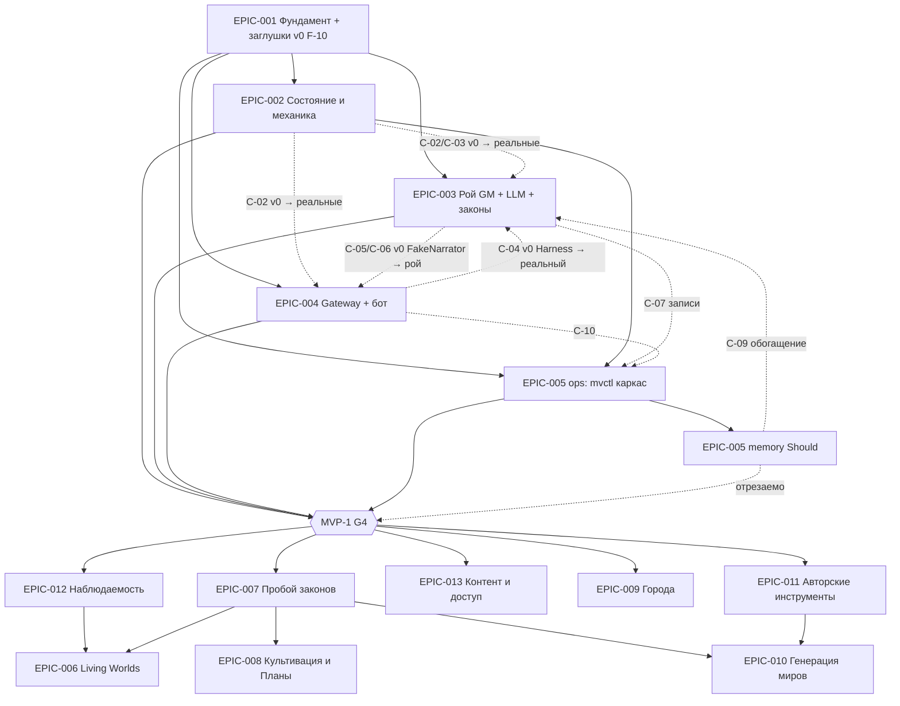

# Эпики

Версия 0.3 · 2026-09-09 · утверждено на G2 (v0.2); **v0.3 — точечные правки сведения A4-2** (`consolidation.md` §10–§13): §1/§2 EPIC-005 — `mvctl trace` в 005-ops (Must), `/v1/trace` — 005-memory (Should); §1/§2 EPIC-003 — `FakeEncounter` + `FakeNarrator` (C4, ранний merge до I1-α), провайдер `openai_compat` (llama-server) первым, `ollama` вторым (U-8); §2 I1-α — хук `MV_SWARM_FAKE` в `cmd/multiverse`; §6 F-4b — схема `analytics.consistency.violated.v1.json`; F-6 — нативный llama-server, `CODEOWNERS`, форк MinIO; F-8 — вариант E (`Qwen3.8-27B UD-Q3_K_XL`), критерий E → C → A; F-10 — `FakeNarrator` v0 без `WithEncounterStub`; §7 — два риска · system-architect#1 совместно с tech-lead#1. Нумерация с EPIC-001 (`counters.epic` = 0 → после утверждения = 13). Лимиты `.dev-team.json`: maxTeams 3, maxAgentsPerRole 3, maxParallelAgents 6. Ресурс — один разработчик-человек, команды — виртуальные; объём инкрементов реалистичен по 2–4 недели.
Основание: `architecture/overview.md` §11–§21, ADR-001…021, `architecture/contracts.md` v0.2, `architecture/consolidation.md` (решения пользователя U-1…U-7, §9), `plan/decomposition-review.md` §1–§5 (tech-lead#1), `plan/teams.md`, `requirements/prd.md` §4 (E-A…E-H), `requirements/user-stories.md` v0.3, `analysis/use-cases.md`.

**Изменения v0.2** (по `consolidation.md` §9 и `decomposition-review.md` §5):
1. Реестр: `mvctl world init` → EPIC-002 I1 (единый способ инициализации мира — фикстуры, §2); `mvctl record` + `RecordingWriter` → EPIC-003 I1a; US-011 добавлена в EPIC-003 и EPIC-004; US-016 (FR-056) и US-019 (FR-014) — в EPIC-004; US-032 — в EPIC-013; US-010 у EPIC-001 — «полный критерий после EPIC-003 I1b». EPIC-005 разделён на части **005-ops** (Must) и **005-memory** (Should, отрезаемая) с раздельной приёмкой (ID один, нумерация не меняется).
2. EPIC-003: инкременты I1a → I1b → I2; точка **I1-α «соло на шаблонах через бота»** как первая играбельная; оценка волны 1 для TEAM-2 — 4–5 недель.
3. Правило старта I2: старт — по приёмке своей I1 тимлидом команды; интеграционный прогон I1 — условие *слияния* I2, не старта.
4. Ветки: одна ветка на эпик на весь MVP-1 (`epic/EPIC-00N-slug`), интеграционная `integration/mvp-1` от `feature/agent-gm-core` (`teams.md` §3); слоты волны 1 — TEAM-1 2 / TEAM-2 3 / TEAM-3 1→2 (`teams.md` §4).
5. Фундамент §6: новые F-0 (подготовительный коммит, только с подтверждения пользователя) и F-10 (заглушки v0 + `shared/entity` v2 + фикстуры); F-1/F-2/F-3/F-4/F-5/F-6/F-8 уточнены (gitleaks первым, плейсхолдер ключа, `services/_archive/` вместо удаления, Go 1.26 + toolchain, `build/versions.env`, профили `gpu/memory/dev/legacy/bot`, MinIO из исходников по ADR-021, критерий F-8 по U-2); порядок F-0 → F-1 ∥ F-3 → F-2 → F-4a ∥ F-4b ∥ F-5 ∥ F-6 → F-4c ∥ F-5t ∥ F-10 ∥ F-7 ∥ F-8 → F-9.
6. Устаревшее убрано: `go 1.25` → `go 1.26`; «удалить ban-of-world/reality-monitor» → «в `services/_archive/`»; «по OQ-A-17» → «решено пользователем (U-1)»; Chroma не удаляется, а живёт в профиле `legacy` (D-3).
7. §3 и §5 согласованы с `teams.md` §3.3: порядок слияния I1 — **002 → 004 → 003**, I2 — **002 → 003 → 004 → 005**.

Размер: S ≤ 5 задач · M 6–12 · L 13–25 · XL > 25 (оценка архитектора; уточнена тимлидом в `decomposition-review.md` §2: MVP-1 ≈ 95–100 задач).

## 1. Реестр эпиков

| ID | Название | Область / модули | Команда | Этап | Зависит от | Поставляет (контракты) | Размер | Горизонт |
|---|---|---|---|---|---|---|---|---|
| EPIC-001 | Фундамент: единый модуль, контракты, шина, инфраструктура, CI, гигиена, заглушки v0 | `shared/{eventbus,jsonpath,contracts,objstore,env,logging,runtime,clock,testkit}` (ядро + v0 подпакетов `state/mechanics/swarm/gateway`), `shared/entity` v2 (F-10, далее владелец EPIC-002), `cmd/multiverse` (каркас `--contexts/--mode`), `cmd/mvctl` (реестр, `contracts check`, `env check`, `storage init`), `schemas/events/`, `build/` (`Dockerfile`, `minio.Dockerfile`, `versions.env`), `docker-compose.yml` (профили `gpu/memory/dev/legacy/bot`), `.github/workflows`, `Makefile`, `.golangci.yml`, `.gitattributes`, гигиена репозитория (F-0, F-1), `services/_archive/` (F-3), заморозка 8 сервисов, `testdata/fixtures/`, матрица замера LLM | TEAM-1 (волна 0, до параллельных команд) | architecture → planning | F-0 (подтверждение пользователя) | C-01, C-14 (формат), заглушки v0 C-02…C-05, инфраструктура для всех | L (~15 задач) | MVP-1 |
| EPIC-002 | Состояние и механика | `internal/state` (в т. ч. `bootstrap.go`), `internal/mechanics`, `internal/replay`, `shared/entity` (с волны 1), `shared/testkit/{state,mechanics}` (замена v0), `rules/dark-forest.yaml`, `cmd/mvctl/internal/world` (`mvctl world init`) | TEAM-1 | planning | EPIC-001 | C-02, C-03, C-14 (state) | L (~17) | MVP-1 |
| EPIC-003 | Рой GM, LLM-шлюз, страж, законы | `internal/swarm`, `internal/llm` (провайдеры: `openai_compat` → llama-server первым, `ollama` вторым — U-8), `internal/laws`, `shared/agent`, `shared/testkit/swarm` (**`FakeEncounter`** + `FakeNarrator` реализация — C4, первая единица I1a с ранним merge до I1-α; `RecordingWriter`; `template/ru.go`), `blueprints/`, `laws/`, `schemas/agent/`, `config/absolute-limits.yaml`, `cmd/mvctl/internal/{record,blueprint,laws}` (`mvctl record`, `blueprint validate`, `laws bump/show`), `testdata/{recordings,llm,golden}` (записи), `services/narrative-orchestrator` + `semantic-memory` as-is (только профиль `legacy`) | TEAM-2 | planning | EPIC-001; C-02/C-03 (заглушки v0 из F-10 → реальные от EPIC-002) | C-05, C-06, C-07, C-11, C-12, C-15 | XL (~35; I1a → I1b → I2) | MVP-1 |
| EPIC-004 | Вход игрока: gateway и Telegram-бот | `internal/gateway`, `cmd/telegram-bot`, `api/gateway.openapi.yaml`, SQLite-миграции (`links.db`/`gateway.db`), `shared/testkit/gateway` (`FakeGateway`, `Harness` — замена v0), `snapshots-{world}/gateway/` | TEAM-3 | planning | EPIC-001; C-02/C-05 (заглушки v0 → реальные) | C-04, C-08, C-10 | L (~20) | MVP-1 |
| EPIC-005 | Память и операции: **005-ops** (Must) + **005-memory** (Should, отрезаемая часть) | 005-ops: `cmd/mvctl/internal/{report,llmusage,trace}` (`mvctl report --audit/--json`, `llm usage`, **`mvctl trace <correlation_id>` по журналу — Must**, сведение 2 запрос c), `incidents.csv`, golden-набор, наполнение `contracts check`, `ops/metrics/`, `testdata/analytics/`, схема `analytics.consistency.violated.v1.json` (владелец; файл создаётся в F-4b), пороги NFR «после замера». 005-memory: `internal/memory` (Qdrant + Neo4j; `Embed` через `llm.Provider` — импорт разрешён ADR-001 доп. п. 7), `/v1/context/*`, `/v1/trace` (Should, обогащение графом), `mvctl memory rebuild`, `api/memory.openapi.yaml` | TEAM-1 (после EPIC-002 I1; параллельно EPIC-002 I2) | planning | EPIC-001; C-06/C-07/C-10 | C-09, отчёты, golden | M (~12: 6 + 6) | MVP-1 (005-memory — Should, отрезается на G3/G4 без потери Must-историй) |
| EPIC-006 | Living Worlds: Entity-Actor и эволюция правил (E-A) | `internal/ext/actors`, блупринты `level: object`, Monitor-агент, `rules.change.*` | — | backlog | MVP-1, EPIC-012 | C-13 реализация | L | целевое |
| EPIC-007 | Пробой законов (E-B) | `internal/laws` (фаза пробоя, напряжение, ревью, откат-ретрокон), Monitor-страж, `mvctl laws review` | — | backlog | MVP-1 | C-12 реализация | L | целевое |
| EPIC-008 | Культивация и Планы (E-C) | `internal/ext/cultivation`, `internal/ext/planes`, блупринты ступеней/испытаний; из замороженных cultivation-module, plan-manager | — | backlog | MVP-1, EPIC-007 (исключение BR-05 для портрета дао) | новые типы `cultivation.*`, `plane.*` | XL | целевое |
| EPIC-009 | Города и экономика (E-D) | `internal/ext/city`, блупринт `city-gm` (`domain`, parent region-gm), леджер; из city-governor | — | backlog | MVP-1 | `city.*`, `ledger.*` | L | целевое |
| EPIC-010 | Генерация миров и онтологии (E-E) | `internal/ext/genesis`, законы вселенной `immutable/default`, онтологии-дуальности; из world-generator, universe-genesis-oracle, ontological-archivist | — | backlog | EPIC-007 (версии законов), EPIC-011 | `universe.*`, `world.generated` | XL | целевое |
| EPIC-011 | Авторские инструменты (E-F) | `mvctl` расширения, API автора (`/v1/author/*`), горячая загрузка блупринтов, трасса решений агента | — | backlog | MVP-1 | `api/author.openapi.yaml` | M | целевое |
| EPIC-012 | Наблюдаемость и операции (E-G) | Prometheus-эндпоинты, Grafana, алерты, адаптивный LOD (OQ-D-11 C), бюджет на действие, Redis при выносе Swarm; задача-триггер замены объектного хранилища (ADR-021 п. 4: spike SeaweedFS) | — | backlog | MVP-1 | метрики, `lod.*` | M | целевое (рекомендуется первым после MVP-1) |
| EPIC-013 | Контент и доступ (E-H) | полный фильтр 18+, аутентификация клиентов, разделение аккаунт/персонаж, Discord-бот, WebSocket-стрим, право на забвение, свободный текст команд (US-032), облачные провайдеры как рабочая опция | — | backlog | MVP-1 | `/v2` при необходимости, `providers/openai_compat`, `providers/anthropic` | L | целевое |

Целевые истории US-020…US-035 → EPIC-006…013: US-020/021 → 007; US-022/023 → 006; US-024/025 → 008; US-026 → 009; US-027…029 → 010; US-030/031/032/035 → 013; US-033/034 → 012 (покрытие проверено `decomposition-review.md` §1).

## 2. MVP-1: границы эпиков и инкременты «соло → группа»

Каждый MVP-эпик делится на инкременты: **I1 «соло + фон»** (у EPIC-003 — подинкременты I1a и I1b) и **I2 «группа + память/операции»**.

**Правило старта I2** (заменяет v0.1 «ни одна задача I2 не начинается до S1/S3/S14»): команда начинает I2 по приёмке своей I1 тимлидом команды (`tech-lead#N`), не дожидаясь интеграции всех трёх эпиков; **слияние** I2 в `integration/mvp-1` — только после зелёного интеграционного прогона I1 (S1, S3, S8, S9, S10, S14). Освободившиеся слоты TEAM-1 идут в EPIC-005 005-ops (`mvctl report`, golden — нужны для приёмки I1 и I2).

**Точка I1-α «соло на шаблонах через бота»** — первая играбельная: EPIC-002 I1 + EPIC-004 I1 + `shared/testkit/swarm` (**`FakeEncounter`** — заглушка Phase 1 боя, и `FakeNarrator` — реализация; единица C4 EPIC-003, первая в I1a, вливается в `integration/mvp-1` сразу после приёмки tech-lead#2; v0 `FakeNarrator` из F-10 — только нарратив, без боя; хук `MV_SWARM_FAKE=true` в `cmd/multiverse` монтирует фейки под именем контекста `swarm` до слияния EPIC-003 I1 — сведение 2, запросы d/e) → бой с волком через Telegram с `generated_by=template`, без роя и LLM. Достижима на ~3-й неделе волны 1; человек играет, замечания → задачи EPIC-002/004. Тег `mvp-1/i1-alpha`.

**Единый способ инициализации мира** (решение архитектора; снимает расхождение `state-and-mechanics.md` §4 и `swarm-llm-laws.md` §17): источник истины на MVP-1 — фикстуры `testdata/fixtures/{world,region,npc,players}.json` (создаются в F-10), загружаемые `internal/state/bootstrap.go` через `entity.create.proposed` (proposer `system`) — команда `mvctl world init --fixtures testdata/fixtures/` (EPIC-002 I1) и харнессы e2e. `npc_table` блупринта региона — **производный** механизм: `region-gm` использует его только для респауна (`respawn_ttl`) в EPIC-003 I1b; `swarm.InitWorld(bp…)` для первичного создания мира на MVP-1 не используется, `mvctl world init --blueprints` — не в MVP-1 (кандидат в EPIC-011). Согласованность: тест EPIC-003 I1b проверяет, что каждая запись `npc_table` имеет `stats_ref` в `rules/dark-forest.yaml` и тип сущности из фикстур. Обоснование: I1-α должна работать без роя; детерминизм replay и seq 0 снапшота (ADR-010) не зависят от блупринта; один источник для трёх команд.

### EPIC-001 Фундамент (волна 0, только TEAM-1)
Цель: репозиторий, в котором три команды могут работать параллельно по контрактам, с заглушками v0 всех межкомандных контрактов уже в интеграционной ветке.
Входит: F-0 подготовительный коммит (§6, только с подтверждения пользователя); единый модуль `multiverse-core.io` (`go 1.26` + `toolchain go1.26.x`, ADR-001 дополнение п. 1), `cmd/multiverse --contexts/--mode`, `shared/runtime`, `shared/clock`, `shared/contracts` + JSON-схемы всех типов §2.2 api-contracts (JSON Schema 2020-12, `santhosh-tekuri/jsonschema/v6`), конверт `meta`, `Bus` с реестром, `Journal` и DLQ, reader `MinBytes=1/MaxWait=100ms`, `shared/objstore` (по ADR-021, in-memory реализация сразу), `shared/env` (префикс `MV_`), `shared/logging` (slog, обязательные поля), `shared/testkit` (membus, contract-тест шины, fakes-каркас) и **заглушки v0 C-02…C-05 + `shared/entity` v2 + фикстуры** (F-10); `redpanda-init` с 8 топиками и retention 30/90/180 (U-3), compose с пинами из `build/versions.env` и профилями `gpu`, `memory`, `dev`, `legacy` (as-is narrative-orchestrator + semantic-memory :8083 + chromadb — D-3), `bot`; MinIO — сборка из исходников `build/minio.Dockerfile` (ADR-021, пока OQ-A-20 не решён иначе); bucket versioning MinIO; TimescaleDB и Redis — вне compose (их потребители в `services/_archive/`); Chroma — только в профиле `legacy`; `.gitignore`/`.gitattributes`/`.mcp.env.example`/`.env.example`; `gitleaks` + `pre-commit`; удаление из индекса **не-кода** (секреты, бинарники, логи, `.claude/worktrees/*`); плейсхолдер вместо реального ключа в `shared/oracle/README.md` (U-5); перенос выводимого из сборки кода в `services/_archive/` с `ARCHIVED.md` — решено пользователем (U-1, OQ-A-17), ничего не удаляется: `ban-of-world`, `reality-monitor`, `shared/{schema,redis,config,minio,oracle,rules,intent,tinyml,spatial}`, `fake_deps/`, `test_minio.go`, `shared/agent/tools/*`, лишние Dockerfile; заморозка 8 сервисов (`FROZEN.md`, вне сборки, остаются на месте); CI (unit/integration/e2e/contracts/security/compose-lint; `govulncheck` блокирующий; пины по SHA); `Docs/archive/` + обновление CLAUDE.md/AGENTS.md/README по факту; матрица замера LLM → `ops/metrics/baseline.md` (на целевой машине, не блокирует код).
Не входит: доменная логика (кроме типов C-03 и `Load` правил в F-10); очистка истории git (`git filter-repo`) — только по явной команде пользователя.
US/FR: US-010 (полный критерий «глобальный GM и GM региона активны» закрывается после EPIC-003 I1b), US-013, FR-036, FR-080, FR-081 (каркас), FR-083, NFR-040, NFR-062, NFR-063, NFR-070, NFR-071, NFR-074, NFR-075, NFR-076 (замер).
Готовность: `git status` чист и работает; `pre-commit` с `gitleaks` установлен, `gitleaks git --redact` = 0; `make ci` зелёный; `make up` поднимает инфраструктуру и пустые контексты `core|gateway|memory` с `/health`; contract-тест шины на testcontainers; `testkit` содержит membus + v0 заглушек C-02…C-05; `mvctl contracts check` без фантомов; секретов в HEAD нет; `services/_archive/` и замороженные сервисы вне `go build ./...`; `baseline.md` с выбором конфигурации моделей по U-2 (одна `qwen3:30b-a3b`, если проходит NFR-002/NFR-090; иначе 8b + 14b).

### EPIC-002 Состояние и механика (TEAM-1)
I1: State (единственный писатель, предложения/факты, версии, инварианты 1–10, MinIO write-through, снапшот/`latest.json`, восстановление, `analytics.replay.completed`), `bootstrap.go` + **`mvctl world init`** (фикстуры → `entity.create.proposed`, снапшот seq 0 с `reason=bootstrap`), Mechanics (`rules/dark-forest.yaml` v0.1, `Resolve`, `NPCTarget`, seed/RNG, `dice.rolled`), `internal/replay` (режим replay, `EventClock`), `shared/entity` v2 (принимает от F-10, развивает), замена v0 `FakeState`/`FixedMechanics` реализацией в `shared/testkit/{state,mechanics}`. Тесты NFR-060, инварианты, восстановление.
I2: пакетные `atomic` для группы (позиция группы, участники, `Participation`), `idle`/`out_of_combat` в выборе цели, снапшот по `session.ended`, сверка `state_hash` для `--audit` (совместно с EPIC-005 005-ops).
US/FR: US-003, US-005, US-011, US-017, FR-018, FR-020…FR-025, FR-030…FR-034, FR-087, NFR-010…NFR-014, NFR-020, NFR-060, NFR-061.
Готовность I1: `mvctl world init` создаёт «Тёмный лес» из фикстур; 30 ходов соло на `FixedNarrator` без расхождений снапшота и журнала; рестарт → `identical=true`, `llm_calls=0`; участие в I1-α.

### EPIC-003 Рой GM, LLM-шлюз, страж, законы (TEAM-2; критический путь, волна 1 — 4–5 недель)
**I1a «LLM-шлюз, страж, законы, формат блупринта»** (не зависит от EPIC-002 — только C-01 и `FakeProvider`): `shared/agent` (типы расширены, парсер MD, валидатор по §3.2, `levels.go` — реестр уровней для валидатора; таблица владения — одна, `shared/contracts/ownership.go`, ADR-025), блупринты `global-dark-forest-world`, `domain-dark-forest`, `encounter-wolf`, `player-gm` + `schemas/agent/*`, `mvctl blueprint validate`; LLM-шлюз (`Provider` C-15 v1.1; провайдеры **`openai_compat` (llama-server, `response_format json_schema`, thinking off на запрос) — первым (B3a)**, `ollama` native — вторым (B3b), `recorded`, `fake`; middleware: бюджет → повторы → парсер → язык → фильтр (a) → `llm.output` → страж), `internal/llm/prompt` из `prompt_builder.go`, `internal/laws` (`laws@v1`, `laws_version`, `mvctl laws bump/show`), схемы событий EPIC-003 (`tick-*.json`, `narrative.json`, `llm.*`, `agent.*`); **`RecordingWriter` + `mvctl record`** (ключ записи `(correlation_id, agent.id, phase, attempt)`, только `actor_kind=ci`), **`FakeEncounter` + `FakeNarrator` реализация (C4, первая единица; ранний merge `shared/testkit/swarm` до I1-α)**. Готовность I1a: `mvctl blueprint validate blueprints/` зелёный на пяти блупринтах; `llm.Gateway.Generate` на `fake`/`recorded`/живом llama-server проходит парсер → язык → фильтр (a) → страж; `llm.output` записывается; `FakeEncounter`/`FakeNarrator` в `integration/mvp-1`; первая запись `solo-30.jsonl` снята на стенде.
**I1b «Рой: рантайм, роли, тики, миграция»**: рантайм (Router по `scope_binding`, Lifecycle с `agent.*`, Scheduler с двумя очередями и бюджетом `B`, снапшот роя — US-011, C-14), роли `global-gm`/`region-gm` (тики LOD 2/1, встречи, респаун по `npc_table` — производный от фикстур, см. выше), `encounter`, `personal` (+ `template`), контекст `worldview`/`journalContext` (сводка «пока тебя не было»), admin-порт `core` (`MV_CORE_ADDR=127.0.0.1:8090`), `GM_PATH` флаг и профиль `legacy`, e2e S1/S14/death/flee/injections/degraded/recovery, golden. Готовность I1: S1 (с реальным нарративом на записях в CI и на живом Ollama на стенде), S14 с ускоренными тиками, S6 (второй регион блупринтом), снапшот роя восстанавливается (S3).
I2: `group-narrator`, раунд в агенте встречи (`round` из `encounter.started`, `round.closed` → порядок → ответ волка), персональные GM в группе в `rule-only`, `MemoryClient` к EPIC-005 (за флагом; без 005-memory — `journalContext`), перенос narrative-orchestrator/semantic-memory в `services/_archive/` и удаление флага (S5), `agent.blueprint_reloaded` (FR-091 Should), лимиты.
US/FR: US-002, US-004, US-011 (снапшот роя), US-012, US-014, US-015, US-016, US-017 (`recorded` провайдер, записи), US-018, US-019, US-036, US-037, FR-010…FR-017, FR-040, FR-042, FR-045, FR-050, FR-051, FR-052, FR-055, FR-056, FR-070…FR-072, FR-090…FR-092, FR-120…FR-128, NFR-001 (вклад), NFR-002, NFR-004…NFR-007, NFR-021, NFR-022, NFR-026, NFR-043, NFR-048, NFR-050…NFR-053, NFR-083, NFR-090, NFR-091.
Готовность I2: S2 (раунды группы), S5, S6.
Порядок внутри TEAM-2 при трёх разработчиках — `decomposition-review.md` §2.1, слоты — `teams.md` §4.

### EPIC-004 Вход игрока: gateway и Telegram-бот (TEAM-3)
I1: OpenAPI v1, `links.db`/`gateway.db` (SQLite, миграции goose, `secure_delete`, checkpoint+vacuum после `/forget`), `links/resolve|consent|forget`, `characters` (через `entity.create.proposed` + ожидание факта; идемпотентность по `link_id`), `players/{id}` read-model, `actions` соло-словарь с валидацией и `action_key`, **`InputFilter` (noop-точка вставки, FR-056 — US-016)**, rate limit 30/мин burst 5, `player.*` события, сессии и `analytics.session.*`/`turn.completed`, outbox + `deliveries`/`ack`, **снапшот gateway в `snapshots-{world}/gateway/` (US-011, C-14)**, **`GM_PATH` в gateway и `gm.created` при `legacy` (US-019, FR-014)**, `/health`, бот (long polling, allowlist Telegram user id — U-7, `/start` с уведомлением/18+/согласием, имя персонажа, команды соло, доставка механики и нарратива отдельными сообщениями без `parse_mode`, `/forget`, `/help`, редакция токена в логах), логи без ПДн (ротация `10m × 3`), `FakeGateway`/`Harness` реализация (замена v0) в `shared/testkit/gateway`.
I2: `group.*` (create/join/leave, лидер, `group.entered_region`), координатор раундов (`round.opened/closed`, таймаут 60 с, `defend`/`idle`), `rounds/close` для CI, `/v1/groups/{id}`, групповая доставка, прокси `/v1/admin/*` к `core`, `actor_kind` для `ci/sim`.
US/FR: US-001, US-006, US-007, US-008, US-009, US-011 (снапшот gateway), US-016 (FR-056), US-019 (FR-014), US-038 (издатель), FR-001…FR-006, FR-009, FR-014, FR-023, FR-025, FR-056, FR-060, FR-061, FR-084, FR-085, FR-086 (издатель), NFR-003, NFR-013, NFR-036, NFR-041, NFR-042, NFR-045, NFR-092.
Готовность I1: сквозной соло-ход через бота на стенде (I1-α на `FakeNarrator`, затем S1/S9 с роем); снапшот gateway восстанавливается (S3). I2 — S2 с харнессом из трёх клиентов.

### EPIC-005 Память и операции (TEAM-1, после приёмки EPIC-002 I1)
Две части с раздельной приёмкой; при перерасходе волны 2 часть 005-memory отрезается на G3/G4 без потери Must-историй (US-038 CSV — в 005-ops; Must-часть US-005/US-036 работает на `journalContext` EPIC-003).
**005-ops (Must; стартует в волне 1 на освободившихся слотах TEAM-1 после I1-α)**: `mvctl report` (`--audit` со сверкой `state_hash`, `--json`), **`mvctl trace <correlation_id>`** (цепочка событий по журналу через `Journal.ReadRange` по всем топикам — Must, критерий US-003/NFR-034 без памяти), `incidents.csv`, golden-набор (20 ходов + 3 тика, из записей EPIC-003, только `actor_kind=ci`; `*.jsonl` с `merge=binary`), `mvctl llm usage`, наполнение `mvctl contracts check`; закрепление порогов «после замера» в `nfr.md` (совместно с BA); `testdata/analytics/`.
**005-memory (Should; волна 2)**: `internal/memory` на Qdrant (адаптер вместо `chroma*.go`), Neo4j 5.26 без APOC (существующий индексер, тесты за `integration`), `/v1/context/scope`, `/v1/context/absence`, `/v1/trace`, `mvctl memory rebuild`, экранирование `generated`-фактов (T-9).
US/FR: 005-ops — US-012 (`llm usage`), US-038 (CLI, CSV), FR-035, FR-086, FR-088, NFR-064, NFR-065, пороги NFR-030/032/034; 005-memory — US-005/US-036 (Should-часть), US-015 (`/v1/trace` Should), FR-093, FR-101, FR-127 (через память).
Готовность: 005-ops — `mvctl report` даёт CSV/JSON по прогону S1/S2; golden проходит в CI; 005-memory — сводка «пока тебя не было» из памяти совпадает с журналом.

## 3. Граф зависимостей

Пунктир — зависимость по контракту с заглушкой (v0 создаёт EPIC-001 в F-10, реализацию поставляет владелец контракта в своей ветке; команда-потребитель не ждёт и не правит заглушку — запрос владельцу); сплошная — блокирующая. Порядок слияния в интеграционную ветку — §5 (I1: 002 → 004 → 003; I2: 002 → 003 → 004 → 005), критический путь — `decomposition-review.md` §3.1.

## 4. Команды и волны (лимит 3 команды, 6 параллельных агентов; детали слотов — `teams.md` §4)

| Волна | TEAM-1 | TEAM-2 | TEAM-3 | Гейт / критерий |
|---|---|---|---|---|
| F-0 (до волны 0) | tech-lead#1 + пользователь: подготовительный коммит, `integration/mvp-1` | — | — | подтверждение пользователя на G2 (`commits=ask`); `git status` работает |
| 0 (≈ 1,5–2 нед.) | EPIC-001 Фундамент (tech-lead#1, architect#1, developer×2–3, devops-engineer, security-engineer, code-reviewer, tech-writer) | — | — | `make ci` зелёный, contract-тест шины, заглушки v0 в `integration/mvp-1`, `baseline.md`; тег `mvp-1/wave-0`; G2 утверждён до старта, G3 объединённый — по планам I2 |
| 1 «соло + фон» (≈ 4–5 нед., ограничена EPIC-003) | EPIC-002 I1 (developer×2, tester) → после I1-α: EPIC-002 I2 старт + EPIC-005 005-ops | EPIC-003 I1a → I1b (architect#2, developer×3, tester) | EPIC-004 I1 (developer×1 → ×2 после `FakeGateway`, tester) | точка **I1-α** (~3-я неделя): 002 + 004 на `FakeNarrator`, живая игра через Telegram; интеграция I1: S1, S3, S8, S9, S10, S14 (ускоренные тики); тег `mvp-1/i1` |
| 2 «группа + память/операции» (≈ 3–4 нед.) | EPIC-002 I2 → EPIC-005 005-ops → 005-memory (developer×2, qa-engineer) | EPIC-003 I2 (developer×2–3, tester) | EPIC-004 I2 (developer×1–2, tester) | интеграция I2: S2, S4 (пороги закреплены по замеру), S5, S6; G4 MVP-1; тег `mvp-1/i2`; старт наблюдения S7 |
| 3+ | по одному целевому эпику на инкремент; рекомендуемый порядок: EPIC-012 → EPIC-007 → EPIC-006 → EPIC-013 → EPIC-009 → EPIC-008 → EPIC-010 → EPIC-011 | | | S11–S13 |

Роли уровня проекта (общие): product-owner, business-analyst (правки `api-contracts.md` §0/§2.1 под конверт `meta`, FR-025/BR-13/FR-009/FR-034 по `consolidation.md` §9 — на планировании), system-analyst, system-architect#1 (ревью дизайнов, контракты, конфликты в `shared/*`), security-engineer (F-1 с developer; threat-model на стыках gateway↔core, облако, `links.db`), devops-engineer (F-6/F-7; `infrastructure.md`: compose, CI-раннер с Docker, бэкапы томов Redpanda/MinIO/`links.db`, прогрев Ollama), project-manager, tech-lead#1 (интеграция, карта владения), tech-writer (F-9), release-manager (G4).
Слоты разработчиков волны 1 — асимметрично, приоритет критическому пути: **TEAM-1 2 / TEAM-2 3 / TEAM-3 1 → 2** (бот стартует после `FakeGateway` или на интерфейсе клиента), далее 2/3/1 → 2/2/2 по мере освобождения; сумма ≤ 6. Ревью (`code-reviewer#N` на каждую задачу) и тесты — отдельным запуском после волны разработчиков; человек — сводка на волну команды и выборочно `shared/*`, `schemas/`, `links`, `filter`, `guardian`. Стендовые задачи (F-8, S9, S1 на живом Ollama, nightly) не занимают слот разработчика.

## 5. Ветки и порядок интеграции (согласовано с `teams.md` §3)

1. **Интеграционная ветка `integration/mvp-1`** создаётся от `feature/agent-gm-core` (содержит `shared/agent` и артефакты `Docs/dev-team/**`; `main` остаётся стабильной; по G4 `integration/mvp-1` → `main` одним PR). Если пользователь предпочтёт сначала влить `feature/agent-gm-core` в `main`, схема не меняется. Предусловие — F-0.
2. **Одна ветка на эпик на весь MVP-1**: `epic/EPIC-001-foundation`, `epic/EPIC-002-state`, `epic/EPIC-003-swarm`, `epic/EPIC-004-gateway`, `epic/EPIC-005-memory-ops`; все — от `integration/mvp-1`. Инкременты новых веток не заводят: после интеграции I1 ветка эпика подтягивает `integration/mvp-1` (merge, не rebase) и продолжает I2. Инкремент отмечается тегом на интеграционной ветке: `mvp-1/wave-0`, `mvp-1/i1-alpha`, `mvp-1/i1`, `mvp-1/i2`. Коммиты — только по подтверждению пользователя (`commits=ask`), одним запросом на волну команды.
3. Волна 0: `epic/EPIC-001-foundation` → `integration/mvp-1` (тег `mvp-1/wave-0`). С этого момента `shared/{eventbus,contracts,entity}`, `schemas/events/_common.json` меняются только через system-architect (пометка `contract-change`).
4. Волна 1, слияние **002 → 004 → 003**: сначала `epic/EPIC-002-state` (I1) и `epic/EPIC-004-gateway` (I1) — e2e `solo-30` на `FakeNarrator`, живой прогон через Telegram (человек) — тег `mvp-1/i1-alpha`; затем `epic/EPIC-003-swarm` (I1a+I1b) последним заменяет `FakeNarrator`/`FixedMechanics` реализацией роя — полный S1, S3, S8, S9, S10, S14 на живом стенде (tech-lead#1 + qa-engineer#1 + tester#N + security-engineer стыки gateway↔core + devops сборка) — тег `mvp-1/i1`. Порядок отличается от v0.1 (002 → 003 → 004), потому что I1-α не нуждается в рое, а EPIC-003 — самый длинный.
5. Волна 2, слияние **002 → 003 → 004 → 005** (поставщики раньше потребителей: atomic-группы State нужны раунду `encounter`, раунд — координатору gateway, память — последней): S2, S4, S5, S6; перенос профиля `legacy`/`GM_PATH` в `services/_archive/` — последняя задача EPIC-003 I2 после зелёного S2; тег `mvp-1/i2` → G4.
6. Дефект интеграции — задачей (`T-NNN`) в эпик-владелец по карте владения, не «быстрой правкой» в интеграционной ветке. Конфликты в `shared/*`, `schemas/` и контрактах — только через system-architect (запрос в `ownership.md` §2), обе команды получают задачи.

## 6. Задачи «фундамента», выполняемые до параллельных команд (для tech-lead#1)

Нарезка EPIC-001 (тимлид детализирует в `epics/EPIC-001/tasks.md`; проверено по репозиторию 2026-09-09 — `decomposition-review.md` §5.3):

| # | Задача | Размер | Владелец роли |
|---|---|---|---|
| **F-0** (новая, до волны 0) | Подготовительный коммит — **только с подтверждения пользователя (`commits=ask`)**: `git worktree prune`; удаление `.claude/worktrees/*` из индекса + `.gitignore` для `.claude/worktrees/`; фиксация `Docs/dev-team/**` (артефакты G1/G2 сейчас не в индексе); создание `integration/mvp-1` от `feature/agent-gm-core` и `epic/EPIC-001-foundation`. Без F-0 `git status` падает (указатели worktree на несуществующий путь) и ветки команд невозможны | S | tech-lead#1 + пользователь |
| **F-1** | Гигиена индекса: **`gitleaks` + `pre-commit` — первым шагом** (до любых других правок в индексе; allowlist только `*.example`); затем `git rm --cached` секретов (`.mcp.env`, `.env`), бинарников (`examples.exe`), логов (`mcp_*.log`); **плейсхолдер `ORACLE_API_KEY=<your-key>` вместо реального `sk-…` в `shared/oracle/README.md`** (U-5; ключ отзывает пользователь); `.gitignore`, `.gitattributes` (`*.jsonl merge=binary`), `.env.example`, `.mcp.env.example` полные; проверка `gitleaks git --redact` = 0 по рабочему дереву. Очистка истории — только по явной команде пользователя | S | developer + security-engineer |
| **F-3** | **`services/_archive/` вместо удаления** (решено пользователем, U-1/OQ-A-17): `git mv` `services/{ban-of-world,reality-monitor}`, `shared/{schema,redis,config,minio,oracle,rules,intent,tinyml,spatial}`, `shared/agent/tools/*`, `fake_deps/`, `test_minio.go`, лишние Dockerfile → `services/_archive/<путь>`, каждый каталог с `ARCHIVED.md` (причина, коммит, эпик возврата) и своим `go.mod` (вне сборки); `services/_archive/README.md` с индексом; `FROZEN.md` в 8 замороженных сервисах (остаются на месте, вне Makefile/compose); `Docs/archive/` | S→M | developer + tech-writer |
| **F-2** | Единый модуль: удалить `go.work`, слить shared-модули в root, **`go 1.26` + `toolchain go1.26.x`** (ADR-001 дополнение п. 1), `cmd/multiverse --contexts/--mode` с пустыми контекстами (`Health()=ok`), `Context` интерфейс, `shared/runtime` (HTTP-сервер процесса, `MV_CORE_ADDR`), `shared/clock`, `.golangci.yml` (`depguard` границ, `forbidigo`), `build/Dockerfile`; `services/_archive/**` и замороженные сервисы — вне `./...`. Критерий: `go build ./... && go vet ./...` зелёные | M | developer |
| F-4a | `shared/eventbus`: конверт `meta`, `NewRoot/Derive`, `Bus` с реестром, `Journal`, DLQ, reader-параметры, kafka-реализация, политики топиков (`MV_BUS_VALIDATE_ON_READ`) | M | developer |
| F-4b | `shared/contracts` + `schemas/events/*.v1.json` — все типы §2.2 api-contracts по трём блокам (player/group/round; entity/snapshot/dice; agent/tick/llm/narrative/world/region/npc/laws/analytics — блок «в» **включает `analytics.consistency.violated.v1.json`** по спецификации EPIC-005 `design.md` §4.1, файл передаётся владельцу EPIC-005, как `replay.completed` — EPIC-002), JSON Schema 2020-12; статичная таблица `contracts.OwnershipRules` MVP-1 (`shared/contracts/ownership.go` — единственная истина, ADR-025); стартует параллельно F-4a от `api-contracts.md` | M | developer (второй) |
| F-4c | Каркас `cmd/mvctl` (реестр подкоманд — tech-lead#1; подкоманды — владельцы по `ownership.md`): `contracts check`/`topics`, `env check`, `storage init` | S | developer |
| F-5 | `shared/objstore` (один клиент MinIO по ADR-021, in-memory реализация сразу, versioning/ILM в `EnsureBucket`), `shared/env` (`Declare`-манифест, префикс `MV_`), `shared/logging` (slog, `BusMiddleware`); **`build/versions.env`** — единый источник пинов для compose и testcontainers | M | developer |
| F-5t | `shared/testkit` ядро: membus с `Journal`, `Dedup`, `Versions()`, containers, **contract-тест шины** (обязателен до волны 1 — иначе команды получат membus с другой семантикой) | S | developer |
| **F-6** | compose: пины из `versions.env`, профили **`gpu`, `memory`, `dev`, `legacy` (as-is narrative-orchestrator + semantic-memory :8083 + chromadb — D-3), `bot`** (D-10); `redpanda-init` (8 топиков, retention 30/90/180, `segment.ms=1d`); **MinIO — сборка из исходников `build/minio.Dockerfile`** (ADR-021; действует, пока OQ-A-20 не решён пользователем иначе), init versioning MinIO (`prompts-*` без versioning, ILM 30 дн.); Timescale/Redis — вне compose; **LLM-рантайм — нативный llama-server вне compose (U-8)**: `scripts/llm-server.ps1` с зафиксированными параметрами, `Makefile` `llm-up/llm-down/llm-health`, `MV_LLM_PROVIDER=openai_compat`, `MV_LLM_URL=http://host.docker.internal:1234`, `make up` проверяет `/health` llama-server и предупреждает; Ollama — опционально (профиль `gpu` или нативно; env `KEEP_ALIVE=-1`, `MAX_LOADED_MODELS=2` только для него); все порты только на `127.0.0.1`, без дефолтных паролей, `compose-lint`; `Makefile` (`up/down/ci/health/replay/archive-legacy`); `CODEOWNERS` = `@alekseizabelin1985-spec` (U-9), форк `minio/minio` в аккаунт пользователя (U-10). Решение по жизнеспособности профиля `legacy` — до старта волны 1 (запасной вариант S5: «флаг удалён, `gm_path=agent` в 100 % `llm.output`» без сравнения нарративов) | M | devops-engineer |
| F-7 | CI `go.yml`: unit/integration (testcontainers)/e2e/contracts/security (`gitleaks`, `govulncheck` блокирующий, privacy-scan `testdata/`)/compose-lint; пины действий по SHA, `permissions`, `go mod verify`, Dependabot, CODEOWNERS; замена `validate-blueprints.yml`. Замыкается при наличии хотя бы одного теста каждого уровня | M | devops-engineer |
| **F-8** | Матрица замера LLM на целевой машине (RTX 4090 24 ГБ) по OQ-A-18 (уточнён U-8): конфигурации **E** (`Qwen3.8-27B UD-Q3_K_XL` на нативном llama-server, `openai_compat`, thinking off, `num_ctx` 8k/16k, KV f16/q8_0), A/B/C/D (Ollama или GGUF), E+ (router) — `ops/metrics/bench-matrix.json` с полем `provider`; скрипт против `/v1/chat/completions`; `ops/metrics/baseline.md`; **критерий по U-2/U-8**: E, если проходит NFR-002/NFR-090; иначе C; иначе A; результат — параметр блупринтов и `scripts/llm-server.ps1`, код не блокирует | M | architect#1 + devops (скрипты) + человек (стенд) |
| **F-10** (новая) | **Заглушки контрактов v0 и модель сущности v2** (`decomposition-review.md` §3.3): `shared/entity` v2 по §3 `state-and-mechanics.md` (структура, ops, hash, attrs); `internal/mechanics` — только типы C-03 + `Load` + `rules/dark-forest.yaml` (без `Resolve`); `testkit/state.FakeState` v0 (ops в память, факты, без инвариантов); `testkit/mechanics.FixedMechanics`; `testkit/gateway.Harness` v0 (генератор `player.*` из фикстур в membus, без HTTP); `testkit/swarm.FakeNarrator` v0 (шаблон на `combat.decided`/`round.closed`/`player.looked`/`player.entered_region` — **только нарратив, без `WithEncounterStub`**: Phase 1 для I1-α поставляет EPIC-003 `FakeEncounter`, сведение 2 запрос d); хук `cmd/multiverse/fake_contexts.go` + `MV_SWARM_FAKE` (регистрация `testkit/swarm.FakeContext` под именем `swarm`; ADR-001 доп. п. 8); **фикстуры `testdata/fixtures/{world,region,npc,players}.json` (player-A/B/C) и `snapshots/state/latest.json`**. После волны 0 владение подпакетами переходит поставщикам по `ownership.md` (v0 → реализация в их ветках) | M | developer + architect#1 |
| F-9 | Обновление CLAUDE.md, AGENTS.md, README под новую раскладку (карта `internal/*`, «как запустить одну команду»), статусы сервисов включая «архив» и `services/_archive/README.md` (NFR-095); `.dev-team.json.stack` по факту (Go 1.26, MinIO из исходников, Qdrant вместо Chroma, без Timescale/Redis) | S | tech-writer |

Порядок: **F-0 → F-1 ∥ F-3 → F-2 → (F-4a ∥ F-4b ∥ F-5 ∥ F-6) → (F-4c ∥ F-5t ∥ F-10 ∥ F-7 ∥ F-8) → F-9**. Критический путь волны 0: F-1 → F-2 → F-4a → F-5t. Слоты по подволнам 0.1–0.5 — `teams.md` §4.

## 7. Риски декомпозиции

| Риск | Реакция |
|---|---|
| Три команды при одном человеке-разработчике: реальная параллельность ограничена ревью и стендом | волна 1 ограничена 6 разработчиками (2/3/1→2); слияние строго по порядку I1 002 → 004 → 003, I2 002 → 003 → 004 → 005; заглушки v0 (F-10) в интеграционной ветке до старта волны 1, чтобы команды не ждали; ревью в два слоя (`code-reviewer#N` на задачу, человек — сводка на волну); задача не больше M |
| EPIC-003 — XL и на критическом пути (волна 1 — 4–5 недель) | I1a (без EPIC-002) → I1b → I2; `phase1.mode: rules` убирает Phase 1 LLM; `journalContext` убирает зависимость от 005-memory; три разработчика TEAM-2 по независимым пакетам; I1-α даёт играбельную точку до готовности роя |
| Первая играбельная точка слишком поздно | I1-α «соло на шаблонах» на ~3-й неделе волны 1: EPIC-002 I1 + EPIC-004 I1 + `FakeNarrator` |
| Правило «I2 после интеграции I1» простаивает TEAM-1/TEAM-3 | старт I2 — по приёмке своей I1 тимлидом команды; интеграционный прогон I1 — условие слияния I2; слоты TEAM-1 → 005-ops |
| Изменение конверта `meta` после старта команд | конверт фиксируется в EPIC-001 (F-4a) до волны 1; изменения — только через архитектора (`contract-change`) |
| Замер моделей (F-8) сдвигает NFR / конфигурацию (U-2, U-8: E → C → A) | блупринты параметризуют модель; I1a пишется против `fake`/`recorded`; `openai_compat` и `ollama` — один интерфейс, смена рантайма = env + скрипт запуска; живой прогон — конец I1b; замер не блокирует код |
| `FakeEncounter` (EPIC-003 C4) не готов к I1-α (~3-я неделя волны 1) — TEAM-1/TEAM-3 без боя | C4 — первая единица потока C I1a, ≈ 1 единица на реальной механике, ранний merge подпакета; запасной вариант — временный `encounterStub` в тестах EPIC-002 (не в `shared/testkit`) по эскалации tech-lead#1 → system-architect |
| Профиль `legacy` может не работать без Chroma/as-is semantic-memory → S5 не проверяем | решено D-3: Chroma + semantic-memory as-is в профиле `legacy` (не удаляются); запасной вариант S5 без сравнения нарративов (F-6); решение до старта волны 1 |
| MinIO upstream архивирован (ADR-021); OQ-A-20 открыт | сборка из исходников в F-6 с триггерами замены (EPIC-012); если пользователь на G2 выберет замену сервера (SeaweedFS) — +spike в волне 0, интерфейс `objstore` не меняется |
| Записи LLM для CI устаревают при изменении промптов | `mvctl record`/`RecordingWriter` в I1a; ключ записи не зависит от текста промпта; обновление записей — задача с ревью диффа (ADR-010) |
| Расхождение инициализации мира (фикстуры vs `npc_table`) | зафиксировано в §2: фикстуры — источник, `npc_table` — производный (респаун); тест согласованности в EPIC-003 I1b |
