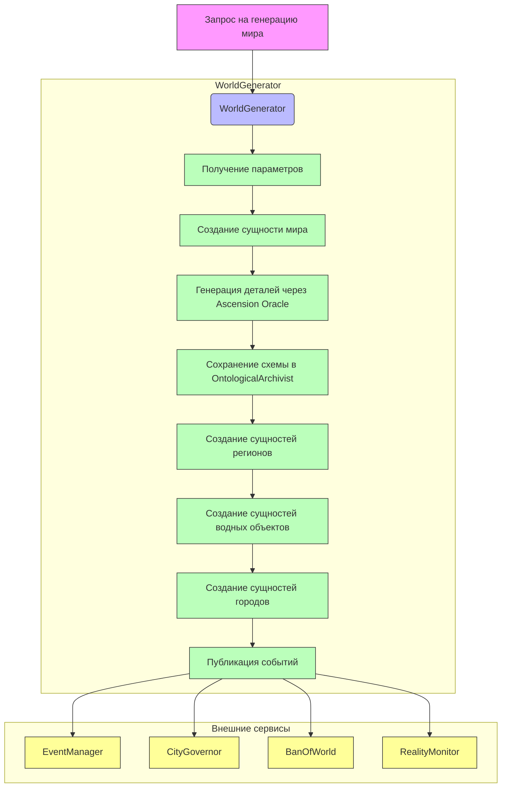

# Поток данных в WorldGenerator

## Обзор системы

WorldGenerator - это сервис, отвечающий за генерацию игровых миров с использованием Ascension Oracle. Он создает структуру мира, включая регионы, водные объекты и города, а также публикует события для других сервисов системы.

## Диаграмма потока данных



## Поток данных

### 1. Входные данные

**Запрос на генерацию мира:**
- Тип события: `world.generation.requested`
- Параметры:
  - `seed` (строка) - семя для генерации мира
  - `constraints` (объект) - ограничения для генерации

### 2. Обработка данных

**Основной процесс:**
1. Получение запроса через шину событий `system_events`
2. Создание сущности мира (world entity)
3. Генерация деталей мира через Ascension Oracle:
   - Ядро мира (core)
   - Онтология культивации (ontology)
   - Географическая структура:
     - Регионы с биомами
     - Водные объекты
     - Города с характеристиками
   - Мифология
4. Сохранение схемы в OntologicalArchivist
5. Создание сущностей для каждого элемента географии
6. Публикация результата в шине событий

### 3. Выходные данные

**События, публикуемые сервисом:**
1. `entity.created` - сущность мира
2. `entity.created` - регионы
3. `entity.created` - водные объекты
4. `entity.created` - города
5. `world.generated` - завершение генерации мира
6. `world.geography.generated` - завершение генерации географии

### 4. Взаимодействие с другими сервисами

**Входящие интеграции:**
- **UniverseGenesisOracle**: получение схемы вселенной
- **OntologicalArchivist**: сохранение сгенерированных схем
- **EntityManager**: создание сущностей мира
- **SemanticMemory**: семантический контекст для генерации
- **CityGovernor**: получает информацию о городах для управления

**Исходящие интеграции:**
- **EventManager**: получает все события для дальнейшей обработки
- **CityGovernor**: получает информацию о городах для управления
- **BanOfWorld**: отслеживает целостность мира
- **RealityMonitor**: агрегирует метрики мира

## Компоненты системы

### WorldGenerator (основной компонент)
- Обрабатывает события генерации мира
- Управляет процессом создания сущностей
- Взаимодействует с Oracle для генерации данных
- Публикует события в шине событий

### Ascension Oracle
- Генерирует детали мира на основе семени
- Возвращает структурированные данные в формате JSON

### OntologicalArchivist
- Хранит сгенерированные схемы миров
- Предоставляет интерфейс для сохранения и получения схем

### Event Bus
- Шина событий, обеспечивающая коммуникацию между сервисами
- Поддерживает различные темы событий

## Типы событий

### Входящие события:
- `world.generation.requested` - запрос на генерацию мира

### Исходящие события:
- `entity.created` - создание сущности (мир, регион, город, вода)
- `world.generated` - завершение генерации мира
- `world.geography.generated` - завершение генерации географии

## Структура данных

### WorldGeography (географическая структура мира):
```json
{
  "core": "string",
  "ontology": {
    "carriers": ["string"],
    "paths": ["string"],
    "forbidden": ["string"]
  },
  "geography": {
    "regions": [
      {
        "name": "string",
        "biome": "string",
        "coordinates": {"x": 0.0, "y": 0.0},
        "size": 0.0
      }
    ],
    "water_bodies": [
      {
        "name": "string",
        "type": "river|sea|lake",
        "coordinates": {"x": 0.0, "y": 0.0},
        "size": 0.0
      }
    ],
    "cities": [
      {
        "name": "string",
        "population": 0,
        "type": "major|minor",
        "location": {
          "region": "string",
          "coordinates": {"x": 0.0, "y": 0.0}
        }
      }
    ]
  },
  "mythology": "string"
}
```

### Сущности:
- **World**: сущность мира
- **Region**: регион с биомом
- **WaterBody**: водный объект
- **City**: город с характеристиками

## Цикл жизни процесса генерации

1. Получение события `world.generation.requested`
2. Валидация параметров запроса
3. Создание уникального ID для мира
4. Публикация события создания сущности мира
5. Генерация деталей через Oracle
6. Сохранение схемы в архиваторе
7. Создание сущностей регионов, городов и водных объектов
8. Публикация финальных событий о завершении генерации
9. Логирование успешного завершения процесса