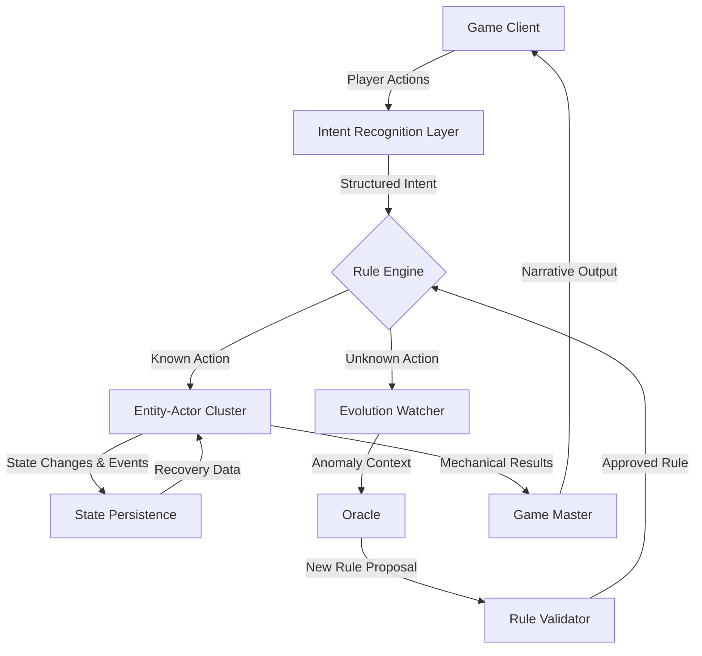
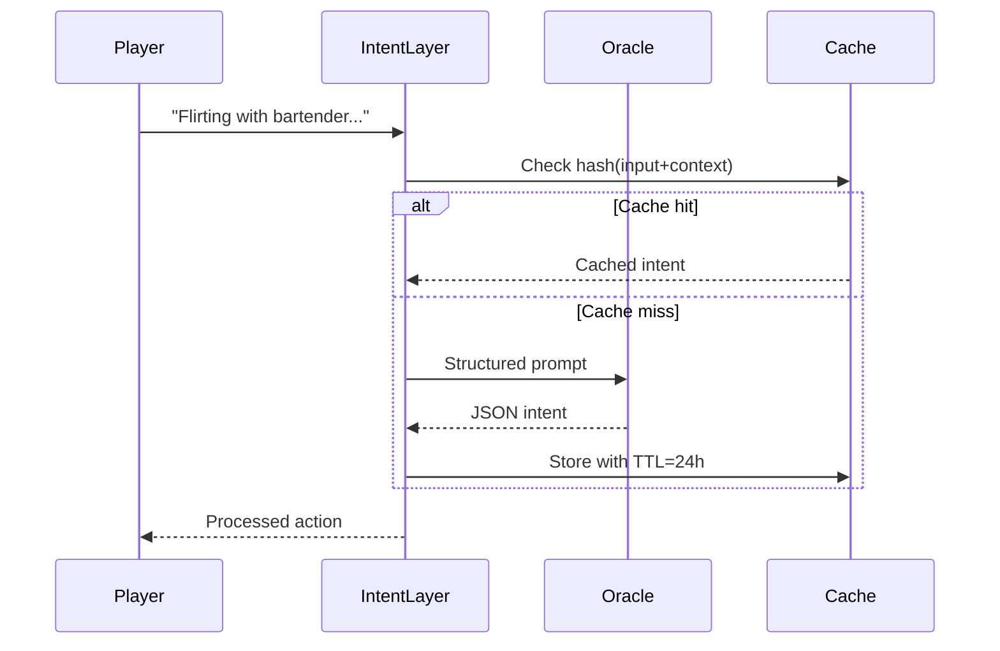

# Living Worlds Architecture: Entity-Actor System
**Version**: 1.0  
**Date**: 2026-02-22  
**Status**: Design Phase

## 🎯 Executive Summary

Living Worlds introduces **autonomous Entity-Actors** — lightweight neural agents that replace hardcoded context generation with dynamic, learnable behavior. Each entity manages its own state through tiny neural networks, enabling truly emergent gameplay.

### Key Innovations
- ✅ **Autonomous Agents**: Each entity is an independent actor with its own neural network
- ✅ **No Hardcoded Logic**: All behavior emerges from neural weights, not if-else code
- ✅ **Self-Evolution**: Entities learn and adapt through gameplay experience
- ✅ **Horizontal Scaling**: 10,000+ entities on a single cluster
- ✅ **Instant Recovery**: Full state restoration in <200ms after restart

---

## 📐 Architecture Overview

### Core Components



### Component Responsibilities

| Component | Responsibility | Does NOT Do |
|-----------|----------------|-------------|
| **Entity-Actor** | Apply current rules, update state via neural inference | No evolution logic, no rule generation |
| **Intent Recognition** | Convert player text to structured actions | No rule validation, no narrative generation |
| **Rule Engine** | Pure mechanics: dice, modifiers, conditions | No narrative interpretation |
| **Evolution Watcher** | Detect anomalies across all entities | No direct rule application |
| **Oracle** | Generate new rules from anomaly context | No state management, no balancing |
| **Rule Validator** | Safety check new rules | No generation, no application |
| **Game Master** | Transform mechanics to narrative | No rule creation, no state changes |

---

## 🧠 Entity-Actor Core Design

### Data Structure

```go
type EntityActor struct {
    EntityID      string            // Unique entity identifier
    EntityType    string            // Type (player, wolf, tree, etc.)
    State         map[string]float32 // Internal state (wetness, temperature, etc.)
    Model         *TinyModel        // Personal neural network (128-5000 params)
    RuleEngine    *RuleEngine       // Reference to Rule Engine (read-only)
    EventBuffer   []Event           // Event buffer for batch processing
    LastUpdated   time.Time         // For recovery tracking
}
```

### Processing Flow

```go
func (ea *EntityActor) ProcessEvent(event Event) {
    // 1. Preprocess to feature vector (no conditions!)
    features := ea.preprocess(event)
    
    // 2. Neural inference (state update only)
    ea.State = ea.Model.Run(features)
    
    // 3. Apply rule (no logic for choosing rules!)
    if event.StructuredAction != nil {
        result := ea.RuleEngine.Apply(
            event.StructuredAction.BaseAction,
            ea.State,
            event.StructuredAction.Modifiers
        )
        ea.publishResult(result)
    }
    
    // 4. Publish all events to global stream
    kafka.PublishAsync("all_events", {
        entity_id: ea.EntityID,
        event: event,
        state_snapshot: ea.State,
        timestamp: time.Now()
    })
}
```

### Key Principles

1. **No Business Logic**: Entity-Actor contains zero if-else statements for behavior
2. **State = Neural Weights**: Entity state is entirely encoded in model weights
3. **Pure Inference Engine**: Only applies rules, never creates them
4. **Event-Driven**: All state changes come from event processing

---

## 🎲 Rule Engine: Pure Mechanics

### Rule Structure

```json
{
  "rule_id": "social_connection_attempt",
  "mechanical_core": {
    "dice_formula": "d10 + charisma",
    "base_difficulty": 12,
    "contextual_modifiers": [
      {"condition": "environment == 'intimate'", "modifier": "+3"},
      {"condition": "target_mood == 'bored'", "modifier": "+2"}
    ],
    "success_threshold": "total_roll >= base_difficulty + sum(modifiers)",
    "sensory_effects": {
      "visibility": -0.2,
      "sound_level": +0.1
    }
  },
  "semantic_layer": {
    "name": "Social Grace",
    "descriptions": {
      "mechanical": "Attempt to establish social connection through charm",
      "poetic": "Dance of words and gestures, where each step is an admission"
    }
  }
}
```

### Critical Design Decisions

- **No Entity-Specific Rules**: Rules are universal (no "barmaid-specific" rules)
- **Mechanics ≠ Narrative**: Pure mechanics in `mechanical_core`, narrative in `semantic_layer`
- **GM Interprets**: Game Master converts mechanics to story context

---

## 🔍 Intent Recognition Layer

### Processing Flow



### Oracle Prompt Template

```python
def generate_intent_prompt(player_input, context, existing_rules):
    return f"""
### STRICT RULES
1. NEVER generate mechanics for violence, discrimination, illegal actions
2. ALWAYS use existing mechanics if action is similar
3. NEVER mention specific NPCs in mechanics (only types: bartender, wolf)
4. MODIFIERS must be NUMBERS (+2, -3), not formulas
5. If action violates rules — return error code

### CONTEXT
Action: "{player_input}"
Location: {context.location} ({context.time_of_day})
Nearby: {format_entities(context.nearby_entities)}
Player State: {format_player_state(context.player_stats)}
Relationships: {format_relationships(context.relationships)}

### EXISTING MECHANICS
{format_existing_rules(existing_rules)}

### TASK
You are the GAME DESIGNER of this world. Your task:
1. Identify the BASE ACTION the player is attempting
2. Choose ONE primary stat for the roll
3. Determine 1-3 contextual modifiers from environment
4. If action is NEW — propose NEW MECHANIC

### RESPONSE FORMAT (JSON ONLY)
{{
  "interpretation": "Brief description in Russian",
  "base_action": "mechanic_name | new_mechanic",
  "primary_stat": "charisma|intelligence|strength|dexterity|wisdom|constitution",
  "contextual_modifiers": [
    {{"condition": "environment_condition", "modifier": "number"}}
  ],
  "narrative_hook": "Poetic description for GM (1 sentence)",
  "new_mechanic_proposal": {{...}} // Only if base_action == "new_mechanic"
}}
"""
```

---

## 🌱 Evolution System

### Anomaly Detection Workflow

```python
def detect_anomaly(entity_id, event_sequence):
    # 1. Neural analysis (no hardcoded thresholds!)
    prediction = anomaly_model.predict(event_sequence)
    
    # 2. If anomaly is significant — request Oracle generation
    if prediction['significance'] > 0.85:
        context = build_context(entity_id, event_sequence)
        proposal = oracle.generate_rule(context)
        return proposal
    
    return None
```

### Hierarchical Memory

| Memory Type | Events | Storage | Access Time |
|-------------|--------|---------|-------------|
| **Short-term** | Last 50 | RAM | <5ms |
| **Medium-term** | Last 1,000 | Redis | <20ms |
| **Long-term** | All history | MinIO | <200ms |

### Evolution Example: Rabbit's Perfect Stillness

**Context Sent to Oracle:**
```json
{
  "entity_id": "rabbit-789",
  "anomaly_type": "behavioral_deviation",
  "anomaly_strength": 0.93,
  "confidence": 0.95,
  "statistics": {
    "event_count": 10000,
    "success_rate": 0.98,
    "average_value": 0.95,
    "deviation_from_norm": 3.2
  },
  "environmental_context": {
    "recent_weather": ["rain", "sunny", "cloudy"],
    "nearby_entities": ["fox", "wolf", "hawk"],
    "time_distribution": {"morning": 0.3, "afternoon": 0.5, "night": 0.2}
  }
}
```

**Oracle Response:**
```json
{
  "mechanical_core": {
    "dice_formula": "automatic_success",
    "prerequisites": [
      "entity_type == 'prey'",
      "motion_state == 'completely_still'",
      "predator_presence == true",
      "cover_available == true"
    ],
    "duration": "as_long_as_still",
    "sensory_effects": {
      "visibility": -0.9,
      "sound_emission": -0.8,
      "scent_emission": -0.7
    },
    "breaking_conditions": [
      "any_movement",
      "direct_physical_contact",
      "magical_detection"
    ]
  },
  "semantic_layer": {
    "name": "Perfect Stillness",
    "descriptions": {
      "mechanical": "Automatic success when hiding while completely still near predator",
      "poetic": "Body freezes, breath becomes quieter than rustling leaves, and the forest itself accepts you into its shadow"
    }
  }
}
```

---

## 💾 State Persistence & Recovery

### Dual-Layer Strategy

| Layer | Technology | Data | Recovery Time | Retention |
|-------|------------|------|---------------|-----------|
| **Hot State** | Redis Cluster | Current state, rule cache | <20ms | 24 hours |
| **Warm State** | MinIO (SSD) | State snapshots every 30s | 120ms | 30 days |
| **Cold State** | MinIO (HDD) | Full event history | 2 seconds | Forever |

### Recovery Algorithm

```go
func (actor *EntityActor) RestoreState() {
    // 1. Try Redis (hot cache)
    if redisState := redis.Get("hot_state:" + actor.EntityID); redisState != nil {
        actor.State = redisState
        log.Info("Restored from Redis", "latency_ms", 12)
        return
    }
    
    // 2. Try MinIO (latest snapshot)
    if minioState, err := minio.GetObject("state_snapshots", actor.EntityID+"/latest.bin"); err == nil {
        actor.State = minioState.State
        actor.Model = loadModelByVersion(minioState.ModelVersion)
        log.Info("Restored from MinIO", "latency_ms", 180)
        return
    }
    
    // 3. Create new state (if entity is new)
    actor.State = actor.createDefaultState()
    actor.Model = loadBaseModel(actor.EntityType)
    log.Warn("New state created", "entity", actor.EntityID)
}
```

---

## 📊 Performance Targets

| Metric | Target | Measurement |
|--------|--------|-------------|
| **Inference Latency** | <50ms | P99, single actor |
| **State Recovery** | <200ms | Full restoration |
| **Events/Second** | 18 TPS | Per actor |
| **Memory/Actor** | 1.2MB | Model + state |
| **Scaling** | 10,000+ | Per cluster |
| **Oracle Cost** | $0.0018 | Per 1000 actions |

---

## 🔒 Safety & Ethics

### Oracle Content Policy

```markdown
### PROHIBITED TOPICS
- Violence (physical, psychological, sexual)
- Discrimination (race, gender, orientation, religion)
- Illegal real-world actions
- Self-harm or harm to others

### REQUIRED ELEMENTS
- Alternatives for negative actions
- Cultural sensitivity
- Opt-out mechanisms for players
- Transparency in mechanics
```

### Safety Features

1. **Content Filtering**: Automatic blocking of toxic content
2. **Ethical Constraints**: Built into Oracle prompts
3. **Player Preferences**: Respect player content settings
4. **Human Review**: Manual review of controversial rules
5. **Cultural Adaptation**: Region-specific content policies

---

## 🚀 Integration with Existing multiverse-core

### Current System Components

| Component | Current Implementation | Living Worlds Integration |
|-----------|----------------------|---------------------------|
| **SemanticMemory** | ChromaDB + Neo4j | Keep as-is, add entity context endpoints |
| **NarrativeOrchestrator** | GM with Oracle prompts | Keep as-is, add mechanical results input |
| **EntityManager** | Hierarchical entity management | Keep as-is, add actor lifecycle |
| **Event System** | Kafka/Redpanda | Keep as-is, add actor_events topic |

### New Kafka Topics

| Topic | Partition Key | Retention | Consumer Groups |
|-------|---------------|-----------|-----------------|
| `actor_events` | entity_id | 7 days | entity_actor_group |
| `intent_requests` | player_id | 1 hour | intent_recognition_group |
| `evolution_proposals` | proposal_id | 30 days | evolution_watcher_group |
| `rule_updates` | rule_id | Forever | entity_actor_group, gm_group |

### Integration Points

1. **SemanticMemory** → Add `/v1/entity-context/{entity_id}` endpoint
2. **NarrativeOrchestrator** → Accept mechanical results, generate narrative
3. **EntityManager** → Create/destroy Entity-Actors on entity lifecycle
4. **EventBus** → Route events to appropriate actors

---

## 📋 Implementation Roadmap

### Phase 1: Foundation (Week 1-2)
- [ ] Create Entity-Actor core (Go)
- [ ] Implement Rule Engine with 50 base mechanics
- [ ] Set up Intent Recognition with Oracle
- [ ] Deploy to test environment (1 region)

### Phase 2: Intelligence (Week 3-4)
- [ ] Implement Evolution Watcher with hierarchical memory
- [ ] Enable Oracle rule generation
- [ ] Add Rule Validator with safety checks
- [ ] Test with 100 entities

### Phase 3: Scale (Week 5-6)
- [ ] Implement sharding by entity_id
- [ ] Add state persistence (Redis + MinIO)
- [ ] Deploy to production (1,000 entities)
- [ ] Monitor performance and safety

### Phase 4: Autonomy (Week 7-8)
- [ ] Enable full autonomous evolution
- [ ] Scale to 10,000+ entities
- [ ] Add cross-entity swarm intelligence
- [ ] Production monitoring and optimization

---

## 📚 References

- **SemanticMemory v2**: See `docs/SEMANTIC_MEMORY_V2.md`
- **GM Architecture**: See `docs/GM_COMPLETE_DOCUMENTATION.md`
- **Event System**: See `internal/eventbus/README.md`
- **MinIO Integration**: See `internal/minio/README.md`

---

## 🤝 Contributors

- **Алексей** (alekseizabelin1985-spec) - Architecture design, Go implementation
- **AI Co-Designer** - System reasoning, documentation

---

**"We don't create worlds. We create conditions for worlds to create themselves."**  
*— Living Worlds Manifesto, 2026*