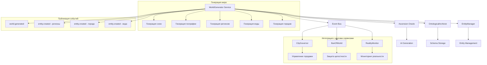

# 🌍 Архитектура WorldGenerator

## Обновленная архитектура генератора мира

## Поток данных

1. **Запрос на генерацию мира**:
   - Получение события `world.generate` через Event Bus
   - Извлечение параметров генерации

2. **Генерация схем**:
   - Запрос схем у UniverseGenesisOracle
   - Сохранение схем через OntologicalArchivist

3. **Генерация географической структуры**:
   - Вызов Ascension Oracle для генерации:
     - Регионов с биомами
     - Водных объектов
     - Городов с характеристиками
   - Создание сущностей через EntityManager

4. **Публикация результатов**:
   - Событие `world.generated` в Event Bus
   - События `entity.created` для регионов, городов и воды
   - Интеграция с CityGovernor для управления городами

## Типы генерируемых сущностей

- **Регионы** (entity_type: region):
  - Название
  - Биом (лес, горы, поля, пустыня, болото и т.д.)
  - Координаты
  - Размер

- **Водные объекты** (entity_type: water_body):
  - Название
  - Тип (река, море, озеро)
  - Координаты
  - Размер

- **Города** (entity_type: city):
  - Название
  - Население
  - Тип (большой/маленький)
  - Расположение (регион, координаты)
  - Базовые характеристики

## Интеграция с другими сервисами

- **CityGovernor**: получает информацию о городах для управления
- **EntityManager**: создает сущности мира
- **BanOfWorld**: отслеживает целостность мира
- **RealityMonitor**: агрегирует метрики мира

## Тестирование

Для тестирования функциональности генерации мира можно использовать следующие подходы:

1. **Автоматическое тестирование** - отправка тестовых событий через Kafka
2. **Ручное тестирование** - использование скриптов для отправки событий
3. **Интеграционное тестирование** - проверка взаимодействия с другими сервисами

См. подробности в [руководстве по тестированию](../docs/world-generator/world_generation_testing_guide.md) и [инструкции по отправке тестовых событий](../docs/world-generator/world_generation_test_script.md).